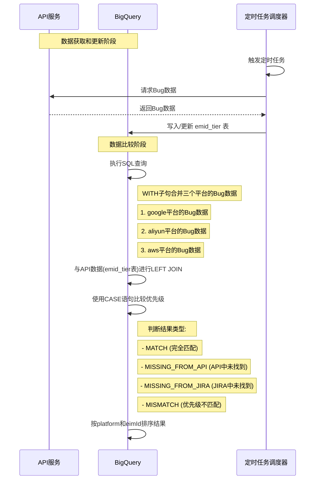
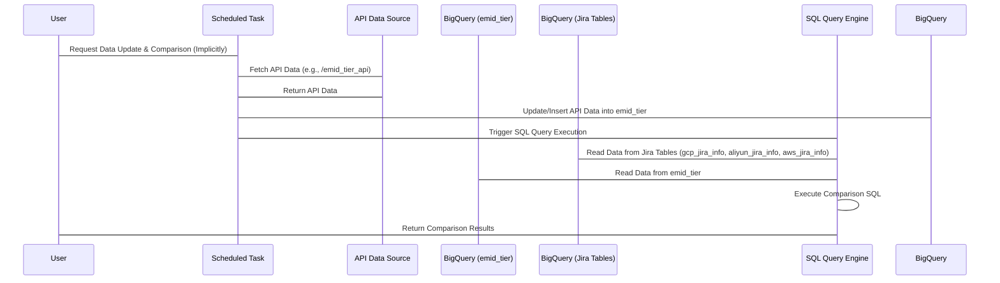

- flow

---


```bash
#!/bin/bash
# 文件路径
EIMID_FILE="eimld-uniq.txt"
# 输出文件
OUTPUT_FILE="output.txt"
# 未找到数据的记录文件
NOT_FOUND_FILE="not_found.txt"

# 检查输入文件是否存在
if [ ! -f "$EIMID_FILE" ]; then
    echo "错误：输入文件 $EIMID_FILE 不存在"
    exit 1
fi

# 清空输出文件
> "$OUTPUT_FILE"
> "$NOT_FOUND_FILE"

# 读取 eimld-uniq.txt 文件中的每一行
while IFS= read -r eimld; do
    echo "Processing eimld: $eimld"
    
    # 使用 eimld 获取 ServiceId
    response=$(curl -s -X 'GET' \
        "https://apiurl/v2/appId=$eimld&ServiceId=-1" \
        -H 'accept: application/json')
    
    # 检查curl是否成功执行
    if [ $? -ne 0 ]; then
        echo "错误：API调用失败 - $eimld"
        echo "$eimld,API_CALL_FAILED" >> "$NOT_FOUND_FILE"
        continue
    fi
    
    # 检查response是否为空
    if [ -z "$response" ]; then
        echo "错误：API返回空响应 - $eimld"
        echo "$eimld,EMPTY_RESPONSE" >> "$NOT_FOUND_FILE"
        continue
    fi
    
    ServiceId=$(echo "$response" | jq -r '.results[0].ServiceId')
    
    if [ "$ServiceId" != "null" ] && [ ! -z "$ServiceId" ]; then
        echo "ServiceId: $ServiceId"
        
        # 使用 ServiceId 获取 pladaCriticality
        response=$(curl -s -X 'GET' \
            "https://apiurl/v1/$ServiceId" \
            -H 'accept: application/json')
        
        pladaCriticality=$(echo "$response" | jq -r '.results[0].pladaCriticality')
        
        if [ "$pladaCriticality" != "null" ] && [ ! -z "$pladaCriticality" ]; then
            echo "pladaCriticality: $pladaCriticality"
            # 将结果写入输出文件
            echo "$eimld,$ServiceId,$pladaCriticality" >> "$OUTPUT_FILE"
        else
            echo "pladaCriticality not found for ServiceId: $ServiceId"
            echo "$eimld,$ServiceId,NO_CRITICALITY" >> "$NOT_FOUND_FILE"
        fi
    else
        echo "ServiceId not found for eimld: $eimld"
        echo "$eimld,NO_SERVICE_ID" >> "$NOT_FOUND_FILE"
    fi
done < "$EIMID_FILE"

echo "处理完成。"
echo "成功结果保存在: $OUTPUT_FILE"
echo "未找到数据的记录保存在: $NOT_FOUND_FILE"
```