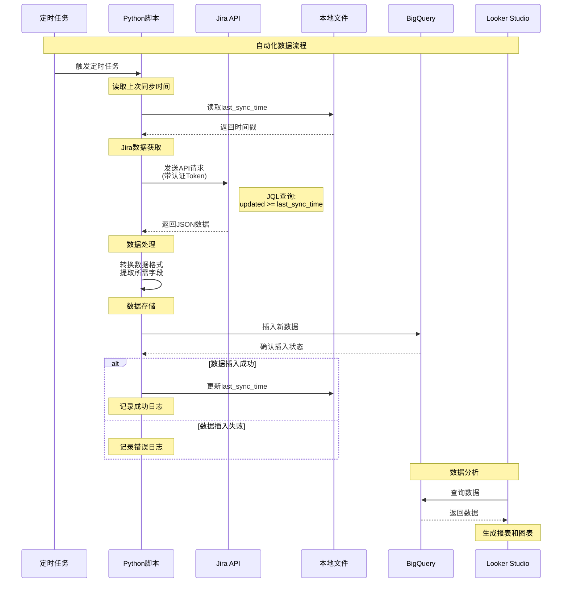

- [Question](#question)
  - [Flow](#flow)
- [ChatGPT](#chatgpt)
  - [对于 Jira 中描述字段这种多值且顺序不固定的情况](#对于-jira-中描述字段这种多值且顺序不固定的情况)
    - [方案1：JSON数组存储（推荐）](#方案1json数组存储推荐)
    - [方案2：分解为多行](#方案2分解为多行)
    - [建议选择：](#建议选择)
    - [实现示例：](#实现示例)
    - [使用建议：](#使用建议)
- [Claude](#claude)
  - [企业用户?](#企业用户)
- [Gemini](#gemini)
- [Grok3](#grok3)
  - [Summary](#summary)
  - [在 Google Data Studio 中分析](#在-google-data-studio-中分析)
  - [准备工作](#准备工作)
  - [Grok3 Step2](#grok3-step2)
- [Claude](#claude-1)
    - [1. Jira数据自动获取](#1-jira数据自动获取)
    - [2. 导入 BigQuery](#2-导入-bigquery)
    - [3. Google Data Studio (现在叫 Looker Studio) 分析](#3-google-data-studio-现在叫-looker-studio-分析)
    - [自动化流程](#自动化流程)
    - [注意事项：](#注意事项)
  - [解决方案概述](#解决方案概述)
  - [具体步骤](#具体步骤)
    - [第一步：自动从 Jira 获取数据](#第一步自动从-jira-获取数据)
      - [1. 获取 Jira API Token](#1-获取-jira-api-token)
      - [2. 编写 Python 脚本调用 Jira REST API](#2-编写-python-脚本调用-jira-rest-api)
      - [关键点解释：](#关键点解释)
      - [3. 保存提取的数据](#3-保存提取的数据)
    - [第二步：将数据加载到 Google BigQuery](#第二步将数据加载到-google-bigquery)
      - [1. 设置 Google Cloud 环境](#1-设置-google-cloud-环境)
      - [2. 编写加载脚本](#2-编写加载脚本)
      - [注意：](#注意)
    - [第三步：自动化执行](#第三步自动化执行)
      - [1. 使用 Google Cloud Functions 和 Cloud Scheduler](#1-使用-google-cloud-functions-和-cloud-scheduler)
      - [2. 替代方案：本地调度](#2-替代方案本地调度)
      - [3. 动态更新时间戳](#3-动态更新时间戳)
    - [第四步：使用 Google Looker Studio 进行分析](#第四步使用-google-looker-studio-进行分析)
  - [优势与注意事项](#优势与注意事项)
    - [优势](#优势)
    - [注意事项](#注意事项-1)
  - [总结](#总结)

# Question
我现在有这样一个需求
1 通过Jira的过滤条件，获取到我想要的一些Jira的信息,比如标题.里面关键字段的信息 我手动是可以导出为csv或者xml文件的
    如果想自动获取这些企业内部自己的Jira数据,那么有什么好的解决办法?可能需要登录或者拿到对应的Token才能通过过滤条件获取到这些数据
2 我想将对应的数据插入到Google的igquery中
3 然后通过Google的Looker Studio来做一些统计分析
请帮我提供对应的解决办法,特别是第一步这个操作?
我的任务有些不太一样.需要提供的不是一个一次性任务的导出方式?其实我更期待是这样的工作方式. 比如我有一个计划任务,查询一段时间的Jira Tickets,然后通过我的过滤条件,拿到我想要的数据,把数据灌入到Bigquery里面.这样能实现一个简单的自动化步骤.相当于一个增量的过程.
帮我Review这个流量我现在有这样一个问题,我的JQL查询出来的都是一些比如key对应的value多数都是一对一,或者一对多比较有规律的.但是偶尔会有比如一个Key叫Describtion 里面对应来value1 value2 value3其三个值可能存在排序不一致的问题,那么我放入到bigquery里面 怎么记录比较好.因为后面我可能需要拿这些条件去写SQL 我是直接插入数据的时候去判断还是写SQL的时候来单独处理?
而且我这同一个在不同的时间运行的时候,可能拿到的数据不一样,因为比如我原来的Jira Tickets会更新字段和状态.而这个语句拿到是当前的Jira Tickets的状态.

## Flow
- 序列图来展示这个 Jira 数据采集到分析的完整流程：


流程说明：

1. **定时触发**
   - Cron 任务定期触发 Python 脚本
   - 可以设置为每小时、每天等频率

2. **增量同步控制**
   - 读取上次同步时间
   - 用于 JQL 查询条件，只获取新数据

3. **数据获取**
   - 使用 Jira API Token 认证
   - 通过 JQL 过滤获取所需数据
   - 返回 JSON 格式的 Jira 数据

4. **数据处理与存储**
   - 转换数据格式
   - 插入 BigQuery
   - 更新同步时间记录

5. **数据分析**
   - Looker Studio 连接 BigQuery
   - 实时查询和可视化数据

这个自动化流程确保了：
1. 数据增量更新
2. 错误处理和日志记录
3. 数据实时分析能力


# ChatGPT 
要实现你描述的自动化流程，基本步骤如下：

1. 通过Jira API自动获取数据

Jira 提供了一个 REST API，可以通过它获取与过滤条件相关的 Jira 数据。你可以使用以下步骤来进行自动化查询：
	•	步骤1: 获取 Jira API Token
你需要在 Jira 中生成一个 API Token 来进行身份验证。可以在 [Atlassian的账户](https://id.atlassian.com/manage-profile/security)设置中生成一个 Token。
	•	步骤2: 配置API请求
使用 GET /rest/api/2/search 端点来查询符合过滤条件的 Jira 数据。你可以通过指定 JQL（Jira Query Language）来定义过滤条件。
例如，假设你想获取所有在过去一周内创建的 Tickets：
```bash
curl -u username:API_Token \
     -X GET \
     'https://your-jira-domain.atlassian.net/rest/api/2/search?jql=created>=-1w'
```
你可以将 JQL 替换为你需要的条件，返回的结果是一个 JSON 格式的数据，你可以从中提取所需的信息。

	•	步骤3: 定期查询
你可以使用 Cron Job 来设置定期查询。也可以编写一个 Python 脚本来自动化该过程。

2. 将数据插入到 Google BigQuery

一旦你从 Jira 获取到数据，你可以将其通过 BigQuery API 插入到一个表中。以下是如何在 Python 中插入数据的简要步骤：
	•	步骤1: 安装 Google Cloud 客户端库

pip install google-cloud-bigquery


	•	步骤2: 将数据上传到 BigQuery
你可以将从 Jira 获取的 JSON 数据转换为合适的格式，然后将其插入到 BigQuery。
示例代码：
```python
from google.cloud import bigquery
import json

# BigQuery client
client = bigquery.Client()

# 配置BigQuery表信息
dataset_id = 'your-project-id.your-dataset'
table_id = f'{dataset_id}.your-table'

# 从Jira返回的数据（假设是JSON格式）
jira_data = [
    {"ticket_id": "ABC-123", "summary": "Sample Ticket", "status": "Open", "created_at": "2025-01-01"},
    {"ticket_id": "ABC-124", "summary": "Another Ticket", "status": "Closed", "created_at": "2025-01-02"}
]

# 载入数据到BigQuery
errors = client.insert_rows_json(table_id, jira_data)
if errors:
    print(f'Error: {errors}')
else:
    print('Data successfully inserted!')
```

	•	步骤3: 定期插入数据
你可以将这个步骤与查询 Jira 数据的脚本结合，作为 Cron Job 定期运行，确保数据的增量更新。

3. 通过 Google Looker Studio 进行分析

一旦数据在 BigQuery 中，你可以通过 Looker Studio（以前的 Google Data Studio）连接到你的 BigQuery 数据集，创建报表和图表，进行统计和分析。
	•	连接 BigQuery 数据源。
	•	创建仪表板和报表，选择你需要的字段（如 Jira Ticket 的状态、创建时间等）进行分析。

4. 增量更新

为了实现增量更新，你可以在查询 Jira 数据时设置适当的日期范围，比如每次查询上次查询时间到现在的数据，并且将新的数据插入 BigQuery 表。可以通过以下方式实现：
	•	步骤1: 记录上次查询时间，可以将其存储在 BigQuery 表或本地文件中。
	•	步骤2: 在查询 Jira 时，确保只查询自上次查询时间之后的数据。
	•	步骤3: 将新数据插入到 BigQuery 表，避免重复插入已存在的数据。

通过这种方式，你可以确保 Jira 数据在 BigQuery 中是增量更新的，而不是一次性全量导入。

其他建议：
	•	错误处理与日志记录：确保在脚本中加入错误处理，记录日志，以便在自动化流程出现问题时能够及时发现并解决。
	•	安全性：API Token 需要保密，可以使用环境变量或 Secret Manager 来存储这些敏感信息。

这样，你就能通过定期查询 Jira，自动化地将数据插入到 BigQuery，并通过 Looker Studio 进行分析和可视化。

## 对于 Jira 中描述字段这种多值且顺序不固定的情况

对于 Jira 中描述字段这种多值且顺序不固定的情况，我建议采用以下方案：

1. **数据存储方案**

```sql
-- BigQuery 表结构设计
CREATE TABLE `your-project.dataset.jira_issues` (
  issue_key STRING,
  summary STRING,
  status STRING,
  -- 方案1：JSON数组存储
  description_values JSON,
  -- 方案2：分解为多行
  description_value STRING,
  description_order INT64,
  -- 其他字段...
  created_at TIMESTAMP,
  updated_at TIMESTAMP
);
```

2. **处理策略**

推荐采用以下两种方案之一：

### 方案1：JSON数组存储（推荐）
```python
# Python处理代码
def process_description_values(issue):
    description_values = issue.fields.description.split()  # 假设按空格分割
    # 排序后存储，确保一致性
    sorted_values = sorted(description_values)
    return json.dumps(sorted_values)

# 插入BigQuery时
row = {
    'issue_key': issue.key,
    'description_values': process_description_values(issue),
    # 其他字段...
}
```

查询时可以使用 BigQuery 的 JSON 函数：
```sql
-- 查询示例
SELECT 
  issue_key,
  JSON_VALUE_ARRAY(description_values) as values
FROM `your-project.dataset.jira_issues`
WHERE JSON_VALUE_ARRAY(description_values) LIKE '%value1%';
```

### 方案2：分解为多行
```python
# Python处理代码
def process_description_values(issue):
    description_values = issue.fields.description.split()
    rows = []
    for idx, value in enumerate(sorted(description_values)):
        rows.append({
            'issue_key': issue.key,
            'description_value': value,
            'description_order': idx,
            # 其他字段复制...
        })
    return rows

# 插入BigQuery时
rows_to_insert = []
for issue in issues:
    rows_to_insert.extend(process_description_values(issue))
```

查询时：
```sql
-- 查询示例
SELECT DISTINCT issue_key
FROM `your-project.dataset.jira_issues`
WHERE description_value = 'value1';
```

### 建议选择：

1. 如果主要是**整体查询**和**简单过滤**，选择**方案1（JSON数组）**：
   - 优点：存储空间小，查询简单
   - 缺点：复杂查询需要解析JSON

2. 如果需要**频繁按值过滤**或**复杂统计**，选择**方案2（分解多行）**：
   - 优点：查询灵活，支持复杂统计
   - 缺点：存储空间大，数据量增加

### 实现示例：

```python
from google.cloud import bigquery
import json

class JiraDataProcessor:
    def __init__(self, client):
        self.client = client

    def process_and_insert(self, issues, method='json'):
        if method == 'json':
            rows = self._process_json_method(issues)
            table_id = 'your-project.dataset.jira_issues'
        else:
            rows = self._process_decompose_method(issues)
            table_id = 'your-project.dataset.jira_issues_decomposed'
            
        errors = self.client.insert_rows_json(table_id, rows)
        if errors:
            raise Exception(f"插入错误: {errors}")

    def _process_json_method(self, issues):
        rows = []
        for issue in issues:
            description_values = self._extract_description_values(issue)
            rows.append({
                'issue_key': issue.key,
                'description_values': json.dumps(sorted(description_values)),
                # 其他字段...
            })
        return rows

    def _process_decompose_method(self, issues):
        rows = []
        for issue in issues:
            description_values = self._extract_description_values(issue)
            for idx, value in enumerate(sorted(description_values)):
                rows.append({
                    'issue_key': issue.key,
                    'description_value': value,
                    'description_order': idx,
                    # 其他字段...
                })
        return rows

    def _extract_description_values(self, issue):
        # 根据实际Jira字段格式调整提取逻辑
        return issue.fields.description.split()
```

### 使用建议：

1. **在数据插入时处理**（推荐）：
   - 保证数据一致性
   - 减少查询时的复杂度
   - 提高查询性能

2. **查询时处理**的场景：
   - 当处理逻辑经常变化
   - 需要保留原始数据以供其他用途
   - 存储空间受限


# Claude
我来帮你设计一个自动化的解决方案。让我们分步骤来实现这个需求。
```python
from jira import JIRA
from google.cloud import bigquery
import pandas as pd
from datetime import datetime, timedelta
import pytz
import logging
import os

class JiraToBigQueryPipeline:
    def __init__(self, jira_config, bigquery_config):
        """
        初始化数据管道
        
        Args:
            jira_config (dict): Jira配置信息
            bigquery_config (dict): BigQuery配置信息
        """
        self.jira = JIRA(
            server=jira_config['server'],
            basic_auth=(jira_config['email'], jira_config['api_token'])
        )
        
        self.bigquery_client = bigquery.Client(project=bigquery_config['project_id'])
        self.dataset_id = bigquery_config['dataset_id']
        self.table_id = bigquery_config['table_id']
        
        self.logger = self._setup_logging()

    def _setup_logging(self):
        """设置日志"""
        logger = logging.getLogger('JiraPipeline')
        logger.setLevel(logging.INFO)
        handler = logging.StreamHandler()
        formatter = logging.Formatter('%(asctime)s - %(name)s - %(levelname)s - %(message)s')
        handler.setFormatter(formatter)
        logger.addHandler(handler)
        return logger

    def fetch_jira_issues(self, jql_query, fields):
        """
        获取Jira问题
        
        Args:
            jql_query (str): JQL查询语句
            fields (list): 需要获取的字段列表
        
        Returns:
            list: 包含问题数据的列表
        """
        try:
            issues = []
            start_at = 0
            max_results = 100

            while True:
                results = self.jira.search_issues(
                    jql_query,
                    startAt=start_at,
                    maxResults=max_results,
                    fields=fields
                )
                
                if len(results) == 0:
                    break

                for issue in results:
                    issue_dict = {
                        'key': issue.key,
                        'created_at': issue.fields.created,
                        'updated_at': issue.fields.updated,
                        'status': issue.fields.status.name,
                        'summary': issue.fields.summary
                    }
                    
                    # 添加自定义字段
                    for field in fields:
                        if field not in ['key', 'created', 'updated', 'status', 'summary']:
                            field_value = getattr(issue.fields, field, None)
                            issue_dict[field] = str(field_value) if field_value else None

                    issues.append(issue_dict)

                start_at += len(results)
                if len(results) < max_results:
                    break

            return issues

        except Exception as e:
            self.logger.error(f"获取Jira数据时发生错误: {str(e)}")
            raise

    def upload_to_bigquery(self, data):
        """
        将数据上传到BigQuery
        
        Args:
            data (list): 要上传的数据
        """
        try:
            df = pd.DataFrame(data)
            
            # 转换时间戳
            for col in ['created_at', 'updated_at']:
                df[col] = pd.to_datetime(df[col])

            # 配置BigQuery作业
            job_config = bigquery.LoadJobConfig(
                write_disposition=bigquery.WriteDisposition.WRITE_APPEND,
                schema_update_options=[
                    bigquery.SchemaUpdateOption.ALLOW_FIELD_ADDITION
                ]
            )

            # 上传数据
            table_ref = f"{self.bigquery_client.project}.{self.dataset_id}.{self.table_id}"
            job = self.bigquery_client.load_table_from_dataframe(
                df, table_ref, job_config=job_config
            )
            job.result()  # 等待作业完成

            self.logger.info(f"成功上传 {len(data)} 条记录到BigQuery")

        except Exception as e:
            self.logger.error(f"上传到BigQuery时发生错误: {str(e)}")
            raise

    def run_pipeline(self, jql_query, fields):
        """
        运行完整的数据管道
        
        Args:
            jql_query (str): JQL查询语句
            fields (list): 需要获取的字段列表
        """
        try:
            self.logger.info("开始运行数据管道...")
            
            # 获取Jira数据
            issues = self.fetch_jira_issues(jql_query, fields)
            self.logger.info(f"成功获取 {len(issues)} 个Jira问题")
            
            # 上传到BigQuery
            if issues:
                self.upload_to_bigquery(issues)
            
            self.logger.info("数据管道运行完成")
            
        except Exception as e:
            self.logger.error(f"运行数据管道时发生错误: {str(e)}")
            raise

# 使用示例
if __name__ == "__main__":
    # Jira配置
    jira_config = {
        'server': 'https://your-domain.atlassian.net',
        'email': 'your-email@company.com',
        'api_token': 'your-api-token'
    }
    
    # BigQuery配置
    bigquery_config = {
        'project_id': 'your-project-id',
        'dataset_id': 'your_dataset',
        'table_id': 'jira_issues'
    }
    
    # 创建管道实例
    pipeline = JiraToBigQueryPipeline(jira_config, bigquery_config)
    
    # 定义JQL查询和需要的字段
    jql_query = 'project = "YOUR-PROJECT" AND updated >= -7d'
    fields = ['key', 'summary', 'status', 'created', 'updated', 'customfield_10000']
    
    # 运行管道
    pipeline.run_pipeline(jql_query, fields)

```

我已经创建了一个完整的Python脚本来实现你的需求。这个解决方案提供了以下功能：

1. **Jira数据获取**:
   - 使用JIRA Python库进行认证和数据获取
   - 支持自定义JQL查询条件
   - 可以指定需要获取的字段
   - 支持分页获取大量数据
   - 处理自定义字段

2. **数据处理和上传**:
   - 将Jira数据转换为适合BigQuery的格式
   - 支持增量更新
   - 自动处理时间戳转换
   - 错误处理和日志记录

3. **自动化设置**:
要实现自动化运行，你可以：
1. 使用cron job (Linux/Mac) 或 Task Scheduler (Windows)
2. 或者使用Airflow等工具来调度这个脚本

你需要安装以下依赖：
```bash
pip install jira google-cloud-bigquery pandas pytz
```

要使用这个脚本，你需要：
1. Jira API Token (从Atlassian账户设置获取)
2. BigQuery服务账号凭证
3. 配置好相应的参数（Jira服务器地址、项目信息等）

你觉得这个方案如何？需要我详细解释某个部分吗？或者需要针对特定的Jira字段或查询条件进行调整？
## 企业用户?
对于企业内部环境的限制，这是一个很好的考虑。我们可以使用更基础的 HTTP 请求方式来实现 Jira 的数据获取，这样可以减少对外部库的依赖。


```python
import requests
import json
import base64
from datetime import datetime
import logging
from urllib.parse import quote
from typing import Dict, List, Optional

class JiraAPIClient:
    def __init__(self, 
                 jira_base_url: str,
                 username: str,
                 api_token: str):
        """
        初始化Jira API客户端
        
        Args:
            jira_base_url: Jira服务器基础URL
            username: Jira用户名/邮箱
            api_token: Jira API令牌
        """
        self.base_url = jira_base_url.rstrip('/')
        self.auth_header = self._create_auth_header(username, api_token)
        self.session = requests.Session()
        self.session.headers.update({
            'Authorization': self.auth_header,
            'Content-Type': 'application/json',
            'Accept': 'application/json'
        })
        
        self.logger = self._setup_logging()

    def _setup_logging(self):
        """设置日志记录"""
        logger = logging.getLogger('JiraAPI')
        logger.setLevel(logging.INFO)
        handler = logging.StreamHandler()
        formatter = logging.Formatter('%(asctime)s - %(name)s - %(levelname)s - %(message)s')
        handler.setFormatter(formatter)
        logger.addHandler(handler)
        return logger

    def _create_auth_header(self, username: str, api_token: str) -> str:
        """
        创建Basic认证头
        """
        auth_string = f"{username}:{api_token}"
        auth_bytes = auth_string.encode('ascii')
        base64_bytes = base64.b64encode(auth_bytes)
        return f'Basic {base64_bytes.decode("ascii")}'

    def _make_request(self, 
                     method: str, 
                     endpoint: str, 
                     params: Optional[Dict] = None, 
                     data: Optional[Dict] = None) -> Dict:
        """
        发送HTTP请求到Jira API
        
        Args:
            method: HTTP方法 (GET, POST等)
            endpoint: API端点
            params: URL参数
            data: 请求体数据
        """
        url = f"{self.base_url}{endpoint}"
        
        try:
            response = self.session.request(
                method=method,
                url=url,
                params=params,
                json=data
            )
            
            response.raise_for_status()
            return response.json()
            
        except requests.exceptions.RequestException as e:
            self.logger.error(f"API请求失败: {str(e)}")
            if hasattr(e.response, 'text'):
                self.logger.error(f"错误详情: {e.response.text}")
            raise

    def search_issues(self, 
                     jql: str, 
                     fields: List[str], 
                     start_at: int = 0, 
                     max_results: int = 50) -> Dict:
        """
        搜索Jira问题
        
        Args:
            jql: JQL查询语句
            fields: 需要返回的字段列表
            start_at: 分页起始位置
            max_results: 每页结果数量
        """
        endpoint = "/rest/api/2/search"
        params = {
            'jql': jql,
            'fields': ','.join(fields),
            'startAt': start_at,
            'maxResults': max_results
        }
        
        return self._make_request('GET', endpoint, params=params)

    def get_all_issues(self, 
                      jql: str, 
                      fields: List[str]) -> List[Dict]:
        """
        获取所有匹配的问题
        
        Args:
            jql: JQL查询语句
            fields: 需要返回的字段列表
        """
        all_issues = []
        start_at = 0
        max_results = 50
        
        while True:
            response = self.search_issues(jql, fields, start_at, max_results)
            issues = response.get('issues', [])
            
            if not issues:
                break
                
            all_issues.extend(issues)
            
            total = response.get('total', 0)
            if start_at + len(issues) >= total:
                break
                
            start_at += len(issues)
            
        return all_issues

    def get_field_mappings(self) -> Dict[str, str]:
        """
        获取字段ID和名称的映射
        """
        endpoint = "/rest/api/2/field"
        response = self._make_request('GET', endpoint)
        return {field['id']: field['name'] for field in response}

# 使用示例
def main():
    # 配置
    jira_config = {
        'base_url': 'https://your-domain.atlassian.net',
        'username': 'your-email@company.com',
        'api_token': 'your-api-token'
    }
    
    # 创建客户端
    client = JiraAPIClient(**jira_config)
    
    try:
        # 获取字段映射（可选）
        field_mappings = client.get_field_mappings()
        print("字段映射:", json.dumps(field_mappings, indent=2, ensure_ascii=False))
        
        # 定义查询
        jql = 'project = "YOUR-PROJECT" AND updated >= -7d'
        fields = ['key', 'summary', 'status', 'created', 'updated', 'customfield_10000']
        
        # 获取数据
        issues = client.get_all_issues(jql, fields)
        print(f"获取到 {len(issues)} 个问题")
        
        # 处理数据
        for issue in issues:
            # 这里可以添加数据处理逻辑
            print(f"问题 {issue['key']}: {issue['fields']['summary']}")
            
    except Exception as e:
        logging.error(f"发生错误: {str(e)}")

if __name__ == "__main__":
    main()

```

这个新的实现方案有以下几个主要优点：

1. **最小依赖**：
   - 只使用 `requests` 库进行 HTTP 请求
   - 如果连 `requests` 也不能使用，可以改用 Python 标准库中的 `urllib.request`

2. **基础功能**：
   - 支持 Basic 认证
   - 实现分页获取数据
   - 支持自定义 JQL 查询
   - 支持字段映射获取

3. **安全性**：
   - 使用 HTTPS 进行安全通信
   - 支持 API Token 认证
   - 可以轻松集成企业内部的认证机制

4. **可扩展性**：
   - 易于添加新的 API 端点
   - 可以根据需求自定义错误处理
   - 支持会话重用以提高性能

如果需要改用标准库 `urllib.request`，我可以提供相应的实现版本。此外，你可能还需要：

1. 将这个基础实现与之前的 BigQuery 上传逻辑结合
2. 添加更多的错误重试机制
3. 实现更多的 Jira API 端点
4. 添加企业特定的认证方式

你觉得这个方案如何？需要我对某些部分进行调整或详细解释吗？

# Gemini
好的，明白了你的需求。你的目标是自动化地从 Jira 获取数据，然后将其导入 Google BigQuery，最后使用 Looker Studio 进行数据分析和可视化。这是一个非常常见且实用的数据分析流程，尤其对于企业内部运营数据的监控和分析非常有价值。

下面我将分步骤为你详细解释如何实现这个流程，重点会放在第一步 Jira 数据获取上，并提供一些可行的方案和示例。

**整体流程概览:**

1. **Jira 数据提取 (自动化):**  通过 Jira API 和你的过滤条件，定时获取 Jira 数据。
2. **数据转换 (可选):**  根据 BigQuery 的数据结构需求，对 Jira 数据进行必要的转换和清洗。
3. **数据导入 BigQuery:** 将提取和转换后的数据加载到 Google BigQuery 中。
4. **Looker Studio 数据分析与可视化:**  连接 BigQuery 数据源，创建报表和仪表盘进行数据分析和可视化。
5. **任务调度 (自动化):**  设置定时任务，定期执行数据提取、导入等步骤，实现增量更新。

**第一步: Jira 数据提取 (自动化)**

这是整个流程中最关键的一步。你有几种方法可以自动化地从 Jira 获取数据，并根据你的过滤条件进行筛选。

**方法一: 使用 Jira REST API**

这是最常用且灵活的方法，允许你通过编程方式与 Jira 交互。

* **核心思路:**
    1. **身份验证:**  你需要获取 Jira API 的访问权限。通常使用 API Token 或者 Basic Authentication。
    2. **构建 JQL 查询:**  Jira 使用 JQL (Jira Query Language) 进行数据查询。你需要将你手动导出的过滤条件转换为 JQL 查询语句。
    3. **调用 Jira API:**  使用编程语言 (如 Python, Java, Node.js 等) 发送 HTTP 请求到 Jira REST API 的搜索端点，并带上你的 JQL 查询语句和身份验证信息。
    4. **处理 API 响应:**  API 返回 JSON 格式的数据。你需要解析 JSON 响应，提取你需要的字段信息 (如标题、关键字段等)。
    5. **分页处理:**  如果你的查询结果很多，Jira API 会进行分页。你需要处理分页，获取所有结果。

* **具体步骤:**

    1. **获取 Jira API Token:**
        * 登录你的 Jira 账号。
        * 点击头像 -> "账户设置" (Account settings) -> "安全" (Security) -> "API tokens"。
        * 创建一个新的 API token，并复制 token 值。

    2. **构建 JQL 查询语句:**
        * 将你手动导出的 CSV 或 XML 文件中的过滤条件，转换为 JQL 语句。
        * 例如，如果你想获取 "Project = XXX AND Status = 'To Do'" 的 issue，JQL 语句就是 `project = XXX AND status = "To Do"`。
        * 你可以在 Jira 的 Issue 搜索界面测试你的 JQL 语句是否正确。

    3. **使用 Python 示例 (推荐):**

    ```python
    import requests
    import json

    jira_url = "YOUR_JIRA_URL"  # 例如: "https://your-jira-instance.atlassian.net"
    jira_email = "YOUR_JIRA_EMAIL"
    jira_api_token = "YOUR_API_TOKEN"
    jql_query = "YOUR_JQL_QUERY"  # 例如: 'project = XXX AND status = "To Do"'

    headers = {
        "Accept": "application/json",
        "Content-Type": "application/json"
    }
    auth = (jira_email, jira_api_token)

    start_at = 0
    max_results = 100  # 每次请求获取的最大结果数 (Jira API 限制)
    all_issues = []

    while True:
        url = f"{jira_url}/rest/api/3/search"  # Jira API v3 endpoint
        params = {
            "jql": jql_query,
            "startAt": start_at,
            "maxResults": max_results,
            "fields": "key,summary,status,created,updated,YOUR_CUSTOM_FIELD1,YOUR_CUSTOM_FIELD2"  # 指定需要返回的字段，根据你的需求修改
        }

        response = requests.get(url, headers=headers, auth=auth, params=params)
        response.raise_for_status()  # 检查请求是否成功

        data = response.json()
        issues = data.get("issues", [])
        all_issues.extend(issues)

        total_issues = data.get("total", 0)
        start_at += max_results

        if start_at >= total_issues:
            break

    print(f"Total issues found: {total_issues}")
    # print(json.dumps(all_issues, indent=2)) # 打印所有 issue 数据，方便查看结构

    # 在这里处理 all_issues 数据，例如提取需要的信息，并准备导入 BigQuery
    for issue in all_issues:
        issue_key = issue['key']
        issue_summary = issue['fields']['summary']
        issue_status = issue['fields']['status']['name']
        issue_created = issue['fields']['created']
        issue_updated = issue['fields']['updated']
        # ... 提取其他字段

        # 打印提取的信息 (示例)
        print(f"Key: {issue_key}, Summary: {issue_summary}, Status: {issue_status}, Created: {issue_created}, Updated: {issue_updated}")

        # ... 将数据组装成适合 BigQuery 导入的格式 (例如 JSON 数组)
        # ... 然后进行下一步: 数据导入 BigQuery
    ```

    **代码说明:**

    * **`YOUR_JIRA_URL`, `YOUR_JIRA_EMAIL`, `YOUR_API_TOKEN`, `YOUR_JQL_QUERY` 和 `YOUR_CUSTOM_FIELD1,YOUR_CUSTOM_FIELD2`:**  替换成你自己的 Jira 实例 URL, 邮箱, API Token, JQL 查询语句 和 需要提取的自定义字段名称。
    * **`fields` 参数:**  指定 API 返回的字段。 务必根据你的需求修改，只请求需要的字段可以提高效率。常用的字段包括 `key`, `summary`, `status`, `created`, `updated`, 以及你的自定义字段。 你可以在 Jira Issue 页面 "字段" 选项卡下查看字段的 ID。
    * **分页处理:**  使用 `startAt` 和 `maxResults` 参数进行分页，循环获取所有结果。
    * **`response.raise_for_status()`:**  检查 API 请求是否成功，如果失败会抛出异常。
    * **`response.json()`:**  将 API 响应的 JSON 数据解析为 Python 字典。
    * **`data.get("issues", [])`:**  从 JSON 数据中获取 issue 列表，如果 "issues" 字段不存在则返回空列表。
    * **`data.get("total", 0)`:**  获取总共的 issue 数量。
    * **循环遍历 `all_issues`:**  遍历所有 issue 数据，提取你需要的信息。
    * **数据处理:**  在代码的 `# 在这里处理 all_issues 数据 ...` 部分，你需要根据你的需求，将提取的数据进行处理，例如：
        * 数据清洗和转换 (如果需要)。
        * 将数据组装成适合 BigQuery 导入的格式 (例如 JSON 数组或 CSV 字符串)。

* **优点:**
    * **高度灵活:**  可以精确控制需要提取的数据和字段，通过 JQL 可以实现复杂的过滤条件。
    * **自动化程度高:**  可以通过脚本完全自动化数据提取过程。
    * **官方支持:**  使用 Jira 官方提供的 REST API，稳定可靠。

* **缺点:**
    * **需要编程知识:**  需要一定的编程能力 (例如 Python) 来编写和维护脚本。
    * **API 调用频率限制:**  需要注意 Jira API 的调用频率限制，避免过于频繁的请求导致被限制。

**方法二: 使用 Jira Automation (如果 Jira Cloud 版本支持)**

Jira Automation 是 Jira Cloud 版本自带的自动化功能，可以配置规则，当满足特定条件时触发操作。

* **核心思路:**
    1. **创建 Jira Automation 规则:**  设置一个定时触发的规则 (例如每天凌晨执行一次)。
    2. **设置 JQL 查询条件:**  在规则中配置你的 JQL 查询语句。
    3. **使用 "Send web request" 操作:**  配置一个 "Send web request" 操作，将查询结果以 JSON 格式发送到一个 Webhook URL。
    4. **创建 Webhook 接收端:**  你需要创建一个 Webhook 接收端 (例如使用 Cloud Functions, AWS Lambda, 或自建服务器)，接收 Jira Automation 发送的数据，并将数据导入 BigQuery。

* **优点:**
    * **低代码/无代码:**  配置相对简单，不需要编写复杂的脚本，通过 Jira UI 即可完成配置。
    * **自动化集成:**  Jira 内置功能，集成方便。

* **缺点:**
    * **灵活性相对较低:**  相比 REST API，Jira Automation 的灵活性较低，可能无法满足复杂的数据处理需求。
    * **需要创建 Webhook 接收端:**  需要额外开发和维护 Webhook 接收端服务，增加了一定的复杂性。
    * **Jira Cloud 版本限制:**  Jira Automation 主要用于 Jira Cloud 版本，Jira Server 版本可能需要插件支持。

**方法三: 使用第三方集成工具 (例如 Zapier, Integromat/Make, Tray.io 等)**

这些第三方集成平台提供了可视化的界面，可以连接 Jira 和 BigQuery，并配置自动化流程。

* **核心思路:**
    1. **选择集成平台:**  选择一个支持 Jira 和 BigQuery 连接的集成平台 (例如 Zapier, Integromat/Make, Tray.io 等)。
    2. **创建 Workflow/Scenario:**  在集成平台上创建 Workflow 或 Scenario。
    3. **配置 Jira 触发器:**  配置 Jira 触发器，例如 "每天定时触发" 或 "当 Issue 满足特定条件时触发"。
    4. **配置 Jira 操作:**  使用 Jira 操作步骤，例如 "Search Issues" 或 "Get Issue"，并设置你的 JQL 查询语句。
    5. **配置 BigQuery 操作:**  使用 BigQuery 操作步骤，例如 "Insert Row(s)" 或 "Load Data"，将 Jira 数据导入 BigQuery。

* **优点:**
    * **可视化配置:**  配置简单直观，无需编写代码。
    * **集成方便:**  平台通常提供现成的 Jira 和 BigQuery 连接器。
    * **易于上手:**  对于非开发人员来说，更容易上手和使用。

* **缺点:**
    * **成本:**  第三方集成平台通常是付费服务，需要考虑成本。
    * **灵活性受限:**  相比 REST API，灵活性可能受限，一些高级的数据处理可能无法实现。
    * **数据安全性:**  需要考虑数据通过第三方平台传输的安全性。

**第二步: 数据导入 BigQuery**

在第一步中，你已经提取了 Jira 数据并进行了必要的处理。现在需要将数据导入 BigQuery。

* **方法一: 使用 BigQuery API (在 Python 脚本中)**

    在你的 Python 脚本中，可以使用 Google Cloud Client Library for Python ( `google-cloud-bigquery` ) 来直接将数据导入 BigQuery。

    ```python
    from google.cloud import bigquery

    # ... (第一步: Jira 数据提取代码) ...

    # 初始化 BigQuery 客户端
    client = bigquery.Client()
    dataset_id = "YOUR_BIGQUERY_DATASET_ID"
    table_id = "YOUR_BIGQUERY_TABLE_ID"
    table_ref = client.dataset(dataset_id).table(table_id)

    # 准备要插入 BigQuery 的数据 (示例: JSON 格式)
    rows_to_insert = []
    for issue in all_issues:
        row = {
            "issue_key": issue['key'],
            "summary": issue['fields']['summary'],
            "status": issue['fields']['status']['name'],
            "created_at": issue['fields']['created'],
            "updated_at": issue['fields']['updated'],
            # ... 其他字段 ...
        }
        rows_to_insert.append(row)

    # 将数据插入 BigQuery
    errors = client.insert_rows_json(table_ref, rows_to_insert)  # API request
    if errors == []:
        print(f"成功插入 {len(rows_to_insert)} 行数据到 BigQuery 表 {dataset_id}.{table_id}.")
    else:
        print("插入数据时发生错误:")
        for error in errors:
            print(error)
    ```

    **代码说明:**

    * **`YOUR_BIGQUERY_DATASET_ID`, `YOUR_BIGQUERY_TABLE_ID`:**  替换成你的 BigQuery 数据集 ID 和 表 ID。
    * **`client = bigquery.Client()`:**  初始化 BigQuery 客户端。你需要配置 Google Cloud 认证信息 (例如使用 Service Account Key)。
    * **`rows_to_insert`:**  准备要插入 BigQuery 的数据，格式为 JSON 数组，每个元素是一个字典，对应 BigQuery 表的一行数据。 字典的 key 对应 BigQuery 表的列名。
    * **`client.insert_rows_json()`:**  使用 `insert_rows_json()` 方法将 JSON 数据批量插入 BigQuery 表。

* **方法二: 使用 BigQuery Data Transfer Service (DTS) (可能不适用你的场景)**

    BigQuery Data Transfer Service 主要用于从 Google 广告平台、YouTube 等服务自动传输数据到 BigQuery。 对于 Jira 这种非 Google 服务，DTS 可能不直接适用，除非 Jira 提供了某种数据导出到 Cloud Storage 的方式，然后 DTS 可以从 Cloud Storage 加载数据。

* **方法三: 通过第三方集成平台 (例如 Zapier, Integromat/Make, Tray.io 等)**

    如果使用第三方集成平台进行 Jira 数据提取，通常平台也提供了 BigQuery 的连接器，可以直接将 Jira 数据写入 BigQuery。

**第三步: Looker Studio 数据分析与可视化**

1. **连接 BigQuery 数据源:**  在 Looker Studio 中，创建一个新的报表，选择 "BigQuery" 数据源。
2. **选择 BigQuery 数据集和表:**  选择你将 Jira 数据导入的 BigQuery 数据集和表。
3. **创建报表和仪表盘:**  使用 Looker Studio 的可视化组件 (图表、表格、过滤器等) 创建报表和仪表盘，进行数据分析和可视化。

**第四步: 任务调度 (自动化)**

为了实现定时自动化的数据更新，你需要设置任务调度。

* **方法一: 使用操作系统的定时任务 (例如 `cron` on Linux/macOS, Task Scheduler on Windows)**

    如果你使用 Python 脚本进行数据提取和导入，可以将 Python 脚本配置为定时任务，例如每天凌晨执行一次。

    * **`cron` 示例 (Linux/macOS):**
        打开终端，输入 `crontab -e` 编辑 cron 任务列表，添加一行类似下面的配置 (每天凌晨 3 点执行 Python 脚本):

        ```
        0 3 * * * /usr/bin/python3 /path/to/your/jira_to_bigquery_script.py
        ```

        * `/usr/bin/python3`:  Python 解释器路径。
        * `/path/to/your/jira_to_bigquery_script.py`:  你的 Python 脚本的完整路径。

    * **Task Scheduler (Windows):**  使用 Windows 任务计划程序创建定时任务，执行你的 Python 脚本。

* **方法二: 使用云平台的任务调度服务 (例如 Google Cloud Scheduler, AWS CloudWatch Events, Azure Logic Apps)**

    如果你使用云平台 (例如 GCP, AWS, Azure)，可以使用云平台提供的任务调度服务来定时执行你的数据提取和导入任务。 这些云平台通常提供更可靠、可监控的任务调度服务。

    * **Google Cloud Scheduler 示例 (GCP):**
        在 Google Cloud Console 中搜索 "Cloud Scheduler"，创建新的 Job，配置执行频率 (例如每天凌晨 3 点)，目标类型选择 "HTTP"，URL 指向一个可以执行你的数据提取和导入逻辑的 HTTP endpoint (例如 Cloud Functions, Cloud Run, App Engine 等)。或者更简单的方式是，如果你的脚本是独立的，可以直接配置目标类型为 "Pub/Sub"，然后创建一个 Cloud Functions 订阅 Pub/Sub topic，在 Cloud Functions 中执行你的脚本。

**增量更新的考虑**

你提到希望实现增量更新。对于 Jira 数据，实现真正的增量更新可能比较复杂，因为需要跟踪 Jira Issue 的变化。以下是一些思路:

* **基于 `updated` 时间戳:**  在每次数据提取时，记录上次成功提取数据的最新 `updated` 时间戳。下次提取数据时，JQL 查询条件可以加上 `updated > last_updated_timestamp`，只获取更新时间晚于上次时间戳的 Issue。但这可能无法处理 Issue 的删除情况。
* **使用 Jira Webhooks (更复杂):**  配置 Jira Webhooks，当 Issue 创建、更新或删除时，Jira 会主动推送事件通知到你的 Webhook URL。你需要开发 Webhook 接收端来处理这些事件，并更新 BigQuery 中的数据。这种方法可以实现更实时的增量更新，但实现起来更复杂。
* **折中方案: 定期全量更新 + 数据去重:**  为了简化实现，可以考虑定期 (例如每天一次) 全量提取 Jira 数据，然后导入 BigQuery。在 BigQuery 表中，可以使用 Issue Key 作为主键，通过 `MERGE` 语句或在数据处理逻辑中进行去重，只保留最新的 Issue 数据。

**总结和建议**

* **第一步 Jira 数据提取:**  我强烈推荐使用 **Jira REST API + Python** 的方法，因为它最灵活、可控，并且可以实现自动化。 Python 的 `requests` 和 `google-cloud-bigquery` 库非常方便易用。
* **数据导入 BigQuery:**  使用 **BigQuery API (Python)** 是最直接高效的方式。
* **任务调度:**  根据你的基础设施选择合适的任务调度方案。 如果在云平台上，优先考虑云平台的任务调度服务 (例如 Google Cloud Scheduler)。 如果在本地或虚拟机上，可以使用操作系统的定时任务 (例如 `cron`)。
* **增量更新:**  可以先从 **定期全量更新 + 数据去重** 的方案开始，简化实现。 如果对实时性要求很高，再考虑基于 Jira Webhooks 的增量更新方案。

**下一步行动建议:**

1. **尝试使用 Python 脚本和 Jira REST API 获取数据:**  先从简单的 JQL 查询开始，验证 API 访问和数据提取是否正常。
2. **创建 BigQuery 数据集和表:**  根据你想要分析的 Jira 数据，设计 BigQuery 表的 Schema (列名和数据类型)。
3. **编写 Python 脚本将数据导入 BigQuery:**  参考上面的代码示例，将 Jira 数据写入 BigQuery 表。
4. **连接 Looker Studio 到 BigQuery 数据源:**  创建 Looker Studio 报表，连接到你的 BigQuery 表，开始探索数据和创建可视化报表。
5. **配置任务调度:**  选择合适的任务调度方案，将数据提取和导入过程自动化。

希望这些详细的步骤和建议能够帮助你实现你的 Jira 数据自动化分析流程。 如果你在实施过程中遇到任何问题，欢迎随时提问！

# Grok3
## Summary
直接回答
关键点：
使用 Jira REST API 和 API 令牌自动获取数据。
将数据保存为 CSV 文件，然后加载到 Google BigQuery。
在 Google Data Studio 中进行统计分析。
获取 Jira 数据
要自动获取 Jira 数据，首先需要创建一个 API 令牌。登录你的 Jira 实例，进入个人设置，找到“API 令牌”部分并生成一个令牌。这个令牌将用于脚本认证。
然后，使用 Python 脚本通过 Jira REST API 获取数据。脚本会：
使用你的 Jira 用户名和 API 令牌进行基本认证。
构建 JQL 查询（如“project = MY_PROJECT AND status = Open”）来匹配过滤条件。
从 /rest/api/2/search 端点获取数据，指定要返回的字段（如 summary、key、status）。
将结果解析为 JSON，并保存为 CSV 文件。
例如，脚本可能如下：
```python
import requests
import json
import csv
import base64

jira_url = "https://your-jira-instance.com"
username = "your_username"
api_token = "your_api_token"
jql_query = "project = MY_PROJECT AND status = Open"
fields = "summary,key,status"

search_url = f"{jira_url}/rest/api/2/search?jql={jql_query}&fields={fields}"
auth_string = f"{username}:{api_token}"
auth_bytes = auth_string.encode("utf-8")
auth_base64 = base64.b64encode(auth_bytes).decode("utf-8")
headers = {"Authorization": f"Basic {auth_base64}", "Content-Type": "application/json"}

response = requests.get(search_url, headers=headers)
if response.status_code == 200:
    data = json.loads(response.text)
    issues = data["issues"]
    with open("jira_data.csv", "w", newline="") as csvfile:
        writer = csv.DictWriter(csvfile, fieldnames=["Key", "Summary", "Status"])
        writer.writeheader()
        for issue in issues:
            writer.writerow({
                "Key": issue["key"],
                "Summary": issue["fields"]["summary"],
                "Status": issue["fields"]["status"]["name"]
            })
    print("Data saved to jira_data.csv")
else:
    print(f"Error: {response.status_code} - {response.text}")
```
加载到 Google BigQuery
保存 CSV 文件后，使用 BigQuery 命令行工具或 Python 客户端加载数据。例如：
```bash
bq load --source_format=CSV my_dataset.my_table jira_data.csv
```
或者使用 Python：
```python
from google.cloud import bigquery
client = bigquery.Client(project_id="your_project_id")
dataset = client.get_dataset("my_dataset")
table_ref = dataset.table("my_table")
with open("jira_data.csv", "rb") as source_file:
    job_config = bigquery.LoadJobConfig(source_format=bigquery.SourceFormat.CSV)
    load_job = client.load_table_from_file(source_file, table_ref, job_config=job_config)
    load_job.result()
print("Data loaded into BigQuery.")
```
## 在 Google Data Studio 中分析
```bash
数据加载到 BigQuery 后，在 Google Data Studio 中创建一个新报告，连接到你的 BigQuery 数据集，构建图表和报告进行分析。
令人惊讶的细节：Jira Data Center 和 Jira Cloud 的认证方式不同
在 Jira Data Center 中，API 令牌使用基本认证（Basic Authentication），而 Jira Cloud 使用 Bearer 认证。这意味着 Data Center 需要将用户名和令牌组合后进行 base64 编码，而 Cloud 直接使用“Bearer”前缀
```
---
详细报告
本文详细探讨了如何通过 Jira 的过滤条件自动获取数据，并将其插入 Google BigQuery，最后在 Google Data Studio 中进行统计分析。以下是完整的解决方案和实现细节。
背景与需求分析
用户的需求包括三个主要步骤：
1. 通过 Jira 的过滤条件自动获取数据（如标题和关键字段），通常手动可导出为 CSV 或 XML
2. 将数据插入 Google BigQuery。
3. 使用 Google Studio（即 Google Data Studio）进行统计分析。
由于涉及企业内部 Jira 实例，可能会需要登录或使用 API 令牌进行认证。以下将逐一分析每个步骤的实现方法。
Jira 数据获取的自动化解决方案
Jira REST API 概述
Jira 提供 REST API 来实现程序化访问数据。根据搜索结果，Jira Cloud 和 Jira Data Center 都有详细的 API 文档。例如：
1. [Jira Cloud 平台 REST API 文档：Jira Cloud platform REST API](https://developer.atlassian.com/cloud/jira/platform/rest/v3/intro/) 
2. [Jira Data Center REST API 文档：Jira Data Center REST API](https://developer.atlassian.com/server/jira/platform/rest/v10000/)
用户提到的是“企业内部自己的 Jira 实例”，更可能是 Jira Data Center（自托管）。因此，我们重点关注 Data Center 的 API 使用。
认证方式
要访问 Jira 数据，需要认证。Jira 支持多种认证方式，包括：
- HTTP Basic 认证：使用用户名和密码。
- API 令牌：在 Jira Data Center 中，API 令牌通常作为密码使用，结合用户名进行 Basic 认证。
根据文档，Jira Data Center 的 API 令牌使用方式为：
- 将用户名和 API 令牌组合（如“username:token”），进行 base64 编码。
- 在 HTTP 请求头中设置 Authorization: Basic <base64编码字符串>。
例如，搜索结果中提到：
Jira REST API examples 展示了使用 curl 进行 Basic 认证的示例。
相比之下，Jira Cloud 使用个人访问令牌（Personal Access Tokens）通常通过 Bearer 认证（Authorization: Bearer <token>）。这是一个重要的区别，需根据实例类型选择正确方法。
JQL 查询与数据获取
Jira 使用 JQL（Jira Query Language）来定义过滤条件。用户可以通过 REST API 的 /rest/api/2/search 端点执行 JQL 查询。例如：
GET 请求 URL 示例：https://your-domain/rest/api/2/search?jql=project%3D%22PROJECT%22
可指定参数如 fields 来限制返回的字段（如 fields=summary,key,status），优化性能。
响应格式为 JSON，包含 issues 列表，每个 issue 包含指定字段的数据。
脚本实现
为了自动化，我们建议使用 Python 脚本，结合 requests 库进行 HTTP 请求。以下是详细步骤：
安装依赖：确保安装 requests 和 csv 库。
设置认证：获取 API 令牌，构造 Basic 认证头。
构建请求：根据 JQL 查询构造 URL，发送 GET 请求。
解析响应：解析 JSON 数据，提取所需字段。
保存为 CSV：将数据写入 CSV 文件，便于后续处理。
以下是示例代码：
```python
import requests
import json
import csv
import base64

# 配置
jira_url = "https://your-jira-instance.com"
username = "your_username"
api_token = "your_api_token"
jql_query = "project = MY_PROJECT AND status = Open"
fields = "summary,key,status"

# 构造 URL
search_url = f"{jira_url}/rest/api/2/search?jql={jql_query}&fields={fields}"

# Basic 认证
auth_string = f"{username}:{api_token}"
auth_bytes = auth_string.encode("utf-8")
auth_base64 = base64.b64encode(auth_bytes).decode("utf-8")
headers = {
    "Authorization": f"Basic {auth_base64}",
    "Content-Type": "application/json"
}

# 发送请求
response = requests.get(search_url, headers=headers)

# 处理响应
if response.status_code == 200:
    data = json.loads(response.text)
    issues = data["issues"]
    with open("jira_data.csv", "w", newline="") as csvfile:
        writer = csv.DictWriter(csvfile, fieldnames=["Key", "Summary", "Status"])
        writer.writeheader()
        for issue in issues:
            writer.writerow({
                "Key": issue["key"],
                "Summary": issue["fields"]["summary"],
                "Status": issue["fields"]["status"]["name"]
            })
    print("Data saved to jira_data.csv")
else:
    print(f"Error: {response.status_code} - {response.text}")
```
注意事项
分页处理：对于大量数据，API 返回结果可能分页。需检查 total 字段，结合 startAt 和 maxResults 参数进行多次请求。
安全性：避免在脚本中硬编码 API 令牌，建议使用环境变量或安全存储。
字段选择：通过 fields 参数指定所需字段，减少数据传输量。
数据插入 Google BigQuery
获取数据后，需要将其加载到 Google BigQuery。BigQuery 支持多种加载方式：
命令行工具：使用 bq load 命令加载 CSV 文件。例如：
bash
bq load --source_format=CSV my_dataset.my_table jira_data.csv
需要确保 Google Cloud SDK 已配置好凭据。
Python 客户端库：使用 google-cloud-bigquery 库，代码示例如下：
```python
python
from google.cloud import bigquery

project_id = "your_project_id"
dataset_name = "my_dataset"
table_name = "my_table"

client = bigquery.Client(project_id=project_id)
dataset = client.get_dataset(dataset_name)
table_ref = dataset.table(table_name)

with open("jira_data.csv", "rb") as source_file:
    job_config = bigquery.LoadJobConfig(source_format=bigquery.SourceFormat.CSV)
    load_job = client.load_table_from_file(source_file, table_ref, job_config=job_config)
    load_job.result()
print("Data loaded into BigQuery.")
```
## 准备工作
确保有 Google Cloud 项目并创建数据集。
配置服务账户凭据，下载 JSON 密钥文件，设置环境变量 GOOGLE_APPLICATION_CREDENTIALS。
在 Google Data Studio 中分析
数据加载到 BigQuery 后，可在 Google Data Studio 中进行分析：
打开 Google Data Studio，创建新报告。
添加数据源，选择 BigQuery 连接，指定数据集和表。
构建图表、表格等可视化，执行统计分析。
Google Data Studio 支持实时查询 BigQuery 数据，适合生成动态报告。
总结与扩展
本方案通过 Jira REST API 实现了数据自动化获取，结合 BigQuery 和 Data Studio 完成了数据处理和分析流程。值得注意的是：
Jira Data Center 和 Jira Cloud 在认证方式上存在差异，Data Center 使用 Basic 认证而 Cloud 使用 Bearer 认证。
对于大数据集，需处理分页；对于安全性，需妥善管理 API 令牌。
用户可根据实际需求调整 JQL 查询和字段选择，确保数据符合分析需要。
关键引用
Jira Cloud platform REST API
Jira Data Center REST API
Jira REST API examples

## Grok3 Step2 

探索任务需求
用户的任务涉及Jira和BigQuery，希望自动获取Jira数据并根据过滤条件加载到BigQuery，用于Google Data Studio分析。
初始回应提供了一个使用Python脚本与Jira REST API交互，然后将CSV加载到BigQuery的分步指南。
现在用户提到任务有所不同，他们需要一个定时任务，查询一段时间内的Jira工单，应用过滤条件，然后增量更新BigQuery中的数据。
规划自动化流程
我正在考虑如何让这个过程自动化且增量更新。
为了增量更新，我需要处理调度、增量数据获取和BigQuery更新。
选项1是每次运行时获取所有自上次运行以来创建或更新的工单，并附加到BigQuery表中，包含获取时间戳。
这可能会导致同一工单多次更新时出现重复条目，我们可以通过工单键和获取时间戳确保每行唯一。
我正在思考是否为每张工单的每次获取状态添加新行，包含当前状态和获取时间戳。
每次运行时，我会获取自上次运行日期后更新的所有工单，获取它们当前状态并添加新行到表中。
用户提到“查询一段时间内的Jira工单”，可能意味着获取在特定时间段内创建或修改的工单。
假设时间段指工单创建或最后更新时间，每次运行覆盖自上次运行以来的新时间段。
脚本需要记录上次运行的时间戳，可以通过文件（如last_run.txt）存储，读取后用于JQL查询，然后更新文件。
优化增量更新
如果基于updatedDate > last_run_timestamp获取数据，每次运行附加新行，这适合增量过程。
这样可以确保每行基于工单键和获取时间戳唯一，避免重复条目。
如果工单在两次运行间多次更新，每次运行会获取其当前状态，添加一行。
Jira的API可能有分页，我需要修改脚本来处理所有结果页。
用户如果有服务器，可以设置cron作业每天运行脚本，例如午夜执行。
脚本应检查BigQuery表是否存在，若不存在则创建，首次运行可创建表，后续运行追加数据。
每次运行的时间段是从上次运行到当前运行，如果脚本每天运行，就是过去24小时。
用户可能想查询在特定时间段内创建的工单，比如过去一个月，无论最后更新时间如何。
如果是每月运行，JQL查询可以是createdDate >= start_of_last_month AND createdDate < start_of_this_month，每次运行添加上个月创建的工单。
这样也是一种增量过程，数据按时间段分批累积到表中。
用户可能想获取在特定时间段创建的工单，然后应用额外过滤条件。
JQL查询可以是createdDate >= start_date AND createdDate < end_date AND [其他过滤]，脚本需计算每次运行的起止日期。
如果脚本每天运行，起止日期可以是前一天到当天，这与初始方法类似，取决于如何定义时间段。
调整脚本参数
脚本可以配置使用createdDate或updatedDate，根据用户需求选择时间段字段。
用户可能总是想按特定项目或状态过滤，JQL查询需结合时间段和自定义过滤条件。
现在，我正在检查BigQuery表是否存在，若不存在则创建，定义如工单键、摘要、状态和获取时间戳的模式。
在每次运行前，我会记录当前时间戳，确保所有获取的数据行有相同的获取时间戳。
脚本需确保获取时间戳格式正确，BigQuery能识别，比如“YYYY-MM-DD HH:MM:SS”。
包含尽可能多的元数据是个好主意，CSV文件可以有工单键、摘要、状态、创建日期、更新日期和获取时间戳等列。
Jira的“created”和“updated”字段是ISO 8601格式字符串，在BigQuery中定义为时间戳字段。
脚本需处理Jira API的分页，初始请求获取总结果数和第一页，然后通过递增startAt获取后续页。
我正在优化fetch_all_issues函数，确保每次请求包含jql和fields参数，基URL不含startAt和maxResults，在函数中添加这些查询参数。
脚本需存储上次运行时间戳，如果基于文件存储，last_run.txt是个简单方法，读写操作需确保安全。
脚本开始时，我会从文件中读取上次运行时间戳，用于构建JQL查询，运行结束后写入当前时间戳到文件。
脚本通过last_run.txt跟踪上次运行时间，如果是首次运行，使用默认值获取所有数据。
脚本可以配置时间段持续时间，比如过去24小时或一周，灵活适应用户需求。
配置脚本细节
脚本需配置Jira URL、用户名、API令牌和BigQuery项目ID、数据集、表名等参数。
附加新数据到表后，我会用当前时间更新上次运行时间戳文件。
脚本需处理API请求失败、CSV写入错误和BigQuery加载作业失败等错误情况。
脚本需确保不超出Jira API的速率限制，比如Data Center每小时1,000次请求，定期运行应在限制内。
脚本的高级计划包括配置、获取上次运行时间戳、确定时间段、构建JQL查询、从Jira获取数据、保存到CSV、加载到BigQuery、更新时间戳文件。
脚本的主函数会调用这些步骤，确保每次运行按顺序执行。
根据时间段字段，我会调整JQL查询，如果是updatedDate，用上次运行时间戳过滤；如果是createdDate，计算起止时间基于持续时间。
脚本使用Basic Auth认证，我会将用户名和API令牌编码为Base64，添加到请求头中。
实现认证机制
脚本会保存获取的数据到CSV文件，包含工单键、摘要、状态、创建日期、更新日期和获取时间戳。
BigQuery加载CSV时，我会检查表是否存在，若不存在则创建，模式包括工单键、摘要、状态、创建日期、更新日期和获取时间戳。

关键要点
通过计划任务自动查询 Jira 工单，基于时间段和过滤条件获取数据，增量更新到 Google BigQuery。
使用 Python 脚本结合 Jira REST API 和 BigQuery 客户端实现自动化。
可以通过 cron 等调度工具定期运行脚本，确保数据持续更新。
解决方案概述
自动化流程
您可以创建一个 Python 脚本，定期运行以实现增量更新 Jira 数据到 BigQuery 的自动化流程。脚本会：
记录上一次运行的时间戳，基于此查询自上次运行后更新或创建的工单。
使用 Jira REST API 获取数据，处理分页以确保获取所有结果。
将数据保存为 CSV 文件，然后加载到 BigQuery 中，追加到现有表。
更新最后运行时间戳，以便下次运行时只获取新增或更新的数据。
时间段和过滤条件
脚本可以根据您的需求配置：
查询时间段，例如获取过去 24 小时创建或更新的工单。
自定义 JQL 过滤条件，如特定项目或状态。
支持基于 createdDate 或 updatedDate 的时间过滤。
调度任务
您可以使用 cron（Linux）或任务计划程序（Windows）调度脚本运行，例如每天午夜执行。或者，如果使用 Google Cloud，可以利用 Cloud Scheduler 触发脚本。
令人惊讶的细节：Jira Data Center 和 Cloud 的认证差异
Jira Data Center 使用基本认证（Basic Authentication），而 Jira Cloud 使用 Bearer 认证。这意味着 Data Center 需要将用户名和 API 令牌组合后进行 base64 编码，而 Cloud 直接使用“Bearer”前缀。
详细报告
本文详细探讨了如何通过计划任务实现 Jira 工单的增量更新到 Google BigQuery 的自动化流程，满足用户需求：定期查询一段时间内的 Jira 工单，应用过滤条件后将数据加载到 BigQuery，并确保这是一个持续的增量过程。
背景与需求分析
用户希望实现一个自动化流程，定期查询 Jira 工单，基于时间段（如过去 24 小时）或自上次运行后的更新，应用自定义过滤条件（如特定项目或状态），然后将数据增量加载到 Google BigQuery 中，最终用于 Google Data Studio 的分析。这与一次性导出不同，强调的是持续的、增量的更新。
技术实现
1. Jira 数据获取的自动化
API 和认证
Jira 提供 REST API 来访问数据，文档包括 Jira Cloud platform REST API 和 Jira Data Center REST API。用户提到的是“企业内部自己的 Jira 实例”，更可能是 Jira Data Center，因此我们重点关注其 API 使用。
认证方面，Jira Data Center 使用基本认证（Basic Authentication），需要将用户名和 API 令牌组合后进行 base64 编码，设置 HTTP 请求头为 Authorization: Basic <base64编码字符串>。相比之下，Jira Cloud 使用 Bearer 认证（Authorization: Bearer <token>），这是一个重要的区别。
JQL 查询与增量获取
Jira 使用 JQL（Jira Query Language）定义过滤条件，通过 /rest/api/2/search 端点执行查询。增量获取需要基于时间字段：
createdDate：工单创建时间。
updatedDate：工单最后更新时间。
为了实现增量，脚本需要记录上一次运行的时间戳（last_run_timestamp），然后构造 JQL 查询如 updatedDate > 'last_run_timestamp'，获取自上次运行后更新或创建的工单。用户也可以选择基于 createdDate 查询特定时间段内的工单，如过去 24 小时创建的工单。
分页处理
Jira API 返回结果可能分页，使用 startAt 和 maxResults 参数处理。脚本需要循环请求所有页面，直到获取所有数据。例如，初始请求设置 maxResults=1000，然后根据 total 和当前 startAt 继续请求后续页面。
2. 数据保存与 BigQuery 加载
保存为 CSV
获取数据后，脚本将结果解析为 JSON，提取所需字段（如工单键、标题、状态、创建时间、更新时间），并添加一个 fetch_timestamp 字段，表示数据获取时间。保存为 CSV 文件，便于后续加载。
加载到 BigQuery
使用 Google Cloud 的 BigQuery 客户端库（google-cloud-bigquery）加载 CSV 文件到 BigQuery 表。表设计为追加模式（append-only），每次运行新增行。脚本需检查表是否存在，若不存在则创建，schema 包括：
ticket_key（字符串）
summary（字符串）
status（字符串）
createdDate（时间戳）
updatedDate（时间戳）
fetch_timestamp（时间戳）
加载命令示例：
```bash
bq load --source_format=CSV my_dataset.my_table jira_data.csv
```
或使用 Python 客户端：
```python
from google.cloud import bigquery
client = bigquery.Client(project_id="your_project_id")
job_config = bigquery.LoadJobConfig(source_format=bigquery.SourceFormat.CSV)
load_job = client.load_table_from_file(open("jira_data.csv", "rb"), table_ref, job_config=job_config)
load_job.result()
```
3. 自动化调度
时间戳管理
为了实现增量，脚本需要记录最后运行时间（last_run_timestamp）。一种简单方法是使用文件存储，例如 last_run.txt，脚本启动时读取，运行结束后更新。首次运行可设置默认值（如最小时间）以获取所有数据。
调度工具
用户可以使用操作系统级别的调度工具：
Linux：使用 cron，例如每天午夜运行：
0 0 * * * python /path/to/your/script.py
Windows：使用任务计划程序。
如果使用 Google Cloud，可利用 Cloud Scheduler 触发 Cloud Function 或 Compute Engine 实例运行脚本。
配置灵活性
脚本应支持参数化配置：
时间段字段（createdDate 或 updatedDate）。
时间段持续时间（如 1 天、1 周）。
自定义 JQL 过滤条件（如 project = MY_PROJECT AND status = Open）。
例如，若用户希望每天获取过去 24 小时创建的工单，JQL 为 createdDate >= 'start_time' AND createdDate < 'end_time'，其中 start_time 为当前时间减去 24 小时。
4. 错误处理与限制
错误处理
脚本应包含错误处理，例如：
API 请求失败（网络问题或认证错误）。
CSV 写入失败。
BigQuery 加载失败。
速率限制
Jira Data Center 的 API 速率限制为每用户每小时 1,000 请求，Jira Cloud 有不同限制。脚本需注意分页请求总数，确保不超限。对于高频运行，可优化批量请求。
实现示例
以下是 Python 脚本的示例，实现了上述功能：
```python
import requests
import json
import csv
import base64
import datetime
from google.cloud import bigquery

# 配置
jira_url = "https://your-jira-instance.com"
username = "your_username"
api_token = "your_api_token"
bigquery_project_id = "your_project_id"
bigquery_dataset = "my_dataset"
bigquery_table = "my_table"
time_segment_field = "updatedDate"
time_segment_duration = datetime.timedelta(days=1)
other_filters = "project = MY_PROJECT AND status = Open"
fields = "summary,key,status,created,updated"

# 获取最后运行时间
def get_last_run_timestamp(filename):
    try:
        with open(filename, "r") as f:
            return datetime.datetime.strptime(f.read(), "%Y-%m-%d %H:%M:%S")
    except FileNotFoundError:
        return datetime.datetime.min

# 更新最后运行时间
def update_last_run_timestamp(filename, timestamp):
    with open(filename, "w") as f:
        f.write(timestamp.strftime("%Y-%m-%d %H:%M:%S"))

# 分页获取所有工单
def fetch_all_issues(base_url, params, headers):
    all_issues = []
    while True:
        response = requests.get(base_url, headers=headers, params=params)
        if response.status_code != 200:
            raise Exception(f"Error: {response.status_code} - {response.text}")
        data = json.loads(response.text)
        issues = data["issues"]
        all_issues.extend(issues)
        if data["startAt"] + data["maxResults"] < data["total"]:
            params["startAt"] += data["maxResults"]
        else:
            break
    return all_issues

# 主程序
if __name__ == "__main__":
    last_run_timestamp = get_last_run_timestamp("last_run.txt")
    current_time = datetime.datetime.now()
    current_time_str = current_time.strftime("%Y-%m-%d %H:%M:%S")

    # 构造 JQL 查询
    if time_segment_field == "updatedDate":
        if last_run_timestamp != datetime.datetime.min:
            last_run_str = last_run_timestamp.strftime("%Y-%m-%d %H:%M:%S")
            time_filter = f"{time_segment_field} > '{last_run_str}'"
        else:
            time_filter = ""
    elif time_segment_field == "createdDate":
        start_time = (current_time - time_segment_duration).strftime("%Y-%m-%d %H:%M:%S")
        time_filter = f"{time_segment_field} >= '{start_time}' AND {time_segment_field} < '{current_time_str}'"

    if time_filter and other_filters:
        jql_query = f"{time_filter} AND {other_filters}"
    elif time_filter:
        jql_query = time_filter
    else:
        jql_query = other_filters

    # 基本认证
    auth_string = f"{username}:{api_token}"
    auth_bytes = auth_string.encode("utf-8")
    auth_base64 = base64.b64encode(auth_bytes).decode("utf-8")
    headers = {
        "Authorization": f"Basic {auth_base64}",
        "Content-Type": "application/json"
    }

    # 基础搜索 URL
    base_search_url = f"{jira_url}/rest/api/2/search"
    params = {
        "jql": jql_query,
        "fields": fields,
        "maxResults": 1000,
        "startAt": 0
    }

    # 获取所有工单
    issues = fetch_all_issues(base_search_url, params, headers)

    # 保存为 CSV
    with open("jira_data.csv", "w", newline="") as csvfile:
        writer = csv.DictWriter(csvfile, fieldnames=["Key", "Summary", "Status", "CreatedDate", "UpdatedDate", "FetchTimestamp"])
        writer.writeheader()
        for issue in issues:
            writer.writerow({
                "Key": issue["key"],
                "Summary": issue["fields"]["summary"],
                "Status": issue["fields"]["status"]["name"],
                "CreatedDate": issue["fields"]["created"],
                "UpdatedDate": issue["fields"]["updated"],
                "FetchTimestamp": current_time_str
            })

    # BigQuery 加载
    client = bigquery.Client(bigquery_project_id)
    dataset_ref = client.dataset(bigquery_dataset)
    table_ref = dataset_ref.table(bigquery_table)

    # 检查表是否存在，若不存在则创建
    tables = list(client.list_tables(bigquery_dataset))
    if table_ref not in tables:
        schema = [
            bigquery.SchemaField("Key", "STRING"),
            bigquery.SchemaField("Summary", "STRING"),
            bigquery.SchemaField("Status", "STRING"),
            bigquery.SchemaField("CreatedDate", "TIMESTAMP"),
            bigquery.SchemaField("UpdatedDate", "TIMESTAMP"),
            bigquery.SchemaField("FetchTimestamp", "TIMESTAMP")
        ]
        table = bigquery.Table(table_ref, schema=schema)
        table = client.create_table(table)
        print("Table created.")
    else:
        print("Table already exists.")

    # 加载 CSV 到 BigQuery
    with open("jira_data.csv", "rb") as source_file:
        job_config = bigquery.LoadJobConfig(source_format=bigquery.SourceFormat.CSV, autodetect=True)
        load_job = client.load_table_from_file(source_file, table_ref, job_config=job_config)
        load_job.result()
    print("Data loaded into BigQuery.")

    # 更新最后运行时间
    update_last_run_timestamp("last_run.txt", current_time)
```
总结与扩展
该方案通过 Python 脚本实现了 Jira 数据的增量获取和 BigQuery 更新，支持基于时间段或自上次运行后的过滤条件。用户可根据需求调整时间段字段（createdDate 或 updatedDate）和持续时间，确保数据持续更新。值得注意的是，Jira Data Center 和 Cloud 在认证方式上存在差异，Data Center 使用基本认证而 Cloud 使用 Bearer 认证，用户需根据实例类型选择正确方法。
关键引用
Jira Cloud platform REST API 文档
Jira Data Center REST API 文档
Jira REST API 示例


# Claude
我来帮你分析这个需求并提供解决方案：

### 1. Jira数据自动获取
有以下几种方法：

1. **使用 Jira REST API**：
```python:/Users/lex/git/knowledge/report/jira_export.py
from jira import JIRA
import pandas as pd

# 配置Jira连接
jira = JIRA(
    basic_auth=('your_email', 'your_api_token'),  # 使用API token
    server='https://your-domain.atlassian.net'
)

# JQL查询
jql_str = 'project = YOUR_PROJECT AND status = Done'  # 替换成你的过滤条件

# 获取issues
issues = jira.search_issues(jql_str, maxResults=1000)

# 提取数据
data = []
for issue in issues:
    data.append({
        'key': issue.key,
        'summary': issue.fields.summary,
        'status': issue.fields.status.name,
        'created': issue.fields.created,
        # 添加其他需要的字段
    })

# 转换为DataFrame并导出
df = pd.DataFrame(data)
df.to_csv('jira_data.csv', index=False)
```

2. **使用 Jira CLI**：
```bash:/Users/lex/git/knowledge/report/export_jira.sh
#!/bin/bash

# 安装 Jira CLI
brew install go-jira

# 配置认证
jira session

# 导出数据
jira list --query="project = YOUR_PROJECT" --template=csv > jira_export.csv
```

### 2. 导入 BigQuery

1. **使用 Google Cloud SDK**：
```bash:/Users/lex/git/knowledge/report/upload_to_bigquery.sh
#!/bin/bash

# 设置项目
PROJECT_ID="your-project-id"
DATASET_ID="your_dataset"
TABLE_ID="jira_data"

# 上传CSV到BigQuery
bq load \
    --source_format=CSV \
    --autodetect \
    "${PROJECT_ID}:${DATASET_ID}.${TABLE_ID}" \
    jira_data.csv
```

2. **使用 Python BigQuery 客户端**：
```python:/Users/lex/git/knowledge/report/bigquery_upload.py
from google.cloud import bigquery
import pandas as pd

# 初始化客户端
client = bigquery.Client()

# 配置job
job_config = bigquery.LoadJobConfig(
    autodetect=True,
    source_format=bigquery.SourceFormat.CSV,
)

# 读取CSV
df = pd.read_csv('jira_data.csv')

# 上传到BigQuery
table_id = "your-project.your_dataset.jira_data"
job = client.load_table_from_dataframe(df, table_id, job_config=job_config)
job.result()  # 等待完成
```

### 3. Google Data Studio (现在叫 Looker Studio) 分析

1. 访问 [Looker Studio](https://lookerstudio.google.com/)
2. 创建新报告
3. 选择数据源为你的 BigQuery 表
4. 创建所需的图表和分析

### 自动化流程
可以创建一个完整的自动化脚本：
```python:/Users/lex/git/knowledge/report/automated_pipeline.py
import schedule
import time
from jira import JIRA
from google.cloud import bigquery
import pandas as pd

def run_pipeline():
    # 1. 从Jira获取数据
    jira = JIRA(...)  # Jira配置
    
    # 2. 处理数据
    data = []  # 数据处理逻辑
    
    # 3. 上传到BigQuery
    client = bigquery.Client()
    # BigQuery上传逻辑

# 设置定时任务
schedule.every().day.at("00:00").do(run_pipeline)

while True:
    schedule.run_pending()
    time.sleep(60)
```

### 注意事项：

1. **Jira认证**：
   - 需要生成 API Token
   - 或使用 OAuth 认证

2. **数据安全**：
   - 避免在代码中硬编码凭据
   - 使用环境变量或密钥管理服务

3. **性能优化**：
   - 考虑增量更新而不是全量导出
   - 设置合适的执行频率

4. **错误处理**：
   - 添加异常处理
   - 设置监控和告警

根据您的需求，您希望实现一个自动化的、增量的数据提取流程，从企业内部的 Jira 中获取关键字段数据，通过过滤条件获取特定数据，然后将数据加载到 Google BigQuery 中，最后使用 Google Looker Studio 进行统计分析。您明确提到不需要一次性导出的方式，而是希望通过计划任务定期查询一段时间内的 Jira Tickets，实现增量更新。以下是一个完整的解决办法，特别是针对第一步（自动化从 Jira 获取数据）的详细操作。

---

## 解决方案概述

为了满足您的需求，我们将使用以下步骤：
1. **通过 Jira REST API 提取数据**：使用 API Token 进行身份验证，结合 JQL (Jira Query Language) 实现增量数据提取。
2. **将数据加载到 Google BigQuery**：使用 Python 将提取的数据插入 BigQuery。
3. **自动化执行**：通过调度工具（如 Google Cloud Scheduler）定期运行任务。
4. **数据分析**：通过 Google Looker Studio 连接 BigQuery 进行可视化。

接下来，我会详细说明每一步，特别是您最关心的第一步。

---

## 具体步骤

### 第一步：自动从 Jira 获取数据

由于您需要定期提取增量数据并通过过滤条件获取特定字段，我们可以使用 Jira 的 REST API。以下是实现方法：

#### 1. 获取 Jira API Token
- 登录您的 Atlassian 账户（企业内部 Jira 通常也在 Atlassian 云端托管）。
- 访问 [API Tokens 管理页面](https://id.atlassian.com/manage/api-tokens)。
- 创建一个新的 API Token，并安全保存（建议存储在环境变量或密钥管理服务中，避免硬编码）。
- 您还需要您的登录邮箱地址（与 Jira 账户关联的邮箱）。

#### 2. 编写 Python 脚本调用 Jira REST API
- 使用 Python 的 `requests` 库调用 Jira API。
- 通过 JQL 实现增量提取，例如只查询自上次同步以来更新的 Tickets。
- 示例代码如下：

```python
import requests
from datetime import datetime, timedelta

# 配置 Jira 信息
JIRA_URL = "https://your-domain.atlassian.net"  # 替换为您的 Jira 域名
API_TOKEN = "your-api-token"  # 替换为您的 API Token
EMAIL = "your-email@example.com"  # 替换为您的邮箱
LAST_SYNC_TIME = "2024/02/19"  # 示例：上次同步时间，可动态更新

# 计算时间范围（例如最近一天的数据）
current_time = datetime.now().strftime("%Y/%m/%d %H:%M")
jql = f'project = "YourProject" AND updated >= "{LAST_SYNC_TIME}"'  # 替换为您的过滤条件

# 调用 Jira API
response = requests.get(
    f"{JIRA_URL}/rest/api/2/search?jql={jql}",
    auth=(EMAIL, API_TOKEN),
    headers={"Accept": "application/json"}
)

# 检查响应
if response.status_code == 200:
    data = response.json()
    print(f"成功提取 {len(data['issues'])} 条记录")
else:
    print(f"请求失败: {response.status_code}, {response.text}")

# 示例：提取关键字段
for issue in data["issues"]:
    print(f"Ticket ID: {issue['key']}, Summary: {issue['fields']['summary']}")
```

#### 关键点解释：
- **JQL 过滤条件**：`updated >= "YYYY/MM/DD"` 确保只提取自上次同步以来更新的数据。您可以根据需要调整过滤条件，例如：
  - `project = "ABC" AND status = "Done"`（提取特定项目已完成的任务）。
  - `created >= -7d`（提取过去 7 天创建的 Tickets）。
- **增量更新**：`LAST_SYNC_TIME` 可以动态存储（例如保存到文件或数据库），每次运行脚本后更新为当前时间。
- **字段提取**：根据您的“关键字段”需求，从 `issue['fields']` 中提取所需数据，例如 `summary`、`status`、`assignee` 等。

#### 3. 保存提取的数据
- 将 API 返回的 JSON 数据保存为中间格式（例如 CSV 或直接处理为 Python 字典），以便后续加载到 BigQuery。

---

### 第二步：将数据加载到 Google BigQuery

#### 1. 设置 Google Cloud 环境
- 创建一个 Google Cloud 项目并启用 BigQuery API。
- 在 BigQuery 中创建一个数据集（例如 `jira_dataset`）和表（例如 `jira_tickets`）。
- 确保您的 Python 环境已安装 `google-cloud-bigquery`：
  ```bash
  pip install google-cloud-bigquery
  ```

#### 2. 编写加载脚本
- 使用 BigQuery Python 客户端将数据插入表中。
- 示例代码：

```python
from google.cloud import bigquery

# 初始化 BigQuery 客户端
client = bigquery.Client()
dataset_id = "jira_dataset"
table_id = "jira_tickets"

# 准备数据（假设从 Jira 获取的数据在 data 中）
rows_to_insert = [
    {
        "ticket_id": issue["key"],
        "summary": issue["fields"]["summary"],
        "status": issue["fields"]["status"]["name"],
        "updated": issue["fields"]["updated"]
    }
    for issue in data["issues"]
]

# 插入数据
table_ref = client.dataset(dataset_id).table(table_id)
table = client.get_table(table_ref)
errors = client.insert_rows_json(table, rows_to_insert)

if errors:
    print("插入错误:", errors)
else:
    print("数据成功插入 BigQuery")
```

#### 注意：
- 确保 BigQuery 表的 schema 与您的 Jira 数据匹配。例如：
  - `ticket_id: STRING`
  - `summary: STRING`
  - `status: STRING`
  - `updated: TIMESTAMP`

---

### 第三步：自动化执行

#### 1. 使用 Google Cloud Functions 和 Cloud Scheduler
- 将上述脚本封装为 Google Cloud Function。
- 使用 Cloud Scheduler 设置计划任务（例如每天凌晨 2 点运行）。
- 示例触发器配置：
  - 频率：`0 2 * * *`（每天 2:00 UTC）
  - 目标：您的 Cloud Function 的 HTTP 端点。

#### 2. 替代方案：本地调度
- 如果您有服务器，可以使用 `cron`（Linux/Mac）或 Windows 任务计划程序运行脚本。

#### 3. 动态更新时间戳
- 在脚本中记录每次同步的时间（例如保存到文件或 BigQuery 表），以确保下次只提取新数据。

---

### 第四步：使用 Google Looker Studio 进行分析

- 在 Looker Studio 中：
  1. 创建新数据源，选择 BigQuery。
  2. 连接到您的 `jira_dataset.jira_tickets` 表。
  3. 创建图表和仪表板，例如：
     - 按状态统计 Tickets 数量。
     - 按时间分析更新趋势。

---

## 优势与注意事项

### 优势
- **自动化**：通过调度工具实现无人值守运行。
- **增量更新**：JQL 确保只提取新数据，节省时间和资源。
- **安全性**：API Token 提供安全的身份验证。
- **简单易用**：Python 脚本易于调整和维护。

### 注意事项
- **Jira API 限制**：检查 API 的速率限制，避免请求超限。
- **错误处理**：在脚本中添加异常处理，确保健壮性。
- **Token 安全**：将 API Token 存储在安全位置（例如环境变量）。
- **表结构**：提前定义好 BigQuery 表结构，避免数据不匹配。

---

## 总结

通过上述方案，您可以使用 Jira REST API 和 Python 脚本实现一个自动化的增量数据提取流程。具体步骤包括：
1. 使用 API Token 和 JQL 从 Jira 获取一段时间内的 Tickets。
2. 将数据加载到 BigQuery。
3. 通过 Cloud Scheduler 定期运行脚本。
4. 在 Looker Studio 中分析数据。

这种方法完全满足您的需求，既简单又可靠。如果您需要更现成的解决方案，可以考虑第三方工具（如 Fivetran），但自行编写脚本更灵活且成本低。希望这个方案能帮到您！如果有进一步的问题，请随时告诉我。