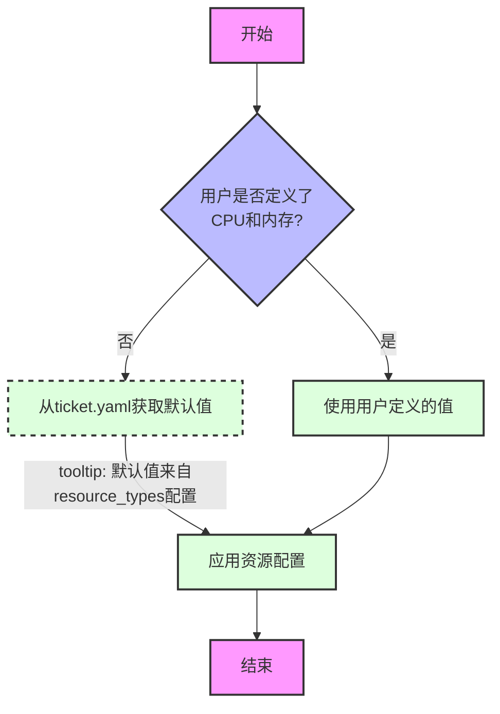

1024 + 512 = 1536

为你的 `ticket.yaml` 文件增加内存和 CPU 的定义，有几种方式，选择哪种取决于你未来对这些信息的细致程度和扩展性要求。以下提供几种建议，从简单到复杂：

**优点：**

*   简单易懂，直接明了。
*   易于阅读和编写。

**缺点：**

*   不够灵活，如果需要更精细的控制（例如，CPU 的型号，内存的类型），则无法满足。
*   解析时可能需要额外的处理来提取数值和单位。

**方案二：结构化表示型 (推荐用于稍微复杂的需求)**

使用字典来表示 `cpu` 和 `memory`，可以更清晰地表达单位。

```yaml
ticket_info:
  region_uk:
    AIBNAGDM-1000:
      apis_quota: 1
      cpu:
        cores: 2
      memory:
        size: 4
        unit: GB
    AIBNAGDM-1002:
      apis_quota: 4
      cpu:
        cores: 4
      memory:
        size: 8
        unit: GB
```

或者如下
      cpu:
        value: 1000
        unit: m
      memory:
        value: 3072
        unit: Mi


**优点：**

*   更结构化，明确了单位。
*   方便程序解析和处理。
*   为未来扩展提供了可能性（例如，可以添加 CPU 的架构等信息）。


**一些额外的建议：**

*   **统一单位：**  在整个 YAML 文件中保持单位的一致性，例如都使用 "GB" 或 "GiB" 表示内存大小。
*   **添加注释：**  如果某些字段的含义不明确，可以添加注释进行解释。
*   **考虑实际使用场景：**  根据你的实际使用场景和未来可能的扩展需求来选择最合适的方案。
*   

有一个问题需要获取历史数据来补充进去?
历史数据的获取关于HPA的使用,用那个值比较合适.就是用实际获取的就行了

2.0 if User (define cpu && memory value) then use it, else use default value from ticket.yaml



