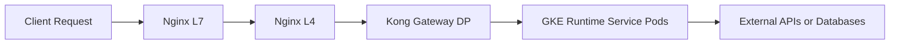

会议主题 **“Understand our offering — discussion and debate”**（理解我们的产品/服务提供）通常是面向管理层、产品经理、架构负责人或技术主管的一次战略性讨论，目的是**统一对公司当前云端服务架构、产品能力、定位、竞争力和改进方向的认知**。

  

结合你过往所有 GCP、GKE、Kong、API Platform 等实际背景，我为你整理出一份 **结构化会议大纲（Markdown版）**，它既可以用来做汇报，也可以作为讨论提纲。

我分成三层结构：**宏观（Product/Offering层）→ 技术支撑层（Engineering Capability）→ 改进与机会（Future & Strategy）。**

---

# **🧭 Understand Our Offering — Discussion & Debate**

  

## **1. What is Our Offering?（我们在“提供”什么？）**

  

### **1.1 核心定位**

|**层级**|**描述**|**示例**|
|---|---|---|
|**用户层（Client）**|企业/团队调用 API 服务|客户调用统一域名的 API|
|**平台层（API Platform）**|提供统一入口、访问控制、配额、监控与计费能力|基于 Kong Gateway + GKE Runtime|
|**基础设施层（Infra）**|高可用、可观测、安全的云原生架构|GCP (GKE + GCE + Cloud Load Balancer + Firestore + BigQuery)|

**一句话概括**：

  

> 我们的 offering 是一个基于 GCP 的 **API 平台（API-as-a-Service）**，为内部与外部团队提供标准化、可扩展、安全的 API 访问与管理能力。

---

## **2. Current Architecture Overview（当前架构概览）**

  

### **2.1 技术链路**

### **2.2 核心组件说明**

|**组件**|**功能**|**关键要点**|
|---|---|---|
|**Kong Gateway (GW + RT)**|统一入口、路由、鉴权、配额、日志|支持插件化管理、负载均衡、重试机制|
|**GKE Runtime (Java Services)**|业务逻辑执行|自动伸缩（HPA）、滚动升级、Readiness Probe|
|**Cloud Load Balancer (HTTPS + mTLS)**|安全接入层|支持多 CA 信任、Cloud Armor、Client Validation|
|**Firestore / BigQuery**|数据持久化与分析|Quota 管理、日志分析、API 调用统计|
|**CI/CD Pipeline (Airflow + Harbor)**|自动化部署与发布|支持多环境发布、镜像版本管理|

---

## **3. Why Is This Valuable?（我们提供的价值）**

|**维度**|**说明**|**示例**|
|---|---|---|
|**可扩展性 (Scalability)**|GKE 水平扩展 + HPA 自动调节负载|高并发下保持性能稳定|
|**高可用性 (Availability)**|RollingUpdate + PDB + 多 Zone 集群|节点升级期间无明显中断|
|**可靠性 (Reliability)**|请求重试机制 + 健康检查|避免短时 Pod 切换导致 502|
|**可观测性 (Observability)**|日志 + 指标 + Trace 三合一|利用 BigQuery 日志分析错误趋势|
|**安全性 (Security)**|mTLS + TrustConfig + Cloud Armor|满足内部与外部安全标准|
|**管理性 (Manageability)**|统一入口与团队隔离 (namespace / project)|降低运维复杂度|

---

## **4. Our Strengths & Gaps（优势与改进空间）**

  

### **4.1 我们的优势**

- ✅ 完整的云原生栈（GCP 原生 + Kong + GKE）
    
- ✅ mTLS 与 Cloud Armor 一体化安全体系
    
- ✅ Firestore/BigQuery 实现透明的日志与配额追踪
    
- ✅ 支持多环境、自动化发布（Airflow + Harbor Pipeline）
    
- ✅ 架构具备可扩展性与高可用设计（PDB、HPA、RollingUpdate）
    

  

### **4.2 改进空间**

|**方向**|**当前挑战**|**可能方案**|
|---|---|---|
|**可视化与观测**|日志数据分析仍需人工介入|Looker Studio 仪表盘自动化|
|**API 生命周期管理**|POC API 与正式 API 区分依赖人工标记|自动状态迁移 + 计费集成|
|**自动化升级流程**|节点升级时存在短暂请求失败风险|优化 PDB 策略 + 请求重试插件|
|**安全与信任管理**|多 CA 的 TrustConfig 更新需手动|脚本化 CA 指纹检测与增量更新|
|**跨项目一致性验证**|不同 Project 的配置差异需人工比对|脚本化 kubectl describe + jq 自动比对方案|

---

## **5. Opportunities & Future Directions（机会与未来方向）**

  

### **5.1 平台化与产品化演进**

|**阶段**|**目标**|**示例**|
|---|---|---|
|**Phase 1：标准化**|完成所有 API 的统一接入与鉴权|Kong Admin API + Policy 统一管理|
|**Phase 2：自动化**|构建全自动 CI/CD + Monitoring Pipeline|Airflow 驱动部署 + Looker 自动分析|
|**Phase 3：产品化**|形成自助式 API Portal 与配额申请流程|开发 API Portal + Firestore 审批机制|

### **5.2 数据驱动的持续改进**

- BigQuery 日志驱动的 **错误模式分析与 SLA 优化**
    
- Firestore 数据驱动的 **Quota 管理自动化**
    
- 利用 Looker Studio 展示 **请求量、失败率、延迟趋势**
    

---

## **6. Discussion Points for Debate（会议讨论议题）**

1. 我们的平台 **究竟是“工具”还是“产品”？**
    
    → 是否需要对外开放或收费？
    
2. 我们的 **API 平台差异化优势** 是什么？
    
    → 相比 Cloud Endpoints / Apigee / Kong Cloud？
    
3. 我们的 **关键瓶颈或风险点** 在哪里？
    
    → （如 GKE 升级、配额控制、安全合规）
    
4. 我们的 **下一步投资方向** 应该放在哪里？
    
    → 安全？可观测性？自动化？
    
5. 如何建立一条清晰的 **API 生命周期管理路径**？
    
    → 从 POC → Review → Approve → Billing
    

---

## **7. Summary（总结）**

  

> 我们的“Offering”并不仅仅是一个云架构，而是一套**面向开发者与管理者的 API 平台产品**。

> 它融合了 GCP 的云原生能力与公司内部需求，在安全、可用性与可管理性上形成差异化竞争力。

> 下一阶段，应当从“工程驱动”过渡到“产品驱动”与“数据驱动”的模式。

---
