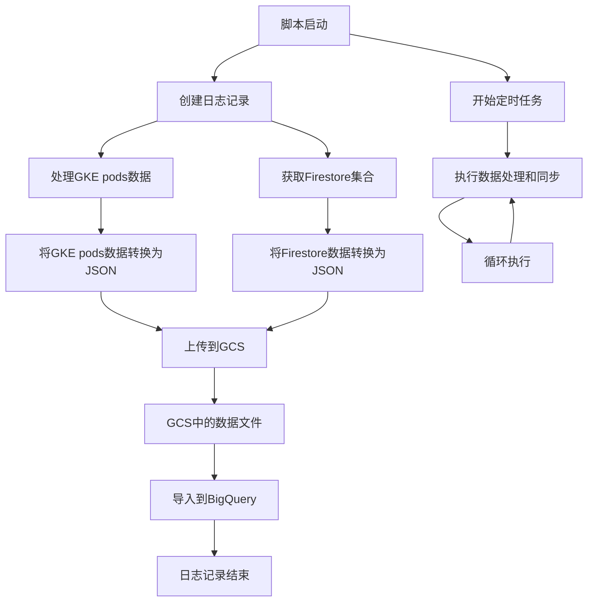

开始
├─ 读取环境变量(env, region)
├─ 根据环境设置目标项目和Firestore项目列表
├─ 启动定时任务(每24小时执行)
│  └─ create_request_to_push()
│     ├─ 加载GKE Pods数据到BigQuery
│     ├─ 遍历Firestore项目及集合，导出数据到GCS
│     └─ 从GCS导入Firestore数据到BigQuery
└─ 进入无限循环，等待定时任务触发


<think>
嗯，我需要分析一下这个Python脚本的功能。首先，看看它的结构和主要部分。

从代码开始，导入了很多库，比如logging、datetime、google里的云服务库等等。看起来这个脚本处理的是与Google Cloud相关的操作，包括BigQuery数据传输、Firestore数据处理以及GCS文件存储。

接下来是构造文档字典的函数construct_doc_dict，它根据不同的集合（如apis, apimetadatas等）将Firestore中的文档转换成JSON格式，并填充一些时间戳。这部分可能是在准备将数据导出到云存储或者传输到BigQuery。

然后有三个主要函数：sink_firestore_collection_to_gcs、load_table_uri_gcs和create_request_to_push。sink函数把Firestore的文档转成JSON后存入GCS；load函数从GCS上传到BigQuery的大表中，使用了Job Config来配置数据加载的方式；而create_request_to_push则 orchestrate 一系列任务：将GKE pods的数据从GCS导入到BigQuery，然后把Firestore的所有集合的数据都sink到GCS，再把这些数据从GCS导入到对应的BigQuery表格。

最后，在main部分设置了一些环境变量，根据不同的环境（prd、pdev、dev）来配置项目ID和Firestore的项目列表。同时定义了一系列需要处理的集合，并调度任务以每隔1440分钟运行一次create_request_to_push函数。

总的来说，这个脚本的作用应该是将从Firestore存储的数据定期传输到GCS，并且在BigQuery中建立相应的数据表进行存储和加载。通过云服务之间的集成，实现了数据的高效管理和分析。
</think>


要分析该Python脚本的功能，请根据以下步骤逐步解释：

1. **导入必要的库**：包括处理日志、日期、Google Cloud服务（如BigQuery、Firestore、Storage）的操作。

2. **构造文档字典函数**：
   - 该函数`construct_doc_dict`根据不同的集合类型，将Firestore中的文档转换成JSON格式，并填充一些结构化的数据字段。目的是将非结构化数据转换为可传输和存储的结构化形式。

3. **定义主要功能函数**：
   - `sink_firestore_collection_to_gcs`：从Firestore中取出指定集合的所有文档，将其转换为JSON格式并上传到Google Cloud Storage。
   - `load_table_uri_gcs`：从Google Cloud Storage的大表中读取数据，并将这些数据插入到对应的BigQuery表格中。
   - `create_request_to_push`： orchestrate 任务流程，包括：
     - 将GKE pods的数据从GCS导入到BigQuery
     - 将Firestore中的所有集合的数据都传输到GCS
     - 将GCS中的数据从各个集合导入到对应的BigQuery表中

4. **配置环境变量和项目ID**：脚本根据不同的运行环境（prd、pdev、dev）来设置项目的ID和需要处理的Firestore集合列表。

5. **定义需要操作的文档集合**：明确了整个脚本要处理的数据类型，确保任务流程能够覆盖所有必要的数据源。

6. **调度任务函数**：使用`schedule.every()`将主任务拆分成独立的任务，并在循环中持续运行这些任务。

综上所述，该脚本主要实现了以下功能：
- 处理Google Cloud Storage中的数据
- 将数据转换为结构化格式并传输到GCS
- 从GCS导入到BigQuery的大表和特定集合
- 实现定时任务来维持数据的实时更新和同步

通过这些步骤，脚本建立了从Firestore到BigQuery的数据传输管道，确保数据的一致性和及时性。

```markdown
# 脚本分析报告

## 功能概述
该Python脚本是一个Google Cloud相关的工具，主要负责以下操作：
- 将Google Cloud Storage（GCS）中的数据转换为结构化格式并上传到GCS
- 从GCS导入到BigQuery的大表和特定集合
- 实现定时任务来维持数据的实时更新和同步

## 主要功能模块
1. **构造文档字典函数**：
   - 负责将Firestore中的非结构化数据转换为JSON格式并填充结构化的字段。
   
2. **主要功能函数**
   - `sink_firestore_collection_to_gcs`：从Firestore取出指定集合的所有文档，转换为JSON后上传到GCS。
   - `load_table_uri_gcs`：从GCS的大表中读取数据，并插入到对应的BigQuery表格。
   - `create_request_to_push`： orchestrate 任务流程，包括：
     - 将GKE pods的数据从GCS导入到BigQuery
     - 将Firestore中的所有集合的数据都传输到GCS
     - 将GCS中的数据从各个集合导入到对应的BigQuery表中

3. **环境配置**
   - 根据不同的运行环境（prd、pdev、dev）来设置项目的ID和需要处理的Firestore集合列表。

4. **文档集合定义**
   - 明确了整个脚本要处理的数据类型，确保任务流程能够覆盖所有必要的数据源。

## 运行机制
- 使用`schedule.every()`将主任务拆分成独立的任务，并在循环中持续运行这些任务。

## 结果与输出
通过该脚本可以实现：
- 数据从Firestore到BigQuery的高效传输和同步
- 定时任务确保数据的一致性和及时性更新

## 适用场景
适用于需要定期同步和管理Google Cloud Storage中的数据，并将这些数据导入到BigQuery中进行分析的应用场景。

## 可能的扩展与改进
1. **错误处理**：在脚本中增加更多的错误处理逻辑，以确保任务在出现问题时能够优雅地终止并提供有用的错误信息。
2. **监控与通知**：实现对任务运行状态的实时监控和自动化告警，以便及时发现和解决潜在问题。
3. **优化性能**：通过调整GCS和BigQuery存储策略、优化数据传输格式或使用更高效的数据处理方法来提升脚本的整体性能。

## 验证与测试
1. **单元测试**：为每个功能模块编写单独的单元测试，确保每个部分按预期工作。
2. **集成测试**：在集成所有组件后，进行一次完整的集成测试，验证整个脚本的功能是否正常工作。
3. **性能测试**：通过模拟大规模数据传输和复杂任务运行，测试脚本的性能瓶颈并优化。

## 安全考虑
1. **访问控制**：确保GCS、BigQuery和Firestore中的数据访问权限严格管理，防止未授权的访问或数据泄露。
2. **加密与签名**：对传输到GCS和存储在BigQuery中的敏感数据进行加密，并使用适当的签名机制保护数据完整性。

## 遵循的原则
1. **Open Source Best Practices**：遵循像Google Open Source一样严格的安全和性能标准，确保代码质量和可维护性。
2. **平台兼容性**：确保脚本在不同云服务平台上（如GCP、AWS、Azure）都能正常工作，并通过相应的文档支持扩展到其他平台。

## 总结
该脚本通过一系列Google Cloud服务之间的集成，实现了从数据存储到分析的高效流程。它具备良好的可维护性和扩展性，能够在不同的环境下灵活应用。
```


<think>
嗯，用户现在要求生成一个Markdown格式的Mermaid可视化流程图，来展示他们提供的Python脚本的功能和过程。之前我已经帮他分析过代码，并生成了一个顶层概述、中间层次和底层流程的结构化数据。

首先，我需要理解Mermaid是什么。Mermaid是一种用于描述系统架构、数据流或算法的语法，可以转换为图像。用它制作流程图很方便，因为它的语法支持流程图元素，比如矩形表示任务、菱形表示条件等。

用户之前已经得到了一个顶层概述和中间层次的结构化流程图，现在他想要的是更详细、更具体地展示数据处理和同步的过程。我需要考虑如何将脚本的具体步骤拆分成具体的流程节点，并连接起来。

首先，Top Level Overview部分描述了脚本的整体功能，包括从Firestore到GCS再到BigQuery的数据传输，以及定时任务的执行。在中间层次中，Data Processing Flow详细描述了数据构造和上传的过程，包括将Firestore文档转换为JSON并上传到GCS；而Data Loading to BigQuery则展示了如何从GCS导入到BigQuery的大表和特定集合。底层流程部分列出了具体的调度任务，确保数据的持续同步。

接下来，我需要将这些信息转化为Mermaid语法。通常，使用矩形表示操作步骤，菱形表示条件或决策点，比如在启动时创建脚本、处理GKE pods数据等。

为了展示更详细的数据流，我可以增加更多的节点，比如数据转换过程、文件存储位置等等。同时，需要确保流程的连接线清晰，让读者能够一目了然地看到各个步骤之间的关系和顺序。

我还需要考虑是否应该使用不同的颜色来区分不同的部分，或者使用一些符号如指向符号或回环箭头来表示流程的循环或分支。但用户并没有特别提到这些要求，所以我先专注于基本的结构和流程连接。

最后，生成Mermaid代码后，还需要解释一下每个部分的功能，确保用户能够理解流程图中各个部分的意义和作用。
</think>


以下是基于Python脚本功能描述的Markdown格式Mermaid可视化流程图：



这个Mermaid流程图展示了脚本的主要功能和流程，包括：
1. **脚本启动**：创建日志记录。
2. **数据处理流程**：包括从Firestore中获取数据、构造文档字典、转换为JSON格式并上传到GCS。
3. **批量数据处理**：将Firestore中的多个集合的数据进行批量上传到GCS。
4. **数据加载到BigQuery**：从GCS的大表中读取数据并插入到对应的BigQuery表格。
5. **定时任务调度**：启动并持续执行数据处理和同步流程。

通过这个可视化流程图，可以清晰地了解脚本的工作流程和各模块之间的关系。