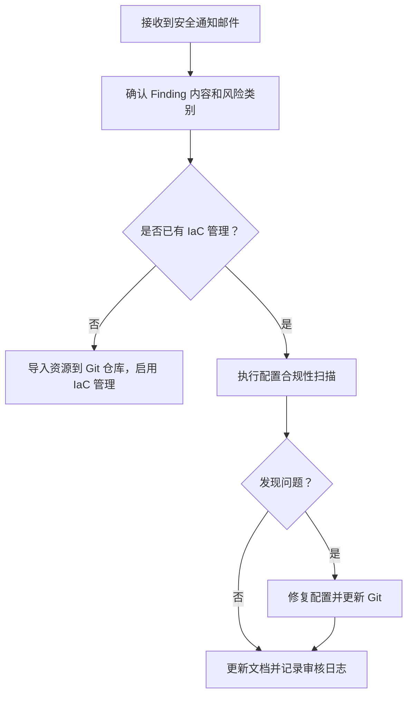
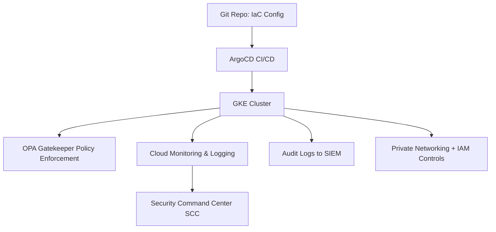

我们收到这样一个邮件,应该是安全团队发送的

Outstanding findings summary 未决调查结果摘要

Without appropriate configuration management and documentation kubernetes will be at increased risk of a breach
如果没有适当的配置管理和文档，kubernetes 将面临更大的违规风险
你的安全团队邮件中提到的威胁是：

> **“Without appropriate configuration management and documentation Kubernetes will be at increased risk of a breach.”**

> **“如果没有适当的配置管理和文档，Kubernetes 将面临更大的违规风险。”**

虽然你们使用的是 **GKE**，Google Cloud 已为你们托管了很多组件（如控制平面、安全补丁等），但责任共担模型（Shared Responsibility Model）中，**工作负载层和配置管理** 仍然是你们的职责。因此，你确实需要采取一些措施来响应这个 Finding。

---

## **✅ 应对该问题的建议清单（适用于 GKE）**

### **1.** 

### **配置管理（Configuration Management）**

| **类别**              | **建议**                                                                            |
| --------------------- | ----------------------------------------------------------------------------------- |
| 基础设施即代码（IaC） | 使用 Terraform、Pulumi、或 Config Connector 管理 GKE 配置与网络策略，避免手动变更。 |
| Kubernetes 对象       | 使用 Helm/Kustomize/ArgoCD 管理 YAML 文件，保持版本控制、审计和回滚能力。           |
| GitOps 实践           | 所有 YAML 配置放入 Git 仓库，使用 ArgoCD/Flux 持续部署并实现 Drift Detection。      |

---

### **2.** 

### **配置合规性检查与策略管理**

| **类别**           | **建议**                                                                                                                                                                                         |
| ------------------ | ------------------------------------------------------------------------------------------------------------------------------------------------------------------------------------------------ |
| Policy Enforcement | 在 GKE 上部署 [**OPA Gatekeeper**](https://github.com/open-policy-agent/gatekeeper) 或 [**GKE Policy Controller**](https://cloud.google.com/kubernetes-engine/docs/concepts/policy-controller)。 |
| 安全基线           | 执行 [CIS GKE Benchmark](https://cloud.google.com/kubernetes-engine/docs/concepts/cis-benchmark)，识别配置缺陷。                                                                                 |
| 镜像扫描           | 使用 Container Analysis 或 GCR/GAR 的自动扫描功能（或与 Cloud Build 集成）。                                                                                                                     |
| 自动审计           | 使用 **Config Sync + Policy Controller** 配合定期扫描，生成合规性报告。                                                                                                                          |

---

### **3.** 

### **关键配置建议（GKE 环境中）**

| **配置项**                            | **建议做法**                                                                                  |
| ------------------------------------- | --------------------------------------------------------------------------------------------- |
| 网络策略                              | 启用 Kubernetes NetworkPolicy，限制 Pod 间流量。                                              |
| Pod 安全策略（PSP）/Pod Security 标准 | 使用 PodSecurity admission controller 强化运行容器限制（如禁止特权模式、root、hostNetwork）。 |
| 节点自动修复                          | 启用 auto-upgrade 和 auto-repair，确保安全补丁及时应用。                                      |
| 日志和监控                            | 开启 Cloud Logging、Cloud Monitoring、Audit Logs，监控配置更改。                              |
| RBAC 权限最小化                       | 定期审计 RBAC 权限，避免集群角色滥用。                                                        |
| 加密                                  | 使用 Customer Managed Encryption Key (CMEK) 加密 etcd 数据和持久存储。                        |

---

### **4.** 

### **文档管理（Documentation）**

| **类别**     | **内容**                                                                    |
| ------------ | --------------------------------------------------------------------------- |
| 架构图       | 包括 GKE 拓扑、VPC、网络策略、服务依赖图等。                                |
| 操作文档     | 包括常规变更流程、故障排查步骤、CI/CD 发布流程等。                          |
| 安全基线文档 | 记录各类策略的合规要求及执行状态（可导出 OPA/GKE Policy Controller 报告）。 |
| 变更审计     | 使用 Git 或 Config Sync 审计所有配置变更。                                  |

---

### **5.** 

### **Mermaid 流程图：合规配置管理与响应流程**



---

## **✅ 最终建议**

你可以把下面这段话整理后回复安全团队：

> 我们使用的是托管 GKE，但我们负责配置管理和工作负载层的合规性。我们正在：

- > 采用 GitOps 工具（如 ArgoCD）统一配置管理；
- > 启用 GKE Policy Controller 实施配置策略；
- > 定期执行 CIS GKE Benchmark 检查；
- > 审计并限制 RBAC 权限；
- > 持续完善集群架构与变更操作文档。

>

> 我们计划将这些实践纳入正式文档和审计流程，持续改进。

如需，我可以帮你生成一份完整的合规检查清单或邮件模板回复安全团队。是否需要？

以下是你可以直接发送给安全团队的 **英文邮件模板**，用于回应 GKE 配置管理和文档相关的 Outstanding Finding。文中涵盖了实际的控制措施、合规操作和后续计划。

---

## **📩** 

## **邮件模板（英文）**

```
Subject: Re: Outstanding Findings - GKE Configuration Management & Documentation

Hi [Security Team Name / Security Contact],

Thank you for the reminder regarding the open finding:

**“Without appropriate configuration management and documentation Kubernetes will be at increased risk of a breach.”**

We acknowledge the risk and would like to provide an update on our mitigation strategy for our **GKE-based Kubernetes environment**:

---

### 🔐 Configuration Management

- We have adopted **Infrastructure as Code (IaC)** using GitOps workflows (ArgoCD/Kustomize/Helm) to ensure all Kubernetes configurations are version-controlled, reproducible, and auditable.
- All deployments and configuration changes are made via Git repositories, ensuring traceability and rollback capability.
- Our jiquns are configured to use **GKE Autopilot/Standard with auto-upgrade and auto-repair enabled**.

---

### 📜 Policy & Compliance Controls

- We have enabled **GKE Policy Controller (OPA/Gatekeeper)** to enforce custom policies and validate configurations against security baselines.
- We regularly scan our environment using **CIS GKE Benchmark checks**, and fix any gaps based on the findings.
- **RBAC roles** are reviewed regularly to ensure **principle of least privilege**.
- **Network Policies** are implemented to restrict pod-to-pod communication.

---

### 📘 Documentation and Audit

- All configuration policies, network topologies, and access control decisions are being documented.
- We maintain **change logs and audit records** via Git and GKE Audit Logging.
- Procedures for incident response, operational runbooks, and policy exceptions are under continuous improvement.

---

### ✅ Next Steps

We are currently:
- Finalizing policy definitions as code and syncing with our internal security baseline;
- Enhancing documentation for architecture, change process, and team responsibilities;
- Automating periodic compliance scans and reporting.

We will continue to refine our configuration and documentation practices, and we are open to further suggestions or reviews from your team.

Let us know if you would like a walk-through of our GKE compliance setup or need any additional artifacts.

Best regards,
[Your Name]
[Team / Department]
[Contact Info]
```

---

## **✅ 附加建议**

你也可以附上一份当前的控制图（如前述的 Mermaid 流程图）或者一个合规检查列表，以便安全团队清楚你们的控制点覆盖了哪些风险。

是否需要我帮你生成一份 Markdown 格式的 GKE 配置合规清单（Checklist）供内部使用或发给安全团队？

以下是一个**适用于 GKE 环境的配置管理与合规检查清单（Checklist）**，以 Markdown 表格形式呈现，可直接复制到你的文档或邮件中供内部使用或发给安全团队审阅：

---

## **✅ GKE 配置管理与合规检查清单（GKE Compliance Checklist）**

```
### GKE Compliance Configuration Checklist

| Control Category         | Control Item                                                                 | Status      | Evidence / Notes                                      |
|--------------------------|------------------------------------------------------------------------------|-------------|--------------------------------------------------------|
| **Cluster Configuration**| Auto-upgrade enabled                                                         | ✅ Enabled   | GKE Autopilot / Standard auto-upgrade setting          |
|                          | Auto-repair enabled                                                          | ✅ Enabled   | GKE node auto-repair configuration                     |
|                          | Private jiqun enabled                                                      | ✅ Yes       | Master authorized networks configured                  |
|                          | Shielded GKE nodes                                                           | ✅ Enabled   | Enabled via node pool configuration                    |
|                          | Workload Identity enabled                                                    | ✅ Yes       | ServiceAccount mapping configured                      |
| **Networking**           | Network Policy enforced                                                      | ✅ Yes       | Applied to restrict pod-to-pod traffic                 |
|                          | VPC-SC / Perimeter defined                                                   | 🚧 Planned   | Being evaluated with GCP security team                 |
| **Access Control**       | RBAC with least privilege                                                    | ✅ In Place  | RoleBinding audit log available                        |
|                          | No default service account usage                                             | ✅ Enforced  | GKE disables default SA for workloads                  |
|                          | Audit logging enabled                                                        | ✅ Yes       | Cloud Audit Logs enabled for GKE API                   |
|                          | Binary Authorization enabled                                                 | 🚧 Planned   | Under rollout                                          |
| **Configuration as Code**| Manifests managed in Git (IaC)                                               | ✅ Yes       | GitOps via ArgoCD with approvals                       |
|                          | Kustomize/Helm used for environment overlays                                 | ✅ Yes       | Cluster configs separated per env                      |
|                          | Git audit log used for deployment traceability                              | ✅ Yes       | All commits reviewed via PR                            |
| **Policy Enforcement**   | Policy Controller (OPA/Gatekeeper) in place                                  | ✅ Yes       | Controls enforced via constraint templates             |
|                          | Image policy control (only trusted registries allowed)                       | ✅ Enforced  | Gatekeeper constraint + registry allowlist             |
|                          | Resource quotas and limits enforced                                          | ✅ Yes       | Defined in namespace level                             |
| **Monitoring & Alerting**| Prometheus / Cloud Monitoring enabled for workload observability             | ✅ Yes       | Dashboards + alerting rules defined                    |
|                          | Audit logs integrated with SIEM/SCC                                          | ✅ In Place  | Forwarded to Cloud Logging & SCC                       |
| **Documentation**        | GKE architecture documented                                                  | ✅ Yes       | Draw.io / markdown diagram in internal docs            |
|                          | Security configuration & runbooks maintained                                | ✅ In Progress | Stored in Git and Wiki                                |
|                          | Access provisioning/deprovisioning process documented                        | ✅ Yes       | SOP defined                                            |
```

---

## **🔄 示例 Mermaid 流程图：GKE 合规架构流程**



---

需要我帮你根据你们当前的实际情况勾选这张表格的状态、或者生成 PDF/HTML 版本用于报告使用吗？


收到安全团队关于 Kubernetes 配置管理和文档不足可能导致安全风险的邮件是一个重要的提示，特别是对于在 Google Cloud Platform (GCP) 上运行的 Google Kubernetes Engine (GKE) 环境。这类问题通常源于安全团队在审查过程中发现的潜在风险点，目的是确保系统符合最佳实践和合规性要求。

以下我将分析问题的背景，并提供针对 GKE 环境的解决思路和具体行动步骤，帮助你解决安全团队提出的“没有适当的配置管理和文档，Kubernetes 将面临更大的违规风险”这一问题。

---

### **问题分析**

1. **安全团队的关注点**：
   - **配置管理**：指 Kubernetes 集群（包括 GKE）的配置是否遵循安全最佳实践，是否存在未受控的配置变更或潜在的安全漏洞。
   - **文档**：指是否有清晰、完整的文档记录集群配置、访问控制策略、变更管理流程等，以便在审计或问题排查时提供依据。
   - **违规风险**：如果配置管理和文档不足，可能导致未经授权的访问、配置错误、漏洞未修复等问题，从而增加安全威胁。

2. **GKE 环境特点**：
   - GKE 是 GCP 提供的托管 Kubernetes 服务，部分配置（如控制平面）由 Google 管理，但用户仍需负责工作负载配置、访问控制、网络策略等。
   - 安全团队可能认为用户管理的部分未达到预期标准，例如 RBAC（基于角色的访问控制）、Pod 安全策略、镜像安全、日志记录等。

3. **目标**：
   - 确保 GKE 集群的配置符合安全最佳实践，减少违规风险。
   - 提供清晰的文档，记录配置和变更管理流程，满足安全团队的审计要求。

---

### **解决方案**

针对安全团队提出的问题，我们需要从 **配置管理** 和 **文档** 两个方面入手，采取以下步骤来解决 GKE 环境中的潜在风险。我将这些步骤分为短期行动（快速修复）和长期规划（持续改进），以便你能系统化地处理问题。

#### **1. 配置管理：审查和优化 GKE 安全配置**

- **目标**：确保 GKE 集群配置符合安全最佳实践，减少潜在漏洞。
- **具体步骤**：
  1. **启用 GKE 安全功能**：
     - **Workload Identity**：启用 Workload Identity，确保 GKE Pod 使用 GCP 服务账户进行身份验证，避免静态凭据泄露。
     - **Shielded GKE Nodes**：启用 Shielded Nodes，提供额外的节点安全保护（如安全启动和完整性监控）。
     - **Private Cluster**：如果可能，将 GKE 集群配置为私有集群，限制公共 IP 访问控制平面和工作节点。
     - **Node Auto-Upgrade**：启用节点自动升级，确保集群运行最新的安全补丁。

  2. **配置 RBAC 和访问控制**：
     - 审查 GKE 集群的 RBAC 策略，确保遵循“最小权限原则”（Principle of Least Privilege）。
     - 检查 GCP IAM 角色，限制对 GKE 集群的访问，仅允许必要的用户或服务账户操作。
     - 使用 `kubectl auth can-i` 命令验证用户权限，避免过度授权。

  3. **Pod 安全策略**：
     - 如果使用 GKE 的 PodSecurityPolicy（注意：此功能在 Kubernetes 1.25 后已被弃用，GKE 可能提供替代方案），配置策略以限制 Pod 运行特权容器、挂载主机文件系统等高风险行为。
     - 替代方案：使用 GKE 的 Pod Security Standards 或第三方工具（如 OPA Gatekeeper）强制执行安全策略。

  4. **镜像安全**：
     - 使用 GCP 的 Container Registry (GCR) 或 Artifact Registry 存储镜像，启用漏洞扫描功能，定期检查镜像是否存在已知漏洞。
     - 实施镜像签名和验证，确保只部署受信任的镜像。

  5. **网络安全**：
     - 配置网络策略（Network Policies），限制 Pod 之间的通信，仅允许必要的流量。
     - 启用 Cloud Armor（如你之前提到的 WAF）保护 API 端点，防止 DDoS 和其他攻击。

  6. **日志和监控**：
     - 启用 GKE 的审计日志（Audit Logging），记录控制平面操作，便于追踪变更和异常行为。
     - 将日志集成到 Cloud Logging 和 Cloud Monitoring，设置警报以检测潜在安全事件。

- **工具支持**：
  - 使用 GCP 的 **Security Command Center (SCC)** 扫描 GKE 集群，识别配置问题和安全风险。
  - 使用 `gcloud container jiquns describe <jiqun-name>` 检查当前配置，确保符合安全要求。

#### **2. 文档：建立和完善 GKE 配置和变更管理文档**

- **目标**：提供清晰的文档，记录 GKE 集群的配置、访问策略和变更流程，满足安全审计要求。
- **具体步骤**：
  1. **集群配置文档**：
     - 记录 GKE 集群的基本信息：集群名称、区域、版本、节点池配置（CPU/内存、节点数量）、是否为私有集群等。
     - 记录安全配置：是否启用 Workload Identity、Shielded Nodes、自动升级等。
     - 示例模板：
       ```
       GKE Cluster Configuration
       - Cluster Name: my-gke-jiqun
       - Region: us-central1
       - Version: 1.27.x
       - Node Pool: default-pool (3 nodes, e2-medium)
       - Security Features:
         - Workload Identity: Enabled
         - Shielded Nodes: Enabled
         - Private Cluster: Yes
       ```

  2. **访问控制文档**：
     - 记录 RBAC 策略和 IAM 角色分配，列出每个角色对应的权限和使用者。
     - 示例：
       ```
       Access Control Policies
       - Role: Cluster Admin
         - Permissions: Full control over jiqun
         - Assigned to: devops-team@company.com
       - Role: Viewer
         - Permissions: Read-only access
         - Assigned to: qa-team@company.com
       ```

  3. **变更管理流程**：
     - 记录 GKE 集群配置变更的流程，包括谁可以发起变更、审批流程、变更记录方式。
     - 示例：
       ```
       Change Management Process
       1. Request: Submitted by team member via Jira ticket.
       2. Review: Approved by DevOps lead.
       3. Implementation: Applied via Terraform or gcloud CLI.
       4. Documentation: Update configuration doc in Confluence.
       5. Notification: Inform stakeholders via Slack.
       ```

  4. **安全策略和合规性**：
     - 记录 Pod 安全策略、网络策略、镜像扫描策略等。
     - 说明如何符合合规性要求（如 GDPR、HIPAA，或内部安全政策）。

  5. **存储和版本控制**：
     - 将文档存储在版本控制系统（如 Git）或文档管理系统（如 Confluence、Google Docs）中，确保可追溯。
     - 定期更新文档，确保与实际配置一致。

#### **3. 与安全团队沟通**

- **目标**：向安全团队证明已采取措施解决问题，并获取反馈以进一步改进。
- **具体步骤**：
  1. **回复邮件**：确认收到安全团队的邮件，说明正在采取行动解决配置管理和文档问题。
     - 示例回复：
       ```
       Dear Security Team,
       Thank you for identifying the outstanding issue regarding GKE configuration management and documentation. We are actively working on reviewing and optimizing our GKE jiqun configurations and creating detailed documentation to mitigate the risk of breaches. We will provide a detailed update and relevant documentation by [date]. Please let us know if there are specific areas or standards we should prioritize.
       Best regards,
       [Your Name]
       ```

  2. **提供初步报告**：整理当前 GKE 配置的摘要和已采取的安全措施，提交给安全团队。
  3. **定期更新**：在完成配置优化和文档编写后，向安全团队提交完整报告，请求重新审查或关闭问题。
  4. **寻求指导**：询问安全团队是否有特定的配置标准或合规性要求（如 CIS Kubernetes Benchmark），以确保工作方向正确。

#### **4. 长期规划：持续改进和自动化**

- **目标**：建立持续的安全管理和文档更新机制，防止类似问题再次出现。
- **具体步骤**：
  1. **基础设施即代码 (IaC)**：
     - 使用 Terraform 或 GCP Deployment Manager 管理 GKE 配置，确保配置可重复、可审计。
     - 将 IaC 脚本存储在 Git 中，记录每次变更。

  2. **自动化合规性检查**：
     - 使用工具如 **Kube-bench**（基于 CIS Kubernetes Benchmark）定期扫描 GKE 集群，识别配置问题。
     - 集成到 CI/CD 流水线中，自动报告安全风险。

  3. **文档自动化**：
     - 使用工具（如 `kubectl` 插件或自定义脚本）自动生成集群配置文档，减少手动维护成本。
     - 定期审查文档，确保与实际配置一致。

  4. **培训和流程改进**：
     - 对团队成员进行 GKE 安全配置和文档编写培训，确保每个人了解最佳实践。
     - 建立变更管理审批流程，避免未经授权的配置变更。

---

### **推荐实施路径**

以下是解决问题的优先级和时间表，供参考：

1. **短期（1-2 周）**：
   - 审查 GKE 集群配置，启用关键安全功能（如 Workload Identity、审计日志）。
   - 编写初步配置和访问控制文档，记录当前状态。
   - 回复安全团队邮件，说明进展并承诺提交完整报告。

2. **中期（3-4 周）**：
   - 优化 GKE 配置，解决潜在安全风险（如 RBAC、网络策略）。
   - 完善文档，覆盖变更管理流程和合规性要求。
   - 提交完整报告给安全团队，请求重新审查。

3. **长期（1-3 个月）**：
   - 实施 IaC 和自动化合规性检查，确保配置可控。
   - 建立文档更新机制，定期与安全团队沟通。

---

### **具体实现示例**

1. **检查 GKE 配置**：
   使用 `gcloud` 命令查看当前集群配置：
   ```bash
   gcloud container jiquns describe my-gke-jiqun --region us-central1
   ```
   检查是否启用 Workload Identity、私有集群等功能。

2. **配置 RBAC**：
   创建一个限制性 RBAC 角色：
   ```yaml
   apiVersion: rbac.authorization.k8s.io/v1
   kind: Role
   metadata:
     namespace: default
     name: restricted-access
   rules:
   - apiGroups: [""]
     resources: ["pods"]
     verbs: ["get", "list"]
   ```
   绑定到特定用户或组：
   ```yaml
   apiVersion: rbac.authorization.k8s.io/v1
   kind: RoleBinding
   metadata:
     name: restricted-access-binding
     namespace: default
   subjects:
   - kind: User
     name: "user@company.com"
   roleRef:
     kind: Role
     name: restricted-access
     apiGroup: rbac.authorization.k8s.io
   ```

3. **文档存储**：
   在 Git 仓库中创建 `gke-security-docs` 文件夹，存储配置和流程文档，使用 Markdown 格式：
   ```
   # GKE Security Configuration
   ## Cluster Details
   - Name: my-gke-jiqun
   - Region: us-central1
   ## Security Settings
   - Workload Identity: Enabled
   - Audit Logging: Enabled
   ```

---

### **总结与注意事项**

- **核心问题**：安全团队关注 GKE 配置管理和文档不足可能导致的安全风险。
- **解决策略**：从配置优化（启用安全功能、RBAC、网络策略）和文档完善（记录配置和流程）两方面入手。
- **关键点**：与安全团队保持沟通，确保工作符合他们的期望；使用自动化工具减少手动工作量。
- **后续步骤**：完成初步配置和文档后，提交给安全团队审查；长期规划中引入 IaC 和合规性检查工具。

如果你有具体的 GKE 配置信息、安全团队要求的标准（如 CIS Benchmark），或需要更详细的文档模板，可以进一步讨论。我也可以帮助你起草与安全团队的沟通邮件或审查报告。欢迎随时反馈！