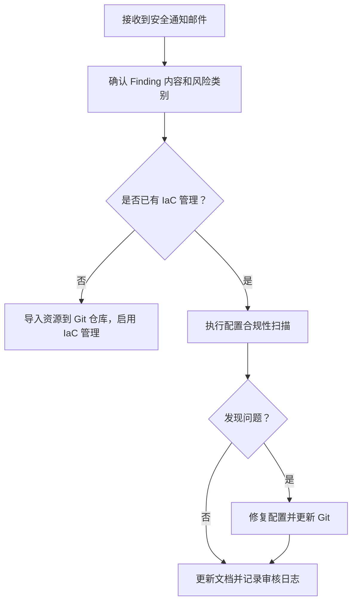
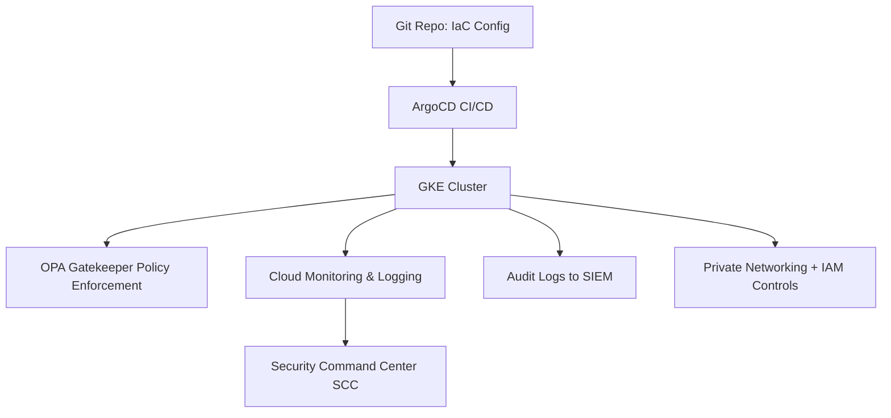

我们收到这样一个邮件,应该是安全团队发送的

Outstanding findings summary 未决调查结果摘要

Without appropriate configuration management and documentation kubernetes will be at increased risk of a breach
如果没有适当的配置管理和文档，kubernetes 将面临更大的违规风险
你的安全团队邮件中提到的威胁是：

> **“Without appropriate configuration management and documentation Kubernetes will be at increased risk of a breach.”**

> **“如果没有适当的配置管理和文档，Kubernetes 将面临更大的违规风险。”**

虽然你们使用的是 **GKE**，Google Cloud 已为你们托管了很多组件（如控制平面、安全补丁等），但责任共担模型（Shared Responsibility Model）中，**工作负载层和配置管理** 仍然是你们的职责。因此，你确实需要采取一些措施来响应这个 Finding。

---

## **✅ 应对该问题的建议清单（适用于 GKE）**

### **1.** 

### **配置管理（Configuration Management）**

| **类别**              | **建议**                                                                            |
| --------------------- | ----------------------------------------------------------------------------------- |
| 基础设施即代码（IaC） | 使用 Terraform、Pulumi、或 Config Connector 管理 GKE 配置与网络策略，避免手动变更。 |
| Kubernetes 对象       | 使用 Helm/Kustomize/ArgoCD 管理 YAML 文件，保持版本控制、审计和回滚能力。           |
| GitOps 实践           | 所有 YAML 配置放入 Git 仓库，使用 ArgoCD/Flux 持续部署并实现 Drift Detection。      |

---

### **2.** 

### **配置合规性检查与策略管理**

| **类别**           | **建议**                                                                                                                                                                                         |
| ------------------ | ------------------------------------------------------------------------------------------------------------------------------------------------------------------------------------------------ |
| Policy Enforcement | 在 GKE 上部署 [**OPA Gatekeeper**](https://github.com/open-policy-agent/gatekeeper) 或 [**GKE Policy Controller**](https://cloud.google.com/kubernetes-engine/docs/concepts/policy-controller)。 |
| 安全基线           | 执行 [CIS GKE Benchmark](https://cloud.google.com/kubernetes-engine/docs/concepts/cis-benchmark)，识别配置缺陷。                                                                                 |
| 镜像扫描           | 使用 Container Analysis 或 GCR/GAR 的自动扫描功能（或与 Cloud Build 集成）。                                                                                                                     |
| 自动审计           | 使用 **Config Sync + Policy Controller** 配合定期扫描，生成合规性报告。                                                                                                                          |

---

### **3.** 

### **关键配置建议（GKE 环境中）**

| **配置项**                            | **建议做法**                                                                                  |
| ------------------------------------- | --------------------------------------------------------------------------------------------- |
| 网络策略                              | 启用 Kubernetes NetworkPolicy，限制 Pod 间流量。                                              |
| Pod 安全策略（PSP）/Pod Security 标准 | 使用 PodSecurity admission controller 强化运行容器限制（如禁止特权模式、root、hostNetwork）。 |
| 节点自动修复                          | 启用 auto-upgrade 和 auto-repair，确保安全补丁及时应用。                                      |
| 日志和监控                            | 开启 Cloud Logging、Cloud Monitoring、Audit Logs，监控配置更改。                              |
| RBAC 权限最小化                       | 定期审计 RBAC 权限，避免集群角色滥用。                                                        |
| 加密                                  | 使用 Customer Managed Encryption Key (CMEK) 加密 etcd 数据和持久存储。                        |

---

### **4.** 

### **文档管理（Documentation）**

| **类别**     | **内容**                                                                    |
| ------------ | --------------------------------------------------------------------------- |
| 架构图       | 包括 GKE 拓扑、VPC、网络策略、服务依赖图等。                                |
| 操作文档     | 包括常规变更流程、故障排查步骤、CI/CD 发布流程等。                          |
| 安全基线文档 | 记录各类策略的合规要求及执行状态（可导出 OPA/GKE Policy Controller 报告）。 |
| 变更审计     | 使用 Git 或 Config Sync 审计所有配置变更。                                  |

---

### **5.** 

### **Mermaid 流程图：合规配置管理与响应流程**



---

## **✅ 最终建议**

你可以把下面这段话整理后回复安全团队：

> 我们使用的是托管 GKE，但我们负责配置管理和工作负载层的合规性。我们正在：

- > 采用 GitOps 工具（如 ArgoCD）统一配置管理；
- > 启用 GKE Policy Controller 实施配置策略；
- > 定期执行 CIS GKE Benchmark 检查；
- > 审计并限制 RBAC 权限；
- > 持续完善集群架构与变更操作文档。

>

> 我们计划将这些实践纳入正式文档和审计流程，持续改进。

如需，我可以帮你生成一份完整的合规检查清单或邮件模板回复安全团队。是否需要？

以下是你可以直接发送给安全团队的 **英文邮件模板**，用于回应 GKE 配置管理和文档相关的 Outstanding Finding。文中涵盖了实际的控制措施、合规操作和后续计划。

---

## **📩** 

## **邮件模板（英文）**

```
Subject: Re: Outstanding Findings - GKE Configuration Management & Documentation

Hi [Security Team Name / Security Contact],

Thank you for the reminder regarding the open finding:

**“Without appropriate configuration management and documentation Kubernetes will be at increased risk of a breach.”**

We acknowledge the risk and would like to provide an update on our mitigation strategy for our **GKE-based Kubernetes environment**:

---

### 🔐 Configuration Management

- We have adopted **Infrastructure as Code (IaC)** using GitOps workflows (ArgoCD/Kustomize/Helm) to ensure all Kubernetes configurations are version-controlled, reproducible, and auditable.
- All deployments and configuration changes are made via Git repositories, ensuring traceability and rollback capability.
- Our clusters are configured to use **GKE Autopilot/Standard with auto-upgrade and auto-repair enabled**.

---

### 📜 Policy & Compliance Controls

- We have enabled **GKE Policy Controller (OPA/Gatekeeper)** to enforce custom policies and validate configurations against security baselines.
- We regularly scan our environment using **CIS GKE Benchmark checks**, and fix any gaps based on the findings.
- **RBAC roles** are reviewed regularly to ensure **principle of least privilege**.
- **Network Policies** are implemented to restrict pod-to-pod communication.

---

### 📘 Documentation and Audit

- All configuration policies, network topologies, and access control decisions are being documented.
- We maintain **change logs and audit records** via Git and GKE Audit Logging.
- Procedures for incident response, operational runbooks, and policy exceptions are under continuous improvement.

---

### ✅ Next Steps

We are currently:
- Finalizing policy definitions as code and syncing with our internal security baseline;
- Enhancing documentation for architecture, change process, and team responsibilities;
- Automating periodic compliance scans and reporting.

We will continue to refine our configuration and documentation practices, and we are open to further suggestions or reviews from your team.

Let us know if you would like a walk-through of our GKE compliance setup or need any additional artifacts.

Best regards,
[Your Name]
[Team / Department]
[Contact Info]
```

---

## **✅ 附加建议**

你也可以附上一份当前的控制图（如前述的 Mermaid 流程图）或者一个合规检查列表，以便安全团队清楚你们的控制点覆盖了哪些风险。

是否需要我帮你生成一份 Markdown 格式的 GKE 配置合规清单（Checklist）供内部使用或发给安全团队？

以下是一个**适用于 GKE 环境的配置管理与合规检查清单（Checklist）**，以 Markdown 表格形式呈现，可直接复制到你的文档或邮件中供内部使用或发给安全团队审阅：

---

## **✅ GKE 配置管理与合规检查清单（GKE Compliance Checklist）**

```
### GKE Compliance Configuration Checklist

| Control Category         | Control Item                                                                 | Status      | Evidence / Notes                                      |
|--------------------------|------------------------------------------------------------------------------|-------------|--------------------------------------------------------|
| **Cluster Configuration**| Auto-upgrade enabled                                                         | ✅ Enabled   | GKE Autopilot / Standard auto-upgrade setting          |
|                          | Auto-repair enabled                                                          | ✅ Enabled   | GKE node auto-repair configuration                     |
|                          | Private cluster enabled                                                      | ✅ Yes       | Master authorized networks configured                  |
|                          | Shielded GKE nodes                                                           | ✅ Enabled   | Enabled via node pool configuration                    |
|                          | Workload Identity enabled                                                    | ✅ Yes       | ServiceAccount mapping configured                      |
| **Networking**           | Network Policy enforced                                                      | ✅ Yes       | Applied to restrict pod-to-pod traffic                 |
|                          | VPC-SC / Perimeter defined                                                   | 🚧 Planned   | Being evaluated with GCP security team                 |
| **Access Control**       | RBAC with least privilege                                                    | ✅ In Place  | RoleBinding audit log available                        |
|                          | No default service account usage                                             | ✅ Enforced  | GKE disables default SA for workloads                  |
|                          | Audit logging enabled                                                        | ✅ Yes       | Cloud Audit Logs enabled for GKE API                   |
|                          | Binary Authorization enabled                                                 | 🚧 Planned   | Under rollout                                          |
| **Configuration as Code**| Manifests managed in Git (IaC)                                               | ✅ Yes       | GitOps via ArgoCD with approvals                       |
|                          | Kustomize/Helm used for environment overlays                                 | ✅ Yes       | Cluster configs separated per env                      |
|                          | Git audit log used for deployment traceability                              | ✅ Yes       | All commits reviewed via PR                            |
| **Policy Enforcement**   | Policy Controller (OPA/Gatekeeper) in place                                  | ✅ Yes       | Controls enforced via constraint templates             |
|                          | Image policy control (only trusted registries allowed)                       | ✅ Enforced  | Gatekeeper constraint + registry allowlist             |
|                          | Resource quotas and limits enforced                                          | ✅ Yes       | Defined in namespace level                             |
| **Monitoring & Alerting**| Prometheus / Cloud Monitoring enabled for workload observability             | ✅ Yes       | Dashboards + alerting rules defined                    |
|                          | Audit logs integrated with SIEM/SCC                                          | ✅ In Place  | Forwarded to Cloud Logging & SCC                       |
| **Documentation**        | GKE architecture documented                                                  | ✅ Yes       | Draw.io / markdown diagram in internal docs            |
|                          | Security configuration & runbooks maintained                                | ✅ In Progress | Stored in Git and Wiki                                |
|                          | Access provisioning/deprovisioning process documented                        | ✅ Yes       | SOP defined                                            |
```

---

## **🔄 示例 Mermaid 流程图：GKE 合规架构流程**



---

需要我帮你根据你们当前的实际情况勾选这张表格的状态、或者生成 PDF/HTML 版本用于报告使用吗？
