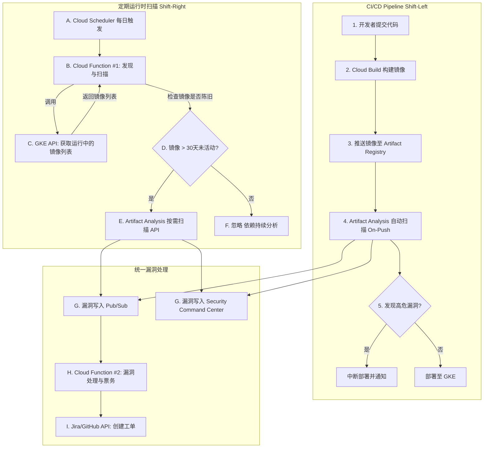

# 🛡️ GCP GKE 运行时容器镜像定期扫描方案

## 1. 背景与目标

### 1.1. 问题陈述

当前，GCP Artifact Analysis 的持续漏洞扫描功能存在一个关键限制：**该功能仅对过去30天内被推送（push）或拉取（pull）过的镜像有效**。对于长期运行且不经常更新的稳定服务（例如，基础架构组件或核心服务的镜像），这会形成一个严重的安全盲区，导致新的CVE漏洞无法被及时发现。

此外，Artifact Registry (GAR) 中可能存在大量不再使用或用于测试的“垃圾镜像”。对整个仓库进行无差别扫描会产生大量无关的告警噪音，并浪费计算资源。

### 1.2. 核心目标

本方案旨在设计并实施一个**自动化的定期容器镜像扫描工作流**，该工作流：

1.  **聚焦于GKE集群中实际运行的镜像**，消除对闲置镜像的扫描噪音。
2.  **解决30天扫描时效性限制**，确保长期运行的镜像也能被持续监控。
3.  **与现有CI/CD流程深度集成**，形成“左移”+“右移”的纵深防御体系。
4.  **建立自动化的漏洞通报与处理闭环**，将安全发现转化为可操作的开发任务。
5.  **完全基于GCP原生服务**，不引入额外的第三方安全工具。

---

## 2. 架构设计

本方案采用无服务器、事件驱动的架构，核心组件包括 Cloud Scheduler, Cloud Functions, GKE API, Artifact Analysis, Pub/Sub, 和 Security Command Center。

### 2.1. 架构图



### 2.2. 工作流详解

1.  **定时触发 (Cloud Scheduler)**:
    一个 Cloud Scheduler cron 作业（例如，每天凌晨2点）向 Pub/Sub 主题发送一条消息，触发主编排 Cloud Function。

2.  **发现GKE运行时镜像 (Cloud Function #1)**:
    -   该函数被触发后，使用其服务账号连接到所有目标GKE集群。
    -   通过 Kubernetes API，遍历所有命名空间下的 Pod，提取出所有容器镜像的 **摘要（digest）URI**。
    -   使用 `set` 数据结构对镜像列表进行去重。

3.  **分类与按需扫描 (Cloud Function #1)**:
    -   对于每一个唯一的镜像，函数查询 Artifact Registry API 获取其元数据，特别是 `updateTime`。
    -   **决策逻辑**:
        -   如果镜像 `updateTime` 在30天内，则记录日志并跳过，依赖现有的持续分析结果。
        -   如果镜像 `updateTime` 已超过30天，则将其标记为“陈旧”，并调用 `gcloud artifacts docker images scan` 命令或其等效的 REST API，触发一次新的 **按需扫描**。

4.  **漏洞结果注入 (Pub/Sub)**:
    -   无论是“推送时扫描”还是“按需扫描”，Artifact Analysis 都会将发现的每一个漏洞作为一个独立的事件发布到预定义的 `container-analysis-occurrences-v1` Pub/Sub 主题中。这个统一的事件出口是实现下游流程解耦的关键。

5.  **自动化票务处理 (Cloud Function #2)**:
    -   此函数订阅 `container-analysis-occurrences-v1` 主题。
    -   当收到新的漏洞消息时，它会解析 JSON 负载，提取 CVE ID、严重性、受影响的包和版本、修复建议等关键信息。
    -   根据预设规则（例如，仅处理 `CRITICAL` 或 `HIGH` 级别的漏洞）进行过滤。
    -   **（重要）** 在创建工单前，通过查询 Jira API 检查是否已存在针对 `(CVE_ID, Image_Digest)` 组合的开放工单，以实现 **幂等性**，避免重复创建。
    -   调用 Jira 或 GitHub API 创建一个包含所有详细信息的新工单，并分配给相应的团队。

---

## 3. 实施指南

### 3.1. API 启用

执行以下命令以确保所有必需的 GCP 服务 API 都已启用：

	 ```bash
gcloud services enable \\
    container.googleapis.com \\
    artifactregistry.googleapis.com \\
    ondemandscanning.googleapis.com \\
    cloudfunctions.googleapis.com \\
    cloudbuild.googleapis.com \\
    pubsub.googleapis.com \\
    iam.googleapis.com \\
    secretmanager.googleapis.com
```

### 3.2. IAM 权限配置

遵循最小权限原则，为各组件配置专用的服务账号和角色。

| 服务账号                 | 授予角色 (Role)                      | 授权理由                                           |
| ------------------------ | ------------------------------------ | -------------------------------------------------- |
| `gke-image-scanner-sa`   | `roles/container.viewer`             | 允许读取 GKE 集群资源，以列出运行中的 Pod。        |
| `gke-image-scanner-sa`   | `roles/artifactregistry.reader`      | 允许读取 Artifact Registry 中的镜像元数据。        |
| `gke-image-scanner-sa`   | `roles/ondemandscanning.admin`       | 允许对陈旧镜像触发按需扫描。                       |
| `vuln-ticketing-sa`      | `roles/pubsub.subscriber`            | 允许从漏洞发现主题中订阅消息。                     |
| `vuln-ticketing-sa`      | `roles/secretmanager.secretAccessor` | 允许从 Secret Manager 中安全地访问外部系统API令牌。 |

### 3.3. Cloud Function #1: 镜像发现与扫描

此函数是工作流的编排核心。

**`main.py`**
```python
import base64
import json
import os
import subprocess
from datetime import datetime, timedelta, timezone

from kubernetes import client, config

# 从环境变量获取配置
GCP_PROJECT_ID = os.environ.get('GCP_PROJECT_ID')
GKE_CLUSTERS = os.environ.get('GKE_CLUSTERS', '').split(',') # e.g., "clusters-1:zone-1,clusters-2:zone-2"

def discover_and_scan(event, context):
    """
    Cloud Function 主入口，发现 GKE 中运行的镜像并扫描陈旧镜像。
    """
    print("开始执行 GKE 运行时镜像扫描...")
    running_images = set()

    # 1. 遍历所有配置的 GKE 集群
    for clusters_info in GKE_CLUSTERS:
        try:
            clusters_name, location = clusters_info.split(':')
            print(f"正在连接到集群: {clusters_name} in {location}...")
            
            # 配置 Kubernetes 客户端
            subprocess.run(
                ["gcloud", "container", "clusterss", "get-credentials", clusters_name, f"--zone={location}", f"--project={GCP_PROJECT_ID}"],
                check=True,
            )
            config.load_kube_config()
            k8s_core_v1 = client.CoreV1Api()

            # 2. 获取所有正在运行的容器镜像
            ret = k8s_core_v1.list_pod_for_all_namespaces(watch=False)
            for pod in ret.items:
                for container_status in pod.status.container_statuses or []:
                    if '@sha256:' in container_status.image_id:
                        # image_id 格式为: docker-pullable://<uri>@sha256:<digest>
                        image_uri = container_status.image_id.split('://', 1)[1]
                        running_images.add(image_uri)
        except Exception as e:
            print(f"错误：处理集群 {clusters_info} 失败。 {e}")
            continue

    print(f"在所有集群中发现 {len(running_images)} 个正在运行的唯一镜像。")

    # 3. 检查每个镜像是否陈旧并触发扫描
    for image_uri in running_images:
        try:
            # 使用 gcloud 检查镜像最后更新时间
            cmd = ["gcloud", "artifacts", "docker", "images", "describe", image_uri, "--format=json"]
            result = subprocess.run(cmd, capture_output=True, text=True, check=True)
            image_meta = json.loads(result.stdout)
            update_time = datetime.fromisoformat(image_meta.get("updateTime").replace("Z", "+00:00"))

            if datetime.now(timezone.utc) - update_time > timedelta(days=30):
                print(f"镜像 {image_uri} 是陈旧的。触发按需扫描...")
                trigger_on_demand_scan(image_uri)
            else:
                print(f"镜像 {image_uri} 是新鲜的，将依赖持续分析。")
        except Exception as e:
            print(f"处理镜像 {image_uri} 时出错: {e}")

    print("扫描任务完成。")

def trigger_on_demand_scan(image_uri):
    """使用 gcloud 触发按需扫描。"""
    try:
        scan_cmd = ["gcloud", "artifacts", "docker", "images", "scan", image_uri, "--remote", "--async"]
        subprocess.run(scan_cmd, check=True, capture_output=True)
        print(f"已成功为 {image_uri} 启动按需扫描。")
    except subprocess.CalledProcessError as e:
        print(f"为 {image_uri} 触发按需扫描失败: {e.stderr}")

```

**`requirements.txt`**
```
google-cloud-artifact-registry
kubernetes
```

### 3.4. CI/CD 漏洞门禁示例

在 `cloudbuild.yaml` 中加入扫描步骤，可以在镜像推送到仓库 **之前** 阻止高危漏洞流入。

```yaml
steps:
  # 1. 构建镜像
  - name: 'gcr.io/cloud-builders/docker'
    id: 'Build'
    args: ['build', '-t', '${_LOCATION}-docker.pkg.dev/$PROJECT_ID/${_REPO_NAME}/${_IMAGE_NAME}:$COMMIT_SHA', '.']

  # 2. 推送镜像以进行扫描（注意：此步骤会先将镜像存入GAR）
  - name: 'gcr.io/cloud-builders/docker'
    id: 'Push for Scan'
    args: ['push', '${_LOCATION}-docker.pkg.dev/$PROJECT_ID/${_REPO_NAME}/${_IMAGE_NAME}:$COMMIT_SHA']

  # 3. 等待并执行按需扫描
  - name: 'gcr.io/google.com/cloudsdktool/cloud-sdk'
    id: 'Scan'
    entrypoint: 'bash'
    args:
      - '-c'
      - |
        # 等待几分钟让推送时扫描完成，或直接触发按需扫描
        sleep 120 
        gcloud artifacts docker images scan \
          '${_LOCATION}-docker.pkg.dev/$PROJECT_ID/${_REPO_NAME}/${_IMAGE_NAME}@${_DIGEST}' \
          --remote --format='json' > scan_results.json

  # 4. 检查漏洞并设置门禁
  - name: 'gcr.io/google.com/cloudsdktool/cloud-sdk'
    id: 'Vulnerability Check'
    entrypoint: 'bash'
    args:
      - '-c'
      - |
        # 使用 jq 解析结果，如果发现 CRITICAL 或 HIGH 漏洞则构建失败
        if cat scan_results.json | jq -e '.[] | select(.vulnerability.severity=="CRITICAL" or .vulnerability.severity=="HIGH")' > /dev/null; then
          echo "错误：发现 CRITICAL 或 HIGH 级别漏洞，构建失败！"
          exit 1
        else
          echo "漏洞检查通过。"
        fi
```

---

## 4. 卓越运营与高级策略

### 4.1. 成本优化

该方案通过仅扫描实际运行的陈旧镜像，已在本质上实现了成本优化。主要的成本来自 Cloud Function 调用、计算时间和按需扫描费用，均与工作负载规模成正比。

### 4.2. Security Command Center (SCC) 集中报告

所有 Artifact Analysis 的发现都会自动上报到 Security Command Center (SCC) 的 `Vulnerability` 面板。这为安全团队提供了一个集中化的视图，用于风险评估、趋势分析和合规性管理，是对自动化票务流程的有力补充。

### 4.3. 仓库清理策略

强烈建议配置 Artifact Registry 的 **清理策略**，以自动删除未打标签或过期的旧镜像。这能有效减少攻击面，降低存储成本，并使扫描方案能更专注于真正相关的制品。