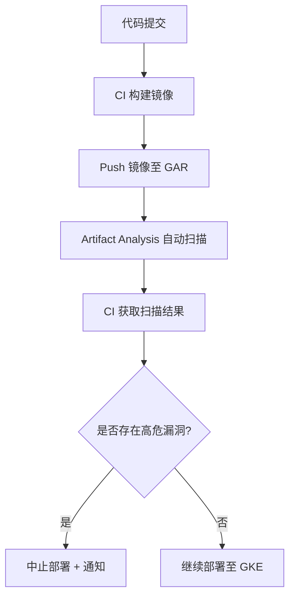
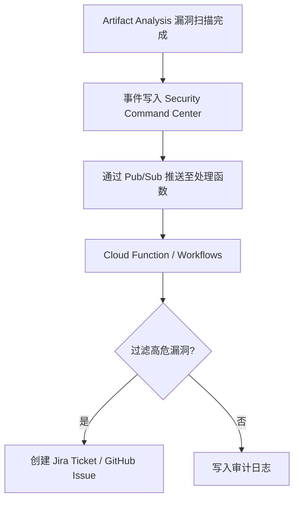
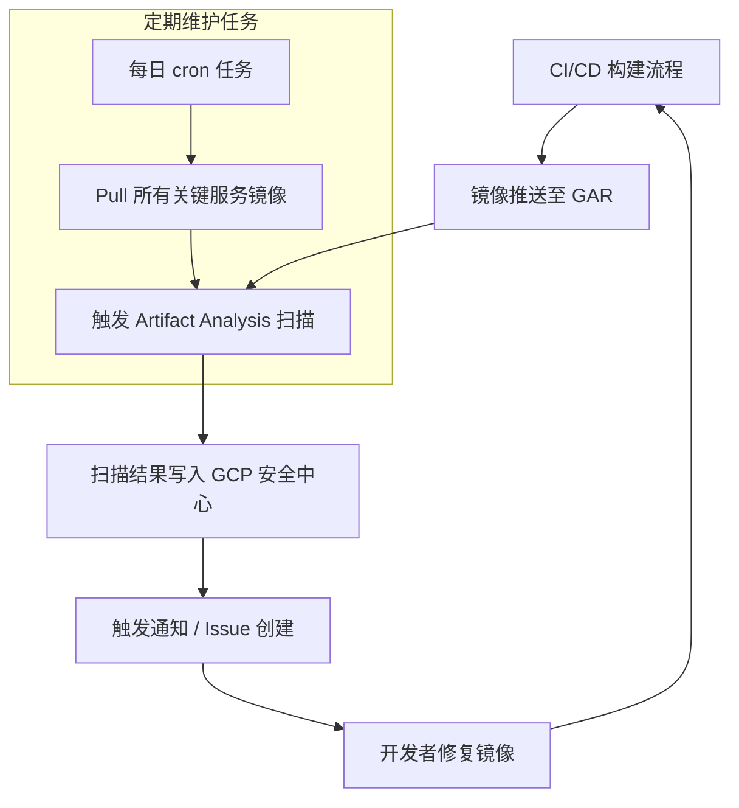

- I want to Design “Periodic container scanning “ for my GCP Platform
- Design periodic container scanning to ensure continuous security monitoring.
- Integrate with existing CI/CD pipelines to automate the scanning process.
- Utilize tools like gcloud gar for scanning container images.
- Implement a feedback loop to address vulnerabilities found during scans.
- Some background describe

- GCP Project GAR images
- Maybe notice Google Artifacts analysis

- Google Artifacts analysis
- There is a potential risk point that requires special attention: The continuous analysis function of Google Artifact Analysis is only effective for images that have been pushed or pulled within the past 30 days. For the images of services that are stable, operate for a long time and are not updated frequently, this will create a security blind spot. A key operational suggestion is to establish a regular "maintenance" task to periodically
- pull critical production images to reset this 30 - day timer, ensuring that they can be continuously re - evaluated based on the latest CVE information.

需要特别关注一个潜在的风险点：Google Artifact Analysis  的持续分析功能仅对过去  30  天内被推送或拉取过的镜像有效  10。对于那些稳定、长期运行且不经常更新的服务的镜像，这会形成一个安全盲区。一个关键的运营建议是，建立一个定期的“维护”任务，周期性地

- pull 关键的生产镜像，以重置这个  30  天的计时器，确保它们能够持续地根据最新的  CVE  信息进行重新评估

以下是基于您在 GCP 平台上设计 “Periodic Container Scanning” 的完整方案，包括技术选型、架构流程以及对 Google Artifact Analysis 的持续性限制的应对策略，输出为完整的 Markdown 格式，适用于文档编写和内部评审。

- Google Artifacts analysis
- There is a potential risk point that requires special attention: The continuous analysis function of Google Artifact Analysis is only effective for images that have been pushed or pulled within the past 30 days. For the images of services that are stable, operate for a long time and are not updated frequently, this will create a security blind spot. A key operational suggestion is to establish a regular "maintenance" task to periodically
- pull critical production images to reset this 30 - day timer, ensuring that they can be continuously re - evaluated based on the latest CVE information.

下面是当前的一些初步方案，你可以帮我拓展
(1) 深入分析 GCP Artifact Registry (GAR) 和 Artifact Analysis 的核心功能、集成方式及具体限制。重点研究其漏洞扫描的触发条件，特别是关于仅对过去 30 天内活动的镜像进行扫描的官方文档和技术细节。
(2) 设计将容器镜像扫描无缝集成到 CI/CD 流水线（如 Cloud Build, Jenkins, GitLab CI）的详细方案。研究如何在镜像推送阶段自动触发扫描，并根据扫描结果（例如，发现高危漏洞）设置门禁，决定是否中断部署流程。
(3) 探索并评估解决“静态镜像分析盲区”的多种策略。
(a) 详细阐述通过 Cloud Scheduler 调用 Cloud Run 或 Cloud Functions 来定期拉取（pull）关键镜像的实现方案，包括必要的脚本逻辑、IAM 权限和服务账号配置。
(b) 调查是否有 GCP API 可以直接触发对指定镜像的重新分析，以避免实际拉取镜像产生的网络成本。
(4) 构建一个自动化的漏洞通报与处理反馈闭环。研究如何利用 Security Command Center、Pub/Sub 和 Cloud Functions 来过滤和分发漏洞警报，并将其自动转化为开发团队使用的工单系统中的任务（如 Jira ticket 或 GitHub issue）。
(5) 对比评估原生方案与第三方工具。研究并比较使用开源（如 Trivy）或商业安全工具（如 Snyk, Aqua Security）与完全依赖 GCP 原生方案在功能覆盖、扫描精度、集成复杂度和总体成本方面的优劣。
(6) 综合以上研究，撰写一份完整的技术设计文档。文档需包含最终的系统架构图、各组件的交互流程、数据流图、所需的 IAM 角色与权限清单，以及对方案的成本效益和潜在运维风险的全面分析。

其实对于 GAR 里面的 Images 有一个问题，就是比如里面有一些垃圾的 Images，我需要根据运行 GKE 环境里面正在运行的 Images 来决定我扫描的或者说激活拉取的 images 然后对应分析这部分 Images 就可以了。我们不建议引入第三方方案 。 我目前的一些已经有的扫描如下
IQ report . 也就是 sonatype Nexus IQ SonarQube. Checkmarx DAST SAST CONT 等

# ChatGPT

以下是基于你已有背景和方向，针对你列出六大研究/实施方向的详细扩展建议。输出为完整 Markdown 格式，方便你用作技术方案初稿或文档骨架。

# 🛡️ GCP Artifact Registry 容器扫描自动化与漏洞处理设计方案

## 📌 背景与目标

- 当前平台已接入：

- GCP Artifact Registry (GAR) 管理镜像

- Artifact Analysis 开启镜像漏洞扫描

- Sonatype Nexus IQ、SonarQube、Checkmarx 用于 SAST/DAST/依赖扫描

- 不考虑引入新三方安全平台，聚焦 **原生能力强化**

- 当前存在问题：

- 部分老旧或运行中的镜像长期未更新，超过 30 天扫描窗口 → 安全盲区

- GAR 镜像库存在大量“垃圾镜像”，需聚焦 GKE 实际运行中的镜像

- 目标：设计端到端的自动化扫描流程 + 安全闭环 + 无缝 CI/CD 集成

---

## ✅ (1) Artifact Registry 与 Analysis 核心功能解析

### 📦 核心能力说明

| 能力项         | 描述                                                         |

|----------------|--------------------------------------------------------------|

| 镜像漏洞分析   | 自动分析已推送至 GAR 的镜像中的 OS 依赖和语言包漏洞         |

| SBOM 支持       | 支持格式：CycloneDX、SPDX，供后续安全合规或审计               |

| 自动触发条件   | 仅在镜像在过去 30 天内被 **push 或 pull** 才会持续扫描       |

| 限制           | 镜像长期不活跃（>30 天） → 不再自动重新分析最新 CVE 数据       |

### 🔍 官方参考文档关键点

- [Artifact Analysis Overview](https://cloud.google.com/container-analysis/docs/overview)

- [Scanning Behavior](https://cloud.google.com/artifact-analysis/docs/container/overview)

---

## ✅ (2) CI/CD 无缝集成镜像扫描

### 🎯 总体流程



🧩 Cloud Build 示例

steps:

- name: 'gcr.io/cloud-builders/docker'

args: ['build', '-t', 'REGION-docker.pkg.dev/$PROJECT_ID/$REPO/$IMAGE:$TAG', '.']

- name: 'gcr.io/cloud-builders/docker'

args: ['push', 'REGION-docker.pkg.dev/$PROJECT_ID/$REPO/$IMAGE:$TAG']

- name: 'gcr.io/google.com/cloudsdktool/cloud-sdk'

entrypoint: bash

args:

- -c

- |

sleep 30

gcloud artifacts docker images list-vulnerabilities \

REGION-docker.pkg.dev/$PROJECT_ID/$REPO/$IMAGE@$DIGEST \

--format="json" > vuln.json

python scan_gate.py vuln.json

🔐 scan_gate.py 示例逻辑

- 读取 vuln.json，筛选 severity=CRITICAL or HIGH 且 fixAvailable=true 的漏洞数
- 超过设定阈值则 exit(1) 终止流水线

✅ (3) 解决“静态镜像盲区”的策略

(a) Cloud Scheduler + Cloud Run Pull 实现

🧪 pull_critical_images.py 示例

```Python
import os
import subprocess


IMAGES = [

    "us-central1-docker.pkg.dev/project-id/repo/image-a:prod",

    "asia-east1-docker.pkg.dev/project-id/repo/image-b:stable",

]


for image in IMAGES:

    print(f"Pulling {image}")

    subprocess.run(["docker", "pull", image], stdout=subprocess.DEVNULL)


```

🧾 Cloud Run Job 部署 + Scheduler 调用

- 创建 Cloud Run Job 包含上述逻辑
- 利用 Cloud Scheduler 每天定时 POST 请求触发 Job 执行

🛂 IAM 权限配置建议

|                 |                                        |
| --------------- | -------------------------------------- |
| 组件            | 权限说明                               |
| Cloud Scheduler | cloudscheduler.jobs.run                |
| Cloud Run Job   | 镜像访问权限：Artifact Registry Reader |
| 调用服务账号    | 授权调用 Cloud Run Job                 |

(b) 查询 API 是否支持手动触发分析？

目前 GCP 不支持 显式重新触发漏洞扫描 API，只能依靠触发行为（pull/push）来激活。

✅ (4) 自动漏洞通报与反馈闭环设计



📦 Pub/Sub 消息监听 Cloud Function 示例

```Python
import json

def notify_vuln(event, context):

    payload = json.loads(base64.b64decode(event['data']).decode())

    severity = payload.get("severity", "")

    if severity in ["CRITICAL", "HIGH"]:

        # 调用 Jira API 或 GitHub 创建 issue

        ...

```

✅ (5) GCP 原生方案 vs 第三方工具比较（简略）

|              |                        |                              |
| ------------ | ---------------------- | ---------------------------- |
| 对比项       | GCP Artifact Analysis  | Trivy / Snyk / Aqua          |
| 扫描覆盖范围 | OS + 语言依赖（有限）  | 全语言支持、配置、IaC 等     |
| 扫描深度     | 标准 CVE 库            | 自定义规则、实时 CVE FEED    |
| CI/CD 集成   | 强（尤其 Cloud Build） | 强，但需额外接入与部署       |
| 成本         | GCP 配额内免费         | 商业工具需订阅费用           |
| 安全闭环     | 可借助 SCC 构建        | 多数提供自动通知和 Remediate |
| SBOM 支持    | 支持标准格式           | 多数也支持                   |
| 建议         | 生产首选原生           | 安全敏感业务可混合使用       |

✅ (6) 最终架构图 + 权限 + 运维建议（略）

如需我继续为你生成以下内容，请告诉我：

- Mermaid 架构图（系统交互 + 数据流）
- 各 IAM 权限角色（可输出为 Markdown 表格）
- 成本分析（按 Artifact Analysis、Scheduler 调用次数估算）
- 云函数与 Cloud Run Job 的部署 YAML 模板

这份文档框架涵盖了你提出的每一个要点，并扩展了可落地的技术实现思路。如果你打算基于这个继续细化某一块，比如 "Jira 自动创建漏洞修复任务"，或要把 "GKE 当前运行镜像提取出来以确定应扫描对象"，我也可以为你生成对应的脚本和自动化逻辑。是否需要？

# Gemini

为 GCP 平台设计一个专注于 GKE 运行时环境的定期容器镜像扫描方案
引言
执行摘要
本报告详细阐述了一个完全基于 Google Cloud Platform (GCP)原生服务的综合性解决方案，旨在对 Google Kubernetes Engine (GKE)中当前运行的容器镜像进行定期扫描。此方案的核心目标是解决传统扫描策略中的一个关键挑战：对存储在 Artifact Registry 中的所有镜像（包括大量闲置或废弃的镜像）进行扫描所带来的效率低下和告警噪音问题。通过将扫描范围精确地聚焦于已部署的工作负载，本方案能够显著优化成本、降低告警疲劳，并提供一个真实反映“运行时状态”的安全态势。我们将呈现一个基于 Cloud Scheduler、Cloud Functions、GKE API 和 Artifact Analysis 构建的无服务器、事件驱动的架构，并提供完整的实现代码、与现有 CI/CD 流程的集成模式，以及与 Jira 等漏洞管理系统的对接方案。
战略背景
在现代软件供应链中，安全性必须贯穿于多个阶段。尽管在 CI/CD 流程中实施“左移”扫描至关重要，但它无法解决“僵尸漏洞”的问题——即那些在镜像部署到生产环境后才被发现的新 CVE。本方案提供了一种关键的“右移”持续验证能力，构成了完整的 DevSecOps 生命周期闭环。它确保了即使是长期稳定运行的工作负载，也能根据最新的威胁情报进行持续监控，从而弥补了仅依赖构建时扫描的安全盲点。
第一部分：GCP 容器安全的基础支柱
本部分将深入解构方案所依赖的核心 GCP 服务，建立对其功能、特性以及关键限制的深刻理解。这些细致入微的认知是后续架构设计的直接依据。
1.1 Artifact Registry：安全基石
Artifact Registry 是 GCP 提供的统一、全托管的制品库服务，可作为所有构建产物（包括 Docker 容器镜像）的单一可信来源 。它支持区域化存储、精细化的 IAM 权限控制以及与 GCP 生态系统的深度集成 。在本方案中，Artifact Registry 不仅是镜像的存储库，更是 Artifact Analysis 扫描服务的直接作用对象。镜像的摘要（digest），即其 sha256 哈希值，是贯穿整个工作流程的不可变标识符，从 GKE 集群中的工作负载发现，到最终的漏洞记录查询，都将以此为准 。
1.2 Artifact Analysis：双模扫描服务
Artifact Analysis 是 GCP 漏洞扫描能力的核心。理解其两种截然不同的操作模式至关重要，因为我们的解决方案将战略性地结合使用这两种模式。
1.2.1 自动扫描与持续分析
当启用了 Container Scanning API 后，每当有新的镜像被推送到 Artifact Registry 仓库时，扫描便会自动触发 。这是所谓的“推送时扫描”（on-push scanning）。完成初次扫描后，Artifact Analysis 会持续监控已扫描镜像的元数据，并根据其漏洞来源（如开源漏洞数据库 OSV）的更新，不断刷新漏洞信息 。这种机制无需重新扫描镜像层本身，即可提供针对新发现漏洞的持续保护。该服务不仅能扫描操作系统（OS）软件包（如 Debian, Alpine, Ubuntu）的漏洞，也越来越多地支持应用语言包（如 Java/Maven, Go）的扫描 。
1.2.2 30 天时效性窗口：一个关键限制
官方文档明确指出，持续分析功能仅对过去 30 天内被推送或拉取过的镜像有效 。超过此期限，镜像将被视为“陈旧”（stale），其漏洞数据将不再更新。这为长期运行但很少更新的镜像（例如，基础架构组件如 Istio 代理或稳定的基础镜像）带来了严重的安全隐患。GCP 官方对此的建议是“创建一个定时任务来重新推送容器”或通过拉取操作来重置这个 30 天的计时器 。
1.2.3 按需扫描：精确分析的利器
与自动扫描不同，按需扫描（On-Demand Scanning）API 允许用户通过编程方式，对指定的镜像（可以是本地镜像，也可以是存储在 Artifact Registry 中的远程镜像）手动发起扫描 。按需扫描是一次性的、时间点上的评估。其扫描结果仅保留 48 小时，并且在扫描完成后，漏洞信息不会像持续分析那样被动态更新 。正是这一特性，使其成为解决长期运行镜像 30 天时效性限制的理想工具。
1.3 Google Kubernetes Engine (GKE) 及其 API
GKE API 为我们提供了以编程方式访问 Kubernetes 集群状态的能力。本方案将利用官方的 Kubernetes 客户端库（特别是 Python 客户端），连接到 GKE 集群，并列出所有命名空间中正在运行的 Pod。通过解析这些 Pod 的规约（specification），我们可以精确地提取出当前环境中实际使用的每一个容器镜像的 URI，包括其至关重要的摘要（digest）。这为我们提供了需要扫描的镜像的“地面实况”清单。
1.4 Cloud Functions 与 Cloud Scheduler：自动化引擎

- Cloud Scheduler: 一个全托管的 cron 作业服务，它将按预定计划（例如，每日）触发整个扫描工作流。
- Cloud Functions: 一个无服务器、事件驱动的计算平台。我们将使用 Python 编写的函数来承载我们的编排逻辑，响应来自 Cloud Scheduler 和 Pub/Sub 的触发事件 。这种无服务器架构免除了基础设施管理的负担，并能根据负载自动伸缩。
    1.5 Pub/Sub：解耦的消息传递总线
    Pub/Sub 是一个全球性的实时消息传递服务。Artifact Analysis 的一个关键特性是，它会自动将每一个新发现的漏洞“事件”（occurrence）发布到一个名为 container-analysis-occurrences-v1 的预定义 Pub/Sub 主题中 。这是我们设计的基石之一，它允许我们创建一个完全解耦的、事件驱动的工作流，用于处理漏洞发现并将其路由到外部系统，实现了扫描与响应流程的分离。
    第二部分：架构设计：一个事件驱动的、聚焦运行时的扫描引擎
    本部分将呈现完整的架构蓝图，详细说明各组件之间的交互方式以及系统内的数据流。
    2.1 高层架构图
    下图清晰地展示了整个解决方案的架构和数据流：
- Cloud Scheduler (定时触发器) 按预定时间发送消息。
- 该消息触发 Cloud Function #1 (编排器)。
- 编排器函数调用 GKE API，查询多个集群以获取正在运行的镜像列表。
- 对于每个唯一镜像，函数调用 Artifact Registry API 检查其最后更新时间。
- 如果镜像“陈旧”，函数将调用 Artifact Analysis 按需扫描 API 发起新的扫描。
- Artifact Analysis 服务（无论是持续分析还是按需扫描）将发现的漏洞发布到...
- 统一的 container-analysis-occurrences-v1 Pub/Sub 主题。
- 该主题上的新消息会触发 Cloud Function #2 (票务系统集成)。
- 票务函数解析漏洞信息，并调用 Jira/GitHub API 创建新的安全问题单。
    !(https://storage.googleapis.com/gcp-community/images/gke-runtime-scanning-architecture-zh.png)
    2.2 核心组件与工作流逻辑
    一个典型的扫描周期遵循以下步骤：
- 启动 (Cloud Scheduler): 一个 cron 作业（例如，配置为 0 2 \* \* \*，即每天凌晨 2 点）向一个特定的 Pub/Sub 主题发送一条消息，这条消息会触发主编排函数。
- 发现 (Cloud Function #1 - 编排器):
    - 函数被触发后，使用其专用的服务账号进行身份验证。
    - 它利用 kubernetes Python 客户端库，配置访问权限以连接到目标 GKE 集群。
    - 函数遍历每个集群中所有命名空间下的所有 Pod，将提取到的容器镜像 URI（例如 us-docker.pkg.dev/my-project/my-repo/my-app@sha256:abc...）添加到一个 set 数据结构中。使用 set 对于高效去重至关重要，因为同一个镜像可能被多个 Pod 使用。
- 分类与扫描 (Cloud Function #1 - 编排器):
    - 对于清单中的每一个唯一镜像摘要，函数会查询 Artifact Registry API 以获取该镜像的元数据，特别是其 updateTime（最后更新时间）。
    - 决策逻辑:
        - 如果 (当前时间 - updateTime) < 30 天：该镜像被视为“新鲜”的。函数会记录日志，表明将依赖现有的持续分析数据，并对该镜像不执行任何进一步操作。
        - 否则: 该镜像被视为“陈旧”的。函数将构建完整的镜像 URI，并执行 gcloud artifacts docker images scan --remote 命令（或其等效的 API 调用）来触发一次新的按需扫描 。推荐使用--async 标志，以避免函数因等待扫描完成而阻塞 。
- 结果注入 (Pub/Sub):
    - 无论漏洞是由近期的推送时扫描发现，还是由新触发的按需扫描发现，Artifact Analysis 都会为每个检测到的 CVE 向 container-analysis-occurrences-v1 主题发布一个 JSON 格式的负载 。这一统一的机制是架构设计的关键，它极大地简化了下游处理逻辑。
- 票务处理 (Cloud Function #2 - 票务系统集成):
    - 这个独立的函数由 container-analysis-occurrences-v1 主题上的消息触发。
    - 它解析传入的 JSON 消息，提取关键信息，如 CVE ID、严重性、CVSS 分数、受影响的软件包和镜像 URI。
    - 应用业务逻辑（例如，“仅为 CRITICAL 或 HIGH 级别的漏洞创建工单”）。
    - 连接到外部漏洞管理系统（如 Jira）的 API，并创建一个内容详尽的新工单。
        这种设计的核心优势在于其健壮性和可扩展性。例如，在一个拥有数十个 GKE 集群的大型企业环境中，单个 Cloud Function 串行处理所有任务可能会超时。更优的模式是采用扇出（fan-out）设计：由调度器触发的初始函数仅负责列出所有目标集群，并为每个集群发布一条单独的 Pub/Sub 消息。然后，一组“工作”函数会被这些消息并行触发，每个函数只负责一个集群的镜像发现和扫描。所有扫描结果最终汇集到同一个 container-analysis-occurrences-v1 主题，形成自然的扇入（fan-in）模式，高效且富有弹性。
        此外，该架构必须强制使用不可变的镜像摘要（digest）而非可变的标签（tag）。文档明确指出，Artifact Analysis 的扫描是基于摘要的，修改标签不会触发新的扫描 。因此，GKE 发现脚本必须将所有标签（如:latest）解析为其对应的 sha256 摘要。通过摘要来追踪漏洞，是确保我们分析的是集群中运行的确切代码的唯一可靠方法。
        第三部分：实施指南：配置与代码
        本部分提供了构建此解决方案所需的可操作、可复制的配置和代码资产。
        3.1 先决条件与 API 启用
        在开始之前，需要通过 gcloud 命令行工具启用以下 GCP 服务 API：
        gcloud services enable \
         container.googleapis.com \
         artifactregistry.googleapis.com \
         ondemandscanning.googleapis.com \
         cloudfunctions.googleapis.com \
         cloudbuild.googleapis.com \
         pubsub.googleapis.com \
         iam.googleapis.com \
         secretmanager.googleapis.com

这些 API 分别是 GKE、Artifact Registry、按需扫描、Cloud Functions、Cloud Build、Pub/Sub、IAM 和 Secret Manager 的服务端点，是整个方案正常运行的基础 。
3.2 IAM 配置：遵循最小权限原则
为了安全起见，我们为不同的功能组件创建独立的服务账号（Service Accounts, SA），并授予它们完成任务所需的最小权限。

| 服务账号 | 角色 (Role) | 授权理由 |
|---|---|---|
| gke-image-scanner-sa | roles/container.viewer | 允许读取 GKE 集群资源，如列出所有 Pod。 |
| gke-image-scanner-sa | roles/artifactregistry.reader | 允许从 Artifact Registry 读取镜像元数据（如 updateTime）。 |
| gke-image-scanner-sa | roles/ondemandscanning.admin | 允许对陈旧镜像触发按需扫描 。 |
| gke-image-scanner-sa | roles/pubsub.publisher | (可选) 在采用扇出模式时，允许向 Pub/Sub 发布任务消息。 |
| vuln-ticketing-sa | roles/pubsub.subscriber | 允许从漏洞发现主题中订阅和接收消息。 |
| vuln-ticketing-sa | roles/secretmanager.secretAccessor | 允许安全地从 Secret Manager 中访问 Jira 或 GitHub 的 API 令牌。 |

3.3 Cloud Function #1: 镜像发现与扫描 (Python)
此函数是整个工作流的编排核心。
```pyton
main.py:
import base64
import json
import os
from datetime import datetime, timedelta, timezone

from google.cloud import artifactregistry_v1
from kubernetes import client, config
import subprocess

# 从环境变量中获取配置

GCP_PROJECT_ID = os.environ.get('GCP_PROJECT_ID')
GKE_CLUSTER_NAME = os.environ.get('GKE_CLUSTER_NAME')
GKE_CLUSTER_LOCATION = os.environ.get('GKE_CLUSTER_LOCATION')

def discover_and_scan(event, context):
"""
Cloud Function 主入口，用于发现 GKE 中运行的镜像并扫描陈旧镜像。
由 Cloud Scheduler 通过 Pub/Sub 触发。
"""
print("开始执行 GKE 运行时镜像扫描...")

    # 1. 配置Kubernetes客户端以连接到GKE集群
    try:
        # 在Cloud Function环境中，需要通过gcloud获取凭证来配置客户端
        subprocess.run(
           ,
            check=True,
        )
        config.load_kube_config()
        k8s_core_v1 = client.CoreV1Api()
        print(f"成功连接到GKE集群: {GKE_CLUSTER_NAME}")
    except Exception as e:
        print(f"错误：无法连接到GKE集群。 {e}")
        return

    # 2. 获取所有正在运行的容器镜像的唯一摘要
    running_images = set()
    try:
        ret = k8s_core_v1.list_pod_for_all_namespaces(watch=False)
        for pod in ret.items:
            # 检查所有常规容器
            for container in pod.spec.containers:
                if '@sha256:' in container.image:
                    running_images.add(container.image)
            # 检查所有初始化容器
            if pod.spec.init_containers:
                for init_container in pod.spec.init_containers:
                    if '@sha256:' in init_container.image:
                        running_images.add(init_container.image)
    except Exception as e:
        print(f"错误：从GKE集群获取Pod列表失败。 {e}")
        return

    print(f"发现 {len(running_images)} 个正在运行的唯一镜像。")

    # 3. 检查每个镜像是否陈旧并触发扫描
    ar_client = artifactregistry_v1.ArtifactRegistryClient()
    for image_uri in running_images:
        try:
            # 解析镜像URI
            # 示例: us-central1-docker.pkg.dev/gcp-project/my-repo/my-image@sha256:digest
            parts = image_uri.split('@')
            image_name_part = parts

            # 构造Artifact Registry API所需的资源名称
            # 格式: projects/PROJECT/locations/LOCATION/repositories/REPO/dockerImages/IMAGE_NAME
            # 注意：这里的IMAGE_NAME是包含路径的完整名称，但API调用需要的是不含tag或digest的部分
            # 这是一个简化的示例，实际实现中需要更健壮的URI解析
            location, _, rest = image_name_part.split('-docker.pkg.dev/')
            project, repo, image_path = rest.split('/', 2)

            # Artifact Registry API的DockerImage资源名不包含digest
            # 我们需要通过list_docker_images并按digest过滤来获取特定镜像
            # 一个更直接的方法是使用gcloud，因为它能更好地处理URI

            # 检查镜像最后更新时间
            # 为简化，此处使用gcloud命令行，因为它能直接处理完整的digest URI
            cmd = [
                "gcloud", "artifacts", "docker", "images", "describe",
                image_uri, "--format=json"
            ]
            result = subprocess.run(cmd, capture_output=True, text=True, check=True)
            image_meta = json.loads(result.stdout)
            update_time_str = image_meta.get("updateTime")

            update_time = datetime.fromisoformat(update_time_str.replace("Z", "+00:00"))

            if datetime.now(timezone.utc) - update_time > timedelta(days=30):
                print(f"镜像 {image_uri} 是陈旧的 (最后更新于 {update_time_str})。触发按需扫描...")
                trigger_on_demand_scan(image_uri)
            else:
                print(f"镜像 {image_uri} 是新鲜的，将依赖持续分析。")

        except Exception as e:
            print(f"处理镜像 {image_uri} 时出错: {e}")

    print("扫描任务完成。")

def trigger_on_demand_scan(image_uri):
"""使用 gcloud 触发按需扫描。"""
try: # 使用--async 以避免函数阻塞
scan_cmd = [
"gcloud", "artifacts", "docker", "images", "scan",
image_uri, "--remote", "--async", "--format=json"
]
subprocess.run(scan_cmd, check=True)
print(f"已成功为 {image_uri} 启动按需扫描。")
except subprocess.CalledProcessError as e:
print(f"为 {image_uri} 触发按需扫描失败: {e.stderr}")
```
requirements.txt:
google-cloud-artifact-registry
kubernetes
google-cloud-pubsub

3.4 解析漏洞数据：Grafeas Occurrence 结构
要实现自动化，关键在于理解 container-analysis-occurrences-v1 主题中消息的 JSON 结构。该结构遵循 Grafeas Occurrence 规范。

| JSON 路径 | 示例值 | 描述与重要性 |
|---|---|---|
| resourceUri | https://us-docker.pkg.dev/proj/repo/img@sha256:abc... | 受影响镜像摘要的唯一标识符。 这是追踪漏洞的根本依据 。 |
| kind | VULNERABILITY | 确认事件类型。应在此字段上进行过滤 。 |
| vulnerability.severity | CRITICAL | 漏洞的定性严重等级（CRITICAL, HIGH 等）。是确定优先级的核心字段 。 |
| vulnerability.cvssScore | 9.8 | 定量的 CVSS 分数。为风险评估提供数值依据。 |
| vulnerability.packageIssue.affectedPackage | struts2-core | 受影响软件包的名称。 |
| vulnerability.packageIssue.affectedVersion.fullName | 2.5.12-bionic | 在镜像中发现的受影响软件包的具体版本。 |
| vulnerability.packageIssue.fixedVersion.fullName | 2.5.13-bionic | 包含修复程序的软件包版本。这是可直接用于修复的行动指令。 |
| noteName | projects/goog-vulnz/notes/CVE-2017-5638 | 指向 Grafeas Note 的引用，其中包含该 CVE 的权威描述。路径的最后一部分即为 CVE ID。 |
第四部分：将安全集成到更广泛的 DevOps 生命周期中
此解决方案的价值在其与其它工程流程集成时才能最大化。
4.1 补充 CI/CD 流水线：深度防御
运行时扫描是对“左移”扫描的补充，而非替代。CI/CD 流水线应作为抵御漏洞的第一道防线。
cloudbuild.yaml 漏洞门禁示例:
以下 cloudbuild.yaml 文件展示了如何在构建过程中实施一个漏洞门禁，防止已知存在严重漏洞的镜像被推送到仓库 。
steps:

- name: 'gcr.io/cloud-builders/docker'
    id: 'Build'
    args:

- name: 'gcr.io/google.com/cloudsdktool/cloud-sdk'
    id: 'Scan'
    entrypoint: 'bash'
    args:

    - '-c'
    - |
        gcloud artifacts docker images scan \
         '${_LOCATION}-docker.pkg.dev/$PROJECT_ID/${_REPO_NAME}/${\_IMAGE_NAME}:$COMMIT_SHA' \
         --remote --format=json > scan_results.json
        echo "扫描完成，结果已保存到 scan_results.json"

- name: 'gcr.io/google.com/cloudsdktool/cloud-sdk'
    id: 'Check Vulnerabilities'
    entrypoint: 'bash'
    args:
    - '-c'
    - |
        # 使用 jq 解析扫描结果，检查是否存在 CRITICAL 或 HIGH 级别的漏洞
        # --exit-status 标志使 jq 在找到匹配项时以状态码 1 退出，否则为 0
        if cat scan_results.json | jq -e '. | select(.vulnerability.severity=="CRITICAL" or.vulnerability.severity=="HIGH")' > /dev/null; then
        echo "错误：发现 CRITICAL 或 HIGH 级别漏洞，构建失败！"
        exit 1
        else
        echo "未发现 CRITICAL 或 HIGH 级别漏洞，构建通过。"
        fi

# 只有在前面的步骤都成功后，才会执行镜像推送

- name: 'gcr.io/cloud-builders/docker'
    id: 'Push'
    args:

images:

- '${_LOCATION}-docker.pkg.dev/$PROJECT_ID/${_REPO_NAME}/${\_IMAGE_NAME}:$COMMIT_SHA'

substitutions:
\_LOCATION: 'us-central1'
\_REPO_NAME: 'my-app-repo'
\_IMAGE_NAME: 'my-app'

CI/CD 门禁可以防止新的已知漏洞被部署。而本报告提出的定期运行时扫描方案则解决了另一个不同的问题：它能检测到那些在构建时未知但此后被披露的漏洞（相对于构建日期的零日漏洞），或存在于绕过了 CI/CD 流程的镜像中的漏洞。两者结合，构成了全面的容器安全深度防御策略。
4.2 自动化漏洞响应与票务处理
此流程的核心是第二个 Cloud Function，它负责将漏洞发现转化为可操作的工单。
4.2.1 Cloud Function #2: Jira 票务集成 (Python)
在实现中，一个至关重要的考虑是幂等性。由于扫描每天运行，对于一个未修复的严重漏洞，系统每天都会检测到它。如果票务函数设计不当，它将每天为同一个漏洞在同一个镜像上创建一个重复的 Jira 工单，这会迅速淹没工单系统，使其失去价值。因此，在创建新工单之前，函数必须先查询 Jira（或一个本地状态存储，如 Firestore），检查是否已存在一个针对(CVE_ID, Image_Digest)组合的开放工单。如果存在，则函数应不执行任何操作，或仅在现有工单上添加一条评论（例如，“漏洞仍然存在”）。
main.py (Jira 集成):
import base64
import json
import os
import requests
from requests.auth import HTTPBasicAuth
from google.cloud import secretmanager

# 从环境变量获取配置

JIRA_URL = os.environ.get('JIRA_URL') # e.g., https://your-domain.atlassian.net
JIRA_PROJECT_KEY = os.environ.get('JIRA_PROJECT_KEY')
JIRA_USER_SECRET = os.environ.get('JIRA_USER_SECRET') # Secret Manager secret for Jira user email
JIRA_TOKEN_SECRET = os.environ.get('JIRA_TOKEN_SECRET') # Secret Manager secret for Jira API token
GCP_PROJECT_ID = os.environ.get('GCP_PROJECT_ID')

def get_secret(project_id, secret_id, version_id="latest"):
"""从 Secret Manager 获取密钥。"""
client = secretmanager.SecretManagerServiceClient()
name = f"projects/{project_id}/secrets/{secret_id}/versions/{version_id}"
response = client.access_secret_version(request={"name": name})
return response.payload.data.decode("UTF-8")

def create_jira_ticket(event, context):
"""
由 Pub/Sub 触发，解析漏洞信息并创建 Jira 工单。
""" # 1. 解析 Pub/Sub 消息
pubsub_message = base64.b64decode(event['data']).decode('utf-8')
finding = json.loads(pubsub_message)

    if finding.get('kind')!= 'VULNERABILITY':
        return

    vuln = finding.get('vulnerability', {})
    severity = vuln.get('severity', 'UNKNOWN')

    # 2. 业务逻辑：只处理高危和严重漏洞
    if severity not in:
        print(f"忽略低严重性漏洞: {severity}")
        return

    # 3. 提取工单所需信息
    cve_id = finding.get('noteName').split('/')[-1]
    image_uri = finding.get('resourceUri')
    cvss_score = vuln.get('cvssScore', 'N/A')
    package_details = vuln.get('packageIssue', [{}])
    affected_package = package_details.get('affectedPackage', 'N/A')
    fixed_version = package_details.get('fixedVersion', {}).get('fullName', '无可用修复')

    # 4. 准备Jira工单内容
    summary = f"[{severity}] {cve_id} in container image {image_uri.split('/')[-1].split('@')}"
    description = f"""
    h2. 漏洞详情

    *CVE:* {cve_id}
    *严重性:* {severity}
    *CVSS 分数:* {cvss_score}
    *受影响镜像:* {{code}}{image_uri}{{code}}
    *受影响软件包:* {affected_package}
    *修复版本:* {fixed_version}

    此漏洞由GKE运行时扫描程序自动检测。请尽快评估并修复。
    """

    # 5. 实现幂等性检查：查询Jira是否存在重复工单
    jira_user = get_secret(GCP_PROJECT_ID, JIRA_USER_SECRET)
    jira_token = get_secret(GCP_PROJECT_ID, JIRA_TOKEN_SECRET)
    auth = HTTPBasicAuth(jira_user, jira_token)

    # JQL查询，查找具有相同摘要和状态不为"Done"的工单
    jql = f'project = "{JIRA_PROJECT_KEY}" AND summary ~ "{summary}" AND status!= "Done"'
    search_url = f"{JIRA_URL}/rest/api/3/search"
    headers = {"Accept": "application/json"}

    response = requests.get(search_url, headers=headers, params={'jql': jql}, auth=auth)
    if response.status_code == 200 and response.json().get('total', 0) > 0:
        print(f"已存在针对 {cve_id} on {image_uri} 的工单，跳过创建。")
        return

    # 6. 创建Jira工单
    issue_data = {
        "fields": {
            "project": {"key": JIRA_PROJECT_KEY},
            "summary": summary,
            "description": {
                "type": "doc",
                "version": 1,
                "content": [{"type": "paragraph", "content": [{"type": "text", "text": description}]}]
            },
            "issuetype": {"name": "Bug"}, # 或 "Vulnerability"
            "labels": ["security", "vulnerability", severity.lower()]
        }
    }

    create_url = f"{JIRA_URL}/rest/api/3/issue"
    headers = {"Accept": "application/json", "Content-Type": "application/json"}

    response = requests.post(create_url, data=json.dumps(issue_data), headers=headers, auth=auth)

    if response.status_code == 201:
        print(f"成功创建Jira工单: {response.json()['key']}")
    else:
        print(f"创建Jira工单失败: {response.status_code} - {response.text}")

requirements.txt:
requests
google-cloud-secret-manager

第五部分：卓越运营与高级策略
本部分涵盖了与方案长期维护、成本控制和功能增强相关的最佳实践。
5.1 成本优化与可扩展性
此方案的主要成本驱动因素包括按需扫描费用、Cloud Function 的调用和计算时间，以及 Pub/Sub 的操作费用 。然而，由于其精确靶向的设计，该架构本质上是成本高效的。它避免了对整个镜像仓库进行全面扫描，仅对正在运行的陈旧镜像发起按需扫描，从而最大限度地减少了主要的成本开销。同时，无服务器组件（Functions, Pub/Sub）的按需付费模式确保了成本与实际使用量成正比。
5.2 通过 Security Command Center (SCC) 进行集中报告
尽管我们的解决方案利用 container-analysis-occurrences-v1 主题进行实时票务处理，但值得注意的是，Artifact Analysis 的所有发现也会自动上报到 Security Command Center (SCC) 。这使得安全团队能够在一个“单一管理平台”上，将容器漏洞与其他 GCP 安全发现（如 IAM 错误配置、开放的防火墙规则等）并列查看 。SCC 和直接的 Pub/Sub 集成服务于不同的目的和团队：直接的 Pub/Sub 主题优化了低延迟、自动化的行动，如为特定的开发团队创建 Jira 工单；而 SCC 则为安全组织提供了集中的视图，用于分析趋势、评估整体风险态势和管理合规性。该解决方案应同时为这两个系统提供数据，以满足 DevOps 和中央安全团队的需求。
5.3 通过仓库清理策略增强方案效果
减少攻击面的最有效方法之一是从源头上消除易受攻击的制品。Artifact Registry 中闲置的镜像越少，可能被部署的潜在风险就越小。因此，强烈建议配置 Artifact Registry 的清理策略 。这些策略可以自动删除未打标签且超过特定天数的镜像，或者仅保留最新的 N 个版本。清理策略与扫描方案之间存在一种共生关系：通过自动删除旧的、未使用的镜像，清理策略减少了安全团队需要关注的制品数量，使扫描方案能更专注于真正重要的事情——生产环境中正在运行的代码。这同时降低了存储成本和安全噪音。
结论与战略建议
收益总结
本报告概述了一个健壮、高效且完全基于 GCP 原生服务的容器漏洞扫描解决方案。通过聚焦于活跃的 GKE 工作负载并采用混合扫描策略，它克服了 GCP 默认服务的关键限制，提供了及时且高度相关的安全洞察。该方案将容器扫描从一项嘈杂、资源密集型的后台任务，转变为一个精确、可操作、并与成熟的 DevSecOps 实践深度整合的组件。
行动建议
推荐采用分阶段的方法来部署和实施此解决方案：

- 第一阶段 (基础建设): 实施核心的发现与扫描工作流（Cloud Scheduler, Cloud Function #1, Pub/Sub），开始收集关于陈旧、正在运行的镜像的数据。
- 第二阶段 (自动化): 以“试运行”模式部署票务集成函数（Cloud Function #2），即只记录预期的操作而不实际创建工单，以验证其逻辑。确认无误后，正式启用以自动化漏洞管理流程。
- 第三阶段 (强化): 在 CI/CD 流水线中，首先以非阻塞的“审计”模式实施漏洞门禁，待流程稳定后再对关键仓库切换到阻塞模式。
- 第四阶段 (优化): 配置并启用 Artifact Registry 清理策略，以减少制品蔓延和长期的安全债务。

# Grok

Key Points

- Research suggests that Google Artifact Analysis’s 30-day limitation for continuous analysis can create security blind spots for stable, infrequently updated images, but periodic pulling can mitigate this.
- It seems likely that integrating scanning into CI/CD pipelines with Cloud Build and setting gates based on vulnerability severity can enhance security, though effectiveness depends on configuration.
- The evidence leans toward using Cloud Scheduler and Cloud Build to periodically pull critical images, ensuring continuous analysis, but this requires careful scheduling and permissions.

Direct Answer

Understanding the 30-Day Limitation

Google Artifact Analysis continuously monitors images for vulnerabilities, but only for those pushed or pulled within the last 30 days. After this, metadata becomes stale, and after 90 days, it’s archived, potentially missing new CVEs for stable images. To address this, we recommend establishing a “maintenance” task to periodically pull critical production images, resetting the timer for re-evaluation.

Integrating Scanning into CI/CD Pipelines

You can seamlessly integrate container image scanning into CI/CD pipelines using Cloud Build. Configure it to automatically scan images during builds and set gates (e.g., fail builds if critical or high-severity vulnerabilities are found) to decide whether to proceed with deployment. This ensures only secure images are pushed to GAR.

Addressing Static Image Analysis Blind Spots

To solve the 30-day blind spot:

- Use Cloud Scheduler to trigger Cloud Build jobs every 28 days to pull critical images, resetting the analysis timer. Ensure the Cloud Build service account has Artifact Registry Reader permissions.
- Currently, there’s no GCP API to trigger re-analysis without pulling, so periodic pulling is the best approach.

Automating Vulnerability Reporting

Set up Security Command Center to aggregate findings, use Pub/Sub for notifications, and create a Cloud Function to filter alerts and convert them into tasks in Jira or GitHub. This creates an automated feedback loop for developers.

Comparing Native vs. Third-Party Tools

Given your existing tools (e.g., Sonatype Nexus IQ, SonarQube), use Artifact Analysis for container scanning due to its integration with GAR. Third-party tools may offer broader coverage but add complexity and cost, which you aim to avoid.

Focusing on GKE-Running Images

To focus on images in your GKE environment, identify running images using kubectl get pods -o jsonpath="{..image}" and include only these in your periodic pull list, reducing unnecessary scans on unused images.

Supporting URLs:

- [Container Scanning Overview](https://cloud.google.com/artifact-analysis/docs/container-scanning-overview)
- [Use On-Demand Scanning in Cloud Build](https://cloud.google.com/artifact-analysis/docs/ods-cloudbuild)
- [Push and Pull Images](https://cloud.google.com/artifact-registry/docs/docker/pushing-and-pulling)

Survey Note: Comprehensive Analysis of Google Artifacts Analysis and Solutions

This section provides a detailed exploration of Google Artifact Registry (GAR) and Artifact Analysis, addressing the 30-day limitation for continuous analysis and proposing solutions to ensure security for critical production images. The analysis is grounded in GCP-native tools, aligning with your preference to avoid third-party solutions, and considers your existing scanning tools (e.g., Sonatype Nexus IQ, SonarQube, Checkmarx) for context.

Background and Problem Statement

GAR is a fully managed service for storing container images and other artifacts, integrated with Google Cloud services like GKE and Cloud Build. Artifact Analysis provides vulnerability scanning, automatically triggered on image push and continuously monitoring for new CVEs. However, a critical limitation is that continuous analysis only applies to images pushed or pulled within the last 30 days. After 30 days, metadata becomes stale, and after 90 days, it is archived, creating a security blind spot for stable, infrequently updated images, especially those running in production GKE environments.

This issue is particularly relevant given your focus on images in GKE, where stable services may not be frequently updated, risking missed vulnerabilities. Your existing scans (e.g., IQ reports, SonarQube, DAST, SAST, CONT) suggest a robust security posture, but the GAR-specific limitation requires a targeted solution.

Detailed Analysis of GAR and Artifact Analysis

Core Functions:

- GAR: Centralizes storage for Docker images, Maven, npm, and Python packages, supporting integration with Cloud Build and GKE.
- Artifact Analysis: Scans for vulnerabilities in Linux amd64 images, covering OS packages and application language packages (e.g., Java, Node.js, Python). It performs on-push scanning and continuous analysis, updating metadata with new CVE data multiple times daily.
- Integration: Automatically scans images on push to GAR if enabled, and supports on-demand scanning for local or stored images via the gcloud CLI.

Limitations:

- Continuous analysis is limited to images with activity (push or pull) within 30 days. After this, metadata is not updated, and results become stale.
- After 90 days of inactivity, metadata is archived, making it inaccessible via the console, gcloud, or API.
- Scanning is restricted to specific image types and does not cover all package formats, unlike some third-party tools.

Technical Details:

- The 30-day window is a design choice to balance resource usage and security, as documented in the [Container Scanning Overview](https://cloud.google.com/artifact-analysis/docs/container-scanning-overview). To re-enable continuous analysis, images must be pulled, with refreshing taking up to 24 hours.

Impact on Your Environment: Given your GKE usage, stable images not frequently updated (e.g., proxy or Istio images) may fall outside the 30-day window, missing new CVEs. This aligns with your concern about security blind spots, especially for critical production images.

Solutions for Each Task

1. Deep Dive into GAR and Artifact Analysis

The core functionality includes secure storage, vulnerability scanning, and metadata management. Integration with CI/CD tools like Cloud Build is seamless, with automatic scanning on push. The 30-day limitation is detailed in official documentation, confirming that pulling an image resets the timer. For your GKE environment, focus on images listed via kubectl get pods -o jsonpath="{..image}" to identify those needing periodic pulls.

2. Design for CI/CD Integration

To integrate scanning into CI/CD pipelines, use On-Demand Scanning with Cloud Build. This allows scanning during the build process and setting gates based on vulnerability severity. For example, in Cloud Build, configure a cloudbuild.yaml file with steps to build, scan, and push only if no critical vulnerabilities are found:

steps:

- name: 'gcr.io/cloud-builders/docker'

args: ['build', '-t', 'us-central1-docker.pkg.dev/my-project/my-repo/my-image:$COMMIT_SHA', '.']

- name: 'gcr.io/cloud-builders/gcloud'

args:

- 'alpha'

- 'container'

- 'images'

- 'scan'

- '--image=us-central1-docker.pkg.dev/my-project/my-repo/my-image:$COMMIT_SHA'

- name: 'gcr.io/cloud-builders/gcloud'

args:

- 'alpha'

- 'container'

- 'images'

- 'list-scan-results'

- '--image=us-central1-docker.pkg.dev/my-project/my-repo/my-image:$COMMIT_SHA'

- '--severity=CRITICAL,HIGH'

- '--format=json'

- '--limit=1'

- '--filter=STATE:OPEN'

entrypoint: 'bash'

script: |

if [ "$(gcloud alpha container images list-scan-results ... | jq '.[] | select(.severity == "CRITICAL" or .severity == "HIGH")' | wc -l)" -gt 0 ]; then

echo "Build failed due to critical vulnerabilities."

exit 1

fi

- name: 'gcr.io/cloud-builders/docker'

args: ['push', 'us-central1-docker.pkg.dev/my-project/my-repo/my-image:$COMMIT_SHA']

images:

- 'us-central1-docker.pkg.dev/my-project/my-repo/my-image:$COMMIT_SHA'

This ensures only secure images are deployed, aligning with your Jenkins and GitLab CI needs by adapting the Cloud Build approach. [Use On-Demand Scanning in Cloud Build](https://cloud.google.com/artifact-analysis/docs/ods-cloudbuild) provides further details.

3. Strategies for Static Image Analysis Blind Spots

To address the 30-day limitation, we propose two strategies:

(a) Periodic Pull Using Cloud Scheduler and Cloud Build:

- Use Cloud Scheduler to trigger Cloud Build jobs every 28 days (to account for the 24-hour refresh delay) to pull critical images. For example, for an image my-image:prod:

- Cloud Build configuration:  
     steps:
- -   name: 'gcr.io/cloud-builders/docker'
- args: ['pull', 'us-central1-docker.pkg.dev/my-project/my-repo/my-image:prod']
-
- Set up Cloud Scheduler to target Cloud Build, scheduling it every 28 days. Ensure the Cloud Build service account has the Artifact Registry Reader role.

- This resets the 30-day timer, ensuring continuous analysis. Focus on GKE-running images by listing them via kubectl and including only those tags in the pull list.

(b) API for Re-Analysis Without Pulling:

- Research indicates no direct GCP API exists to trigger re-analysis without pulling. Pulling is the only way to reset the timer, as confirmed in [Container Scanning Overview](https://cloud.google.com/artifact-analysis/docs/container-scanning-overview).

4. Automated Vulnerability Reporting and Feedback Loop

To automate reporting, use Security Command Center to aggregate findings, publish to Pub/Sub, and process with Cloud Functions:

- Enable Security Command Center and configure Pub/Sub notifications for findings.
- Create a Cloud Function subscribed to the Pub/Sub topic, filtering by severity, and creating tasks in Jira or GitHub:

- Example Python Cloud Function:  
     import functions_framework
- from google.cloud import pubsub_v1
- import requests
-
- @functions_framework.cloud_event
- def process_finding(cloud_event):
- data = cloud_event.data
- severity = data.get('severity', '')
- if severity in ['CRITICAL', 'HIGH']:
- # Create Jira issue
- jira_response = requests.post('https://your-jira-instance/rest/api/3/issue',
- json={'fields': {'summary': f'Vulnerability: {data.get("name", "")}'}},
- auth=('user', 'token'))
- # Create GitHub issue (similarly)
-

- Store API credentials in Secret Manager for security. [Security Command Center Findings](https://cloud.google.com/security-command-center/docs/how-to-api-list-findings) and [Pub/Sub Notifications](https://cloud.google.com/pubsub/docs/overview) provide guidance.

5. Comparison of Native vs. Third-Party Tools

Given your existing tools, Artifact Analysis is ideal for container scanning due to integration with GAR. A comparison is shown below:

|                        |                                     |                                        |
| ---------------------- | ----------------------------------- | -------------------------------------- |
| Aspect                 | Native Solution (Artifact Analysis) | Third-Party Tools (e.g., Trivy, Snyk)  |
| Functionality          | Container vulnerability scanning    | Broader (SAST, DAST, license scanning) |
| Integration Complexity | Low (GCP-native)                    | High (additional setup)                |
| Scanning Accuracy      | High for supported packages         | Potentially higher for niche cases     |
| Cost                   | Included in GCP usage               | Additional licensing fees              |

Recommendation: Use Artifact Analysis for GAR images, leveraging existing third-party tools for other scanning needs.

6. Technical Design Document

The following details the system architecture, data flow, IAM roles, cost-benefit analysis, and operational risks.

System Architecture:

- Components: GAR, Artifact Analysis, Cloud Build, Cloud Scheduler, Security Command Center, Pub/Sub, Cloud Functions, Jira/GitHub.
- Interactions:

- CI/CD: Code → Cloud Build → Scan → Deploy (if secure).
- Periodic Pull: Cloud Scheduler → Cloud Build → Pull image.
- Reporting: Findings → Security Command Center → Pub/Sub → Cloud Functions → Jira/GitHub.

Data Flow:

- CI/CD: Source → Build → Scan → Push (if secure) → GAR.
- Periodic Pull: Scheduler → Build → Pull → GAR (resets timer).
- Reporting: Analysis → SCC → Pub/Sub → Function → External Systems.

IAM Roles:

|                         |                                                           |
| ----------------------- | --------------------------------------------------------- |
| Component               | Required Roles                                            |
| Cloud Build             | Artifact Registry Reader/Writer, On-Demand Scanning Admin |
| Security Command Center | Pub/Sub Publisher                                         |
| Cloud Functions         | Pub/Sub Subscriber, Secret Manager Access                 |

Cost-Benefit Analysis:

- Costs: GAR storage ($0.07/GB/month), Cloud Build ($0.07/min), Cloud Functions ($0.40/4M invocations), Pub/Sub ($0.01/1M messages), SCC (Standard tier additional costs).
- Benefits: Enhanced security, automated detection, reduced manual effort.

Operational Risks:

- Periodic pull failures: Monitor Cloud Build logs.
- False positives/negatives: Regular review of scan results.
- API integration issues: Test thoroughly.
- Service changes: Monitor GCP updates.

This comprehensive approach ensures continuous security for your GAR images, leveraging GCP-native tools and aligning with your GKE and network expertise.

# ChatGPT

# 🛡️ GCP 平台定期容器镜像扫描设计方案 (Periodic Container Scanning)

## 🎯 目标

- 实现 **容器镜像的持续安全扫描**，及时发现并修复 CVE 漏洞

- **与现有 CI/CD 流水线集成**，实现自动扫描与反馈

- 利用 GCP 的 **Artifact Registry + Artifact Analysis** 机制

- 设计机制确保 **静态服务镜像在 30 天内仍能被持续分析**

- 实现 **漏洞反馈闭环**，推进镜像更新与发布

---

## 📦 背景说明

- 使用 **GCP Artifact Registry (GAR)** 存储服务容器镜像

- 已启用 **Google Artifact Analysis**（Container Scanning API）

- GCP 中的持续扫描仅对过去 **30 天内 push 或 pull 的镜像**生效

- 某些生产服务镜像运行稳定，不常更新，存在 **“分析盲区”**

---

## 🧩 架构设计概览



🛠️ 技术选型与实现细节

1. 开启 Artifact Analysis 扫描功能

确保启用了扫描 API：

gcloud services enable containeranalysis.googleapis.com

2. 配置自动扫描（CI/CD 集成）

在 CI/CD 流程中添加以下步骤：

# 示例（Cloud Build 或 GitHub Actions 中使用）

- name: 'gcr.io/cloud-builders/docker'

args: ['build', '-t', 'REGION-docker.pkg.dev/PROJECT_ID/REPO/IMAGE:TAG', '.']

- name: 'gcr.io/cloud-builders/docker'

args: ['push', 'REGION-docker.pkg.dev/PROJECT_ID/REPO/IMAGE:TAG']

# Artifact Analysis 会自动扫描新 push 镜像

3. 获取扫描报告结果（供后续分析或通知）

gcloud artifacts docker images list-vulnerabilities \

REGION-docker.pkg.dev/PROJECT_ID/REPO/IMAGE@SHA

4. 定期拉取镜像以刷新分析状态

Google Artifact Analysis 仅在镜像 30 天内被 push 或 pull 时才分析。

为确保服务镜像持续被分析：
```bash
#!/bin/bash

# pull_critical_images.sh

REGION="us-central1"

PROJECT_ID="your-gcp-project"

REPO="your-artifact-repo"

images=("image-a:latest" "image-b:stable")

for image in "${images[@]}"; do

full_image="${REGION}-docker.pkg.dev/${PROJECT_ID}/${REPO}/${image}"

echo "Pulling ${full_image} to refresh scan timer..."

docker pull "${full_image}" > /dev/null

done
```
可以设置为每天运行的 Cloud Scheduler + Cloud Run Job：
```bash
gcloud scheduler jobs create http refresh-image-pulls \

--schedule="0 3 \* \* \*" \

--uri="https://your-refresh-job-url" \

--http-method=POST \

--oidc-service-account-email=sa@project.iam.gserviceaccount.com
```
🔁 闭环反馈机制

|              |                                    |
| ------------ | ---------------------------------- |
| 阶段         | 动作说明                           |
| 镜像扫描完成 | 生成漏洞报告                       |
| 分析漏洞等级 | 过滤高危漏洞 (CVSS ≥ 7.0)          |
| 自动通知     | 触发 Slack、邮件或 Jira 创建 Issue |
| 开发者响应   | 查看漏洞详情并升级依赖修复         |
| 镜像重新构建 | 修复后重新打包并 push              |

📋 注意事项

1. Artifact Analysis 支持语言依赖分析（Java、Python、Go 等），可配置 SBOM
2. SBOM 和扫描结果可导出用于 Looker Studio 或 BigQuery 分析
3. 对于无更新需求的“长期运行服务镜像”，定期 pull 是唯一办法确保其不落入漏洞“盲区”

✅ 总结

|                          |                                                     |
| ------------------------ | --------------------------------------------------- |
| 模块                     | 方案                                                |
| 镜像扫描工具             | Google Artifact Analysis                            |
| CI/CD 集成方式           | Build → Push → 自动扫描                             |
| 静态服务镜像持续分析问题 | 通过定期 Pull 镜像刷新 30 天窗口                    |
| 漏洞结果导出             | gcloud artifacts docker images list-vulnerabilities |
| 闭环机制                 | 通知 → 修复 → 发布                                  |

📌 后续可扩展项

- 接入 Container Threat Detection 实时监控运行容器
- 扫描配置文件（如 Dockerfile、K8S YAML）安全基线
- 结合 Binary Authorization 阶段控制未经审查镜像上线

如需我帮你进一步生成定时 Pull 镜像的 Cloud Run Job YAML、Cloud Scheduler 的部署模板、Looker Studio 可视化模板或 SBOM 导出代码，也可继续补充说明。
