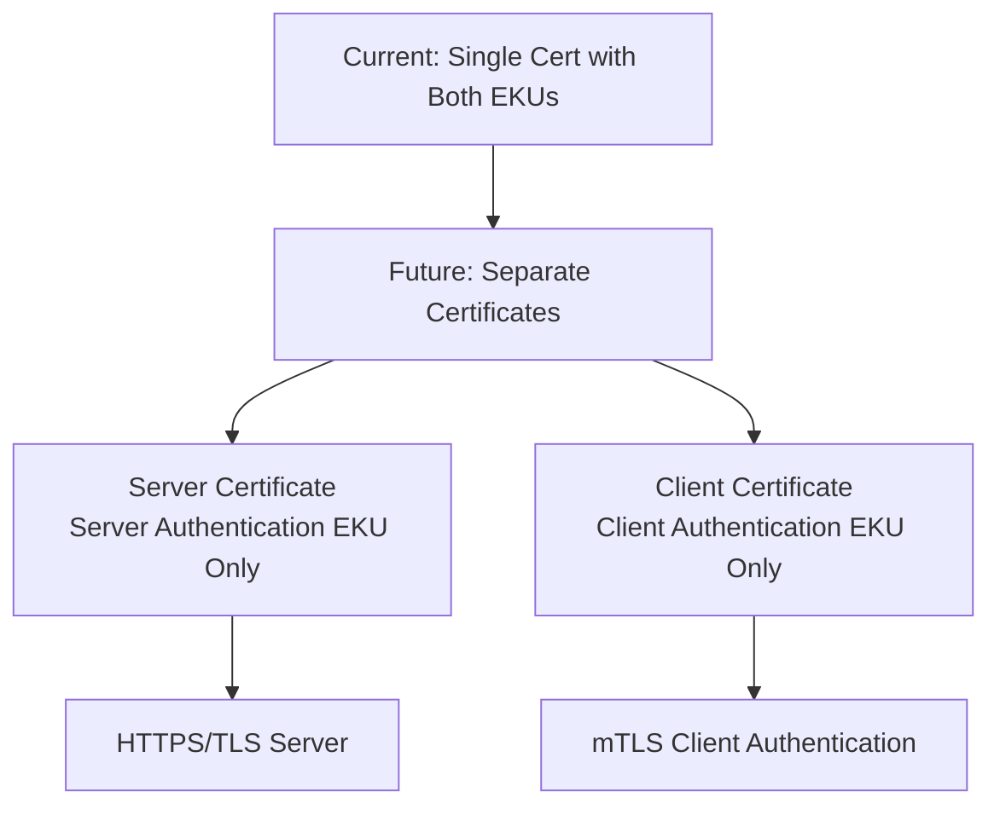
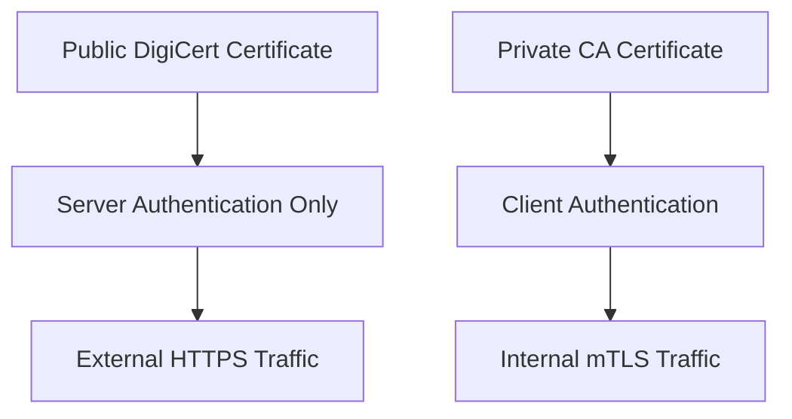
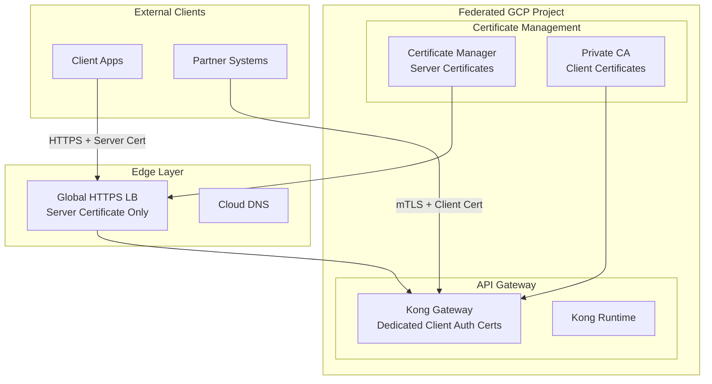

# **DigiCert Client Authentication EKU Removal - Migration Plan**

> **Critical Date**: October 1st, 2025 - DigiCert will stop including Client Authentication EKU in new certificates

---

## **1. Immediate Assessment Required**

### **Step 1: Inventory Your Current Certificates**

Run the EKU checker on all your certificates:

```bash
# Check your current certificates
./safe/cert/check_eku.sh your-domain.com:443

# Batch check all certificate files
find /path/to/your/certs -name "*.crt" -exec ./safe/cert/check_eku.sh {} \;

# Check certificates in your POP platform
kubectl get secrets -A -o jsonpath='{range .items[*]}{.metadata.namespace}{"\t"}{.metadata.name}{"\t"}{.type}{"\n"}' | grep tls
```

### **Step 2: Identify mTLS Dependencies**

Check if your applications use **mutual TLS (mTLS)** authentication:

```bash
# Check Kong Gateway mTLS configurations
kubectl get plugins -A -o yaml | grep -A 10 -B 5 "mtls-auth\|client.*cert"

# Check application configurations for client certificates
grep -r "client.*cert\|mTLS\|mutual.*tls" /path/to/your/configs/

# Check if applications validate client certificates
grep -r "verify.*client\|client.*auth" /path/to/your/application/code/
```

---

## **2. Impact Analysis**

### **Scenarios That Will Be Affected:**

1. **✅ Standard HTTPS (No Impact)**
   - Regular web traffic
   - API calls without client certificates
   - Standard TLS termination at load balancer

2. **⚠️ Mutual TLS (mTLS) - Action Required**
   - Client certificate authentication
   - Service-to-service authentication
   - API Gateway client validation
   - VPN client authentication

3. **⚠️ Mixed Usage - Needs Review**
   - Certificates used for both server and client authentication
   - Applications that might use client auth in the future

---

## **3. Solution Strategy**

### **Option A: Separate Certificates (Recommended)**

**For applications requiring both server and client authentication:**



### **Option B: Private CA for Client Certificates**

**For internal services requiring client authentication:**



### **Option C: Alternative Authentication Methods**

**Replace client certificate authentication with:**
- API Keys
- JWT Tokens
- OAuth 2.0 / OIDC
- Service mesh authentication (Istio, Linkerd)

---

## **4. Implementation Plan**

### **Phase 1: Assessment (Immediate - 2 weeks)**

```bash
# Create assessment script
cat > assess_mtls_impact.sh << 'EOF'
#!/bin/bash
echo "=== DigiCert EKU Impact Assessment ==="
echo "Date: $(date)"
echo ""

echo "1. Checking current certificates..."
./safe/cert/check_eku.sh your-domain.com:443

echo "2. Checking Kong Gateway mTLS configurations..."
kubectl get plugins -A -o yaml | grep -A 5 -B 5 "mtls-auth"

echo "3. Checking application mTLS usage..."
# Add your specific application checks here

echo "4. Certificate expiry dates..."
echo | openssl s_client -connect your-domain.com:443 2>/dev/null | \
openssl x509 -noout -dates

echo "Assessment complete. Review output above."
EOF

chmod +x assess_mtls_impact.sh
./assess_mtls_impact.sh > mtls_assessment_$(date +%Y%m%d).txt
```

### **Phase 2: Planning (Weeks 3-4)**

**Create migration plan based on assessment results:**

1. **If you have Client Authentication EKU and use mTLS:**
   ```bash
   # Plan for separate certificates
   echo "Action Required: Apply for dedicated client certificates"
   echo "Timeline: Before certificate renewal"
   ```

2. **If you only have Server Authentication EKU:**
   ```bash
   # No immediate action needed
   echo "Status: No impact - continue with current certificates"
   ```

### **Phase 3: Implementation (Weeks 5-8)**

#### **For mTLS Applications - Kong Gateway Example:**

**Current Configuration (will break after Oct 2025):**
```yaml
# Current: Single certificate for both server and client auth
plugins:
  - name: mtls-auth
    config:
      ca_certificates:
        - |
          -----BEGIN CERTIFICATE-----
          [DigiCert certificate with both Server + Client Auth EKU]
          -----END CERTIFICATE-----
```

**New Configuration (future-proof):**
```yaml
# New: Separate certificates
plugins:
  - name: mtls-auth
    config:
      ca_certificates:
        - |
          -----BEGIN CERTIFICATE-----
          [Dedicated Client Authentication Certificate]
          -----END CERTIFICATE-----
```

#### **Certificate Management Update:**

```bash
# Apply for new client authentication certificates
# Option 1: Private CA
openssl genrsa -out client-ca.key 4096
openssl req -new -x509 -days 3650 -key client-ca.key -out client-ca.crt \
  -subj "/CN=Internal Client CA"

# Option 2: Request dedicated client cert from DigiCert
# (Contact your certificate provider for client authentication certificates)

# Update Kong configuration
kubectl create secret tls client-auth-cert --cert=client-ca.crt --key=client-ca.key
kubectl patch plugin mtls-auth-plugin --type='json' \
  -p='[{"op": "replace", "path": "/config/ca_certificates", "value": ["..."]}]'
```

---

## **5. Integration with POP Platform Migration**

Since you're also migrating to Federated GCP, this is an excellent opportunity to address the EKU issue:

### **Updated Architecture with Separate Certificates:**



### **Updated Migration Checklist:**

Add to your existing migration plan:

```bash
# Certificate migration tasks
- [ ] Assess current certificate EKU usage
- [ ] Identify mTLS dependencies
- [ ] Apply for dedicated client authentication certificates
- [ ] Update Kong Gateway configurations
- [ ] Test mTLS functionality with new certificates
- [ ] Update certificate renewal procedures
- [ ] Document new certificate management process
```

---

## **6. Timeline and Action Items**

### **Immediate Actions (This Week):**
- [ ] Run EKU assessment on all certificates
- [ ] Identify applications using mTLS
- [ ] Check certificate expiry dates
- [ ] Document current mTLS configurations

### **Short-term (Next 4 weeks):**
- [ ] Apply for dedicated client authentication certificates
- [ ] Set up private CA if needed
- [ ] Test new certificate configurations in staging
- [ ] Update documentation and procedures

### **Before Certificate Renewal:**
- [ ] Replace certificates with separate server/client certs
- [ ] Update all mTLS configurations
- [ ] Validate functionality
- [ ] Monitor for issues

### **Long-term (Ongoing):**
- [ ] Update certificate renewal procedures
- [ ] Train team on new certificate management
- [ ] Consider alternative authentication methods
- [ ] Regular audits of certificate usage

---

## **7. Risk Mitigation**

### **High Risk Scenarios:**
1. **Certificate renewal after Oct 1, 2025 without preparation**
   - **Impact**: mTLS authentication will fail
   - **Mitigation**: Complete migration before renewal

2. **Unidentified mTLS dependencies**
   - **Impact**: Service disruption
   - **Mitigation**: Comprehensive assessment and testing

### **Rollback Plan:**
```bash
# Emergency rollback procedure
# Keep old certificates until new ones are fully validated
kubectl create secret tls backup-cert --cert=old-cert.crt --key=old-cert.key
# Quick rollback command ready
kubectl patch plugin mtls-auth-plugin --type='json' \
  -p='[{"op": "replace", "path": "/config/ca_certificates", "value": ["backup-cert"]}]'
```

---

## **8. Next Steps**

1. **Run the assessment immediately:**
   ```bash
   ./safe/cert/check_eku.sh your-domain.com:443
   ```

2. **Review the output and determine if you have Client Authentication EKU**

3. **If you have Client Auth EKU and use mTLS:**
   - Start planning for separate certificates
   - Contact your certificate provider
   - Begin testing with staging environment

4. **If you only have Server Auth EKU:**
   - No immediate action needed
   - Continue with normal certificate management

5. **Integrate with your POP migration plan:**
   - Update architecture diagrams
   - Add certificate tasks to migration checklist
   - Test new certificate setup in new GCP environment

---

**Would you like me to help you run the assessment or create specific configurations for your environment?**


What You Need to Do Next:
1. Immediate Assessment (Today)
Run these commands to check your current situation:

# Check your main domains
./safe/cert/check_eku.sh your-api-domain.com:443
./safe/cert/check_eku.sh your-main-website.com:443

# If you have certificate files locally
./safe/cert/check_eku.sh /path/to/your/certificate.crt
2. Check for mTLS Usage
Look for these patterns in your applications:

Kong Gateway with mtls-auth plugin
Applications that validate client certificates
Services that use certificates for both server and client authentication
3. Decision Tree
Based on your assessment results:

If your certificates show:

Extended Key Usage:
  ✓ Server Authentication (TLS Web Server)
  ✓ Client Authentication (TLS Web Client)  ← This line means ACTION REQUIRED
Then you need to:

Apply for separate client authentication certificates
Update your mTLS configurations
Test the new setup before your certificates expire
If your certificates only show:

Extended Key Usage:
  ✓ Server Authentication (TLS Web Server)
Then you're already compliant - no action needed.

4. Integration with Your POP Migration
Since you're migrating to Federated GCP anyway, this is the perfect time to:

Set up proper certificate management
Implement separate server/client certificates
Use Certificate Manager for server certificates
Set up a private CA for client certificates if needed
Would you like me to help you:

Run the assessment on your specific domains?
Create Kong Gateway configurations for separate certificates?
Set up a private CA for client authentication?
Update your POP migration plan to include certificate management?