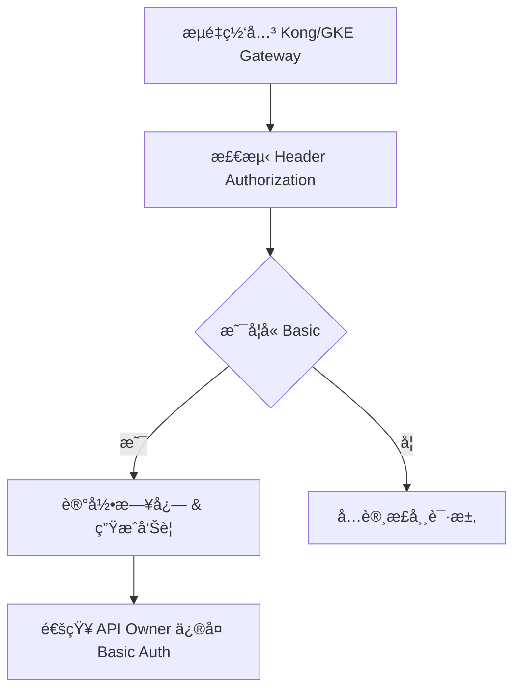

# Q

å…³äº CWE-287 有下é¢ä¸€ä¸ªæè¿°

CVSS Score: 2.1

CWE ID: CWE-287: Improper

Authentication

OWASP TOP 10: API2:2023 - Broken

Authentication

Description :Basic authentication is a simple authentication scheme built into the HTTP protocol. The client sends HTTP requests with the Authorization header that contains the word Basic word followed by a space and a base64-encoded string username:password.

Based64 encoding is a weak encoding technique where data

can be decoded easily. During the assessment, it was observed that the API uses

Basic authentication which can be easily decoded by an attacker to obtain clear text credentials.

Impact: Using weak cryptographic algorithms and implementation may lead to attacks affecting confidentiality, data integrity, and authenticity of the data stored or

transmitted.

Recommendation: It is recommended to use strong cryptographic algorithms with secure implementations that provide sufficient data protection and replace weak

algorithms with secure alternatives like secure auth token. This should be implemented throughout the application/ APIs.

Reference :

https://cwe.mitre.org/data/definitions/

287.html

https://owasp.org/API-Security/editions/ 2023/en/0xa2-broken-authentication

如æœæˆ‘们作为平å°æ¥è¯´ï¼Œå¦‚何å»æŸ¥æ‰¾å’Œå®šä½è¿™äº›é—®é¢˜ï¼Œæ¯”如å¯èƒ½å‡ºç°åœ¨å“ªé‡Œã€‚以åŠå¦‚何å»ä¿®å¤è¿™ä¸ªé—®é¢˜ï¼Ÿ

(1) Analyze the provided description of CWE-287, focusing on why Basic Authentication is considered improper authentication. Research the fundamental difference between encoding (like Base64) and encryption to explain why it fails to protect credentials. (2) Investigate methods for a platform to detect instances of CWE-287. This includes researching techniques for: (a) Static Application Security Testing (SAST) to find hardcoded credentials or insecure authentication patterns in code. (b) Dynamic Application Security Testing (DAST) to inspect HTTP requests and identify the use of Basic Authentication over unencrypted channels. (c) Software Composition Analysis (SCA) to identify vulnerable libraries related to authentication. (3) Identify common areas within a software architecture where Basic Authentication vulnerabilities are likely to appear, such as public-facing APIs, internal microservice-to-microservice communication, legacy system integrations, and administrative web panels. (4) Research and detail the recommended secure alternatives to Basic Authentication mentioned in the prompt, such as token-based authentication. Explore modern standards like OAuth 2.0, OpenID Connect (OIDC), and the use of JSON Web Tokens (JWTs). (5) For each secure alternative, find implementation best practices to prevent introducing new vulnerabilities. This includes enforcing Transport Layer Security (TLS), setting short token expiration times, providing secure token refresh and revocation mechanisms, and validating token signatures. (6) Create a comparative analysis between Basic Authentication and a modern alternative like OAuth 2.0 with JWTs. Contrast them on key security aspects like credential exposure, susceptibility to replay attacks, and the ability to grant granular permissions. (7) Explore the broader OWASP API Security Top 10 category, API2:2023 - Broken Authentication, to provide context on other related vulnerabilities beyond just Basic Auth, such as weak password policies or flawed JWT validation.

# ChatGPT

ä½ æ到的 **CWE-287: Improper Authentication** 和其具体的情况 —— 使用 Basic Auth（用户åå¯†ç  base64 ç¼–ç ï¼‰æš´éœ²åœ¨ API 中 —— 是一ç§é常典å‹ä¸”å±é™©çš„ API 身份验è¯ç¼ºé™·ï¼Œç¬¦åˆ OWASP API Top 10 çš„ **API2:2023 - Broken Authentication**。

---

## **📠问题背景总结**

### **æè¿°è¦ç‚¹**

- **使用 Basic Auth**，å³ï¼š

```
Authorization: Basic base64(username:password)
```

-
- **base64 ç¼–ç ä¸å®‰å…¨**，很容易被 decode
- **凭è¯æ˜æ–‡ä¼ è¾“**，如未é…åˆ HTTPS，将æ易泄露
- 弱加密认è¯æœºåˆ¶å¯å¯¼è‡´å‡­è¯è¢«æˆªè·ã€é‡æ”¾ã€ä¼ªé€ 

---

## **🔠作为平å°ï¼Œå¦‚何查找和定ä½æ­¤ç±»é—®é¢˜**

### **1.** 

### **代ç å®¡è®¡ï¼ˆé™æ€ï¼‰**

é‡ç‚¹æœç´¢æ•æ„Ÿ Header 的使用ã€è®¤è¯æ¨¡å—å®ç°æ–¹å¼ï¼š

```
grep -ri 'Authorization' ./src/
grep -ri 'Basic ' ./src/
```

或在 Java 等中定ä½ç±»ä¼¼ä»£ç ï¼š

```
String authHeader = request.getHeader("Authorization");
if (authHeader != null && authHeader.startsWith("Basic ")) { ... }
```

如æœä½ å¹³å°æ”¯æŒå¤šä¸ªå›¢é˜Ÿæ交 API，å¯ä½¿ç”¨ç»Ÿä¸€çš„ Lint/SAST 工具进行扫æ：

- **Semgrep**
- **SonarQube**
- **Checkmarx**
- **GitHub CodeQL**

---

### **2.** 

### **API æµé‡æ‹¦æˆªåˆ†æ（动æ€ï¼‰**

使用以下方å¼æˆªè·å’Œè¯†åˆ« Basic Auth 使用：

- **在 API Gateway / Kong Gateway 层设置日志抓å–**

```
# Kong 中通过 log plugin / custom plugin æŠ“å– headers
```

-
- **在 GCP/GKE å±‚ç»“åˆ Envoy/Nginx Access Logs**

```
log_format with $http_authorization
```

-
- **借助 API 网关或 WAF 检测 Authorization 使用模å¼**
    - 规则匹é…：Authorization: Basic <Base64>
    - æ供规则命中报警，如 Cloud Armor / ModSecurity

---

### **3.** 

### **æ¼æ´æ‰«æ工具**

使用 **DAST 动æ€æ‰«æ器** 测试你的 API endpoint：

- OWASP ZAP / Burp Suite
- Postman + 安全脚本
- Detectifyã€APIsecã€42Crunch（API 专项）

---

## **🛠 如何修å¤è¿™ä¸ªé—®é¢˜**

### **✅ æ›¿æ¢ Basic Auth çš„æ–¹å¼ï¼š**

| **方案**                               | **æè¿°**                           | **优点**                   |
| -------------------------------------- | ---------------------------------- | -------------------------- |
| **OAuth2 / OIDC**                      | 使用 Token（如 JWT）替代用户åå¯†ç  | 标准化ã€é«˜å®‰å…¨             |
| **API Key + HTTPS**                    | 适用äºç³»ç»Ÿé—´é交互å¼è°ƒç”¨           | 简å•ã€å—æ§                 |
| **Mutual TLS（mTLS）**                 | åŒå‘认è¯ï¼ˆå®¢æˆ·ç«¯å’ŒæœåŠ¡å™¨ï¼‰         | 强身份认è¯ï¼Œé€‚åˆå†…网或 B2B |
| **Session Token / Cookie + CSRF 防护** | 用äºæµè§ˆå™¨è®¿é—®çš„å®‰å…¨è®¤è¯           | 防é‡æ”¾ã€é˜²åŠ«æŒ             |

---

### **🔠使用 HTTPS 强制加密**

å³ä½¿ä½ è¿˜æ²¡å®Œå…¨æ›¿æ¢æ‰ Basic Auth，也必须：

```
# 在 Ingress / Gateway 中设置 HTTPS Only
ssl_redirect: true
```

或在 Nginx 层é…置强制跳转：

```
server {
    listen 80;
    return 301 https://$host$request_uri;
}
```

---

### **🧱 å¹³å°ä¾§æ²»ç†æªæ–½å»ºè®®**



---

## **✅ 总结**

| **æ–¹å‘** | **æªæ–½**                                           |
| -------- | -------------------------------------------------- |
| 定ä½æ–¹å¼ | SAST é™æ€ä»£ç æ‰«æã€DAST API 扫æã€æµé‡æ—¥å¿—åˆ†æ     |
| é£é™©è¯†åˆ« | Authorization Header åŒ…å« Basic，æ˜æ–‡ Base64 å‡­è¯  |
| ä¿®å¤å»ºè®® | ç¦ç”¨ Basic Auth，å¯ç”¨ OAuth2ã€API Keyã€mTLS 等机制 |
| 防护机制 | 所有认è¯æœºåˆ¶å¿…é¡»é…åˆ HTTPS 使用，防止中间人攻击    |
| å¹³å°æ²»ç† | 网关层统一拦截 + 通知告警，æ¨åŠ¨å„团队è¿ç§»          |

---

如你平å°å·²æœ‰ Kong Gateway 或 Envoy 等，å¯ä»¥è¿›ä¸€æ­¥æ”¯æŒï¼š

- 在网关æ’件中拒ç»ä½¿ç”¨ Basic Auth
- 日志中模糊或å±è”½ Authorization ä¿¡æ¯
- 自动化扫æ报告生æˆå¹¶å…³è”到 API Owner（如通过 Firestore / BigQuery）

需è¦æˆ‘å¯ä»¥å¸®ä½ ç”Ÿæˆä¸€å¥— Kong æ’件检测 Basic Auth 的逻辑或é…置。需è¦å—？

# Gemini

# A Strategic Framework for Eradicating CWE-287: From Basic Authentication to Modern, Secure Identity Protocols

### Part I: Deconstructing the Vulnerability: Understanding CWE-287 and Broken Authentication

This initial section establishes the foundational knowledge required to understand the full scope of the problem, moving from the specific finding of HTTP Basic Authentication to the broader class of weaknesses it represents. A complete grasp of these fundamentals is a prerequisite for developing an effective, platform-wide remediation strategy.

#### Section 1: The Anatomy of CWE-287: Improper Authentication

The security finding identifying the use of HTTP Basic Authentication is categorized under CWE-287: Improper Authentication. Understanding this classification is the first step toward a comprehensive solution.

##### 1.1. Defining the Weakness Beyond the Label

The Common Weakness Enumeration (CWE) formally defines CWE-287 as a scenario where "an actor claims to have a given identity, the product does not prove or insufficiently proves that the claim is correct".1 This weakness is designated as a "Class" level abstraction, which signifies that it is described in a highly abstract manner, independent of any specific programming language or technology.3 It is more general than a "Base" weakness but more specific than a "Pillar" weakness, typically describing issues in terms of behavior, property, and resource.3

This "Class" level abstraction presents a significant challenge for platform engineering and security teams. The MITRE Corporation, which maintains the CWE list, explicitly discourages the direct mapping of CWE-287 to real-world vulnerabilities because it is often too generic; more specific, lower-level CWE entries are frequently more applicable and actionable.3 A security report that flags CWE-287 correctly identifies a

_category_ of problem but fails to pinpoint a precise, actionable root cause. This can lead to a reactive, "whack-a-mole" approach to security, where individual symptoms, such as the use of Basic Auth, are addressed without treating the underlying architectural deficiencies that allowed them to exist.

Therefore, the first step in a mature response is to recognize that a CWE-287 finding is a signpost, not a destination. The platform team must decompose this high-level classification into its more specific "Base" level children to facilitate targeted detection and remediation. Examples of these more granular weaknesses include:

- `CWE-306`: Missing Authentication for Critical Function
- `CWE-522`: Insufficiently Protected Credentials
- `CWE-798`: Use of Hard-coded Credentials
- `CWE-295`: Improper Certificate Validation
- `CWE-307`: Improper Restriction of Excessive Authentication Attempts.3

By reframing the problem in terms of these more precise weaknesses, a platform can move from fixing a single bug to architecting a system that is resilient to an entire class of authentication failures.

##### 1.2. The Specific Case of HTTP Basic Authentication

The immediate vulnerability reported stems from the use of HTTP Basic Authentication, a simple authentication scheme built directly into the HTTP protocol [User Query]. In this scheme, the client application sends HTTP requests containing an `Authorization` header with the value `Basic <base64(username:password)>` [User Query].

Historically, Basic Authentication was valued for its simplicity and universal support. However, its use in modern, security-conscious systems is strongly discouraged for several critical reasons. The most prominent is its reliance on transmitting credentials that are, for all practical purposes, in plain text. This practice makes them highly susceptible to capture and replay, particularly in man-in-the-middle (MITM) attacks where an adversary can intercept network traffic.4 The transmission of these long-lived credentials with every single request dramatically increases the attack surface.

Furthermore, Basic Authentication is fundamentally incompatible with modern security controls like Multi-Factor Authentication (MFA). Enabling MFA is notoriously complex, if not impossible, when using Basic Auth, which significantly lowers the security posture of any account or system relying on it.4 Recognizing these severe risks, major technology providers have aggressively moved to eliminate its use. Microsoft, for instance, has systematically deprecated and disabled Basic Authentication across its entire Exchange Online ecosystem, citing the profound security risks and the inability to enforce MFA as primary drivers for the change.4

##### 1.3. The Critical Distinction: Encoding vs. Encryption

The initial security finding notes that Base64 is a "weak encoding technique" where data can be "decoded easily" [User Query]. While factually correct, this phrasing can perpetuate a dangerous misunderstanding of fundamental security concepts. It is imperative to establish a clear, non-negotiable distinction between encoding and encryption.

**Encoding** is a reversible process that transforms data from one format to another. Its purpose is to ensure data usability, integrity, and compatibility between different systems, not to provide confidentiality.9 For example, Base64 encoding is designed to represent binary data in an ASCII string format, making it safe for transmission over protocols that are designed to handle only text.9 The algorithms for encoding are public, and no secret key is required to reverse the process. Anyone who knows the scheme can decode the data.10

**Encryption**, by contrast, is a process designed explicitly for security—specifically, to ensure data confidentiality. It uses a secret key and a complex mathematical algorithm to transform readable data (plaintext) into an unreadable format (ciphertext).11 The original data can only be recovered by someone who possesses the correct decryption key.9 Modern encryption algorithms like AES-256 make it computationally infeasible for an unauthorized party to reverse the process without the key.9

The misapplication of encoding as a security measure creates a perilous false sense of security. As one expert aptly stated, using Base64 to "secure" passwords is "like hiding a house key under a doormat".9 It provides a veneer of obscurity but offers zero actual protection. The root cause of the vulnerability is not that Base64 is "weak," but that a tool designed for data compatibility was used for a security purpose for which it was never intended. This often happens when a developer, needing to conform to the

`Authorization: Basic` header format, uses Base64 as instructed by the protocol specification, leading to the mistaken belief that the "scrambled" data is secure. This highlights a critical need for foundational security training. Platform-wide educational materials, coding standards, and review checklists must be updated to explicitly forbid the use of any encoding scheme as a substitute for encryption when handling sensitive data.

##### Table 1.1: Encoding vs. Encryption - A Comparative Analysis

To serve as a permanent and unambiguous reference for all technical staff, the following table clarifies the fundamental differences between these two concepts.

| Feature                | Encoding                                                                                             | Encryption                                                                                       |
| ---------------------- | ---------------------------------------------------------------------------------------------------- | ------------------------------------------------------------------------------------------------ |
| **Primary Goal**       | Data Usability & Compatibility                                                                       | Data Confidentiality & Security                                                                  |
| **Purpose**            | To transform data into a different format for safe transmission or storage across various systems.12 | To protect sensitive data from unauthorized access by rendering it unreadable.9                  |
| **Key Requirement**    | No key is required. The algorithm is public and standardized.10                                      | A secret key (symmetric) or a key pair (asymmetric) is required for encryption and decryption.10 |
| **Reversibility**      | Easily reversible by anyone who knows the public algorithm (decoding).11                             | Reversible only by authorized parties who possess the correct decryption key (decryption).11     |
| **Security Level**     | None. Provides no confidentiality.13                                                                 | High. Designed to be computationally infeasible to break without the key.14                      |
| **Example Algorithms** | Base64, URL Encoding, ASCII, Unicode.10                                                              | AES, RSA, ChaCha20, Triple DES.9                                                                 |

##### 1.4. The Broader Threat Landscape: OWASP API2:2023 - Broken Authentication

The specific instance of using Basic Auth is a symptom of a much larger category of risk defined by the Open Web Application Security Project (OWASP). In the 2023 OWASP API Security Top 10 list, **API2:2023 - Broken Authentication** is ranked as the second most critical security risk for APIs, highlighting its prevalence and impact.15

This risk category encompasses a wide array of implementation flaws far beyond just the use of weak credential formats.16 An API is considered vulnerable to Broken Authentication if it exhibits one or more of the following weaknesses:

- **Permits Credential Stuffing and Brute-Force Attacks:** Lacks adequate rate limiting, account lockout mechanisms, or CAPTCHA protection on authentication endpoints.15
- **Allows Weak or Common Passwords:** Does not enforce a strong password policy.16
- **Transmits Sensitive Data in URLs:** Sends authentication tokens, passwords, or API keys as URL query parameters, where they can be logged by browsers, proxies, and servers.16
- **Improperly Validates JSON Web Tokens (JWTs):** Fails to validate the token's signature, accepts tokens with the `alg` header set to `none`, does not check the expiration date, or uses weak signing keys.15
- **Lacks Re-authentication for Sensitive Operations:** Allows users to change critical account information like their email address or password without first confirming their current password.15
- **Uses API Keys for User Authentication:** Misuses API keys, which are meant for identifying client applications, to authenticate end-users.16

The potential impact of these vulnerabilities is severe. A successful exploit can lead to the complete takeover of user accounts, allowing an attacker to read personal data, perform sensitive actions on the user's behalf, and move laterally through the system. From the system's perspective, the attacker's actions are often indistinguishable from those of a legitimate user.15

These vulnerabilities can be mapped to specific attack patterns defined in the Common Attack Pattern Enumeration and Classification (CAPEC) catalog. Understanding this vocabulary helps in articulating threats and designing defenses. Key related patterns include:

- **CAPEC-115: Authentication Bypass:** Gaining access by circumventing an authentication mechanism entirely.1
- **CAPEC-593: Session Hijacking:** Stealing or manipulating an active session to gain unauthorized access.1
- **CAPEC-633: Token Impersonation:** Exploiting a weakness to create an access token that impersonates another entity.1
- **CAPEC-114: Authentication Abuse:** Exploiting inherent weaknesses or flaws in a functioning authentication mechanism.1

Addressing the single finding of Basic Auth is merely the first step. A truly robust security posture requires a holistic strategy to identify and mitigate all forms of Broken Authentication across the entire platform.

### Part II: A Platform-Wide Detection and Discovery Strategy

To effectively eradicate improper authentication, a platform must implement a comprehensive, multi-layered discovery strategy. Relying on a single tool or technique is insufficient. This section details a defense-in-depth approach combining automated static and dynamic analysis, software composition analysis, and essential manual reviews to achieve full visibility into authentication-related risks.

#### Section 2: Static Analysis: Finding Flaws in Code at Rest

Static analysis examines application code without executing it, providing a powerful method for finding vulnerabilities early in the development lifecycle.

##### 2.1. Leveraging Static Application Security Testing (SAST)

Static Application Security Testing (SAST) tools are designed to analyze an application's source code, bytecode, or compiled binaries for security vulnerabilities.20 The process begins by parsing the codebase to construct a detailed model of the application, such as an Abstract Syntax Tree (AST), which represents the code's structure, or a Control Flow Graph (CFG), which maps the potential execution paths.20

With these models, SAST tools perform sophisticated analyses. **Data Flow Analysis** tracks how data moves through the application, from its source (e.g., user input) to its sink (e.g., a database query), identifying paths where data is handled insecurely.20 A related technique,

**Taint Analysis**, marks all untrusted input as "tainted" and follows its propagation through the code. If tainted data reaches a sensitive function without proper sanitization, the tool flags a potential vulnerability.20 This approach is highly effective at finding many common security flaws before they ever reach a production environment.

##### 2.2. Crafting Effective SAST Rulesets for Authentication Flaws

While SAST can struggle with complex, logic-based authentication flaws, it is exceptionally effective at identifying specific, well-defined anti-patterns.24 A platform's SAST toolchain should be meticulously configured with rulesets targeting the following critical areas 25:

- **Hardcoded Credentials (CWE-798):** This is a top priority. SAST tools should be configured to scan all source code, configuration files (e.g., `.env`, `.xml`, `.yml`), and build scripts for hardcoded secrets, including passwords, API keys, access tokens, and private keys.20 Specialized tools like Gitleaks are designed specifically for this purpose and can be integrated into the pipeline to detect secrets in both current code and commit history.26
- **Use of HTTP Basic Authentication:** A custom rule should be created to pattern-match for the string `"Authorization: Basic"` or similar constructs within code that builds HTTP requests. This directly addresses the user's initial finding and ensures no new instances are introduced.
- **Weak Cryptography (CWE-327):** The ruleset must identify the use of weak or deprecated cryptographic algorithms (e.g., MD5, SHA1 for hashing passwords, DES), the use of weak or insufficient-length keys, and calls to insecure random number generators.25
- **Insecure Function Usage:** The tool should flag the use of functions known to be dangerous or insecure, which are often found in close proximity to authentication and session management logic.20

To maximize effectiveness and developer adoption, SAST configurations must be refined over time. This includes disabling rules that consistently produce false positives in the platform's specific context and excluding non-production code, such as test suites, from certain high-severity rules to reduce noise.28

##### 2.3. Integrating SAST into the CI/CD Pipeline

The true power of SAST is realized through automation and integration. To be effective, SAST scans must be seamlessly embedded within the Continuous Integration/Continuous Deployment (CI/CD) pipeline.20 This "shift-left" approach provides immediate feedback to developers on every commit or pull request, enabling them to fix vulnerabilities when they are easiest and cheapest to address—before the code is merged into the main branch.21

The process should be fully automated. When a scan is triggered, its findings should be automatically parsed and recorded in a centralized issue tracking system (e.g., Jira, GitLab Issues). This creates a formal record, enables tracking of remediation progress, and allows for periodic review of the tool's effectiveness.26 This tight feedback loop not only improves security but also serves as a continuous educational tool for developers, reinforcing secure coding practices.23

#### Section 3: Dynamic Analysis: Testing Applications in Motion

While SAST inspects the blueprint, Dynamic Application Security Testing (DAST) stress-tests the finished building. It is an essential complement for finding runtime vulnerabilities.

##### 3.1. The Role of Dynamic Application Security Testing (DAST)

DAST operates as a "black-box" testing methodology, meaning it interacts with a running application from an external perspective, just as an attacker would, without any knowledge of the internal source code or architecture.30 By sending a variety of crafted requests and malicious payloads, DAST tools are uniquely positioned to detect runtime vulnerabilities that are invisible to static analysis. These include server configuration mistakes, insecure headers, and, most critically for this report,

**authentication issues**.30

##### 3.2. Configuring Authenticated DAST Scans

An unauthenticated DAST scan can only test the public-facing attack surface, such as the login page itself. To uncover vulnerabilities within the application's authenticated sections—where the most sensitive data and functionality reside—the scanner must be configured to log in. This is a crucial step that distinguishes a mature DAST program from a superficial one.

- **Scanning with Basic Authentication:** For APIs protected by HTTP Basic Authentication, the configuration is straightforward. DAST tools allow the user to provide a valid username and password. The scanner will then automatically encode these credentials and include the proper `Authorization: Basic...` header with every request it sends during the scan.34 This setup directly tests the scenario from the initial security finding, not just for its existence but for how it behaves under attack.
- **Scanning with Form-Based and Token-Based Authentication:** Modern DAST solutions are capable of navigating complex, multi-step authentication flows. The configuration process typically involves:
    - **Specifying the Login URL:** Providing the scanner with the exact endpoint of the login form.34
    - **Providing Credentials:** Supplying the scanner with a set of valid user credentials to submit to the form.34
    - **Handling Complex Flows:** Advanced tools can be configured or can automatically handle login pop-ups, multi-factor authentication steps, and consent checkboxes (e.g., "I agree to the terms and conditions").34
    - **Managing Tokens (e.g., JWTs):** For modern token-based authentication, the scanner must be configured to understand the token exchange. This involves instructing the tool to make a login request, parse the authentication token (e.g., a JWT) from the response body or headers, and then automatically include that token in the `Authorization: Bearer <token>` header of all subsequent requests to protected endpoints.34

There is a powerful feedback loop that should be established between static and dynamic testing. SAST might uncover a hardcoded API key (CWE-798) in a configuration file. This finding should not be an endpoint in itself. Instead, it becomes an input for DAST. The security team can then configure a new DAST scan to use that discovered key for authentication. This authenticated scan can then probe the API's internal functions deeply, potentially uncovering entirely different classes of vulnerabilities, such as Broken Object Level Authorization (OWASP API1), which would have been completely invisible to an unauthenticated scan. By building processes to feed the results of one tool into the configuration of another, the platform's testing ecosystem becomes more intelligent, efficient, and effective.

#### Section 4: Analyzing the Supply Chain: Vulnerabilities in Third-Party Code

Modern applications are rarely built from scratch; they are assembled from a vast ecosystem of open-source libraries and frameworks. Securing the application requires securing its entire supply chain.

##### 4.1. Implementing Software Composition Analysis (SCA)

Software Composition Analysis (SCA) tools are designed to address the risks inherent in using third-party code. The process involves scanning a project's dependency manifest files (e.g., `package.json`, `pom.xml`, `requirements.txt`) to create a comprehensive inventory known as a Software Bill of Materials (SBOM). The SCA tool then cross-references every component in the SBOM against multiple databases of known vulnerabilities (such as the National Vulnerability Database) to identify risks.36

Authentication logic, in particular, is a function that developers are rightly and frequently encouraged to outsource rather than "reinventing the wheel".15 They will leverage open-source libraries to handle JWT parsing and validation, implement OAuth 2.0 client flows, or perform cryptographic hashing of passwords. While this is a sound engineering practice, it introduces a significant dependency risk. A single high-severity vulnerability in a widely used authentication library—akin to the Log4Shell vulnerability in the Log4j logging framework—can instantly create a critical, platform-wide security hole that is difficult to remediate at scale.37

Critically, the vast majority of open-source vulnerabilities are found not in the direct dependencies that developers explicitly add to their project, but in the _transitive_ (or indirect) dependencies that those libraries bring in.37 A developer might be completely unaware that their application is using a vulnerable component several layers deep in the dependency tree. Therefore, SCA is not merely a tool for finding "any" vulnerability; it is a non-negotiable control for securing the authentication process itself. The platform's vulnerability management program must prioritize the patching of flaws discovered in authentication-related packages, such as JWT parsers, OAuth clients, and cryptographic libraries.

##### 4.2. Beyond CVEs: Reachability and Risk Prioritization

The sheer volume of vulnerabilities identified by SCA tools can lead to "alert fatigue," where development teams are overwhelmed with low-risk findings. To combat this, advanced SCA solutions offer **reachability analysis**.38 This technique goes a step beyond simply identifying that a vulnerable library is present in the dependency tree. It performs static analysis on the application's source code to determine if the specific vulnerable

_function_ within that library is actually reachable and called by the application's code path.39

This capability is a game-changer for risk prioritization. The discovery of a vulnerable authentication library in the dependency graph is a concern. The discovery that the specific flawed function within that library is actively being invoked by the application's login or token validation code is a critical, high-priority incident. By filtering out the noise of vulnerabilities in unused code, reachability analysis allows security and development teams to focus their limited resources on the threats that are genuinely exploitable within their specific application context.

#### Section 5: The Human Element: Manual Reviews and Architectural Assessment

Automation is essential for achieving scale and consistency, but it cannot replace human expertise. The most sophisticated and dangerous vulnerabilities often arise from subtle flaws in business logic, which automated tools are ill-equipped to detect.

##### 5.1. The Limits of Automation

Automated tools excel at finding known patterns and deviations from best practices. However, they inherently lack the contextual understanding of a human expert. OWASP explicitly notes that SAST tools, for example, have significant difficulty in automatically identifying complex vulnerability classes like authentication and access control problems, as these often depend on the application's specific business logic.24 Similarly, a DAST scan can miss entire sections of an application if it is not configured correctly to handle a bespoke or complex authentication flow.34

##### 5.2. Code Review, Penetration Testing, and Architecture Review

A mature security program must augment its automated tooling with rigorous manual assessments:

- **Manual Code Review:** A security-trained human reviewer can analyze custom authentication schemes and identify subtle logic flaws that automated tools would overlook. This is particularly crucial for homegrown authentication systems or complex integrations.3
- **Penetration Testing:** This is the ultimate adversarial test. Ethical hackers are commissioned to actively attempt to break the application's authentication and authorization controls. They use their creativity and experience to chain together seemingly minor weaknesses into a significant breach, providing a realistic assessment of the system's resilience to a determined attacker.
- **Architecture and Design Review:** This is the most proactive and highest-impact security activity. Before a single line of code is written, security architects review the proposed design for new systems or features. By scrutinizing the authentication and authorization models at the design stage, they can identify and eliminate fundamental flaws, preventing vulnerabilities from ever being introduced into the codebase.3 This provides the highest return on investment in the security lifecycle.

##### Table 5.1: Comparison of Security Testing Methodologies for Authentication Flaws

The following table provides a strategic overview of how different testing methodologies contribute to a comprehensive authentication security program, highlighting their unique strengths and weaknesses.

| Methodology          | SDLC Phase          | Required Artifacts                  | Typical Authentication Findings                                                                                             | Key Limitations                                                                                                    |
| -------------------- | ------------------- | ----------------------------------- | --------------------------------------------------------------------------------------------------------------------------- | ------------------------------------------------------------------------------------------------------------------ |
| **SAST**             | Development, Build  | Source Code, Bytecode, Binaries 20  | Hardcoded credentials (CWE-798), use of weak crypto (CWE-327), insecure function usage, presence of Basic Auth patterns.25  | Struggles with business logic flaws, custom authentication schemes, high false positive rate without tuning.24     |
| **DAST**             | Test, Staging, Prod | Running Application 30              | Weak password policies, lack of rate limiting, token leakage in URLs, server misconfigurations, session management flaws.30 | Requires a running environment, can miss vulnerabilities if not configured for authenticated scanning correctly.34 |
| **SCA**              | Development, Build  | Dependency Manifests (SBOM) 36      | Known vulnerabilities (CVEs) in third-party authentication libraries (e.g., JWT parsers, OAuth clients, crypto libs).37     | Can generate significant noise without reachability analysis, does not find flaws in proprietary code.39           |
| **Manual / Pentest** | Any Phase           | Running App, Source Code (optional) | Logic flaws in authentication flows (e.g., password reset bypass), token impersonation, complex authorization bypasses.3    | Not scalable, expensive, dependent on expert skill, provides a point-in-time assessment.                           |

### Part III: A Blueprint for Modern, Secure Authentication and Authorization

Having established a strategy for detecting vulnerabilities, this section provides a prescriptive, detailed blueprint for remediation. The goal is to move the platform away from insecure legacy patterns like Basic Authentication and toward a robust, modern, and standardized architecture for authentication and authorization.

#### Section 6: Foundational Principles of Secure Authentication

Before architecting complex systems, a set of foundational security principles must be implemented universally. These practices represent the baseline for secure authentication and should be enforced across all applications and services on the platform.

- **Do Not Reinvent the Wheel:** The single most important principle is to use standard, well-vetted, and actively maintained frameworks and libraries for authentication and authorization. Custom-building these critical security components is fraught with peril and likely to introduce subtle, dangerous vulnerabilities. Leverage community-trusted standards and implementations wherever possible.3
- **Enforce Strong Password Policies:** All user-facing authentication systems must enforce a strong password policy. This includes mandating a minimum length (e.g., 12 or more characters), requiring complexity (a mix of uppercase, lowercase, numbers, and special characters), and, critically, checking submitted passwords against a comprehensive list of known-breached and common passwords. Services like the "Have I Been Pwned" Pwned Passwords API can be integrated to prevent users from choosing easily guessable credentials.15
- **Implement Anti-Brute-Force Mechanisms:** Every authentication endpoint—including login, password reset, and user registration—is a target for automated attacks like credential stuffing and brute-force guessing. These endpoints must be protected with strict controls:
    - **Rate Limiting:** Apply strict rate limits based on IP address, username, or a combination of factors to slow down automated attempts.15
    - **Account Lockout:** After a small number of consecutive failed login attempts (e.g., 5-10), the user account should be temporarily locked out, requiring a waiting period or a manual reset process.16
    - **CAPTCHA:** Implement a CAPTCHA mechanism to challenge suspected automated clients after several failed attempts.16
- **Require Re-authentication for Sensitive Operations:** An active session token should not be sufficient to perform highly sensitive account modifications. Critical actions, such as changing a user's primary email address, modifying their password, or altering Multi-Factor Authentication (MFA) settings, must require the user to re-enter their current password to confirm their identity.15
- **Secure Administrative Interfaces:** Administrative panels are high-value targets for attackers. They require heightened security measures beyond those for standard user interfaces.
    - **Network Isolation:** Wherever feasible, administrative interfaces should not be exposed directly to the public internet. Access should be restricted to a corporate network or require connecting through a Virtual Private Network (VPN).42
    - **IP Whitelisting:** If internet exposure is unavoidable, implement strict IP address whitelisting to limit access to known, trusted locations.42
    - **Obscure URLs:** Avoid using predictable URLs like `/admin` or `/login`. While "security through obscurity" is not a primary defense, using a non-standard, hard-to-guess URL can deter casual attackers and automated scanners.42
    - **Hardened Authentication:** Admin panels must enforce the strongest possible authentication controls, including mandatory MFA, stringent password policies, and aggressive logging and monitoring of all administrative activities.42

#### Section 7: The OAuth 2.0 Framework: The Standard for Authorization

OAuth 2.0 is the de facto industry standard for delegated authorization. It is the foundational protocol upon which modern secure API access is built.

##### 7.1. Core Concepts

It is critical to understand that OAuth 2.0 is an **authorization framework**, not an authentication protocol.43 Its primary purpose is to enable a user (the Resource Owner) to grant a third-party application (the Client) limited access to their resources (e.g., their photos or profile data) hosted on a server (the Resource Server), without having to share their username and password with the application.44

The framework defines four key roles 46:

- **Resource Owner:** The end-user who owns the data and can grant access to it.
- **Client:** The application (e.g., a web or mobile app) requesting access to the user's data.
- **Authorization Server:** The server that authenticates the Resource Owner and, with their consent, issues access tokens to the Client. This is the central identity provider.
- **Resource Server:** The server that hosts the protected resources (e.g., the API) and accepts access tokens for authorization.

The process revolves around two types of tokens 46:

- **Access Tokens:** Short-lived credentials presented by the Client to the Resource Server to access protected resources. They are typically opaque to the client.
- **Refresh Tokens:** Long-lived credentials used by the Client to obtain new access tokens from the Authorization Server after the old ones expire, without requiring the user to log in again.

##### 7.2. Choosing the Right Grant Type

OAuth 2.0 specifies several "grant types," which are different flows for obtaining an access token. The choice of grant type is critical and depends entirely on the client application's architecture. Using the wrong grant type can introduce severe security vulnerabilities.

- **Authorization Code Grant:** This is the standard, most secure flow for traditional server-side web applications. The user is redirected to the Authorization Server to log in and grant consent. The Authorization Server then redirects back to the Client with a temporary, single-use `authorization_code`. The Client's backend server then securely exchanges this code, along with its `client_id` and `client_secret`, for an access token and a refresh token. This flow ensures that the tokens and the client secret are never exposed to the end-user's browser.44
- **Implicit Grant (DEPRECATED):** This grant type was designed for client-side applications (like Single-Page Apps) and returns the access token directly to the browser in the redirect URI's fragment. **This flow is no longer recommended and should be considered deprecated.** It is insecure because it exposes the access token in the browser history and does not support refresh tokens, leading to poor security and user experience.44
- **Authorization Code Grant with PKCE (Proof Key for Code Exchange):** This is the **current industry best practice for all public clients**, including Single-Page Apps (SPAs) and native mobile applications.44 It is an extension to the Authorization Code Grant that enhances its security for clients that cannot securely store a
    `client_secret`. Before the flow begins, the client generates a secret (`code_verifier`) and a hashed version of it (`code_challenge`). The `code_challenge` is sent in the initial authorization request. When the client exchanges the `authorization_code` for an access token, it must also send the original `code_verifier`. The Authorization Server hashes the verifier and confirms it matches the challenge sent earlier. This prevents authorization code interception attacks, where an attacker who steals the code cannot use it because they do not have the original secret verifier.
- **Client Credentials Grant:** This grant is used for non-interactive, machine-to-machine (M2M) communication, such as when one backend service needs to call another. In this flow, the client application is also the resource owner. It authenticates directly with the Authorization Server using its `client_id` and `client_secret` to obtain an access token.44

##### Table 7.1: OAuth 2.0 Grant Types - Use Cases and Security Implications

This table serves as a decision-making tool for architects and developers to select the appropriate and most secure OAuth 2.0 flow.

| Grant Type                               | Typical Client                          | Key Characteristic                                                                                                         | Security Posture                                                                                                                    | Recommendation                                                                        |
| ---------------------------------------- | --------------------------------------- | -------------------------------------------------------------------------------------------------------------------------- | ----------------------------------------------------------------------------------------------------------------------------------- | ------------------------------------------------------------------------------------- |
| **Authorization Code**                   | Server-side Web Applications 44         | Code is exchanged for tokens on the backend. Client secret is kept confidential on the server.                             | **High.** Tokens and secrets are not exposed to the browser.                                                                        | **Recommended** for confidential clients (server-side apps).                          |
| **Authorization Code with PKCE**         | Single-Page Apps (SPAs), Mobile Apps 51 | Adds a cryptographic challenge (PKCE) to the Authorization Code flow, removing the need for a client secret.               | **Highest.** Protects against authorization code interception attacks. The current standard for public clients.                     | **Mandatory** for all public clients (SPAs, mobile, desktop).                         |
| **Implicit (Deprecated)**                | Legacy SPAs 44                          | Access token is returned directly to the browser in the URL fragment.                                                      | **Low / Insecure.** Exposes token to browser history and other scripts. No refresh token support. Vulnerable to token leakage.50    | **DO NOT USE.** Migrate all existing implementations to Authorization Code with PKCE. |
| **Client Credentials**                   | Backend Services, M2M Applications 47   | The client authenticates itself directly using its own credentials (`client_id` and `client_secret`). No user interaction. | **High.** Secure for server-to-server communication where credentials can be stored securely.                                       | **Recommended** for M2M flows.                                                        |
| **Resource Owner Password (Deprecated)** | Legacy / Trusted First-Party Apps 44    | Client application directly collects the user's username and password.                                                     | **Low / Insecure.** Exposes user credentials to the client application, breaking the core principle of delegation. Discourages SSO. | **DO NOT USE.** A legacy grant that should be replaced by a PKCE flow.                |

##### 7.3. OWASP Best Practices for Secure OAuth 2.0 Implementation

Beyond choosing the right grant type, a secure implementation requires adherence to several other best practices:

- **Enforce Exact Redirect URI Matching:** The Authorization Server must be configured to perform an exact, case-sensitive string match on the `redirect_uri` provided in the authorization request against the pre-registered URI for that client. Allowing partial matches (e.g., prefix matching) can enable attackers to craft a malicious redirect URI that sends the authorization code or token to a server they control.48
- **Utilize the `state` Parameter:** The `state` parameter is a critical defense against Cross-Site Request Forgery (CSRF) attacks. The client application must generate a unique, unguessable, and session-bound value and include it in the initial authorization request. When the user is redirected back from the Authorization Server, the client must verify that the `state` value returned matches the one it originally sent. If they do not match, the request must be rejected as it may have been initiated by an attacker.47
- **Restrict Token Privileges with Scopes:** The Principle of Least Privilege must be applied to access tokens. The client should request only the minimum set of permissions (scopes) it needs to perform its function. The Authorization Server should grant only those requested scopes, and the Resource Server must enforce them, ensuring the client cannot perform actions beyond what the user authorized.46
- **Enforce Audience Restriction:** An access token should be "audienced" for a specific Resource Server by including an `aud` (audience) claim in the token (if it's a JWT). When a Resource Server receives a token, it MUST validate that it is the intended audience. This prevents a token issued for one API from being replayed against a different, potentially more sensitive, API.46

#### Section 8: OpenID Connect (OIDC): The Identity Layer on OAuth 2.0

While OAuth 2.0 is the standard for authorization, it does not, by itself, provide a standard way to authenticate a user. OpenID Connect (OIDC) fills this gap.

##### 8.1. From Authorization to Authentication

OIDC is a thin, interoperable identity layer built directly on top of the OAuth 2.0 framework.49 It answers the fundamental question that OAuth 2.0 does not: "Who is the user who granted this authorization?".53 It achieves this by introducing a new, standardized artifact: the

**ID Token**.

The ID Token is always a JSON Web Token (JWT).56 It is issued by the Authorization Server (which now also acts as an OpenID Provider) alongside the access token. The ID Token contains a set of verifiable claims about the authentication event and the user's identity, such as:

- `iss` (Issuer): Who issued the token.
- `sub` (Subject): A unique identifier for the user.
- `aud` (Audience): The client application the token is intended for.
- `exp` (Expiration Time): When the token expires.
- `iat` (Issued At): When the token was issued.
- `auth_time`: The time when the user last authenticated.54

##### 8.2. The OIDC Flow Explained

The OIDC authentication flow is a specialization of the OAuth 2.0 Authorization Code flow. The key difference is that the client application includes `openid` in the `scope` parameter of its initial authorization request.54 This signals to the Authorization Server that an OIDC flow is being initiated.

Upon successful user login and consent, the Authorization Server returns an `authorization_code` to the client. The client then exchanges this code at the token endpoint. Because the `openid` scope was requested, the Authorization Server's response will contain not only an `access_token` (for API authorization) but also an `id_token` (for user authentication).48 The client application can then validate the ID Token to confirm the user's identity and establish an authenticated session.

##### 8.3. Security Best Practices for OIDC

OIDC introduces its own security mechanisms that must be correctly implemented:

- **Use `nonce` and `state`:** The `state` parameter serves the same CSRF-prevention purpose as in standard OAuth 2.0. OIDC adds the `nonce` (number used once) parameter. The client generates a unique, random string for the `nonce` and includes it in the initial authentication request. This same `nonce` value is then included as a claim within the returned ID Token. The client MUST verify that the `nonce` in the ID Token matches the value it originally sent. This prevents token replay attacks, where an attacker might try to trick a client into accepting a previously issued ID Token.54
- **Validate the ID Token Thoroughly:** The client application has a strict responsibility to validate the ID Token before trusting it. This validation is not optional and must include:
    1. Verifying the token's digital signature using the OpenID Provider's public key.
    2. Validating that the `iss` (issuer) claim matches the expected OpenID Provider.
    3. Validating that the `aud` (audience) claim contains the client's own `client_id`.
    4. Validating that the token has not expired by checking the `exp` (expiration time) claim.
    5. Validating the `nonce` claim to prevent replay attacks.56
- **Use the UserInfo Endpoint Securely:** OIDC provides a standard `/userinfo` endpoint. The client can present the `access_token` to this endpoint to retrieve additional, and potentially sensitive, user profile information (e.g., email, full name). This is a good practice as it keeps the ID Token itself lightweight and focused on the core authentication claims, while details are fetched separately over a secure channel.

#### Section 9: JSON Web Tokens (JWTs): The Currency of Modern Authentication

JSON Web Tokens (JWTs) are the most common format for access tokens and are the required format for ID tokens in OIDC. Properly understanding and securing them is paramount.

##### 9.1. Anatomy of a JWT

A JWT is a compact, URL-safe, and self-contained standard (RFC 7519) for securely transmitting information between parties as a signed JSON object.57 "Self-contained" means the token itself contains all the information needed for the recipient to verify it without needing to call back to the issuing server for every request.

A JWT consists of three parts, separated by dots (`.`) 60:

1. **Header:** A Base64Url-encoded JSON object that typically contains two fields: the token type (`typ`, which is "JWT") and the signing algorithm (`alg`, e.g., "RS256").
2. **Payload:** A Base64Url-encoded JSON object containing the "claims." Claims are statements about an entity (typically the user) and additional metadata.
3. **Signature:** A cryptographic signature generated by taking the encoded header, a dot, the encoded payload, and signing it with a secret (for HMAC algorithms like HS256) or a private key (for asymmetric algorithms like RS256).

Claims are categorized into three types 61:

- **Registered Claims:** A set of predefined, recommended claims for interoperability, such as `iss` (issuer), `sub` (subject), `aud` (audience), and `exp` (expiration time).
- **Public Claims:** Claims defined by those using JWTs, which should be registered in the IANA JSON Web Token Registry or use a collision-resistant namespace to avoid conflicts.
- **Private Claims:** Custom claims created to share information between parties that have a private agreement on their meaning.

##### Table 9.1: Standard JWT Claims and Their Purpose

This table provides a quick reference for the meaning and security relevance of the most important registered claims.

| Claim | Full Name       | Description and Security Consideration                                                                                                                                                     |
| ----- | --------------- | ------------------------------------------------------------------------------------------------------------------------------------------------------------------------------------------ |
| `iss` | Issuer          | Identifies the principal that issued the JWT. The recipient **must** validate that this value corresponds to a trusted issuer.61                                                           |
| `sub` | Subject         | Identifies the principal that is the subject of the JWT (e.g., the user's unique ID). This is the primary identifier for the user.61                                                       |
| `aud` | Audience        | Identifies the recipients that the JWT is intended for. The recipient **must** validate that its own identifier is present in this claim to prevent token replay at a different service.61 |
| `exp` | Expiration Time | Identifies the expiration time on or after which the JWT **must not** be accepted for processing. This is a critical defense against the use of stolen, old tokens.61                      |
| `nbf` | Not Before      | Identifies the time before which the JWT **must not** be accepted for processing. Useful for issuing tokens that become valid at a future time.63                                          |
| `iat` | Issued At       | Identifies the time at which the JWT was issued. Can be used to determine the age of the token.63                                                                                          |
| `jti` | JWT ID          | Provides a unique identifier for the JWT. This value can be used to prevent the JWT from being replayed and is essential for implementing a token revocation/denylist mechanism.           |
| `cnf` | Confirmation    | Used for sender-constrained tokens (Proof-of-Possession). Contains a hash of the client's TLS certificate, binding the token to the client's device.60                                     |

##### 9.2. JWT Security Deep Dive: Attacks and Mitigations

JWTs are powerful but have several well-known attack vectors that arise from improper implementation.

- **Algorithm Confusion (`alg:none`):** This is a classic JWT attack. The specification allows for an `alg` header value of `none` for unsecured JWTs. An attacker can take a valid JWT, modify its payload (e.g., change `"isAdmin": false` to `"isAdmin": true`), change the `alg` header to `none`, and remove the signature entirely. If the server's validation library is poorly configured and doesn't explicitly check for the expected algorithm, it might accept this modified token as valid because, technically, an unsigned token has a "valid" signature (i.e., no signature).62
    - **Mitigation:** The server-side validation logic **must** be configured with a whitelist of acceptable algorithms (ideally, only one, e.g., RS256). It must reject any token whose `alg` header does not match an algorithm on this list.
- **Key Confusion (HS256 vs. RS256):** This is a more subtle but equally devastating attack. RS256 (asymmetric) uses a private key to sign and a public key to verify. HS256 (symmetric) uses the same secret key for both signing and verification. The attack works as follows:
    1. The server uses RS256 and makes its public key available for clients to verify tokens.
    2. An attacker obtains the server's public key.
    3. The attacker forges a malicious JWT payload.
    4. The attacker changes the `alg` header to `HS256`.
    5. The attacker signs the token using the **server's public key** as the secret for the HS256 algorithm.
    6. The attacker sends this token to the server. If the server's validation logic is poorly written, it sees the `alg: HS256` header, retrieves what it thinks is the HS256 secret (which is actually its own public key), and uses it to verify the signature. The verification succeeds because the attacker used the same key to sign it.
    - **Mitigation:** Use libraries that do not have this vulnerability. Ensure that the code path for verifying RS256 tokens is completely separate from the code path for verifying HS256 tokens. Never use the same key material for different cryptographic purposes.
- **Weak Secret Brute-Forcing:** If a symmetric algorithm like HS256 is used, the security of the entire system rests on the secrecy and strength of the shared secret key. If this secret is weak, short, or guessable (e.g., "secret", "password", or a common dictionary word), an attacker who obtains a single valid JWT can perform an offline brute-force attack (using tools like `hashcat`) to discover the secret. Once the secret is known, the attacker can forge and sign any token they wish.62
    - **Mitigation:** If using HMAC, the secret key must be a long, high-entropy value generated from a cryptographically secure random source (at least 256 bits). It should never be a human-memorable password. The best practice, however, is to prefer asymmetric algorithms like RS256, where the private signing key is kept highly secure on the server and never shared.
- **Header Injection (`jku`, `kid`):** The JWT specification allows for header parameters that tell the server where to find the key for verification.
    - `jku` (JWK Set URL): Points to a URL where a set of public keys can be found. If the server blindly trusts this URL, an attacker can change it to point to a URL they control, which hosts their own public key.64
    - `kid` (Key ID): An identifier for the key to use. If this parameter is used to construct a file path on the server, it could be vulnerable to directory traversal (`../../../../dev/null`). If it's used in a database query, it could be vulnerable to SQL injection.64
    - **Mitigation:** For `jku`, the server must maintain a strict whitelist of trusted domains and URLs from which it will fetch keys. For `kid`, all input must be strictly sanitized and validated to prevent path traversal and SQL injection.

##### 9.3. Secure Token Handling

Securing JWTs extends beyond the server to how they are handled and stored on the client.

- **Storage:** This is a contentious topic with trade-offs between security and usability.
    - **`localStorage` / `sessionStorage`:** Storing tokens here is convenient but makes them vulnerable to theft via Cross-Site Scripting (XSS). If an attacker can inject malicious JavaScript into the page, they can read the token from storage and exfiltrate it.63
    - **HttpOnly Cookies:** Storing tokens in a cookie with the `HttpOnly` flag prevents JavaScript from accessing it, mitigating XSS-based theft. However, cookies are automatically sent with every request to the domain, making the application vulnerable to Cross-Site Request Forgery (CSRF). If this method is used, robust CSRF protection (e.g., `SameSite=Strict` attribute, anti-CSRF tokens) is absolutely mandatory.65
    - **Recommended Approach (for SPAs):** The current consensus for the most secure approach for Single-Page Applications is to store the access token in JavaScript memory (e.g., within a module's private scope/closure). This token is lost on page refresh. A long-lived, secure refresh token is stored in a hardened `HttpOnly` cookie. When the page loads or the access token expires, the application uses the refresh token to silently fetch a new access token. This combines the XSS resistance of `HttpOnly` cookies for the high-value refresh token with the CSRF resistance of not using cookies for the access token.65
- **Expiration and Rotation:** As a core security principle, access tokens **must** be short-lived. A typical lifetime is between 5 and 15 minutes. This dramatically limits the window of opportunity for an attacker to use a stolen token.63 The user experience is maintained by using a long-lived refresh token (e.g., hours or days) to obtain new access tokens without forcing the user to re-authenticate.
- **Revocation:** Because JWTs are stateless, they cannot be easily "killed" on the server once issued. If a user logs out or a token is compromised, it remains valid until its expiration time. This is a significant drawback. The standard solution is to implement a server-side **token denylist** or revocation list. When a token needs to be revoked (e.g., on logout), its unique identifier (the `jti` claim) is added to this list (e.g., stored in a fast cache like Redis). For every incoming request, the server must not only validate the token's signature and claims but also check if its `jti` is on the revocation list. This re-introduces a degree of statefulness but is a necessary trade-off for security.62

##### Table 9.2: JWT Security Best Practices Checklist

This checklist provides an actionable summary of the critical security controls that must be implemented and verified for any system using JWTs.

| Category             | Best Practice                                                                                                                     |
| -------------------- | --------------------------------------------------------------------------------------------------------------------------------- |
| **Algorithm & Keys** | Use a strong asymmetric algorithm like `RS256` or `PS256` instead of symmetric `HS256`.63                                         |
|                      | Never trust the `alg` header from the client; enforce a specific, expected algorithm on the server.64                             |
|                      | If using `HS256`, ensure the secret is a high-entropy, cryptographically random string of at least 256 bits.62                    |
|                      | Do not accept tokens with `alg` set to `none`.62                                                                                  |
| **Claim Validation** | Always validate the token signature before trusting any claims.63                                                                 |
|                      | Set a short expiration time (`exp` claim) on access tokens (e.g., 5-15 minutes).63                                                |
|                      | Validate the `iss` (issuer) and `aud` (audience) claims to ensure the token is from the right source and for the right service.63 |
|                      | Include and use a `jti` (JWT ID) claim to uniquely identify tokens for revocation purposes.66                                     |
| **Token Handling**   | Implement a server-side token revocation mechanism (denylist) to handle logout and compromised tokens.62                          |
|                      | Do not store sensitive or personally identifiable information (PII) in the JWT payload unless it is encrypted (JWE).60            |
|                      | For SPAs, store access tokens in memory and use a refresh token stored in a secure, `HttpOnly` cookie.65                          |
|                      | Always transmit JWTs over a secure (HTTPS) connection.69                                                                          |
|                      | Avoid passing tokens in URL parameters where they can be logged or leaked.64                                                      |

#### Section 10: Advanced Hardening and Future-Proofing

For high-security environments, several advanced techniques can be employed to further harden the authentication and authorization architecture against sophisticated attacks.

##### 10.1. Sender-Constrained Tokens: Mitigating Token Theft with mTLS

The standard OAuth 2.0 access token is a "bearer" token. This means that, like physical cash, anyone who possesses the token can use it. The Resource Server has no way to verify that the entity presenting the token is the legitimate client to whom it was issued.60 This makes token theft a high-impact event.

The solution to this problem is to create **sender-constrained tokens**, also known as proof-of-possession tokens. The most robust method for achieving this is through **Mutual TLS (mTLS)**.70 In an mTLS handshake, both the client and the server present cryptographic certificates to authenticate each other, establishing a highly secure, mutually authenticated channel.73

This can be integrated into the OAuth flow to bind an access token to a specific client. The process works as follows:

1. The client establishes an mTLS connection with the Authorization Server.
2. The Authorization Server validates the client's certificate.
3. When issuing the access token (JWT), the Authorization Server includes a `cnf` (confirmation) claim containing a hash of the client's TLS certificate.
4. The client then presents this access token to the Resource Server, also establishing an mTLS connection using the same certificate.
5. The Resource Server validates the token's signature and claims. Crucially, it also extracts the certificate hash from the `cnf` claim and compares it to the hash of the certificate presented by the client in the mTLS handshake. If they match, the server can be confident that the presenter of the token is the same client to whom it was issued.

This represents a significant evolution in token security, moving from a simple bearer model to one where the token is cryptographically bound to the client's identity. If an attacker manages to steal a sender-constrained token, it is useless to them because they do not possess the corresponding private key for the client certificate required to establish the mTLS session.70 This is the gold standard for high-security contexts, especially for machine-to-machine communication using the Client Credentials grant and for protecting financial-grade APIs (FAPI). It should be the target state for the platform's most critical services.

##### 10.2. Refresh Token Rotation

Refresh Token Rotation is another critical best practice that significantly enhances the security of long-lived sessions. In a standard implementation, a refresh token can be used multiple times to get new access tokens until it expires. With rotation, every time a refresh token is used, the Authorization Server invalidates it and issues a brand new refresh token along with the new access token.67

This "one-time-use" model for refresh tokens provides a powerful security benefit: **theft detection**. Consider the following scenario:

1. A legitimate user has a refresh token `RT_1`.
2. An attacker steals `RT_1` from the user's device.
3. The attacker uses `RT_1` to get a new access token (`AT_2`) and a new refresh token (`RT_2`). The server invalidates `RT_1`.
4. Later, the legitimate user's application, still holding `RT_1`, attempts to refresh its expired access token.
5. The request to the Authorization Server fails because `RT_1` has already been used and invalidated.

The Authorization Server can detect this attempt to reuse a rotated token. This is a strong signal of a potential token compromise. Upon detection, the server should immediately invalidate the entire "family" of tokens associated with that session (including `RT_2` and any access tokens derived from it) and force the user to log out of all devices.66 This mechanism transforms a silent token theft incident into a detectable and containable event.

##### 10.3. Applying the Framework to Microservices Architectures

Implementing robust authentication in a distributed microservices architecture introduces unique challenges. Requests must be authenticated at the "edge" of the system, and there must also be a secure way for services to communicate with each other internally.75

- **Pattern 1: Centralized Authentication at the API Gateway:** This is the most common and recommended pattern. An API Gateway serves as the single entry point for all external traffic.
    - The gateway is responsible for handling all end-user authentication. It validates the user's access token (e.g., a JWT) on every incoming request.75
    - Once the gateway validates the external token, it can proceed in one of two ways:
        1. **Pass-through:** It can simply forward the original token to the downstream microservices. This is simpler but requires every internal service to be capable of validating the external token format.
        2. **Token Exchange:** A more secure approach is for the gateway to exchange the external token for a new, internal-only service-to-service token. This internal token can contain context relevant to the internal services and abstracts the internal architecture from the external authentication method.
    - In this pattern, internal services are typically configured to trust all requests that originate from the API Gateway, simplifying their internal logic.76
- **Pattern 2: Service-to-Service Authentication:** For direct, internal communication between microservices that bypasses the gateway, a separate authentication mechanism is required. The OAuth 2.0 **Client Credentials Grant** is the ideal pattern for this use case.
    - Each microservice acts as a client and is provisioned with its own `client_id` and `client_secret`.
    - When Service A needs to call Service B, it first authenticates to the central Authorization Server using its credentials and receives an access token. It then includes this token in its request to Service B.47
    - For the highest level of security, this M2M communication should be further hardened with sender-constrained tokens using mTLS.

### Part IV: Strategic Summary and Roadmap

This final section synthesizes the preceding analysis into a cohesive, actionable strategy and provides a phased roadmap for implementation. The goal is to transform the platform's security posture from a reactive state to one of proactive, architectural resilience.

#### Section 11: A Unified Strategy for Authentication Security

The eradication of CWE-287 and its related weaknesses is not a matter of patching a single vulnerability but of adopting a holistic, defense-in-depth strategy. This strategy is built on three pillars: a solid foundation of security hygiene, a multi-layered testing and detection program, and a modern, standardized architectural target state.

The foundation begins with the immediate elimination of insecure patterns like HTTP Basic Authentication and the universal enforcement of strong password policies and anti-brute-force mechanisms. This is supported by a comprehensive testing program that combines the strengths of SAST, DAST, SCA, and manual reviews to create a continuous feedback loop, identifying flaws from the earliest stages of development through to production.

The target architecture for all applications and services must be built upon the industry standards of OAuth 2.0 and OpenID Connect. This provides a robust and interoperable framework for both authorization and authentication. The currency of this framework, JSON Web Tokens, must be generated, validated, and handled according to the strict security best practices outlined in this report. Finally, for the most critical assets, advanced hardening techniques such as mTLS for sender-constrained tokens and refresh token rotation should be implemented to provide the highest levels of security assurance.

#### Section 12: A Phased Roadmap for Migration

A platform-wide transformation of this scale requires a pragmatic, phased approach. The following roadmap outlines a logical sequence of initiatives designed to deliver maximum risk reduction at each stage.

##### Phase 1: Immediate Triage and Foundational Controls (0-3 Months)

The primary goal of this phase is to stop the bleeding and establish baseline security controls.

- **Eradicate Basic Authentication:** Utilize SAST and DAST scans to aggressively identify all remaining instances of HTTP Basic Authentication across all applications and APIs. Prioritize their immediate replacement with a token-based mechanism as an interim solution if the full OAuth migration is not yet possible.
- **Implement Foundational Controls:** Enforce strong password policies platform-wide. Deploy strict rate limiting and account lockout mechanisms on all authentication endpoints.
- **Deploy SCA and Patch Critical Libraries:** Roll out a Software Composition Analysis (SCA) tool across all codebases. The immediate priority is to identify and patch all critical and high-severity vulnerabilities discovered in authentication-related libraries (e.g., JWT parsers, crypto libraries, OAuth clients).

##### Phase 2: Architectural Foundation and Migration (3-12 Months)

This phase focuses on building the core infrastructure for modern authentication and beginning the migration of key services.

- **Establish a Central Authorization Server:** Design and deploy a centralized Authorization Server. This can be built in-house using trusted open-source libraries or by adopting a commercial Identity and Access Management (IAM) solution. This server will be the single source of truth for authentication and token issuance.
- **Mandate Modern Protocols for New Development:** Establish a firm policy that all new applications and services must use the central Authorization Server and implement the OAuth 2.0 Authorization Code with PKCE flow and OIDC for all user-facing authentication.
- **Publish Secure Development Guidelines:** Create and disseminate clear internal documentation, code examples, and pre-configured libraries for developers on how to securely implement these flows and handle JWTs, based on the best practices in this report.
- **Begin Legacy Migration:** Identify the most critical and high-risk legacy applications. Begin the process of migrating their authentication mechanisms from older, bespoke systems to the new, centralized OAuth/OIDC framework.

##### Phase 3: Advanced Hardening and Continuous Maturity (12+ Months)

With the foundation in place, this phase focuses on implementing advanced security controls and maturing the overall program.

- **Implement Refresh Token Rotation:** Roll out refresh token rotation as the default behavior for the central Authorization Server. Update client-side libraries and applications to correctly handle the rotated tokens.
- **Deploy Sender-Constrained Tokens:** For all critical service-to-service communication (M2M) and high-security APIs, implement mTLS and configure the Authorization Server to issue sender-constrained access tokens.
- **Mature the Automated Testing Program:** Continuously refine the SAST, DAST, and SCA programs. Focus on creating intelligent feedback loops (e.g., using SAST findings to inform DAST scans), reducing false positives through custom rule tuning, and improving the signal-to-noise ratio to maintain developer trust and engagement.

#### Section 13: Final Recommendations: Cultivating a Culture of Security

Technology and process are only part of the solution. A lasting, resilient security posture can only be achieved by cultivating a strong security culture across the entire engineering organization.

- **Mandatory, Continuous Training:** Security is a rapidly evolving field. All developers must receive regular, mandatory training on the principles of secure authentication outlined in this report. Special emphasis should be placed on the foundational concepts where misunderstandings are common, such as the distinction between encoding and encryption, and the critical importance of validating every claim in a JWT.
- **Establish a Security Champions Program:** Embed security-minded engineers ("Security Champions") within development teams. These champions act as the first line of defense, providing security guidance during development, performing initial design and code reviews, and serving as a bridge between the development teams and the central security organization.
- **Standardize Threat Modeling:** Make threat modeling a mandatory, standard part of the design process for any new application, service, or feature that involves authentication, authorization, or access control. By proactively thinking like an attacker, teams can identify and mitigate design-level flaws before they are ever implemented in code.

By executing this comprehensive strategy—combining immediate tactical fixes, a robust architectural transformation, and a deep investment in developer education—the platform can move beyond simply fixing CWE-287 and build a truly modern, secure, and resilient identity framework for the future.
