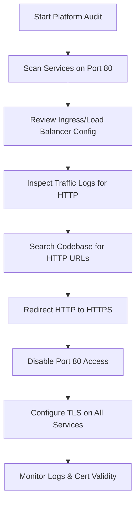

# summary
- that our entire site is accessed via HTTPS, and users' APIs also need to undergo DAST and SAST scanning. As for the interfaces providing services, they currently do not involve port 80.
# Q

About CWE-319 Describe

Vulnerability severity: Low

CWE ID CWE-319: Cleartext Transmission of Sensitive Information

Description: The channel encryption is not enforced. All the request and response from client to server are transmitted in without any network layer protection. Port number 80

uses HTTP cleartext protocol which transfer the data in cleartext over the network.

Impact The HTTP protocol transmit data in cleartext and hence all data transmission will be unencrypted overt the network. An adversary can perform MITM to steal the data.

Recommendation: It is recommended to use SSL/TS for all connections that are authenticated or transmitting sensitive. All requests from the user to a HTTP URL must be redirected to a HTTPS URL instead. This should be implemented throughout the application. Disable port 80 from internet facing URLs.

Reference: https://ce.mitre.org/data/definitions/319.htm

Please help me analyzing it . If we as a platform, how do we find and locate these problems, such as where they may appear. And how to fix this?

(1) Analyze the provided reference from mitre.org and other authoritative sources like OWASP to build a comprehensive profile of CWE-319, including its common consequences and the types of data typically considered sensitive. (2) Investigate and list the common areas within a software platform where this vulnerability is likely to appear, such as: (a) Web application login pages and data submission forms. (b) API endpoints for both web and mobile applications. (c) Internal microservice communications. (d) Data transfer in IoT ecosystems. (3) Research methods and tools for detecting and locating instances of CWE-319. This should cover: (a) Automated Dynamic and Static Application Security Testing (DAST/SAST) tools. (b) Network traffic analysis using packet sniffers to identify unencrypted transmissions. (c) Manual code review focusing on network communication modules and configuration file analysis. (4) Elaborate on the recommended remediation strategies. Detail the technical steps for: (a) Implementing SSL/TLS encryption across the entire platform. (b) Configuring web servers to enforce HTTPS, including setting up HTTP to HTTPS redirects and implementing HTTP Strict Transport Security (HSTS). (c) Securing cookies by setting the 'Secure' flag to prevent their transmission over HTTP. (5) Find and analyze real-world examples or case studies of security breaches where CWE-319 was the root cause to illustrate the practical impact of this vulnerability. (6) Explain the mechanics of a Man-in-the-Middle (MITM) attack and how it specifically exploits the cleartext transmission of data. (7) Compare and contrast CWE-319 (data in transit) with related vulnerabilities like CWE-311 (Missing Encryption of Sensitive Data at rest) to clarify the scope and context of the weakness. (8) Synthesize a set of preventative best practices for development and operations teams to ensure secure data transmission is a default standard throughout the application lifecycle.

# ChatGPT

Sure. Here’s a detailed analysis of **CWE-319: Cleartext Transmission of Sensitive Information** from a **platform-level** perspective.

---

## **🔐 CWE-319: Cleartext Transmission of Sensitive Information**

### **📌 Description Recap**

When applications transmit sensitive data (e.g., passwords, tokens, API keys) over **unencrypted channels**, such as **HTTP on port 80**, an attacker on the network can intercept this traffic (e.g., via **MITM - Man-in-the-Middle attack**).

Typical affected services:

- Web applications over HTTP (port 80)
- APIs not enforcing HTTPS
- Third-party callbacks or webhooks using insecure URLs
- Microservices communicating over cleartext internally (esp. in multi-tenant or shared networks)

---

## **🔍 How to Identify This Vulnerability in a Platform**

### **1.** 

### **Scan for Services Listening on Port 80**

Use tools like nmap or GCP’s firewall logs to detect services still listening on HTTP.

```
nmap -p 80 <your-domain.com>
```

Also validate:

- Ingress/NLB forwarding rule configuration
- GKE Services using targetPort: 80

---

### **2.** 

### **Check for URLs Using HTTP**

Search for cleartext endpoints:

- In your codebase (grep, rg, etc.)
- In Cloud Load Balancer forwarding rules (gcloud compute forwarding-rules list)
- In Kong Gateway route configurations (curl http://<admin-api>/routes)
- In Cloud Run/Functions endpoints

Also analyze:

- Redirect rules (e.g., HTTP to HTTPS)
- External callbacks or 3rd-party webhooks that still use HTTP

---

### **3.** 

### **Traffic Inspection**

Use logging tools to inspect runtime traffic:

- GKE Envoy/Nginx access logs
- Cloud Armor logs
- VPC Flow Logs
- Kong Gateway logs (look for scheme = http)

For GKE (if using Nginx Ingress):

```
kubectl logs <nginx-ingress-pod> | grep -i http
```

---

### **4.** 

### **Automated Scanners**

Integrate tools into your CI/CD pipeline:

- OWASP ZAP (Zed Attack Proxy)
- Burp Suite Scanner (for app pentesting)
- gcloud web-security-scanner scan-configs

---

## **🛠️ How to Fix (Platform-Wide)**

### **✅ 1.** 

### **Enforce HTTPS**

- Use HTTPS (TLS/SSL) for **all communication**:
    - Web apps
    - Internal APIs
    - Admin dashboards
    - Webhooks
    - Health checks (if external)

### **✅ 2.** 

### **HTTP to HTTPS Redirection**

In Nginx (or similar), enforce:

```nginx
server {
    listen 80;
    server_name example.com;
    return 301 https://$host$request_uri;
}
```

In Kong Gateway:

```bash
curl -i -X PATCH http://localhost:8001/services/<service_id> \
  --data "protocol=https"
```

---

### **✅ 3.** 

### **Disable Port 80 for Internet-Facing Resources**

In GCP:

```
gcloud compute firewall-rules delete allow-http
```

Disable HTTP LB frontend:

```
gcloud compute forwarding-rules delete <rule-name> --global
```

---

### **✅ 4.** 

### **Use HTTPS Health Checks (if supported)**

If using HTTPS load balancer, configure health check as:

```bash
gcloud compute health-checks update https my-check \
  --port 443 --request-path /healthz
```

---

### **✅ 5.** 

### **Validate Certificates**

Ensure:

- Server has valid SSL certs (use GCP Certificate Manager)
- No expired/self-signed certs in production
- Clients validate cert chain properly

---

### **✅ 6.** 

### **Audit and Monitor Regularly**

- Add a periodic check in CI/CD
- Track usage of port 80
- Monitor traffic anomalies via Cloud Armor/WAF/IDS

---

## **🧩 Mermaid - Platform-Level Flow to Detect & Prevent CWE-319**



---

## **✅ Summary**

| **Task**                | **Tool/Approach**                           |
| ----------------------- | ------------------------------------------- |
| Detect open HTTP port   | nmap, gcloud compute forwarding-rules       |
| Find HTTP URLs in code  | grep http://, static analysis               |
| Analyze runtime traffic | Kong/Nginx logs, Cloud Armor, Flow Logs     |
| Redirect HTTP to HTTPS  | LB config, Nginx rules, Kong route policies |
| Enforce TLS             | GCP Cert Manager, HTTPS LBs, Kong certs     |
| Disable HTTP access     | Remove LB frontend, firewall rule           |
| Scan regularly          | OWASP ZAP, web-security-scanner, CI/CD step |

---

如需我为你生成**平台级自动审计脚本**或**Kong/GKE/Nginx 的 TLS 强制配置模板**，欢迎继续补充环境细节。


# Gemini
# A Comprehensive Analysis of CWE-319: A Strategic Guide to Securing Data in Transit

## Section 1: Anatomy of CWE-319: Beyond the Definition

An accurate and nuanced understanding of any security weakness is the foundational prerequisite for its effective mitigation. The Common Weakness Enumeration (CWE) entry CWE-319, "Cleartext Transmission of Sensitive Information," represents a class of vulnerability that is frequently underestimated yet serves as a critical gateway for more severe and damaging cyberattacks. This section provides an exhaustive analysis of CWE-319, moving beyond its basic definition to explore the full spectrum of data it affects, its relationship to other critical weaknesses, and the often deceptive nature of its perceived severity.

### 1.1 The Core Weakness: Transmitting Data in the Open

At its most fundamental level, CWE-319 describes a scenario where a software product transmits sensitive or security-critical data in cleartext through a communication channel that can be monitored, or "sniffed," by unauthorized actors.1 The term "cleartext" (or plaintext) signifies that the data is not encrypted and is therefore in a human-readable or easily decodable format.3 This includes not only plain text but also data encoded with non-cryptographic methods like Base64, which can be trivially reversed to reveal the original information.4

A common misconception is that this weakness is only relevant for data traversing the public internet. In reality, the scope of "sniffable channels" is far broader and encompasses any medium where an adversary could potentially gain access to the data stream. This includes:

- **Public and Private Networks:** Local Area Networks (LANs), Wide Area Networks (WANs), and wireless networks (e.g., public Wi-Fi) are classic examples where network traffic can be intercepted.1
    
- **Cloud Environments:** Communications between services within a cloud infrastructure, often referred to as "east-west" traffic, can be sniffed if an attacker compromises a single component within that environment.2
    
- **Hardware-Level Interfaces:** The weakness extends beyond software to physical hardware. External debug channels, such as those used for remote JTAG debugging, or internal hardware buses can be probed by an attacker with physical access, exposing any unencrypted data they carry.2
    

The immediate and primary consequence of this weakness is a direct violation of **Confidentiality**. Anyone with the means to access the communication channel—whether a sophisticated state actor on the internet backbone or a low-skilled attacker on a shared Wi-Fi network—can read the contents of the transmitted messages.1 This significantly lowers the barrier to exploitation, making it a high-likelihood event in many scenarios.1

### 1.2 The Spectrum of "Sensitive Information": A Critical Prerequisite for Detection

A primary reason that CWE-319 vulnerabilities persist in production systems is an overly narrow or incomplete definition of what constitutes "sensitive information." Effective detection and remediation demand a comprehensive understanding that extends far beyond just passwords and credit card numbers. For a platform, any data that could lead to user harm, reputational damage, financial loss, or regulatory penalties if exposed must be considered sensitive and protected accordingly.

The spectrum of sensitive data includes, but is not limited to:

- **Authentication Credentials:** This is the most obvious category and includes passwords, passphrases, security PINs, and secret keys or tokens used for authentication.6 The cleartext transmission of a password is a high-severity variant of this weakness.8
    
- **Financial and Payment Information:** This encompasses credit card numbers (Primary Account Numbers or PANs), expiration dates, CVV codes, bank account numbers, and any other data related to financial transactions.6 Exposure of this data often carries strict regulatory penalties under standards like the Payment Card Industry Data Security Standard (PCI DSS).
    
- **Personally Identifiable Information (PII):** This is a broad category of data that can be used to identify, contact, or locate a single person. It includes names, email addresses, physical addresses, phone numbers, dates of birth, Social Security Numbers (or other national identifiers), and medical records.9 The protection of PII is mandated by regulations such as the General Data Protection Regulation (GDPR) in Europe and the Health Insurance Portability and Accountability Act (HIPAA) in the United States, making its exposure a significant legal and compliance risk.11
    
- **Session Management Tokens:** This critical category includes session cookies, API keys, JSON Web Tokens (JWTs), and other authorization tokens that a server issues to a client after successful authentication. If these tokens are transmitted in cleartext, an attacker can capture them and use them to impersonate the legitimate user, hijacking their session and gaining full access to their account without needing the password.4 This attack, known as session sidejacking, is a direct and common exploitation of CWE-319.2
    
- **Proprietary Business and System Data:** Information that is critical to the operation and competitive advantage of the business must also be protected. This can include intellectual property, proprietary algorithms, internal system configurations, network topology information, and even the application's own source code when transmitted for dynamic updates.12 For example, a printer sending its administrative password in cleartext (CVE-2008-0374) or a product transmitting its Blowfish encryption key in cleartext (CVE-2004-1852) are both documented instances of this weakness.1
    
- **Contextually Sensitive Information:** Some data may not appear sensitive in isolation but becomes so when aggregated. A user's web browsing history, location check-ins, or a sequence of API calls can reveal patterns of behavior, personal preferences, or confidential activities that must be protected.10 Automated tools are particularly poor at identifying this type of contextual sensitivity, which requires human analysis and threat modeling to properly classify.
    

### 1.3 Critical Distinctions: CWE-319 vs. CWE-311 and CWE-312

To accurately diagnose and remediate security flaws, it is essential to distinguish between closely related weaknesses. CWE-319 is part of a family of vulnerabilities related to cryptographic failures, and understanding its specific relationship with its parent (CWE-311) and sibling (CWE-312) is crucial for applying the correct fix.

- **CWE-319: Cleartext Transmission of Sensitive Information:** This weakness describes the _act of transmitting_ data over a sniffable channel without proper encryption. The focus is on the insecurity of the **transport mechanism**. A classic example is a web application login form that uses the HTTP protocol to submit a username and password. The data is in cleartext _while in transit_.1
    
- **CWE-311: Missing Encryption of Sensitive Data:** This is a broader, more fundamental weakness that describes the _failure to encrypt_ sensitive data _before_ it is either stored or transmitted.14 CWE-319 is officially classified as a "ChildOf" CWE-311, meaning it is a specific manifestation of this general failure.1 The focus of CWE-311 is on the insecure
    
    **state of the data itself**. An example would be a program that accepts a password into a variable but then passes that variable directly to a network sending function without first calling a cryptographic function to encrypt it.16 Addressing the root cause of CWE-319 often requires fixing the underlying CWE-311 flaw.
    
- **CWE-312: Cleartext Storage of Sensitive Information:** This weakness describes the _act of storing_ sensitive data in an unencrypted format **at rest**. The focus is on the insecurity of the **storage medium**. Examples include saving plaintext passwords in a database column, writing sensitive session details to a world-readable log file, or hardcoding API keys in a configuration file.15
    

This hierarchy is not merely academic. It informs the remediation strategy. A finding of "Password transmitted in cleartext" (CWE-319) cannot be fixed simply by changing a network setting; it requires a developer to modify the application code to ensure the password data is properly encrypted before transmission (addressing CWE-311).

### 1.4 Deconstructing Severity: Why a "Low" Rating Can Be Deceptive

A common and dangerous pitfall is to accept a "Low" severity rating for a CWE-319 finding without a thorough, context-aware analysis. While some instances of this vulnerability may receive low CVSS (Common Vulnerability Scoring System) scores from automated scanners 18, these scores are often based on flawed assumptions that do not hold true in modern, complex computing environments. A deeper analysis reveals that the potential impact is frequently High or even Critical.18

The discrepancy arises from how the CVSS framework calculates risk. A low score for CWE-319 often relies on metrics such as:

- **Attack Vector (AV): Adjacent:** This metric assumes the attacker must be on the same local network as the victim (e.g., the same Wi-Fi network or corporate LAN).18
    
- **Attack Complexity (AC): High:** This metric might assume that positioning oneself to intercept the traffic is difficult.
    

These assumptions are increasingly invalid for a modern software platform. The "Adjacent" attack vector, once considered a significant hurdle, is now a trivial condition to meet. The proliferation of public Wi-Fi in coffee shops, airports, and hotels means that users are constantly connecting to untrusted networks where attackers can easily position themselves to intercept traffic.8 For an attacker, becoming "adjacent" is as simple as sitting in the same cafe as a remote employee.

Furthermore, the concept of a secure "internal" network is an outdated paradigm in the age of cloud computing and microservices. In these architectures, hundreds of services communicate with each other over a virtualized network. If this internal "east-west" traffic is unencrypted, an attacker who compromises a single, low-privilege microservice gains a vantage point to sniff traffic from countless other, more critical services.25 In this context, the attacker is perpetually "adjacent" to a vast internal attack surface.

Ultimately, the severity of a vulnerability should not be judged by the perceived difficulty of the attack, but by the **maximum potential impact** of a successful exploit. The interception of a single administrator's password, transmitted in cleartext over an internal network, can lead to a complete system compromise. The theft of a single user's session cookie can result in a full account takeover.

Therefore, CWE-319 should not be viewed as an isolated, low-impact flaw. It must be understood as a powerful **enabler** of more devastating attacks. It is often the first, and easiest, step in a longer attack chain. An intercepted session cookie (CWE-319) directly facilitates session hijacking (CAPEC-102), which in turn leads to unauthorized data access, modification, and exfiltration.2 A platform that dismisses CWE-319 as a "low" risk is ignoring the first domino in a potential chain of catastrophic failure. The true risk is defined not by the weakness itself, but by the value of the assets it exposes.

## Section 2: The Ripple Effect: Exploitation Scenarios and Real-World Impact

Understanding the theoretical definition of CWE-319 is only the first step. To truly appreciate its significance, one must analyze the practical methods attackers use to exploit it and the tangible, often devastating, consequences that follow. This section transitions from theory to reality, detailing the attacker's playbook and examining high-profile security incidents where the failure to protect data in transit played a pivotal role.

### 2.1 The Attacker's Playbook: Common Attack Patterns (CAPEC)

The Common Attack Pattern Enumeration and Classification (CAPEC) project provides a catalog of known adversary techniques. Several of these attack patterns are directly enabled by the presence of CWE-319 vulnerabilities.

- **CAPEC-117: Interception:** This is the foundational attack pattern, representing the act of passive eavesdropping or "sniffing" of communication channels to gather information.2 The attacker simply listens to the unencrypted traffic, collecting any valuable data that passes by. This is the simplest exploitation of CWE-319 and serves as a reconnaissance step for more advanced attacks.8
    
- **CAPEC-102: Session Sidejacking:** This is one of the most common and impactful exploits of CWE-319. After a user authenticates to a service (often over a secure HTTPS connection), the server provides a session cookie. If the user then navigates to a part of the site served over unencrypted HTTP, that cookie is transmitted in cleartext. An attacker sniffing the network traffic can capture this cookie and use it to impersonate the user, gaining full access to their session without ever needing to know their password.2 This completely bypasses the login process.
    
- **CAPEC-65: Sniff Application Code:** In some scenarios, applications may download updates or code modules over unencrypted channels. An attacker can exploit this by intercepting the communication to steal the application's source code.2 This code can then be reverse-engineered to discover other, potentially more severe, vulnerabilities like hardcoded credentials or logic flaws.12
    
- **CAPEC-383: Harvesting Information via API Event Monitoring:** Modern applications rely heavily on APIs. If these API communications are not encrypted, an attacker can monitor the traffic to harvest large volumes of user data, such as user IDs, email addresses, or other PII.2 This harvested data is a valuable commodity, often used to fuel large-scale spam campaigns, phishing attacks, or credential stuffing attacks against other platforms.
    

### 2.2 In-Depth Analysis: The Man-in-the-Middle (MITM) Attack

The Man-in-the-Middle (MITM) attack is the quintessential exploitation of unencrypted communication, and CWE-319 is the fundamental weakness that makes it possible. In a MITM attack, an adversary actively positions themselves between two communicating parties, intercepting, reading, and potentially altering the messages without either party's knowledge.23 The two victims believe they are communicating directly and securely, while in reality, the attacker controls the entire conversation.28

The most common breeding ground for MITM attacks is an unsecured or maliciously controlled network, with public Wi-Fi hotspots being the prime example.23 An attacker can set up their own malicious hotspot with an enticing name (e.g., "Free_Airport_WiFi") or use techniques to intercept traffic on a legitimate but unsecured network.

Several powerful MITM techniques are specifically designed to exploit the absence of enforced encryption:

- **SSL Stripping:** This is a particularly dangerous and effective attack. It targets users who attempt to connect to a secure site but do not explicitly type `https://`. The user's browser initially sends an HTTP request. The attacker intercepts this request. Instead of allowing the server's redirect to HTTPS to reach the user, the attacker establishes their own HTTPS connection to the server. They then serve a plain HTTP version of the site to the user. From the user's perspective, the site may load without a visible padlock, but they might not notice. From the server's perspective, the connection is secure. The attacker sits in the middle, with a secure connection to the server and an unencrypted, cleartext connection to the user, allowing them to read and modify all traffic.27
    
- **DNS Spoofing (or DNS Cache Poisoning):** In this attack, the adversary corrupts the Domain Name System (DNS) records on a server or the user's local machine. When the user attempts to navigate to a legitimate site like `yourplatform.com`, the corrupted DNS record resolves to an IP address controlled by the attacker. The attacker's server can then host a perfect replica of the real site, capturing any credentials the user enters, while proxying the connection to the real site to maintain the illusion.27
    
- **ARP Spoofing:** This technique is used on Local Area Networks (LANs). The Address Resolution Protocol (ARP) is used to map IP addresses to physical MAC addresses. An attacker can send forged ARP messages across the network, telling all devices that the IP address of the default gateway (the router) now corresponds to the attacker's MAC address. As a result, all outbound internet traffic from victim devices on the LAN is routed through the attacker's machine before going to the internet, allowing for complete interception.23
    

### 2.3 Case Studies in Compromise: Lessons from Major Data Breaches

The history of cybersecurity is replete with incidents where cryptographic failures led to catastrophic outcomes. Analyzing these breaches provides invaluable lessons on the real-world impact of neglecting data protection.

#### 2.3.1 Case Study 1: The Equifax Breach (2017) - A Lesson in Visibility

The 2017 Equifax data breach, which exposed the personal information of 147 million people, was not directly caused by CWE-319, but a related cryptographic failure played a critical role in its severity.31

- **Initial Vector:** The attackers gained entry by exploiting a known, unpatched vulnerability in the Apache Struts web framework (CVE-2017-5638) on a public-facing web portal.32
    
- **The Critical Failure of Encryption Management:** Once inside, the attackers were able to move laterally through the network and exfiltrate massive amounts of data over a period of 76 days.34 Equifax had network security tools in place that were designed to inspect encrypted traffic for signs of malicious activity or data exfiltration. However, these tools were rendered completely ineffective because a TLS certificate required for their operation had expired 10 months prior to the breach's discovery and had not been renewed. This meant that all encrypted network traffic, including the attackers' data exfiltration, was passing through the network completely uninspected.32
    
- **Lesson for the Platform:** This incident provides a powerful, second-order lesson. It is not enough to simply "use HTTPS." A platform must have robust processes for managing its entire cryptographic infrastructure, including the lifecycle of every TLS certificate. An expired certificate can create a blind spot that is just as dangerous as not using encryption at all. It allowed attackers to operate undetected for months, leading to one of the most significant data breaches in history.
    

#### 2.3.2 Case Study 2: The LinkedIn (2012) and MySpace (2008/2016) Breaches - The Downstream Catastrophe

These iconic breaches highlight the devastating downstream consequences of credential exposure, a risk that is directly mirrored by the cleartext transmission of passwords.

- **Root Cause:** The primary failure in these breaches was not insecure transmission, but insecure storage (a CWE-312 flaw). Both companies stored user passwords as hashes using the outdated and insecure SHA1 algorithm, and crucially, they did not use "salting".35 A salt is a unique, random value added to each password before hashing, which prevents attackers from using pre-computed "rainbow tables" to crack many passwords at once.
    
- **The Consequence:** Because the hashes were unsalted, attackers were able to crack them in bulk, revealing the plaintext passwords of millions of users.35 This data was then sold on dark web markets.37 The primary value of this data lies in "credential stuffing," where attackers take the leaked email/password combinations and systematically try them on other websites (e.g., banking, email, e-commerce), correctly assuming that many users reuse the same password across multiple services.41 The 2012 Dropbox breach was reportedly facilitated by an employee reusing their compromised LinkedIn password.44
    
- **Lesson for the Platform:** The outcome of a CWE-319 vulnerability where a password is transmitted in cleartext is identical, from the user's perspective, to their password being compromised in a large-scale breach like LinkedIn's. The attacker obtains the user's plaintext password. This immediately puts not only their account on the vulnerable platform at risk but also every other online account where they have reused that same password.8 This dramatically elevates the systemic and reputational risk of what might seem like a simple flaw. A single CWE-319 vulnerability on a non-critical application can become the entry point for compromising a user's entire digital life.
    

#### 2.3.3 Case Study 3: Real-World Bug Bounty Reports - The Daily Reality

An analysis of publicly disclosed bug bounty reports on platforms like HackerOne provides a continuous stream of evidence that attackers are actively finding and exploiting simple instances of CWE-319.

- **Cleartext Credentials via Email:** A common and recurring finding is the transmission of a user's password in a signup confirmation or password reset email.14 Since the SMTP protocol used to transmit email does not guarantee end-to-end encryption, this is a clear violation of secure data handling principles.
    
- **Leaked Tokens in HTTP Referer Headers:** When a user on an HTTPS page clicks a link to an external site, the browser may send the full URL of the current page in the `Referer` header. If that URL contains a sensitive token (e.g., a session ID or password reset token), that token is leaked to the third-party site.19
    
- **Admin Panel and Privileged Access:** Reports have detailed how cleartext transmission can lead directly to administrative compromise. One report on a Helium-affiliated program showed how an invitation link sent in cleartext could be manipulated to grant an attacker administrative access to an organization.47 Another report affecting an Uber program in Portugal revealed an administrator password exposed in plaintext within a JavaScript source file, granting access to an admin panel with user data.49
    

These real-world examples demonstrate that attackers are not just focused on complex, theoretical exploits. They are consistently and successfully targeting the low-hanging fruit of unencrypted data channels. The most effective offensive strategy for an attacker is often to find the single weakest link in the communication chain—the one HTTP login form, the one API endpoint that doesn't enforce TLS, or the one insecure email notification. Consequently, the platform's defensive strategy must be comprehensive, aiming to eliminate _all_ such weak links without exception.

## Section 3: A Platform-Wide Discovery Strategy: Where to Find CWE-319

Identifying instances of CWE-319 requires a systematic and holistic approach that extends beyond simple scans of public-facing websites. The attack surface for this vulnerability is vast and often hidden within internal systems and forgotten data channels. A successful discovery strategy must be data-centric, tracking the flow of sensitive information across every component of the platform's architecture.

### 3.1 The Web Application Frontend: The Classic Attack Surface

The most traditional and well-understood location for CWE-319 vulnerabilities is the user-facing web application. These flaws are often the easiest to spot but are still surprisingly common.

- **Login and Authentication Forms:** This is the most critical and obvious vector. Any user login form, administrator panel, or support portal that submits credentials to a URL beginning with `http://` instead of `https://` is transmitting those credentials in cleartext. This is a high-severity vulnerability that is trivial for an attacker on the network to exploit.8
    
- **Password Management Functions:** The entire lifecycle of password management must be secured. This includes forms for password resets, password changes, and security question updates. Every step in these workflows must be conducted exclusively over HTTPS.51
    
- **Insecure Cookies and Session Management:** Session cookies are equivalent to a user's credentials for the duration of their session. If a cookie is set without the `Secure` attribute, a browser may transmit it over an unencrypted HTTP connection if the user happens to visit a non-HTTPS page on the same domain (e.g., an old blog post or a marketing page). This allows an attacker to capture the cookie and hijack the user's session.1 This specific failure, documented in CVE-2008-4122, is a critical and frequently overlooked attack vector.1
    
- **Mixed Content Vulnerabilities:** This issue arises when a page loaded over secure HTTPS includes resources (such as scripts, stylesheets, or images) loaded over unencrypted HTTP.18 This indicates an incomplete or flawed migration to HTTPS. "Active" mixed content, such as JavaScript files, is the most dangerous, as it can compromise the security of the entire page, potentially stealing cookies or capturing keystrokes. "Passive" mixed content, like images, can still be used to track user activity and leak information about the pages they visit.
    
- **General Data Submission Forms:** Beyond authentication, any form that collects and submits PII, financial data, or other sensitive information must use HTTPS for the submission process to prevent interception.18
    

### 3.2 APIs and Microservice Architectures: The Modern, Hidden Attack Surface

In modern, distributed systems, the attack surface has shifted from a monolithic application to a complex web of interconnected APIs and microservices. This internal landscape is a fertile ground for CWE-319 vulnerabilities that are invisible to traditional perimeter scanning tools.

- **East-West Traffic (Inter-Service Communication):** This is arguably the most critical and overlooked blind spot in modern architectures. Development teams, operating under the outdated assumption that the "internal network is safe," often configure services to communicate with each other using plain HTTP for performance or convenience.25 This is a catastrophic mistake in a zero-trust world. If an attacker compromises a single container or virtual machine, they can use it as a pivot point to sniff all internal API traffic passing through the local network segment. This allows them to harvest service-to-service authentication tokens, API keys, and any sensitive user data being processed by the internal services.26 The popular microservice philosophy of "smart endpoints and dumb pipes" becomes a significant liability if those "dumb pipes" are also unencrypted.26
    
- **API Response Payloads:** Vulnerabilities can exist in the data sent _from_ the API as well as to it. An API endpoint that returns sensitive user information in its response body over an HTTP connection exposes that data to interception. A real-world CVE was issued for a Know Your Customer (KYC) solution where API responses contained unencrypted sensitive user data that could be intercepted by an authenticated attacker, allowing them to impersonate other users.56 This type of flaw is closely related to the OWASP API Security Top 10 risk of "Excessive Data Exposure".57
    
- **Third-Party API Integrations:** A platform's security posture is dependent on the security of its partners. If a platform service makes a call to a third-party API over an unencrypted HTTP channel, any data sent in that request (which could include user information or authentication tokens) can be intercepted in transit. This falls under the OWASP API Security Top 10 risk "API10:2023 - Unsafe Consumption of APIs," which highlights that developers often place too much trust in third-party services.58
    
- **Mobile Application Backends:** Mobile applications are fundamentally API clients. If the backend API endpoints they communicate with do not strictly enforce HTTPS, all data transmitted from the mobile app—including login credentials, PII, and usage data—is sent in cleartext over cellular or Wi-Fi networks, making it highly vulnerable to interception.59
    

### 3.3 The Internet of Things (IoT) and Operational Technology (OT): The Wild West

IoT and OT environments are notorious for widespread cryptographic weaknesses, with cleartext transmission being one of the most common findings. This is often due to the use of legacy protocols, a focus on functionality over security, and long device lifecycles with infrequent updates.

- **Insecure by Design Network Services:** Many IoT devices, by default, expose management and data transfer services that are inherently unencrypted. This is a core component of the OWASP IoT Top 10 list of vulnerabilities.60 Common examples include:
    
    - **FTP (File Transfer Protocol):** Used for transferring files, including firmware or data logs, completely in cleartext.
        
    - **Telnet:** Used for remote command-line access, transmitting all commands and responses, including login credentials, in cleartext.
        
    - **Custom UDP/TCP Protocols:** Many devices use proprietary protocols for communication that lack any form of encryption.63
        
- **Unencrypted Firmware Updates:** A critical vulnerability occurs when a device downloads its firmware updates over a plain HTTP connection. This allows an attacker with a MITM position to intercept the download and replace the legitimate firmware with a malicious version, effectively gaining complete control over the device.25
    
- **Exposed Hardware and Debug Interfaces:** As noted earlier, physical or remote access to hardware debug ports like JTAG or serial interfaces can allow an attacker to read sensitive data directly from the communication channel if it is not encrypted.2
    
- **High Prevalence:** The MITRE classification notes that CWE-319 is "Often Prevalent" in Industrial Control Systems (ICS) / OT and on Test/Debug Hardware, highlighting these as key areas for investigation.2
    

### 3.4 Ancillary Systems and Hidden Data Flows: The Forgotten Channels

Finally, a comprehensive discovery strategy must look beyond the primary application logic to the various supporting systems and processes where sensitive data might flow through unencrypted channels.

- **Email Notifications:** A frequent source of vulnerabilities is the practice of sending sensitive information, such as newly created passwords, password reset links, or PII, within the body of an email.1 The standard email transmission protocol, SMTP, does not guarantee end-to-end encryption, and emails can be intercepted as they pass through various mail servers on their way to the recipient.
    
- **Log Aggregation and Monitoring:** Centralized logging is a best practice, but the transport of those logs must be secure. If log data, which may inadvertently contain sensitive information like session tokens, passwords, or PII, is sent from application servers to a central log aggregator (e.g., an ELK stack or Splunk instance) over an unencrypted channel like plain UDP syslog, it can be sniffed on the internal network.1
    
- **Backup and Diagnostic Processes:** Automated backup routines that transfer database dumps or application files to a remote storage location (like an S3 bucket or an FTP server) must use encrypted channels. Similarly, diagnostic processes that send data dumps to support engineers must not transmit sensitive information in cleartext.1
    
- **Configuration Management:** While storing secrets in configuration files is primarily a CWE-312 (cleartext storage) issue, the management of these files can introduce a CWE-319 risk. If a configuration management system (like Ansible, Chef, or a custom-built solution) distributes configuration files containing secrets to servers over an unencrypted channel, those secrets can be intercepted in transit.
    

This data-centric audit reveals that the potential locations for CWE-319 are far more numerous than a simple web scan would suggest. A platform's audit must account for every system and every protocol that touches sensitive data, both internally and externally. Certain technology choices, such as legacy J2EE applications or IoT devices using older protocols, can serve as indicators of high-risk areas that warrant immediate and focused attention.5

The following table provides a structured checklist to guide this discovery process, mapping platform components to specific vulnerability manifestations.

**Table 1: Manifestations of CWE-319 Across Platform Components**

|Platform Area/Component|Specific Vulnerability Example|Sensitive Data at Risk|Common Protocols|Discovery Method|
|---|---|---|---|---|
|**Web Application (Login)**|Login form submits credentials to an HTTP URL.|Usernames, Passwords, PII|HTTP|DAST, Network Sniffing, Manual Pen Test|
|**Web Application (Cookies)**|Session cookie sent without the `Secure` flag.|Session Tokens, Auth Tokens|HTTP, HTTPS|DAST, Browser Dev Tools, Manual Pen Test|
|**API Gateway**|API endpoint accessible over HTTP.|API Keys, Auth Tokens, All Request/Response Data|HTTP|DAST (API Scan), Network Sniffing|
|**Internal Microservices**|Service-to-service calls made over HTTP.|Internal Auth Tokens, PII, Business Data|HTTP, gRPC (unsecured)|Network Sniffing, SAST, Manual Code Review|
|**Mobile Backend**|Mobile app communicates with an HTTP API endpoint.|User Credentials, PII, Device IDs|HTTP|DAST, Network Sniffing (with proxy)|
|**IoT Device Management**|Device sends credentials to a server over Telnet or FTP.|Admin Passwords, Wi-Fi Keys, Config Data|Telnet, FTP, Custom UDP/TCP|Network Sniffing, Firmware Analysis|
|**Email Service**|Password reset email contains the new password in plaintext.|Passwords, PII, Reset Tokens|SMTP|Manual Review of Email Templates, Code Review|
|**Log Aggregator**|Application logs containing sensitive data sent via UDP syslog.|Session IDs, PII, Debug Info|UDP (Syslog)|Network Sniffing, Config Review|

## Section 4: The Detection Toolkit: A Multi-Pronged Approach to Identification

Detecting all instances of CWE-319 across a complex platform is not achievable with a single tool or technique. The weakness can manifest at the code level, in the runtime behavior of an application, in server configurations, and in underlying network architecture. Therefore, an effective detection strategy must be a defense-in-depth model, layering automated scanning for scale and speed with expert human analysis for context and nuance.

### 4.1 Automated Security Testing: The First Line of Defense

Automated tools provide the broad coverage necessary to continuously scan large codebases and running applications, acting as a crucial first line of defense.

#### 4.1.1 Static Application Security Testing (SAST)

SAST tools, also known as "white-box" testers, analyze an application's source code, bytecode, or compiled binaries without executing them.47 They build a model of the application's data and control flows to identify potentially vulnerable code patterns.

- **How it Detects CWE-319:** SAST can be highly effective at finding the root causes of cleartext transmission.2 It can identify:
    
    - Hardcoded URLs that use the `http://` scheme.
        
    - Instances where networking libraries (e.g., Java's `HttpURLConnection` or Python's `requests`) are used without enabling or configuring SSL/TLS encryption.16
        
    - Flows where a variable identified as containing sensitive data (a "source") is passed to a network output function (a "sink") without passing through an encryption function first.
        
- **Effectiveness and Tools:** MITRE rates the effectiveness of SAST for this weakness as "High".2 Commercial and open-source tools like CodeSonar, Polyspace, Snyk, and Checkmarx can be configured to detect these flaws.47
    
- **Limitations and Configuration:** The primary limitation of SAST is its lack of runtime context. It can generate false positives and, more dangerously, false negatives if not properly configured. For instance, a tool may not know that a variable named `user_data` contains sensitive PII unless it is explicitly told. Tools like Polyspace require a configuration file (a `datalog` file) to define what data is sensitive and which functions are considered unsafe "sinks" for that data.66 Without this investment in customization, the tool's effectiveness is severely diminished.
    

#### 4.1.2 Dynamic Application Security Testing (DAST)

DAST tools operate from the outside-in, taking a "black-box" approach to test a running application by simulating the actions of an attacker.68 They crawl web applications and APIs, sending various payloads and analyzing the responses to identify vulnerabilities.

- **How it Detects CWE-319:** DAST is exceptionally good at finding obvious instances of cleartext transmission on web frontends and APIs. It will flag common issues such as:
    
    - Login forms or any other forms that submit data to an `http://` endpoint.18
        
    - Cookies that are missing the `Secure` flag, by observing if they are sent over subsequent HTTP requests.4
        
    - Active or passive mixed content on HTTPS pages.18
        
    - Insecure protocols detected in a site's Content Security Policy (CSP).18
        
- **Effectiveness and Tools:** DAST is the standard method for identifying these runtime vulnerabilities. The market is mature, with leading tools including Invicti (and its SMB-focused product, Acunetix), PortSwigger's Burp Suite Enterprise, Veracode Dynamic Analysis, and the open-source OWASP ZAP.8
    
- **Limitations:** DAST's primary limitation is its "black-box" nature. It can identify that a vulnerability exists but cannot pinpoint the specific line of code that caused it. Furthermore, standard DAST scanners are typically focused on the north-south traffic (client-to-server) and are blind to the internal east-west traffic between microservices unless they are specifically configured to proxy and test each internal API endpoint individually, which can be complex.
    

### 4.2 Manual and Hybrid Methodologies: Finding What Automation Misses

While automation provides scale, it lacks the cognitive ability of a human expert to understand business context, link seemingly unrelated flaws, and identify subtle design-level vulnerabilities. Multiple sources emphasize that manual analysis is not just beneficial but essential for comprehensive security testing.1

- **Penetration Testing:** A skilled penetration tester simulates a real-world attacker, using a combination of automated tools and manual techniques. They can identify complex vulnerability chains, such as exploiting a minor information leak to gain knowledge that enables a larger attack. A penetration tester can understand that a field labeled `diag_code` is actually a sensitive medical identifier, something a tool would miss.
    
- **Threat Modeling:** This proactive process, conducted during the design phase of the SDLC, is a preventative measure. The team analyzes the proposed architecture and data flows to identify potential threats (e.g., "An attacker on the internal network could sniff API traffic") and defines security controls to mitigate them ("All internal API calls must use mTLS") before any code is written.65 This is one of the most effective ways to prevent CWE-319 from being introduced in the first place.
    
- **Practical Guide: Network Traffic Analysis with Wireshark:** Any engineering or security team can be empowered to perform their own basic checks for cleartext transmission using the powerful and free network protocol analyzer, Wireshark. This is an indispensable tool for manual testing.
    
    1. **Installation and Capture:** Install Wireshark and grant it the necessary permissions to capture network traffic. Select the active network interface (e.g., `en0` for Wi-Fi on macOS, `Ethernet` on Windows) and begin the capture.71
        
    2. **Basic Filtering:** In the display filter bar, type `http` and press Enter. This will immediately filter the captured traffic to show only unencrypted HTTP requests and responses, providing a clear view of any potential cleartext communication.71
        
    3. **Searching for Credentials:** To specifically hunt for password submissions, use more advanced filters. A filter like `http.request.method == "POST"` will show all data submitted via POST requests. This can be combined with a string search, such as `http contains "password"` or `http contains "username"`, to quickly find login attempts.71
        
    4. **Reconstructing Conversations:** Right-click on a packet of interest and select "Follow > TCP Stream." This will open a new window showing the entire, reconstructed conversation between the client and server in a human-readable format, making it easy to see exactly what data was exchanged.73
        
    5. **Analyzing Encrypted Traffic (for Debugging):** In a controlled development or testing environment, it is possible to configure browsers to export their TLS session keys to a log file. By pointing Wireshark to this key log file, it can decrypt the TLS traffic, allowing a developer to verify that data is being sent correctly even over an encrypted channel.72 This is a powerful debugging technique but should never be used in a production environment.
        

### 4.3 Manual Code and Configuration Review: Going to the Source

The most definitive way to find and understand a vulnerability is to examine its source.

- **Secure Code Review:** This involves a human expert manually reading the source code of an application, specifically focusing on security-sensitive areas. For CWE-319, a reviewer would scrutinize any code related to authentication, session management, API communication, logging, and email generation.74 They would look for the use of insecure protocols, missing encryption calls, and the improper handling of sensitive data variables. This is particularly crucial for critical code paths that AI-generated code might produce, as these tools can sometimes choose insecure libraries or patterns.74
    
- **Configuration Review:** A significant number of CWE-319 vulnerabilities are not due to code flaws but to misconfigurations of the underlying infrastructure. A manual review should be conducted on the configuration files for web servers (Apache, Nginx), application servers (Tomcat, JBoss), load balancers, and API gateways to ensure that they are correctly and consistently enforcing HTTPS, setting security headers like HSTS, and configuring cookies securely.
    

A mature platform must recognize that these detection methods are complementary, not mutually exclusive. DAST provides broad, continuous coverage of the perimeter. SAST provides early detection of flaws in the CI/CD pipeline. Network sniffing and manual penetration testing provide the deep, contextual analysis needed to find the hidden and complex vulnerabilities that automated tools will inevitably miss.

**Table 2: Comparison of CWE-319 Detection Methodologies**

|Methodology|How It Works|Pros|Cons|Ideal SDLC Phase|Example Tools|
|---|---|---|---|---|---|
|**SAST**|Analyzes static source code or binaries for vulnerable patterns.|Finds root cause in code; Fast; Integrates into CI/CD ("Shift Left").|Can have high false positives; Lacks runtime context; Requires configuration.|Development, Testing|Snyk, Checkmarx, CodeSonar, Polyspace|
|**DAST**|Tests a running application from the outside-in ("black box").|Low false positives for found issues; Simulates real attacks; Language agnostic.|Cannot pinpoint code location; Blind to internal traffic; Misses non-web issues.|Testing, Staging, Production|Invicti, Burp Suite, Veracode, OWASP ZAP|
|**Network Sniffing**|Passively captures and analyzes raw network packets.|Provides definitive proof of what is on the wire; Can see all traffic (internal/external).|Not scalable for continuous use; Requires expertise; Can't see inside encrypted traffic (w/o keys).|Testing, Incident Response|Wireshark, tcpdump|
|**Manual Pen Test**|A human expert attempts to compromise the application.|Finds complex/chained vulnerabilities; Understands business logic; Creative.|Expensive; Time-consuming; Point-in-time assessment, not continuous.|Pre-Deployment, Production|(Service-based)|
|**Threat Modeling**|A structured analysis of application design to identify threats.|Proactive (prevents flaws); Finds architectural/design issues; Cost-effective.|Requires security expertise; Can be abstract; Depends on accuracy of diagrams.|Requirements, Design|STRIDE, DREAD|

## Section 5: A Blueprint for Remediation and Prevention

Fixing instances of CWE-319 is not merely about patching individual vulnerabilities; it is about establishing a robust security posture that protects data by default. This requires a two-tiered approach: immediate tactical fixes to close existing security holes and long-term strategic improvements to the development lifecycle to prevent their recurrence.

### 5.1 Foundational Security: Immediate Tactical Fixes

These are the essential, non-negotiable controls that must be implemented across the platform to address the most common and dangerous manifestations of CWE-319.

#### 5.1.1 Enforce Universal HTTPS

The baseline for all data-in-transit security is the universal enforcement of strong, modern encryption.

- **The Mandate:** All communication channels, without exception, must be encrypted using a secure protocol like Transport Layer Security (TLS). It is recommended to configure servers to support only strong, modern versions, such as TLS 1.2 and preferably TLS 1.3, while disabling outdated and vulnerable protocols like SSLv2, SSLv3, and early TLS versions.6
    
- **Protocol Elimination:** All services that rely on inherently cleartext protocols, such as HTTP, FTP, and Telnet, must be disabled from internet-facing systems and replaced with their secure counterparts (HTTPS, SFTP, SSH).3
    

#### 5.1.2 Harden Web Server Configurations: Implementing HSTS

Enforcing HTTPS is the first step, but attackers can still attempt to downgrade connections. HTTP Strict Transport Security (HSTS) is a critical defense against such attacks.

- **Mechanism:** HSTS is a security policy mechanism delivered via an HTTP response header. When a browser receives this header from a website over a secure connection, it makes a note to _only_ communicate with that domain using HTTPS for a specified period of time (the `max-age`). Any future attempts to load the site using HTTP will be automatically converted to HTTPS by the browser _before_ the request is sent, effectively defeating SSL stripping attacks.75
    
- **Apache Implementation:** To enable HSTS on an Apache web server, the `mod_headers` module must be enabled. The header is then set within the HTTPS virtual host configuration (e.g., the `<VirtualHost *:443>` block). It must not be sent over HTTP.
    
    Apache
    
    ```
    # Ensure mod_headers is enabled
    # a2enmod headers
    
    <VirtualHost 192.168.1.1:443>
        #... other SSL configuration...
        Header always set Strict-Transport-Security "max-age=31536000; includeSubDomains; preload"
    </VirtualHost>
    ```
    
    75
    
- **Nginx Implementation:** In Nginx, the `add_header` directive is used within the `server` block that handles HTTPS traffic.
    
    Nginx
    
    ```
    server {
        listen 443 ssl;
        server_name your_domain.com;
        #... other SSL configuration...
        add_header Strict-Transport-Security "max-age=31536000; includeSubDomains; preload" always;
    }
    ```
    
    75
    
- **HSTS Directives Explained:**
    
    - `max-age`: The duration in seconds for which the browser should enforce HTTPS-only connections. A value of 31536000 corresponds to one year and is a common recommendation.75
        
    - `includeSubDomains`: An optional but highly recommended directive that applies the HSTS policy to all subdomains of the current domain.76
        
    - `preload`: An optional directive that signals your consent to have your domain included in a "preload list" that is hardcoded into major browsers. This provides the strongest protection, as the browser will know to use HTTPS for your site even on the very first visit. Submission to the official preload list requires a long `max-age` and the `includeSubDomains` directive.75
        

#### 5.1.3 Securing Cookies: The `Secure` and `HttpOnly` Flags

Session cookies are a primary target for attackers. Securing them is a critical remediation step that directly addresses the session sidejacking vector.

- **The `Secure` Flag:** This is the most direct and effective remediation for preventing session cookies from being transmitted in cleartext. When a cookie is set with the `Secure` flag, the browser is instructed to _never_ send that cookie over an unencrypted HTTP connection. It will only be sent when the request is to an HTTPS page.52 This simple flag is the fix for the vulnerability documented in CVE-2008-4122, where the failure to set it on an HTTPS cookie allowed the cookie to be leaked over a subsequent HTTP request.1
    
- **The `HttpOnly` Flag:** While its primary purpose is to mitigate Cross-Site Scripting (XSS) attacks, the `HttpOnly` flag is an essential companion to the `Secure` flag. It prevents client-side JavaScript from accessing the cookie's value, making it much harder for an attacker who finds an XSS flaw to steal the session cookie.
    
- **Implementation Examples:** The Open Web Application Security Project (OWASP) provides comprehensive guidance on implementing these flags across various platforms.78
    
    - **Java (Servlet 3.0+):** In the `web.xml` deployment descriptor:
        
        XML
        
        ```
        <session-config>
            <cookie-config>
                <secure>true</secure>
                <http-only>true</http-only>
            </cookie-config>
        </session-config>
        ```
        
    - **ASP.NET:** In the `Web.config` file:
        
        XML
        
        ```
        <system.web>
            <httpCookies requireSSL="true" httpOnlyCookies="true" />
        </system.web>
        ```
        
    - **PHP:** In the `php.ini` file for session cookies, or programmatically:
        
        PHP
        
        ```
        // In php.ini for all session cookies
        session.cookie_secure = true
        session.cookie_httponly = true
        
        // Programmatically for a specific cookie
        setcookie('name', 'value', ['secure' => true, 'httponly' => true]);
        ```
        

### 5.2 Architectural Resilience: Long-Term Strategic Solutions

While tactical fixes are essential for immediate containment, a truly resilient platform must build security into its architecture and development processes. This strategic approach aims to prevent vulnerabilities from being created in the first place.

#### 5.2.1 Application-Level Encryption

Transport-level encryption (TLS/HTTPS) protects the communication channel, but application-level encryption protects the data itself.

- **Concept:** This practice involves encrypting sensitive data fields _within the application_ before they are ever passed to the transport layer for transmission.1
    
- **Defense-in-Depth:** This provides a powerful layer of defense-in-depth. For example, in a microservices architecture, TLS might be terminated at a load balancer or API gateway. If the subsequent traffic from the load balancer to the backend services is unencrypted HTTP, the TLS protection is lost.55 However, if the sensitive payload within the API call was already encrypted by the originating service, the data remains confidential even if the internal channel is sniffed.
    
- **Practical Use Cases:**
    
    - Encrypting specific sensitive fields (e.g., PII) in an API response before sending the JSON object.
        
    - Encrypting an entire file (e.g., a database backup or a diagnostic report) before transmitting it to a cloud storage service or a support system.
        

#### 5.2.2 Integrating Security into the SDLC (Secure SDLC / "Shift Left")

This is the most powerful and cost-effective strategy for long-term security. The "Shift Left" philosophy means moving security considerations from a final, pre-deployment gate to the very beginning of the development lifecycle and integrating them into every phase.47

- **Requirements and Planning:** Security requirements are defined as first-class citizens alongside functional requirements. For example, a requirement might state, "All authentication endpoints must enforce TLS 1.3 and set HSTS headers," or "All personally identifiable information must be encrypted both at rest and in transit".65
    
- **Design and Architecture:** Threat modeling is performed on all new features and services. The team proactively asks, "How could an attacker intercept data in this workflow?" and designs mitigations (like requiring mutual TLS for internal service communication) before development begins.70
    
- **Development:** Developers are provided with secure coding training and clear guidelines. They use pre-vetted, secure libraries for common tasks like API calls. SAST tools are integrated directly into their development environments (IDEs) and CI/CD pipelines, providing immediate feedback on potential vulnerabilities like the use of an HTTP URL.47
    
- **Testing:** Security testing is not a separate, final phase but an integrated part of quality assurance. Automated DAST scans are run against every new build in a staging environment, and the security team's test cases are included in the standard QA regression suite.70
    
- **Deployment and Maintenance:** Infrastructure-as-code (IaC) templates are used to ensure that server and cloud resource configurations (e.g., HSTS headers, TLS policies, firewall rules) are applied consistently and automatically across all environments. Continuous monitoring tools are deployed to detect anomalies and alert on any unencrypted traffic that may have slipped through.70
    

Adopting a Secure SDLC is a cultural and process-oriented change. It transforms security from a reactive, gatekeeping function into a proactive, collaborative responsibility shared by the entire engineering organization. While implementing tactical fixes is crucial to stop immediate bleeding, embracing a Secure SDLC is the only way to prevent the same types of wounds from appearing again and again.

**Table 3: Prioritized Remediation Checklist**

|Priority|Task|Affected Components|Recommended Action/Fix|Tools/Resources|
|---|---|---|---|---|
|**Critical**|**Enforce HTTPS on All Authentication Endpoints**|Web Login Forms, API Auth Endpoints, Admin Panels|Configure web servers/load balancers to redirect all HTTP traffic to HTTPS. Reject any non-HTTPS requests to auth endpoints.|Nginx/Apache config, DAST scanner|
|**Critical**|**Set `Secure` and `HttpOnly` Flags on All Session Cookies**|Web Application, API Clients|Modify application code or server configuration to add the `Secure` and `HttpOnly` attributes to all `Set-Cookie` headers.|OWASP Cookie Guide, DAST scanner|
|**High**|**Implement HSTS Across All Web-Facing Domains**|Web Servers, Load Balancers|Add the `Strict-Transport-Security` header to all HTTPS responses with a long `max-age` and `includeSubDomains`.|Nginx/Apache docs, HSTS Test Tools|
|**High**|**Audit and Remove Cleartext Credentials from All Email Templates**|Email Notification Service, Application Code|Review all automated email templates (signup, reset, etc.) and remove any instances of plaintext passwords or other sensitive data.|Manual Code/Template Review|
|**Medium**|**Audit and Enforce HTTPS/mTLS for Internal Service-to-Service Communication**|Microservices, Internal APIs|Configure service mesh (e.g., Istio) or application code to use TLS (preferably mutual TLS) for all internal API calls.|Network Sniffer, SAST, Service Mesh Config|
|**Medium**|**Review and Secure Ancillary Data Channels**|Log Aggregation, Backup Systems, Diagnostic Tools|Ensure protocols like Syslog, FTP, etc., are configured to use their secure, encrypted variants (e.g., Syslog-NG with TLS, SFTP).|Config Review, Network Sniffer|
|**Strategic**|**Integrate SAST and DAST into CI/CD Pipeline**|Development and Testing Environments|Configure SAST/DAST tools to automatically scan code and applications on every commit or build, failing the build on critical findings.|Jenkins/GitLab CI, SAST/DAST tools|
|**Strategic**|**Establish a Formal Threat Modeling Program**|Product and Engineering Teams|Mandate threat modeling for all new features or significant architectural changes to proactively identify and mitigate risks.|STRIDE, OWASP Threat Modeling Cheat Sheet|

## Section 6: Conclusion: Building a Resilient Platform

The analysis of CWE-319, Cleartext Transmission of Sensitive Information, reveals a vulnerability that is foundational in nature and far more perilous than its often-assigned "Low" severity rating suggests. Its danger lies not in its technical complexity—which is often minimal—but in its role as a powerful enabler for a wide range of severe attacks, from session hijacking to full administrative compromise. For a modern software platform, treating this weakness as a low-priority issue is a strategic error that overlooks its potential to be the entry point for a catastrophic security breach. The path to resilience requires a comprehensive, multi-layered defense-in-depth strategy that addresses the weakness at every level of the technology stack and within every phase of the development lifecycle.

This report has synthesized a clear roadmap for achieving that resilience, which can be distilled into four core strategic imperatives:

1. **Protect the Channel:** The absolute baseline of security is to ensure every communication channel is encrypted. This means universal enforcement of modern TLS protocols (HTTPS), hardening configurations with HSTS to prevent downgrade attacks, and meticulously securing session cookies with the `Secure` and `HttpOnly` flags. There should be no exceptions; any unencrypted channel must be treated as a critical vulnerability.
    
2. **Protect the Data:** True defense-in-depth recognizes that transport-level security is necessary but may not always be sufficient. Architectural patterns like TLS termination at a load balancer can create internal pockets of unencrypted traffic. By implementing application-level encryption for the most critical data elements, the data payload itself remains protected, providing a vital layer of security that is independent of the channel's integrity.
    
3. **Protect the Process:** The most effective long-term solution is to prevent these vulnerabilities from being introduced in the first place. This is achieved by embedding security into the DNA of the development process through the adoption of a Secure Software Development Lifecycle (SSDLC). By defining security requirements upfront, performing threat modeling during design, and integrating automated security testing into the CI/CD pipeline, security shifts from a reactive afterthought to a proactive, continuous discipline.
    
4. **Verify Everything:** A posture of "trust, but verify" is insufficient; a "distrust and continuously verify" model is required. No single tool or technique can provide complete assurance. A robust verification strategy must blend the scale of automated SAST and DAST tools with the contextual intelligence of expert-led manual penetration testing, network analysis, and code review. This hybrid approach is the only way to uncover vulnerabilities across the full spectrum of code, configuration, and architecture.
    

Ultimately, securing a platform against CWE-319 and its related weaknesses is a matter of both technical implementation and cultural commitment. It requires championing a security-first engineering culture where the protection of data in transit is a default, non-negotiable principle for all development. By implementing the tactical fixes outlined in this report to close immediate gaps and embracing the strategic process improvements to build a foundation of security, a platform can move from a reactive state of vulnerability management to a proactive state of architectural resilience, safeguarding its data, its users, and its reputation.