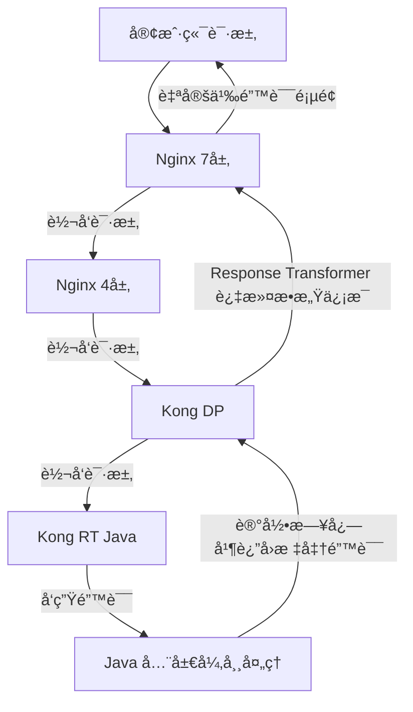
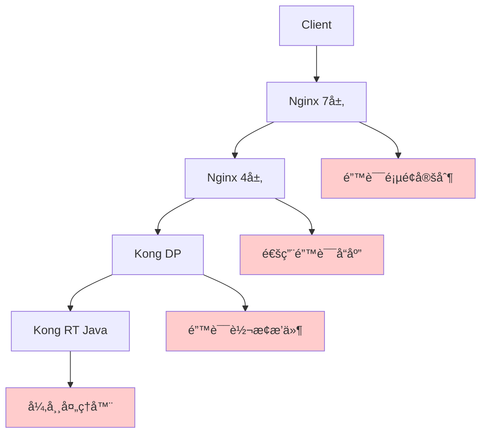

https://cwe.mitre.org/data/definitions/550.html

针对 CWE-550: Information Exposure Through Server Error Message（æœåŠ¡ç«¯é”™è¯¯ä¿¡æ¯æ³„露）æ¼æ´ï¼Œæˆ‘的链路是：

```
Client --> Nginx(7层) --> Nginx(4层) --> Kong DP --> Kong RT(Java)
```

这个æ¼æ´çš„核心问题在äºï¼š**内部错误信æ¯ï¼ˆå¦‚ stacktraceã€exception messageã€server signature 等）被返å›ç»™å®¢æˆ·ç«¯**，å¯èƒ½æ³„露æ•æ„Ÿå®ç°ç»†èŠ‚，攻击者å¯ä»¥å€Ÿæ­¤å‘起进一步攻击（如路径æ¢æµ‹ã€å‘½ä»¤æ³¨å…¥ã€æ•æ„Ÿæ¥å£è°ƒç”¨ç­‰ï¼‰ã€‚

---

## **一ã€å¸¸è§æ³„露点**

|**层级**|**泄露内容示例**|
|---|---|
|Java 应用（Kong RT）|NullPointerException, SQLException, StackTrace, Java 类路径等|
|Kong DP|Upstream è¿æ¥å¤±è´¥åŸå§‹è¿”å›ï¼Œä¾‹å¦‚ "An unexpected error occurred"|
|Nginx|默认的 500, 502, 504 等错误页é¢ä¸­å«æœ‰ nginx/1.x.x 等版本信æ¯|
|å“应头|Server: nginx, X-Powered-By: Java/1.8, Via, X-Kong-* 等头信æ¯|

---

## **二ã€ä¿®å¤å»ºè®®ï¼ˆé€å±‚）**

  

### **1.** 

### **Java 应用（Kong RT）**

  

ç¡®ä¿åº”用ä¸ä¼šåœ¨è¿”å›å“应时暴露错误细节：

```
// ä¸åº”该直æ¥è¿”å›å¼‚常信æ¯ç»™ç”¨æˆ·
try {
    // logic
} catch (Exception e) {
    logger.error("Internal error", e); // log it
    response.sendError(500, "Internal Server Error"); // or return sanitized JSON
}
```

✅ 建议统一使用全局异常处ç†å™¨ï¼ˆå¦‚ Spring çš„ @ControllerAdvice）拦截异常并返å›ç»Ÿä¸€æ ¼å¼ï¼š

```
@RestControllerAdvice
public class GlobalExceptionHandler {
    @ExceptionHandler(Exception.class)
    public ResponseEntity<?> handleAllExceptions(Exception ex) {
        // ä¸æš´éœ² ex.getMessage() 到外部
        return ResponseEntity.status(500).body(Map.of("error", "Internal Server Error"));
    }
}
```

---

### **2.** 

### **Kong Gateway (DP 和 RT)**

  

#### **a. å±è”½ Kong å“应头：**

  

在 kong.conf 中é…置：

```
headers = off
```

或者在 GKE/K8S 中通过ç¯å¢ƒå˜é‡ä¼ å…¥ï¼š

```
env:
  - name: KONG_HEADERS
    value: "off"
```

#### **b. 自定义错误å“应：**

  

使用æ’件如 [response-transformer](https://docs.konghq.com/hub/kong-inc/response-transformer/) 或 [custom plugin]，对 500 错误进行拦截和内容替æ¢ã€‚

---

### **3.** 

### **Nginx 层（7层和4层）**

  

#### **a. 关闭版本å·æ³„露**

```
server_tokens off;  # ç¦æ­¢åœ¨ header 中显示 nginx/x.x.x
```

#### **b. 自定义错误页é¢ï¼ˆé¿å…显示默认500/502/504页é¢å†…容）**

```
error_page 500 502 503 504 /custom_50x.html;

location = /custom_50x.html {
    root /etc/nginx/html;
    internal;
}
```

#### **c. 移除 Server header（如æœé»˜è®¤é…置没移除）**

```
proxy_hide_header Server;
more_clear_headers Server;
```

> âš ï¸ more_clear_headers 需è¦é…åˆ headers-more 模å—，Kong 自带支æŒã€‚

---

### **4.** 

### **é¢å¤–建议：Cloud Armor / WAF**

  

如æœä½ ä½¿ç”¨ GCP，å¯ä»¥åœ¨å‰ç½®åŠ  Cloud Armor，检测并阻断扫æ/æ¢æµ‹ç±»è¯·æ±‚，并统一å“应结æ„，防止过度暴露内部结æ„：

```
rules:
  - action: deny(403)
    expression: "request.path.matches('/admin/.*') || origin.region_code != 'JP'"
```

---

## **三ã€ç¤ºæ„ä¿®å¤æµç¨‹å›¾ï¼ˆMermaid）**

```mermaid
flowchart TD
    Client --> Nginx7
    Nginx7 --> Nginx4
    Nginx4 --> KongDP
    KongDP --> KongRT

    subgraph ä¿®å¤æªæ–½
        A[关闭 Nginx server_tokens]
        B[设置 error_page 自定义 500 错误å“应]
        C[Java 端统一异常处ç†ï¼ˆä¸æš´éœ²å¼‚常信æ¯ï¼‰]
        D[Kong 关闭 header å’Œ response debug ä¿¡æ¯]
        E[设置 Cloud Armor 或 Lua æ’件拦截异常]
    end
```

---

## **å››ã€æ£€æŸ¥æ¸…å•**

|**检查项**|**已处ç†**|**说æ˜**|
|---|---|---|
|Java 应用是å¦ç»Ÿä¸€å¤„ç†å¼‚常|✅ / â›”|ä¸è¿”å› stacktrace ç­‰|
|Kong 是å¦å…³é—­ X-Kong-* header|✅ / â›”|KONG_HEADERS=off|
|Nginx 是å¦å…³é—­ server_tokens|✅ / â›”|server_tokens off;|
|是å¦ä½¿ç”¨ error_page 自定义错误页é¢|✅ / â›”|防止暴露默认500页é¢|
|是å¦ç§»é™¤å“应头 Server/X-Powered-By|✅ / â›”|more_clear_headers Server|
|是å¦éƒ¨ç½² Cloud Armor WAF|✅ / â›”|å¯ä½œä¸ºé˜²å¾¡åŠ å±‚|

---

如æœä½ èƒ½æ供示例å“应头或å®é™…错误信æ¯ï¼Œæˆ‘å¯ä»¥å¸®ä½ è¿›ä¸€æ­¥åˆ¤æ–­æ³„露点。是å¦éœ€è¦æˆ‘帮你写一段 Lua æ’ä»¶ç¤ºä¾‹ï¼Œç”¨äº Kong DP 拦截错误å“应内容？


针对 CWE-550: ä¿¡æ¯æ³„露（Internal Server Error） æ¼æ´ï¼Œåœ¨ä½ å½“å‰çš„æ¶æ„中：

```
Client --> Nginx (L7统一入å£) --> Nginx (L4) --> Kong DP --> Kong RT (Java 应用)
```

且你在 Nginx L7 层是åšç»Ÿä¸€å…¥å£ï¼Œæ ¹æ® api_name åŒ¹é… location å† proxy_pass。

---

## **✅** 

## **最佳修å¤ç€æ‰‹ç‚¹ä¼˜å…ˆçº§å»ºè®®ï¼ˆä»å¤–往内防护åŸåˆ™ï¼‰**

|**优先级**|**层级**|**åŸå› **|**说æ˜**|
|---|---|---|---|
|â­ï¸â­ï¸â­ï¸ 第一优先|**Nginx L7（统一入å£ï¼‰**|外层是最é è¿‘用户，最容易拦截/改写泄露内容|- å±è”½ç‰ˆæœ¬ä¿¡æ¯- 自定义错误å“应- 移除 Server 头部- 对下游 500/502 等错误包进行统一处ç†|
|â­ï¸â­ï¸ 第二优先|**Kong DP**|默认会带 X-Kong-* header，部分æ’件å¯èƒ½è¿”å› debug 内容|- 设置 headers = off- 使用 Lua æ’件统一处ç†é”™è¯¯å“应（å¯è„±æ•ï¼‰|
|â­ï¸â­ï¸ 第二优先|**Kong RT (Java 应用)**|如æœé€»è¾‘层直æ¥æŠ›å‡ºå¼‚常，任何ä¿æŠ¤éƒ½å¯èƒ½å¤±æ•ˆ|- 使用 @ControllerAdvice 或统一异常拦截器- ç¦æ­¢æŠŠå¼‚常信æ¯è¿”å›ç»™å®¢æˆ·ç«¯|
|â­ï¸ 第三优先|**Nginx L4**|无逻辑能力，作用主è¦åœ¨ç½‘络层|- 无需处ç†ï¼Œä»…作为é€æ˜å±‚转å‘å³å¯|

---

## **🛠 æ¨èä¿®å¤é¡ºåºå’Œé…置建议**

  

### **第一步：Nginx L7**

  

#### **1. å±è”½ç‰ˆæœ¬å·å’Œ** 

#### **Server**

####  **å“应头**

```
server_tokens off;

proxy_hide_header Server;
more_clear_headers Server;  # 如æœæ”¯æŒ headers-more 模å—
```

#### **2. 自定义错误å“应页é¢ï¼Œé¿å…默认 502/504 输出泄露 Kong/Nginx 内部状æ€**

```
error_page 500 502 503 504 /custom_50x.html;

location = /custom_50x.html {
    root /etc/nginx/html;
    internal;
}
```

#### **3. 统一 proxy_pass 并éšè— Kong è¿”å›é”™è¯¯çš„ detail（如 StackTrace）**

```
location ~ ^/api/(?<api_name>[^/]+)/ {
    proxy_pass http://backend_$api_name;
    
    # é™åˆ¶ header 泄露
    proxy_hide_header X-Kong-Error-Code;
    proxy_hide_header X-Kong-Response-Latency;
    proxy_intercept_errors on;
}
```

---

### **第二步：Kong DP**

  

#### **1. é…ç½®éšè—å“应头**

  

在 kong.conf 或ç¯å¢ƒå˜é‡ä¸­è®¾ç½®ï¼š

```
headers = off
```

#### **2. å¯é€‰ï¼šå†™ä¸€ä¸ªç®€æ˜“ Lua æ’件统一处ç†é”™è¯¯å“应**

```
-- handler.lua
local BasePlugin = require "kong.plugins.base_plugin"
local handler = BasePlugin:extend()

function handler:access(conf)
  handler.super.access(self)
end

function handler:header_filter(conf)
  handler.super.header_filter(self)

  if ngx.status >= 500 then
    ngx.header["Content-Type"] = "application/json"
    ngx.header["X-Custom-Error"] = "internal_error"
    ngx.header["X-Kong-Error-Code"] = nil
    ngx.header["X-Kong-Response-Latency"] = nil
    ngx.header["Server"] = nil
    ngx.arg[1] = '{"error":"Internal Server Error"}'
  end
end

return handler
```

---

### **第三步：Java 应用（Kong RT）**

  

ç¡®ä¿ä½ ä½¿ç”¨å…¨å±€å¼‚常处ç†å™¨ï¼Œä¸å‘客户端返å›ä»»ä½•å†…部堆栈信æ¯ï¼š

```
@RestControllerAdvice
public class GlobalExceptionHandler {
    @ExceptionHandler(Exception.class)
    public ResponseEntity<Map<String, String>> handle(Exception e) {
        // logging å¯ä¿ç•™å †æ ˆæ—¥å¿—
        log.error("Unhandled exception", e);
        return ResponseEntity.status(500).body(Map.of("error", "Internal Server Error"));
    }
}
```

---

## **🔠最终建议æµç¨‹å›¾**

```
graph TD;
    A[Client] --> B[Nginx L7 统一入å£];
    B --> C[Nginx L4];
    C --> D[Kong DP];
    D --> E[Kong RT - Java];

    subgraph 安全处ç†å»ºè®®
        B1[server_tokens off]
        B2[proxy_hide_header]
        B3[error_page 500 自定义]
        D1[KONG_HEADERS=off]
        D2[Lua æ’件脱æ•é”™è¯¯ä¿¡æ¯]
        E1[全局异常处ç†å™¨ @ControllerAdvice]
    end

    B -->|处ç†| B1 & B2 & B3
    D -->|é…ç½®| D1 & D2
    E -->|代ç | E1
```

---

## **✅ 总结**

  

> **æœ€ä½³èµ·ç‚¹ï¼šä» Nginx L7 ç€æ‰‹**。它是对用户å“应的第一é“防线，é…置简å•ã€æ•ˆæœç›´æ¥ã€‚

  

然å：

- æ§åˆ¶ Kong çš„ headers å’Œæ’件行为；
    
- 最åç¡®ä¿ Java 应用ä¸è¾“出内部细节；
    
- 所有 500 系列错误都统一å“应 "Internal Server Error"。
    

  

需è¦æˆ‘帮你生æˆå®Œæ•´çš„ Nginx é…置模æ¿æˆ– Lua æ’件 demo å—？


以下是一个针对你æ¶æ„场景（Nginx L7 作为统一入å£ï¼Œå端为 Nginx4ã€Kong DPã€Kong RT）的安全强化 **Nginx é…置模æ¿**，å¯æœ‰æ•ˆç¼“解 CWE-550 等信æ¯æ³„露é£é™©ï¼š

---

```
# nginx.conf 示例片段（æ¨è作为 L7 å±‚ç»Ÿä¸€å…¥å£ Nginx 使用）

server {
    listen 443 ssl http2;
    server_name api.example.com;

    ssl_certificate     /etc/nginx/ssl/fullchain.pem;
    ssl_certificate_key /etc/nginx/ssl/privkey.pem;

    # ✅ 安全æ¨è：éšè— Nginx 自身版本
    server_tokens off;

    # ✅ 设置åˆç†çš„è¿”å›å¤´éƒ¨ï¼Œé¿å…暴露å端æœåŠ¡ä¿¡æ¯
    proxy_hide_header Server;
    proxy_hide_header X-Kong-Error-Code;
    proxy_hide_header X-Kong-Response-Latency;

    # 如æœå¯ç”¨äº† headers-more 模å—（建议开å¯ï¼‰
    more_clear_headers Server;
    more_clear_headers X-Powered-By;
    more_clear_headers X-Kong-Error-Code;
    more_clear_headers X-Kong-Response-Latency;

    # ✅ é¿å…ç›´æ¥æ˜¾ç¤ºå端 5xx 错误
    proxy_intercept_errors on;

    # ✅ 自定义错误页é¢ï¼ˆå¯ä»¥ç®€å•è¿”å› JSON，也å¯ä»¥è¿”å› HTML）
    error_page 500 502 503 504 /custom_50x.html;

    location = /custom_50x.html {
        internal;
        default_type application/json;
        return 500 '{"error":"Internal Server Error"}';
    }

    # ✅ 动æ€åŒ¹é…è·¯å¾„ï¼ŒåŸºäº api_name åš proxy_pass
    location ~ ^/api/(?<api_name>[a-zA-Z0-9_-]+)/ {
        # å‡è®¾å端有多个 service å¯åŠ¨æ€åŒ¹é…，也å¯å†™æˆä¸€ä¸ªç»Ÿä¸€çš„ upstream
        proxy_pass http://kong_upstream$request_uri;

        # æ¨è设置
        proxy_set_header Host $host;
        proxy_set_header X-Real-IP $remote_addr;
        proxy_set_header X-Forwarded-For $proxy_add_x_forwarded_for;
        proxy_set_header X-Forwarded-Proto $scheme;

        proxy_http_version 1.1;
        proxy_connect_timeout 5s;
        proxy_read_timeout 10s;

        # éšè— Kong è¿”å›çš„ debug header
        proxy_hide_header X-Kong-Upstream-Latency;
        proxy_hide_header X-Kong-Proxy-Latency;
        proxy_hide_header Via;
    }

    # å¯é€‰ï¼šæ‹¦æˆªå…¶ä»–未匹é…路径
    location / {
        return 404 '{"error":"Not Found"}';
        default_type application/json;
    }
}
```

---

## **✅ é…置说æ˜**

|**项目**|**说æ˜**|
|---|---|
|server_tokens off|éšè— Nginx 自身版本å·|
|proxy_hide_header|å±è”½å端传æ¥çš„ Serverã€X-Kong-* 等泄露头部|
|error_page + return JSON|自定义错误内容，防止å端异常内容直æ¥æš´éœ²|
|proxy_intercept_errors|使得自定义 error_page 生效|
|location ~ /api/...|动æ€åŒ¹é… API å，支æŒçµæ´»æ‰©å±•|
|default_type application/json|统一输出 JSON 错误信æ¯|

---

## **â›³ï¸ æ¸©é¦¨æ示**

- 如æœä½ æ²¡æœ‰ headers-more 模å—支æŒï¼Œå¯ä»¥åˆ é™¤ more_clear_headers 部分，但æ¨è使用带该模å—çš„æ„建。
    
- proxy_pass 之åä¸å»ºè®®ä½¿ç”¨ $1 è¿™ç§æ‹¼æ¥åŠ¨æ€å˜é‡å»æ‹¼å端地å€ï¼Œæ¨è统一的 kong_upstream å称由 upstream æ¥åšæœåŠ¡è§£æ（更稳定å¯æ§ï¼‰ã€‚
    

---

需è¦æˆ‘帮你生æˆå¯¹åº”çš„ upstream é…ç½®æˆ–åŸºäº api_name 的动æ€è·¯ç”±ç¤ºä¾‹ä¹Ÿå¯ä»¥å‘Šè¯‰æˆ‘。


# Grok
# CWE-550: æœåŠ¡ç«¯é”™è¯¯ä¿¡æ¯æ³„露修å¤æ–¹æ¡ˆ

针对 CWE-550 æ¼æ´ï¼ˆInformation Exposure Through Server Error Message），您的链路为 `Client --> Nginx(7层) --> Nginx(4层) --> Kong DP --> Kong RT(Java)`，以下是修å¤è¯¥æ¼æ´çš„最佳å®è·µæ–¹æ¡ˆã€‚我将ä»é—®é¢˜æ ¸å¿ƒå…¥æ‰‹ï¼Œåˆ†æ如何防止内部错误信æ¯ï¼ˆå¦‚ stacktraceã€exception messageã€server signature 等）泄露给客户端，并æ供详细的步骤和é…置示例。

## 问题核心分æ

CWE-550 æ¼æ´çš„关键在äºæœåŠ¡ç«¯åœ¨å‘生错误时返å›äº†è¯¦ç»†çš„错误信æ¯ï¼Œè¿™äº›ä¿¡æ¯å¯èƒ½åŒ…å«æ•æ„Ÿçš„å®ç°ç»†èŠ‚（如代ç è·¯å¾„ã€å †æ ˆè·Ÿè¸ªã€æœåŠ¡å™¨ç‰ˆæœ¬ç­‰ï¼‰ã€‚攻击者å¯ä»¥åˆ©ç”¨è¿™äº›ä¿¡æ¯è¿›è¡Œè¿›ä¸€æ­¥æ”»å‡»ï¼Œä¾‹å¦‚路径éå†ã€å‘½ä»¤æ³¨å…¥æˆ–针对特定版本的æ¼æ´åˆ©ç”¨ã€‚

在您的链路中，错误信æ¯å¯èƒ½åœ¨ä»¥ä¸‹ç¯èŠ‚泄露：
1. **å端 Kong RT (Java)**：Java 应用程åºå¯èƒ½åœ¨å¼‚常时返å›è¯¦ç»†çš„ stacktrace。
2. **Kong DP (Data Plane)**：Kong 网关å¯èƒ½æœªå¯¹å端返å›çš„错误信æ¯è¿›è¡Œè¿‡æ»¤ã€‚
3. **Nginx (4层/7层)**：Nginx å¯èƒ½ç›´æ¥è½¬å‘错误信æ¯æˆ–自身产生带有æœåŠ¡å™¨ç­¾å的错误页é¢ã€‚

ä¿®å¤ç›®æ ‡æ˜¯ç¡®ä¿åœ¨æ•´ä¸ªé“¾è·¯ä¸Šï¼Œé”™è¯¯ä¿¡æ¯è¢«è§„范化，æ•æ„Ÿä¿¡æ¯è¢«éšè—或替æ¢ä¸ºé€šç”¨çš„错误æ示。

---

## ä¿®å¤æ–¹æ¡ˆä¸æœ€ä½³å®è·µ

### 1. ä»å端 (Kong RT - Java) 入手：规范化错误å“应
Java 应用程åºæ˜¯é”™è¯¯ä¿¡æ¯çš„æºå¤´ï¼Œé¦–先需è¦ç¡®ä¿å端ä¸ä¼šå°†è¯¦ç»†çš„ stacktrace 或异常信æ¯è¿”å›ç»™å®¢æˆ·ç«¯ã€‚

#### 步骤：
- **全局异常处ç†**：在 Java 应用中å®ç°å…¨å±€å¼‚常处ç†å™¨ï¼Œæ•è·æ‰€æœ‰æœªå¤„ç†çš„异常，并返å›æ ‡å‡†åŒ–的错误å“应。
- **ç¦ç”¨è¯¦ç»†é”™è¯¯ä¿¡æ¯**：确ä¿åœ¨ç”Ÿäº§ç¯å¢ƒä¸­ç¦ç”¨è°ƒè¯•æ¨¡å¼ï¼Œé¿å…è¿”å› stacktrace。
- **日志分离**：将详细错误信æ¯è®°å½•åˆ°æœåŠ¡å™¨æ—¥å¿—中，而ä¸æ˜¯è¿”å›ç»™å®¢æˆ·ç«¯ã€‚

#### ç¤ºä¾‹ä»£ç  (Spring Boot)：
```java
import org.springframework.http.HttpStatus;
import org.springframework.http.ResponseEntity;
import org.springframework.web.bind.annotation.ControllerAdvice;
import org.springframework.web.bind.annotation.ExceptionHandler;
import org.springframework.web.context.request.WebRequest;

@ControllerAdvice
public class GlobalExceptionHandler {

    @ExceptionHandler(Exception.class)
    public ResponseEntity<?> handleGlobalException(Exception ex, WebRequest request) {
        // 记录详细错误信æ¯åˆ°æ—¥å¿—
        log.error("Internal Server Error: ", ex);
      
        // è¿”å›æ ‡å‡†åŒ–错误å“应
        return new ResponseEntity<>("Internal Server Error. Please contact support.", HttpStatus.INTERNAL_SERVER_ERROR);
    }
}
```

#### é…置生产ç¯å¢ƒï¼š
在 `application.properties` 中ç¦ç”¨è¯¦ç»†é”™è¯¯ä¿¡æ¯ï¼š
```properties
server.error.include-stacktrace=never
server.error.include-exception=false
server.error.include-message=never
```

---

### 2. 在 Kong DP (Data Plane) é…置错误处ç†æ’件
Kong 作为 API 网关，å¯ä»¥é€šè¿‡æ’件对å端返å›çš„错误信æ¯è¿›è¡Œè¿‡æ»¤å’Œè§„范化，确ä¿æ•æ„Ÿä¿¡æ¯ä¸ä¼šä¼ é€’到客户端。

#### 步骤：
- 使用 Kong çš„ **Response Transformer** æ’件或自定义æ’件，检查å“应内容是å¦åŒ…å«æ•æ„Ÿä¿¡æ¯ï¼ˆå¦‚ "stacktrace"ã€"exception" 等关键字），并替æ¢ä¸ºé€šç”¨é”™è¯¯ä¿¡æ¯ã€‚
- é…ç½® Kong çš„ **Error Handling** 策略，返å›æ ‡å‡†åŒ–的错误å“应。

#### 示例：é…ç½® Response Transformer æ’件
```yaml
plugins:
  - name: response-transformer
    config:
      remove:
        headers:
          - Server
          - X-Powered-By
      add:
        headers:
          - "X-Error-Message: Internal Server Error"
      replace:
        body:
          - search: "stacktrace"
            replace: "Error occurred. Contact support."
```

#### é…置说æ˜ï¼š
- 移除å¯èƒ½æ³„露æœåŠ¡å™¨ä¿¡æ¯çš„头（如 `Server`ã€`X-Powered-By`）。
- 检查å“应体中是å¦åŒ…å«æ•æ„Ÿä¿¡æ¯ï¼Œå¹¶æ›¿æ¢ä¸ºé€šç”¨é”™è¯¯ä¿¡æ¯ã€‚

---

### 3. 在 Nginx (7层) é…置错误页é¢
Nginx 作为åå‘代ç†ï¼Œå¯ä»¥æ‹¦æˆªå端返å›çš„错误å“应，并返å›è‡ªå®šä¹‰çš„错误页é¢ï¼Œé¿å…泄露æ•æ„Ÿä¿¡æ¯ã€‚

#### 步骤：
- é…置自定义错误页é¢ï¼Œè¦†ç›–默认的错误å“应。
- ç¦ç”¨ Nginx 默认的æœåŠ¡å™¨ç­¾å。

#### 示例é…置：
```nginx
http {
    server_tokens off; # ç¦ç”¨æœåŠ¡å™¨ç­¾å，éšè— Nginx 版本信æ¯

    server {
        listen 80;
        server_name example.com;

        # 自定义错误页é¢
        error_page 500 502 503 504 /custom_error.html;
        location = /custom_error.html {
            root /var/www/html;
            internal;
        }

        # 代ç†è®¾ç½®ï¼Œç¡®ä¿ä¸ç›´æ¥é€ä¼ é”™è¯¯ä¿¡æ¯
        proxy_intercept_errors on;
        proxy_pass http://kong_dp;
    }
}
```

#### è‡ªå®šä¹‰é”™è¯¯é¡µé¢ (`/var/www/html/custom_error.html`)：
```html
<!DOCTYPE html>
<html>
<head>
    <title>Internal Server Error</title>
</head>
<body>
    <h1>500 - Internal Server Error</h1>
    <p>An error occurred. Please contact support for assistance.</p>
</body>
</html>
```

---

### 4. 在 Nginx (4层) é…ç½® TCP 错误处ç†
å¦‚æœ 4 层 Nginx 仅作为 TCP 代ç†ï¼Œé”™è¯¯ä¿¡æ¯é€šå¸¸ç”±ä¸Šå±‚处ç†ã€‚但为确ä¿å®‰å…¨ï¼Œå¯ä»¥é™åˆ¶å…¶æš´éœ²çš„ä¿¡æ¯ã€‚

#### 步骤：
- ç¡®ä¿ 4 层 Nginx ä¸è¿”å›ä»»ä½•è‡ªå®šä¹‰é”™è¯¯ä¿¡æ¯ï¼Œç›´æ¥è½¬å‘到 7 层。
- 如æœä½¿ç”¨ `stream` 模å—，ç¦ç”¨è¯¦ç»†æ—¥å¿—或错误信æ¯è¾“出。

#### 示例é…置：
```nginx
stream {
    server {
        listen 443;
        proxy_pass kong_dp:443;
        proxy_timeout 10s;
        proxy_connect_timeout 5s;
    }
}
```

---

### 5. 全局检查ä¸æµ‹è¯•
在整个链路上é…置完æˆå，进行以下检查：
- 使用工具（如 `curl`ï¼‰æ¨¡æ‹Ÿè¯·æ±‚ï¼Œè§¦å‘ 500 错误，检查返å›å†…容是å¦åŒ…å«æ•æ„Ÿä¿¡æ¯ã€‚
- 扫æå“应头，确认 `Server`ã€`X-Powered-By` 等头已被移除。
- 审查æœåŠ¡å™¨æ—¥å¿—，确ä¿è¯¦ç»†é”™è¯¯ä¿¡æ¯è¢«è®°å½•ï¼Œè€Œéè¿”å›ç»™å®¢æˆ·ç«¯ã€‚

#### 示例：测试命令
```bash
curl -X GET http://example.com/invalid_endpoint -v
```

检查输出中是å¦åŒ…å« stacktrace 或æœåŠ¡å™¨ç‰ˆæœ¬ä¿¡æ¯ã€‚

---

## æµç¨‹å›¾ï¼šé”™è¯¯ä¿¡æ¯å¤„ç†æµç¨‹



---

## 总结ä¸å»ºè®®

ä¿®å¤ CWE-550 æ¼æ´çš„核心在äº**多层防御**，ä»æºå¤´ï¼ˆJava 应用）到中间层（Kongã€Nginx）é€å±‚过滤和规范化错误信æ¯ã€‚以下是优先级建议：
1. **优先修å¤å端 (Java)**：确ä¿æºå¤´ä¸æ³„露详细信æ¯ã€‚
2. **é…ç½® Kong æ’件**：通过网关过滤æ•æ„Ÿä¿¡æ¯ã€‚
3. **优化 Nginx é…ç½®**：自定义错误页é¢å¹¶ç¦ç”¨æœåŠ¡å™¨ç­¾å。
4. **定期测试**：使用自动化工具（如 OWASP ZAP）扫æ API å“应，检查是å¦ä»æœ‰ä¿¡æ¯æ³„露。

如æœæ‚¨æœ‰å…·ä½“çš„ç¯å¢ƒé…置或é‡åˆ°é—®é¢˜ï¼Œå¯ä»¥è¿›ä¸€æ­¥æ供细节，我会针对性æ供更详细的指导。


#  Claude
针对CWE-550æ¼æ´ï¼Œéœ€è¦åœ¨æ•´ä¸ªé“¾è·¯çš„æ¯ä¸€å±‚都å®æ–½é”™è¯¯ä¿¡æ¯è¿‡æ»¤ã€‚以下是最佳å®è·µæ–¹æ¡ˆï¼š

## ä¿®å¤ç­–略概览



## 1. Kong RT (Java) - æºå¤´æ§åˆ¶

### 全局异常处ç†å™¨

```java
@RestControllerAdvice
public class GlobalExceptionHandler {
    
    private static final Logger logger = LoggerFactory.getLogger(GlobalExceptionHandler.class);
    
    @ExceptionHandler(Exception.class)
    public ResponseEntity<ErrorResponse> handleGenericException(Exception ex, HttpServletRequest request) {
        // 记录详细错误信æ¯åˆ°æ—¥å¿—
        logger.error("Unhandled exception for request: {}", request.getRequestURI(), ex);
        
        // è¿”å›é€šç”¨é”™è¯¯ä¿¡æ¯
        ErrorResponse error = ErrorResponse.builder()
            .code("INTERNAL_ERROR")
            .message("An internal error occurred")
            .timestamp(Instant.now())
            .build();
            
        return ResponseEntity.status(HttpStatus.INTERNAL_SERVER_ERROR).body(error);
    }
    
    @ExceptionHandler(ValidationException.class)
    public ResponseEntity<ErrorResponse> handleValidationException(ValidationException ex) {
        ErrorResponse error = ErrorResponse.builder()
            .code("VALIDATION_ERROR")
            .message("Invalid request parameters")
            .timestamp(Instant.now())
            .build();
            
        return ResponseEntity.status(HttpStatus.BAD_REQUEST).body(error);
    }
}
```

### é…ç½®Spring Boot错误处ç†

```yaml
# application.yml
server:
  error:
    include-stacktrace: never
    include-message: never
    include-binding-errors: never
    include-exception: false
    
logging:
  level:
    org.springframework.web: ERROR
    org.springframework.security: ERROR
```

## 2. Kong DP - 网关层过滤

### 错误转æ¢æ’件é…ç½®

```lua
-- kong/plugins/error-transformer/handler.lua
local ErrorTransformerHandler = {}

function ErrorTransformerHandler:access(conf)
    -- 在access阶段ä¸åšå¤„ç†
end

function ErrorTransformerHandler:header_filter(conf)
    local status = kong.response.get_status()
    
    if status >= 400 then
        -- 清除å¯èƒ½æ³„露信æ¯çš„头部
        kong.response.clear_header("Server")
        kong.response.clear_header("X-Powered-By")
        kong.response.clear_header("X-Runtime")
    end
end

function ErrorTransformerHandler:body_filter(conf)
    local status = kong.response.get_status()
    
    if status >= 500 then
        -- 替æ¢5xx错误的å“应体
        local generic_error = {
            error = {
                code = "INTERNAL_ERROR",
                message = "An internal error occurred"
            }
        }
        
        kong.response.set_header("Content-Type", "application/json")
        local body = cjson.encode(generic_error)
        kong.response.set_raw_body(body)
    end
end

return ErrorTransformerHandler
```

### Kongé…ç½®

```yaml
# kong.yml
plugins:
  - name: error-transformer
    config:
      hide_server_errors: true
      custom_error_messages:
        500: "Internal server error"
        502: "Bad gateway"
        503: "Service unavailable"
        504: "Gateway timeout"
```

## 3. Nginx 4层 - 传输层处ç†

```nginx
# nginx-l4.conf
stream {
    map $status $generic_error {
        ~^5 "HTTP/1.1 500 Internal Server Error\r\nContent-Type: application/json\r\n\r\n{\"error\":\"Internal server error\"}";
        default "";
    }
    
    upstream kong_upstream {
        server kong-dp:8000;
        keepalive 32;
    }
    
    server {
        listen 80;
        proxy_pass kong_upstream;
        proxy_timeout 30s;
        proxy_connect_timeout 5s;
        
        # 错误处ç†
        error_page 500 502 503 504 =500 @error_page;
    }
}
```

## 4. Nginx 7层 - 应用层防护

```nginx
# nginx-l7.conf
http {
    # éšè—æœåŠ¡å™¨ä¿¡æ¯
    server_tokens off;
    more_clear_headers 'Server';
    more_clear_headers 'X-Powered-By';
    
    # 自定义错误页é¢
    error_page 400 401 403 404 /4xx.json;
    error_page 500 502 503 504 /5xx.json;
    
    server {
        listen 80;
        
        location /4xx.json {
            internal;
            return 400 '{"error":{"code":"CLIENT_ERROR","message":"Bad request"}}';
            add_header Content-Type application/json;
        }
        
        location /5xx.json {
            internal;
            return 500 '{"error":{"code":"INTERNAL_ERROR","message":"Internal server error"}}';
            add_header Content-Type application/json;
        }
        
        location / {
            proxy_pass http://nginx-l4;
            proxy_set_header Host $host;
            proxy_set_header X-Real-IP $remote_addr;
            
            # 拦截错误å“应
            proxy_intercept_errors on;
            
            # éšè—上游错误
            proxy_hide_header X-Runtime;
            proxy_hide_header X-Powered-By;
        }
    }
}
```

## ä¿®å¤ä¼˜å…ˆçº§å’Œå®æ–½æ­¥éª¤

|优先级|组件|ä¿®å¤å†…容|å½±å“范围|å®æ–½éš¾åº¦|
|---|---|---|---|---|
|1|Kong RT (Java)|全局异常处ç†å™¨|所有Java应用错误|中等|
|2|Nginx 7层|错误页é¢å®šåˆ¶|所有客户端请求|简å•|
|3|Kong DP|错误转æ¢æ’件|网关层错误|中等|
|4|Nginx 4层|传输层错误处ç†|è¿æ¥å±‚错误|简å•|

## 验è¯å’Œæµ‹è¯•

### 测试脚本

```bash
#!/bin/bash
# test-error-handling.sh

echo "Testing error handling..."

# 测试å„ç§é”™è¯¯åœºæ™¯
test_cases=(
    "GET /non-existent-endpoint"
    "POST /api/invalid-data"
    "GET /api/trigger-500-error"
)

for test_case in "${test_cases[@]}"; do
    echo "Testing: $test_case"
    response=$(curl -s -w "\nStatus: %{http_code}\n" -X ${test_case%% *} "http://your-domain${test_case##* }")
    
    # 检查是å¦åŒ…å«æ•æ„Ÿä¿¡æ¯
    if echo "$response" | grep -E "(stacktrace|exception|SQLException|java\.|org\.)" > /dev/null; then
        echo "⌠FAIL: Response contains sensitive information"
        echo "$response"
    else
        echo "✅ PASS: Response is clean"
    fi
    echo "---"
done
```

## 监æ§å’Œå‘Šè­¦

```yaml
# prometheus-rules.yml
groups:
  - name: error-exposure
    rules:
      - alert: SensitiveErrorExposure
        expr: increase(nginx_http_requests_total{status=~"5.."}[5m]) > 10
        for: 2m
        annotations:
          summary: "High rate of 5xx errors detected"
          description: "Potential information exposure through server errors"
```

## 关键è¦ç‚¹

1. **分层防护**: æ¯ä¸€å±‚都è¦æœ‰é”™è¯¯å¤„ç†æœºåˆ¶
2. **æºå¤´æ§åˆ¶**: Java应用层是最é‡è¦çš„防护点
3. **统一错误格å¼**: 所有层返å›ä¸€è‡´çš„错误å“应格å¼
4. **详细日志记录**: 错误详情记录到日志而éè¿”å›ç»™å®¢æˆ·ç«¯
5. **æŒç»­ç›‘æ§**: 监æ§é”™è¯¯ç‡å’Œå“应内容

通过这个多层防护策略，å¯ä»¥æœ‰æ•ˆé˜²æ­¢CWE-550æ¼æ´ï¼Œç¡®ä¿æ•æ„Ÿä¿¡æ¯ä¸ä¼šæ³„露给客户端。