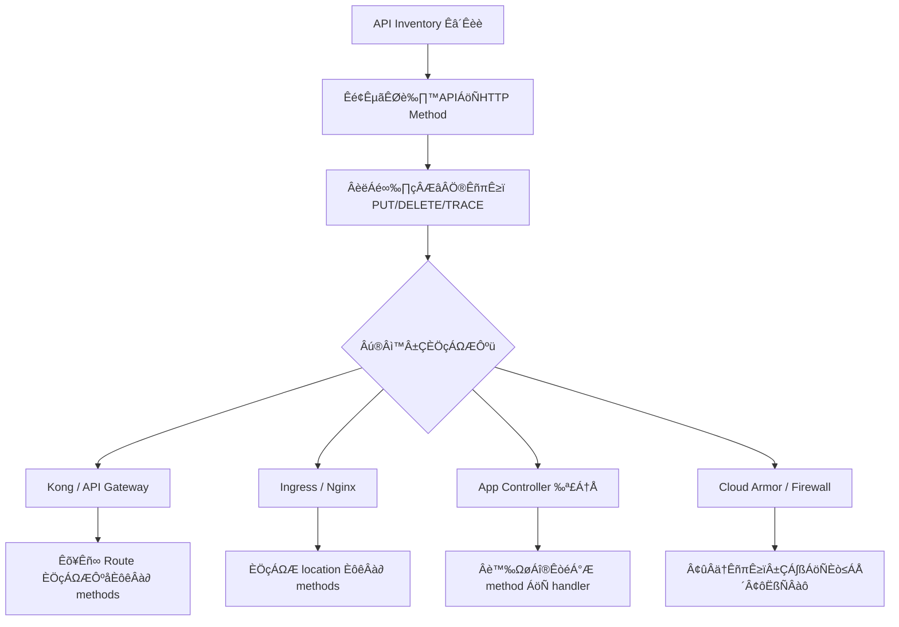

# Q

about CWE-650 . The describe

Vulnerability severity: Low

CWE ID CWE-650: Trusting HTTP

Permission Methods on the Server Side

OWASP TOP 10: API8:2023 - Security

Misconfiguration

Description: It was observed that unnecessary HTTP methods such as PUT and DELETE are allowed on the APIs.

HTTP methods are functions that a web server provides to process a request. For example, the "GET" method is used to retrieve the web page from the server.

According to RFC 2616, there are eight HTTP methods for HTTP 1.1, specifically OPTIONS, GET, HEAD, POST, PUT, DELETE, TRACE, and CONNECT, these methods are dangerous and provide an opportunity to attackers.

Impact: An attacker can use these methods to perform malicious activity on server. Using methods like PUT and DELETE an attacker can modify data/files on the server.

Recommendation: It is recommended to disable all insecure method like PUT, DELETE.

Reference :

https://cwe.mitre.org/data/definitions/

650.html

https://owasp.org/API-Security/editions/

2023/en/Oxa8-security= misconfiguration/

Please help me analyzing it . If we as a platform, how do we find and locate these problems, such as where they may appear. And how to fix this?

(1) Begin by thoroughly analyzing the provided reference links from cwe.mitre.org and owasp.org to establish a detailed understanding of CWE-650, its definition, common consequences, and its relationship with the OWASP API Security Top 10 (API8:2023). (2) Research the intended purpose of various HTTP methods (e.g., PUT, DELETE, TRACE, CONNECT, OPTIONS) and contrast their legitimate use cases with how they can be exploited by attackers when improperly enabled on a server. (3) Investigate techniques and tools for detecting CWE-650 on a platform. This should include: (a) Manual discovery methods using tools like cURL or network proxies to send OPTIONS requests to API endpoints and web pages. (b) Automated discovery using open-source and commercial vulnerability scanners that specifically check for enabled but unnecessary HTTP methods. (4) Identify the specific configuration files and settings where HTTP method restrictions are managed in common web infrastructure components, such as: (a) Web servers like Apache, Nginx, and IIS. (b) Application servers and frameworks like Tomcat, Spring Boot, or Django. (c) API Gateways and reverse proxies. (5) Compile actionable remediation guidance, including specific configuration examples and code snippets, for disabling unused HTTP methods across the technologies identified in the previous step. The goal is to enforce a principle of least privilege, allowing only the methods required for each resource. (6) Search for real-world case studies or documented security incidents where the exploitation of unnecessary HTTP methods led to a system compromise, illustrating the practical impact of this vulnerability. (7) Compare CWE-650 with related vulnerabilities, such as Cross-Site Tracing (CWE-693) which exploits the TRACE method, and other types of security misconfigurations to understand its place within the broader landscape of web security risks. (8) Synthesize the findings into a set of preventative best practices for development and operations teams, including secure configuration baselines, code review guidelines, and methods for integrating automated checks into a CI/CD pipeline to prevent this misconfiguration from being introduced.

# ChatGPT

Here’s a complete and structured analysis of **CWE-650: Trusting HTTP Permission Methods on the Server Side**, and how your **platform (e.g., API Gateway, Kubernetes-based microservice platform)** can **detect, locate, and fix** these issues.

---

## **üìå CWE-650 Overview**

| **Field**          | **Description**                                                                                                          |
| ------------------ | ------------------------------------------------------------------------------------------------------------------------ |
| **CWE ID**         | [CWE-650](https://cwe.mitre.org/data/definitions/650.html)                                                               |
| **OWASP Category** | [API8:2023 - Security Misconfiguration](https://owasp.org/API-Security/editions/2023/en/0xa8-security-misconfiguration/) |
| **Severity**       | Low (but may be elevated depending on what APIs are exposed)                                                             |
| **Issue**          | HTTP methods like PUT, DELETE, TRACE, etc., are **enabled but unused or dangerous**                                      |

---

## **🎯 Why It’s Dangerous**

Unintended or unrestricted HTTP methods can allow attackers to:

- Overwrite content or data (e.g. via PUT)
- Delete resources (DELETE)
- Launch **Cross Site Tracing (XST)** attacks (TRACE)
- Bypass protections or fuzz API behaviors with CONNECT, OPTIONS, etc.

---

## **üîç Step-by-Step Analysis & Detection**

### **1.** 

### **Identify All Publicly Exposed Endpoints**

You need to know what endpoints are accessible from outside the cluster:

```
kubectl get ingress,service -A
gcloud compute url-maps list
```

Also trace through:

```
kubectl get gateways,httproutes -A  # If you use GKE Gateway API
```

> ⚠️ Note: Ingress / Gateway can silently expose all HTTP methods if not explicitly restricted.

---

### **2.** 

### **Scan HTTP Method Permissions**

You can use tools to probe **which HTTP methods** are allowed:

```
curl -X OPTIONS https://your-api.com/resource -i
```

If the response header includes:

```
Allow: GET, POST, PUT, DELETE, OPTIONS
```

‚Üí Your API supports all these methods, whether intended or not.

üõ† You can automate this scan with tools:

- nmap --script http-methods
- Nikto
- Burp Suite (Spider > HTTP methods check)
- Custom curl/python scripts over your API inventory

---

### **3.** 

### **Locate Source of Misconfiguration**

| **Platform Layer**   | **Where to Check**                                                     |
| -------------------- | ---------------------------------------------------------------------- |
| **Nginx Ingress**    | Annotations or config maps – ensure only needed methods are passed     |
| **GKE Gateway**      | Check the HTTPRoute – define rules.matches.method                      |
| **Kong Gateway**     | Use methods in route definition to limit accepted methods              |
| **Backend Services** | Application-level controller (Spring Boot, Flask, etc.) route handlers |
| **Firewall Rules**   | WAF / Cloud Armor may allow method filtering                           |

---

## **‚úÖ How to Fix (Per Layer)**

### **🧩 1. Kong Gateway 示例修复**

```
curl -i -X PATCH http://localhost:8001/routes/<ROUTE_ID> \
  --data "methods[]=GET" \
  --data "methods[]=POST"
```

或者使用 YAML 定义：

```
plugins:
- name: route-by-method
  config:
    methods:
      - GET
      - POST
```

---

### **🧩 2. GKE Gateway API (HTTPRoute) 示例修复**

```
apiVersion: gateway.networking.k8s.io/v1beta1
kind: HTTPRoute
metadata:
  name: my-api
spec:
  rules:
    - matches:
        - path:
            type: PathPrefix
            value: /api/v1
          method: GET
        - path:
            type: PathPrefix
            value: /api/v1
          method: POST
```

---

### **🧩 3. NGINX Ingress 示例修复（使用 WAF 或内建限制）**

```
location /api/v1 {
    limit_except GET POST {
        deny all;
    }
}
```

Êàñ Ingress NGINX ‰ΩøÁî® AnnotationÔºö

```
metadata:
  annotations:
    nginx.ingress.kubernetes.io/configuration-snippet: |
      limit_except GET POST {
        deny all;
      }
```

---

### **🧩 4. 应用层（以 Spring Boot 为例）**

确保控制器只允许明确方法：

```
@RequestMapping(value="/api/data", method=RequestMethod.GET)
public ResponseEntity<Data> getData() { ... }
```

避免使用无 method 参数的 @RequestMapping，默认支持所有方法！

---

## **🛡️ 建议的防护流程**

### **Mermaid 流程图**



---

## **📋 总结与落地建议**

| **动作**                 | **建议与工具**                  |
| ------------------------ | ------------------------------- |
| API 扫描并记录 HTTP 方法 | curl, nmap, burp, nikto         |
| 限制 Gateway 层 methods  | Kong / GKE Gateway / Nginx 限制 |
| 确保应用层安全           | 检查控制器方法的定义            |
| 定期审计                 | 纳入 DevSecOps Pipeline         |
| Cloud Armor 策略（可选） | httpMethod Match 设置 WAF 防护  |

---

如需我提供针对你平台的自动化扫描脚本或特定 GKE/Kong Gateway 示例，请告知我具体使用的组件（如 Kong、GKE Gateway、Nginx Ingress 等）。我可以为你定制 YAML 模板或检测脚本。

# Gemini

# An In-Depth Analysis of CWE-650: Mitigating Risks from Unnecessary HTTP Methods Across the Technology Stack

### Executive Summary

The Common Weakness Enumeration entry CWE-650, "Trusting HTTP Permission Methods on the Server Side," represents a class of security misconfiguration that, while often assigned a low severity rating, can serve as a precursor to severe business impacts, including data modification, unauthorized access, and complete server compromise. This vulnerability is categorized under API8:2023 - Security Misconfiguration in the OWASP API Security Top 10, highlighting its prevalence and significance in modern application architectures.1 The core of this weakness lies in a server's misplaced trust in the HTTP methods used by a client. This manifests in two primary forms: the enabling of inherently dangerous and unnecessary methods such as

`PUT`, `DELETE`, `TRACE`, and `CONNECT`, and the more subtle but equally perilous implementation of "safe" methods like `GET` to perform state-changing operations.

An attacker can leverage these misconfigurations to perform malicious activities ranging from reconnaissance to remote code execution.3 For instance, an enabled

`PUT` method could allow an attacker to upload malicious scripts, while an enabled `TRACE` method could facilitate the theft of session credentials via Cross-Site Tracing (XST) attacks.4 The potential for severe impact is often underestimated because the vulnerability's exploitability is contingent on other system configurations. However, as historical vulnerabilities like CVE-2017-12615 demonstrate, a single additional misconfiguration can elevate this "low-risk" finding into a critical remote code execution threat.6

Effective mitigation requires a defense-in-depth strategy that spans the entire technology stack. This report provides an exhaustive analysis of CWE-650, detailing comprehensive methodologies for its detection and remediation. Detection strategies include manual probing with tools like `cURL` and `nmap`, as well as automated dynamic (DAST), static (SAST), and Infrastructure-as-Code (IaC) scanning. Remediation is addressed with platform-specific guidance, offering detailed configuration examples for web servers like Apache, Nginx, and IIS; application frameworks such as Tomcat, Spring, and Django; and API gateways from providers like Amazon, Azure, and Kong.

Ultimately, this report advocates for a proactive, "shift-left" approach to security. By integrating automated security testing into CI/CD pipelines and adopting a principle of least privilege for HTTP methods, organizations can prevent these misconfigurations from reaching production environments. The strategic recommendations emphasize layered controls, configuration-as-code to prevent drift, and developer empowerment to foster a culture where security is an integral component of the entire software development lifecycle.

---

## I. The Anatomy of CWE-650: Beyond Simple Permissions

Understanding CWE-650 requires moving beyond a superficial check for enabled HTTP verbs. It involves a nuanced appreciation of how server-side trust, both in the nature of HTTP methods and in the configuration of the underlying stack, creates attack vectors. This section deconstructs the vulnerability, models the associated threats, places it within the broader context of API security misconfigurations, and examines a real-world case study to illustrate the potential for catastrophic impact.

### 1.1. Defining the Weakness: A Tale of Two Flaws

CWE-650 is not a single, monolithic vulnerability but rather a category encompassing two distinct but related types of flaws. Both stem from the server incorrectly trusting the client's requested HTTP method as a proxy for its intent and authorization.

#### The Obvious Flaw: Enabled Dangerous Methods

The most commonly understood manifestation of this weakness is the enabling of HTTP methods that are powerful, often intended for diagnostics or file management, and rarely required for standard web application functionality.8 When these methods are left active, they provide attackers with direct, and often unintended, capabilities. Methods like

`PUT` and `DELETE` were designed for file management operations, and if a web server is configured to support them without stringent access controls, it can expose the file system to arbitrary modification or deletion.4 Similarly, methods like

`TRACE` and `CONNECT` were created for diagnostic and proxying purposes, respectively, but can be co-opted by attackers to steal credentials or pivot into internal networks.5 This aspect of the vulnerability is a classic security misconfiguration, often arising from default settings or a failure to implement a security hardening process.1

#### The Subtle Flaw: Misusing "Safe" Methods

The more profound and often overlooked aspect of CWE-650, as detailed in the official MITRE description, is the server's flawed assumption that certain methods, particularly `GET`, will not cause a state change on the server.10 The HTTP specification dictates that methods like

`GET` and `HEAD` should be "safe," meaning they are intended only for information retrieval and should not have side effects.10

However, this is a convention, not a technical enforcement. Developers can, and often do, build applications where a `GET` request can modify or delete data. A common anti-pattern in REST API design is to use query parameters to specify an action, such as:

`GET /api/articles/delete?id=42`

An application's access control mechanism might be configured to only scrutinize requests using `POST`, `PUT`, or `DELETE` methods, believing that `GET` requests are inherently harmless read operations. By crafting a `GET` request like the one above, an attacker can bypass these intended access restrictions and perform destructive actions.6 This highlights that CWE-650 is not just about server configuration but extends deep into application-level implementation choices. The vulnerability is the trust that the server-side code places in the

`GET` method's conventional "safeness," failing to enforce proper authorization on all state-changing operations, regardless of the HTTP verb used.10

### 1.2. The Spectrum of Risky Methods: A Threat Model

To effectively mitigate CWE-650, it is essential to understand the specific risks associated with each HTTP method. While `GET` and `POST` are the most common and generally necessary for web applications, several other methods defined in RFC 2616 present a significant attack surface if not properly managed.5

- **`PUT`**: This method is designed to upload a resource to a specific URI. If the resource already exists, it is replaced; if not, it is created.4 The primary risk is arbitrary file upload. An attacker could upload a web shell (e.g., a JSP, ASP, or PHP file) containing executable code. By subsequently requesting that file's URL, the attacker can achieve Remote Code Execution (RCE) on the server.5 Even if the server does not execute the uploaded files, an attacker could use it as a file repository for malicious content or deface the website by overwriting existing files like
    `index.html`.9
- **`DELETE`**: This method requests the removal of a resource at a given URI.4 The obvious risk is unauthorized deletion of content. An attacker could use this to delete critical files, application data, or configuration files, leading to a direct Denial of Service (DoS) or permanent data loss.8
- **`TRACE` / `TRACK`**: The `TRACE` method is a diagnostic tool that echoes the received request, including all headers, back to the client.5
    `TRACK` is a similar, Microsoft-specific variant.13 While seemingly harmless, this functionality is the cornerstone of Cross-Site Tracing (XST) attacks.14 In an XST attack, an adversary leverages a separate Cross-Site Scripting (XSS) vulnerability to cause a victim's browser to send a
    `TRACE` request to the server. The server's response, which echoes the request headers, is then accessible to the attacker's script. This can bypass the `HttpOnly` cookie protection, as the script is not reading the cookie directly from `document.cookie`, but from the body of the `TRACE` response. This can expose sensitive session cookies or `Authorization` headers, leading to session hijacking.4
- **`CONNECT`**: This method is used to establish a network tunnel, typically for handling SSL/TLS connections through an HTTP proxy.4 If a web server has this method enabled and is misconfigured, an attacker can use it as an unintended proxy. This allows the attacker to route malicious traffic through the compromised server, effectively masking their own IP address and potentially bypassing firewalls to attack systems within the target's internal network.5
- **`OPTIONS`**: This method requests information about the communication options available for a given resource, primarily by returning a list of allowed HTTP methods in the `Allow` header.4 While not directly exploitable, it provides an attacker with a clear map of the available attack surface. An
    `OPTIONS` response that lists `PUT` and `DELETE` as allowed methods immediately informs an attacker of promising avenues for further exploitation.17 Disabling
    `OPTIONS` entirely, however, is often not a viable solution. Modern web applications heavily rely on Cross-Origin Resource Sharing (CORS) for making API calls across different domains. CORS uses a mechanism called a "pre-flight request," which is an `OPTIONS` request sent by the browser to the server to check if the actual request is safe to send.1 Blocking all
    `OPTIONS` requests will break this functionality. The nuanced approach is not to block `OPTIONS`, but to ensure it responds accurately, listing only the methods that are genuinely and safely implemented for that endpoint.

The following table provides a consolidated risk profile for these methods.

**Table 1: Risk Profile of Common HTTP Methods**

| Method          | Legitimate Use Case (as per RFC 2616)                                                      | Potential for Malicious Exploitation                                                                                            | Associated Attack/Weakness                                   |
| --------------- | ------------------------------------------------------------------------------------------ | ------------------------------------------------------------------------------------------------------------------------------- | ------------------------------------------------------------ |
| **GET**         | Retrieve a representation of a resource.                                                   | Can be misused in application logic to perform state-changing actions (e.g., deletion via query parameters).                    | CWE-650 (Misused Safe Method)                                |
| **POST**        | Submit data to be processed to a resource (e.g., form submissions, creating a new entity). | Can be used for various injection attacks (SQLi, XSS) if input is not validated, but the method itself is not the weakness.     | CWE-89 (SQL Injection), CWE-79 (XSS)                         |
| **PUT**         | Create or replace a resource at a specified URI.                                           | Arbitrary file upload, leading to Remote Code Execution (RCE), website defacement, or use as a malicious file store.            | CWE-434 (Unrestricted Upload of File with Dangerous Type)    |
| **DELETE**      | Delete a resource at a specified URI.                                                      | Unauthorized deletion of files or data, leading to Denial of Service (DoS) or data integrity loss.                              | Denial of Service, Data Deletion                             |
| **HEAD**        | Retrieve only the headers of a resource, without the body.                                 | Generally considered safe, but can be used for reconnaissance or to bypass access controls that apply only to `GET` requests.   | Information Disclosure                                       |
| **OPTIONS**     | Describe the communication options for a target resource.                                  | Reconnaissance to discover enabled methods. Not directly exploitable but aids attackers. Required for CORS pre-flight requests. | Information Disclosure                                       |
| **TRACE/TRACK** | Perform a message loop-back test along the path to the target resource.                    | Credential theft (e.g., `HttpOnly` cookies, Authorization headers) via Cross-Site Tracing (XST) attacks.                        | CWE-693 (Protection Mechanism Failure), Cross-Site Tracing   |
| **CONNECT**     | Establish a tunnel to the server identified by the target resource.                        | Can turn the web server into an unintended proxy, enabling attackers to pivot into internal networks.                           | Server-Side Request Forgery (SSRF) variant, Network Pivoting |

### 1.3. Context within OWASP API Security Top 10: API8:2023 - Security Misconfiguration

The decision by the Open Worldwide Application Security Project (OWASP) to classify the enabling of unnecessary HTTP methods under **API8:2023 - Security Misconfiguration** is highly instructive. It frames the issue not as an exotic flaw but as a fundamental failure in security hardening, one of the most widespread and easily exploitable categories of vulnerabilities affecting APIs.1

Security misconfiguration can occur at any level of the API stack, from the network services and web server configuration to the application framework and custom code.1 The problem of unnecessary HTTP methods is a textbook example of this layered risk. A default installation of a web server might leave risky methods enabled, or a developer might use a web framework that, for the sake of flexibility, allows a broad range of methods by default on new API endpoints.3 Attackers are well aware of these insecure defaults and actively probe for them to map out a system's weaknesses.1

The potential business impact of such misconfigurations is rated as "severe" by OWASP.3 This assessment may seem to contradict the "Low" severity often assigned by vulnerability scanners. This disparity arises because the scanner evaluates the immediate, isolated risk, which may be low if, for example, an enabled

`PUT` method lacks the file system permissions to write anywhere dangerous. However, OWASP considers the broader context. A security misconfiguration like an enabled `PUT` method creates a latent threat. It may be dormant, but it dramatically lowers the bar for a future mistake—such as a developer accidentally changing a directory's permissions—to become a critical vulnerability. The misconfiguration creates a pathway for server compromise, account takeover, or sensitive data exposure, making the potential business impact far greater than the initial finding might suggest.3

### 1.4. Case Study - CVE-2017-12615: From Misconfiguration to Remote Code Execution

To move from the theoretical to the practical, the case of CVE-2017-12615 serves as a powerful real-world example of how CWE-650 can lead to catastrophic consequences. This vulnerability was a perfect storm of misconfiguration, an enabled dangerous method, and a subtle bypass technique.6

- **The Vulnerability:** The issue affected Apache Tomcat versions 7.0.0 through 7.0.79 running on Windows systems.7 A critical precondition for the vulnerability was that HTTP
    `PUT` requests had to be explicitly enabled. This was done by setting the `readonly` initialization parameter of the Default servlet to `false` in the `web.xml` configuration file.7 This single configuration change, intended to allow file management via HTTP, activated the vulnerability.
- **The Exploit:** An attacker could send a specially crafted `PUT` request to the server. The filename in the request was appended with a special character sequence, such as a forward slash (`/`) or other invalid characters for Windows filenames. For example, an attacker would attempt to upload a file named `shell.jsp/`. The Tomcat server's security checks would examine the filename, see the `.jsp` extension, and correctly identify it as a protected file type that should not be uploaded. However, due to the way Windows handles filenames, when Tomcat attempted to save the file to the disk, the trailing slash would be ignored, and a file named `shell.jsp` would be successfully created on the file system.6
- **The Impact:** Once the malicious JavaServer Page (JSP) file was uploaded, the attacker could simply navigate to its URL in a browser. The Tomcat server would process the request, execute the Java code embedded within the JSP file, and grant the attacker Remote Code Execution (RCE) on the server.7 This gave the attacker full control over the compromised system.
- **The Link to CWE-650:** This case study is a textbook illustration of the principles of CWE-650. The root cause was a security misconfiguration (`readonly` set to `false`) that enabled a dangerous HTTP method (`PUT`). This, combined with a flaw in how the server processed the malformed request, directly led to a critical RCE vulnerability. It underscores the argument that even if a scanner flags "HTTP `PUT` method enabled" as a low-risk finding, it represents a significant latent threat that can be activated by other, seemingly minor, configuration changes. The vulnerability is also categorized under CWE-434 (Unrestricted Upload of File with Dangerous Type), demonstrating the frequent overlap between different weakness enumerations.20 The inclusion of CVE-2017-12615 in CISA's Known Exploited Vulnerabilities Catalog further cements its real-world severity and the importance of addressing its underlying cause.7

---

## II. Detection Methodologies: Finding the Open Doors

Identifying instances of CWE-650 requires a multi-faceted approach, combining manual reconnaissance with automated analysis across different stages of the development and deployment lifecycle. Effective detection hinges on understanding which tools are best suited for finding each variant of the weakness, from overtly enabled dangerous methods to subtly misused safe ones.

### 2.1. Manual Probing and Enumeration

Manual testing is invaluable for initial reconnaissance and for verifying the findings of automated tools. It allows a security analyst to interact directly with the target API and interpret nuanced responses that an automated scanner might misclassify.

#### Using `cURL`

The command-line tool `cURL` is an essential utility for any security tester's toolkit. It provides granular control over crafting and sending HTTP requests, making it ideal for probing for CWE-650.

- **Enumerating Methods with `OPTIONS`:** The first step is often to send an `OPTIONS` request to a target endpoint to ask the server which methods it supports.
    Bash
    ```
    curl -v -X OPTIONS http://api.example.com/v1/products
    ```
    The `-v` (verbose) flag is crucial as it displays the full request and response headers. The analyst should inspect the response for an `Allow` header, which will list the supported methods.22 A response like
    `Allow: GET, HEAD, POST, OPTIONS, PUT, DELETE` immediately indicates a potential vulnerability.
- **Directly Testing Dangerous Methods:** Even if the `OPTIONS` method is disabled or provides a sanitized response, an analyst must test the dangerous methods directly. This is done by sending a request with the specific verb and observing the server's HTTP status code.
    - To test for `PUT`:
        Bash
        ```
        curl -i -X PUT -d "This is a test file." http://api.example.com/testupload.txt
        ```
        A response of `201 Created` or `204 No Content` indicates success, confirming the vulnerability.22 A
        `405 Method Not Allowed` or `403 Forbidden` response suggests the method is likely disabled.24
    - To test for `DELETE`:
        Bash
        ```
        curl -i -X DELETE http://api.example.com/testupload.txt
        ```
        A successful status code (`200 OK`, `202 Accepted`, or `204 No Content`) confirms the method is active.
- **Probing for Misused "Safe" Methods:** Detecting the more subtle variant of CWE-650 requires application-specific knowledge, but an analyst can make educated guesses based on common API patterns. This involves sending `GET` requests with parameters that imply a state-changing action.
    Bash
    ```
    curl -i "http://api.example.com/users?action=delete&id=123"
    ```
    The analyst would then need to check if user `123` was actually deleted, which may require a subsequent `GET` request for that user's resource. This type of testing is often more effective when authenticated, as many destructive actions are hidden behind an authorization wall.

#### Using `nmap`

For rapid, network-wide reconnaissance, the Network Mapper (`nmap`) tool with its Nmap Scripting Engine (NSE) is highly effective. The `http-methods` script can quickly scan a host or a range of hosts and report the methods supported by their web servers.

Bash

```
nmap -p 80,443 --script http-methods <target-ip-or-domain>
```

The output will clearly list the potentially supported methods for each discovered web service, providing a broad overview of the attack surface before a more detailed analysis with `cURL` or other tools.17

### 2.2. Automated Dynamic Analysis (DAST)

Dynamic Application Security Testing (DAST) tools are designed to find vulnerabilities in a running application by simulating external attacks.25 They operate from a "black-box" perspective, without access to the source code, making them exceptionally well-suited for discovering externally exposed HTTP methods.

- **OWASP ZAP (Zed Attack Proxy):** As a flagship OWASP project, ZAP is one of the most powerful and widely used open-source DAST tools.27 ZAP can be used in several modes:
    - **Passive Scanning:** When used as a proxy, ZAP passively observes traffic and can identify which methods are being used by the application.
    - **Spidering:** The ZAP spider crawls the application to discover URLs, and in the process, can send `OPTIONS` requests to enumerate methods.
    - **Active Scanning:** This is the most direct method. The ZAP active scanner will explicitly send requests with dangerous methods (`PUT`, `DELETE`, `TRACE`, etc.) to discovered endpoints and analyze the responses to determine if they are enabled.29
- **Nikto:** Nikto is another open-source scanner that focuses specifically on web server misconfigurations. It has a database of known issues and will check for the presence of dangerous HTTP methods as part of its standard scan.27
- **Commercial Scanners:** Enterprise-grade DAST solutions like PortSwigger's Burp Suite Professional, Invicti (Acunetix), and Veracode provide comprehensive, automated scanning that includes checks for unnecessary HTTP methods.13 These tools often have more advanced features for handling complex authentication schemes and can be integrated into CI/CD pipelines for continuous testing.

The primary strength of DAST is its ability to confirm, with high confidence, that a vulnerability is present and reachable on a running system. It directly answers the question, "Can an attacker from the outside send a `DELETE` request to my API?".34

### 2.3. Automated Static Analysis (SAST) and Configuration Review

While DAST tests the final, running application, Static Application Security Testing (SAST) and configuration scanning tools analyze the "at-rest" artifacts: source code, bytecode, and configuration files. This "white-box" approach is crucial for identifying the root cause of a vulnerability and for finding issues that DAST might miss.

- **SAST:** SAST tools are essential for detecting the "misused GET" variant of CWE-650. A DAST scanner, seeing a `GET` request, has no way of knowing if it causes a state change on the backend. A SAST tool, however, can analyze the source code and perform taint analysis. It can trace the flow of data from an incoming `GET` request (the source) to a database write or delete operation (the sink), flagging it as a potential vulnerability.35 SAST can also identify insecure framework configurations, such as a Spring Security rule that is overly permissive by default.
- **Infrastructure-as-Code (IaC) Scanning:** With the rise of DevOps, infrastructure is increasingly defined in code using tools like Terraform, CloudFormation, or Ansible. IaC scanning tools like Checkov, Kics, and Terrascan can analyze these configuration templates before they are ever deployed.37 They can detect misconfigurations such as an Apache
    `<LimitExcept>` block that fails to restrict methods or an Nginx configuration that lacks a `limit_except` directive. This is a critical "shift left" practice, as it catches the vulnerability at the earliest possible stage.38

The combination of these testing methodologies provides a comprehensive defense. DAST is the best method for confirming the external exposure of an enabled method on a deployed system. It validates what an attacker can actually see and do. In contrast, SAST and IaC scanning are superior for identifying the root cause within the source code or configuration files. DAST answers _what_ is vulnerable, while SAST answers _where_ the vulnerability is located in the code. A mature security program leverages both: using DAST to confirm the attack surface and SAST to provide developers with the exact location of the flaw for rapid and precise remediation.

A significant blind spot for many automated tools is the "misused GET" variant. A standard DAST scanner, adhering to the HTTP specification, will likely classify a `GET` request as a safe read operation, regardless of its parameters. It lacks the business logic context to understand that `GET /items/delete?id=1` is a destructive action.10 Detecting this requires either a SAST tool capable of taint analysis, an advanced DAST tool with Interactive Application Security Testing (IAST) capabilities that can monitor backend execution, or meticulous manual code review and testing. This limitation underscores the need for a defense-in-depth testing strategy that does not rely on a single type of tool.

---

## III. Platform-Specific Remediation: A Comprehensive Guide

Remediating CWE-650 requires precise, platform-aware configuration changes. A blanket recommendation to "disable unnecessary methods" is insufficient. Effective mitigation involves applying controls at multiple layers of the technology stack—from the edge API gateway down to the application framework—to create a robust defense-in-depth posture. This section provides detailed, actionable guidance and configuration examples for a wide range of common platforms.

A foundational principle for remediation is the establishment of a clear hierarchy of controls. Security measures should be implemented as far upstream, or as close to the client request, as possible. The most efficient place to block an illicit request is at the network edge, typically an API Gateway. This prevents the request from consuming any backend resources. If a gateway is not present, the web server (e.g., Apache, Nginx) serves as the next line of defense. Finally, the application framework itself provides the last, but essential, layer of protection. This layered approach ensures that a failure or misconfiguration at one level does not lead to a total compromise.

Furthermore, a critical aspect of sustainable security is managing configuration as code. Manual changes made through a GUI, such as the IIS Manager, are prone to "configuration drift," where a system's state diverges from its intended secure baseline over time.40 By defining security configurations declaratively in version-controlled files (e.g.,

`httpd.conf`, `web.config`, Terraform templates), organizations can ensure that security settings are auditable, repeatable, and consistently enforced, preventing the accidental introduction of vulnerabilities.41

### 3.1. Web Server Hardening (The First Line of Defense)

The web server is a critical control point for enforcing HTTP method policies.

#### Apache HTTP Server

Apache offers several directives for controlling HTTP methods.

- **`mod_allowmethods` (Recommended for Apache 2.3+):** This is the modern and most straightforward module for this purpose. It allows you to create a whitelist of allowed methods within a `<Directory>` or `<Location>` block. All other methods will be rejected with a `405 Method Not Allowed` status.
    Apache
    ```
    # In httpd.conf or a virtual host configuration
    <Directory "/var/www/api">
        AllowMethods GET POST HEAD
    </Directory>
    ```
    This configuration explicitly permits only `GET`, `POST`, and `HEAD` requests for the `/var/www/api` directory.43
- **`<LimitExcept>`:** For older Apache versions, the `<LimitExcept>` directive provides similar functionality. It applies the enclosed access controls to all methods _except_ those listed.
    Apache
    ```
    # In httpd.conf or.htaccess
    <Directory "/var/www/api">
        <LimitExcept GET POST HEAD>
            Require all denied
        </LimitExcept>
    </Directory>
    ```
    This denies all requests that are not `GET`, `POST`, or `HEAD`.24
- **`mod_rewrite`:** While highly flexible, using `mod_rewrite` is generally more complex and less readable for this specific task. However, it can be useful in environments where other modules are unavailable.
    Apache
    ```
    # In httpd.conf or.htaccess
    RewriteEngine On
    RewriteCond %{REQUEST_METHOD} ^(TRACE|TRACK|PUT|DELETE|CONNECT)$
    RewriteRule.* - [F]
    ```
    This rule uses a `RewriteCond` to match a list of forbidden methods and then applies the `[F]` flag to forbid the request, returning a `403 Forbidden` status.45

#### Nginx

Nginx provides a clear and efficient directive for method filtering.

- **`limit_except` (Recommended):** This is the correct and idiomatic way to restrict HTTP methods in Nginx. It limits the enclosed directives to apply to all methods _except_ those specified.
    Nginx
    ```
    # In nginx.conf within a server or location block
    location /api/ {
        limit_except GET POST HEAD {
            deny all;
        }
        # Other location-specific directives (e.g., proxy_pass)
    }
    ```
    This configuration ensures that for the `/api/` location, only `GET`, `POST`, and `HEAD` are allowed. All other methods will be met with a `403 Forbidden` response.47 While using an
    `if` statement is also possible, it is widely discouraged in the Nginx community for being less performant and prone to errors.49

#### Microsoft IIS

IIS provides both a graphical interface and configuration file-based methods for filtering requests.

- **Request Filtering via IIS Manager:** The most user-friendly method is to use the IIS Manager GUI.
    1. Select the target website or application.
    2. Double-click on the "Request Filtering" feature.
    3. Navigate to the "HTTP Verbs" tab.
    4. In the "Actions" pane, select "Deny Verb..." and add each unwanted verb (e.g., `PUT`, `DELETE`, `TRACE`) one by one.40
- **`web.config` (Recommended for Automation):** For declarative and version-controlled configuration, the `web.config` file is the preferred method. This creates a whitelist of allowed verbs and denies all others.
    XML
    ```
    <configuration>
      <system.webServer>
        <security>
          <requestFiltering>
            <verbs allowUnlisted="false">
              <clear />
              <add verb="GET" allowed="true" />
              <add verb="POST" allowed="true" />
              <add verb="HEAD" allowed="true" />
            </verbs>
          </requestFiltering>
        </security>
      </system.webServer>
    </configuration>
    ```
    The `allowUnlisted="false"` attribute is key; it establishes a "deny by default" posture. The `<clear />` element removes any inherited rules, and the subsequent `<add>` elements build the explicit allow list.16

The following table provides a comparative summary of these web server remediation techniques.

**Table 2: Comparative Remediation Techniques for Web Servers**

| Web Server             | Configuration File        | Primary Directive/Module | Example Configuration Snippet                                                                                                                                                                                       | Notes/Recommendations                                                                                                         |
| ---------------------- | ------------------------- | ------------------------ | ------------------------------------------------------------------------------------------------------------------------------------------------------------------------------------------------------------------- | ----------------------------------------------------------------------------------------------------------------------------- |
| **Apache HTTP Server** | `httpd.conf`, `.htaccess` | `mod_allowmethods`       | `<Directory "/path"><br> AllowMethods GET POST HEAD<br></Directory>`                                                                                                                                                | Recommended for Apache 2.3+. Modern, clean, and explicit.                                                                     |
|                        | `httpd.conf`, `.htaccess` | `<LimitExcept>`          | `<Directory "/path"><br> <LimitExcept GET POST><br> Require all denied<br> </LimitExcept><br></Directory>`                                                                                                          | Standard method for older Apache versions.                                                                                    |
| **Nginx**              | `nginx.conf`              | `limit_except`           | `location / {<br> limit_except GET POST {<br> deny all;<br> }<br>}`                                                                                                                                                 | The correct and most efficient method for Nginx. Avoid using `if`.                                                            |
| **Microsoft IIS**      | `web.config`              | `<requestFiltering>`     | `<security><br> <requestFiltering><br> <verbs allowUnlisted="false"><br> <clear/><br> <add verb="GET" allowed="true"/> <br> <add verb="POST" allowed="true"/> <br> </verbs><br> </requestFiltering><br></security>` | Recommended for declarative, version-controlled security. `allowUnlisted="false"` is critical for a "deny by default" stance. |

### 3.2. Application and Framework-Level Controls (Defense in Depth)

Even if the web server is hardened, it is crucial to apply controls within the application framework itself. This provides a second layer of defense and handles cases where the application logic itself might be vulnerable.

#### Apache Tomcat

Tomcat's security model is defined within the `web.xml` deployment descriptor.

- **Using `<security-constraint>` in `web.xml`:** You can define a security constraint that applies to all URLs (`/*`) and list the HTTP methods to be restricted. An empty `<auth-constraint />` tag means the constraint applies to all users, effectively denying access.
    XML
    ```
    <security-constraint>
        <web-resource-collection>
            <web-resource-name>restricted_methods</web-resource-name>
            <url-pattern>/*</url-pattern>
            <http-method>PUT</http-method>
            <http-method>DELETE</http-method>
            <http-method>OPTIONS</http-method>
            <http-method>TRACE</http-method>
        </web-resource-collection>
        <auth-constraint />
    </security-constraint>
    ```
    This configuration will cause Tomcat to return a `403 Forbidden` status for any request using the listed methods.51 For
    `TRACE`, it is also recommended to set `allowTrace="false"` on the `<Connector>` element in `server.xml` for an additional layer of protection.51

#### Spring / Spring Boot

Spring Security provides powerful, centralized mechanisms for controlling HTTP methods.

- **Using `HttpFirewall`:** For a global policy, configuring the `HttpFirewall` is an effective approach. You can define a bean that provides a `StrictHttpFirewall` instance configured with a whitelist of allowed methods.
    Java
    ```
    @Bean
    public HttpFirewall configureFirewall() {
        StrictHttpFirewall strictHttpFirewall = new StrictHttpFirewall();
        strictHttpFirewall.setAllowedHttpMethods(Arrays.asList("GET", "POST", "HEAD"));
        return strictHttpFirewall;
    }
    ```
    This ensures that any request with a method not in the list is rejected by Spring Security before it reaches the application controllers.54
- **Using Spring Interceptors:** For more granular control, a `HandlerInterceptor` can be used. This allows you to apply method restrictions to specific URL patterns.
    Java
    ```
    // Interceptor Class
    public class MethodInterceptor implements HandlerInterceptor {
        @Override
        public boolean preHandle(HttpServletRequest request, HttpServletResponse response, Object handler) throws Exception {
            String method = request.getMethod();
            if (!"GET".equals(method) &&!"POST".equals(method)) {
                response.sendError(HttpServletResponse.SC_METHOD_NOT_ALLOWED);
                return false;
            }
            return true;
        }
    }

    // Configuration Class
    @Configuration
    public class WebConfig implements WebMvcConfigurer {
        @Override
        public void addInterceptors(InterceptorRegistry registry) {
            registry.addInterceptor(new MethodInterceptor()).addPathPatterns("/api/**");
        }
    }
    ```
    This example registers an interceptor that only allows `GET` and `POST` for paths under `/api/`.55

#### Django / Django Rest Framework (DRF)

DRF provides idiomatic ways to control which methods are available on a given API endpoint.

- **Using `http_method_names` in ViewSets:** The most direct and recommended way to control methods on a `ViewSet` is to set the `http_method_names` attribute. DRF will automatically handle responding with `405 Method Not Allowed` for any other method.
    Python
    ```
    # In views.py
    from rest_framework import viewsets

    class MyModelViewSet(viewsets.ModelViewSet):
        #... queryset and serializer_class...
        http_method_names = ['get', 'post', 'head', 'options']
    ```
    This explicitly disables `PUT`, `PATCH`, and `DELETE` for this ViewSet.57
- **Global Configuration:** To disable a method like `OPTIONS` globally (if CORS is not a concern), you can modify the default settings in `settings.py`.
    Python
    ```
    # In settings.py
    REST_FRAMEWORK = {
        'DEFAULT_METADATA_CLASS': None,
    }
    ```
    Setting `DEFAULT_METADATA_CLASS` to `None` will cause DRF to return a `405 Method Not Allowed` for all `OPTIONS` requests.59

### 3.3. Securing the Edge: API Gateway Configurations

API Gateways are the ideal place to enforce broad security policies, including method restrictions.

- **Amazon API Gateway:** In AWS API Gateway, methods are defined explicitly per resource. To disable a method, you simply do not create it. For example, for a `/users/{id}` resource, you would create a `GET` method and a `DELETE` method, but not a `PUT` method. For broader control, you can use a Resource Policy to deny access based on the HTTP verb.
    JSON
    ```
    {
        "Version": "2012-10-17",
        "Statement":
                    }
                }
            }
        ]
    }
    ```
    This policy would deny all `PUT` and `TRACE` requests to the API.60 It is also a best practice to disable the default
    `execute-api` endpoint to force all traffic through a custom domain, where controls like a Web Application Firewall (WAF) can be applied.61
- **Azure API Management:** Azure APIM uses a powerful policy engine. You can create an inbound policy to check the request method and return a custom response.
    XML
    ```
    <policies>
        <inbound>
            <base />
            <choose>
                <when condition="@(context.Request.Method.ToUpper() == "TRACE" |

    ```

| context.Request.Method.ToUpper() == "PUT")">

````

This policy checks the incoming method and, if it matches TRACE or PUT, immediately returns a 405 status code without forwarding the request to the backend.63

- **Kong API Gateway:** Kong natively disables the `TRACE` method, returning a `405 Not Allowed` response by default.65 For other methods, control is typically achieved using plugins. For instance, the Request Transformer plugin can be configured to check the

    `request_method` and, if it matches a disallowed verb, trigger an action, or a more advanced custom plugin could be developed for fine-grained control.


---

## IV. Proactive Prevention: Integrating Security into the CI/CD Pipeline

Reactive remediation, while necessary, is less efficient than preventing vulnerabilities from being deployed in the first place. By integrating automated security checks into the Continuous Integration/Continuous Deployment (CI/CD) pipeline, organizations can "shift left," catching misconfigurations like CWE-650 early in the development lifecycle when they are cheapest and easiest to fix. This DevSecOps approach transforms security from a final gate into a continuous, automated process.

### 4.1. The DevSecOps Mandate: Shifting Left on Misconfigurations

The core philosophy of DevSecOps is to embed security practices and tools directly into the development and operations workflows.35 Instead of waiting for a pre-production penetration test to find vulnerabilities, security is treated as a shared responsibility, and automated checks provide rapid feedback to developers.36 For a weakness like CWE-650, which is fundamentally a misconfiguration, this approach is particularly effective. The goal is to create a pipeline that automatically validates that web server, application, and IaC configurations adhere to a secure baseline, which includes the principle of least privilege for HTTP methods.35

A critical prerequisite for this model is securing the CI/CD pipeline itself. The pipeline is a high-value target for attackers because it often holds high-privileged credentials and controls the path to production.37 An attacker who compromises the CI/CD server (e.g., Jenkins) could disable the very security checks designed to protect the application or inject malicious code into the final build artifact. Therefore, enforcing security on the pipeline—through measures like branch protection rules, secure secrets management, and limiting runner privileges—is foundational to any effective DevSecOps strategy.37

### 4.2. Automating Detection in the Pipeline

Several types of automated security testing can be integrated as stages within a CI/CD pipeline to detect CWE-650.

#### Integrating DAST Scans

DAST tools can be configured to run automatically against a staging or test environment that is deployed by the pipeline.

- **Jenkins with OWASP ZAP:** The Jenkins ecosystem provides plugins for integrating with OWASP ZAP. A typical pipeline would involve the following stages:

    1. **Build:** Compile the application.

    2. **Deploy to Staging:** Deploy the application to a dedicated test environment.

    3. **Run ZAP Scan:** Use the ZAP Jenkins plugin or a Docker container to start ZAP, run a spider and an active scan against the staging URL, and generate a report.29

    4. **Analyze Results:** The pipeline script parses the ZAP report (often in XML or JSON format) and fails the build if high-risk vulnerabilities, such as "Insecure HTTP Methods Enabled," are found.


    A simplified `Jenkinsfile` stage might look like this:

    Groovy

    ```
    stage('Security Scan') {
        steps {
            script {
                // Assumes ZAP plugin is configured
                zap(
                    zapHome: '/opt/zap',
                    host: 'localhost',
                    port: '8090',
                    targetUrl: 'http://staging-app.example.com',
                    scanPolicyName: 'Default Policy',
                    failAllAlerts: 0, // Fail on High alerts
                    failHighAlerts: 1,
                    failMediumAlerts: 0,
                    failLowAlerts: 0
                )
            }
        }
    }
    ```

    This configuration instructs the ZAP plugin to run a scan and fail the pipeline build if one or more "High" severity alerts are found.67

- **GitLab CI with `cURL`:** For a lightweight, targeted check, `cURL` can be used directly within a GitLab CI job. The `--fail` flag is essential, as it causes `cURL` to return a non-zero exit code on HTTP server errors (status codes `4xx` or `5xx`), which will automatically fail the pipeline job.69

    YAML

    ```
    # In.gitlab-ci.yml
    test_http_methods:
      stage: test
      script:
        - |
          # Test for PUT - this should fail with 403 or 405
          # The '!' negates the exit code, so the script succeeds if curl fails (as expected)
         ! curl --fail -s -X PUT -d "test" http://staging-app.example.com/test.txt
        - |
          # Test for DELETE - this should also fail
         ! curl --fail -s -X DELETE http://staging-app.example.com/test.txt
    ```

    This script attempts to use `PUT` and `DELETE`. Since `curl --fail` will exit with an error code, the `!` inverts this, meaning the job succeeds only if the server correctly rejects the dangerous methods.70


#### Integrating SAST and IaC Scans

These "white-box" scans can be integrated even earlier in the pipeline, often running on every commit or pull request.

- **SAST:** Tools like SonarQube, Semgrep, or Checkmarx can be configured as a pipeline stage. They scan the application's source code for security flaws, including insecure framework configurations that might allow CWE-650.31 This provides immediate feedback to the developer within their workflow.

- **IaC Scanning:** Tools like Checkov or Kics can be added to the pipeline to scan web server configuration files (`httpd.conf`, `nginx.conf`) and cloud infrastructure templates (Terraform, CloudFormation) for misconfigurations that fail to restrict HTTP methods.37 This prevents the misconfiguration from ever being deployed.


### 4.3. Continuous Configuration Auditing and Governance

A successful DevSecOps program does not stop at the pipeline. It must also account for the possibility of configuration changes in live environments.

A key challenge in automating security is setting intelligent failure thresholds. Simply configuring a pipeline to fail on any finding from a scanner can lead to "alert fatigue" and developer friction. For example, a DAST scan will almost always flag the `OPTIONS` method as enabled. If the pipeline is configured to fail on this finding, it will constantly break for applications that legitimately require `OPTIONS` for CORS.17 This leads to developers either ignoring the security step or disabling it entirely.

A more mature implementation involves tuning the tools and the pipeline logic. The DAST scanner's policy can be configured to ignore lower-risk findings like the `OPTIONS` method or to re-categorize their severity. The pipeline script itself can be written to parse the scan results and apply more nuanced logic, such as "fail the build only if `PUT`, `DELETE`, or `TRACE` methods are detected." This combination of powerful automation with intelligent, context-aware configuration is the hallmark of a sustainable and effective DevSecOps practice.

The following table provides a curated list of open-source tools that are well-suited for integration into a CI/CD pipeline to prevent CWE-650.

**Table 4: Recommended Open Source Security Tools for CI/CD Integration**

|Tool Name|Category|Primary Function|Key Features for CWE-650 Prevention|CI/CD Integration Notes|
|---|---|---|---|---|
|**OWASP ZAP**|DAST|Dynamic Application Security Testing|Actively scans running applications for enabled HTTP methods (`PUT`, `DELETE`, `TRACE`, etc.). Can be configured with specific scan policies.|Integrates via official Jenkins plugin or can be run in a Docker container, controlled via API calls in any CI/CD platform.27|
|**Nikto**|DAST|Web Server Vulnerability Scanning|Checks for over 6700 potentially dangerous files/programs and server misconfigurations, including insecure HTTP methods.|Command-line tool, easily scriptable in any CI/CD pipeline. Output can be parsed to check for specific findings.27|
|**SonarQube**|SAST|Static Code Analysis|Analyzes application source code to find insecure configurations in frameworks (e.g., Spring, Django) and can detect the "misused GET" variant through taint analysis.|Integrates with major build systems (Maven, Gradle) and CI/CD platforms (Jenkins, GitLab CI, GitHub Actions).32|
|**Checkov / Kics**|IaC Security|Infrastructure-as-Code Scanning|Scans configuration files (Terraform, CloudFormation, `httpd.conf`, `nginx.conf`) for security misconfigurations, such as failing to restrict HTTP methods.|Command-line tools designed for CI/CD. They return non-zero exit codes on failure, making pipeline integration straightforward.37|
|**Gitleaks / TruffleHog**|Secrets Scanning|Secret Detection in Code|While not directly for CWE-650, they are essential for securing the CI/CD pipeline itself by preventing credentials from being leaked, which could be used to bypass other controls.|Integrates as a pre-commit hook or a pipeline stage to scan repositories for secrets before they are committed or deployed.71|

---

## V. Conclusion and Strategic Recommendations

CWE-650, Trusting HTTP Permission Methods on the Server Side, is a deceptively complex vulnerability. While its most basic form—an enabled `PUT` or `DELETE` method—may be flagged as a low-risk issue, this initial assessment belies its true potential. As demonstrated by real-world exploits like CVE-2017-12615, this misconfiguration can act as a critical stepping stone, enabling attackers to achieve remote code execution when combined with other system weaknesses.7 The vulnerability's scope extends beyond simple server settings to include flawed application logic where "safe" methods like

`GET` are improperly used to modify server-side state, a nuance often missed by standard automated scanners.10

Its inclusion in the OWASP API Security Top 10 as a form of Security Misconfiguration underscores that this is not a niche issue but a fundamental failure in security hardening that is widespread across the industry.1 Effective mitigation, therefore, cannot be a single-point fix. It demands a holistic, defense-in-depth approach that applies controls across the entire technology stack, from the network edge to the application code.

Based on the comprehensive analysis presented in this report, the following strategic recommendations are provided to help organizations proactively prevent, detect, and remediate this weakness.

1. **Adopt a Principle of Least Privilege for HTTP Methods:** The foundational principle of remediation is to deny all methods by default and explicitly allow only those that are essential for the business function of each specific API endpoint. This "allowlist" approach should be the default security posture. Avoid using "denylists," as they are prone to being incomplete and cannot account for new or non-standard methods. This policy should be enforced consistently across all layers of the architecture.

2. **Implement a Defense-in-Depth Security Model:** Do not rely on a single control. A layered security architecture is essential for resilience.

    - **At the Edge:** Use API Gateways (e.g., AWS API Gateway, Azure APIM) to enforce method restrictions as the first line of defense.

    - **At the Web Server:** Configure web servers (e.g., Apache, Nginx, IIS) to reject unapproved methods before they reach the application.

    - **At the Application:** Harden application frameworks (e.g., Spring, Django, Tomcat) to control methods at the code level, providing a final, crucial layer of protection.

3. **Automate Security Testing in CI/CD Pipelines:** Shift security left by making it an integral, automated part of the software development lifecycle.

    - Integrate DAST tools like OWASP ZAP to scan applications for exposed methods in staging environments on every build.

    - Integrate SAST and IaC scanning tools like SonarQube and Checkov to analyze source code and configuration files for misconfigurations on every commit.

    - Configure these tools to fail the pipeline build upon the discovery of critical vulnerabilities, providing immediate feedback to developers and preventing insecure code from reaching production.

4. **Treat Configuration as Code:** Eliminate configuration drift and ensure auditable, repeatable security by managing all security-relevant configurations as code. All web server, application framework, and infrastructure configurations (`.conf`, `.xml`, `.config`, Terraform, etc.) should be stored in a version control system like Git. Changes must go through a peer review and automated validation process, creating a transparent and resilient system of record for the application's security posture.

5. **Educate and Empower Developers:** Security is a shared responsibility. Provide development teams with clear, actionable guidance on secure coding practices, including the proper, state-safe use of HTTP `GET` requests. Furnish them with secure-by-default framework templates and empower them with the results of automated security tools integrated directly into their workflows. A culture of security awareness, supported by fast feedback loops and robust automation, is the most effective long-term defense against misconfigurations like CWE-650.
````
