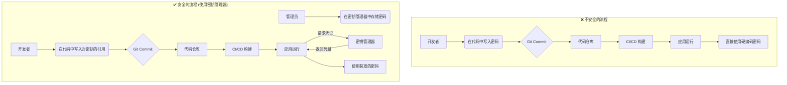

# CWE-798: Use of Hard-coded Credentials (使用硬编码凭证)

## 1. 漏洞描述

**CWE-798** 指的是将敏感凭证（如密码、API密钥、私钥、访问令牌等）直接以明文形式嵌入到源代码、配置文件或二进制文件中的安全漏洞。这是一种常见的安全编码错误，被归类于 **OWASP API Security Top 10** 的 **API8:2023 - Security Misconfiguration** 类别下。

当凭证被硬编码时，任何能够访问源代码（包括版本控制系统历史记录）、反编译二进制文件或读取配置文件的人，都可以轻易获取这些敏感信息，从而导致未经授权的访问。

---

## 2. 风险与影响

- **凭证泄露**: 攻击者、心怀不满的员工或任何有权访问代码库的人都可以直接获取生产环境的凭证。
- **权限提升**: 一旦攻击者获得硬编码的凭证，他们可能会利用这些凭证访问敏感系统（如数据库、内部API），并可能进一步提升其权限。
- **难以轮换**: 当凭证需要更新时（例如，在发生泄露后），必须修改代码、重新编译和重新部署应用，这是一个缓慢且容易出错的过程。
- **安全审计困难**: 难以追踪谁在何时访问了这些凭证。

---

## 3. 常见案例：硬编码的数据库密码

这是一个非常典型的Java代码示例，其中数据库的用户名和密码被直接写入代码中。

#### ❌ 不安全的示例代码

```java
import java.sql.Connection;
import java.sql.DriverManager;
import java.sql.SQLException;

public class DatabaseConnector {

    public Connection connectToDatabase() throws SQLException {
        String dbUrl = "jdbc:mysql://prod-db.example.com:3306/users";
        String username = "db_admin";
        
        // 严重风险：密码被硬编码在源代码中
        String password = "S3cr3tP@ssw0rd!"; 
        
        return DriverManager.getConnection(dbUrl, username, password);
    }
}
```

在上面的例子中，`S3cr3tP@ssw0rd!` 这个密码字符串会被编译到 `.class` 文件中，并存储在版本控制系统（如Git）里，任何有权访问该代码仓库的人都能看到它。

---

## 4. 如何在平台中定位和修复

### 4.1. 定位问题

作为平台方，可以通过以下方式系统地发现硬编码凭证问题：

| 检测方法                 | 工具/实践                                                              | 检测目标                                                                 |
| ------------------------ | ---------------------------------------------------------------------- | ------------------------------------------------------------------------ |
| **静态代码分析 (SAST)**  | `SonarQube`, `Checkmarx`, `Semgrep`, `GitHub CodeQL`                     | 扫描源代码，查找常见的密码字符串、API密钥格式和认证相关的硬编码模式。    |
| **密钥扫描 (Secret Scanning)** | `Gitleaks`, `TruffleHog`, `GitHub Secret Scanning`                     | 扫描Git仓库的完整历史记录，查找意外提交的凭证。                          |
| **配置文件审查**         | 自定义脚本 (`grep`, `rg`)                                              | 扫描 `.properties`, `.yml`, `.xml`, `.env` 等文件中的明文密码或密钥。      |
| **容器镜像扫描**         | `Trivy`, `Clair`, `Aqua Security`                                        | 扫描容器镜像层，查找被意外打包进去的包含凭证的配置文件或脚本。           |

### 4.2. 修复方案：将凭证外部化

核心修复原则是 **将凭证与代码分离**。凭证应被视为配置，而不是代码的一部分。

#### ✅ 方案一：使用环境变量 (Environment Variables)

这是最简单直接的外部化方法。应用从其运行环境中读取凭证。

**优点**: 实现简单，与容器化（Docker, Kubernetes）和云环境兼容性好。
**缺点**: 环境变量可能被同一主机上的其他进程读取，且在某些日志或监控系统中可能被意外记录。

**修复后的代码示例:**
```java
public Connection connectToDatabase() throws SQLException {
    String dbUrl = System.getenv("DB_URL");
    String username = System.getenv("DB_USERNAME");
    String password = System.getenv("DB_PASSWORD"); // 从环境变量读取密码

    if (password == null) {
        throw new IllegalStateException("Database password not found in environment variables.");
    }
    
    return DriverManager.getConnection(dbUrl, username, password);
}
```

在Kubernetes中，可以通过 `Secret` 对象安全地将这些环境变量注入到Pod中。

#### ✅ 方案二：使用外部配置文件

将凭证存储在代码库之外的配置文件中。

**优点**: 将配置集中管理。
**缺点**: 必须严格控制配置文件的访问权限，并确保它不会被意外提交到版本控制系统。

**修复后的代码示例 (使用 `.properties` 文件):**
```java
// config.properties (此文件必须在代码库之外，并严格控制访问权限)
db.url=jdbc:mysql://prod-db.example.com:3306/users
db.username=db_admin
db.password=S3cr3tP@ssw0rd!

// Java Code
Properties props = new Properties();
try (FileInputStream fis = new FileInputStream("/etc/app/config.properties")) {
    props.load(fis);
}

String password = props.getProperty("db.password");
// ...
```

#### ✅ 方案三：使用专用的密钥管理服务 (Secrets Management) - 最佳实践

这是最安全、最推荐的方法。应用在启动时或需要时，通过安全的API从密钥管理服务中动态获取凭证。

**优点**:
- **集中管理与审计**: 所有密钥都集中存储，访问行为可被审计。
- **强访问控制**: 可以基于IAM角色精细控制谁可以访问哪个密钥。
- **自动轮换**: 支持密钥的自动、定期轮换，无需修改应用。
- **传输中加密**: 获取密钥的过程是加密的。

**常见服务**:
- **HashiCorp Vault**
- **AWS Secrets Manager**
- **Google Cloud Secret Manager**
- **Azure Key Vault**

**修复后的概念代码 (使用GCP Secret Manager):**
```java
import com.google.cloud.secretmanager.v1.SecretManagerServiceClient;
import com.google.cloud.secretmanager.v1.SecretVersionName;

public String getDatabasePassword() throws IOException {
    String projectId = "your-gcp-project-id";
    String secretId = "db-password-secret";
    String versionId = "latest";

    try (SecretManagerServiceClient client = SecretManagerServiceClient.create()) {
        SecretVersionName secretVersionName = SecretVersionName.of(projectId, secretId, versionId);
        AccessSecretVersionResponse response = client.accessSecretVersion(secretVersionName);
        return response.getPayload().getData().toStringUtf8();
    }
}
```

---

## 5. 流程对比图



---

## 6. 总结与平台治理建议

| 修复方法           | 优点                                       | 缺点                                       | 适用场景                               |
| ------------------ | ------------------------------------------ | ------------------------------------------ | -------------------------------------- |
| **环境变量**       | 简单，与云原生环境集成度高                 | 安全性相对较低，可能被同机进程读取         | 开发环境、简单应用                     |
| **外部配置文件**   | 配置集中                                   | 文件权限管理复杂，易被误提交               | 传统部署环境                           |
| **密钥管理服务**   | **最安全**，支持审计、轮换，集中控制       | 实现稍复杂，依赖外部服务                   | **生产环境、所有关键应用（强烈推荐）** |

作为平台方，应建立以下治理机制：
1.  **强制执行扫描**: 在CI/CD流水线中强制集成密钥扫描工具（如 Gitleaks），一旦发现硬编码凭证，立即中断构建。
2.  **提供标准库**: 提供官方支持的、预先配置好的库或SDK，方便开发者安全地从平台的密钥管理服务中获取凭证。
3.  **定期审计**: 定期对所有代码仓库和容器镜像进行全面审计，查找漏网之鱼。
4.  **安全培训**: 对开发人员进行安全编码培训，强调硬编码凭证的危害和正确的凭证管理方法。
