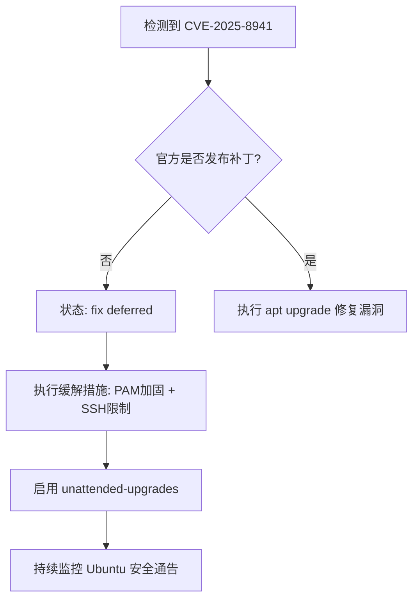
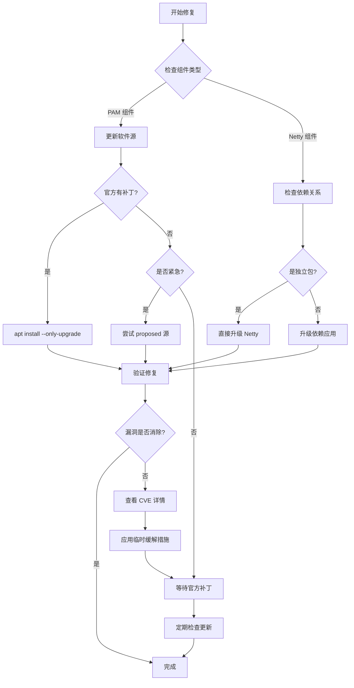

- first principles /ˈprɪns.ɪplz/
- make it more flexible and focused on CVE information extraction.
- Now I will summary how fix  violation
	- 1.  apt update ==> latest 
		- using --only-upgrade [only update violation Running library ]
		- eg: `apt install --only-upgrade libpam0g libpam-modules libpam-modules-bin libpam-runtime`
	- 2. make sure using right repo within apt sources.list 
	- 3. using dkpg -l |grep Verify the New latest version about of my keyword.
	- 4. Check cyberflows report and find the Solution
		- need using purge command delete some lib or packages
		- eg: `apt-get purge -y iir1.2-glib-2.0`
	- 5. filter the cve report at office 
		- https://ubuntu.com/security/CVE-2025-8941
	- 6. find the internal repo package Version 

# fix Flow

- fix 
