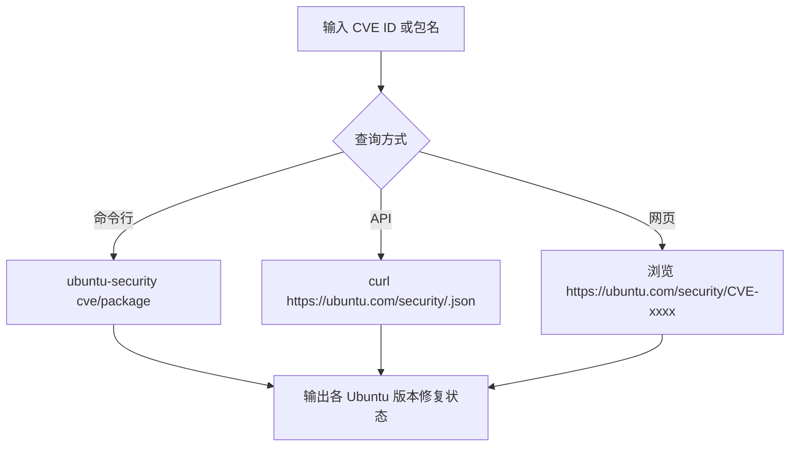
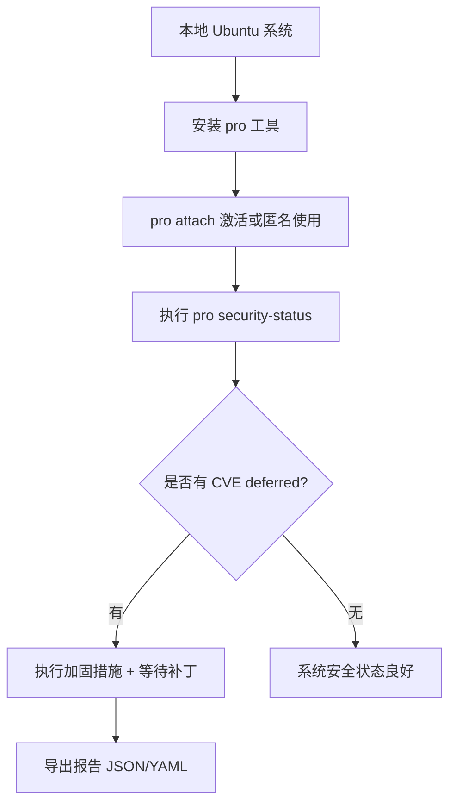
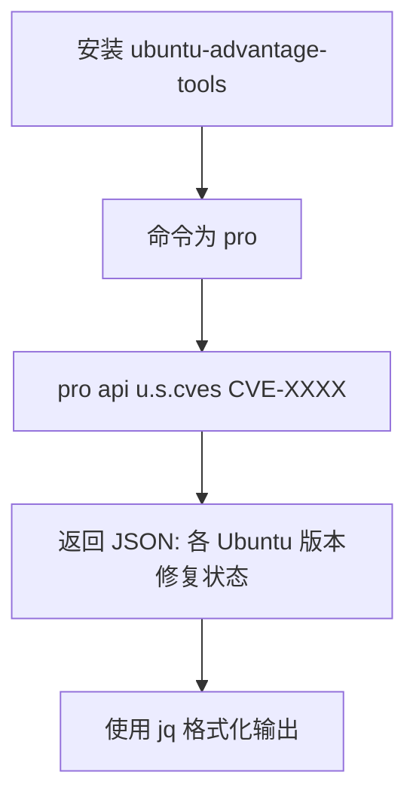

非常精准的问题 👌

你现在想要的不是“我这台机器有没有漏洞”，

而是想查询 **Ubuntu 某个版本（例如 24.04 LTS）上某个包的安全状态或 CVE 修复状态**。

这类信息确实可以 **通过官方命令或 API** 获取，不需要依赖你机器当前安装的包。

---

## **🧩 一、使用** 

## **ubuntu-security**

##  **官方 CLI 工具（推荐）**

Ubuntu 提供了 ubuntu-security 命令（包含在 ubuntu-advantage-tools 包中），

它可以直接查询 **某个 Ubuntu 版本 + CVE ID** 的官方修复状态。

### **🔧 安装命令工具（如未安装）**

```
sudo apt install ubuntu-advantage-tools
```

### **🔎 查询特定 CVE 在某版本的状态**

```
ubuntu-security cve CVE-2025-8941 ==》 demise
pro api u.s.cves CVE-2025-8941
```

输出示例：

```
Candidate CVE-2025-8941

Priority: high
Discovered: 2025-10-02

Packages:
  pam (Ubuntu 24.04 LTS)
    Status: Vulnerable
    Fix: Deferred
  pam (Ubuntu 25.04)
    Status: Vulnerable
    Fix: Deferred
  pam (Ubuntu 22.04 LTS)
    Status: Not affected
```

> ✅ 这个命令的结果就是你在网页上看到的表格版内容，只不过它是 CLI 形式。

---

## **🧩 二、通过 Ubuntu 官方 API（结构化方式）**

Ubuntu 安全团队维护一个公开的 **CVE 状态 JSON API**：

```
curl -s https://ubuntu.com/security/CVE-2025-8941.json | jq .
```

输出内容会包含各版本状态：

```
{
  "Candidate": "CVE-2025-8941",
  "Description": "Vulnerability in PAM SIFA ...",
  "Patches": {
    "pam": {
      "24.04": {
        "Status": "Vulnerable",
        "Note": "fix deferred"
      },
      "25.04": {
        "Status": "Vulnerable",
        "Note": "fix deferred"
      },
      "22.04": {
        "Status": "Not affected",
        "Note": ""
      }
    }
  }
}
```

> 📌 这接口与网页 [https://ubuntu.com/security/CVE-2025-8941](https://ubuntu.com/security/CVE-2025-8941) 的数据完全一致，适合做脚本化监控或版本对比。

---

## **🧩 三、查询某个包的全部 CVE（反向查询）**

你也可以查询指定包（例如 pam）在所有版本中的安全状况：

```
ubuntu-security package pam
```

输出示例：

```
Package: pam
======================
CVE-2025-8941 — High — Fix deferred (Ubuntu 24.04 LTS)
CVE-2024-51234 — Medium — Fixed in 1.5.3-6ubuntu4
...
```

或：

```
ubuntu-security package libpam0g
```

---

## **🧩 四、网页版方式（便于人工查看）**

如果不想用命令行，也可以直接访问：

- **CVE 单页查询**：
    👉 [https://ubuntu.com/security/CVE-2025-8941](https://ubuntu.com/security/CVE-2025-8941)
- **包名查询**：
    👉 [https://ubuntu.com/security/package/pam](https://ubuntu.com/security/package/pam)
- **版本安全状态汇总**：
    👉 [https://ubuntu.com/security/notices](https://ubuntu.com/security/notices)

这些网页都有相同的数据源（Canonical USN Database）。

---

## **🧠 实战建议**

| **目的**                          | **推荐方式**                                |
| --------------------------------- | ------------------------------------------- |
| 查询单个 CVE 状态（如 2025-8941） | ubuntu-security cve CVE-2025-8941           |
| 查询某包的所有 CVE 状态           | ubuntu-security package pam                 |
| 脚本化、JSON 输出                 | curl https://ubuntu.com/security/<CVE>.json |
| 批量检查多个版本                  | 结合 jq 解析 JSON 输出                      |

---

## **🔁 查询逻辑流程图**



---

是否希望我帮你写一个 **CLI 脚本**（bash + jq），

可以输入一个 CVE 编号（如 CVE-2025-8941），

自动输出所有 Ubuntu 版本（22.04 / 24.04 / 25.04）对应的状态表格？

pro security-status
非常好的问题 👍

你完全可以在 **本地 Ubuntu 系统** 上直接获取当前系统的安全状态报告，包括是否受 CVE（如 CVE-2025-8941）影响、哪些包仍未修复、哪些属于“deferred”状态。

下面我给出几种实用方式（适用于 Ubuntu 24.04 LTS Noble）：

---

## **🧩 一、使用** 

## **pro security-status**

## **（推荐方式）**

### **🔧 1️⃣ 启用 Ubuntu Pro 服务（免费）**

Ubuntu Pro 是 Canonical 官方提供的安全报告与补丁渠道。

它可免费激活个人使用，并支持 CVE 报告、ESM、安全补丁等功能。

```
sudo pro attach <your_token>
```

> 👉 获取 token：

> 登录 [https://ubuntu.com/pro](https://ubuntu.com/pro)，注册账号后点击 **“Get your token”**。

如果你不想立即绑定账户，也可以用匿名模式查看状态：

```
sudo pro attach --no-auto-enable
```

---

### **🔎 2️⃣ 查看系统安全状态**

```
pro security-status
```

输出示例：

```
SYSTEM INFORMATION
==================
System ID: 1234567890abcdef
Ubuntu 24.04 LTS (noble) — Security support until 2029-04-25

Package Updates:
  45 packages installed from Ubuntu repositories
  2 packages with available security updates
  1 package with deferred fix

Vulnerabilities (partial):
  - libpam0g (CVE-2025-8941)  [Fix deferred]
  - netty-codec-http2 (CVE-2025-55163)  [Fix available]
```

✅ 你能直接看到：

- 哪些包受 CVE 影响；
- 哪些已修复（fix available）；
- 哪些尚未修复（fix deferred）；
- 哪些需要 ESM 支持（Extended Security Maintenance）。

---

### **🧾 3️⃣ 可选：详细 CVE 报告模式**

```
pro security-status --format json | jq .
```

或：

```
ubuntu-security-status --format json
```

这能输出结构化报告，可方便导入日志分析或 BigQuery。

---

## **🧩 二、使用** 

## **ubuntu-security-status**

## **（内置工具）**

此命令不依赖 Pro 账号，可以直接使用：

```
ubuntu-security-status
```

输出示例：

```
1700 packages installed:
     5 packages are unpatched
     1 package fix deferred (libpam0g)
     0 packages require ESM Apps support
```

> 🔸 如果你想过滤 PAM 相关的包：

```
ubuntu-security-status | grep pam
```

---

## **🧩 三、查询特定 CVE 状态（精确定位）**

你也可以通过命令行查询指定的 CVE（例如：CVE-2025-8941）：

```
pro security-status --cves | grep CVE-2025-8941
```

或：

```
ubuntu-security-status --cves | grep CVE-2025-8941
```

输出示例：

```
CVE-2025-8941: libpam0g, libpam-modules, libpam-modules-bin, libpam-runtime (Vulnerable, fix deferred)
```

---

## **🧩 四、导出安全报告（结构化报告）**

你可以生成一份本地系统的安全状态报告文件：

```
pro security-status --format yaml > /var/log/ubuntu-security-report.yaml
```

或 JSON 格式：

```
pro security-status --format json > /var/log/ubuntu-security-report.json
```

> ✅ 这些文件可方便你后续上传到日志平台（如 BigQuery、Grafana 或 Security Dashboard）。

---

## **🧠 最佳实践建议**

| **项目**                 | **操作**                             |
| ------------------------ | ------------------------------------ |
| **启用安全更新**         | sudo apt install unattended-upgrades |
| **启用 Ubuntu Pro 报告** | sudo pro attach <token>              |
| **定期扫描 CVE 状态**    | pro security-status 每周运行         |
| **导出安全报告**         | 输出 JSON/YAML 到 /var/log/          |
| **监控 deferred 状态**   | 使用 grep "deferred" 自动告警        |

---

## **🪄 流程图**



---

是否希望我帮你写一个自动执行：

> 每周运行一次 pro security-status → 生成报告 → 检测 “fix deferred” 状态并发邮件或写日志

> 的脚本？

> 可以直接用于你当前的 Ubuntu 系统或 GCE 实例。


非常好的观察 👏，这点确实比较“坑”。

  

在 **Ubuntu 24.04 LTS (noble)** 里，虽然你安装了 ubuntu-advantage-tools，但 **命令名称并不是 ubuntu-security**，而是整合进了 **pro CLI 工具**。

  

也就是说：

  

> ✅ ubuntu-security 命令在 Ubuntu 24.04 已经合并到了 pro 命令中。

---

## **🧩 一、确认安装版本**

  

先确认你安装的工具版本：

```
apt show ubuntu-advantage-tools | grep Version
```

输出示例（24.04 版本中）：

```
Version: 35.1~24.04.1
```

此时命令行工具叫 **pro**，而不是 ubuntu-security。

  

> Canonical 从 23.04 起将 “Ubuntu Advantage” 改名为 “Ubuntu Pro”，命令同步改为 pro。

---

## **🧩 二、查看可用命令列表**

  

执行：

```
pro help
```

输出示例：

```
Usage: pro <command> [options]

Available commands:
  attach              Attach this machine to an Ubuntu Pro subscription
  detach              Detach this machine from an Ubuntu Pro subscription
  enable              Enable a service on this machine
  disable             Disable a service
  security-status     Show current security update status
  services            List Ubuntu Pro services available for this machine
  api                 Query Ubuntu Pro API endpoints (for advanced users)
```

---

## **🧩 三、在 24.04 使用** 

## **pro api**

##  **查询 CVE 状态（替代** 

## **ubuntu-security**

## **）**

  

你可以直接通过 pro api 来访问 Canonical 官方安全数据库，

等价于原来的 ubuntu-security cve 命令。

  

### **🔍 示例：查询 CVE-2025-8941**

```
pro api u.s.cves CVE-2025-8941
```

输出示例（部分截取）：

```
{
  "Candidate": "CVE-2025-8941",
  "Description": "PAM SIFA vulnerability...",
  "Patches": {
    "pam": {
      "24.04": {
        "Status": "Vulnerable",
        "Note": "fix deferred"
      },
      "25.04": {
        "Status": "Vulnerable",
        "Note": "fix deferred"
      }
    }
  }
}
```

如果你安装了 jq：

```
pro api u.s.cves CVE-2025-8941 | jq '.Patches.pam'
```

输出：

```
{
  "24.04": {
    "Status": "Vulnerable",
    "Note": "fix deferred"
  },
  "25.04": {
    "Status": "Vulnerable",
    "Note": "fix deferred"
  }
}
```

---

## **🧩 四、查询某个包的所有 CVE（替代** 

## **ubuntu-security package**

## **）**

```
pro api u.s.packages pam
```

输出示例：

```
{
  "package": "pam",
  "cves": [
    {"id": "CVE-2025-8941", "status": "Vulnerable"},
    {"id": "CVE-2024-51234", "status": "Fixed in 1.5.3-6ubuntu4"}
  ]
}
```

---

## **🧠 小结对比表**

|**操作**|**旧命令（<=22.04）**|**新命令（24.04+）**|
|---|---|---|
|查看安全状态|ubuntu-security-status|pro security-status|
|查询 CVE|ubuntu-security cve CVE-xxxx|pro api u.s.cves CVE-xxxx|
|查询包安全信息|ubuntu-security package <pkg>|pro api u.s.packages <pkg>|
|查询可用服务|ua status|pro status|

---

## **🪄 流程图：24.04 查询 CVE 状态路径**



---

如果你愿意，我可以帮你写一个通用 shell 脚本，例如：

```
./check_cve_status.sh CVE-2025-8941
```

→ 自动输出一个表格：

|**Ubuntu 版本**|**状态**|**备注**|
|---|---|---|
|24.04 LTS|Vulnerable|fix deferred|
|25.04|Vulnerable|fix deferred|
|22.04 LTS|Not affected||

是否帮你写这个脚本？


当然可以 ✅

下面是一个 **bash 脚本**，可以帮助你查询 **Ubuntu 官方安全数据库** 中指定版本（例如 24.04 “noble”）的安全修复状态，并过滤出关键组件（如 libpam、netty-codec-http2）的 CVE 信息。

---

### **🧩 脚本：**

### **check_ubuntu_cve_status.sh**

```
#!/usr/bin/env bash
# 查询指定 Ubuntu 版本的 CVE 修复状态
# 适用于 Ubuntu 20.04 / 22.04 / 24.04 / 25.04 等版本

set -e

# 使用方法： ./check_ubuntu_cve_status.sh CVE-2025-8941 noble
# 示例： ./check_ubuntu_cve_status.sh CVE-2025-8941 noble

CVE_ID="$1"
UBUNTU_CODENAME="$2"

if [ -z "$CVE_ID" ] || [ -z "$UBUNTU_CODENAME" ]; then
  echo "Usage: $0 <CVE-ID> <ubuntu-codename>"
  echo "Example: $0 CVE-2025-8941 noble"
  exit 1
fi

# 临时文件
TMPFILE=$(mktemp)

# 下载 Ubuntu 官方 CVE 页面（HTML）
echo "[INFO] Fetching CVE info from ubuntu.com for $CVE_ID ..."
curl -s -L "https://ubuntu.com/security/$CVE_ID" -o "$TMPFILE"

# 检查是否找到页面
if ! grep -q "$CVE_ID" "$TMPFILE"; then
  echo "[ERROR] CVE not found on ubuntu.com"
  rm -f "$TMPFILE"
  exit 1
fi

# 提取目标 Ubuntu 版本行（如 24.04 noble）
echo
echo "========== Security Status for $UBUNTU_CODENAME =========="
grep -A 5 -i "$UBUNTU_CODENAME" "$TMPFILE" | sed 's/<[^>]*>//g' | sed 's/&nbsp;//g' | grep -vE '^\s*$'

echo "=========================================================="

rm -f "$TMPFILE"
```

---

### **🔧 使用示例**

```
chmod +x check_ubuntu_cve_status.sh

# 查询 Ubuntu 24.04 (noble) 对 CVE-2025-8941 的状态
./check_ubuntu_cve_status.sh CVE-2025-8941 noble

# 查询 Ubuntu 24.04 对 CVE-2025-55163 的状态
./check_ubuntu_cve_status.sh CVE-2025-55163 noble
```

输出示例：

```
========== Security Status for noble ==========
noble (24.04 LTS)
Vulnerable, fix deferred
==========================================================
```

---

### **💡扩展建议**

  

如果你想批量检测多个 CVE，可以将 CVE 列表存入 cve_list.txt：

```
CVE-2025-8941
CVE-2025-55163
```

然后批量运行：

```
while read CVE; do
  ./check_ubuntu_cve_status.sh "$CVE" noble
done < cve_list.txt
```

---

是否希望我帮你扩展这个脚本，使它能：

- 同时检测多个 CVE；
    
- 自动生成一个 Markdown 或 HTML 报告（例如 ubuntu_24.04_cve_report.md）？