非常好，你的分析已经非常清晰。你现在只剩下 5 个高危漏洞相关包需要修复：

|**包名**|**问题**|**CVE**|
|---|---|---|
|libpam0g|PAM 模块存在漏洞|CVE-2025-8941|
|libpam-modules|同上|CVE-2025-8941|
|libpam-modules-bin|同上|CVE-2025-8941|
|libpam-runtime|同上|CVE-2025-8941|
|netty-codec-http2|Java 组件漏洞|CVE-2025-55163|

---

## **🧩 问题分析**

1. _PAM 系列（libpam）漏洞_*
    
    - 属于 Ubuntu 官方安全维护的核心包；
        
    - CVE-2025-8941 为 **PAM SIFA 模块漏洞**，影响所有未打安全补丁的 PAM 版本；
        
    - 目前 Ubuntu 24.04（Noble Numbat）主分支已发布安全更新；
        
    - 修复方式是 **升级到 Ubuntu 安全仓库中最新版本**。
        
    
2. **netty-codec-http2**
    
    - 属于 Java 的 Netty 框架组件；
        
    - CVE-2025-55163 通常在你的 Java 应用（例如 Spring Boot、Kong Runtime、自研服务）中通过 JAR 依赖出现；
        
    - 修复方式不是系统 apt 更新，而是通过 **Maven/Gradle/JAR 替换** 或 **镜像重构** 来升级该库。
        
    

---

## **✅ 修复方案**

  

### **一、修复 PAM 系列漏洞（系统包）**

```
# 1️⃣ 更新安全源信息
sudo apt update

# 2️⃣ 检查 libpam 相关可升级包
apt list --upgradable | grep libpam

# 3️⃣ 升级相关 PAM 组件
sudo apt install --only-upgrade libpam0g libpam-modules libpam-modules-bin libpam-runtime

# 4️⃣ 验证版本是否为安全版本
dpkg -l | grep libpam
```

> **安全版本参考（Ubuntu 24.04 LTS 修复版）**

- > libpam0g ≥ 1.5.3-6ubuntu6.1
    
- > libpam-modules ≥ 1.5.3-6ubuntu6.1
    
- > libpam-modules-bin ≥ 1.5.3-6ubuntu6.1
    
- > libpam-runtime ≥ 1.5.3-6ubuntu6.1
    

  

若 apt 无法获取到该版本，可启用安全更新仓库：

```
sudo add-apt-repository -s "deb http://security.ubuntu.com/ubuntu noble-security main"
sudo apt update
sudo apt --only-upgrade install libpam0g libpam-modules libpam-modules-bin libpam-runtime
```

---

### **二、修复 netty-codec-http2 (CVE-2025-55163)**

  

此为 **应用层依赖**，非系统包。

如果你在 GKE / Java 容器中运行应用，请执行以下步骤：

  

#### **🧾 方式 1：通过 Maven/Gradle 升级依赖**

  

**Maven 示例：**

```
<dependency>
  <groupId>io.netty</groupId>
  <artifactId>netty-codec-http2</artifactId>
  <version>4.1.113.Final</version> <!-- 已修复CVE版本 -->
</dependency>
```

**Gradle 示例：**

```
implementation 'io.netty:netty-codec-http2:4.1.113.Final'
```

> 📌 Netty 官方在 2025 年 2 月发布了修复版 4.1.113.Final，修复了 HTTP/2 DoS 漏洞。

  

然后重新构建镜像：

```
mvn clean package -DskipTests
docker build -t your_image:patched .
```

#### **🧾 方式 2：镜像直接检查与修复**

  

如果你用容器镜像（例如 GKE Runtime 镜像）：

```
# 查看依赖版本
jar -xf your_app.jar META-INF/MANIFEST.MF | grep netty-codec-http2

# 或者使用 container scanning 工具
gcloud artifacts docker images scan your_image:tag --format=json
```

若扫描报告仍显示 netty-codec-http2 存在漏洞，则确认版本升级后重新推送镜像。

---

## **🧠 注意事项**

|**类别**|**建议**|
|---|---|
|**系统包更新**|升级 PAM 后建议立即重启系统或至少重启依赖 PAM 的服务（如 sshd）。|
|**镜像安全性**|在 CI/CD 或 GCR/GAR 中添加镜像扫描任务（gcloud artifacts docker images scan）。|
|**版本锁定**|通过 apt-mark hold 防止回退到旧版本。|
|**自动修复策略**|可配置 unattended-upgrades 自动获取安全补丁：sudo apt install unattended-upgrades。|

---

## **🔁 简要流程图**



---

是否希望我帮你写一个自动检测 + 修复 PAM 安全更新的小脚本（bash），可直接在 Ubuntu 24.04 实例上运行？


# Claude
# Ubuntu 24.04 安全漏洞修复方案

## 问题分析

当前剩余 5 个 High 级别漏洞：

- **PAM 相关**（4个）：libpam0g, libpam-modules, libpam-modules-bin, libpam-runtime
    - CVE: CVE-2025-8941
- **Netty 相关**（1个）：netty-codec-http2
    - CVE: CVE-2025-55163

## 解决方案

### 方案 1：PAM 漏洞修复

PAM (Pluggable Authentication Modules) 是系统核心认证组件，需谨慎处理。

#### 1.1 检查当前状态

```bash
# 查看当前 PAM 版本
dpkg -l | grep libpam

# 检查可用更新
apt-cache policy libpam0g libpam-modules libpam-modules-bin libpam-runtime

# 查看安全更新源
grep security /etc/apt/sources.list /etc/apt/sources.list.d/*
```

#### 1.2 更新 PAM 组件

```bash
# 更新软件源
sudo apt update

# 仅升级 PAM 相关包（推荐）
sudo apt install --only-upgrade libpam0g libpam-modules libpam-modules-bin libpam-runtime

# 如果上述命令显示已是最新版本，尝试从 proposed 源安装
sudo apt install -t noble-proposed libpam0g libpam-modules libpam-modules-bin libpam-runtime
```

#### 1.3 如果官方未发布补丁

```bash
# 选项 A：等待官方补丁（推荐）
# 订阅 Ubuntu 安全公告
# https://ubuntu.com/security/notices

# 选项 B：临时缓解措施
# 限制 PAM 模块使用范围，修改 /etc/pam.d/ 配置
sudo vim /etc/pam.d/common-auth
# 添加额外的安全限制（具体根据 CVE 详情）

# 选项 C：使用 Ubuntu Pro（企业版）
# 可能包含 ESM (Extended Security Maintenance) 补丁
sudo pro attach <your-token>
sudo apt update && sudo apt upgrade
```

### 方案 2：Netty 漏洞修复

#### 2.1 检查 Netty 使用情况

```bash
# 查找依赖 netty 的应用
dpkg -l | grep netty
apt-cache rdepends netty-codec-http2

# 检查版本
dpkg -s netty-codec-http2 | grep Version

# 查看可用更新
apt-cache policy netty-codec-http2
```

#### 2.2 升级 Netty

```bash
# 尝试直接升级
sudo apt install --only-upgrade netty-codec-http2

# 如果无可用更新，检查 backports
sudo apt install -t noble-backports netty-codec-http2

# 查看是否有手动安装的包
apt-mark showmanual | grep netty
```

#### 2.3 替代方案

如果 Netty 是被某个应用依赖：

```bash
# 识别依赖应用
apt-cache rdepends netty-codec-http2 --installed

# 选项 A：升级依赖应用（可能包含修复后的 Netty）
sudo apt update
sudo apt upgrade <dependent-app>

# 选项 B：如果是 Java 应用，考虑使用应用内嵌的 Netty
# 修改应用配置，使用 Uber JAR 或 Maven shade plugin 方式

# 选项 C：手动编译安全版本（适合开发环境）
# 从 Maven Central 获取最新安全版本
wget https://repo1.maven.org/maven2/io/netty/netty-codec-http2/<version>/netty-codec-http2-<version>.jar
```

## 修复流程图



## 完整修复脚本

```bash
#!/bin/bash

# Ubuntu 24.04 漏洞修复脚本
set -e

echo "=== 开始修复安全漏洞 ==="

# 1. 备份当前状态
echo ">> 备份软件包状态"
dpkg --get-selections > ~/package-backup-$(date +%Y%m%d).txt

# 2. 更新软件源
echo ">> 更新软件源"
sudo apt update

# 3. 修复 PAM 漏洞
echo ">> 尝试升级 PAM 组件"
PAM_PACKAGES="libpam0g libpam-modules libpam-modules-bin libpam-runtime"

for pkg in $PAM_PACKAGES; do
    current_version=$(dpkg -s $pkg 2>/dev/null | grep "^Version:" | awk '{print $2}')
    echo "当前 $pkg 版本: $current_version"
    
    sudo apt install --only-upgrade $pkg -y || echo "警告: $pkg 无可用更新"
done

# 4. 修复 Netty 漏洞
echo ">> 尝试升级 Netty"
sudo apt install --only-upgrade netty-codec-http2 -y || {
    echo "警告: netty-codec-http2 无可用更新"
    echo "检查依赖应用..."
    apt-cache rdepends netty-codec-http2 --installed
}

# 5. 验证修复结果
echo ">> 验证修复结果"
echo "当前 PAM 版本:"
dpkg -l | grep libpam

echo "当前 Netty 版本:"
dpkg -s netty-codec-http2 | grep Version || echo "未安装或已移除"

# 6. 重启必要服务
echo ">> 检查是否需要重启"
if [ -f /var/run/reboot-required ]; then
    echo "警告: 系统需要重启以完成更新"
    cat /var/run/reboot-required.pkgs
fi

echo "=== 修复完成 ==="
```

## 注意事项

### PAM 组件注意事项

1. **不要轻易卸载** PAM 组件 - 会导致系统无法登录
2. **升级前备份**：
    
    ```bash
    sudo cp -r /etc/pam.d /etc/pam.d.backup
    ```
    
3. **保持 SSH 连接活动** - 升级期间不要断开，以防配置错误
4. **测试环境优先** - 如有条件，先在测试环境验证

### Netty 组件注意事项

1. **确认影响范围** - 可能仅被某些 Java 应用使用
2. **检查应用兼容性** - 升级后测试依赖应用
3. **考虑应用层修复** - 某些应用可能需要独立升级其内嵌的 Netty

### 临时缓解措施

如果暂时无法获取补丁：

```bash
# 1. 限制网络访问（针对 Netty）
sudo ufw deny from any to any port <affected-port>

# 2. 增强 PAM 安全配置
sudo vim /etc/security/limits.conf
# 添加：
# *    hard    core    0
# *    hard    maxlogins    4

# 3. 启用额外审计
sudo apt install auditd
sudo systemctl enable auditd
sudo auditctl -w /etc/pam.d/ -p wa -k pam_changes
```

## 验证修复

```bash
# 扫描残留漏洞（如果使用漏洞扫描工具）
# 示例：使用 Trivy
trivy rootfs /

# 或使用 Ubuntu 自带工具
pro security-status --format json

# 手动检查版本
dpkg -l | grep -E "libpam|netty"
```

## 持续监控

```bash
# 设置自动安全更新
sudo apt install unattended-upgrades
sudo dpkg-reconfigure --priority=low unattended-upgrades

# 订阅 Ubuntu 安全通知
# https://ubuntu.com/security/notices
# 或使用 RSS: https://ubuntu.com/security/notices/rss.xml
```

---

**建议优先级**：

1. ✅ 立即执行 `apt update && apt upgrade` 获取可用补丁
2. ⚠️ 如无补丁，应用临时缓解措施
3. 📅 定期检查（每日）Ubuntu Security Notices
4. 🔄 考虑启用 Ubuntu Pro 获取扩展支持


# Gemini 
好的，我们来分析并解决剩下的这 5 个漏洞。

首先，非常出色地解决了 `glib` 和 `icu` 的问题，这说明您已经掌握了基本的漏洞修复思路。剩下的问题稍微复杂一些，因为它们涉及到了系统核心组件（PAM）和一个应用程序依赖（Netty）。

这是一个清晰的分析和修复指南，帮助您解决剩余的漏洞。

---

### 问题分析与总体策略

您剩下的 5 个漏洞可以分为两类：

1. **PAM (Pluggable Authentication Modules) 相关 (CVE-2025-8941)**:
    
    - `libpam0g`
        
    - `libpam-modules`
        
    - `libpam-modules-bin`
        
    - libpam-runtime
        
        这些是 Ubuntu 系统中负责用户认证的核心组件。无论是登录、sudo、SSH 还是其他需要验证用户身份的操作，都离不开 PAM。绝对不能卸载这些软件包，否则会导致系统无法登录。修复的唯一正确方法是等待并安装来自 Ubuntu 官方的安全更新。
        
2. **Netty 相关 (CVE-2025-55163)**:
    
    - netty-codec-http2
        
        这是一个 Java 应用程序的网络库，通常不是由操作系统直接使用，而是作为某个你安装的应用程序（如 Elasticsearch、Logstash、或某个 Spring Boot 应用）的依赖项。修复它的方法是更新那个依赖它的应用程序，而不是直接更新这个库本身。
        

**重要提示**: 您提供的 CVE 编号 `CVE-2025-8941` 和 `CVE-2025-55163` 似乎是示例或占位符，因为在公共数据库中目前无法查到。不过，这不影响修复逻辑，因为扫描工具是针对软件包版本而不是 CVE 编号来报告漏洞的。我们将专注于修复被标记的软件包。

---

### 修复步骤

#### 第 1 步：处理 PAM 相关的 4 个漏洞

由于 PAM 是核心系统组件，最安全、最正确的修复方法是通过 Ubuntu 的官方软件源进行更新。

1. 刷新软件源并检查更新
    
    这是最关键的一步。Ubuntu 安全团队会发布针对这类漏洞的补丁。运行以下命令来获取最新的软件包列表和安全更新：
    
    Bash
    
    ```
    sudo apt update
    sudo apt list --upgradable
    ```
    
    在可升级列表中，查看是否包含 `libpam0g` 或其他相关的 PAM 包。
    
2. 执行系统升级
    
    如果上一步中看到了 PAM 相关的更新，或者任何其他安全更新，请执行全面升级：
    
    Bash
    
    ```
    sudo apt full-upgrade
    ```
    
    这个命令会安装所有可用的更新，包括安全补丁。
    
3. 如果 apt upgrade 后漏洞依旧存在怎么办？
    
    这通常意味着两种情况：
    
    - **补丁尚未发布**: Ubuntu 团队可能正在测试和准备补丁。你可以访问 [Ubuntu Security Notices (USNs)](https://ubuntu.com/security/notices) 搜索 `libpam`，查看是否有针对 Ubuntu 24.04 的修复公告。如果还没有，那么除了等待官方补丁外没有更安全的办法。
        
    - **更新被“分阶段推送”(Phased Updates)**: 为了保证稳定性，Ubuntu 有时会逐步向用户推送更新，而不是一次性推送给所有人。你可以使用以下命令查看特定软件包的所有可用版本，包括那些可能在分阶段推送中的版本：
        
        Bash
        
        ```
        apt-cache policy libpam0g libpam-modules
        ```
        
        如果看到一个比当前安装版本更新的版本，但 `apt upgrade` 没有安装它，这可能就是原因。通常等待一两天就会被自动推送。
        

**总结 (PAM)**: **核心策略是等待并安装官方更新**。任何手动编译或从第三方源安装 PAM 的尝试都极度危险，可能破坏你的系统。

---

#### 第 2 步：处理 `netty-codec-http2` 漏洞

这个漏洞的修复思路完全不同，关键在于找到是**哪个应用程序**使用了这个库。

1. 确定该文件的来源和位置
    
    netty-codec-http2 通常是一个 .jar 文件。首先，我们需要在系统中找到它。
    
    Bash
    
    ```
    sudo find / -name "netty-codec-http2*.jar" 2>/dev/null
    ```
    
    `2>/dev/null` 会忽略权限错误，让输出更干净。
    
2. 分析文件路径以识别应用程序
    
    上一个命令的输出路径会给你关键线索。
    
    - 如果路径是 `/usr/share/elasticsearch/lib/netty-codec-http2-....jar`，那么它属于 **Elasticsearch**。
        
    - 如果路径是 `/opt/logstash/vendor/bundle/jruby/.../netty-codec-http2-....jar`，那么它属于 **Logstash**。
        
    - 如果路径在某个自定义的 Java 应用目录中，例如 `/srv/my-java-app/lib/`，那么它属于你的**自定义应用**。
        
    - 如果该文件是由 `apt` 安装的，你可以用 `dpkg` 查询：
        
        Bash
        
        ```
        dpkg -S /path/to/the/found/file.jar
        ```
        
3. 根据来源进行修复
    
    一旦确定了是哪个应用程序在使用它，修复方法就是升级那个主应用程序。
    
    - **如果是 Elasticsearch/Logstash 等**: 你需要按照它们的官方文档，将整个应用升级到一个不再受此漏洞影响的新版本。例如，如果你的 Elasticsearch 是 8.5.0 版本，你可能需要升级到 8.6.1 或更高版本来获得修复后的 `netty` 库。
        
    - **如果是你自己开发的应用**: 你需要在你的项目构建文件（如 Maven 的 `pom.xml` 或 Gradle 的 `build.gradle`）中，将 `netty-codec-http2` 的依赖版本号提升到一个安全版本，然后重新编译和部署你的应用程序。
        

**总结 (Netty)**: **核心策略是找到并升级依赖它的主应用**。仅仅替换 `.jar` 文件可能会导致应用程序因版本不兼容而崩溃。

---

### 行动纲领总结

|**漏洞软件包 (Vulnerable Package)**|**类型 (Type)**|**核心修复策略 (Core Remediation Strategy)**|
|---|---|---|
|`libpam0g`, `libpam-modules`, `libpam-modules-bin`, `libpam-runtime`|系统核心组件 (Core OS Component)|运行 `sudo apt update && sudo apt full-upgrade`，等待并安装 Ubuntu 官方安全更新。**切勿手动更改或卸载**。|
|`netty-codec-http2`|应用程序依赖 (Application Dependency)|1. 使用 `find` 命令定位文件。 2. 确定哪个应用程序拥有它。 3. **升级该主应用程序**到已修复此漏洞的版本。|

完成以上步骤后，重新运行你的安全扫描工具，确认这 5 个漏洞是否都已成功修复。