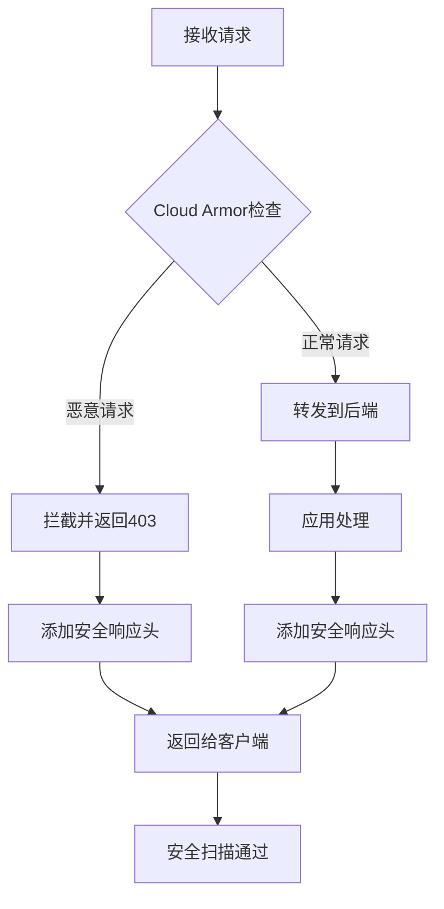

- The contradictions between Cyber and Cloud Armor
- Cloud Armor拦截了恶意请求并返回403，但缺少安全响应头导致安全扫描仍然报告风险
- 涉及到在 Google Cloud Platform (GCP) 的 Google Kubernetes Engine (GKE) 上运行的 API 服务的安全响应头配置问题。核心问题是：尽管 Cloud Armor (GCP 的 Web 应用防火墙，WAF) 已经通过规则拦截了恶意请求并返回 403 状态码，但响应中缺少某些安全响应头（如 `X-Content-Type-Options: nosniff`），导致 Cyber 安全扫描工具仍然报告潜在风险。
- Grok
	- Edit GCLB(Google cloud Load Balancer)--> Backend Service --> add define --> Custom Response Headers ==> ?
	- GCLB 会将配置的自定义响应头应用于所有响应，包括 Cloud Armor 拦截的 403 响应
	- 与安全团队协商调整扫描规则（非技术方案）
	- 思路
	    - 如果技术方案无法完全解决 Cloud Armor 响应头问题，可以与 Cyber 安全扫描团队协商，说明 Cloud Armor 拦截的 403 响应缺少安全头是平台限制，而非实际安全风险。
	    - 提供其他证据（如 Cloud Armor 规则配置、拦截日志）证明请求已被安全处理，请求豁免此扫描规则。
- Gemini
	- Cloud Armor 规则中直接修改响应标头的能力
		- 不推荐直接修改 Cloud Armor 规则以添加响应标头
		- 推荐解决方案：负载均衡器自定义错误响应与 Google Cloud Storage (GCS)
	- 推荐的解决方案是利用 Google Cloud Application Load Balancer 的自定义错误响应功能，并结合 Google Cloud Storage (GCS) 来提供包含所需安全标头的错误页面
		- 此方法的工作流程如下：
		- 当 Cloud Armor 安全策略规则匹配到恶意请求时，它会按配置拒绝该请求，并向负载均衡器返回一个 HTTP 403 错误。
		- 外部应用负载均衡器接收到这个来自 Cloud Armor 的 403 响应。
		- 负载均衡器上配置的自定义错误响应策略被触发。此策略配置为针对特定的 HTTP 错误代码（在本例中为 403）提供自定义内容。
		- 负载均衡器从预先配置的 Google Cloud Storage (GCS) 存储桶中提取一个自定义的 HTML 错误页面（例如 `403.html`）。
		- 这个存储在 GCS 中的 HTML 对象本身配置了必要的 HTTP 安全标头（如 `X-Content-Type-Options: nosniff`）作为其对象元数据的一部分。
		- 负载均衡器将 GCS 提供的 HTML 内容连同其元数据中定义的 HTTP 标头一起返回给原始客户端。


# Gemini

# 通过 Google Cloud Armor 和负载均衡器自定义错误响应确保 API 安全标头合规性

## 1. 引言

在复杂的云原生环境中，保护在 Google Kubernetes Engine (GKE) 上运行的 API 端点至关重要。Google Cloud Armor 提供了强大的 Web 应用防火墙 (WAF) 和 DDoS 防护功能。当 Cloud Armor 阻止恶意请求时，通常会返回一个 HTTP 403 Forbidden 错误。然而，网络安全扫描报告通常要求这些错误响应包含特定的安全标头，例如 `X-Content-Type-Options: nosniff`，以增强安全态势。

本报告旨在探讨如何确保 Cloud Armor 生成的 403 错误响应包含此类必需的安全标头。报告将分析直接修改 Cloud Armor 规则以添加这些标头的可行性和推荐做法，并详细介绍一种利用 Google Cloud Load Balancing 和 Google Cloud Storage (GCS) 的替代解决方案。此外，还将提供使用 Terraform 进行基础设施即代码 (IaC) 的实现指南，并讨论相关的验证方法和安全最佳实践。

## 2. 理解挑战：Cloud Armor 与响应标头修改

在深入研究解决方案之前，必须首先理解 Google Cloud Armor 的核心功能及其在处理 HTTP 响应方面的固有设计。

### 2.1. Cloud Armor 的主要功能

Google Cloud Armor 是一项边缘安全服务，旨在保护 Google Cloud 应用和网站免受分布式拒绝服务 (DDoS) 攻击和常见的 Web 应用攻击 1。它与 Google Cloud 的外部应用负载均衡器紧密集成，在流量到达后端服务（例如在 GKE 上运行的 API）之前对其进行过滤 1。Cloud Armor 的核心职责是检查传入请求的各种属性（如 IP 地址、地理来源、HTTP 标头和 URI 路径），并根据预定义或自定义的安全策略规则执行操作，例如允许、拒绝或重定向请求 2。

### 2.2. Cloud Armor 规则中直接修改响应标头的能力

Cloud Armor 安全策略由一系列规则组成，每个规则都有匹配条件和相应的操作。对于拒绝操作，Cloud Armor 可以配置为返回特定的 HTTP 状态码，如 403 (Forbidden)、404 (Not Found) 或 502 (Bad Gateway) 4。

虽然 Cloud Armor 规则中存在一个名为 `header_action` 的参数，但其主要设计目的是修改_请求_标头，而不是 Cloud Armor 自身生成的拒绝响应的标头 2。例如，`header_action` 可以用于在请求被允许并转发到后端之前，向请求中添加标头（通过 `request_headers_to_add` 或 `requestHeadersAction` 下的 `setHeaders`）。这在机器人管理场景中非常有用，可以标记可疑请求以供下游进一步处理，或在允许请求通过时丰富请求信息 2。

目前，Google Cloud Armor 的文档和 API 规范中没有明确指出可以直接在其 `deny` 操作的响应中添加自定义_响应_标头的功能 2。Terraform 的 `google_compute_security_policy` 资源中的 `header_action` 字段同样适用于请求标头，而非 Cloud Armor 拒绝操作本身生成的响应标头 7。Cloud Armor 的架构专注于基于传入请求做出决策（允许、拒绝、重定向）。修改其为 `deny` 操作生成的响应，超出了其典型的请求处理流程。`header_action` 的设计初衷是操纵即将（如果被允许）发送到后端的请求，或作为机器人管理功能的一部分来标记请求，并非用于自定义拒绝响应本身的标头。

### 2.3. 为何不推荐直接修改 Cloud Armor 规则以添加响应标头

尝试直接修改 Cloud Armor 规则以在其 403 响应中添加如 `X-Content-Type-Options` 这样的安全标头，并非标准或推荐的做法，原因如下：

- **缺乏明确支持**：官方文档和 `gcloud` 命令行工具参考中均未提供直接在 Cloud Armor 拒绝操作中配置自定义响应标头的功能 4。
- **设计焦点**：Cloud Armor 的核心设计是过滤传入请求并执行允许、拒绝或重定向等操作，而不是生成具有复杂自定义标头的 HTTP 响应体 2。其响应生成能力通常限于状态码和预定义的、最小化的响应体。
- **潜在的非标准配置**：任何试图通过未记录的方法或变通方式实现此目的，都可能导致配置不稳定或在未来更新中失效。

因此，寻求一种更稳健、受支持且符合 GCP 服务设计理念的解决方案至关重要。

## 3. 推荐解决方案：负载均衡器自定义错误响应与 Google Cloud Storage (GCS)

鉴于直接在 Cloud Armor 中修改拒绝响应标头的局限性，推荐的解决方案是利用 Google Cloud Application Load Balancer 的自定义错误响应功能，并结合 Google Cloud Storage (GCS) 来提供包含所需安全标头的错误页面。

### 3.1. 方法概述

此方法的工作流程如下：

1. 当 Cloud Armor 安全策略规则匹配到恶意请求时，它会按配置拒绝该请求，并向负载均衡器返回一个 HTTP 403 错误。
2. 外部应用负载均衡器接收到这个来自 Cloud Armor 的 403 响应。
3. 负载均衡器上配置的自定义错误响应策略被触发。此策略配置为针对特定的 HTTP 错误代码（在本例中为 403）提供自定义内容。
4. 负载均衡器从预先配置的 Google Cloud Storage (GCS) 存储桶中提取一个自定义的 HTML 错误页面（例如 `403.html`）。
5. 这个存储在 GCS 中的 HTML 对象本身配置了必要的 HTTP 安全标头（如 `X-Content-Type-Options: nosniff`）作为其对象元数据的一部分。
6. 负载均衡器将 GCS 提供的 HTML 内容连同其元数据中定义的 HTTP 标头一起返回给原始客户端。

这种方法将安全策略的执行（由 Cloud Armor 负责）与错误响应的呈现（由负载均衡器和 GCS 负责）分离开来。Cloud Armor 专注于其核心任务——阻止恶意流量，而负载均衡器则负责提供一个符合安全扫描要求的、内容和标头均自定义的错误响应。这种关注点分离与 GCP 的服务设计理念高度一致。重要的是，安全标头是由 GCS 在对象被获取时提供的，并非由负载均衡器直接注入到它生成的错误响应内容中。负载均衡器仅中继 GCS 提供的内容和标头。

### 3.2. 分步配置指南

以下步骤详细说明了如何实施此解决方案：

#### 3.2.1. 在 GCS 中创建并配置自定义错误页面

首先，需要创建一个 HTML 文件作为 403 错误页面，并将其上传到 GCS 存储桶。关键在于正确配置此 GCS 对象的元数据，以包含所需的 HTTP 响应标头。

1. 创建 HTML 错误页面：
    
    创建一个简单的 HTML 文件，例如 403.html，内容可以是符合品牌形象的错误信息。
    
    HTML
    
    ```
    <!DOCTYPE html>
    <html lang="en">
    <head>
        <meta charset="UTF-8">
        <title>Forbidden</title>
    </head>
    <body>
        <h1>403 Forbidden</h1>
        <p>Access to this resource is denied.</p>
    </body>
    </html>
    ```
    
2. 上传到 GCS 存储桶：
    
    创建一个 GCS 存储桶（如果尚不存在），并将 403.html 文件上传到该存储桶。
    
3. 在 GCS 对象上设置 HTTP 响应标头：
    
    GCS 允许为存储对象设置元数据，其中一些元数据会被 GCS 在提供对象时作为 HTTP 标头返回 11。对于标准 HTTP 标头，如 Content-Type 和 Cache-Control，可以直接设置。对于其他自定义或安全相关的标头，如 X-Content-Type-Options、X-Frame-Options 和 Content-Security-Policy，需要确保它们作为标准的 HTTP 响应标头（而非 x-goog-meta- 前缀的自定义元数据）被提供。
    
    gcloud storage 命令行工具是执行此操作的首选方法，特别是使用 --additional-headers 标志 11。
    
    以下是如何使用 `gcloud` 命令更新 GCS 对象的元数据以包含所需的安全标头：
    
    Bash
    
    ```
    # 首先，上传文件（如果尚未完成）
    gcloud storage cp 403.html gs://YOUR_ERROR_PAGES_BUCKET/403.html
    
    # 其次，更新对象的元数据以包含安全标头
    gcloud storage objects update gs://YOUR_ERROR_PAGES_BUCKET/403.html \
      --content-type="text/html; charset=utf-8" \
      --cache-control="no-store, max-age=0" \
      --additional-headers="X-Content-Type-Options:nosniff,X-Frame-Options:DENY,Content-Security-Policy:default-src 'none'; frame-ancestors 'none';"
    ```
    
    - `--content-type`：指定内容的 MIME 类型。
    - `--cache-control`：指示浏览器和代理不要缓存此错误页面。
    - `--additional-headers`：用于设置其他标准 HTTP 响应标头 11。确保使用正确的格式 `Header-Name:HeaderValue`，多个标头以逗号分隔。
    
    可以通过 `gcloud storage objects describe gs://YOUR_ERROR_PAGES_BUCKET/403.html` 命令验证元数据是否已正确设置。
    

#### 3.2.2. 配置负载均衡器自定义错误策略

接下来，需要配置外部应用负载均衡器，以便在 Cloud Armor 返回 403 错误时，从 GCS 存储桶提供自定义错误页面。这通常涉及到修改负载均衡器的 URL 映射。

1. 创建后端存储桶 (Backend Bucket)：
    
    如果尚未为 GCS 错误页面存储桶创建后端存储桶，请先创建一个。后端存储桶使负载均衡器能够从 GCS 存储桶提供内容。
    
    Bash
    
    ```
    gcloud compute backend-buckets create YOUR_ERROR_BACKEND_BUCKET_NAME \
        --gcs-bucket-name=YOUR_ERROR_PAGES_BUCKET \
        --global
    ```
    
2. 修改 URL 映射：
    
    自定义错误响应策略在 URL 映射级别定义 13。您需要导出当前的 URL 映射，编辑其 YAML 定义以添加错误响应规则，然后重新导入。
    
    - **导出 URL 映射**：
        
        Bash
        
        ```
        gcloud compute url-maps export YOUR_URL_MAP_NAME --destination url-map.yaml --global
        ```
        
    - 编辑 url-map.yaml：
        
        在 YAML 文件中，找到相关的 pathMatcher 或 defaultService 部分，并添加或修改 errorHandling 配置。
        
        YAML
        
        ```
        #... (其他 url-map 配置)...
        defaultService: projects/YOUR_PROJECT_ID/global/backendServices/YOUR_DEFAULT_BACKEND_SERVICE # 或其他默认服务
        errorHandling:
          errorResponseRules:
          - matchResponseCodes:  # 匹配 Cloud Armor 生成的 403 错误
            overrideResponseCode: 403 # 保持响应代码为 403
            path: '/403.html'        # 指向 GCS 存储桶中错误页面的路径
          errorService: 'projects/YOUR_PROJECT_ID/global/backendBuckets/YOUR_ERROR_BACKEND_BUCKET_NAME'
        #... (其他 pathMatcher 配置等)...
        ```
        
        **注意**：
        
        - `matchResponseCodes`: 指定此规则适用的原始 HTTP 响应代码列表。
        - `overrideResponseCode`: 指定负载均衡器返回给客户端的最终 HTTP 响应代码。
        - `path`: 指定在 `errorService`（后端存储桶）中错误对象的路径。
        - `errorService`: 指定用于提供错误内容的后端存储桶的完全限定 URI 13。
    - **导入修改后的 URL 映射**：
        
        Bash
        
        ```
        gcloud compute url-maps import YOUR_URL_MAP_NAME --source url-map.yaml --global
        ```
        

#### 3.2.3. 此架构如何满足安全扫描要求

通过上述配置：

1. 当 Cloud Armor 阻止一个恶意请求并生成 403 错误时，该错误首先由负载均衡器接收。
2. 负载均衡器的 URL 映射中的自定义错误响应规则检测到此 403 错误。
3. 负载均衡器不会将原始的、缺乏安全标头的 Cloud Armor 403 响应直接传递给客户端，而是根据 `errorHandling` 策略，向配置的 `errorService`（即指向 GCS 存储桶的后端存储桶）发起请求，以获取 `/403.html` 对象。
4. Google Cloud Storage 在提供 `403.html` 对象时，会一并发送在其元数据中配置的 HTTP 标头（例如 `X-Content-Type-Options: nosniff`, `X-Frame-Options: DENY` 等）。
5. 负载均衡器随后将从 GCS 收到的包含自定义 HTML 内容和正确安全标头的完整响应转发给客户端。
6. 因此，当网络安全扫描工具检查被阻止的请求时，它们将观察到包含所有必需安全标头的 HTTP 403 响应，从而满足合规性要求。

## 4. 基础设施即代码：Terraform 实现

使用 Terraform 管理云资源可确保配置的一致性、可复现性和版本控制。以下是如何使用 Terraform 实现上述解决方案的关键部分。

### 4.1. 管理 Cloud Armor 安全策略

使用 `google_compute_security_policy` 资源来定义 Cloud Armor 策略和规则 7。

Terraform

```
resource "google_compute_security_policy" "api_security_policy" {
  project     = "YOUR_PROJECT_ID"
  name        = "api-protection-policy"
  description = "Policy to protect GKE APIs"
  type        = "CLOUD_ARMOR" // 对于后端服务，通常是 CLOUD_ARMOR

  rule {
    action   = "deny(403)"
    priority = 1000
    match {
      versioned_expr = "SRC_IPS_V1"
      config {
        src_ip_ranges = ["192.0.2.0/24"] // 示例：阻止特定 IP 段
      }
    }
    description = "Block known malicious IP range"
  }

  rule {
    action   = "allow" // 默认规则，通常是允许或更具体的拒绝
    priority = 2147483647 // 最低优先级
    match {
      versioned_expr = "SRC_IPS_V1"
      config {
        src_ip_ranges = ["*"]
      }
    }
    description = "Default allow all rule"
  }
}
```

如前所述，`google_compute_security_policy` 资源中的 `rule` 块内的 `header_action` 参数用于修改_请求_标头，而非 Cloud Armor 拒绝操作的响应标头 8。

### 4.2. 为错误页面定义 GCS 存储桶和对象元数据

使用 `google_storage_bucket` 和 `google_storage_bucket_object` 资源创建存储桶并上传错误页面。

Terraform

```
resource "google_storage_bucket" "error_pages_bucket" {
  project                     = "YOUR_PROJECT_ID"
  name                        = "your-unique-error-pages-bucket-tf"
  location                    = "US" # 选择合适的区域
  uniform_bucket_level_access = true
}

resource "google_storage_bucket_object" "custom_403_page" {
  name   = "403.html"
  bucket = google_storage_bucket.error_pages_bucket.name
  source = "path/to/your/local/403.html" # 本地 403.html 文件路径

  # Terraform 资源直接支持的标准 HTTP 标头
  content_type  = "text/html; charset=utf-8"
  cache_control = "no-store, max-age=0"
  # content_disposition, content_encoding, content_language 也可以在此设置
}
```

通过 Terraform 为 GCS 对象设置其他标准 HTTP 标头：

Terraform 的 google_storage_bucket_object 资源通过其 metadata 属性设置的键值对，在 GCS 中通常会被添加 x-goog-meta- 前缀。这对于自定义应用元数据是合适的，但对于希望浏览器能识别的标准 HTTP 安全标头（如 X-Content-Type-Options）则不适用，因为这些标头不应包含该前缀。

`gcloud storage objects update... --additional-headers=...` 命令是设置这些无前缀标准 HTTP 标头的正确途径 11。如果 Terraform GCP provider 没有为 `google_storage_bucket_object` 资源提供直接设置此类任意标准 HTTP 标头（除了 `content_type`, `cache_control` 等常见标头之外）的参数，则需要一种变通方法。

**Terraform 推荐变通方法**：使用 `null_resource` 和 `local-exec` provisioner，在 Terraform 创建或更新 GCS 对象后，执行 `gcloud` 命令来设置这些额外的标准 HTTP 标头。

Terraform

```
resource "null_resource" "set_gcs_object_security_headers" {
  # 确保在 GCS 对象创建或更新后执行
  depends_on = [google_storage_bucket_object.custom_403_page]

  # 当对象内容（因此其 md5hash）改变时，重新运行此命令
  triggers = {
    object_md5 = google_storage_bucket_object.custom_403_page.md5hash
    bucket_name = google_storage_bucket.error_pages_bucket.name
    object_name = google_storage_bucket_object.custom_403_page.name
  }

  provisioner "local-exec" {
    command = <<-EOT
      gcloud storage objects update gs://${self.triggers.bucket_name}/${self.triggers.object_name} \
        --additional-headers="X-Content-Type-Options:nosniff,X-Frame-Options:DENY,Content-Security-Policy:default-src 'none'; frame-ancestors 'none';"
    EOT
    # 假设执行 Terraform 的环境已配置并认证了 gcloud
  }
}
```

这种方法确保了即使 Terraform provider 本身不直接支持通过特定参数设置所有标准 HTTP 标头，也能够通过执行 `gcloud` 命令来达到预期的配置效果。

### 4.3. 配置负载均衡器自定义错误策略

这包括创建一个 `google_compute_backend_bucket` 指向 GCS 错误页面存储桶，然后在 `google_compute_url_map` 中配置错误处理规则。

Terraform

```
resource "google_compute_backend_bucket" "error_page_backend_bucket" {
  project     = "YOUR_PROJECT_ID"
  name        = "error-page-backend-bucket-tf"
  description = "Serves custom error pages from GCS"
  bucket_name = google_storage_bucket.error_pages_bucket.name
  enable_cdn  = false # 错误页面通常不需要 CDN
}

resource "google_compute_url_map" "default_lb_url_map" {
  project         = "YOUR_PROJECT_ID"
  name            = "your-lb-url-map-tf" # 确保这是您要修改的 URL Map
  default_service = google_compute_backend_service.your_primary_api_backend.id # 指向您的主要后端服务

  #... (其他 URL Map 配置，例如 host_rule, path_matcher 等)...

  # 在 URL Map 级别配置自定义错误响应
  # 注意：Terraform provider 中 errorHandling 的确切结构可能随版本变化，
  # 请参考最新的 google_compute_url_map 文档。
  # 以下结构基于 gcloud YAML 导出文件的常见模式。
  # Terraform 的 google_compute_url_map 可能将此配置嵌套在 default_route_action
  # 或 path_matcher 的 default_service_error_handling 或类似结构中。
  # 一个更可能的 Terraform 结构可能是在 default_service 或 path_matcher 的一部分定义。
  #
  # 假设这是应用于默认服务的错误处理：
  # default_route_action {
  #   weighted_backend_services {
  #     backend_service = google_compute_backend_service.your_primary_api_backend.id
  #     weight = 100
  #   }
  #   #... 其他路由操作...
  # }

  # 以下是自定义错误处理的示意性配置。
  # 实际的 Terraform 语法可能需要将 error_handling_action 嵌入到
  # default_service 或 path_matcher 的 default_route_action 中，
  # 或者作为 URL Map 的顶层属性（如果 provider 支持）。
  #
  # 查阅 google_compute_url_map Terraform 文档以获取精确的 errorHandling 语法。
  # 通常，您会有一个 path_matcher，其 default_service 或特定 path_rule 指向您的应用后端。
  # 然后，可以为该服务或整个 path_matcher 配置错误处理。
  #
  # 概念性示例（需根据 Terraform provider 文档调整）：
  # path_matcher {
  #   name            = "allPaths"
  #   default_service = google_compute_backend_service.your_primary_api_backend.id
  #
  #   default_service_error_handling { # 这部分名称和结构需核实
  #     error_service = google_compute_backend_bucket.error_page_backend_bucket.id
  #     error_response_rule {
  #       match_response_codes = ["403"]
  #       override_response_code = 403
  #       path = "/403.html" # GCS 中错误页面的路径
  #     }
  #     # 可以添加更多 error_response_rule 针对不同错误码
  #   }
  # }
  #
  # 如果是 URL Map 级别的默认错误处理，可能如下：
  # default_error_handling { # 这部分名称和结构需核实
  #   error_service = google_compute_backend_bucket.error_page_backend_bucket.id
  #   error_response_rule {
  #     match_response_codes = ["403"]
  #     override_response_code = 403
  #     path = "/403.html"
  #   }
  # }
}

# 假设您有一个主要的后端服务
resource "google_compute_backend_service" "your_primary_api_backend" {
  project   = "YOUR_PROJECT_ID"
  name      = "your-api-backend-service"
  #... 其他后端服务配置...
  protocol  = "HTTP" # 或 HTTPS, HTTP2
  port_name = "http" # 或您的服务端口名称
  load_balancing_scheme = "EXTERNAL_MANAGED" # 或 EXTERNAL
  # health_checks, backend (instance group or NEG) 等配置
}
```

**重要提示**：`google_compute_url_map` 中自定义错误响应的确切 Terraform 结构需要仔细查阅最新的 Terraform Google Provider 文档。通常，`errorHandling` 或类似的块会包含 `errorResponseRules`，并指定 `errorService`（即 `google_compute_backend_bucket`）。通过 `gcloud compute url-maps describe YOUR_URL_MAP_NAME --format=yaml` 查看现有配置的 YAML 结构，有助于理解其对应的 Terraform 资源结构。

## 5. 验证与安全最佳实践

成功部署后，验证配置并遵循安全最佳实践至关重要。

### 5.1. 测试和验证标头实现

- 使用 `curl` 命令检查响应标头。触发 Cloud Armor 拒绝规则（例如，访问一个已知被阻止的 IP 或路径），然后检查响应：
    
    Bash
    
    ```
    curl -I -X GET "https://YOUR_API_ENDPOINT_THAT_TRIGGERS_DENY"
    ```
    
    观察输出，确保 HTTP 状态码为 403，并且响应中包含 `X-Content-Type-Options: nosniff` 以及您配置的其他安全标头。
- 使用浏览器开发者工具（网络标签页）访问触发拒绝的端点，检查响应标头。

### 5.2. 相关的 Cloud Armor 最佳实践

遵循这些最佳实践可以增强 Cloud Armor 配置的有效性和可管理性 1：

- **规则优先级 (Rule Priorities)**：仔细规划规则的优先级。通常，拒绝特定恶意流量的规则应具有较低的数字（即较高的逻辑优先级），而允许可信流量的规则（如果适用）的优先级应在其之后 3。
- **预览模式 (Preview Mode)**：在强制执行新规则之前，使用预览模式（`gcloud` 中的 `--preview` 标志或 Terraform 中的 `preview = true`）进行测试 1。在预览模式下，规则的匹配会被记录，但不会实际执行操作，这有助于在不影响实时流量的情况下评估规则的影响。
- **日志记录 (Logging)**：确保为 Cloud Armor 安全策略启用了日志记录。将日志与 Cloud Logging 和 Cloud Monitoring 集成，以便检测、分析和告警被阻止的请求和潜在的安全事件 1。
- **自适应保护 (Adaptive Protection)**：考虑启用 Cloud Armor 自适应保护，它可以帮助检测和缓解大规模 DDoS 攻击，并根据流量模式提供规则建议 3。
- **JSON 解析 (JSON Parsing)**：如果您的 API 处理 JSON 格式的请求体，请在 Cloud Armor 中为相关规则启用 JSON 解析。这使得预配置的 WAF 规则能够更准确地检查 JSON 内容，减少误报 3。

### 5.3. GCS 存储桶安全注意事项

- **权限 (Permissions)**：遵循最小权限原则。用于提供自定义错误页面的 GCS 存储桶及其对象需要对负载均衡器的服务身份（通常是 Google 管理的服务账号）可读。如果存储桶不是公开的，请确保为负载均衡器服务账号授予适当的 GCS 读取权限。
- **统一存储桶级访问权限 (Uniform Bucket-Level Access)**：为 GCS 存储桶启用统一存储桶级访问权限，以简化权限管理并确保一致性 18。

## 6. 替代方法（及其不适用性分析）

虽然存在其他可能的方法来修改 HTTP 响应标头，但对于 Cloud Armor 生成的 403 错误场景，它们通常不太理想。

- 修改 GKE Ingress/服务以添加标头：
    
    虽然 GKE Ingress 控制器（如 Nginx Ingress）或在 GKE Pod 中运行的应用代码本身可以添加 HTTP 响应标头，但这些操作发生在 Cloud Armor 之后。如果 Cloud Armor 在边缘阻止了请求，该请求根本不会到达 GKE Ingress 或后端服务。因此，这种方法无法影响 Cloud Armor 直接生成的 403 响应的标头。
    
- 使用中间代理（例如，部署在 GKE 中）提供自定义错误页面：
    
    这种方法可能涉及 Cloud Armor 将被拒绝的请求重定向到一个在 GKE 中运行的自定义代理服务，该服务再提供带有正确标头的错误页面。然而，这会显著增加架构的复杂性、潜在的延迟、运维成本以及引入新的故障点。与直接利用负载均衡器和 GCS 的原生功能相比，这种方法效率较低。
    
- 使用 Cloud Functions 或 Serverless NEGs 提供动态错误页面：
    
    可以通过 Cloud Functions 或 Serverless Network Endpoint Groups (NEGs) 作为后端来提供动态生成的错误页面，并在函数代码中完全控制响应标头。负载均衡器的自定义错误响应也可以指向后端服务（而不仅仅是后端存储桶）13。虽然这提供了极大的灵活性，但对于仅需要在静态 403 错误页面上添加固定安全标头的场景而言，这通常是过度设计。GCS 对于提供静态内容（包括错误页面）及其关联标头，是一种更简单、更具成本效益的解决方案。
    

## 7. 结论与最终建议

为了确保当 Google Cloud Armor 阻止恶意 API 请求并返回 403 错误时，响应中包含特定的安全标头（如 `X-Content-Type-Options: nosniff`），最稳健、受支持且符合 GCP 原生设计的方法是：**配置外部应用负载均衡器的自定义错误响应功能，使其从 Google Cloud Storage (GCS) 存储桶中提供一个静态 HTML 错误页面，并在该 GCS 对象上通过元数据设置所需的 HTTP 安全标头。**

此方法之所以是首选，因为它：

- **利用原生 GCP 功能**：充分利用了负载均衡器和 GCS 的现有、成熟且文档完善的特性。
- **避免不支持的配置**：不依赖于尝试对 Cloud Armor 规则进行未记录或不支持的修改来直接输出响应标头。
- **关注点分离**：将威胁防护（Cloud Armor）与错误响应呈现（负载均衡器 + GCS）清晰地分离开来，使架构更易于理解和维护。
- **完全控制**：提供了对错误页面内容及其 HTTP 标头的完全控制。

**最终建议**：

1. **实施推荐方案**：采用负载均衡器自定义错误响应与 GCS 相结合的策略。
2. **基础设施即代码 (IaC)**：使用 Terraform 等工具管理所有相关云资源（Cloud Armor 策略、GCS 存储桶和对象、负载均衡器配置），以确保一致性、可复现性和版本控制。特别注意使用 `null_resource` 和 `local-exec` 的方法通过 `gcloud` 命令为 GCS 对象设置标准 HTTP 标头，直到 Terraform provider 提供更直接的支持。
3. **持续验证和监控**：部署后，通过自动化测试和定期安全扫描验证安全标头的正确性。监控 Cloud Armor 和负载均衡器的日志，以确保配置按预期工作，并及时发现潜在问题。
4. **定期审查**：随着安全最佳实践和浏览器行为的演变，定期审查和更新所使用的安全标头及其配置。
5. **遵循组织策略**：确保所选解决方案符合组织整体的安全策略和合规性要求。

通过遵循这些指导原则，组织可以有效地增强其 API 的安全态势，满足网络安全扫描的要求，同时保持 GCP 环境的可管理性和可靠性。

# Grok
问题背景

您在 Google Cloud Platform (GCP) 的 Google Kubernetes Engine (GKE) 上运行了一个 API 服务，并使用 Cloud Armor 作为 Web 应用防火墙 (WAF) 进行保护。Cloud Armor 能够根据规则拦截恶意请求，例如：

```text
https://www.abc.com/apiname1/v1/.well-known/health?php://filter/resouce=http://pada.abc.me/p/
```

对于这类恶意请求，Cloud Armor 会返回 403 状态码，表示请求被禁止。然而，Cyber 安全扫描工具发现这些 403 响应中缺少特定的安全响应头，例如 X-Content-Type-Options: nosniff，因此认为这种响应不安全，并报告潜在风险。对于正常请求，例如：

```text
https://www.abc.com/apiname1/v1/.well-known/health
```

响应可能是正常的，但对于被 Cloud Armor 拦截的请求，您希望在返回的 403 响应中包含特定的安全响应头（如 X-Content-Type-Options: nosniff），以满足 Cyber 扫描工具的检查要求。

问题分析

- 现状：Cloud Armor 拦截恶意请求并返回 403，但无法直接在响应中添加自定义的安全响应头。
    
- 需求：在 Cloud Armor 返回的 403 响应中包含 X-Content-Type-Options: nosniff 等安全头。
    
- 挑战：直接修改 Cloud Armor 的规则无法实现添加自定义响应头的功能，因为 Cloud Armor 的自定义响应能力有限。
    

Cloud Armor 的限制

Cloud Armor 是 GCP 提供的强大 WAF 工具，主要用于 DDoS 防护和基于规则的请求拦截。它可以根据配置的规则返回特定的状态码（如 403），但目前不支持在拦截响应中直接添加自定义 HTTP 头，例如 X-Content-Type-Options: nosniff。这意味着我们需要寻找其他方法来解决这个问题。

解决方案

由于 Cloud Armor 本身无法直接满足需求，我们可以利用与 GKE 配合使用的 Google Cloud Load Balancer (GCLB) 的功能来实现。GCLB 是 GKE 的默认负载均衡器，支持在 HTTP 负载均衡器上为所有响应（包括 Cloud Armor 拦截的错误响应）添加自定义响应头。

具体实现步骤

1. 配置 GCLB 的 Backend Service：
    
    - 登录 Google Cloud Console，导航到 网络服务 > 负载均衡。
        
    - 找到与您的 GKE 服务关联的负载均衡器。
        
    - 在负载均衡器的 后端服务（Backend Service）配置中，找到 自定义响应头（Custom Response Headers）选项。
        
    - 添加所需的安全响应头，例如：
        
        ```text
        X-Content-Type-Options: nosniff
        ```
        
    - 如果需要其他安全头（如 X-Frame-Options: DENY 或 X-XSS-Protection: 1; mode=block），也可以一并添加。
        
2. 应用配置：
    
    - 保存并应用配置更改。
        
    - GCLB 会将配置的自定义响应头应用于所有响应，包括 Cloud Armor 拦截的 403 响应。
        
3. 验证配置：
    
    - 发送一个恶意请求（例如上述带有 php://filter 参数的请求），触发 Cloud Armor 的拦截规则。
        
    - 检查返回的 403 响应，确保响应头中包含 X-Content-Type-Options: nosniff。
        
    - 使用工具（如 curl）查看响应头：
        
        ```text
        curl -I "https://www.abc.com/apiname1/v1/.well-known/health?php://filter/resouce=http://pada.abc.me/p/"
        ```
        
        确认返回类似以下内容：
        
        ```text
        HTTP/1.1 403 Forbidden
        X-Content-Type-Options: nosniff
        ...
        ```
        
    - 运行 Cyber 安全扫描工具，确认报告中不再出现缺少安全响应头的风险提示。
        

为什么选择 GCLB？

- 覆盖范围广：GCLB 处理所有流向 GKE 的流量，包括被 Cloud Armor 拦截的请求，因此可以在所有响应中统一添加安全头。
    
- 无需修改应用代码：这种方法在基础设施层面解决问题，不需要调整 API 服务的代码。
    
- 通用性强：相比修改 Cloud Armor 规则，这种方案更通用，且易于维护。
    

其他注意事项

- 性能影响：在 GCLB 上添加自定义响应头对性能的影响微乎其微，通常可以忽略。
    
- 安全性：确保添加的响应头不会泄露敏感信息。例如，避免在头中包含不必要的服务器细节。
    
- 合规性：根据您的组织安全策略，确认添加的头（如 X-Content-Type-Options: nosniff）符合合规性要求。
    

结论

对于您的问题，最佳解决方案是通过配置 Google Cloud Load Balancer (GCLB) 的后端服务，在所有响应（包括 Cloud Armor 拦截的 403 响应）中添加自定义安全响应头，例如 X-Content-Type-Options: nosniff。这种方法既能满足 Cyber 安全扫描工具的要求，又不需要修改应用代码或 Cloud Armor 的拦截规则，是一种简单、高效且通用的做法。完成配置后，您可以通过测试和扫描验证效果，确保安全风险被彻底解决。

# Claude
您遇到的问题很典型，Cloud Armor拦截了恶意请求并返回403，但缺少安全响应头导致安全扫描仍然报告风险。这里有几种解决方案：

## 解决方案分析

### 方案1: 配置Cloud Armor自定义响应头（推荐）

Cloud Armor支持在拦截请求时添加自定义响应头：

```yaml
# cloud-armor-rule.yaml
apiVersion: compute/v1
kind: SecurityPolicy
metadata:
  name: waf-security-policy
spec:
  rules:
  - action: deny-403
    match:
      expr:
        expression: |
          request.url_path.contains("php://") ||
          request.url_path.contains("filter/") ||
          request.query.contains("php://filter")
    priority: 1000
    headerAction:
      responseHeadersToAdd:
      - headerName: "X-Content-Type-Options"
        headerValue: "nosniff"
      - headerName: "X-Frame-Options"
        headerValue: "DENY"
      - headerName: "X-XSS-Protection"
        headerValue: "1; mode=block"
      - headerName: "Strict-Transport-Security"
        headerValue: "max-age=31536000; includeSubDomains"
```

### 方案2: 在应用层统一处理（备选）

如果Cloud Armor不支持某些头部设置，可以在应用入口处理：

```go
// middleware/security-headers.go
func SecurityHeadersMiddleware() gin.HandlerFunc {
    return gin.HandlerFunc(func(c *gin.Context) {
        // 设置安全响应头
        c.Header("X-Content-Type-Options", "nosniff")
        c.Header("X-Frame-Options", "DENY")
        c.Header("X-XSS-Protection", "1; mode=block")
        c.Header("Strict-Transport-Security", "max-age=31536000; includeSubDomains")
        c.Header("Referrer-Policy", "strict-origin-when-cross-origin")
        
        c.Next()
    })
}
```

### 方案3: 使用Ingress Controller配置

在GKE中通过Ingress添加全局安全头：

```yaml
# ingress-security-headers.yaml
apiVersion: networking.k8s.io/v1
kind: Ingress
metadata:
  name: api-ingress
  annotations:
    kubernetes.io/ingress.class: "gce"
    ingress.gcp.cloud.com/backend-config: '{"default": "security-backend-config"}'
spec:
  rules:
  - host: www.abc.com
    http:
      paths:
      - path: /apiname1/*
        pathType: ImplementationSpecific
        backend:
          service:
            name: api-service
            port:
              number: 80
---
apiVersion: cloud.google.com/v1
kind: BackendConfig
metadata:
  name: security-backend-config
spec:
  customResponseHeaders:
    headers:
    - name: "X-Content-Type-Options"
      value: "nosniff"
    - name: "X-Frame-Options"
      value: "DENY"
    - name: "X-XSS-Protection"
      value: "1; mode=block"
```

## 推荐实施流程



## 配置优先级建议

|层级|配置位置|优势|劣势|
|---|---|---|---|
|Cloud Armor|WAF层|统一处理，包含拦截请求|配置复杂度较高|
|Ingress Controller|网关层|配置简单，覆盖所有请求|不包含WAF拦截的请求|
|Application|应用层|灵活控制|无法处理WAF拦截的请求|

## 验证测试

```bash
# 测试正常请求
curl -I https://www.abc.com/apiname1/v1/.well-known/health

# 测试恶意请求（应该返回403且包含安全头）
curl -I "https://www.abc.com/apiname1/v1/.well-known/health?php://filter/resouce=http://pada.abc.me/p/"

# 检查响应头
curl -v "https://www.abc.com/apiname1/v1/.well-known/health" 2>&1 | grep -i "x-content-type-options"
```

**最佳实践**: 建议采用**方案1 + 方案3**的组合，确保无论请求是否被Cloud Armor拦截，都能返回完整的安全响应头，满足安全扫描要求。