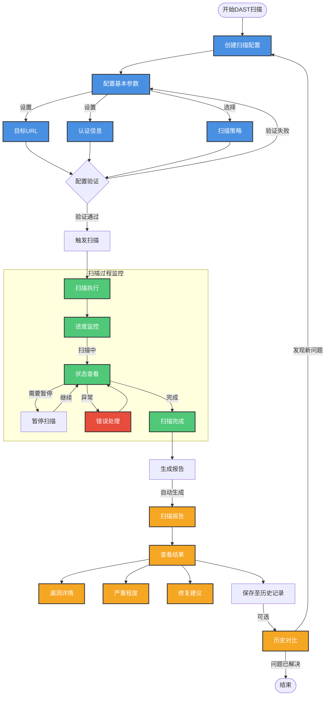
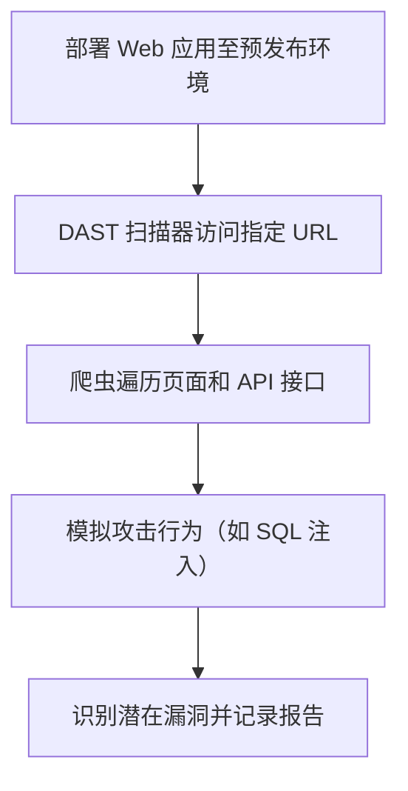
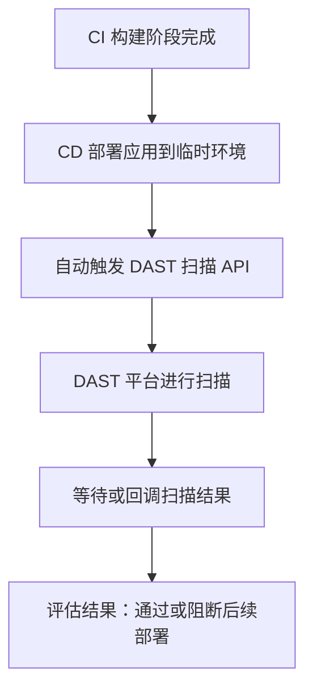
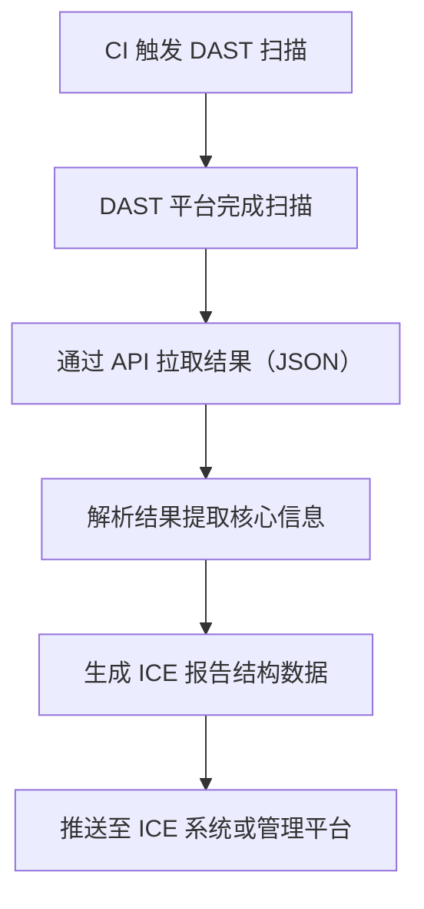

# 将动态应用安全测试（DAST）集成到CI/CD流程的综合指南



# ChatGPT  
以下是您任务的详细规划和解析，我们以**Markdown 源码**+**Mermaid 流程图**的形式输出，便于直接纳入您的平台技术文档中。

---

## **Integrate DAST Scanning to CICD Process — 概念、流程、实践规划**

---

### **(1) DAST 概念解析与与 SAST 区别**

  

#### **✅ 什么是 DAST（Dynamic Application Security Testing）**

  

DAST 是一种**黑盒测试**方法，不需要源代码，它在应用程序运行时进行测试，模拟真实攻击者从外部与应用交互，以发现安全漏洞。

```
核心特点：
- 不依赖源代码
- 扫描目标为 URL（应用已部署）
- 模拟真实攻击，如 SQL 注入、XSS 等
- 可发现运行期配置类、认证类、第三方库引发的漏洞
```

#### **✅ DAST 工作原理简述**



#### **✅ 与 SAST 的核心区别**

|**维度**|**SAST（静态应用安全测试）**|**DAST（动态应用安全测试）**|
|---|---|---|
|扫描目标|源代码|部署后的运行中的 URL|
|测试方式|白盒测试|黑盒测试|
|运行依赖|不需要部署|必须部署到 Web 环境|
|可发现问题|逻辑漏洞、代码缺陷等|运行期漏洞、配置、认证问题等|
|使用时机|CI 编译构建阶段|CD 部署后阶段|

---

### **(2) 将 DAST 集成到 CI/CD 的流程与架构**

  

#### **✅ 推荐在 CD 阶段集成 DAST**



#### **✅ 通用的自动化集成流程**

1. **部署成功后触发 DAST**
    
2. **通过 API 提交扫描任务**
    
3. **查询或异步接收扫描完成通知**
    
4. **判断结果是否存在严重漏洞**
    
5. **更新报告系统或中止部署**
    

---

### **(3) 实施方案设计（结合您已有的接口调用能力）**

  

#### **✅ CI/CD 工具集成外部 API**

|**工具**|**API 调用方式**|**密钥管理建议**|
|---|---|---|
|Jenkins|httpRequest 插件 + groovy|使用 Jenkins Credential 插件|
|GitLab CI|curl or http job|使用 GitLab Secret 变量|
|GitHub Action|curl or http job|GitHub Encrypted Secrets|

#### **✅ 配置 DAST 扫描参数**

```
{
  "target_url": "https://test-env.example.com",
  "auth_type": "form_login",
  "credentials": {
    "username": "ci_user",
    "password": "ci_password"
  },
  "scan_policy": "full",
  "callback_url": "https://ci-system/callback"
}
```

配置建议：

- **目标 URL**：使用临时预发布环境或测试环境
    
- **认证信息**：支持 form login/token 等登录机制
    
- **扫描策略**：可选 quick/full/custom
    
- **Webhook 回调**：建议异步触发后，通过回调接收结果
    

---

### **(4) 实现“自动更新 ICE 报告”的流程设计**



#### **✅ 原始结果的提取与解析**

  

示例 JSON（简化）：

```json
{
  "vulnerabilities": [
    {
      "name": "SQL Injection",
      "severity": "High",
      "url": "https://test-env.example.com/search",
      "recommendation": "Use parameterized queries."
    }
  ]
}
```

可提取字段：

|**字段名**|**含义**|
|---|---|
|name|漏洞名称|
|severity|严重等级|
|url|受影响的页面/接口|
|recommendation|修复建议|

#### **✅ 推送方式设计**

- 如果 ICE 是平台系统：直接调用平台 API 推送数据
    
- 如果为 Jira：调用 Jira API 创建 issue
    
- 如果为报告文件：自动生成 Markdown 或 PDF 报告并归档上传
    

---

### **(5) 集成挑战与最佳实践**

  

#### **✅ 扫描耗时问题：异步扫描 + Webhook**

- 不建议流水线同步等待 20-30 分钟
    
- 改为触发后直接继续，扫描平台通过回调推送状态结果
    
- 可结合 CI/CD 状态轮询机制做“后期决策”
    

  

#### **✅ 建立安全门禁策略**

```
# 示例 Gate 判断逻辑
if scan_result.contains(severity="High"):
    pipeline_fail()
else:
    continue_deploy()
```

- 根据严重等级设定阻断规则
    
- 可结合 CVSS 分数进行自动判断
    

  

#### **✅ 管理误报**

- 支持在 DAST 平台上标记误报（false positive）
    
- 或在扫描解析阶段通过漏洞 whitelist 过滤不影响流程的项
    

---

## **✅ 最终推荐工作清单**

| **步骤编号** | **任务说明**                   | **是否完成** |
| -------- | -------------------------- | -------- |
| 1        | 明确 DAST 平台接口功能、支持的参数       | ✅        |
| 2        | 在 CI/CD 中实现触发调用，配置 URL 与认证 | ✅        |
| 3        | 异步或同步方式获取扫描结果              | 🔄       |
| 4        | 构建 ICE 报告更新逻辑（解析 + 推送）     | 🔄       |
| 5        | 建立安全门禁策略与容忍标准（如拒绝高危漏洞上线）   | 🔄       |
| 6        | 完善误报机制并建立 whitelist 策略     | 🔄       |

---

如需我进一步为您生成某个 CI 工具中具体的脚本模版（如 GitLab CI .gitlab-ci.yml、Jenkinsfile 等），或是扫描 API 示例、ICE 报告转换脚本，请随时告诉我。

# 第一部分：动态应用安全测试（DAST）基础概念

在启动任何技术集成项目之前，对核心技术建立一个坚实的概念基础至关重要。本部分旨在深入剖析动态应用安全测试（DAST）的定义、工作原理、战略价值，并将其置于更广泛的应用安全（AppSec）生态系统中进行比较。

## 1.1 解构DAST：运行时安全的“黑盒”方法

动态应用安全测试（Dynamic Application Security Testing, DAST）是一种安全测试方法论，它在应用程序运行时对其进行评估，从而发现潜在的安全漏洞 1。其核心特征是采用“黑盒”测试方法，即测试工具在不访问应用程序源代码或了解其内部结构的情况下，从外部模拟攻击者的行为 2。这种方法旨在发现应用程序在真实运行环境中可能被利用的弱点，为修复工作提供宝贵的洞察 1。

DAST工具的工作流程通常遵循一个由三个主要阶段组成的逻辑序列：

**第一阶段：爬行与探测（Crawling/Spidering）**

DAST流程的第一步是全面映射应用程序的攻击面。扫描器会像搜索引擎或真实用户一样，系统性地导航应用程序的所有页面、链接、表单和功能 2。现代扫描器，如Burp Suite，通常内嵌了Chromium等浏览器引擎，使其能够有效地处理和渲染大量使用JavaScript构建的单页面应用（SPAs），确保动态生成的内容和功能也被纳入扫描范围 6。此阶段的目标是构建一个完整的站点地图，识别所有可交互的入口点。

**第二阶段：分析与攻击模拟（Analysis & Attack Simulation）**

在构建了应用程序的结构图之后，DAST工具会进入攻击阶段。它会向所有已识别的输入点（例如，URL参数、表单字段、HTTP头、API端点）发送一系列精心构造的恶意负载 2。这些负载旨在模拟常见的攻击向量，例如SQL注入（SQLi）的恶意查询字符串、跨站脚本（XSS）的恶意脚本等。这个过程通常被称为“模糊测试”（Fuzzing），即向应用程序提供非预期的、随机或半随机的数据，以触发意外行为 4。

**第三阶段：响应分析与报告（Response Analysis & Reporting）**

在发送攻击负载的同时和之后，DAST工具会密切监控并分析应用程序的HTTP响应。它会寻找异常情况、错误消息、意外的数据泄露或任何表明攻击成功的行为模式 2。例如，一个包含SQL错误的响应页面可能表明存在SQL注入漏洞。一旦检测到潜在的漏洞，工具会记录其详细信息，包括受影响的URL、使用的攻击负载、服务器的响应以及漏洞的严重性等级，最终生成一份详细的报告，供开发和安全团队进行审查和修复 2。

DAST尤其擅长发现那些只有在应用程序运行时才会暴露的漏洞类别，主要包括：
- 注入类漏洞：如SQL注入、NoSQL注入、命令注入等。
- 跨站脚本（XSS）：包括反射型、存储型和基于DOM的XSS。
- 认证与会话管理缺陷：例如，弱密码策略、会话固定、会话超时处理不当等 4。
- 服务器和基础设施配置错误：如暴露的目录、敏感文件泄露、不安全的HTTP头等 2。
- 跨站请求伪造（CSRF） 9。

## 1.2 DAST的优势：关键收益与战略价值

将DAST集成到软件开发生命周期（SDLC）中可以带来多项战略性优势，使其成为现代应用安全计划中不可或缺的一环。

- **真实的攻击者视角测试**：DAST从外部评估应用程序，其视角与真实攻击者完全一致 2。这使得它能够发现那些在理论上存在于代码中，但实际上由于环境配置、网络策略或其他运行时因素而无法被利用的漏洞，从而识别出真正具有实际威胁的、可被利用的风险点 5。
- **语言和框架无关性**：由于DAST通过标准的网络协议（主要是HTTP/HTTPS）与应用程序交互，它完全不关心应用程序的后端是使用Java、Python、Node.js还是其他任何语言编写的，也不关心使用了何种框架 10。这种“语言无关性”使其具有极高的适应性和可扩展性，能够轻松应用于包含多种技术栈的复杂企业环境中 12。
- **较低的误报率（相对而言）**：与静态分析工具相比，DAST通常产生更少的误报（False Positives） 2。这是因为DAST的发现通常基于一个成功的交互——工具发送了一个攻击负载并观察到了一个表明漏洞存在的特定响应。这种交互式的验证过程为漏洞的存在提供了更强的证据，有助于减少开发团队在无效警报上浪费的时间，从而缓解“告警疲劳” 11。
- **满足合规性与标准要求**：许多行业法规和安全标准（如支付卡行业数据安全标准PCI DSS）都要求对生产或预生产环境中的Web应用进行定期漏洞扫描 2。DAST是满足这些合规性要求的关键工具。此外，它也是验证应用程序是否遵循OWASP Top 10等行业公认安全风险列表的有效手段 15。

## 1.3 将DAST置于应用安全生态系统中（与SAST和IAST的比较）
...

```yaml
stages:
  - build
  - deploy
  - dast

#... build 和 deploy 作业定义...

dast_scan_trigger:
  stage: dast
  image: curlimages/curl:latest # 使用一个轻量级的包含curl的镜像
  script:
    - echo "Starting DAST scan on ${STAGING_APP_URL}"
    - |
      # 调用cyberflows API来启动扫描
      # 注意：这是一个示例API调用，请根据您的平台文档进行调整
      response=$(curl --request POST \
           --header "PRIVATE-TOKEN: ${CYBERFLOWS_API_TOKEN}" \
           --form "target_url=${STAGING_APP_URL}" \
           --form "config_id=12345" \
           "https://api.cyberflows.com/v1/scans")

      # 提取并保存scan_id以供后续作业使用
      scan_id=$(echo $response | jq -r.scan_id)
      echo "DAST scan started with ID: $scan_id"
      # 将scan_id保存为构件，以便下游流水线可以访问
      echo "SCAN_ID=$scan_id" > dast_scan.env
  artifacts:
    reports:
      dotenv: dast_scan.env # 使SCAN_ID可作为变量用于后续阶段
  rules:
    - if: '$CI_COMMIT_BRANCH == "staging"' # 仅在部署到staging分支时运行
```
在这个例子中，`${CYBERFLOWS_API_TOKEN}`和`${STAGING_APP_URL}`应该是您在GitLab CI/CD变量中安全配置的。作业执行后，它会启动扫描，并将返回的`scan_id`保存到一个`.env`文件中，该文件作为构件传递，以便后续的作业（如结果处理作业）可以使用它。

## 3.4 第四阶段：实施自动化安全门禁

安全门禁是将DAST扫描从一个“信息性”步骤转变为一个“强制性”控制的关键。

### 定义门禁标准
组织需要根据自身的风险承受能力来定义明确的、可量化的门禁标准。一个务实的起点是“零容忍”新增的高危或严重漏洞。

**示例标准：**
- **失败 (FAIL)**：如果 新发现的“严重(Critical)”漏洞数量 > 0。
- **失败 (FAIL)**：如果 新发现的“高危(High)”漏洞数量 > 5。
- **警告 (WARN)**：如果 新发现的“中危(Medium)”漏洞数量 > 10 (构建通过但发出警告)。

### 实施门禁逻辑
这个逻辑应该在处理扫描结果的作业中实现（无论是Webhook触发的下游流水线还是轮询作业）。
1. 脚本获取并解析扫描结果的JSON报告。
2. 脚本遍历漏洞列表，根据严重性进行计数。
3. 将计数结果与预定义的阈值进行比较。
4. 如果任何“失败”条件被满足，脚本以一个非零的退出码（例如 `exit 1`）结束。CI/CD平台会将任何以非零码退出的作业标记为“失败”，从而中止整个流水线 24。

### 表3：安全门禁标准与行动示例
| 漏洞严重性 | 新发现漏洞阈值 | 流水线行动 | 通知行动 |
| :--- | :--- | :--- | :--- |
| **严重 (Critical)** | > 0 | **失败 (FAIL)** | 立即通过Slack/Teams告警给安全团队和开发负责人 |
| **高 (High)** | > 5 | **失败 (FAIL)** | 自动创建P1优先级的Jira工单 |
| **中 (Medium)** | > 10 | **警告 (WARN)** | 自动创建P2优先级的Jira工单 |
| **低 (Low)** | > 20 | **通过 (PASS)** | 在每日报告中汇总 |

# 第四部分：自动化漏洞管理：“ICE Report”工作流

本部分将详细阐述如何实现您的核心需求之一：“Auto update ICE report”。这本质上是构建一个从DAST平台到问题跟踪系统（此处以Jira为例）的自动化数据管道。这个管道的质量直接决定了DevSecOps闭环的有效性。一个设计拙劣的管道只会产生大量无人问津的低质量工单，而一个精心设计的管道则能为开发人员提供清晰、可操作的任务，从而真正驱动漏洞修复。

## 4.1 通过API检索和解析DAST扫描结果

自动化流程的第一步是从DAST平台（cyberflows）获取机器可读的扫描结果。

### 获取报告
您的自动化脚本（推荐使用Python，因为它具有强大的数据处理和API交互能力）需要向“cyberflows”的“获取结果”API端点发送一个HTTP GET请求。这个请求通常需要包含触发扫描时获得的`scanId`作为路径参数或查询参数，并且必须包含正确的认证头 30。

### 解析JSON报告
API响应的主体大概率是一个JSON对象。脚本应使用标准的JSON库（如Python的`json`模块）将其解析为一个原生的数据结构（在Python中是字典和列表的组合），以便后续处理 52。

### 示例Python脚本（解析部分）
以下是一个Python脚本片段，演示了如何获取和解析JSON报告。
```python
import json
import requests
import os

# 从环境变量或CI/CD变量中获取必要信息
CYBERFLOWS_API_URL = "https://api.cyberflows.com/v1"
CYBERFLOWS_API_TOKEN = os.environ.get('CYBERFLOWS_API_TOKEN')
SCAN_ID = os.environ.get('SCAN_ID')

headers = {
    "Authorization": f"Bearer {CYBERFLOWS_API_TOKEN}",
    "Content-Type": "application/json"
}

# 1. 获取扫描结果
try:
    response = requests.get(f"{CYBERFLOWS_API_URL}/scans/{SCAN_ID}/results", headers=headers)
    response.raise_for_status()  # 如果HTTP状态码不是2xx，则抛出异常
    dast_report_json = response.json()
except requests.exceptions.RequestException as e:
    print(f"Error fetching DAST report: {e}")
    exit(1)

# 2. 解析漏洞数据
try:
    vulnerabilities = dast_report_json.get('vulnerabilities',)
    if not vulnerabilities:
        print("No vulnerabilities found.")
        exit(0)

    print(f"Found {len(vulnerabilities)} vulnerabilities. Proceeding to create Jira issues.")
    # 接下来将对vulnerabilities列表中的每一项进行处理
except (json.JSONDecodeError, KeyError) as e:
    print(f"Error parsing DAST report JSON: {e}")
    exit(1)
```

## 4.2 自动化问题跟踪：与Jira集成

在成功解析出漏洞数据后，下一步是将其推送到Jira。

### Jira REST API
Jira提供了丰富的REST API用于自动化操作。创建新工单的核心端点是 `/rest/api/2/issue` 55。

### 认证
与Jira API交互需要认证。标准做法是使用一个专用的服务账户的电子邮件地址和其生成的API令牌。这些凭证也必须作为安全密钥存储在CI/CD系统中，与“cyberflows”的凭证分开管理 56。

### 构建Jira工单负载
脚本需要遍历从DAST报告中解析出的每个漏洞，并为每个漏洞构建一个符合Jira API要求的JSON负载。这个负载将DAST漏洞的属性（如名称、严重性、描述）映射到Jira工单的相应字段（如标题、优先级、描述）。

### 示例Python脚本（Jira集成部分）
接续上面的脚本，以下代码演示了如何创建Jira工单。
```python
#...接续之前的解析代码...

JIRA_URL = "https://your-instance.atlassian.net"
JIRA_EMAIL = os.environ.get('JIRA_API_USER')
JIRA_TOKEN = os.environ.get('JIRA_API_TOKEN')
JIRA_PROJECT_KEY = "ICE"  # 您的ICE报告的项目密钥

def map_severity_to_priority(severity):
    """将DAST严重性映射到Jira优先级"""
    mapping = {
        "CRITICAL": "Highest",
        "HIGH": "High",
        "MEDIUM": "Medium",
        "LOW": "Low",
    }
    return {"name": mapping.get(severity.upper(), "Lowest")}

def create_jira_issue(vuln):
    """根据漏洞数据创建一个Jira工单"""
    # 4.3节将详细介绍如何构建一个高质量的描述
    description_content = f"""
    h2. 漏洞详情
    *URL:* {vuln.get('url', 'N/A')}
    *参数:* {vuln.get('parameter', 'N/A')}
    *攻击负载:* {{code}}{vuln.get('attackPayload', 'N/A')}{{code}}

    h2. 漏洞描述
    {vuln.get('description', 'No description provided.')}

    h2. 修复建议
    {vuln.get('remediation', 'No remediation advice provided.')}

    h3. 更多信息
    [点击查看Cyberflows完整报告|{vuln.get('report_link', '#')}]
    """

    issue_payload = {
        "fields": {
            "project": {"key": JIRA_PROJECT_KEY},
            "summary": f" {vuln.get('name', 'Untitled Vulnerability')} on {vuln.get('url', 'N/A')}",
            "description": description_content,
            "issuetype": {"name": "Bug"},  # 或自定义类型如 "Vulnerability"
            "priority": map_severity_to_priority(vuln.get('severity', 'LOW'))
            # 您还可以添加其他字段，如 "components", "labels" 等
            # "labels": ["dast", "automated-finding"]
        }
    }

    auth = (JIRA_EMAIL, JIRA_TOKEN)
    headers = {"Accept": "application/json", "Content-Type": "application/json"}

    try:
        response = requests.post(f"{JIRA_URL}/rest/api/2/issue", json=issue_payload, headers=headers, auth=auth)
        response.raise_for_status()
        print(f"Successfully created Jira issue: {response.json()['key']} for vulnerability: {vuln.get('name')}")
    except requests.exceptions.RequestException as e:
        print(f"Failed to create Jira issue for {vuln.get('name')}: {e.text}")

# 遍历所有漏洞并创建Jira工单
for vulnerability in vulnerabilities:
    create_jira_issue(vulnerability)
```

## 4.3 构建有效的漏洞报告

自动创建工单只是第一步，工单的质量决定了修复的效率。一个高质量的漏洞报告应为开发者提供所有必要信息，使他们能够理解问题、复现问题并着手修复，而无需进行额外的研究。

### 使工单可操作
- **标题（Summary）**：必须清晰、简洁、信息丰富。一个好的标题格式是 `<漏洞类型> on <受影响的路径或功能>`。例如： `SQL Injection on /api/v1/users endpoint` 58。
- **描述（Description）**：这是报告的核心。应避免直接粘贴原始JSON。使用Jira的标记语言（Markdown或Wiki Markup）来格式化内容，使其易于阅读。内容应包括：
    - **漏洞的简要说明**：用通俗的语言解释这是什么类型的漏洞及其潜在的业务影响。
    - **受影响的资产**：明确列出受影响的URL、参数或API端点。
    - **复现步骤（Proof of Concept）**：提供确切的HTTP请求和攻击负载，让开发者能够轻松复现该漏洞 58。
    - **修复建议**：提供具体、可操作的修复指导。引用OWASP的链接是好的，但提供针对项目技术栈的伪代码或具体建议更佳 9。
    - **上下文链接**：提供一个链接，可以直接跳转回“cyberflows”平台上的完整扫描报告，以供深入研究。

通过精心设计这个自动化流程，您不仅实现了“自动更新ICE报告”的技术目标，更重要的是，您建立了一个高效的、从发现到修复的安全反馈闭环，这是成功实施DevSecOps的关键所在。

# 第五部分：高级主题与DAST项目成熟度最佳实践

成功集成DAST只是第一步。要从这项投资中获得长期价值，需要建立一个持续改进的成熟度模型。本部分将探讨在运营DAST项目时会遇到的一些高级挑战，并提供相应的最佳实践。

## 5.1 误报的挑战：分类与调优策略

尽管DAST的误报率相对较低，但它们并非不存在 2。如果不对误报进行有效管理，它们会逐渐侵蚀开发团队对安全工具的信任，导致“告警疲劳”——即团队因频繁处理无效告警而开始忽略所有警报，包括真实的威胁 14。

### 建立分类（Triage）流程
一个结构化的分类流程是管理误报的关键。当一个新的漏洞被报告时，应遵循以下步骤：
1. **初步审查**：由安全负责人或指定团队成员对新发现的漏洞进行快速审查。
2. **验证**：尝试手动复现报告中的漏洞。这是判断其是否为真实威胁的最可靠方法。
3. **定性**：根据验证结果，将漏洞标记为以下状态之一：
    - **真阳性（True Positive）**：漏洞已确认，需要修复。
    - **假阳性（False Positive）**：漏洞无法复现，或在特定业务逻辑下不构成风险。
    - **可接受的风险（Accepted Risk）**：漏洞真实存在，但由于业务原因或修复成本过高，决定暂时接受该风险（需要记录和审批）。
4. **调优**：如果一个漏洞被确认为假阳性，最重要的一步是调整DAST扫描器的配置，以在未来的扫描中忽略这个特定的漏洞实例 61。大多数企业级DAST工具都支持创建精细的忽略规则（例如，忽略在特定URL的特定参数上发现的特定类型的漏洞）。

### 利用基于证据的扫描（Proof-Based Scanning）
现代DAST工具的一个重要发展是“基于证据的扫描”或“自动漏洞验证” 63。这类工具在发现一个潜在漏洞后，会尝试进行一次无害的、但能证明其可利用性的操作。例如，对于一个SQL注入漏洞，它可能会尝试读取数据库的版本号。如果成功，它会提供这个“利用证据”作为报告的一部分。这种能力可以自动确认大量漏洞，从源头上极大地减少误报，从而节省安全团队宝贵的分类时间。在评估或使用“cyberflows”平台时，应重点考察其是否具备类似的功能。

## 5.2 培养协作的DevSecOps文化

技术工具本身无法构建安全。将DAST嵌入流水线的目标，不是为了给开发流程增加一个障碍，而是为了将安全能力赋予开发团队，为他们提供快速、可操作的反馈 19。

### 安全是共同的责任
在DevSecOps模型中，安全不再是安全团队的专属领域，而是开发、安全和运维团队共同的责任 64。流水线中的自动化安全测试是实现这一理念的工具，它将安全检查变成了和单元测试、代码风格检查一样自然的开发环节。

### 避免成为“说不的团队”
安全团队的角色应该从传统的“门卫”转变为“顾问”和“赋能者” 19。当DAST发现问题时，安全专家的职责是帮助开发人员理解漏洞的根源和风险，并与他们合作找到最佳的修复方案，而不是简单地拒绝发布。

### 教育与赋能
预防胜于治疗。通过为开发人员提供关于常见漏洞（如OWASP Top 10）和安全编码实践的培训，可以从源头上减少漏洞的产生 43。当开发人员理解了他们代码中潜在的安全隐患时，他们会更主动地编写更安全的代码，并更积极地响应DAST报告的结果。

## 5.3 持续改进与DAST策略的未来规划

安全是一个持续演进的领域，DAST策略也应随之不断优化。

定期审查与优化
应定期（例如每季度）回顾DAST的实施效果。审查的内容应包括：扫描配置是否仍然适用？安全门禁的标准是否过于宽松或严格？误报分类流程是否顺畅？漏洞修复的平均时间（MTTR）是多少？。基于这些数据，对整个流程进行调整和优化。   

从小处着手，智能扩展
对于大型组织，一次性为所有应用启用DAST可能是不现实的。明智的策略是，从最关键的、面向公众的应用程序开始，或者从业务风险最高的几个功能模块开始 。在这些试点项目中积累经验、完善流程，然后再逐步将成功的模式推广到其他应用。   

超越传统DAST的视野
随着应用架构的演进，安全测试工具也在不断发展。当您的DAST项目成熟后，可以考虑引入更先进的技术来补充覆盖范围：

API专用安全扫描器：对于大量使用微服务和API的现代架构，通用的DAST工具可能无法提供足够的覆盖深度。此时，引入专门为REST、GraphQL等API设计的安全扫描工具会是明智之举 。   

交互式应用安全测试（IAST）：对于那些业务逻辑极其复杂或安全要求极高的核心应用，可以考虑部署IAST。IAST能够提供DAST的真实攻击模拟和SAST的代码级定位能力，以极高的准确性发现并诊断漏洞，是实现深度安全分析的有力工具 。


# 结论与建议
您当前的任务——将DAST扫描集成到CI/CD的CD阶段，并自动化更新“ICE report”——是推动组织向DevSecOps成熟模型迈进的关键一步。这不仅是一个技术项目，更是一次流程和文化的变革。

核心建议如下：

采用分层安全策略：将DAST视为应用安全防御体系中的关键一层，而非唯一的解决方案。它应与您平台已有的SAST功能协同工作，形成互补。SAST在CI阶段检查代码，DAST在CD阶段验证运行时行为。

优先解决异步架构问题：DAST扫描的耗时性是集成中最大的技术障碍。您的首要任务是调研“cyberflows”平台的API，确定其是否支持Webhook。如果支持Webhook，请务必采用“触发-回调”的异步模式，因为它最高效、最解耦。如果不支持，则设计“触发-轮询”模式作为替代方案。

将“自动更新ICE报告”视为数据管道项目：成功的关键在于生成的Jira工单质量。您的自动化脚本必须完成**提取（从DAST API获取JSON）、转换（将原始数据格式化为清晰、可操作的报告内容）和加载（通过Jira API创建工单）**的完整ETL流程。投入时间精心设计Jira工单的模板，将直接影响开发团队对该系统的接受度和漏洞修复效率。

配置决定成败：一个未经认证或范围不当的扫描是无效的。必须配置认证扫描，以覆盖登录后的关键功能。同时，要精心定义扫描范围，排除无关路径和第三方资产，以提高扫描效率和准确性。

从务实的安全门禁开始：建立一个明确的、自动化的安全门禁，例如“禁止任何新的高危或严重漏洞进入主分支”。这为流水线提供了硬性的安全保障，并将安全策略从纸面落到了实处。

建立流程，培养文化：围绕DAST工具建立误报分类和漏洞管理流程。通过培训和协作，将安全责任融入开发文化，使自动化安全测试成为赋能开发团队的工具，而非阻碍其前进的壁垒。

通过遵循本指南中概述的战略、架构和实践步骤，您的团队不仅能够成功完成此次集成任务，还能为构建一个更安全、更高效、更具韧性的软件交付体系奠定坚实的基础。


# Grok

### 动态应用程序安全测试（DAST）集成到CI/CD流程的指南

以下是关于将动态应用程序安全测试（DAST）集成到您的CI/CD流程（特别是CD阶段）并自动更新ICE报告的简明解答。我们假设您使用的是一个名为“cyberflows”的平台，该平台提供DAST功能，并且您已经可以通过接口进行简单扫描。

#### 关键要点
- **DAST概述**：DAST通过模拟外部攻击测试运行中的应用程序，以发现安全漏洞，例如SQL注入和跨站脚本攻击（XSS）。它与静态分析（SAST）不同，后者分析源代码。
- **为何在CD阶段集成**：在CD阶段，应用程序已部署到类似生产的环境，DAST可以测试实际运行状态下的漏洞。
- **实现路径**：通过API调用cyberflows的DAST功能，解析扫描结果，并将关键信息推送到ICE报告系统。
- **潜在挑战**：扫描耗时、误报（false positives）和需要认证的页面可能影响流程效率。
- **最佳实践**：在预发布环境运行DAST，使用异步扫描减少延迟，并设置安全门禁以阻止存在高危漏洞的部署。

#### DAST的工作原理
DAST工具通过向运行中的应用程序发送请求（如HTTP请求）并分析响应来识别漏洞。它不需要访问源代码，因此适用于测试已部署的应用程序。相比之下，SAST分析代码文件，无法检测运行时问题，如会话管理漏洞。

#### 集成到CI/CD的步骤
1. **部署应用程序**：在CI/CD流水线中，将应用程序部署到预发布环境。
2. **触发DAST扫描**：使用cyberflows的API触发扫描，指定目标URL和认证信息。
3. **处理结果**：获取扫描结果（通常为JSON格式），解析漏洞信息，并决定是否继续部署。
4. **更新ICE报告**：将解析后的漏洞数据格式化并推送到ICE报告系统（如Jira）。

#### 实现ICE报告自动化
- **获取结果**：通过cyberflows API获取扫描结果。
- **解析数据**：提取漏洞名称、严重性、URL和修复建议。
- **推送报告**：编写脚本将数据发送到ICE报告系统，可能涉及创建Jira工单或更新数据库。

#### 应对挑战
- **扫描耗时**：采用异步扫描，流水线触发扫描后继续运行，通过Webhook接收结果。
- **误报管理**：定期审查扫描结果，调整扫描策略以减少误报。
- **安全门禁**：设置规则，如发现高危漏洞则阻止部署。

---

### 详细报告：将DAST集成到CI/CD流程并自动更新ICE报告

以下是关于将动态应用程序安全测试（DAST）集成到CI/CD流程（特别是CD阶段）并实现ICE报告自动更新的全面指南。本报告涵盖DAST的概念解析、集成步骤、实施方案、ICE报告自动化路径以及挑战与最佳实践。我们假设您使用的是一个名为“cyberflows”的平台，该平台提供DAST功能，并且您已经可以通过接口进行简单扫描。

#### 1. DAST的概念解析

##### 1.1 DAST的工作原理
动态应用程序安全测试（DAST）是一种通过模拟外部攻击来测试运行中应用程序的安全性方法。它以“黑盒”方式操作，即测试者无需了解应用程序的内部代码或架构。DAST工具通过向应用程序发送请求（如HTTP请求）并分析响应来识别潜在漏洞，例如：
- **SQL注入**：尝试在输入字段注入恶意SQL代码以绕过认证。
- **跨站脚本攻击（XSS）**：注入恶意脚本以窃取用户数据。
- **跨站请求伪造（CSRF）**：伪造用户请求以执行未经授权的操作。
- **会话管理漏洞**：测试会话令牌是否容易被劫持。
- **业务逻辑漏洞**：发现应用程序功能设计中的安全缺陷。

DAST的独特优势在于它能够检测运行时问题，这些问题在静态代码分析中可能无法发现。例如，DAST可以识别由于配置错误或运行时环境问题导致的漏洞。

##### 1.2 DAST与SAST的对比
静态应用程序安全测试（SAST）与DAST是两种互补的安全测试方法。以下是它们的核心区别：

| **特性**                | **DAST**                                      | **SAST**                                      |
|-------------------------|-----------------------------------------------|-----------------------------------------------|
| **测试对象**            | 运行中的应用程序（URL）                       | 源代码文件                                    |
| **测试方式**            | 黑盒测试，无需访问代码                        | 白盒测试，分析代码逻辑                        |
| **检测范围**            | 运行时漏洞（如会话管理、认证问题）            | 代码级漏洞（如硬编码凭据、不安全函数调用）    |
| **适用阶段**            | 部署后（测试、预发布、生产环境）              | 开发和构建阶段                                |
| **语言无关性**          | 是，语言无关                                  | 否，依赖于代码语言                            |

**为何DAST扫描URL而非代码？**  
DAST关注应用程序的外部行为，测试其在实际运行时的响应。运行中的应用程序可能因配置、环境或动态交互而暴露漏洞，这些问题在静态代码中不可见。例如，一个配置错误的服务器可能允许未经授权的访问，而这只有在运行时测试才能发现。

##### 1.3 适用场景
在您的场景中，cyberflows平台提供DAST功能，表明您可以利用其API或工具扫描已部署的应用程序。DAST特别适合测试Web应用程序或API，因为它可以模拟真实攻击者的行为，验证应用程序在生产环境中的安全性。

#### 2. 将DAST集成到CI/CD流程

##### 2.1 最佳集成时机
在CI/CD流程中，DAST最适合在**CD（持续交付/部署）阶段**执行，具体是在应用程序部署到预发布或测试环境之后。此时，应用程序处于运行状态，接近生产环境，DAST可以有效检测运行时漏洞。相比之下，SAST通常在CI（持续集成）阶段运行，分析代码变更。

**为何选择CD阶段？**  
- **真实环境测试**：预发布环境模拟生产环境，DAST结果更具代表性。
- **及时反馈**：在部署到生产前发现漏洞，减少安全风险。
- **自动化集成**：DAST可以无缝嵌入流水线，自动化触发和结果处理。

##### 2.2 自动化工作流程
以下是将DAST集成到CI/CD流水线的通用工作流程：
1. **触发部署**：流水线构建并部署应用程序到预发布环境。
2. **调用DAST扫描**：部署成功后，通过API或插件触发DAST扫描，指定目标URL和认证信息。
3. **等待结果**：流水线等待扫描完成，或采用异步方式继续运行，通过Webhook接收结果。
4. **后续操作**：
   - 如果发现高危漏洞，流水线失败，阻止部署到生产。
   - 如果漏洞较轻，记录问题并继续部署。
   - 将扫描结果用于更新ICE报告。

##### 2.3 架构设计
集成DAST的CI/CD架构包括以下组件：
- **CI/CD工具**：如Jenkins、GitLab CI或GitHub Actions，用于管理流水线。
- **DAST工具**：cyberflows的DAST功能，通过API或插件与流水线交互。
- **目标环境**：预发布或测试环境，运行待扫描的应用程序。
- **报告系统**：ICE报告存储系统（如Jira、内部漏洞管理平台）。

**示例架构**：
```
[代码提交] → [CI: 构建与测试] → [CD: 部署到预发布] → [DAST扫描] → [结果分析] → [ICE报告更新] → [生产部署（若通过）]
```

#### 3. 实施方案

##### 3.1 调查与配置
- **调查cyberflows API**：
  - 确认cyberflows DAST的API文档，了解触发扫描和获取结果的端点。
  - 示例API调用可能如下：
    - 触发扫描：`POST /scan`（参数：URL、认证信息、扫描策略）
    - 获取结果：`GET /results/{scan_id}`
  - 测试API以确保其功能正常。
- **CI/CD工具选择**：
  - 假设您使用Jenkins（常见工具），也可根据实际使用GitLab CI或GitHub Actions。
  - 确保工具支持API调用和凭据管理。
- **安全管理API密钥**：
  - 将cyberflows API密钥存储在Jenkins的凭据管理中，避免硬编码。
  - 示例：在Jenkins中配置凭据：
    ```
    凭据ID：cyberflows-api-key
    类型：Secret text
    值：<您的API密钥>
    ```

##### 3.2 配置DAST扫描任务
- **目标URL**：指定预发布环境的应用程序URL（如`https://staging.example.com`）。
- **认证信息**：如果应用程序需要登录，提供用户名/密码或会话令牌。
  - 示例：为需要认证的页面配置会话令牌：
    ```json
    {
      "url": "https://staging.example.com",
      "auth": {
        "type": "token",
        "value": "Bearer <token>"
      }
    }
    ```
- **扫描策略**：
  - **快速扫描**：适用于CI/CD流水线，减少耗时。
  - **全量扫描**：定期运行，覆盖更多漏洞类型。

##### 3.3 集成到Jenkins流水线
以下是一个示例Jenkins流水线脚本，展示如何在CD阶段调用DAST扫描：

```groovy
pipeline {
    agent any
    stages {
        stage('Build') {
            steps {
                echo '构建应用程序...'
                // 构建步骤
            }
        }
        stage('Deploy to Staging') {
            steps {
                echo '部署到预发布环境...'
                // 部署步骤
            }
        }
        stage('DAST Scan') {
            steps {
                withCredentials([string(credentialsId: 'cyberflows-api-key', variable: 'API_KEY')]) {
                    sh '''
                    curl -X POST https://cyberflows-api.com/scan \
                    -H "Authorization: Bearer $API_KEY" \
                    -H "Content-Type: application/json" \
                    -d '{"url": "https://staging.example.com", "auth": {"username": "user", "password": "pass"}, "policy": "quick"}'
                    '''
                }
            }
        }
        stage('Process Results') {
            steps {
                withCredentials([string(credentialsId: 'cyberflows-api-key', variable: 'API_KEY')]) {
                    sh '''
                    # 获取扫描结果
                    curl -X GET https://cyberflows-api.com/results/scan_id \
                    -H "Authorization: Bearer $API_KEY" > results.json
                    
                    # 解析结果（示例使用jq）
                    jq '.vulnerabilities[] | select(.severity == "Critical")' results.json > critical_vulns.json
                    
                    # 如果存在高危漏洞，失败流水线
                    if [ -s critical_vulns.json ]; then
                        echo "发现高危漏洞，部署失败"
                        exit 1
                    fi
                    '''
                }
            }
        }
    }
}
```

##### 3.4 自动化ICE报告更新
- **获取扫描结果**：
  - 通过cyberflows API获取JSON或XML格式的扫描结果。
  - 示例结果结构：
    ```json
    {
      "scan_id": "12345",
      "vulnerabilities": [
        {
          "name": "SQL Injection",
          "severity": "Critical",
          "url": "https://staging.example.com/login",
          "fix": "Sanitize user inputs"
        },
        {
          "name": "XSS",
          "severity": "Medium",
          "url": "https://staging.example.com/search",
          "fix": "Escape HTML outputs"
        }
      ]
    }
    ```
- **解析结果**：
  - 使用脚本（如Python）提取关键信息：漏洞名称、严重性、URL、修复建议。
- **推送报告**：
  - 假设ICE报告存储在Jira，编写脚本创建工单。
  - 示例Python脚本：

```python
import requests
import json

# 获取DAST扫描结果
response = requests.get('https://cyberflows-api.com/results/12345', headers={'Authorization': 'Bearer <API_KEY>'})
results = response.json()

# 提取漏洞
vulnerabilities = results['vulnerabilities']

# 配置Jira
jira_url = 'https://jira.example.com/rest/api/2/issue'
jira_auth = ('jira_user', 'jira_password')

# 为每个高危漏洞创建Jira工单
for vuln in vulnerabilities:
    if vuln['severity'] == 'Critical':
        issue_data = {
            'fields': {
                'project': {'key': 'SEC'},
                'summary': f'Critical Vulnerability: {vuln["name"]}',
                'description': f'URL: {vuln["url"]}\nSeverity: {vuln["severity"]}\nFix: {vuln["fix"]}',
                'issuetype': {'name': 'Bug'}
            }
        }
        response = requests.post(jira_url, auth=jira_auth, json=issue_data)
        if response.status_code == 201:
            print(f'Created Jira issue for {vuln["name"]}')
        else:
            print(f'Failed to create Jira issue: {response.text}')
```

#### 4. 挑战与最佳实践

##### 4.1 挑战
- **扫描耗时**：
  - **问题**：DAST扫描可能需要数分钟到数小时，影响流水线速度。
  - **解决方案**：采用异步扫描，流水线触发扫描后继续运行，通过Webhook接收结果。
    - 示例Webhook配置：
      ```json
      {
        "webhook_url": "https://jenkins.example.com/dast-callback",
        "event": "scan_completed"
      }
      ```
- **误报（False Positives）**：
  - **问题**：DAST可能报告不存在的漏洞，浪费开发时间。
  - **解决方案**：定期审查扫描结果，调整扫描策略（如排除特定URL）。
- **认证复杂性**：
  - **问题**：需要登录的页面可能难以扫描。
  - **解决方案**：为DAST工具提供会话令牌或模拟登录流程。

##### 4.2 最佳实践
- **在预发布环境运行**：始终在接近生产的环境中运行DAST扫描，以确保结果准确。
- **设置安全门禁**：定义标准（如无高危漏洞），若不满足则阻止生产部署。
  - 示例规则：
    ```
    如果存在任何“Critical”或“High”严重性漏洞，流水线失败。
    ```
- **结合其他工具**：将DAST与SAST、SCA（软件成分分析）结合，全面覆盖安全测试。
- **定期优化**：根据应用程序变化更新DAST配置，减少误报和漏报。

#### 5. 当前状态分析
- **已知信息**：
  - 您可以通过接口调用cyberflows进行简单扫描，表明已有API访问权限。
  - 目标是将DAST集成到CD阶段并自动化ICE报告更新。
- **假设**：
  - ICE报告是一个跟踪漏洞和合规性的系统，可能与Jira或其他平台集成。
  - 您使用Jenkins或其他主流CI/CD工具。
- **下一步**：
  - 获取cyberflows DAST API的详细文档。
  - 测试API以验证扫描和结果获取功能。
  - 实现流水线集成和ICE报告自动化脚本。
  - 在预发布环境测试整个流程。

#### 6. 总结与行动计划
要实现DAST集成和ICE报告自动化，请执行以下步骤：
1. **确认cyberflows DAST功能**：
   - 获取API文档，测试触发扫描和获取结果。
2. **配置CI/CD流水线**：
   - 在Jenkins中添加DAST扫描阶段，使用API调用cyberflows。
   - 处理扫描结果，设置安全门禁。
3. **实现ICE报告自动化**：
   - 编写脚本解析DAST结果并推送到ICE报告系统。
4. **测试与优化**：
   - 在预发布环境测试流水线，监控扫描耗时和误报。
   - 根据反馈调整配置。

#### 参考资料
- [动态应用程序安全测试（DAST）概述](https://www.crowdstrike.com/en-us/cybersecurity-101/cloud-security/dynamic-application-security-testing-dast/)
- [将DAST集成到CI/CD流水线](https://hackernoon.com/integrating-dast-into-your-cicd-pipeline-benefits-and-implementation)
- [Jenkins与DAST集成](https://beaglesecurity.com/blog/article/dast-in-jenkins-ci-cd-pipeline.html)
- [自动化DAST扫描](https://www.veracode.com/blog/veracode-dynamic-analysis-jenkins-integrate-dast-into-your-ci-cd-pipeline/)

通过遵循上述指南，您可以成功将DAST集成到CI/CD流程并实现ICE报告的自动化更新，从而提升应用程序的安全性和合规性。