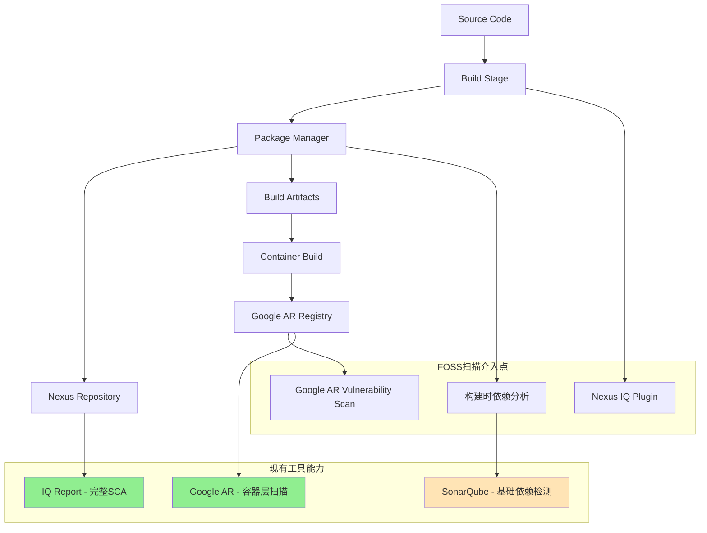
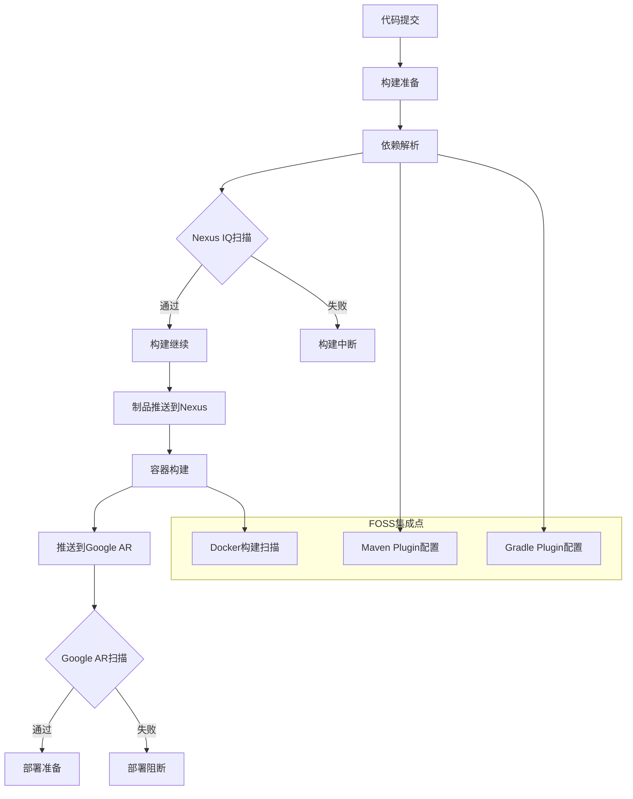
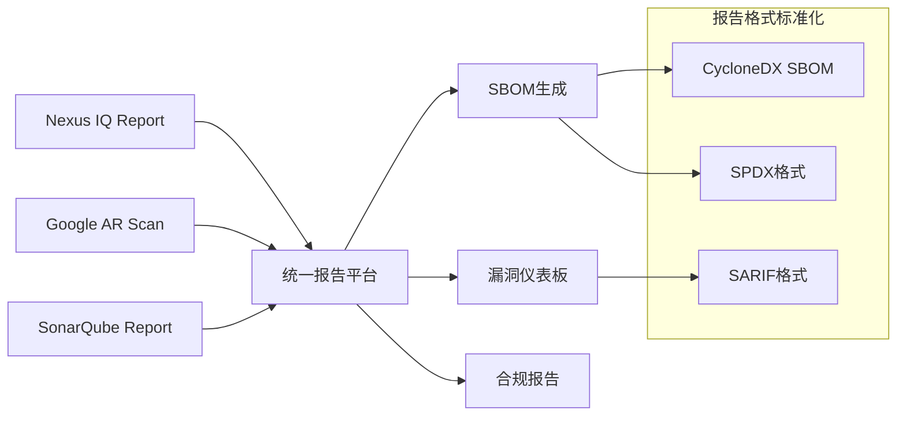
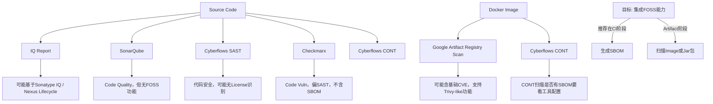

# Q 
在我们平台比如要去支持DAST扫描的前提下,如果我们想要Cyberflows里的FOSS.那么基于平台层面能做到哪些跟FOSS有关的事情?或者我在那个节点介入FOSS?pipeline. 我需要一些基础知识 还有可行性分析

看起来这是一个CI阶段就可以干预的扫描. 

|   |   |   |
|---|---|---|
|**方案类型**|**可行方式**|**建议工具或产品**|
|**CI/Pipeline** **插件**|在代码编译阶段分析开源依赖|Syft + Grype，OSS Review Toolkit, Trivy, Snyk|
|**容器镜像分析**|分析 Docker 镜像中的包依赖|Trivy, Anchore, Clair|
|**构建期间扫描**|拦截 Maven、npm、pip 等包管理器下载的依赖|使用 Artifactory + Xray 或 Snyk CLI|

  

上面FOSS 的可行方案看起来都比较适合我们,或者说具备了可行性?或者拓展下你可以可以推荐?  
当然上面的那些工具我们可能不具备或者没有,我需要你根据我目前在使用的产品来逆推出我们可以用使用的工具,或者 说

根据我们现在pipeline里面集成的工具或者扫描有 IQ Report . SnoarQube . Cyberflows SAST  . Docker Image Google AR scan . Cyberflows CONT scan. Checkmarx 还有DAST扫描 

来推导推荐工具/产品的,如何映射我的现状与推荐工具之间的对应关系,以及这些工具会生成哪些报告类型（或文件)

  

我们现在CI的包 会同时放在Google的GAR里面和Nexus这里是否可以拿到一些报告,起码可以出一个推荐?

  

基于上面这些信息我现在要在我的平台上集成FOSS,那么我可以在哪里介入,以及使用那些现有的工具?最好是我已经引入的工具.当然工具名称我不知道,我只知道目前已经的这些报告.需要你根据报告分析出我已经有的工具.关于这部分可以给我一个MAPPing 图

(1) 分析用户提供的现有扫描报告名称（如 IQ Report, SonarQube, Google AR scan 等），以逆向推断出其当前正在使用的具体安全工具栈及其核心功能（SAST, DAST, SCA）。 (2) 明确指出在推断出的工具中，哪些已经具备FOSS（开源软件）扫描或SCA（软件成分分析）的能力。特别关注“IQ Report”与Sonatype Nexus IQ、“Google AR scan”与Google Artifact Registry内置扫描功能之间的关联。 (3) 详细阐述这些已有的FOSS扫描工具可以在CI/CD流水线的哪些具体节点进行介入，例如： (a) 在代码构建阶段（如Maven, npm）通过Nexus IQ插件进行依赖分析。 (b) 在制品推送到Nexus仓库时进行自动扫描。 (c) 在容器镜像推送到Google Artifact Registry (GAR)时触发自动扫描。 (4) 评估用户列出的备选方案（如Syft, Trivy, Snyk）与他们现有工具（特别是Nexus IQ和Google AR扫描）的功能重叠和差异，分析引入新工具的必要性。 (5) 详细说明已有的工具（Nexus IQ, Google AR Scan）能够生成的报告类型，例如软件物料清单（SBOM，如CycloneDX或SPDX格式）、漏洞详情报告、许可证合规性报告等。 (6) 创建一个清晰的映射图或表格，将用户的现状与FOSS解决方案对应起来，内容应包括： (a) 现有报告/扫描名称 (b) 推断出的具体工具 (c) 工具的安全职能（SAST/SCA） (d) 如何利用该工具实现FOSS扫描 (e) 推荐的流水线集成点 (7) 基于分析，提供一份综合性的可行性分析和最终建议，重点说明如何最大化利用其现有工具（特别是Nexus IQ和Google AR扫描）来构建强大的FOSS治理能力，而不是盲目引入新工具。


# Claude

基于您现有的扫描报告和工具栈，我来分析您的FOSS集成可行性：

## 现有工具栈分析与映射

### 工具推断与能力分析

|报告名称|推断工具|核心功能|FOSS/SCA能力|报告类型|
|---|---|---|---|---|
|IQ Report|Sonatype Nexus IQ|SCA/依赖分析|✅ 完整FOSS扫描|JSON/XML/PDF, SBOM|
|SonarQube|SonarQube|SAST/代码质量|⚠️ 部分依赖检测|JSON/XML报告|
|Google AR scan|Google Artifact Registry|容器扫描|✅ 容器层FOSS扫描|JSON格式漏洞报告|
|Cyberflows SAST|自定义/集成SAST|静态代码分析|❌ 无SCA能力|自定义格式|
|Cyberflows CONT|自定义容器扫描|容器安全|⚠️ 可能包含依赖扫描|自定义格式|
|Checkmarx|Checkmarx SAST|静态代码分析|❌ 无SCA能力|CxSAST报告|
|DAST扫描|动态扫描工具|运行时安全|❌ 无SCA能力|漏洞报告|

## FOSS集成架构与介入点



## 基于现有工具的FOSS集成方案

### 1. 主要FOSS能力工具

#### Nexus IQ (IQ Report)

- **介入点**: Maven/Gradle构建阶段，Nexus仓库推送时
- **能力**: 完整的软件成分分析，许可证合规检查
- **报告格式**:
    
    ```json
    {  "applicationId": "app-name",  "scanDate": "2024-01-01",  "components": [    {      "displayName": "spring-boot-starter",      "version": "2.7.0",      "vulnerabilities": [],      "licenses": ["Apache-2.0"]    }  ]}
    ```
    

#### Google Artifact Registry扫描

- **介入点**: 容器镜像推送时自动触发
- **能力**: 容器层面的依赖漏洞扫描
- **报告格式**:
    
    ```json
    {  "vulnerabilities": [    {      "name": "CVE-2023-1234",      "package": "libssl1.1",      "severity": "HIGH",      "fixAvailable": true    }  ]}
    ```
    

### 2. CI/CD流水线集成策略



### 3. 现有工具最大化利用方案

#### 立即可用的FOSS能力

**Nexus IQ集成**:

```yaml
# Maven pom.xml配置
<plugin>
    <groupId>org.sonatype.plugins</groupId>
    <artifactId>nexus-staging-maven-plugin</artifactId>
    <configuration>
        <nexusUrl>https://your-nexus-url</nexusUrl>
        <serverId>nexus</serverId>
        <autoReleaseAfterClose>false</autoReleaseAfterClose>
        <stagingProfileId>your-profile-id</stagingProfileId>
    </configuration>
</plugin>
```

**Google AR扫描启用**:

```bash
# 启用容器扫描
gcloud container images scan IMAGE_URL --project=PROJECT_ID

# 获取扫描结果
gcloud container images list-tags IMAGE_URL \
    --filter="tags:*" \
    --format="table(digest,tags,timestamp)"
```

### 4. 功能补强建议

|现有工具|当前FOSS能力|建议增强|实现方式|
|---|---|---|---|
|Nexus IQ|✅ 完整SCA|策略优化|配置更严格的策略规则|
|Google AR|✅ 容器扫描|报告集成|API集成获取扫描结果|
|SonarQube|⚠️ 基础检测|插件增强|集成Dependency-Check插件|
|Cyberflows|❌ 无SCA|工具集成|可考虑集成Syft/Grype|

### 5. 报告统一与可视化



## 最终建议

### 短期实施 (已有工具最大化)

1. **强化Nexus IQ策略配置**，确保所有Maven/Gradle项目都经过扫描
2. **启用Google AR自动扫描**，配置CI/CD获取扫描结果
3. **SonarQube集成Dependency-Check**，增强依赖检测能力

### 中期优化 (工具整合)

1. **统一报告格式**，将各扫描结果转换为SBOM标准格式
2. **建立FOSS治理流程**，定义漏洞响应和修复流程
3. **集成现有Cyberflows平台**，实现FOSS扫描结果的统一展示

### 长期规划 (能力增强)

1. **考虑引入Trivy**作为轻量级补充扫描工具
2. **建立供应链安全基线**，实现全链路FOSS治理
3. **集成威胁情报**，提升漏洞响应速度

您现有的Nexus IQ和Google AR已经具备了强大的FOSS扫描能力，建议优先最大化利用这些工具，而不是引入新的扫描工具。

# Gemini
# 在您的CI/CD平台中集成FOSS安全扫描的全面战略与实施指南

## 第一部分：解析您现有的应用安全工具集以进行FOSS分析

为了在您的平台中成功集成自由和开源软件（FOSS）安全扫描，即软件成分分析（SCA），首要任务是全面盘点并理解您当前已部署的安全工具。您目前依赖于一系列扫描报告，如“IQ Report”、“SonarQube报告”和“Google AR scan报告”。本节旨在将这些报告映射到具体的商业工具，并深入评估它们在FOSS/SCA领域的独特能力，为您制定统一战略奠定坚实的基础。

### 1.1 将您的报告映射到工具组合

通过分析您提供的报告名称和行业标准，我们可以明确地将它们与您技术栈中已存在的强大安全工具对应起来。这种映射将模糊的报告名称转化为一个清晰的能力清单。

- **IQ Report**: 这明确指向由 **Sonatype Nexus IQ Server**（也称为 **Sonatype Lifecycle**）生成的 **Sonatype应用成分报告（Application Composition Report）**。Sonatype是SCA领域的市场领导者，提供专门且功能强大的SCA解决方案 1。
    
- **SonarQube Report**: 此报告由 **SonarQube** 平台生成。尽管SonarQube以其静态应用安全测试（SAST）和代码质量分析而闻名，但其“高级安全（Advanced Security）”版本包含了一个强大的SCA模块，能够在统一的工作流中检测第三方库的风险 4。
    
- **Checkmarx Report**: 该报告源自 **Checkmarx One** 平台。与SonarQube类似，这是一个综合性平台，除了其行业领先的SAST能力外，还提供了一个专门的 **Checkmarx SCA** 模块，用于整合分析第一方和第三方代码中的风险 7。
    
- **Google AR scan Report**: 这指的是 **Google Artifact Analysis** 提供的漏洞扫描结果，该服务原生集成在 **Google Artifact Registry (GAR)** 中。它为您的容器化制品提供自动化的安全扫描 10。
    
- **Cyberflows SAST / CONT scan**: 这些名称似乎是您内部平台或工作流的命名，用于编排各类扫描任务。“Cyberflows SAST”很可能触发您的SAST工具（如SonarQube、Checkmarx），而“Cyberflows CONT scan”则触发容器扫描（如Google AR scan）。这表明您已经拥有一个编排层，这是实施本报告所提战略的关键资产。
    

### 1.2 对每种工具FOSS/SCA能力的专家级评估

您的技术栈不仅已经具备FOSS扫描能力，而且拥有一个功能互补、堪称典范的工具组合。每个工具都有其独特的优势和侧重点，理解这些差异是制定高效策略的关键。

- **Sonatype Nexus IQ / Lifecycle**:
    
    - **核心功能**: Sonatype通过深度二进制和清单文件分析，实现对直接和传递性依赖项的全面识别 3。它采用先进的二进制指纹技术（Advanced Binary Fingerprinting, ABF），能够精确匹配组件，即使它们在构建过程中被重命名或嵌入，从而极大地提高了准确性并减少了误报 13。
        
    - **关键优势**: 核心优势在于其**策略驱动的自动化**。Sonatype的设计围绕一个强大的策略引擎，允许您在整个软件开发生命周期（SDLC）中强制执行关于安全、许可证和架构合规性的规则 3。其与Nexus Repository集成的
        
        **Nexus Firewall**功能是独一无二的，它可以在组件被下载到您的内部环境之前，在存储库层面主动拦截不合规的组件，提供了一道强大的外围防线 15。
        
- **SonarQube Advanced Security**:
    
    - **核心功能**: 识别第三方依赖项中的已知漏洞（CVEs）和许可证合规性问题 4。
        
    - **关键优势**: 核心优势在于其**集成化分析**。SonarQube的SCA功能并非孤立存在，而是与其SAST引擎紧密结合。它能够执行“高级SAST（Advanced SAST）”，分析您的**第一方代码与第三方库之间的交互**，从而识别出那些不仅存在，而且在您的应用中被实际调用、可能被利用的漏洞 6。这种上下文感知的分析能力是独立SCA工具所不具备的，它能帮助您更精准地评估风险。
        
- **Checkmarx SCA**:
    
    - **核心功能**: 识别开源组件中的漏洞和许可证风险 7。
        
    - **关键优势**: 核心优势在于通过**“可利用路径（Exploitable Path）”分析进行风险排序**。与SonarQube类似，Checkmarx利用其SAST引擎来确定依赖项中的脆弱方法是否被您的应用程序实际调用。这使得团队能够将精力集中在构成最大实际威胁的漏洞上 7。此外，Checkmarx拥有专门的安全研究团队，能够发现公共漏洞数据库（如NVD）之外的独家漏洞 7。
        
- **Google Artifact Analysis (in GAR)**:
    
    - **核心功能**: 在容器镜像被推送到GAR时，自动进行“on-push”扫描和持续分析，覆盖操作系统（OS）层面和应用语言包（如Maven, npm）的漏洞 10。
        
    - **关键优势**: 核心优势在于其**GCP生态系统集成**。扫描结果不仅是一份静态报告，而是结构化的元数据对象（称为“Occurrences”）。这些元数据可以被用于驱动策略执行，例如通过**Binary Authorization**服务阻止含有严重漏洞的镜像部署到Google Kubernetes Engine (GKE)，或者将所有项目的漏洞发现在**Security Command Center**中进行集中聚合与管理 11。
        

您当前的处境并非能力不足，而是“能力过剩”。挑战不在于购买新工具，而在于如何激活、整合并编排您已拥有的强大功能，以避免工具重叠和告警疲劳。一个明确的战略是必要的，以指定“事实来源（source of truth）”并实现工具间的协同效应。

**表1：现有工具与报告到FOSS/SCA能力的映射**

|您提及的报告名称|推断的工具/平台|主要功能|FOSS/SCA 能力|对您平台的关键优势|
|---|---|---|---|---|
|IQ Report|Sonatype Nexus IQ / Lifecycle|软件成分分析 (SCA)|深度依赖分析、策略执行、许可证管理|通过Nexus Firewall提供主动的、存储库级别的组件拦截和隔离。|
|SonarQube Report|SonarQube|代码质量与SAST|作为“高级安全”的一部分提供SCA功能|分析第一方代码与第三方库的交互，识别真正可被利用的漏洞。|
|Checkmarx Report|Checkmarx One Platform|综合应用安全测试 (AST)|提供集成的SCA模块|通过“可利用路径”分析，精确评估漏洞的实际风险，优化修复优先级。|
|Google AR scan|Google Artifact Analysis|容器镜像扫描|自动扫描OS包和应用语言包|与GCP生态（如Binary Authorization, SCC）深度集成，实现部署门禁控制。|
|DAST扫描|动态应用安全测试工具|运行时应用安全测试|不直接提供SCA功能|关注运行中应用的漏洞，与SCA形成互补。|

## 第二部分：在您的CI/CD流水线中设定FOSS战略集成点

明确了您拥有的工具及其能力后，下一步是回答核心问题：“我们应该在哪个节点介入FOSS扫描？”。答案不是单一的，而是一个多层次的纵深防御战略。通过在软件开发生命周期（SDLC）的多个阶段集成扫描，您可以实现“左移（Shift Left）”，即尽早发现并修复问题，从而最大程度地降低风险和修复成本。

### 2.1 “左移”指令：一个多层次的防御战略

“左移”的核心理念是在开发流程的每个关键节点嵌入自动化安全检查，而不是等到流程末端才进行一次性的安全审计。这种方法论的目标是：在早期阶段为开发者提供快速、上下文相关的反馈，而在后期阶段则设置严格的、自动化的门禁控制。您的工具集完美地支持了这种分层策略 3。

### 2.2 第一阶段：开发者环境（IDE与源代码控制）

- **目标**: 在代码编写阶段向开发者提供实时反馈，从源头上防止引入有漏洞的依赖。
    
- **工具与集成**:
    
    - **Sonatype Lifecycle**: 提供适用于主流IDE（如IntelliJ, VS Code, Eclipse）的插件，当开发者添加或选择依赖项时，能够立即提供安全和许可证风险反馈 3。
        
    - **SonarQube**: 其 **SonarLint** IDE插件可以配置为“连接模式（Connected Mode）”，直接在IDE中应用服务器端定义的规则，实时发现问题 22。
        
- **介入节点**: 开发者的本地工作站，可通过IDE插件或本地预提交钩子（pre-commit hooks）实现。
    

### 2.3 第二阶段：拉取请求/合并请求门禁（Pull Request / Merge Request Gate）

- **目标**: 在代码变更被合入主干分支之前，自动进行分析，并将结果直接反馈到PR/MR界面，作为代码审查的一部分。
    
- **工具与集成**:
    
    - **Sonatype Lifecycle**: 可与主流SCM系统（如GitHub, GitLab）集成，扫描PR并以评论或状态检查（status checks）的形式提供反馈 25。
        
    - **SonarQube**: 在此阶段表现出色，能够用代码质量和安全问题的分析结果“装饰”PR界面，提供直观的反馈 22。
        
    - **Checkmarx**: 同样支持基于PR的自动化扫描和反馈机制 7。
        
- **介入节点**: 由CI/CD系统中的 `on: pull_request` 事件触发（例如，在Jenkins、GitHub Actions或GitLab CI中配置）。
    

### 2.4 第三阶段：持续集成构建流水线（CI Build Pipeline）

- **目标**: 在主构建流程中执行一次全面的、可阻塞的扫描。这是主要的策略强制执行门禁。
    
- **工具与集成**:
    
    - **Sonatype Nexus IQ**: 是此阶段最理想的核心工具。通过使用 **Sonatype CLM for Maven** 插件 26 或
        
        **Sonatype Platform Plugin for Jenkins** 28，您可以执行完整的策略评估，并根据策略违规情况
        
        **失败构建（fail the build）**。
        
    - **SonarQube** 和 **Checkmarx SCA**: 也可以在此阶段运行，以收集它们独特的、与SAST结合的深度分析洞见，用于风险排序而非构建失败。
        
- **介入节点**: 在您的CI流水线（如Jenkins Pipeline）中设立一个专门的“安全扫描”阶段，通常在代码编译和打包之后，部署之前。
    

### 2.5 第四阶段：制品存储库（Artifact Repository）

- **目标**: 控制进入您组织的组件流，并对静态存储的制品进行持续监控，以发现新披露的漏洞。
    
- **工具与集成**:
    
    - **Nexus Repository + Sonatype Firewall**: 这是您的第一道防线。配置您的Nexus代理存储库（Proxy Repository）接受IQ Server的审计。这使您能够制定策略，对新下载的不合规组件进行**隔离（Quarantine）**，即阻止开发者和构建系统下载这些有风险的组件 15。
        
    - **Google Artifact Registry (GAR)**: 这是您的最后一道防线。当容器镜像被推送到GAR时，它们会被自动扫描。这些数据应服务于两个目的：
        
        1. **持续监控**: GAR会持续地对存储的镜像进行重新评估，以发现新出现的漏洞 10。
            
        2. **部署门禁**: 与 **Binary Authorization** 集成，创建策略，阻止含有严重漏洞的镜像被部署到GKE生产环境 11。
            

您技术栈中最强大且可能未被充分利用的能力，正是这些主动的、存储库级别的控制措施。大多数组织将安全扫描视为CI流水线中的一个“检查”步骤，但您的工具能够从根本上改变制品的流动方式。Sonatype Firewall作用于从外部拉取组件的`pull`动作，而GAR/Binary Authorization作用于向运行时部署的`deploy`动作。这代表了从“扫描和报告”的被动检测，到“门禁和拦截”的主动防御的范式转变。

此外，需要特别关注一个潜在的风险点：Google Artifact Analysis的持续分析功能仅对过去30天内被推送或拉取过的镜像有效 10。对于那些稳定、长期运行且不经常更新的服务的镜像，这会形成一个安全盲区。一个关键的运营建议是，建立一个定期的“维护”任务，周期性地

`pull`关键的生产镜像，以重置这个30天的计时器，确保它们能够持续地根据最新的CVE信息进行重新评估。

**表2：FOSS/SCA工具集成点与目标**

|流水线阶段|目标|主要推荐工具|补充工具|关键输出/行动|
|---|---|---|---|---|
|**开发者IDE**|实时反馈，源头预防|Sonatype IDE 插件, SonarLint|-|在编码时提供即时警告和修复建议。|
|**拉取请求 (PR)**|自动化代码审查，防止问题合入主干|SonarQube, Sonatype SCM 集成|Checkmarx SCA|在PR界面提供评论、状态检查，作为合并决策依据。|
|**CI 构建**|全面扫描，强制执行策略|**Sonatype Nexus IQ**|SonarQube, Checkmarx SCA|**失败构建**，阻止不合规代码进入下一阶段。|
|**Nexus 存储库**|阻止风险组件进入组织生态|**Sonatype Firewall**|-|**隔离 (Quarantine)** 不合规的组件，阻止下载。|
|**GAR 存储库**|持续监控，控制生产部署|**Google Artifact Analysis**|-|持续更新漏洞数据，并通过Binary Authorization**阻止部署**。|

## 第三部分：FOSS扫描的实践性实施蓝图

本节将提供具体、可操作的指南，指导您如何配置和使用现有工具，以执行前一节中定义的多层次战略。我们将以Sonatype Nexus IQ为核心，辅以其他工具的独特能力，构建一个强大而协调的FOSS安全体系。

### 3.1 主要战略：以Sonatype Nexus IQ为您的FOSS项目核心

**理由**: Sonatype是您技术栈中的SCA专家，拥有最成熟的策略引擎和独特的Firewall能力。因此，它应成为您定义和执行FOSS安全与许可证策略的中心枢纽。

#### 3.1.1 激活Sonatype Firewall与Nexus Repository

这是实现主动防御的关键步骤，能从源头阻止风险流入。

- **配置步骤**: 遵循官方文档指引，将您的Nexus Repository Manager实例连接到IQ Server 31。这通常涉及在Nexus管理界面的“IQ Server”部分，填写IQ Server的URL和认证凭据（推荐使用专门的服务账户和令牌）。
    
- **启用审计与隔离**: 在Nexus的“Capabilities”管理中，为您的代理存储库（例如，代理Maven Central或npm的仓库）添加并启用“IQ: Audit and Quarantine”能力 31。
    
- **策略配置**: 在IQ Server的用户界面中，针对“Proxy”阶段设置策略行为。将策略的动作配置为“Fail (Quarantine)”，即可触发对违反该策略的组件的隔离 16。例如，您可以设置一条策略：“禁止任何包含CVSS评分9.0以上漏洞的组件通过代理”。
    
- **API控制**: 对于自动化管理，Sonatype提供了REST API来配置和验证连接，以及管理审计和隔离状态 30。
    

#### 3.1.2 将扫描集成到CI流水线（以Jenkins为例）

这是实现构建时门禁控制的核心。

- **插件安装**: 确保已安装“Sonatype Platform Plugin for Jenkins” 29。
    
- **配置**: 在Jenkins的系统配置中，添加您的IQ Server实例信息（URL、凭据），并测试连接 33。
    
- **流水线集成**: 在您的Jenkins Pipeline脚本中，使用`nexusPolicyEvaluation`步骤。这是一个声明式的配置，非常易于使用 28。
    
    Groovy
    
    ```
    stage('Sonatype IQ Scan') {
        steps {
            script {
                // 'iq-server' 是您在Jenkins系统配置中定义的IQ实例ID
                // 'my-cool-app' 是您在IQ Server中定义的Application ID
                def report = nexusPolicyEvaluation iqApplication: 'my-cool-app', iqStage: 'build', iqServer: 'iq-server'
    
                // 报告摘要会默认嵌入到Jenkins构建页面
                // 您可以根据report对象的属性进行更复杂的逻辑判断
                if (report.policyEvaluationResult == 'FAILURE') {
                    // 插件默认会根据策略结果使构建失败或不稳定
                    // 这里可以添加额外的通知逻辑
                    echo "Policy evaluation failed. See the Sonatype report for details."
                }
            }
        }
    }
    ```
    
- **构建控制**: 在插件配置中，务必勾选“Fail build on policy violation”相关选项，以确保策略违规能够有效阻止流水线的继续执行 28。
    

#### 3.1.3 针对基于Maven的项目

对于直接使用Maven构建的项目，可以使用专门的Maven插件。

- **插件配置**: 在项目的`pom.xml`或全局的`settings.xml`中，配置`clm-maven-plugin`。关键参数是`<serverUrl>`和`<applicationId>` 26。
    
    XML
    
    ```
    <build>
        <plugins>
            <plugin>
                <groupId>com.sonatype.clm</groupId>
                <artifactId>clm-maven-plugin</artifactId>
                <version>2.32.0</version> <configuration>
                    <serverUrl>http://your-iq-server:8070</serverUrl>
                    <applicationId>my-cool-app</applicationId>
                    <stage>build</stage>
                </configuration>
            </plugin>
        </plugins>
    </build>
    ```
    
- **执行**: 在CI脚本中，通过运行`mvn clean package clm:evaluate`来触发扫描。该插件会根据IQ Server返回的策略评估结果，决定是否让Maven构建失败 26。
    

### 3.2 补充战略：利用您的技术栈增强覆盖范围

**理由**: 使用其他工具的独特优势，为您的核心SCA策略提供补充性的深度洞见，而不是简单地重复扫描。

#### 3.2.1 激活并解读SonarQube的SCA发现

- **前提条件**: 确认您的SonarQube实例拥有“高级安全（Advanced Security）”许可证，这是SCA功能的前提 5。
    
- **集成**: SonarQube的SCA功能通常在标准的扫描器配置下默认启用（例如，使用`sonarqube-scan-action` for GitHub Actions, 或 SonarScanner for Maven/Gradle）34。关键在于确保项目在SonarQube服务器上已正确配置。
    
- **关注点**: 指导团队重点关注那些**将SAST漏洞（如注入漏洞）与第三方库关联起来**的发现。例如，SonarQube可能会报告“用户输入流经一个存在反序列化漏洞的第三方库”。这是SonarQube提供的独特价值，能帮助您识别最高风险的漏洞利用链 6。
    

#### 3.2.2 集成Checkmarx SCA扫描

- **集成**: Checkmarx SCA是其统一平台Checkmarx One的一部分，通常通过与SAST相同的插件（如Jenkins插件）进行调用 7。
    
- **关注点**: 指导团队利用其**“可利用路径（Exploitable Path）”**功能。这个功能可以确认应用代码是否真的调用了开源库中的脆弱函数。利用这一信息来**优先处理**那些被证实存在于应用执行路径中的漏洞，从而高效地分配修复资源 7。
    

#### 3.2.3 最大化利用Google Artifact Registry (GAR)进行容器安全保障

- **启用扫描**: 确保为所有使用GAR的GCP项目启用了`containerscanning.googleapis.com` API。一旦启用，镜像在推送时就会被自动扫描 36。
    
- **访问数据**: 提供具体的`gcloud`命令行工具示例，用于检索特定镜像摘要的漏洞数据 38。这是获取机器可读报告的主要方式。
    
    Bash
    
    ```
    gcloud artifacts docker images describe \
    us-central1-docker.pkg.dev/your-project-id/your-repo/your-image@sha256:digest \
    --show-package-vulnerability \
    --format=json > vulnerability-report.json
    ```
    
- **可操作的集成**: 简要概述基于GAR扫描结果创建**Binary Authorization证明者（Attestor）**的概念。您可以创建一个策略，规定只有那些没有“CRITICAL”或“HIGH”级别漏洞（或通过了特定证明者签名）的镜像才能被部署到GKE集群。这是一个强大的生产环境准入控制机制 21。
    

## 第四部分：统一的FOSS扫描战略：可视化映射

为了将前述的复杂战略转化为一个直观、易于理解的蓝图，本节将详细描述一个统一的FOSS扫描工作流的可视化映射图。这个图表将清晰地展示代码从提交到部署的全过程，并标示出每个安全工具在何时、何地、以何种方式介入。

由于无法直接生成图像，以下是对该图表的详细文字描述，您可以依据此描述使用绘图工具（如Lucidchart, diagrams.net）进行绘制。

**图表标题：集成的DevSecOps流水线：FOSS安全纵深防御模型**

图表布局：

一个从左到右的水平流程图，代表SDLC的主要阶段。每个阶段下方有相应的工具和动作标注。

---

**流程图描述：**

1. **阶段一：开发与编码 (Developer IDE)**
    
    - **图标**: 一个笔记本电脑或IDE图标。
        
    - **流程**: 开发者编写代码，添加/更新依赖项。
        
    - **工具标注 (Tool Callout)**:
        
        - **SonarLint (SonarQube)**: “实时代码质量与安全问题检测。”
            
        - **Sonatype IDE Plugin**: “实时开源依赖漏洞与许可证风险分析。”
            
    - **反馈循环 (Feedback Loop)**: 一条虚线箭头从此阶段指回开发者，标注为“即时反馈，编码时修复”。
        
2. **阶段二：代码提交与审查 (Git Repo - Pull Request)**
    
    - **图标**: Git图标，旁边有一个PR/MR的符号。
        
    - **流程**: 开发者创建Pull Request，触发CI。
        
    - **工具标注 (Tool Callout)**:
        
        - **CI Trigger (on: pull_request)**: 触发Jenkins/GitHub Actions等流水线。
            
        - **SonarQube Scan**: “扫描PR，将发现的问题以评论形式装饰到PR界面。”
            
        - **Checkmarx Scan**: “扫描PR，提供状态检查和风险报告链接。”
            
        - **Sonatype SCM Integration**: “扫描PR，提供状态检查，报告策略违规。”
            
    - **反馈循环**: 箭头指向PR界面，标注为“自动化代码审查，合并前决策”。
        
3. **阶段三：持续集成 (CI Server - Build & Test)**
    
    - **图标**: Jenkins或一个通用的CI/CD服务器图标。
        
    - **流程**: 流水线检出代码，编译，打包。
        
    - **内部步骤**:
        
        - `mvn clean package`: “编译和打包应用”。
            
        - **Sonatype Firewall Check (Implicit)**: 在此步骤中，Maven会从**Nexus Repository**拉取依赖。如果Firewall已配置，此过程会隐式地进行检查。一条虚线从Nexus指向此步骤，标注为“组件拉取时被Firewall拦截”。
            
        - `mvn clm:evaluate`: **“Sonatype IQ 扫描 (主要门禁)”**。
            
            - **决策菱形 (Decision Diamond)**: “策略违规？”
                
                - **是 (Yes)**: 红色箭头指向一个“停止”图标，标注为 **“构建失败 (Build Fail)”**。
                    
                - **否 (No)**: 绿色箭头继续流向下一个步骤。
                    
        - `sonar-scanner` / `cx-scan`: “SonarQube & Checkmarx 扫描 (补充分析)”。箭头指向一个“报告”图标，标注为“生成深度分析报告，用于风险排序”。
            
        - `docker build & push`: “构建容器镜像并推送到 **Google Artifact Registry (GAR)**”。
            
4. **阶段四：制品库管理 (Artifact Repositories)**
    
    - **图标**: 两个并列的存储库图标，一个标为 **Nexus Repository**，一个标为 **Google Artifact Registry (GAR)**。
        
    - **Nexus Repository**:
        
        - **工具标注**: **Sonatype Firewall**
            
        - **动作**: “开发者/CI请求下载组件时，Firewall根据IQ策略进行**隔离(Quarantine)**，阻止不合规组件进入。”
            
    - **Google Artifact Registry (GAR)**:
        
        - **工具标注**: **Google Artifact Analysis**
            
        - **动作**: “镜像推送后，自动触发**漏洞扫描**。持续监控已存储的镜像，发现新漏洞时更新元数据。”
            
5. **阶段五：部署 (Deployment to GKE)**
    
    - **图标**: Kubernetes (GKE) 图标。
        
    - **流程**: CI/CD系统尝试将GAR中的镜像部署到GKE。
        
    - **工具标注 (Tool Callout)**:
        
        - **Google Binary Authorization**: 一个门禁图标。
            
    - **决策菱形**: “镜像是否通过漏洞策略（例如，无CRITICAL漏洞）并被证明者签名？”
        
        - **是 (Yes)**: 绿色箭头指向GKE集群，标注为 **“部署成功”**。
            
        - **否 (No)**: 红色箭头被门禁图标阻挡，标注为 **“部署被阻止 (Deployment Blocked)”**。
            
6. **贯穿全局的元素：**
    
    - **中央仪表盘 (Central Risk Dashboard)**: 在图表上方或下方的一个中心位置，可以命名为“Cyberflows 平台风险视图”。
        
    - **数据流**: 从CI Server的扫描步骤、GAR的扫描结果等处，都有箭头指向这个中央仪表盘，标注为“API聚合扫描数据”。这表示所有工具的发现最终都汇集到一个统一的视图中进行管理和监控。
        

---

这个可视化蓝图将战略的各个部分联系在一起，清晰地展示了您的FOSS安全体系如何作为一个协调的、多层次的系统运作，从而实现从开发到生产的全程保护。

## 第五部分：理解并利用扫描产物：报告与SBOM

成功集成扫描工具只是第一步，真正的价值在于如何理解、消费和利用它们生成的产物——即详细的扫描报告和软件物料清单（SBOM）。这些产物是您构建自动化、驱动修复流程和满足合规性要求的数据基础。

### 5.1 消费扫描结果：从原始数据到可操作情报

将扫描工具视为数据提供者，您的平台则是数据消费者。通过API获取结构化的原始数据，比依赖静态的HTML或PDF报告要强大得多。

#### 5.1.1 Sonatype IQ Server 报告

- **UI报告**: **应用成分报告（Application Composition Report）**是主要的人机交互界面。它提供了策略违规的详细信息、组件的元数据（包括许可证）、受影响的版本、以及具体的修复建议（例如，建议升级到的安全版本）1。这是开发人员和安全分析师进行手动审查和决策的主要入口。
    
- **REST API (JSON)**: 这是平台集成的关键。Sonatype提供了一套丰富的REST API，特别是报告API (`/api/v2/reports/applications/{applicationId}` 或 `/api/v2/applications/{applicationPublicId}/reports/{reportId}`), 允许您以编程方式获取包含所有组件、漏洞、许可证和策略违规信息的结构化JSON数据 41。
    
    - **使用场景**: 您可以编写脚本或服务，定期轮询此API，将数据提取到您的“Cyberflows”中央仪表盘，进行趋势分析、风险聚合，或自动在Jira等系统中创建工单。JSON报告中的`componentIdentifier`、`securityData`和`licenseData`等字段为您提供了进行任何自动化操作所需的所有信息 41。
        

#### 5.1.2 Google Artifact Registry (GAR) 漏洞数据

- **UI报告**: 在GCP控制台中，您可以直观地查看每个镜像摘要（digest）的漏洞列表，包括CVE编号、严重性（CVSS评分）、受影响的包名以及是否有可用的修复方案 12。
    
- **gcloud CLI (JSON)**: 这是从GAR中提取完整、机器可读漏洞报告的最直接方式。使用以下命令可以获取特定镜像的详细JSON输出，其中包含了所有漏洞“发生（occurrences）”的详细信息 39。
    
    Bash
    
    ```
    gcloud artifacts docker images describe \
      \
      --show-package-vulnerability \
      --format=json
    ```
    
    返回的JSON文件包含了`VULNERABILITY`类型的“occurrences”数组，每个occurrence都详细描述了一个漏洞，包括其严重性、CVSS评分、受影响的包版本、修复建议等 39。
    
- **API**: 底层是通过Artifact Analysis API (`containeranalysis.googleapis.com`) 实现的。对于更复杂的集成场景，可以直接调用此API来查询和管理漏洞元数据 38。
    

### 5.2 软件物料清单 (SBOM)：您应用的“配料表”

SBOM是一个正式的、结构化的清单，列出了构成一个软件制品的所有组件、库和模块。它对于提升软件供应链的透明度、安全性和合规性至关重要 4。

#### 5.2.1 理解 CycloneDX 与 SPDX

您的工具栈，特别是Sonatype，支持两种主要的行业标准SBOM格式。

- **CycloneDX**: 这是一个轻量级的、以安全为中心的SBOM标准，由OWASP社区支持。它非常擅长描述依赖关系图和传达漏洞信息。由于其设计初衷就是为了应用安全和供应链分析，因此在DevSecOps场景中越来越受欢迎。Sonatype是CycloneDX标准的主要贡献者和积极推动者 46。
    
- **SPDX (Software Package Data Exchange)**: 这是一个更早、更成熟的SBOM标准，其根源在于许可证合规性管理。因此，它在捕获和描述软件许可证信息方面非常强大和详尽，甚至可以包含文件级别的细节。它被许多行业（如汽车、医疗）广泛用于管理知识产权风险 46。
    

**选择哪一个？** 对于您的FOSS安全扫描项目，**CycloneDX通常是更好的起点**，因为它与漏洞管理和风险分析的结合更紧密。SPDX则在需要向法律或合规团队提供详细许可证报告时更有价值。幸运的是，您不必二选一。

#### 5.2.2 使用Sonatype Nexus IQ生成和消费SBOM

Sonatype在SBOM方面提供了双向的、强大的支持。

- **生成 (Exporting)**: 任何在IQ Server中完成的应用扫描报告，都可以通过UI的“导出”菜单或REST API，一键导出为**CycloneDX (XML/JSON)** 或 **SPDX (JSON)** 格式的SBOM文件 46。
    
    - **使用场景**:
        
        - **合规性**: 满足客户或监管机构（如美国政府行政命令EO 14028）对提供SBOM的要求。
            
        - **透明度**: 与下游消费者共享您的软件成分，建立信任。
            
        - **存档**: 为每个生产版本存档一份不可变的SBOM，作为未来审计和事件响应的依据。
            
- **消费 (Consuming)**: Sonatype的扫描器不仅能分析源代码或二进制文件，还能直接**将一个SBOM文件（例如，`bom.xml`或`bom.json`）作为扫描输入** 46。
    
    - **使用场景**:
        
        - **评估第三方软件**: 在集成一个商业或开源软件之前，您可以要求供应商提供SBOM，并使用IQ Server对其进行扫描和策略评估，从而在集成前就了解其风险。
            
        - **解耦构建与扫描**: 在某些复杂的构建环境中，可以先由构建工具（如CycloneDX的官方Maven/Gradle插件）在构建时生成一份SBOM，然后将这份SBOM提交给IQ Server进行异步扫描分析。
            

**表3：扫描产物与报告对比**

|工具/平台|报告/产物名称|格式|访问方式|关键信息|
|---|---|---|---|---|
|**Sonatype Nexus IQ**|Application Composition Report|HTML (UI), JSON (API)|UI, REST API|策略违规、组件详情、漏洞(CVE)、许可证风险、修复建议|
||Software Bill of Materials (SBOM)|CycloneDX, SPDX|UI导出, REST API|完整的直接和传递性依赖清单、组件坐标(PURL)、哈希值|
|**Google Artifact Analysis**|Vulnerability Occurrences|JSON|`gcloud` CLI, REST API|镜像中发现的OS和语言包漏洞、严重性、CVSS评分、受影响包|
|**SonarQube**|Project Dashboard / Issues|HTML (UI), Web API|UI, Web API|关联SAST的SCA发现、漏洞、许可证问题、代码质量指标|
|**Checkmarx SCA**|Unified Risk Report|PDF, XML, CSV (UI), JSON (API)|UI, REST API|可利用路径分析结果、漏洞、许可证风险、优先级排序|

## 第六部分：建议与战略发展路径

基于以上详尽的分析，本节将为您提供一个清晰、分阶段的行动计划，旨在将本报告中的战略蓝图转化为一个成功的、可落地的项目。同时，我们将提出关于工具选型和策略统一的核心建议，并展望您软件供应链安全计划的长期发展方向。

### 6.1 一个分阶段、可执行的行动计划

我们建议将实施过程分为三个循序渐进的阶段，以确保平稳过渡、快速见效，并逐步构建成熟的能力。

#### **第一阶段 (基础建设 - 未来30天): 建立核心防御与门禁**

此阶段的目标是快速部署能带来最大风险削减效益的核心控制措施。

1. **激活主动防御 (Activate Proactive Controls)**:
    
    - **行动**: 立即配置 **Sonatype Firewall** 与您的 **Nexus Repository**。
        
    - **目标**: 针对代理外部仓库（如Maven Central, npmjs）设置策略，对包含“Critical”级别漏洞的新组件执行**隔离 (Quarantine)**。
        
    - **预期成果**: 这是投资回报率最高的单项举措，能从源头阻止最高风险的组件进入您的开发生态系统，显著降低新引入的风险。
        
2. **建立CI门禁 (Establish CI Gate)**:
    
    - **行动**: 将 **Sonatype Nexus IQ** 扫描集成到您最核心的CI/CD流水线中（例如，通过Jenkins插件）。
        
    - **目标**: 配置扫描步骤，使其在发现违反关键策略（例如，存在高危漏洞或使用被禁止的许可证）时，能够**失败构建 (fail the build)**。
        
    - **预期成果**: 建立起第一道自动化的、强制性的质量门禁，确保不合规的代码无法进入制品库。
        
3. **启用容器扫描 (Enable Container Scanning)**:
    
    - **行动**: 确保所有使用 **Google Artifact Registry (GAR)** 的GCP项目都已启用 **Artifact Analysis (Container Scanning API)**。
        
    - **目标**: 实现对所有新推送的容器镜像的自动漏洞扫描。
        
    - **预期成果**: 获得对容器化制品内部（包括OS层和应用层）FOSS风险的基础可见性。
        

#### **第二阶段 (扩展与整合 - 未来60天): 实现统一视图与优化**

此阶段的目标是解决工具重叠问题，建立统一的策略和视图，并利用高级功能优化修复流程。

1. **统一策略引擎 (Unify Policy Engine)**:
    
    - **行动**: 明确指定 **Sonatype IQ Server** 作为您组织内FOSS安全和许可证策略的**唯一事实来源 (single source of truth)**。
        
    - **目标**: 在SonarQube和Checkmarx中，可以配置与Sonatype核心策略一致的规则用于提供反馈，但最终的、具有阻塞能力的策略裁决权应归属于Sonatype。
        
    - **预期成果**: 消除策略冲突和告警噪音，为开发团队提供一致、明确的安全标准。
        
2. **利用互补洞见 (Leverage Complementary Insights)**:
    
    - **行动**: 培训开发和安全团队，将 **Checkmarx的“可利用路径”分析** 和 **SonarQube的“高级SAST”** 发现，作为**风险排序和修复优先级**的主要依据，而不是作为构建失败的直接触发器。
        
    - **目标**: 将有限的修复资源集中在那些被证实具有最高实际风险的漏洞上。
        
    - **预期成果**: 提高修复效率，减少在理论上存在但实际不可利用的漏洞上浪费的时间。
        
3. **自动化报告与聚合 (Automate Reporting and Aggregation)**:
    
    - **行动**: 利用Sonatype和GAR的REST API，将结构化的JSON扫描数据自动拉取到您的中央平台（如“Cyberflows”仪表盘）。
        
    - **目标**: 创建一个统一的FOSS风险视图，跨所有应用和团队进行风险监控和趋势分析。
        
    - **预期成果**: 为管理层和安全团队提供决策支持数据，实现从被动响应到主动管理的转变。
        

#### **第三阶段 (成熟化 - 持续进行): 深化左移与全程控制**

此阶段的目标是实现端到端的自动化控制，并将安全能力进一步推向开发流程的最前端。

1. **实施部署门禁 (Implement Deployment Gating)**:
    
    - **行动**: 在试点项目中试用并逐步推广 **Google Binary Authorization**。
        
    - **目标**: 创建策略，阻止未经证明（attestation）或含有不可接受漏洞的容器镜像被部署到生产GKE集群。
        
    - **预期成果**: 建立起生产环境的最后一道防线，确保只有经过验证的安全制品才能上线。
        
2. **掌握SBOM (Master SBOMs)**:
    
    - **行动**: 建立标准流程，为所有生产发布版本**生成并存档SBOM**（使用Sonatype的导出功能）。
        
    - **目标**: 维护一份完整的软件成分清单，用于未来的审计、合规性证明和快速响应新发现的“零日”漏洞。
        
    - **预期成果**: 提升软件供应链的透明度和可追溯性。
        
3. **深化左移 (Shift Furthest Left)**:
    
    - **行动**: 在开发团队中大力推广和支持IDE插件（如SonarLint和Sonatype IDE Plugin）的使用。
        
    - **目标**: 使开发者能够在编码的第一分钟就获得安全反馈，将问题解决在成本最低的阶段。
        
    - **预期成果**: 培养开发者的安全意识，从根本上提升代码的内建安全性，形成良性的DevSecOps文化。
        

### 6.2 长期愿景：迈向成熟的软件供应链安全

成功实施上述FOSS扫描计划将为您的组织奠定坚实的基础。长期来看，您的目标应是从一个专注于FOSS漏洞扫描的程序，演进为一个全面的**软件供应链安全（Software Supply Chain Security）**项目。这包括：

- **恶意包检测**: 充分利用Sonatype在行为分析和检测恶意包方面的领先能力 49，保护您的组织免受类似
    
    `log4shell`或`spring4shell`等供应链攻击的威胁。
    
- **制品签名与验证**: 实施流程和工具，对所有构建产物进行数字签名，并在部署的每个阶段进行验证，确保制品的完整性和来源可信。
    
- **维护可审计的证据链**: 为每个软件版本维护一个完整的、不可篡改的证据记录，包括代码来源、构建日志、所有安全扫描的结果以及SBOM，以满足最严格的合规和审计要求。
    

通过采纳本报告提出的战略和实施路径，您的平台不仅能够有效地管理开源软件带来的风险，更将构建起一个现代、强大且具有前瞻性的软件供应链安全体系。
# Grok
# 在现有 CI/CD 流水线中集成 FOSS 扫描的指南

## 背景

您希望在现有平台上支持动态应用安全测试（DAST）扫描的前提下，集成 FOSS（开源软件）扫描功能，具体使用 Cyberflows 的 FOSS 能力。您提到当前 CI/CD 流水线中使用的工具和报告包括 IQ Report、SonarQube、Cyberflows SAST、Docker Image Google AR scan、Cyberflows CONT scan、Checkmarx 和 DAST 扫描。此外，您的 CI 包同时存储在 Google Artifact Registry（GAR）和 Nexus Repository 中。您还列出了备选的 FOSS 扫描工具（如 Syft + Grype、OSS Review Toolkit、Trivy、Snyk），并希望基于现有工具栈分析可行性，明确介入点，并映射现有报告与工具的关系。

本文将分析您当前的工具栈，推断工具功能，明确 FOSS 扫描的介入点，评估现有工具的可行性，并提供详细的映射和建议。

## 现有工具栈分析

根据您提供的报告和扫描名称，以下是推断出的工具及其功能：

|**报告/扫描名称**|**推断工具**|**安全功能**|**FOSS/SCA 能力**|**报告类型**|
|---|---|---|---|---|
|IQ Report|Nexus IQ|SCA|是|SBOM（CycloneDX/SPDX）、漏洞报告、许可证合规性报告|
|SonarQube|SonarQube|SAST|否（可与 SCA 工具集成）|代码质量报告、SAST 漏洞报告|
|Cyberflows SAST|Cyberflows SAST|SAST|否|SAST 漏洞报告|
|Docker Image Google AR scan|Google Artifact Registry|SCA（容器）|是|容器漏洞报告（CVE、受影响包、严重性）|
|Cyberflows CONT scan|Cyberflows 容器扫描|可能为 SCA（容器）|可能为是|容器安全报告（可能包含 SCA）|
|Checkmarx|Checkmarx|SAST|否|SAST 漏洞报告|
|DAST 扫描|各种 DAST 工具|DAST|否|运行时漏洞报告|

### 工具功能详解

1. **Nexus IQ**：
    
    - **功能**：Nexus IQ 是 Sonatype 提供的软件成分分析（SCA）工具，专门用于识别构建产物（如 JAR、WAR 文件）中的开源组件，检查已知漏洞（CVE）并确保许可证合规性。
    - **报告**：
        - **SBOM**：支持 CycloneDX 和 SPDX 格式，列出所有开源组件。
        - **漏洞报告**：包含 CVE 详情、严重性级别和修复建议。
        - **许可证合规性报告**：列出组件的许可证类型，识别潜在的合规性风险（如 GPL 许可证）。
    - **集成点**：
        - 在构建阶段通过 Maven 或 Gradle 插件扫描依赖项。
        - 在制品上传到 Nexus Repository 时自动扫描。
2. **Google Artifact Registry（GAR）**：
    
    - **功能**：GAR 提供内置的容器镜像漏洞扫描（通过 Artifact Analysis 服务），可识别镜像中开源组件的已知漏洞。
    - **报告**：
        - **漏洞报告**：列出 CVE、受影响的包和严重性级别。
        - **元数据**：提供镜像中组件的详细信息（类似 SBOM）。
    - **集成点**：
        - 自动在镜像推送到 GAR 时触发扫描。
        - 可通过 API 或 Google Cloud Console 访问扫描结果。
3. **Cyberflows CONT scan**：
    
    - **功能**：可能为容器安全扫描工具，具体是否包含 SCA 功能尚不清楚。如果包含 SCA，可能与 GAR 的功能重叠。
    - **报告**：可能包括容器漏洞报告或 SCA 相关报告。
    - **集成点**：可能在容器构建或部署阶段。
4. **SonarQube、Checkmarx、Cyberflows SAST、DAST**：
    
    - 这些工具主要用于静态应用安全测试（SAST）和动态应用安全测试（DAST），不直接支持 FOSS/SCA，但可通过与 Nexus IQ 的集成间接支持 SCA 报告。

## FOSS 扫描的介入点

您可以在以下 CI/CD 流水线节点集成 FOSS 扫描：

1. **代码构建阶段**：
    
    - **工具**：Nexus IQ
    - **方法**：使用 Nexus IQ 的 Maven 或 Gradle 插件，在构建过程中扫描依赖项（如 pom.xml、package.json）。
    - **示例流程**：
        - 在 Jenkins 或其他 CI 工具中，添加 Nexus IQ 插件。
        - 配置插件以扫描构建的依赖项，生成 SBOM 和漏洞报告。
        - 设置策略，阻止包含高危漏洞的构建继续进行。
2. **制品上传阶段**：
    
    - **工具**：Nexus IQ
    - **方法**：在构建产物上传到 Nexus Repository 时，配置 Nexus IQ 自动扫描。
    - **示例流程**：
        - 确保 Nexus Repository 与 Nexus IQ 集成。
        - 配置自动扫描规则，检查上传的 JAR、WAR 等文件。
        - 生成 SBOM 和漏洞报告，供开发团队审查。
3. **容器镜像推送阶段**：
    
    - **工具**：Google Artifact Registry
    - **方法**：启用 GAR 的漏洞扫描功能，在镜像推送到 GAR 时自动触发。
    - **示例流程**：
        - 在 CI/CD 流水线中，推送 Docker 镜像到 GAR。
        - 确保 GAR 的漏洞扫描已启用（默认或手动配置）。
        - 查看 GAR 控制台中的漏洞报告，识别需要修复的组件。
4. **其他潜在介入点**：
    
    - 如果 Cyberflows CONT scan 提供 SCA 功能，可在容器构建阶段使用，与 GAR 形成互补。
    - 在代码提交阶段（较早阶段），可考虑轻量级工具（如 Trivy）扫描源代码中的依赖项，但 Nexus IQ 通常已足够。

## 可行性分析

### 当前工具的能力

- **Nexus IQ**：作为专业的 SCA 工具，Nexus IQ 能够全面覆盖构建产物的 FOSS 扫描需求，支持多种生态系统（如 Java、Node.js）并生成标准化的 SBOM 和合规性报告。
- **Google Artifact Registry**：GAR 的漏洞扫描功能针对容器镜像，覆盖常见的镜像类型（如 Alpine、Ubuntu），适合您的容器化工作流。
- **Cyberflows CONT scan**：如果包含 SCA 功能，可作为 GAR 的补充，但需要进一步确认其具体能力。

### 与备选工具的对比

您提到的备选工具（Syft + Grype、OSS Review Toolkit、Trivy、Snyk）与现有工具的功能对比如下：

|**工具**|**功能**|**与现有工具的重叠**|**引入必要性**|
|---|---|---|---|
|Syft + Grype|生成 SBOM（Syft）并扫描漏洞（Grype），支持容器和文件系统|与 Nexus IQ 和 GAR 重叠|低（除非需要特定 SBOM 格式）|
|OSS Review Toolkit|专注于许可证合规性和 SBOM 生成|Nexus IQ 已提供类似功能|低（除非需要复杂许可证分析）|
|Trivy|轻量级容器和依赖项扫描工具|与 GAR 重叠，功能较简单|中（适合快速扫描或特定生态系统）|
|Snyk|提供 SCA、SAST 和容器扫描|与 Nexus IQ 和 GAR 重叠|中（适合多功能集成或特定生态系统）|

**结论**：Nexus IQ 和 GAR 已能满足大部分 FOSS 扫描需求，除非您有特定生态系统（如 Python）或需要额外的 SBOM 格式支持，否则无需引入新工具。

### 成本与实施难度

- **成本**：由于您已拥有 Nexus IQ 和 GAR，额外配置的成本较低，仅需调整 CI/CD 流水线和策略。
- **实施难度**：
    - Nexus IQ 插件易于集成到 Maven/Gradle 构建中。
    - GAR 的漏洞扫描默认支持，配置简单。
    - 可能需要培训团队以有效利用报告和修复漏洞。

## 报告类型

您的现有工具生成的报告类型如下：

- **Nexus IQ**：
    - **SBOM**：CycloneDX 或 SPDX 格式，列出所有开源组件。
    - **漏洞报告**：包含 CVE 编号、严重性级别和修复建议。
    - **许可证合规性报告**：识别潜在的许可证风险（如 GPL）。
- **Google Artifact Registry**：
    - **漏洞报告**：列出容器镜像中的 CVE、受影响包和严重性。
    - **元数据**：提供镜像组件的详细信息，类似 SBOM。

这些报告可用于：

- 漏洞修复：根据严重性优先修复高危漏洞。
- 许可证合规性：确保符合开源许可证要求。
- 合规性需求：满足 SBOM 相关的法规要求。

## 推荐方案

为在您的平台上构建强大的 FOSS 治理能力，建议如下：

1. **优化 Nexus IQ 使用**：
    
    - 在 CI/CD 流水线中集成 Nexus IQ 插件，扫描 Maven、npm 等依赖项。
    - 配置 Nexus Repository 自动扫描上传的构建产物。
    - 设置策略，阻止包含高危漏洞或非合规许可证的构建。
2. **充分利用 GAR 扫描**：
    
    - 确保 GAR 的漏洞扫描功能已启用。
    - 在 CI/CD 流水线中，推送容器镜像到 GAR 时触发扫描。
    - 使用 GAR 的 API 集成扫描结果，自动阻止高危镜像部署。
3. **审查 Cyberflows CONT scan**：
    
    - 确认其是否包含 SCA 功能，若有，可与 GAR 互补。
    - 若无 SCA 功能，优先使用 GAR 进行容器扫描。
4. **报告与合规性**：
    
    - 使用 Nexus IQ 生成 SBOM（CycloneDX/SPDX）以满足合规性需求。
    - 定期审查 Nexus IQ 和 GAR 的漏洞报告，优先修复高危问题。
5. **避免冗余工具**：
    
    - 除非有特定需求（如支持特殊生态系统或 SBOM 格式），无需引入 Trivy、Snyk 等新工具。

## 示例 CI/CD 流水线配置

以下是一个简化的 Jenkins 流水线配置示例，展示如何集成 Nexus IQ 和 GAR 扫描：

```groovy
pipeline {
    agent any
    stages {
        stage('Build') {
            steps {
                // 使用 Maven 构建并运行 Nexus IQ 扫描
                sh 'mvn clean package'
                sh 'nexus-iq-cli -s http://nexus-iq-server:8070 -i my-app scan target/my-app.jar'
            }
        }
        stage('Push to Nexus') {
            steps {
                // 上传构建产物到 Nexus Repository，触发 Nexus IQ 扫描
                sh 'mvn deploy'
            }
        }
        stage('Build and Push Docker Image') {
            steps {
                // 构建并推送 Docker 镜像到 GAR
                sh 'docker build -t my-app:latest .'
                sh 'docker tag my-app:latest us-central1-docker.pkg.dev/my-project/my-repo/my-app:latest'
                sh 'docker push us-central1-docker.pkg.dev/my-project/my-repo/my-app:latest'
            }
        }
        stage('Check GAR Scan Results') {
            steps {
                // 使用 gcloud 检查 GAR 扫描结果
                sh 'gcloud artifacts docker images describe us-central1-docker.pkg.dev/my-project/my-repo/my-app:latest --show-package-vulnerability'
            }
        }
    }
}
```

## 结论

您的现有工具栈（Nexus IQ 和 Google Artifact Registry）已经具备强大的 FOSS 扫描能力，能够覆盖构建产物和容器镜像的 SCA 需求。通过在构建阶段和制品上传阶段集成 Nexus IQ，以及在容器镜像推送阶段利用 GAR 的漏洞扫描，您可以构建一个高效的 FOSS 治理流程。无需引入新工具，除非有特定需求。定期审查报告并设置自动化策略将进一步提升您的安全性和合规性。

**参考文献**：

- [Sonatype Nexus IQ 功能](https://www.sonatype.com/product-nexus-lifecycle)
- [Google Artifact Registry 漏洞扫描](https://cloud.google.com/artifact-registry/docs/analysis)
- [软件成分分析（SCA）概述](https://www.peerspot.com/categories/software-composition-analysis-sca)

# ChatGPT  
非常好，下面是基于你平台当前已有工具（如 IQ Report、SonarQube、Cyberflows SAST/CONT、Google AR Scan、Checkmarx、DAST 等）进行**FOSS（Free and Open Source Software）合规扫描和漏洞扫描**能力分析与介入点建议。

---

## **✅ 第一部分：基础知识——FOSS 扫描的目标**

  

FOSS 扫描的核心目标：

1. **SBOM（Software Bill of Materials）生成**
    
2. **License 合规检查**（如 GPL、MIT 等）
    
3. **开源组件漏洞扫描**（CVEs）
    
4. **风险评估与治理**
    

  

这些目标可以分阶段介入，如下：

|**阶段**|**目标**|**工具介入点**|
|---|---|---|
|Code 编写|源码依赖识别（package.json、pom.xml）|IDE 插件或 pre-commit|
|CI 编译|SBOM 生成 + 开源扫描|Syft、Grype、Snyk CLI、Trivy|
|Artifact 产物|镜像/制品扫描|Trivy、Anchore、Google AR|
|审计 & 报告|风险汇总报告（PDF/JSON）|IQ Server、Sonatype OSS Index、Snyk、Xray 等|

---

## **✅ 第二部分：你当前已有扫描工具 Mapping（已集成工具 -> 对应FOSS功能）**



---

## **✅ 第三部分：根据已集成报告推测已有工具能力**

|**已有报告/工具**|**推测实际工具**|**能力/适配 FOSS 功能**|**建议扩展点**|
|---|---|---|---|
|**IQ Report**|Sonatype Nexus IQ / Lifecycle|✅SBOM、License、CVE|如果已启用，可以复用|
|**SonarQube**|SonarQube|❌ 无 FOSS 检查，仅做代码质量|不适合 FOSS|
|**Cyberflows SAST**|内部或商业工具|❌ 侧重静态分析，不包含开源依赖分析|不适合 FOSS|
|**Checkmarx**|Checkmarx|❌ SAST 工具，不含 License 审查|不适合 FOSS|
|**Cyberflows CONT**|内部容器扫描？|可能部分包含 CVE 扫描|需确认是否支持 SBOM|
|**Google AR Scan**|Trivy (by Google integration)|✅ 基于Trivy实现，支持SBOM/CVE|可输出 CycloneDX/Syft 格式|
|**DAST扫描**|OWASP ZAP / Burp Suite|❌ 仅用于运行时安全测试|不适合 FOSS|

---

## **✅ 第四部分：你可以在哪些节点集成 FOSS 相关能力？**

  

### **🌐 推荐节点：CI阶段 + 镜像产出阶段**

|**阶段**|**介入方式**|**推荐工具**|**能力**|
|---|---|---|---|
|**CI阶段（Build后）**|拉取依赖后扫描，生成SBOM|Syft / Trivy / Snyk CLI|✅ SBOM / License / CVE|
|**构建产物分析**|对 .jar, .npm, .whl等扫描|Grype / OSS Review Toolkit|✅ 合规 + 漏洞|
|**Docker 镜像**|使用 gcloud artifacts sbom|Google 内置（Trivy）|✅ SBOM 生成与漏洞分析|
|**Artifact 存储**|Nexus + IQ Server|Sonatype 原生支持|✅ 可生成报告并发送邮件|
|**Webhook**|在 CI/CD 成功后推送报告|JUnit/XML/JSON → 可用于 DashBoard|✅ 报告输出适配|

---

## **✅ 第五部分：推荐 SBOM 输出格式（与工具对接）**

|**格式类型**|**说明**|**支持工具**|
|---|---|---|
|CycloneDX|XML/JSON 格式，业界通用|Syft, Trivy, Snyk|
|SPDX|Linux 基金会通用格式|OSS Review Toolkit|
|SBOM JSON|Google AR 默认支持|gcloud artifacts sbom|
|HTML / PDF 报告|可用于展示、审计|Sonatype IQ / Anchore|

---

## **✅ 第六部分：你可以从哪些地方生成/提取报告？**

|**产物位置**|**可行操作**|
|---|---|
|**Google GAR 镜像**|使用 gcloud artifacts sbom export 提取 SBOM|
|**Nexus 中的包**|配合 IQ Server 或 OSS Index API，获取依赖审计|
|**CI Pipeline 中的编译目录**|直接运行 Syft、Trivy 扫描 .jar, .node_modules, .venv|
|**Dockerfile 构建产物**|镜像扫描：推荐配置 Trivy / AR Scan 自动执行|

---

## **✅ 总结：平台 FOSS 扫描可行路径建议**

```
graph TD
    A[CI阶段执行] --> B[Syft 生成 SBOM]
    B --> C[Grype / Trivy 扫描 CVE & License]
    A --> D[构建产物上传 GAR 或 Nexus]
    D --> E[Google AR SBOM 提取]
    D --> F[Nexus IQ Server 报告提取]
    C --> G[整合结果写入统一报告]
    G --> H[Cyberflows 汇总分析 Dashboard]
```

---

## **✅ 建议结论**

- ✅ 你平台现有 **IQ Report**（若为 Sonatype Nexus IQ）和 **Google AR Scan** 都可作为 FOSS 能力的主力。
    
- ✅ 可立即尝试在 CI 中使用 Syft 或 Trivy 生成 SBOM，并上传至制品库。
    
- ✅ Nexus 中的包可通过 OSS Index 做进一步 License/CVE 检查。
    
- ✅ 可进一步将 SBOM 和分析报告结果纳入 Cyberflows 的 CONT 或 SAST 扫描合并视图。
    

---

需要我帮你出一份标准化 YAML/Pipeline shell 脚本、Trivy/Syft 命令组合或 SBOM 格式示例，可以继续告诉我。