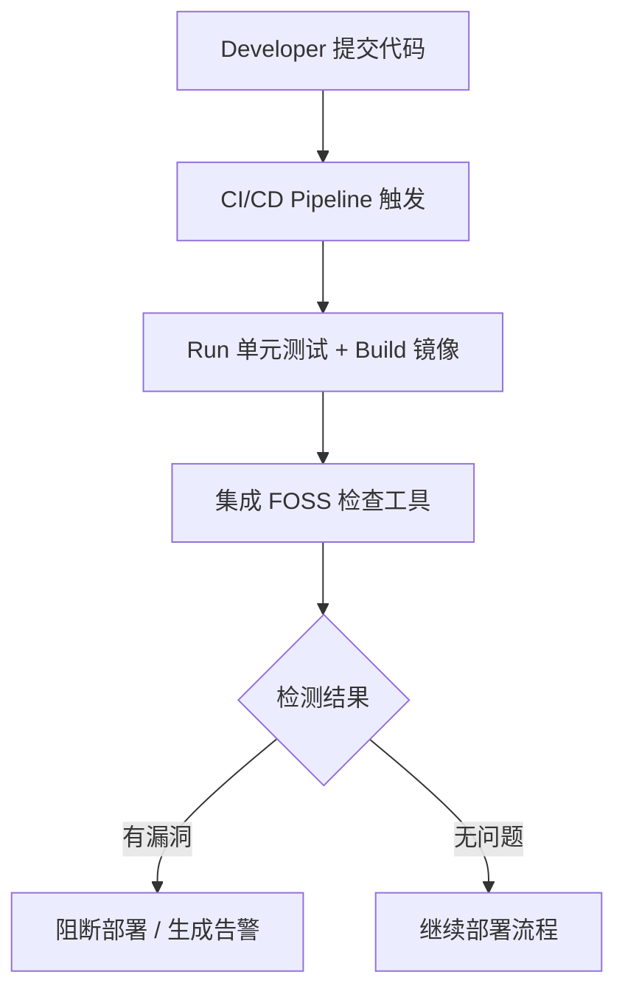
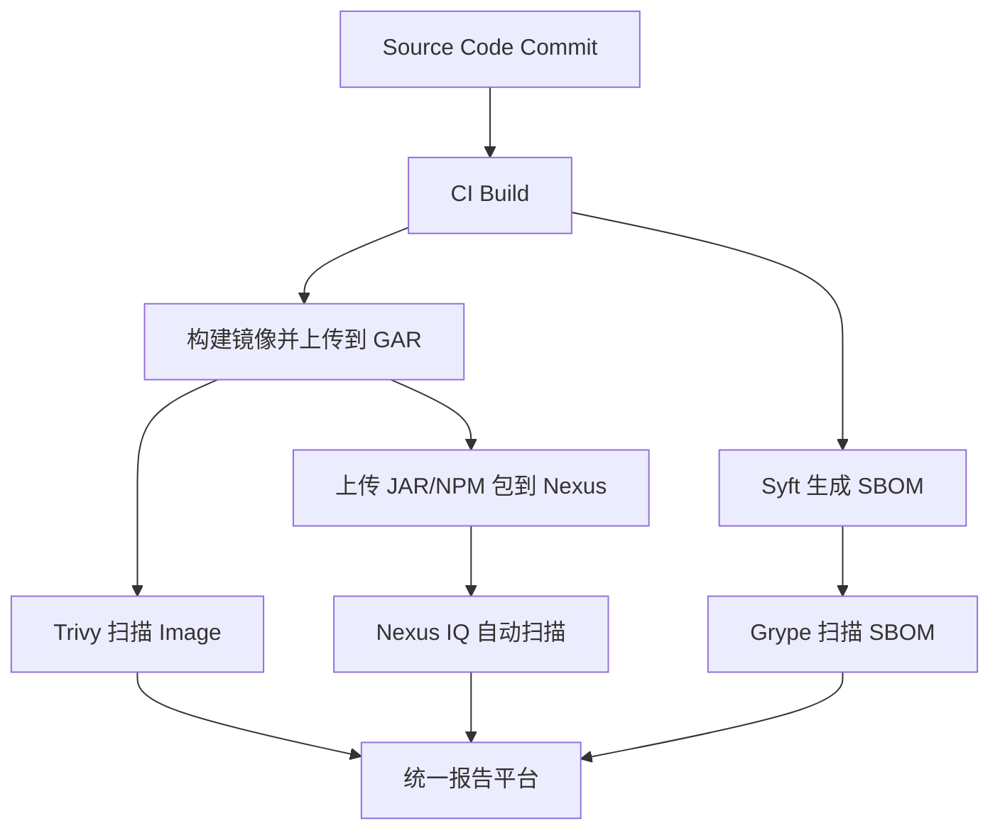
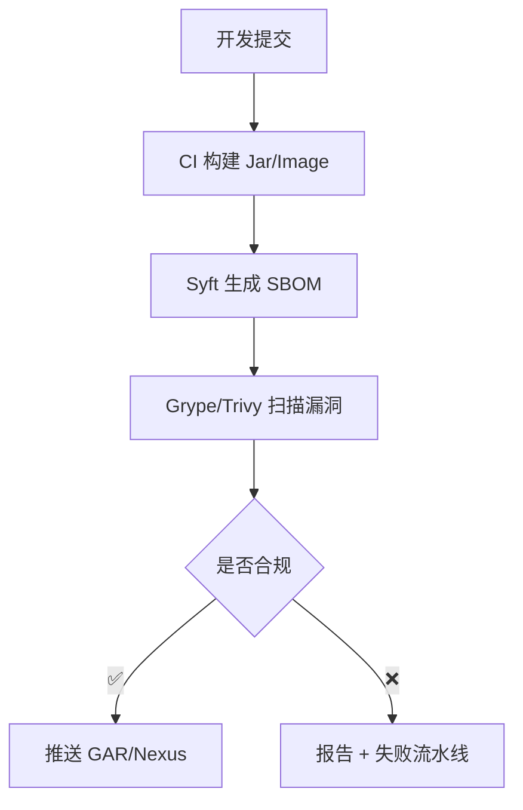
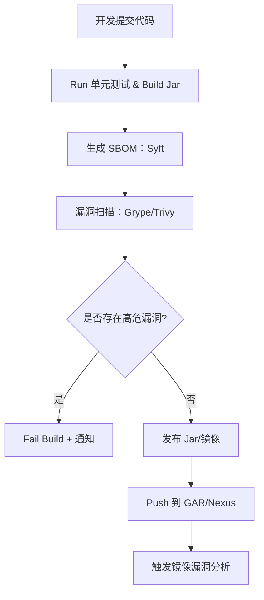
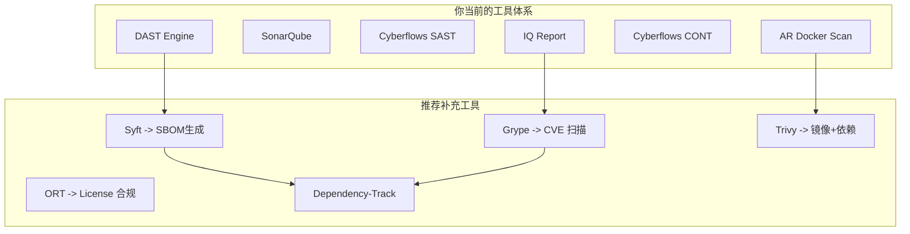

# Summary
- FOSS 扫描是什么？检查开源组件的 License 和漏洞风险
- 那么看起来这是一个 CI 阶段就可以干预的扫描. 上面平台中集成 FOSS 的可行方案前面三点看起来都比较适合我们,或者说具备了可行性我们现在 CI 的包会放在 Google 的 GAR 里面这里是否可以拿到一些报告,起码可以出一个推荐?另外我们的包也会放在 Nexus 里面,那么机遇 Nexus 一般可行的方案有哪些?建议的工具或者产品 还有哪些推荐么?我们现在 pipeline 里面集成的工具或者扫描有 IQ Report . SnoarQube . Cyberflows SAST  . Docker Image Google AR scan . Cyberflows CONT scan. Checkmarx 还有 DAST 扫描
- ~~--GAR 原生目前**只支持容器镜像的基础漏洞扫描**（来自 Container Analysis API），**不包含完整 SCA/FOSS 分析（如 License、Package Tree、SBOM）**~~
- Nexus Pro（带 IQ Server）
- ~~Trivy enable?~~
- gcloud artifacts sbom
- 
- 

# 可行性分析和推荐方案

## **一、基础知识理解**

### **1. 什么是 FOSS 在 Cyberflows 的上下文中？**

Cyberflows 是 Google 内部用于整合多种安全扫描的框架，支持包括：

- **SAST（静态分析）**
- **DAST（动态扫描）**
- **FOSS（开源组件分析，例如 SCA）**
- **IaC（基础设施代码安全）**

FOSS 在这个上下文中一般指的是 **SCA（Software Composition Analysis）**，分析开源组件依赖并识别：

- 已知漏洞（通过 CVE）
- 不合规许可（如 GPL）
- 版本更新建议（如 log4j 漏洞等）

---

## **二、你在平台中可介入 FOSS 的节点**

可以通过以下流程图帮助你理解介入点：

### **Mermaid 流程图**



---

## **三、平台中集成 FOSS 的可行方案（实用角度）**

| **方案类型**         | **可行方式**                                             | **建议工具或产品**                            |
| -------------------- | -------------------------------------------------------- | --------------------------------------------- |
| **CI/Pipeline 插件** | 在代码编译阶段分析开源依赖                               | Syft + Grype，OSS Review Toolkit, Trivy, Snyk |
| **容器镜像分析**     | 分析 Docker 镜像中的包依赖                               | Trivy, Anchore, Clair                         |
| **构建期间扫描**     | 拦截 Maven、npm、pip 等包管理器下载的依赖                | 使用 Artifactory + Xray 或 Snyk CLI           |
| **DAST 前融合 FOSS** | 在跑 DAST 之前生成 SBOM (软件物料清单)，提供给 DAST 工具 | Syft 输出 CycloneDX 格式，交给 DAST           |
| **Git Pre-Commit**   | 对依赖包文件（如 package.json, requirements.txt）做扫描  | Snyk、Checkmarx SCA 插件                      |

---

## **四、如何在你们平台层面做集成？**

### **✅ 集成点建议**

| **集成点**   | **说明**                                           | **可行性** | **建议**                |
| ------------ | -------------------------------------------------- | ---------- | ----------------------- |
| Build 镜像前 | 在 CI 流水线中集成 Syft 生成 SBOM，并用 Grype 扫描 | 高         | 推荐                    |
| Deploy 前    | 在 deploy 阶段加一层检查，如 SCA 结果 gating       | 中         | 适用于生产环境前置      |
| 镜像仓库     | 每次镜像 push 时自动触发 SCA 扫描                  | 高         | Harbor+Trivy 是开源组合 |
| DAST 环节前  | 将 SBOM 提交给 DAST 引擎（比如 Burp 插件）         | 中         | 需要定制 DAST 支持      |

---

## **五、使用开源工具组合示例（推荐）**

```
# 生成 SBOM（软件物料清单）
syft <your-image>:latest -o cyclonedx-json > sbom.json

# 扫描漏洞
grype sbom:sbom.json

# 或使用 Trivy 一步完成
trivy image --format cyclonedx --output result.json <your-image>
```

---

## **六、和 DAST 如何结合？**

虽然 DAST 是动态运行时扫描，但你可以：

- **在运行容器前，把 SBOM 数据挂入容器或日志中，供 DAST agent 参考**
- **自动判断某个 URL 的漏洞是否源自某个 FOSS 包版本（需要打通工具）**
- **或在一个平台统一呈现 DAST + FOSS 结果（通过统一 dashboard，如 DefectDojo）**

---

## **七、总结**

| **可行性层面** | **推荐做法**                                      |
| -------------- | ------------------------------------------------- |
| ✅ 高          | 在 CI 中集成 Syft + Grype 或 Trivy 分析依赖       |
| ✅ 高          | 镜像推送到 Harbor 等仓库时触发 Trivy 扫描         |
| ⚠️ 中          | 将 SBOM 与 DAST 结果整合                          |
| ✅ 高          | 使用 Looker Studio or BigQuery 聚合漏洞数据并告警 |

---

如你有更细的环境（如 GitHub Actions、GitLab CI、GCR/GAR、Cloud Build），我可以进一步帮你写对应的脚本或 YAML。是否需要？

# CI

非常好，你们平台已经具备丰富的 CI 扫描体系，下面我基于你的现状给出一个**FOSS 扫描集成可行性分析与推荐方案**，特别是结合：

- ✅ 你已经使用的工具（如 IQ Report、Google Artifact Registry、Nexus、Cyberflows 等）
- ✅ 当前构建/部署流程（CI 产出包入 GAR & Nexus）

---

## **一、你当前平台扫描能力一览（现状分析）**

| **阶段**     | **已集成工具/功能**                                | **覆盖类型**                      |
| ------------ | -------------------------------------------------- | --------------------------------- |
| SAST         | Cyberflows SAST、Checkmarx                         | 静态代码漏洞分析                  |
| DAST         | DAST 扫描工具                                      | 动态接口测试                      |
| SCA/FOSS     | IQ Report（可能内置了 OSS 组件分析）               | ✅ 但需明确是否扫描 CI 产出物     |
| Image 扫描   | Google Artifact Registry 自动扫描、Cyberflows CONT | 镜像级安全（含 CVE、配置）        |
| Code Quality | SonarQube                                          | 可检测代码质量与安全（部分 SAST） |
| CI 产物储存  | GAR + Nexus                                        | ✅ 存储包，但可能缺失组件级分析   |

---

## **二、重点问题：GAR 与 Nexus 中的包是否可集成 FOSS 报告？**

### **✅ Google Artifact Registry（GAR）**

| **能力**                | **可行性** | **说明**                                               |
| ----------------------- | ---------- | ------------------------------------------------------ |
| 内置 Container Analysis | ✅ 高      | 会自动分析 image，输出 CVE 报告（基于 Trivy）          |
| 支持 SBOM 导出          | ✅ 中      | 可用 gcloud artifacts sbom 获取 CycloneDX SBOM（Beta） |
| 可与 Cloud Build 集成   | ✅ 高      | 可在 Cloud Build 中结合 trivy, syft, grype             |

**示例：获取 SBOM**

```
gcloud artifacts sbom list \
  --package=my-image \
  --location=us \
  --format=json
```

---

### **✅ Nexus Repository（你提到 CI 包会放这里）**

| **能力**            | **可行性** | **工具推荐**                                |
| ------------------- | ---------- | ------------------------------------------- |
| 开源组件扫描（SCA） | ✅ 高      | **Nexus IQ Server（你已经用的 IQ Report）** |
| 自动策略阻断        | ✅ 高      | 可定义 Policy，例如发现高危 CVE 拦截        |
| 可与 CI 集成        | ✅ 高      | 可以通过 REST API 或 CLI 插件集成流水线     |

> 如果你已经使用 **IQ Report**，说明你可能已有 Nexus Lifecycle Server（SonaType），它已经可以为你提供依赖图、许可证、漏洞风险等级等报告。

---

## **三、推荐工具 / 产品组合（按场景）**

| **目标**                   | **推荐工具组合**                                 | **开源/商业** |
| -------------------------- | ------------------------------------------------ | ------------- |
| 镜像扫描                   | Trivy、Grype、Google Container Analysis（GAR）   | 开源 / GCP    |
| SBOM 生成（CycloneDX）     | Syft、Trivy                                      | 开源          |
| SBOM 安全扫描              | Grype、Trivy                                     | 开源          |
| 开源依赖扫描（多语言）     | Snyk、OSS Review Toolkit、OWASP Dependency-Check | 商业/开源     |
| Nexus 中的组件策略管理     | Nexus IQ Server（你已有）                        | 商业          |
| 多源扫描结果整合 Dashboard | DefectDojo、Allure、Sonatype Lifecycle Dashboard | 开源/商业     |

---

## **四、FOSS 扫描在你们平台的集成策略建议**

| **集成点**        | **工具建议**           | **是否已有** | **建议动作**                |
| ----------------- | ---------------------- | ------------ | --------------------------- |
| CI 编译阶段       | Syft + Grype / Trivy   | ❌           | ✅ 加入 Step 输出 SBOM      |
| Docker Build 之后 | trivy image            | ✅           | ✅ 继续使用或拉通报告       |
| GAR 上传后        | GCP Container Analysis | ✅           | ✅ 输出报告至报告中心       |
| Nexus 上传后      | Nexus IQ Server        | ✅           | ✅ 检查是否开启 Policy Gate |
| 报告整合          | Allure / DefectDojo    | ❌/部分      | ⚠️ 可选统一 Dashboard       |

---

## **五、补充：推荐一个标准 FOSS 集成流水线示例（Mermaid）**



---

## **六、输出推荐（你可在 CI 加入的内容）**

### **🔧 示例：在 GitLab CI / Cloud Build 中添加 SCA**

```
# 生成 SBOM
syft your-image:latest -o cyclonedx-json > sbom.json

# 运行 SCA 扫描
grype sbom:sbom.json > grype-report.txt
```

---

## **七、总结建议表格**

| **场景**            | **推荐工具**        | **是否已有** | **优先级** |
| ------------------- | ------------------- | ------------ | ---------- |
| CI 产出物组件分析   | Syft + Grype        | ❌           | ✅✅✅     |
| GAR 镜像扫描与 SBOM | Container Analysis  | ✅           | ✅✅       |
| Nexus 包分析        | Nexus IQ Report     | ✅           | ✅✅✅     |
| 安全报告聚合        | DefectDojo / Allure | ❌           | ✅         |

---

如你需要：

- Nexus IQ Report 自动导出 JSON 报告样例
- Syft / Grype / Trivy 的 Pipeline YAML 示例（适配 GitLab CI / Cloud Build / Tekton）
- SCA 报告 + DAST 报告整合 Dashboard

我可以按需补充。是否继续？你希望整合哪部分的报告？

非常好，你已经明确了方向：**在 CI 阶段介入 FOSS 扫描**，并且你们现在的工件分别发布到了：

- ✅ Google Artifact Registry (GAR)
- ✅ Nexus Repository Manager

接下来我会从两部分回答你：

---

## **一、GAR + Nexus 上如何做 FOSS 依赖扫描（推荐实践）**

| **位置** | **可介入点**                        | **可行做法（开源 / 商用）**                                                    |
| -------- | ----------------------------------- | ------------------------------------------------------------------------------ |
| GAR      | **容器镜像发布后扫描**              | 使用 **Trivy** 或 **Grype** 直接扫描 gcr.io / location-docker.pkg.dev 镜像地址 |
|          | **CI 时生成 SBOM 并上传到 GCS/GAR** | 利用 Syft 生成 CycloneDX JSON 上传到 GCS/GAR，为后续 DAST 等工具使用           |
| Nexus    | **Maven/npm/pip 包发布扫描**        | Nexus Pro 搭配 **Sonatype IQ Server** 实现发布前拦截 + 漏洞扫描 + License 检查 |
|          | **通过 webhook 联动扫描工具**       | Nexus 发布 webhook 触发 Trivy, Grype, 或商用 SCA 工具来扫描特定版本包          |

---

## **二、推荐工具和产品（结合你平台需求）**

### **✅ 开源推荐（完全自托管）**

| **工具**                   | **作用**                           | **说明**                                                |
| -------------------------- | ---------------------------------- | ------------------------------------------------------- |
| **Syft**                   | 生成 SBOM（支持 image 或源码目录） | 支持格式：CycloneDX、SPDX，适合集成到 CI/CD 流程        |
| **Grype**                  | 基于 SBOM 或 image 做漏洞扫描      | 可与 Syft 搭配，也支持直接扫容器镜像                    |
| **Trivy**                  | All-in-One 扫描器：镜像、SBOM、FS  | 可生成 SBOM 并扫描漏洞，适合 GAR 镜像扫描或 CI 阶段扫描 |
| **OWASP Dependency-Check** | 针对 Java/Maven 项目               | 生成报告 HTML/JSON，也可以集成到 CI，比如 GitLab/GHA 中 |

---

### **✅ 商业产品推荐（功能更完整，有 License / Compliance 报告）**

| **工具 / 平台**       | **特点与优势**                                                           |
| --------------------- | ------------------------------------------------------------------------ |
| **Snyk**              | SaaS + CLI 模式，支持代码、镜像、容器、Git Hook、CI，License 分析非常好  |
| **Sonatype Nexus IQ** | 与 Nexus 强绑定，识别 jar/npm/pip 的 CVE 与 license，构建门户和 gating   |
| **JFrog Xray**        | 与 Artifactory 结合，适合 DevSecOps 平台集成，覆盖丰富                   |
| **FOSSA**             | License 和安全合规能力强，适合大企业使用                                 |
| **Anchore**           | Anchore Engine（开源） 或 Anchore Enterprise（商用）适合用于容器镜像扫描 |

---

## **三、GAR 与 Trivy/Grype 的示例：扫描已推送的容器镜像**

```
# 使用 Trivy 扫描 GAR 镜像
trivy image europe-west2-docker.pkg.dev/myproj/myrepo/myimage:latest

# 使用 Syft 生成 SBOM
syft europe-west2-docker.pkg.dev/myproj/myrepo/myimage:latest -o cyclonedx-json > sbom.json

# 使用 Grype 扫描 SBOM
grype sbom:sbom.json
```

⚠️ 注意：需设置好 Artifact Registry 的身份认证，例如使用：

```
gcloud auth configure-docker
```

---

## **四、Nexus 的可行方案**

### **如果你使用的是 Nexus OSS 版本：**

| **可行方案**           | **工具支持**                      |
| ---------------------- | --------------------------------- |
| 自定义 webhook         | Nexus 发布成功后触发 Trivy 脚本   |
| 定期扫描存储库         | 用 cron + CLI 工具轮询扫描        |
| 在 CI 阶段提前扫描依赖 | 使用 Snyk CLI 或 Dependency-Check |

### **如果你使用的是 Nexus Pro（带 IQ Server）：**

- 可配置：
    - policy 检查（阻止发布带漏洞/不合规许可的构件）
    - 自动生成审计报告
    - 可通过 Nexus Web UI 查看依赖树

---

## **五、平台接入建议**

### **✅ 推荐你们平台标准化流程如下：**



---

## **六、小结：可行性与建议表格**

| **集成目标**     | **推荐工具组合**            | **说明/优势**                                  |
| ---------------- | --------------------------- | ---------------------------------------------- |
| GAR 镜像扫描     | Trivy / Syft + Grype        | 支持 SBOM、漏洞扫描、CI 集成简便               |
| Nexus JAR 包扫描 | Nexus + IQ Server           | 商用功能完整，支持 license + CVE               |
| 通用依赖扫描     | Snyk CLI / Dependency-Check | 快速出报告，适合接入 prebuild 或 CI            |
| 统一报表         | SBOM + BigQuery/Looker      | 可聚合 CI 阶段输出的 SBOM 或扫描结果生成仪表盘 |

---

如你提供你们的 CI 工具（Cloud Build / GitHub Actions / GitLab CI），我可以帮你写一份完整的集成 YAML。是否需要？

# 可行性分析和推荐方案

现在的 Pipeline 工具栈已经涵盖了大部分安全扫描维度 —— **SAST、Container、DAST、IQ、SonarQube 等**，如果要加强 FOSS/SCA 相关能力，可以在现有体系中无缝整合。下面我基于你的实际情况（Google Artifact Registry + Nexus + CI Pipeline 工具）进行分模块的 **可行性分析和推荐方案**。

---

## **一、你的平台场景适配分析**

| **组件/流程**            | **当前状态**                                | **是否推荐介入 FOSS/SCA**              | **说明**                                  |
| ------------------------ | ------------------------------------------- | -------------------------------------- | ----------------------------------------- |
| **CI 阶段构建包**        | 有：Cyberflows SAST / IQ Report / SonarQube | ✅ 非常适合                            | 插入 FOSS 工具作为补充，进行依赖扫描      |
| **构建出的 Docker 镜像** | 有：AR Docker Image Scan                    | ✅ 可增强                              | Trivy/Syft 可补充依赖组件信息和 CVE       |
| **制品管理：GAR**        | 是：Google Artifact Registry                | ✅ 有可用扫描 API                      | 可借助 AR 原生或外部工具扫描结果          |
| **制品管理：Nexus**      | 是：内部包仓库                              | ✅ 推荐设置 Nexus IQ Server + 策略控制 | Nexus 原生集成 IQ，适合做依赖下载期间扫描 |
| **DAST 扫描**            | 已有配置                                    | ⚠️ FOSS 与其结合难度中                 | 可将 SBOM 生成后作为辅助信息送入 DAST     |

---

## **二、GAR（Google Artifact Registry）中的可行方案**

GAR 原生目前**只支持容器镜像的基础漏洞扫描**（来自 Container Analysis API），**不包含完整 SCA/FOSS 分析（如 License、Package Tree、SBOM）**。

### **✅ 建议方式一：结合 Syft + Grype/Trivy，生成 SBOM**

```
# 生成 CycloneDX 格式的 SBOM
syft gcr.io/your-project/your-image:tag -o cyclonedx-json > sbom.json

# 用 Grype 进行漏洞扫描
grype sbom:sbom.json

# 或 Trivy 直接扫描 GAR 中的镜像
trivy image gcr.io/your-project/your-image:tag
```

### **✅ 建议方式二：自动化接入**

你可以把这类脚本接入到：

- Cloud Build 的 cloudbuild.yaml
- GitHub Actions / GitLab CI 的 Job 中
- 或作为 Container Post-Build Job（生成后做扫描）

---

## **三、Nexus 仓库中的可行方案**

你提到已集成 IQ Report，说明你们 Nexus 是搭配了 **Sonatype Nexus IQ Server** —— 这是官方推荐的 **FOSS 依赖扫描与策略控制组件**。

### **Nexus IQ 常用做法：**

| **集成方式**                    | **说明**                                                         |
| ------------------------------- | ---------------------------------------------------------------- |
| Nexus IQ CLI (policy-evaluator) | 可集成进 Pipeline 中，针对构建产物（jar、npm、docker）做策略分析 |
| Nexus IQ for Docker             | 针对 Docker 镜像中包含的依赖包进行扫描（比如 Java JAR）          |
| IQ 插件 for Jenkins/GitLab      | 在 CI 流水线构建后直接拉取报告并 fail build                      |
| Policy Server Dashboard         | 定义各类风险等级（如高危 CVE）触发 build failure                 |

### **✅ 推荐增强措施：**

- **开启 OSS License Policy**，检查 GPLv3、AGPL、未声明许可
- 启用 **自定义策略**，比如：拒绝重大 CVE、禁止旧版本（如 log4j < 2.17）

---

## **四、推荐工具/产品列表（基于你的现状）**

| **工具/产品**                               | **作用**                            | **是否开源** | **适合阶段**  |
| ------------------------------------------- | ----------------------------------- | ------------ | ------------- |
| **Syft + Grype**                            | SBOM 生成 + CVE 检测                | ✅ 是        | CI / 构建后   |
| **Trivy**                                   | 镜像扫描 + SCA（支持包+License）    | ✅ 是        | CI / 容器仓库 |
| **OSS Review Toolkit (ORT)**                | SCA+License 检查 + 报告生成         | ✅ 是        | CI/构建前     |
| **Snyk**                                    | 开源依赖安全、License、容器镜像分析 | ❌ 商业化    | CI / IDE / CD |
| **FOSSA**                                   | 许可证审查、依赖漏洞                | ❌ 商业化    | CI / Git hook |
| **Google Container Analysis + Grafeas API** | AR 镜像漏洞结果读取                 | ✅ 是        | GAR 使用者    |
| **CycloneDX Hub / OWASP Dependency-Track**  | SBOM 展示与追踪平台                 | ✅ 是        | 报告中心化    |

---

## **五、推荐组合策略（总结）**

### **✅ CI 阶段建议流程如下：**



---

## **六、可输出报告建议**

建议在每次构建后统一存放：

| **类型**   | **格式**             | **说明**                           |
| ---------- | -------------------- | ---------------------------------- |
| SBOM       | CycloneDX (JSON/XML) | 可用于 DAST、License 展示          |
| CVE Report | HTML / JSON          | 展示漏洞列表（用于合规或合并邮件） |
| License    | Markdown / HTML      | 展示依赖的开源协议情况             |

---

如你需要我帮你生成：

- CI 插件或 bash/yaml 脚本样例
- Trivy/Syft 扫描结果聚合报告格式
- SBOM 输出到 BigQuery 做全局分析

请告诉我具体的工具和语言环境（如你们用的是 Gradle / Maven / npm / Python 等），我可以定制完整范例。是否需要？

# TOOLS

根据提供的信息来推导推荐工具/产品的**，包括我**如何映射你的现状与推荐工具之间的对应关系**，以及**这些工具会生成哪些报告类型（或文件）\*\*。整个分析逻辑如下：

---

## **🔍 一、你当前环境的已知信息（来自你的上下文）**

你明确提到你当前 Pipeline 中 **已有的扫描组件**：

| **已有扫描工具组件**            | **类型**     | **说明与推断**                                                    |
| ------------------------------- | ------------ | ----------------------------------------------------------------- |
| **IQ Report**                   | SCA/FOSS     | 显示你们已经使用 **Sonatype Nexus IQ Server** 或 CLI Scanner      |
| **SonarQube**                   | SAST         | 静态代码扫描，侧重语法、复杂度、注入等                            |
| **Cyberflows SAST**             | SAST         | 表示你接入了 Google 的 **Cyberflows SAST Pipeline（如 CodeSec）** |
| **Docker Image Google AR Scan** | 容器漏洞扫描 | 表示你使用 **GAR + Container Analysis API** 对容器镜像做扫描      |
| **Cyberflows CONT Scan**        | 容器镜像扫描 | 推断使用的是 **Container Analysis 或定制规则**                    |
| **DAST 扫描**                   | DAST         | 动态应用安全测试，基于运行时行为检测漏洞                          |

根据这些组件，说明你已涵盖：

| **安全维度**        | **工具体现**               |
| ------------------- | -------------------------- |
| 代码扫描（SAST）    | SonarQube、Cyberflows SAST |
| 开源依赖扫描（SCA） | IQ Report                  |
| 镜像漏洞扫描        | GAR Scan、Cyberflows CONT  |
| 动态扫描（DAST）    | DAST 引擎                  |

但没有看到你提到：

✅ **SBOM（软件物料清单）**

✅ **License 分析报告（例如 GPL、MIT 等）**

✅ **FOSS 组件依赖树报告（Dependency Graph）**

---

## **🧠 二、我为什么推荐这些工具/产品？**

| **推荐工具**               | **为什么推荐**                    | **是补什么维度**                 | **推导逻辑**                                     |
| -------------------------- | --------------------------------- | -------------------------------- | ------------------------------------------------ |
| **Syft**                   | 生成 SBOM，展示包依赖与 License   | 缺失 SBOM & License 分析         | 你没提到使用 SBOM 工具，Syft 轻量开源适合补充    |
| **Grype**                  | 对 SBOM 做 CVE 扫描               | 增强依赖安全扫描（可与 IQ 互补） | 可用于非 Java 项目的 CVE 检查                    |
| **Trivy**                  | 一体化镜像+依赖扫描工具           | 增强 GAR 镜像扫描维度            | 相比 GAR Scan，Trivy 额外提供包级 CVE 和 License |
| **ORT**                    | 提供依赖 License 审计及合规性报告 | License 合规分析                 | 当前工具中缺乏对 License 风险和法律合规的管理    |
| **Snyk**                   | 云服务，适用于开发者快速集成      | 开发初期快速反馈（SCA+容器）     | 若需要开发 IDE + CI 集成的补充方式               |
| **OWASP Dependency-Track** | 可视化依赖风险跟踪平台            | 聚合所有 SBOM + CVE 报告         | 若你们有多个团队共享安全信息                     |
| **CycloneDX Hub**          | SBOM 管理中心                     | 报告集中管理 + Feed DAST         | 可与 Syft/Trivy 配合，用于 Feed 其他安全平台     |

---

## **📊 三、推荐工具生成的报告类型**

| **工具名**           | **报告类型**                 | **用途说明**                        |
| -------------------- | ---------------------------- | ----------------------------------- |
| **Syft**             | sbom.json (CycloneDX / SPDX) | 包含依赖列表、版本、License         |
| **Grype**            | grype-report.json            | 依赖漏洞扫描，基于 CVE 数据库       |
| **Trivy**            | trivy-report.json/html       | 镜像 + 应用依赖扫描，含 CVE+License |
| **ORT**              | scan-report.html/json        | 全依赖扫描结果 + License 合规分析   |
| **Snyk**             | 在线 dashboard + CLI 报告    | 快速集成 + 高可用 SaaS 报告平台     |
| **Dependency-Track** | Web 可视化仪表盘             | 管理多个 SBOM、展示影响、关联 CVE   |

---

## **✅ 四、实际应用中的推荐组合逻辑（与你现有工具无冲突）**

| **当前工具**       | **可以结合的推荐工具** | **增强维度**                                            |
| ------------------ | ---------------------- | ------------------------------------------------------- |
| IQ Report          | Syft + Grype           | 扫描非 Nexus 管理的依赖包，如 image 层系统包、Python 等 |
| AR 镜像扫描        | Trivy                  | 增强 SBOM + License 识别                                |
| DAST（Cyberflows） | Syft/CycloneDX Hub     | 将 SBOM 输送给 DAST 更好定位 FOSS 来源漏洞              |
| SAST + CONT        | ORT                    | 提供 License 审计维度 & HTML 报告                       |

---

## **🧩 五、简单示意图：现有工具与推荐工具补位关系**



---

## **📎 总结：推荐工具如何被“推算”出来**

| **推导基础**         | **分析结论**                                                     |
| -------------------- | ---------------------------------------------------------------- |
| 你已有 IQ Report     | 表示你做了 Java/构建包级别依赖扫描，但缺少 SBOM 与 License 审计  |
| 你使用 GAR 镜像扫描  | GAR Scan 限于 CVE，缺乏包层依赖图，推荐用 Trivy 扫描补充         |
| 没提到 SBOM 文件输出 | 推测你还未纳入 SBOM 工具，如 Syft，需补充依赖结构                |
| 存在 DAST            | 若能集成 SBOM，可更好地将 DAST 报告与 FOSS 源头对应              |
| 使用 Nexus + IQ      | IQ Server 很强，但其他包管理器如 PyPI/npm/docker fs 层未必被管控 |

---

如果你想验证现有是否已有 SBOM 或 License 报告，可以告诉我你当前的 CI 构建环境（例如 GitHub Actions / GitLab CI / Cloud Build）以及构建语言（Java / Python / Node 等），我可以给你一个诊断脚本帮助确认。是否需要？

# gcloud artifacts sbom

gcloud artifacts sbom 是 Google Cloud 提供的命令，用于从 **Google Artifact Registry (GAR)** 中获取 SBOM（Software Bill of Materials，软件物料清单）。它目前支持导出 **Docker 镜像** 的 SBOM，格式为 **CycloneDX JSON** 或 **SPDX JSON**，内容主要用于分析该镜像中包含哪些依赖、组件版本、来源等信息。

---

## **✅ 使用前提**

你需要满足以下前提条件：

1. **镜像已上传到 GAR**（并且在支持 Container Analysis 的区域）
2. **启用了以下 API**：

    - containeranalysis.googleapis.com
    - artifactregistry.googleapis.com

3. 安装了最新版本的 gcloud CLI，并已运行 gcloud auth login / gcloud init。

---

## **✅ 基本命令结构**

```
gcloud artifacts sbom list \
  --package="LOCATION-docker.pkg.dev/PROJECT-ID/REPO/IMAGE@DIGEST" \
  --format=json
```

---

## **🔍 参数说明**

| **参数项** | **说明**                                                                         |
| ---------- | -------------------------------------------------------------------------------- |
| --package  | 必填，格式为：[LOCATION]-docker.pkg.dev/[PROJECT]/[REPO]/[IMAGE]@sha256:<digest> |
| --format   | 可选，可设置为 json、yaml，默认是 json                                           |
| --location | 镜像所在区域，例如 us, europe-west2，通常在 package 路径中包含                   |

---

## **🧪 示例流程（实战）**

假设你已将如下镜像上传至 GAR：

```
europe-west2-docker.pkg.dev/my-project/my-repo/my-app@sha256:1234abcd...
```

你可以这样拉取 SBOM：

```
gcloud artifacts sbom list \
  --package="europe-west2-docker.pkg.dev/my-project/my-repo/my-app@sha256:1234abcd..." \
  --format=json
```

输出会类似于：

```
[
  {
    "name": "projects/my-project/locations/europe-west2/occurrences/abcdef123456...",
    "noteName": "projects/goog-analysis/notes/cyclonedx",
    "kind": "DISCOVERY",
    "remediation": "",
    "sbom": {
      "type": "cyclonedx",
      "version": "1.4",
      ...
    }
  }
]
```

---

## **🎯 如何获取镜像 digest？**

你可以通过以下命令获取镜像的 digest：

```
gcloud artifacts docker images list europe-west2-docker.pkg.dev/my-project/my-repo
```

输出类似：

```
IMAGE                                           DIGEST                                TAGS
europe-west2-docker.pkg.dev/.../my-app          sha256:1234abcd...                    latest
```

---

## **🧩 SBOM 文件下载（目前不支持直接导出文件）**

目前 gcloud artifacts sbom 仅列出 **SBOM Metadata 的 Occurrence 信息**，如你想获取 **完整 CycloneDX 文件**，推荐做法：

### **✅ 1. 在 CI 阶段用 Syft 自行生成 SBOM：**

```
syft europe-west2-docker.pkg.dev/my-project/my-repo/my-app:latest -o cyclonedx-json > sbom.json
```

### **✅ 2. 或使用 Container Analysis API 直接下载 Occurrence 内容（高级用法）**

---

## **⚠️ 注意事项**

- 当前 SBOM 支持仅限于 **Docker 镜像**，不能用于 Maven/NPM 等非容器包。
- 只有使用 GAR 存储容器镜像，并启用了 Container Analysis，才能看到 SBOM。

---

## **📌 推荐搭配（实战组合）**

| **动作**         | **工具**                   |
| ---------------- | -------------------------- |
| 生成镜像         | Docker / Cloud Build       |
| 上传到 GAR       | docker push or gcloud      |
| 获取 SBOM 元数据 | gcloud artifacts sbom list |
| 本地生成 SBOM    | syft <image>               |
| 扫描漏洞         | grype sbom:sbom.json       |

---

是否需要我帮你生成一个完整流程的 shell 脚本？比如：

- 获取镜像 digest
- 拉取 SBOM 元信息
- 或用 Syft 生成完整 SBOM + 扫描报告？
