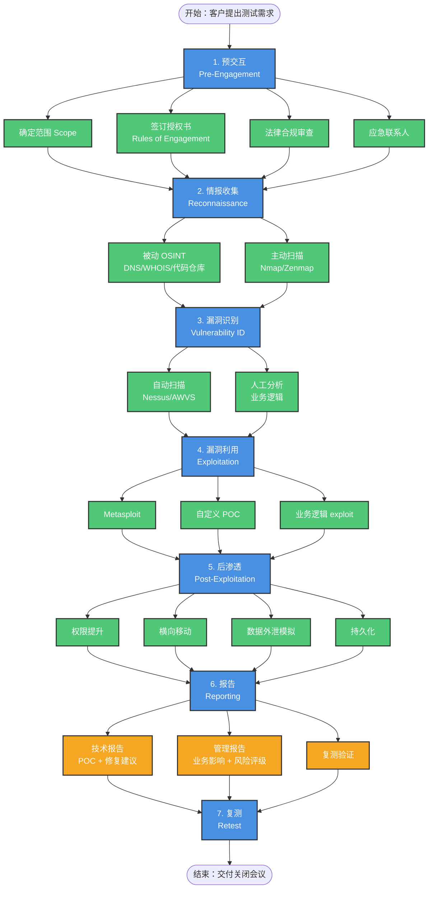
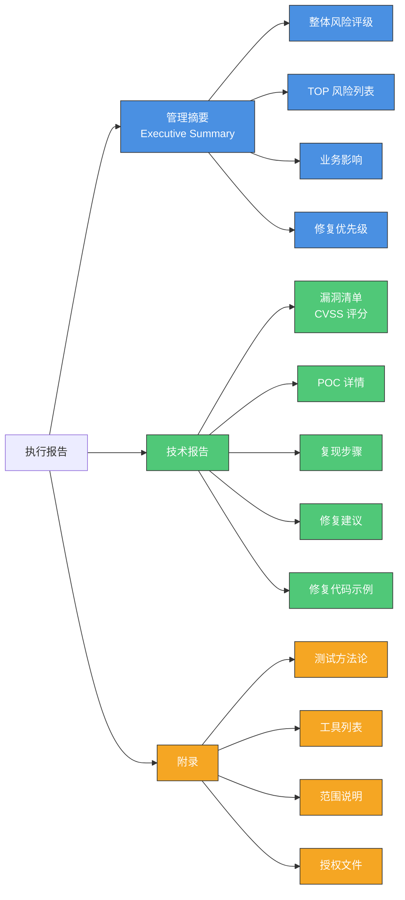
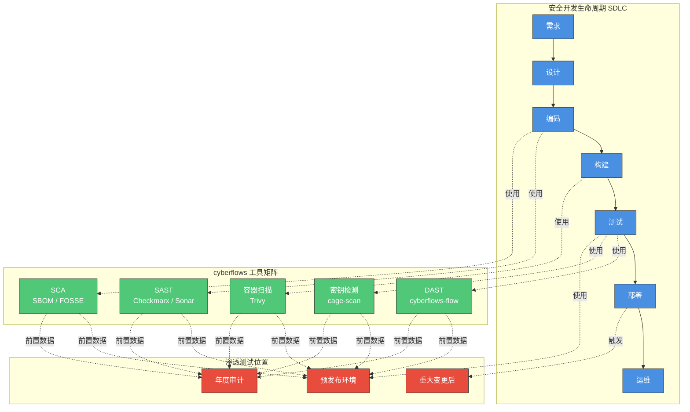
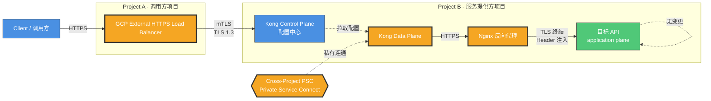

# 渗透测试（Penetration Test）全面解析：定义、合规、流程与企业落地

> 文档定位：与 `dast.md` / `Trivy.md` / `checkmarx.md` / `sbom.md` 同列，属于
> `safe/cyberflows/` 体系下的"主动安全验证"分支。本文档回答两个问题：
> **(1) 渗透测试到底指什么；(2) 企业内部是否需要过这个扫描**。

---

## 0. 30 秒结论

- **是什么**：渗透测试（Pentest）= 授权下的、**人工主导**、**主动利用漏洞**来证明
  "系统能被攻破到什么程度"的安全验证活动。它**不是**单纯"扫漏洞"，而是
  "**模拟黑客打穿系统并量化后果**"。
- **企业要不要过**：**绝大多数中大型企业强制要求**。三条触发线：
  1. **合规驱动**（PCI DSS / ISO 27001 / SOC 2 / 等保 2.0 / HIPAA）—— 写过合同就得做。
  2. **业务驱动**（金融、电商、医疗、SaaS、政务）—— 客户安全审计、招投标必须。
  3. **事件驱动**（重大变更、上线前、并购、年度安全验证）—— 工程纪律需要。
- **与 SAST / DAST / SCA 的关系**：互补、不互斥。

  | 工具 | 比喻 | 找什么 |
  |---|---|---|
  | SAST（白盒静态）| X 光片 | 源代码里的 SQLi/XSS 模式 |
  | DAST（黑盒动态）| 体检 | 跑起来的应用是否漏出常见漏洞 |
  | SCA（组件扫描）| 配料表 | 第三方库的已知 CVE |
  | **Pentest** | **实战演习（红蓝对抗）** | **业务逻辑缺陷、链式攻击、可被利用的路径** |

> **关键区分**：DAST ≠ 渗透测试。DAST 是工具自动化扫 URL，
> Pentest 是人在合规授权下，**真的去 exploit 漏洞并写 POC**。
> OWASP/NIST 体系下 DAST 是 "Vulnerability Scanner"，Pentest 是另一个类别。

---

## 1. 权威定义（溯源）

| 来源 | 定义 |
|---|---|
| **NIST SP 800-115** | "Security testing in which evaluators **mimic real-world attacks** in an attempt to identify ways to circumvent the security features of an application, system, or network. Penetration testing often involves **issuing real attacks on real systems and data**, using the same tools and techniques used by actual attackers." |
| **NIST SP 800-137** | "A test methodology in which assessors, **using all available documentation** (e.g., system design, source code, manuals) and working under specific constraints, attempt to circumvent the security features of an information system." |
| **CNSSI 4009-2015** | "A test methodology in which assessors, typically working under specific constraints, attempt to circumvent or defeat the security features of an information system." |
| **PCI DSS v4.0 Req 11.4** | 要求每年至少一次外部/内部渗透测试，且在重大变更后追加测试。 |
| **等保 2.0（GB/T 22239-2019）** | 三级及以上系统要求**定期开展渗透测试**并形成报告，作为等级测评的输入材料。 |

> 所有定义的共同核心词：**授权（Authorization）+ 模拟真实攻击 + 主动利用 + 验证影响**。
> 任何缺这四个要素的"扫描"都不叫 Pentest。

---

## 2. 与"漏洞扫描"的本质区别

> 这是初学者最常混淆的地方，必须拆清楚。

| 维度 | 漏洞扫描（Vulnerability Scan） | 渗透测试（Penetration Test） |
|---|---|---|
| 主体 | 自动化工具 | **人工 + 工具**（白帽工程师） |
| 深度 | 识别漏洞存在 | **利用漏洞 + 评估业务影响** |
| 输出 | 漏洞清单 | **攻击链 + POC + 业务影响 + 修复方案** |
| 频率 | 高（CI/CD 每日/每周） | 低（季度/半年/年度） |
| 误报率 | 中-高 | **低**（人工验证） |
| 工具代表 | Trivy、Nessus、Qualys、AWVS | Burp Suite Pro、Metasploit、Cobalt Strike、IDA |
| 是否能发现 0day | 仅依赖 CVE 库 | **可以**（人工挖逻辑漏洞） |
| 合规效力 | 满足"持续监测"类要求 | 满足"年度/重大变更"硬性要求 |
| 单次成本 | 低（千-万元） | **高**（10万-百万元，取决于范围） |

**一句话总结**：漏洞扫描告诉你"门没锁"，渗透测试告诉你"我能用没锁的门偷走什么"。

---

## 3. 渗透测试的分类（按不同维度）

### 3.1 按攻击者视角（知识维度）

| 类型 | 别名 | 攻击者掌握的信息 | 模拟对象 | 优点 | 缺点 |
|---|---|---|---|---|---|
| **黑盒** Black-box | 外部测试 | 仅给目标 URL / IP | 真实黑客 | 真实度高，验证外部攻击面 | 漏掉需源码才能发现的漏洞 |
| **灰盒** Gray-box | 部分了解 | 给部分账号/架构图 | 有内部信息的高级威胁 | 性价比最高，覆盖 80% 场景 | 仍无法覆盖纯代码层 |
| **白盒** White-box | 内部测试 / Crystal-box | 源码、架构图、账号、密钥全给 | 内部威胁 / 离职员工 | **漏洞发现数最多**，深度最深 | 实施成本高、模拟性弱 |

> **OWASP Testing Guide v4.2 推荐**：对于 AppSec 综合评估，**优先白盒或灰盒**。
> 黑盒单独使用覆盖率不足。

### 3.2 按攻击面（范围维度）

| 类型 | 目标 |
|---|---|
| **外部渗透测试** | 面向公网的资产（IP、域名、API、移动 APP） |
| **内部渗透测试** | 内网段、办公网、VPN 后、K8s 集群内 |
| **Web 应用渗透** | Web 业务系统、REST/GraphQL API |
| **移动应用渗透** | iOS / Android APP（IPA / APK 反编译） |
| **云环境渗透** | AWS / GCP / Azure 配置 + IAM + 容器 + Serverless |
| **无线网络渗透** | Wi-Fi、蓝牙、Rogue AP |
| **社会工程** | 钓鱼邮件、电话诈骗、物理渗透 |
| **红队评估** Red Team | 不限范围、不限手段，TIBER-EU / CBEST 框架 |
| **紫队演练** Purple Team | 红蓝对抗 + 实时协作，蓝队同步学习 |
| **工控/IoT** | OT/ICS、SCADA、智能设备 |
| **物理渗透** | 门禁、办公区、机房 |

### 3.3 按执行方式

- **人工渗透测试 Manual** — 安全工程师主导，深度高，**满足合规审计要求**。
- **自动化渗透测试 Automated** — 工具扫描 + 编排，频率高，作为人工的前置筛。
- **持续渗透测试 Continuous** — 订阅式（Synack、Coalfire、Outpost24），BAAS 模式。

---

## 4. 主流方法论体系

| 框架 | 性质 | 适用场景 | 阶段数 | 特点 |
|---|---|---|---|---|
| **PTES**（Penetration Testing Execution Standard） | 社区技术标准 | 综合项目 | **7 阶段** | 业界最广泛采用，强调业务输出 |
| **NIST SP 800-115** | 政府权威指南 | 政府/合规项目 | 3-4 阶段 | 美国联邦标准，PCI/等保引用 |
| **OSSTMM 3**（Open Source Security Testing Methodology Manual） | ISECOM 维护 | 度量化评估 | 5 通道 | **唯一能算出 RAV（Risk Assessment Value）** |
| **OWASP WSTG**（Web Security Testing Guide） | Web 应用专用 | Web/API | 4 阶段 + 12 类别 | Web 渗透的事实标准 |
| **OWASP MASTG**（Mobile Application Security Testing Guide） | 移动专用 | iOS/Android | — | MASTG + MASVS 双标准 |
| **MITRE ATT&CK** | 攻击知识库 | 红队 / 威胁建模 | — | 描述**对手战术**，映射测试覆盖度 |
| **TIBER-EU / CBEST** | 金融监管框架 | 银行/金融 | — | 央行级，跨部门红队 |

> **企业实操建议**：合规项目用 **PTES** 或 **NIST SP 800-115** 走流程；
> Web 渗透参考 **OWASP WSTG** + **OWASP Top 10**；威胁建模参考 **MITRE ATT&CK**。

---

## 5. 渗透测试执行流程（PTES 7 阶段）



### 5.1 阶段详解

#### 阶段 1：预交互（Pre-Engagement）
**最容易被忽视却最关键**。缺这一步就不叫"渗透测试"，叫"未授权入侵"。

- 范围定义：哪些系统、哪些 IP/域名、哪些不在范围。
- 授权文件（ROE / Rules of Engagement）：双方法人签字、测试窗口、紧急联系人。
- 法律合规：数据处理协议、敏感数据脱敏、不影响业务的"DoS 限制"。
- 交付物清单：技术报告、管理报告、修复建议、复测次数。

#### 阶段 2：情报收集（Reconnaissance）
- **被动 OSINT**：Shodan、Censys、公开 GitHub 代码仓库、招聘 JD、SSL 证书透明度日志、WHOIS。
- **主动扫描**：Nmap 端口扫描、子域名枚举、目录爆破。

#### 阶段 3：漏洞识别（Vulnerability Identification）
- **自动扫描**：Nessus、Qualys、AWVS、OpenVAS、Trivy（容器/镜像）。
- **人工分析**：对扫描结果去重、分级，识别业务逻辑漏洞入口。

#### 阶段 4：漏洞利用（Exploitation）— **核心环节**
- 工具链：Metasploit、Burp Suite Pro、SQLMap、XSStrike、Responder、impacket。
- 验证：每个漏洞必须 exploit 成功 + 截图/POC 留存。
- 业务逻辑：水平越权、垂直越权、支付金额篡改、密码重置流程绕过。

#### 阶段 5：后渗透（Post-Exploitation）
- 权限提升、横向移动、数据外泄模拟（脱敏）、持久化检测。
- 内部网段渗透：AD 域、Kerberoasting、Pass-the-Hash。

#### 阶段 6：报告（Reporting）
- **技术报告**：漏洞详情、风险评级（CVSS 3.1 / CVSS 4.0）、POC 截图、修复方案。
- **管理报告**：业务影响、风险趋势、TOP 10 修复优先级。
- **复测计划**：修复后再次验证。

#### 阶段 7：复测（Retest）
- 验证修复有效性。
- 出具关闭报告（Close-out Report）。

---

## 6. 企业是否需要过这个扫描？— 强制触发线

> 直接回答用户问题：**绝大多数企业"需要过"**，但触发条件分三档。

### 6.1 合规要求（**强约束**）

| 法规/标准 | 具体条款 | 强制要求 |
|---|---|---|
| **PCI DSS v4.0** | Req 11.4.1 / 11.4.2 | 每年至少一次外部 + 内部渗透测试 + 重大变更后追加 |
| **等保 2.0**（GB/T 22239-2019） | 三级及以上系统 | 等级测评 + 渗透测试报告 |
| **ISO/IEC 27001:2022** | A.8.29 Security testing | 定期独立安全测试 |
| **SOC 2** | CC7.1 / CC7.4 | 至少年度一次，可被审计师抽样 |
| **HIPAA** | 45 CFR § 164.308(a)(8) | 风险评估中需含渗透测试 |
| **GDPR** | Art. 32 | "适当的技术措施"——实践中审计会要求 |
| **NIST SP 800-53** | CA-8 / RA-5 | 联邦系统强制 |
| **金融行业** | JR/T 0068 / 0149 / 0167 | 网上银行系统每年至少一次 |
| **云等保 2.0 扩展要求** | 阿里云/华为云/Tencent Cloud | 满足等保三级需提供年度渗透测试报告 |

> **触发器**：只要合同里写了"符合 PCI DSS"、"通过等保三级"、"取得 ISO 27001 认证"，
> **渗透测试就是"过审"硬条件**。

### 6.2 业务要求（**软性但实质**）

| 场景 | 必要性 |
|---|---|
| 客户安全审计（大客户对供应商） | 强制 — 没报告可能丢单 |
| 招投标（金融/政务/能源） | 强制 — 评分项 |
| SaaS 服务上线 | 强烈建议 — 减少客户索赔 |
| 重大版本上线 / 重大架构变更 | 强烈建议 — 工程纪律 |
| 收购并购（SaaS / 科技公司） | 强制 — 尽调必备 |
| 上市合规 | 强制 — 监管问询 |
| 内部安全成熟度建设 | 推荐 — 验证防御有效性 |

### 6.3 事件要求

- 上线后出现重大 CVE（如 Log4Shell、Spring4Shell）→ 紧急渗透测试。
- 已被攻击 / 数据泄露 → 复盘 + 加固 + 第三方测试。
- 内部红蓝对抗 → 持续验证。

### 6.4 例外：哪些企业**暂时不需要**？

- 纯前端静态站（无业务逻辑、无用户数据）。
- 完全无客户、无合规压力的内部工具（但仍建议）。
- 预种子轮的纯产品 demo。
- 但只要开始接客户、接订单，**条件立刻触发**。

---

## 7. 实战：渗透测试 vs 漏洞扫描 vs DAST — 一个真实场景

**目标**：电商网站，含登录、支付、订单管理 API。

| 攻击面 | 漏洞扫描会找到 | DAST 会找到 | **渗透测试** 会找到 |
|---|---|---|---|
| Log4j CVE-2021-44228 | ✅（依赖扫描） | ✅（payload 触发） | ✅（完整利用链） |
| 登录页 SQL 注入 | ✅ | ✅ | ✅（+ 绕过 WAF 的 payload） |
| 支付金额篡改（业务逻辑） | ❌ | ❌ | ✅（人工构造 -1 元订单） |
| 越权访问他人订单（IDOR） | ❌ | 可能（已知模式） | ✅（ID 遍历 + 业务影响量化） |
| JWT 签名不校验 | 部分 | ✅ | ✅（伪造 token 提权 + 横向） |
| API 速率限制缺失 | ❌ | 部分 | ✅（撞库 + 暴力破解演示） |
| CORS 配置错误 | ✅ | ✅ | ✅（结合 CSRF 偷数据） |
| S3/GCS 公开 Bucket | ✅（配置扫描） | — | ✅（读取真实数据证明） |
| **新上线功能未授权访问** | ❌ | ❌ | **✅（核心价值：人在回路）** |

> **关键洞察**：DAST 和漏洞扫描能发现 **已知模式**；渗透测试能发现
> **业务逻辑 + 链式攻击**。这两类完全互补，不是二选一。

---

## 8. 工具与生态

### 8.1 主流商业平台

| 平台 | 类型 | 特点 |
|---|---|---|
| **Nessus Pro** | 漏洞扫描 | 全球部署最广 |
| **Qualys VMDR** | 漏洞管理 | 云原生 |
| **Rapid7 InsightVM** | 漏洞管理 | Metasploit 母公司 |
| **Burp Suite Pro** | Web 渗透 | 渗透工程师标配 |
| **Tenable.io** | SaaS 漏洞 | 大企业偏好 |
| **Netsparker / Invicti** | DAST + 渗透 | 自动验证，误报低 |
| **Wiz / Orca** | 云安全态势 | 云渗透的现代工具 |

### 8.2 渗透测试工具栈（人工）

| 类别 | 工具 |
|---|---|
| 情报收集 | Nmap、Shodan、Censys、theHarvester、Amass |
| Web 渗透 | Burp Suite Pro、OWASP ZAP、SQLMap、XSStrike、ffuf |
| 利用框架 | Metasploit、Cobalt Strike、Sliver |
| 后渗透 | Mimikatz、impacket、Responder、CrackMapExec、SharpHound |
| 密码破解 | Hashcat、John the Ripper、hydra |
| 无线 | Aircrack-ng、Wifite |
| 社会工程 | GoPhish、SET（Social Engineering Toolkit） |
| 报告 | Dradis、Serpico、PlexTrac |

### 8.3 持续渗透测试平台（BAAS）

- **Synack** — 众包白帽 + AI 验证
- **Coalfire** — 美大型合规测试机构
- **Outpost24** — 欧洲领先
- **Hadrian** — 自动化持续渗透
- **NCC Group** — 英国老牌

---

## 9. 报告输出：什么是一份合格的 Pentest 报告



### 9.1 漏洞分级标准

| 严重等级 | CVSS 分数 | 含义 | 修复 SLA |
|---|---|---|---|
| **Critical** | 9.0–10.0 | 远程命令执行、未授权管理员 | 24-72 小时 |
| **High** | 7.0–8.9 | SQL 注入、SSRF、严重越权 | 7-14 天 |
| **Medium** | 4.0–6.9 | XSS、CSRF、信息泄露 | 30 天 |
| **Low** | 0.1–3.9 | 配置缺陷、信息收集 | 90 天 |
| **Info** | 0.0 | 仅信息性发现 | 视情况 |

---

## 10. 选型与采购：自建 vs 第三方

### 10.1 自建内部红队

**适用**：
- 大型科技/金融/互联网公司
- 持续高频测试需求（>4 次/年）
- 已有安全团队基础

**成本**：
- 人员：3-5 名高级渗透工程师（年薪 50-150 万）
- 工具：商业 License 100-300 万/年
- 培训：攻防竞赛、CTF 参与、Conference

**优势**：
- 知识沉淀在内部
- 应急响应快
- 深度定制化

### 10.2 第三方安全服务商

**适用**：
- 中小企业 / 一次性需求
- 合规审计客观性要求
- 缺乏内部红队

**采购要点**：
- **资质**：CNAS / CCRC / ISO 27001 / OSCP / CREST 认证。
- **范围模板**：PCI DSS 模板、等保模板、SOC 2 模板。
- **方法论**：明确写明 PTES / OWASP / NIST。
- **复测条款**：必须包含。
- **数据保护**：测试数据脱敏、报告加密交付。

### 10.3 国内推荐测评机构（参考）

- 公安部网络安全等级保护评估中心（CSPEC）
- 中国信息通信研究院安全研究所
- 绿盟科技、奇安信、安恒、深信服
- 启明星辰、华为安全、天融信

> ⚠️ 选型时务必核实资质，避免"安全测试 + 销售恐吓"的低质量服务商。

---

## 11. 与 `safe/cyberflows/` 现有体系的关系



### 11.1 何时触发 Pentest（在 cyberflows 工具矩阵中）

| 触发事件 | 推荐测试类型 |
|---|---|
| 代码合并到 main / release 分支 | 自动化 DAST 跑（不是 Pentest） |
| 新功能上线预发布 | **灰盒 Web 渗透** |
| 第三方组件大版本升级 | SCA 验证 + **灰盒渗透** |
| 季度/年度合规审计 | **完整外部 + 内部渗透** |
| 重大架构变更（迁移云、换 IAM） | **白盒渗透** |
| 重大 CVE 公布（Log4Shell 级） | **紧急灰盒渗透** |

### 11.2 协同策略（推荐工作流）

1. **CI/CD 阶段**：SAST + SCA + DAST 跑自动化，**挡 80% 低级漏洞**。
2. **预发布阶段**：触发灰盒渗透测试，**专攻业务逻辑 + 链式攻击**。
3. **生产阶段**：漏洞扫描持续运行 + 外部黑盒年度渗透。
4. **事件阶段**：SOC 告警触发紧急红队评估。

---

## 12. 常见误区（企业实战踩过的坑）

| 误区 | 真相 |
|---|---|
| "做了 DAST 就等于做了 Pentest" | DAST 是工具扫；Pentest 是人打穿系统 |
| "过了渗透测试 = 系统安全" | Pentest 是在**限定范围 + 限定时间**下验证，**未发现漏洞≠没有漏洞** |
| "买最贵的服务就最安全" | 真正起作用的是**修复闭环**，不是报告本身 |
| "一年做一次就够了" | **PCI DSS 要求重大变更后追加**，架构调整、上云后必须重做 |
| "白帽团队 = 公司员工" | 第三方机构提供**客观独立性**和**法律隔离**，多数合规要求"独立第三方" |
| "POC 写得越花哨越好" | **POC 要可复现**——能给一线工程师复现并修复的 POC 才是好 POC |
| "渗透测试是安全部门的事" | 实际是**业务 + 开发 + 安全**三方协作；安全部门只是组织者 |
| "做完测试不修复" | **修复率 < 70% 等于没做**——跟踪闭环是关键 KPI |

---

## 13. 国内合规视角：等保 2.0 下的渗透测试要求

### 13.1 法规依据

- **GB/T 22239-2019**《信息安全技术 网络安全等级保护基本要求》
- **GB/T 28448-2019**《信息安全技术 网络安全等级保护测评要求》
- **GB/T 25070-2019**《信息安全技术 网络安全等级保护安全设计技术要求》

### 13.2 各等级要求

| 等级 | 渗透测试要求 |
|---|---|
| **第一级**（自主保护）| 无强制要求 |
| **第二级**（指导保护）| 建议性 |
| **第三级**（监督保护）| **必做** — 等级测评 + 渗透测试 |
| **第四级**（强制保护）| **必做** — 季度自检 + 年度渗透 + 重大变更后追加 |

### 13.3 测评机构资质

- 必须为**公安部第三研究所**认证的等级测评机构
- 测评师需持有 **CISAW** 或 **CISP-PTE** 证书
- 测评结论有效期 1 年（第三级）

### 13.4 典型采购需求（参考）

```
- 频率：每年一次（三级）/ 半年一次（四级）
- 范围：所有生产系统 + 重要管理后台
- 类型：黑盒 + 灰盒混合
- 报告：技术报告 + 管理报告 + 修复建议
- 复测：修复后 30 天内复测
- 资质：CNAS / CCRC 认证机构
- 交付：纸质 + 电子版，加密传输
```

---

## 14. 行动清单（企业落地建议）

### 14.1 第一年（基础建设）

- [ ] 完成全员安全意识培训（社会工程防护基础）
- [ ] 部署 SAST + SCA 到 CI/CD
- [ ] 部署 DAST 到预发布
- [ ] **采购一次外部灰盒渗透测试**（覆盖所有生产系统）
- [ ] 建立漏洞管理流程：发现 → 分级 → 派单 → 修复 → 复测 → 关闭
- [ ] 建立 SLA：Critical 24h、High 7d、Medium 30d、Low 90d

### 14.2 第二年（合规驱动）

- [ ] 通过等保三级测评
- [ ] 完成 PCI DSS 11.4 年度渗透测试
- [ ] ISO 27001 认证（含 A.8.29）
- [ ] 建立内部红队（2-3 人）
- [ ] 引入漏洞奖励计划（漏洞赏金）

### 14.3 第三年起（持续运营）

- [ ] 季度灰盒渗透测试
- [ ] 年度红队评估（TIBER-EU / CBEST 框架）
- [ ] 持续渗透测试平台（Synack / Hadrian 类）
- [ ] 蓝队 → 紫队 → 红队 协同
- [ ] 每年至少 1 次攻防演练（实战化）

---

## 15. 总结

### 15.1 给企业的一句话

> **渗透测试不是"要不要做"的问题，是"什么时候开始做"的问题。**
> 一旦系统涉及客户数据、涉及合规要求、涉及商业合同，**渗透测试就是硬性义务**。
> 它不是成本中心，是**风险保险**。

### 15.2 给安全负责人的三个优先级

1. **先打基础**：SAST + SCA + DAST 自动化跑起来（成本低、ROI 高）。
2. **再补深度**：年度采购第三方渗透测试（满足合规 + 找盲点）。
3. **最后建能力**：组建内部红队或紫队（应对高频 + 持续验证）。

### 15.3 五个最关键的判断标准

1. **是否涉及客户数据？** — 是 → 必做
2. **是否受 PCI DSS / 等保 / ISO 约束？** — 是 → 必做
3. **是否对外提供 SaaS 或 API？** — 是 → 必做
4. **是否有重大变更？** — 是 → 必做
5. **是否承担金融/医疗/政务业务？** — 是 → 必做 + 频率更高

---

## 附录 A：术语表

| 术语 | 英文 | 含义 |
|---|---|---|
| 渗透测试 | Penetration Test / Pentest | 授权下的主动安全验证 |
| 红队 | Red Team | 模拟攻击方的团队 |
| 蓝队 | Blue Team | 防守方 / SOC |
| 紫队 | Purple Team | 红蓝对抗 + 实时协作 |
| 漏洞赏金 | Bug Bounty | 众包白帽持续找漏洞 |
| 攻击面 | Attack Surface | 系统可被攻击的所有入口 |
| CVSS | Common Vulnerability Scoring System | 通用漏洞评分系统（0-10） |
| POC | Proof of Concept | 漏洞可复现的证明 |
| ROE | Rules of Engagement | 渗透测试授权规则 |
| CWE | Common Weakness Enumeration | 通用缺陷枚举 |
| CVE | Common Vulnerabilities and Exposures | 公开漏洞编号 |
| RAV | Risk Assessment Value | OSSTMM 的量化风险值 |
| 凭据转储 | Credential Dumping | 抓取系统内的密码哈希 |
| 横向移动 | Lateral Movement | 攻入一台主机后渗透其他主机 |
| 持久化 | Persistence | 攻陷后留下后门长期控制 |
| 提权 | Privilege Escalation | 从低权限提升到高权限 |
| 载荷 | Payload | 攻击者发送给目标的恶意数据 |

## 附录 B：参考标准与文档

- **NIST SP 800-115** — Technical Guide to Information Security Testing and Assessment
  https://csrc.nist.gov/pubs/sp/800/115/final
- **PTES** — Penetration Testing Execution Standard
  http://www.pentest-standard.org
- **OSSTMM 3** — Open Source Security Testing Methodology Manual
  https://www.isecom.org/OSSTMM.3.pdf
- **OWASP WSTG v4.2** — Web Security Testing Guide
  https://owasp.org/www-project-web-security-testing-guide/
- **OWASP MASTG** — Mobile Application Security Testing Guide
  https://mas.owasp.org/MASTG/
- **MITRE ATT&CK**
  https://attack.mitre.org
- **PCI DSS v4.0**
  https://www.pcisecuritystandards.org/
- **GB/T 22239-2019** 等保 2.0
  http://www.gb688.cn/bzgk/gb/newGbInfo?hcno=BAFB47F4C7D9B22C8CD8B4F1B6A0E7F0
- **CREST** — Council of Registered Ethical Security Testers
  https://www.crest-approved.org/

## 附录 C：相关内部文档

- `safe/cyberflows/dast.md` — DAST 集成到 CI/CD 流程指南
- `safe/cyberflows/Trivy.md` — 容器/镜像漏洞扫描
- `safe/cyberflows/checkmarx.md` — SAST 静态扫描
- `safe/cyberflows/sonar.md` — SonarQube 代码质量与安全
- `safe/cyberflows/sbom.md` — 软件物料清单
- `safe/cyberflows/cage-scan.md` — 凭据/密钥扫描
- `safe/cyberflows/cyberflows-flow.md` — DAST 扫描流程图

---

## 附录 D：架构变更说明与 Pentest 必要性评估 — 邮件模板

> **背景**：本次架构调整仅涉及**流量路径（flow / network plane）**变化，
> 目标 **API 本身（application plane）未做任何代码或接口变更**。
> 因此需要将架构现状与变更点同步给安全/Pentest 团队，由其判断是否需要本轮 Pentest。
>
> 变更要点（基于我方实际架构）：
> - **新增组件**：跨项目 Private Service Connect（Cross-Project PSC）
> - **新增组件**：Nginx（作为反向代理 / TLS 终结点）
> - **接入层**：Kong Data Plane（KongDP）从 Control Plane 拉取配置
> - **目标**：我们的核心 API（无变更）
>
> 下面提供中英文两个版本，**中文给内部技术同步**、**英文直接发给外部安全/Pentest 团队**。

### D.1 架构总览图（当前态）



### D.2 变更影响范围矩阵

| 层级 | 组件 | 变更类型 | 是否影响 API 行为 | 是否需重测 API |
|---|---|---|---|---|
| **Network Plane** | Cross-Project PSC | **新增** | ❌ 纯网络层 | ❌ 否 |
| **Network Plane** | Nginx 反向代理 | **新增** | ⚠️ 仅 Header 注入 / TLS 终结 | ⚠️ 视情况 |
| **Control Plane** | KongCP | **配置** | ❌ 仅路由配置 | ❌ 否 |
| **Data Plane** | KongDP | **新增** | ❌ 仅流量入口 | ❌ 否 |
| **Application Plane** | 目标 API | **无变更** | ❌ 代码未动 | ❌ **否** |

> **核心结论**：**Application Plane 未变化**。本次变更仅在 Network / Edge 平面新增组件。
> 我方倾向判定：API 接口行为不变，**无新增业务攻击面**，是否需要本轮 Pentest 由安全团队最终裁决。

---

### D.3 邮件 — 中文版（内部技术同步）

**收件人**：安全 / Pentest 测试团队
**主题**：[架构变更同步] 本轮 Cross-Project PSC + Nginx + KongDP 流量改造 — Pentest 必要性评估

```
各位好，

针对本轮架构改造与年度 Pentest 计划，现同步架构变更情况，供评估本轮
Pentest 范围与必要性。

一、本次架构变更范围（仅流量路径 / Network Plane）

  1. 新增 Cross-Project Private Service Connect (PSC)
     - 实现 Project A（调用方）与 Project B（服务提供方）之间的私有网络连通
     - 替代原公网 / VPC Peering 方案，绕开公网暴露面

  2. 新增 Nginx 反向代理
     - 部署在 Project B 内，作为 KongDP → API 的中间层
     - 职责：TLS 终结、统一 Header 注入、限流入口
     - 配置与证书由 ConfigMap + Secret 注入，未引入新业务逻辑

  3. Kong Data Plane (KongDP) 接入
     - KongDP 从 Kong Control Plane 拉取路由 / 插件配置
     - 流量入口由 KongDP 接管，原有直连入口已下线

二、本次未变更范围（API Application Plane）

  - 目标 API 代码、接口路径、请求/响应 Schema、鉴权方式：均未变更
  - 业务逻辑、参数处理、数据流：无修改
  - 数据库 / 缓存 / 下游依赖：无修改

三、变更影响评估

  1. Network Plane:    新增 PSC + Nginx + KongDP（纯网络层 / 入口层）
  2. Application Plane: 无变更
  3. 攻击面变化：
     - 新增：Nginx / KongDP / PSC 端点配置风险（高、但与传统 Web 渗透同质）
     - 未变：API 接口层业务逻辑攻击面
  4. 现有安全控制：
     - LB → KongDP 链路启用 mTLS（参考 ajbx-mtls-* 资源命名）
     - Nginx → API 内部链路启用 TLS 终结
     - API 端点鉴权策略未调整

四、我方建议

  基于 API Application Plane 未变化，且新增组件均为标准网关 / 代理 / 私有连接
  模式，本轮 Pentest 是否可按以下原则处理之一：

  方案 A：本次不进行 API 渗透测试，仅对新增 Nginx / KongDP / PSC 链路做一次
          专项配置审计（Configuration Review）+ 自动化扫描
  方案 B：合并到下一次年度 Pentest 周期（Q4）一并执行
  方案 C：仍按原计划执行全量 Pentest（覆盖网络层新增组件 + API 层）

  请安全团队基于变更范围、风险偏好、合规要求给出最终判断，我方将配合
  提供测试账号、授权文件、应急联系人。

如需架构图、详细组件清单、IP / 域名白名单、API 接口文档，请告知，
我将在 1 个工作日内提供。

此致
Lex
GCP Infra / API Platform
```

---

### D.4 邮件 — 英文版（直接发送外部 Pentest 团队）

**To**: Security / Penetration Test Team
**Subject**: [Architecture Change Notification] Cross-Project PSC + Nginx + KongDP — Pentest Necessity Assessment

```
Hi Team,

Following our earlier alignment, this email summarizes the architecture
changes in this cycle and the rationale for our proposed Pentest scope.
We would like your final decision on whether a full Pentest is required
this round.

1. Scope of Changes (Network / Edge Plane only)

   a. New: Cross-Project Private Service Connect (PSC)
      - Provides private connectivity between Project A (caller side)
        and Project B (service provider side)
      - Replaces the previous public-facing / VPC peering path;
        removes the public-internet attack surface

   b. New: Nginx Reverse Proxy
      - Deployed inside Project B, between KongDP and the target API
      - Responsibilities: TLS termination, unified header injection,
        rate limiting entry point
      - Configuration and certificates are mounted via ConfigMap / Secret;
        no new business logic introduced

   c. New: Kong Data Plane (KongDP) Ingress
      - KongDP pulls routing and plugin configuration from the
        Kong Control Plane (KongCP)
      - KongDP now serves as the sole traffic entry point;
        the previous direct entry has been decommissioned

2. Out-of-Scope (API Application Plane — Unchanged)

   - Target API code, endpoint paths, request/response schemas,
     authentication/authorization mechanisms: NO CHANGES
   - Business logic, parameter handling, data flow: NO CHANGES
   - Database, cache, downstream dependencies: NO CHANGES

3. Impact Assessment

   - Network Plane:      New PSC + Nginx + KongDP (network / edge layer only)
   - Application Plane:  Unchanged
   - Attack Surface Delta:
     * New:    Nginx / KongDP / PSC misconfiguration risk
               (high, but identical in nature to standard web pen tests)
     * Untouched: API business-logic attack surface
   - Existing Security Controls:
     * LB → KongDP:  mTLS enabled (internal resources prefixed ajbx-mtls-*)
     * Nginx → API:  internal TLS termination in place
     * API auth policy: unchanged

4. Our Proposal

   Since the API Application Plane is unchanged and the new components
   follow standard gateway / proxy / private-connect patterns, we propose
   one of the following options for your consideration:

   Option A: Skip API-layer Pentest this round. Run a focused
             configuration review + automated scan of the new
             Nginx / KongDP / PSC chain only.

   Option B: Defer to the next annual Pentest cycle (Q4) and bundle
             this change into that engagement.

   Option C: Proceed with the originally planned full Pentest,
             covering both the new network-layer components
             and the (unchanged) API layer.

   Please confirm the final approach based on your change-vs-baseline
   risk model, our internal risk appetite, and applicable compliance
   requirements (PCI DSS 11.4 / ISO 27001 A.8.29 / 等保 2.0).

   We will provide test accounts, signed authorization letter (ROE),
   emergency contacts, and any supporting documentation (architecture
   diagram, component inventory, IP / domain allow-list, API specs)
   within 1 business day upon your request.

Best regards,
Lex
GCP Infra / API Platform
```

---

### D.5 邮件发送清单（发送前自检）

发送前请按以下清单确认：

- [ ] **授权文件（ROE / Rules of Engagement）** 已法务签字盖章
- [ ] **测试窗口（Testing Window）** 已与对方约定（建议非业务高峰）
- [ ] **测试账号** 已准备（普通用户 + 管理员 + 只读，多权限）
- [ ] **应急联系人** 已指定（双方各 1-2 人，7×24 可达）
- [ ] **测试范围白名单** IP 已提供（避免误判为真实攻击触发告警）
- [ ] **数据脱敏方案** 已对齐（避免生产数据被导出）
- [ ] **复测条款** 已写入合同（修复后 N 天内复测）
- [ ] **报告交付格式** 已明确（PDF + JSON + 加密传输）
- [ ] **MSSP / SOC 协同** 已通知（避免测试流量触发安全告警风暴）

---

### D.6 关键术语英中对照表（便于邮件撰写）

| 中文 | English | 说明 |
|---|---|---|
| 流量路径 | Network / Traffic Plane | 网络层 / 入口层 |
| 应用层 | Application Plane | API 代码 / 业务逻辑 |
| 跨项目 PSC | Cross-Project PSC | GCP 私有服务连接 |
| 数据面 | Data Plane (KongDP) | Kong 实际处理流量的节点 |
| 控制面 | Control Plane (KongCP) | Kong 配置中心 |
| TLS 终结 | TLS Termination | 在 Nginx / LB 终结 TLS |
| Header 注入 | Header Injection | 网关注入用户 / 请求标识 |
| 限流 | Rate Limiting | API 配额保护 |
| 配置审计 | Configuration Review | 不发攻击流量，仅审配置 |
| 授权书 | Rules of Engagement (ROE) | 渗透测试的法律授权文件 |
| 复测 | Retest | 修复后再次验证 |
| 攻击面 | Attack Surface | 可被攻击的所有入口 |
| 误报 | False Positive | 工具报的"假漏洞" |
| 漏报 | False Negative | 真实漏洞未被发现 |

---

> **文档版本**: v1.1 · **更新时间**: 2026-06-12
> **本次更新**：附录 D 追加 — 架构变更说明 + 中英文 Pentest 必要性评估邮件模板
> **所属体系**: safe/cyberflows（主动安全验证）
> **维护者**: 安全平台团队
