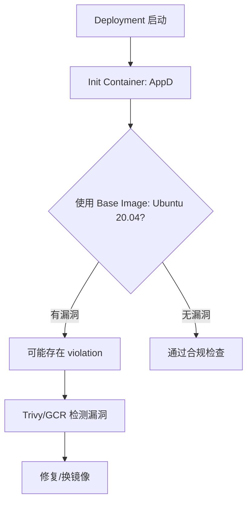

# Q

比如我们在 Deployment 里面配置了 init container 和不同的 Container，我这个 init container 是一个 app dynamics 的配置，

其对应的操作也基本是 cp -r /opt/appdynamics/. /opt/appdynamicis-java

根据 init 的属性，其启动也就是不存在了，那么假设我这个 appd images Build 的时候 From 来自一个有 Violation 的 ubuntu20.4 那么我想了解 对于我运行的 deployment 是否会因为使用了 APPD 而带来 violation ? 我如何校验我这个对应的 violation 或者确认我的服务有这个 violation ?

# Chatgpt

你的问题聚焦于 容器安全性合规性（violation），特别是在 Deployment 中使用了基于潜在有漏洞（violations）的 base image（如 Ubuntu 20.04）构建的 AppDynamics Init Container，你想知道这个是否会影响到整个服务的合规性，以及如何校验和确认。

✅ 回答核心：

Q1: 使用基于有 violation 的 Ubuntu 20.04 构建的 Init Container，会影响主容器吗？

不会直接影响主容器运行时安全，但可能造成合规问题。

- initContainer 在主容器启动前运行，用于做初始化操作。
- 它和主容器是 不同的容器进程空间，生命周期在主容器启动前结束，理论上不会污染主容器的运行环境（如 namespace、filesystem 除非你 volumeMount）。
- 但从 镜像安全性和合规性（compliance）角度来看，你的 Deployment 使用了这个 潜在存在漏洞的镜像，即使只在 Init Container 中，也可能被审计工具标记为存在 security violation。

✅ 校验和确认方式

你可以通过以下几种方式进行校验和确认：

方法一：使用 GKE/GCR 的 Container Analysis（Container Scanning）

如果你使用的是 GCR 或 Artifact Registry：

```Bash
gcloud artifacts docker images list-vulnerabilities \

--project=<your-project-id> \

--location=LOCATION \

--repository=REPO_NAME \

--image=IMAGE_NAME
```
🔍 这将列出镜像中所有组件的漏洞，包括 base image（如 Ubuntu 20.04）的 CVE 信息。

方法二：使用 kubectl + 镜像分析工具

1. 获取你 init container 的镜像：

`kubectl get deploy <your-deploy> -o=jsonpath='{.spec.template.spec.initContainers[*].image}'`

2. 将镜像名拉取下来，使用如以下工具扫描：

|       |                             |
| ----- | --------------------------- |
| 工具  | 描述                        |
| Trivy | 快速扫描镜像中的漏洞        |
| Grype | 支持多种源格式（OCI、SBOM） |
| Snyk  | 提供 CVE 和修复建议         |

例如使用 Trivy：

trivy image your-registry/your-appd-image

这将告诉你是否 Ubuntu 20.04 中存在 CVE-XXXX 的漏洞。

方法三：使用 GKE 安全报告（如果你启用了 GKE 安全中心/Container Threat Detection）

如果你启用了 [GKE Security Posture dashboard](https://cloud.google.com/kubernetes-engine/docs/how-to/security-posture-dashboard)：

- 会自动扫描你当前所有 Deployment 使用的镜像
- 包括 initContainers 和 sidecars
- 并提示是否有 Base image vulnerability

✅ 是否应该修复这个问题？

如果你的组织有合规性要求（如 ISO 27001, SOC2, FedRamp 等），即使是 Init Container 也必须确保无高危漏洞。

建议你采取以下措施：

1. 尽可能用 AppD 官方提供的最小镜像（如果有 alpine 或 debian-slim）
2. 定期重建 AppD 镜像，升级 Base image
3. 设置 CI 流程，在 Build 阶段强制执行 image vulnerability scan

✅ 示例（Trivy 扫描 AppD Init 容器）：

trivy image your-registry/appdynamics-init:latest

# 输出示例

ubuntu 20.04

CVE-2024-xxxxx [HIGH]

CVE-2023-xxxxx [MEDIUM]

...

✅ 可视化流程图：




✅ 总结：

|                             |                   |                                      |                              |
| --------------------------- | ----------------- | ------------------------------------ | ---------------------------- |
| 检查项                      | 是否影响主容器    | 是否存在 violation 风险              | 建议操作                     |
| Init 容器使用有漏洞的 image | ❌ 不直接影响运行 | ✅ 有可能违反安全合规性              | ✅ 扫描镜像，升级 base image |
| 主容器共享 volume 或 mount  | ✅ 有可能间接影响 | ✅ 更高风险                          | ✅ 必须检查 mount 路径和内容 |
| 是否被扫描工具检测          | -                 | ✅ Container Analysis / Trivy 会检测 | ✅ 集成到 CI/CD              |

如需我帮你生成脚本定期扫描 initContainer 镜像或生成自动检测报告，也可以继续告诉我。
