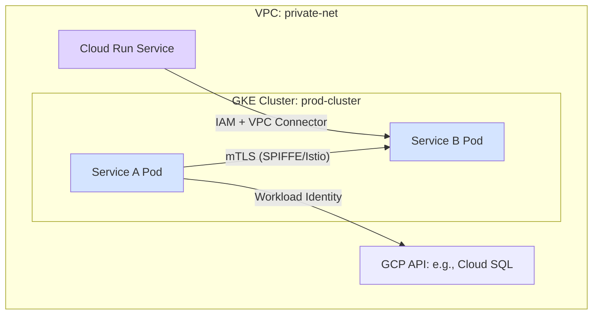
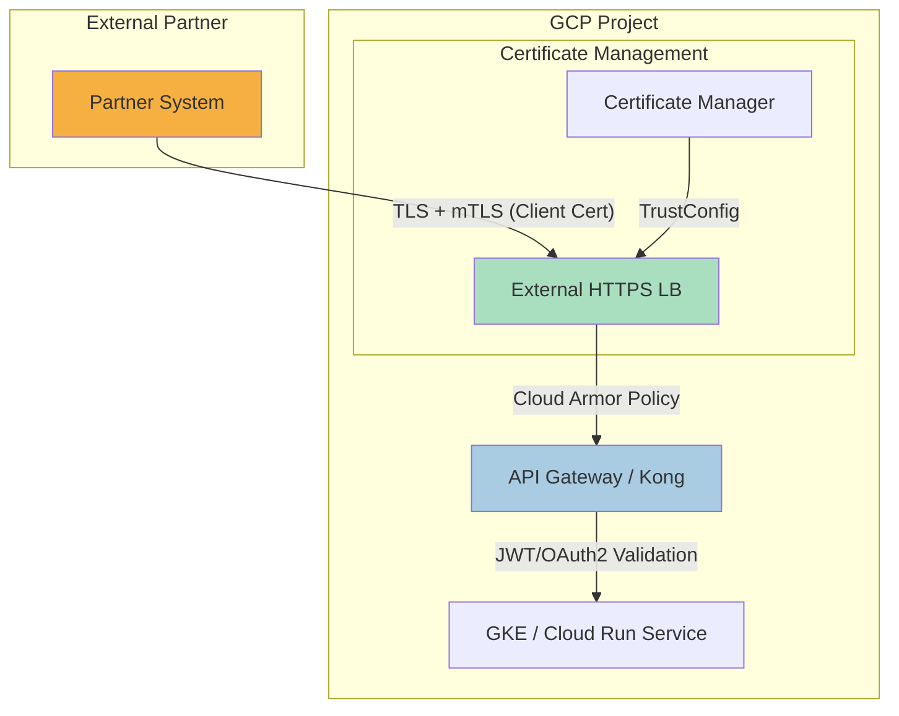
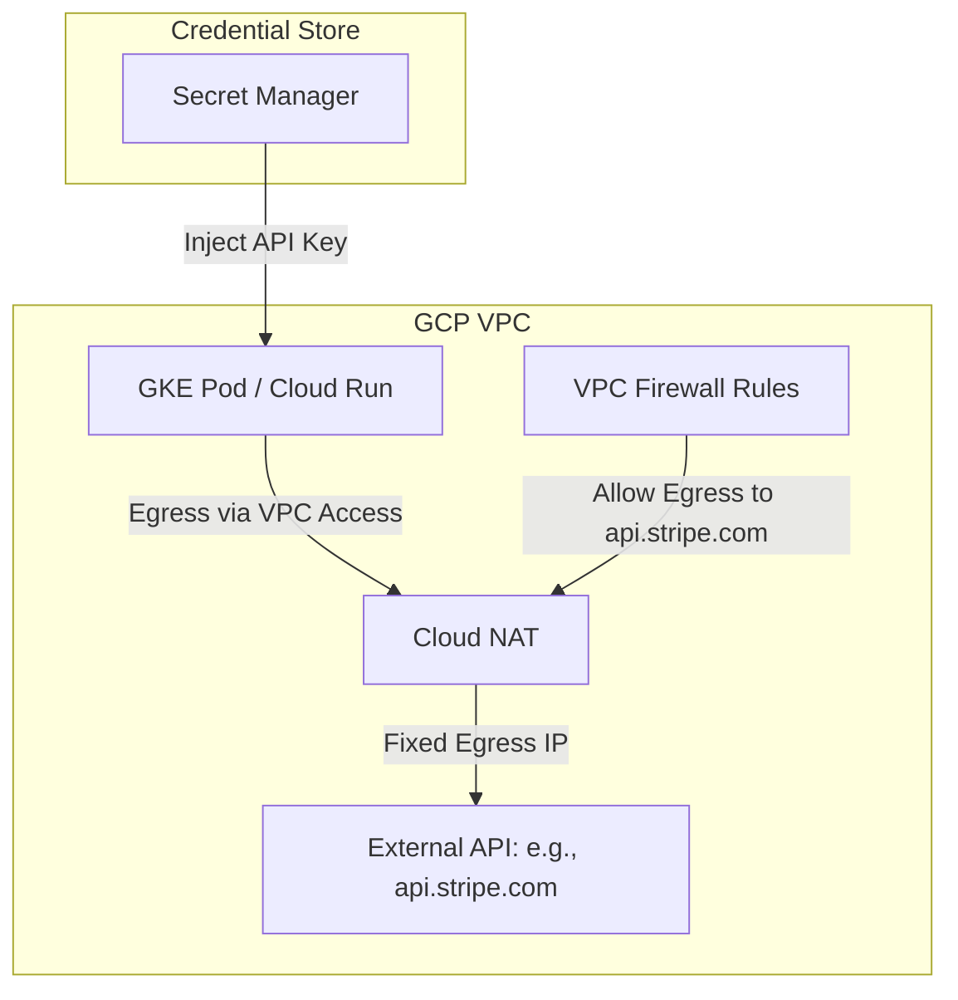
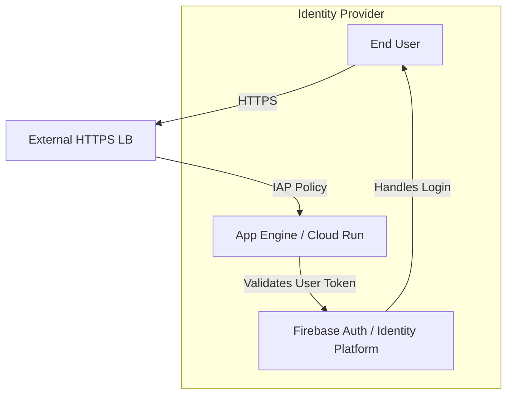

# GCP 平台应用认证授权方法详解 (auths-method)

本文档旨在详细阐述在 Google Cloud Platform (GCP) 中，针对不同业务场景和通信模型（如 iB2B, eB2B, i2e 等）的身份验证（Authentication）与授权（Authorization）机制。我们将结合 GCP 的原生服务与业界流行组件（如 Kong），提供架构图、策略建议和实践说明。

---

## **1. 通信模型总览**

在深入 GCP 具体实现之前，我们首先回顾一下核心的通信模型。这些模型定义了服务之间、服务与外部、服务与用户之间的安全边界和信任级别。

| **缩写术语** | **含义** | **典型 GCP 场景** | **核心安全挑战** |
| :--- | :--- | :--- | :--- |
| **iB2B** | Internal B2B | GKE 集群内服务间调用、Cloud Run 服务访问内部 API | 服务身份认证、内部流量加密、最小权限授权 |
| **eB2B** | External B2B | 外部合作伙伴通过 API Gateway 访问平台 API | 严格的身份验证、API 防护、精细化授权与审计 |
| **i2e** | Internal to External | GKE Pod 或 Cloud Run 实例调用外部第三方 API (如支付网关) | 出口流量控制、外部凭证安全管理、防止数据泄露 |
| **eB2C** | External B2C | 最终用户通过 Web 或移动 App 访问后端服务 | 用户身份管理、会话安全、防止常见 Web 攻击 (OWASP Top 10) |
| **e2i** | External to Internal | 第三方服务通过 Webhook 回调平台内部接口 | 入口安全、请求合法性校验、防止滥用 |

---

## **2. GCP 实践：不同模型的认证授权架构**

下面，我们将针对每种模型，提供基于 GCP 的推荐架构和安全实践。

### **Model 1: iB2B - 内部服务间通信**

内部服务间的核心是“零信任网络”，即假定内部网络也不可信，所有通信都必须经过认证和授权。

**安全组件与策略:**

| **关注点** | **GCP 推荐方案** | **说明** |
| :--- | :--- | :--- |
| **服务身份** | **Workload Identity Federation** | 将 K8s Service Account (KSA) 映射为 GCP Service Account (GSA)，实现 Pod 级别的原生身份认证，无需管理 Key 文件。 |
| **通信加密** | **GKE Service Mesh (Anthos/Istio)** | 自动为服务间通信启用 mTLS 加密，并基于 SPIFFE 标准提供安全的身份标识。 |
| **访问控制** | **Kubernetes Network Policy** | 在 L3/L4 层限制哪些 Pod 可以相互通信。 |
| **服务间授权** | **IAM + Service Accounts** | 为每个服务分配具有最小权限的 IAM 角色，控制其对其他 GCP 资源的访问。 |
| **网络隔离** | **VPC Service Controls** | 创建服务边界，防止数据从内部服务泄露到公共互联网。 |

---

### **Model 2: eB2B - 外部伙伴接入**

外部接入的核心是建立一个强大的安全边界，对所有入站请求进行严格的审查。

**安全组件与策略:**

| **关注点** | **GCP 推荐方案** | **说明** |
| :--- | :--- | :--- |
| **接入点** | **External HTTPS Load Balancer** | 提供全球性的接入点，并集成了 Cloud Armor 和 Certificate Manager。 |
| **DDoS/WAF 防护** | **Cloud Armor** | 配置安全策略，实现 IP 白名单、地理位置封禁、速率限制和 WAF 规则。 |
| **客户端认证** | **Certificate Manager (TrustConfig)** | 管理用于 mTLS 的客户端根证书 (CA)，实现对合作伙伴身份的强验证。 |
| **API 认证/授权** | **API Gateway 或 Kong** | 使用插件执行 JWT、API Key 或 OAuth2.0 验证，并进行精细化的 ACL (访问控制列表) 授权。 |
| **凭证管理** | **Secret Manager** | 安全地存储 API Gateway 或后端服务所需的密钥、证书等敏感信息。 |

---

### **Model 3: i2e - 内部服务访问外部**

内部访问外部的核心是“最小权限出口”，控制出口流量的来源、目的地和凭证。

**安全组件与策略:**

| **关注点** | **GCP 推荐方案** | **说明** |
| :--- | :--- | :--- |
| **出口 IP 控制** | **Cloud NAT** | 为 GKE 或 Cloud Run 提供一个或多个固定的出口 IP，方便外部服务配置 IP 白名单。 |
| **出口目的地控制** | **VPC Egress Firewall Rules** | 创建防火墙规则，只允许流量访问已知的、必要的外部域名或 IP 地址。 |
| **DNS 解析** | **Cloud DNS (Private Zones)** | 可以结合 DNS 防火墙，进一步限制可解析的外部域名，防止恶意访问。 |
| **凭证管理** | **Secret Manager** | 将访问外部 API 所需的 Key 或 Token 存储在 Secret Manager 中，通过 Workload Identity 安全地注入到应用中。 |

---

### **Model 4: eB2C - 终端用户访问**

面向最终用户的应用，核心是提供便捷、安全的用户身份管理和 Web 防护。

**安全组件与策略:**

| **关注点** | **GCP 推荐方案** | **说明** |
| :--- | :--- | :--- |
| **用户身份管理** | **Firebase Authentication / Identity Platform** | 提供完整的用户注册、登录、多因素认证 (MFA) 和社交媒体登录功能。 |
| **访问代理** | **Identity-Aware Proxy (IAP)** | 在负载均衡器层面为应用提供身份验证和授权，无需在应用内编写大量安全代码。 |
| **Web 防护** | **Cloud Armor** | 防御 SQL 注入、XSS 等 OWASP Top 10 攻击。 |
| **会话管理** | **Firestore / Memorystore** | 用于存储用户会话信息，实现有状态的会话管理。 |

---

## **3. 总结与建议**

选择合适的认证授权方法，关键在于清晰地识别 **通信的发起方和接收方**，并评估其所在的 **安全域和信任级别**。

- **内部优先使用 IAM 和 Workload Identity**，实现云原生、无密钥的认证体验。
- **外部接入必须依赖多层防御**：LB、Cloud Armor、API Gateway 各司其职。
- **凭证管理是核心**，始终使用 Secret Manager，避免在代码或配置中硬编码。
- **自动化是关键**，利用 Service Mesh 和 IAP 等工具，将安全策略与基础设施解耦，提升安全性和效率。
