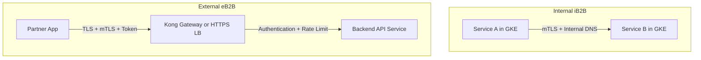
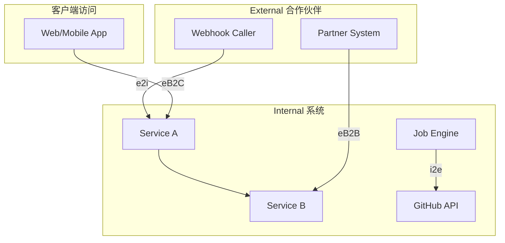
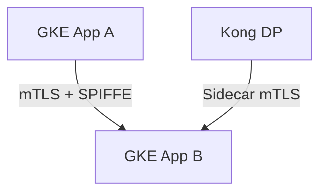
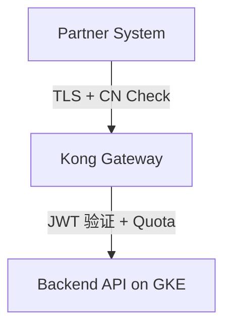
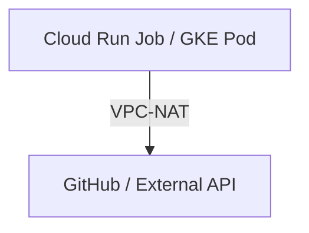
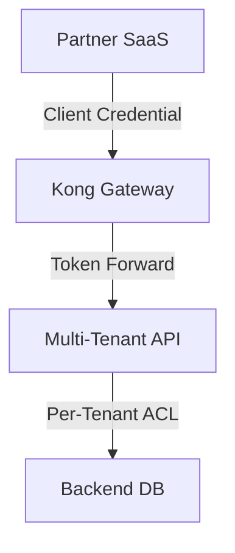

下面是关于 **平台安全相关验证机制中常提及的 iB2B、eB2B 等名词** 的解释，通常这些术语出现在企业对企业（**B2B**）平台安全架构、接入控制、证书管理与信任链设计中，常用于描述对接场景的安全策略差异。

---

## **🔐 iB2B vs eB2B 说明**

|**名称**|**全称**|**含义说明**|**常见场景举例**|
|---|---|---|---|
|iB2B|**Internal B2B**|企业 **内部系统之间（Intra-enterprise）** 的 B2B 通信与接入，强调内部可信。|同一集团下多个系统之间访问，如 GKE A 调用 GKE B 的 API|
|eB2B|**External B2B**|企业与 **外部合作伙伴/企业（Extra-enterprise）** 的 B2B 接入和通信。|第三方合作伙伴接入平台 API，如供应商接入你的 Kong Gateway|

---

## **✅ 安全验证差异对比**

|**项目**|**iB2B 内部 B2B**|**eB2B 外部 B2B**|
|---|---|---|
|网络信任|通常为内网（VPC、专线、VPN）|通常是公网访问（TLS + 验证）|
|接入方式|支持 mTLS、内部 CA 证书、IP allow|更严格的 mTLS、OAuth、API Key、JWT 等|
|身份识别|GCP IAM、SPIFFE、Workload Identity|客户端证书 + CN 验证 + Token 验证等|
|授权控制|内部 RBAC、服务账号 IAM|外部 ACL、消费配额、授权白名单等|
|安全策略|可信网络 + 最小权限|零信任模型 + 访问审计 + Cloud Armor 防护|

---

## **🧭 Mermaid 图：典型的 iB2B / eB2B 请求路径对比**

---

## **📌 延伸说明**

- 在 **iB2B 场景中**，平台往往强调的是“平台内信任”，常结合 GCP IAM + Workload Identity Pool 的方式进行身份标识，并辅以网络隔离。
    
- 在 **eB2B 场景中**，平台必须对接入进行更严格的认证，常配合如下策略：
    
    - mTLS + 客户端证书 CN 校验
        
    - API Gateway 层的 JWT Token 校验
        
    - GCP Cloud Armor 白名单、Geo IP 限制
        
    - 使用 Google Certificate Manager 进行 CA Trust Chain 管理
        
    

---

如果你正在设计 Kong Gateway 或 GCP Load Balancer 中的安全策略，了解 iB2B 与 eB2B 的区别有助于制定 **不同信任模型下的策略模板**（如 Authn/Authz、流量加密、限流与审计等）。

  

如需我帮你输出一份 Kong 或 GKE 中的 iB2B / eB2B 安全配置参考 YAML，也可以告诉我具体架构场景。

当然有。在企业平台安全架构中，除了 **iB2B** 和 **eB2B** 外，还有一些常见术语，用于描述不同的 **通信边界（boundary）**、**身份信任级别** 和 **业务访问模型**，这些术语常用于云架构设计、安全评估、平台分层访问控制中。

---

## **🔖 延伸术语分类汇总**

|**缩写术语**|**含义**|**说明与使用场景**|
|---|---|---|
|**iB2B**|Internal B2B|内部系统间通信（如服务间调用、微服务之间）|
|**eB2B**|External B2B|外部企业/合作方接入平台系统|
|**iB2C**|Internal B2C|平台内部向终端客户系统提供服务（如前端 Web 与后端 API 通信）|
|**eB2C**|External B2C|面向最终客户（公网用户）开放的服务|
|**i2i**|Internal to Internal|内部组件之间，如集群节点、容器、服务账户通信|
|**i2e**|Internal to External|平台内部组件访问外部依赖（如数据库、三方服务、API）|
|**e2i**|External to Internal|外部服务访问平台内部资源（常用于 webhook、回调、CDN、OAuth redirect）|
|**B2B2C**|Business to Business to Consumer|先对接企业服务（B2B），最终用户是个人客户（C）|

---

## **✅ 场景举例说明**

|**场景类型**|**示例**|**特性**|
|---|---|---|
|iB2B|Kong DP → GKE Runtime；服务间通信|通常使用 mTLS + 内部 DNS，配置 SPIFFE/IAM|
|eB2B|第三方企业访问 API；例如合作银行系统调你平台的接口|TLS + mTLS + JWT + Quota + 验证|
|i2i|同 VPC 内的服务 A 调用服务 B|VPC + Internal Load Balancer|
|i2e|GKE 服务拉取外部 GitHub 资源、访问 GCP APIs|Serverless VPC Access + NAT + DNS 控制|
|e2i|Stripe Webhook 调用你的 Nginx/GKE API 服务|公网入口控制 + Cloud Armor + Token/Auth 验证|
|B2B2C|SaaS 提供商服务多个企业，每个企业的最终客户是用户（如 Google Workspace）|多租户授权、身份代理、分级权限|

---

## **🧭 Mermaid 图：多通道安全通信模型**

---

## **📌 实际平台策略建议（按模型拆解）**

|**模型**|**推荐安全机制**|
|---|---|
|iB2B/i2i|VPC 内网通信 + mTLS/SPIFEE + Pod IAM|
|eB2B/e2i|HTTPS/mTLS + 客户端证书 + API Gateway 验证|
|i2e|NAT 路由控制 + Egress allowlist|
|B2B2C|多租户 Token + IAM 策略分离 + ACL 管理|

---

如果你希望进一步设计一份 GCP 平台架构中适配这些通信模型的 **安全策略清单（含组件级别）**，我可以基于你的 Kong / GKE / Cloud Run / Secret 管理体系帮你梳理。是否需要继续？

好的，下面我将基于你平台涉及的组件（如 Kong Gateway, GKE, Cloud Run, Secret Manager 等）以及实际可能面对的通信模式（iB2B、eB2B、i2e、e2i、B2B2C 等），梳理出一份 **多通道安全通信模型下的策略清单**，帮助你设计更加系统的安全框架。

---

## **🧩 平台级通信模型安全策略清单（按通道分类）**

  

### **🔒 1. iB2B / i2i（内部服务间调用）**

#### **✅ 安全策略**

|**安全策略项**|**推荐配置**|
|---|---|
|认证方式|**SPIFFE / Workload Identity Federation**|
|加密|**mTLS（Istio、Conscrypt、Linkerd）** 或 GCP 内部通信默认加密|
|授权控制|Pod IAM + Namespace 限制 + Pod-Level RBAC|
|网络策略|Kubernetes NetworkPolicy 控制 Service 通信|
|服务注册/发现|DNS + Internal Load Balancer（仅限内部可见）|
|Secret 管理|Secret Manager / Workload Identity + 自动挂载|

---

### **🌐 2. eB2B / e2i（外部企业或服务访问内部 API）**

#### **✅ 安全策略**

|**安全策略项**|**推荐配置**|
|---|---|
|认证方式|**mTLS 客户端证书 + CN Validation**|
|授权方式|Kong 插件（ACL / JWT / OAuth2）|
|限流 & 防护|Kong Rate-Limiting + GCP Cloud Armor（IP/Geo ACL）|
|接入隔离|使用 HTTPS LB，定义 TrustConfig（GCP Certificate Manager）|
|日志与审计|Cloud Logging + Kong Plugin Logs + Audit Sink|
|服务可用性保障|配置 PDB + ReadinessProbe + Retry 策略（避免 eB2B 请求丢失）|

---

### **📤 3. i2e（平台内部访问外部依赖）**

#### **✅ 安全策略**

|**安全策略项**|**推荐配置**|
|---|---|
|Egress 出口控制|**Serverless VPC Access + NAT Gateway** + 防火墙规则|
|DNS 解析限制|Private DNS + Cloud DNS Policy|
|连接策略|最小权限连接 + 最小出站 IP 范围（Cloud NAT SNAT 池）|
|机密管理|使用 Secret Manager 或 Workload Identity 拉取 OAuth2 Token|

---

### **🔄 4. B2B2C（第三方服务+客户访问平台）**

#### **✅ 安全策略**

|**安全策略项**|**推荐配置**|
|---|---|
|多租户认证|JWT 中嵌入租户字段（如 tenant_id）|
|鉴权与分权|RBAC / ABAC + ACL 白名单|
|配额与隔离|每租户配额限制（Kong Plugin 或 BigQuery Policy）|
|数据隔离|后端数据按租户分表/命名空间分离|
|审计与告警|每租户日志分流 + 使用 BQ/Looker Studio 做可视化|

---

## **🧱 推荐安全组件清单（平台维度）**

|**安全组件**|**作用**|
|---|---|
|**Kong Gateway**|API 鉴权、限流、路由、mTLS 验证、JWT 管理|
|**GCP Certificate Manager**|管理服务器 TLS 和客户端 CA + TrustConfig 管理|
|**Cloud Armor**|访问控制（IP、Header、地理）防御层|
|**Workload Identity**|实现 K8S Pod 身份认证至 GCP 资源层|
|**Secret Manager**|存储凭证、Token、证书（支持 IAM 限制访问）|
|**Cloud Logging + Audit Log**|审计日志、告警触发源|

---

## **📦 附加建议**

- 对于高敏感或监管场景（金融、医疗），推荐引入：
    
    - **零信任架构（ZTNA）**
        
    - **证书轮换自动化（CronJob + CA rotation tool）**
        
    - **Per-Service SLO/SLA 审核**
        
    

---

如你希望我帮助你生成一份平台实际架构中 **Kong Gateway + GCP TrustConfig** 多接入通道配置示例 YAML（例如 eB2B 和 iB2B 同时存在的混合模式），也可以告诉我具体需求或结构，我可以输出一份完整范本。是否继续？