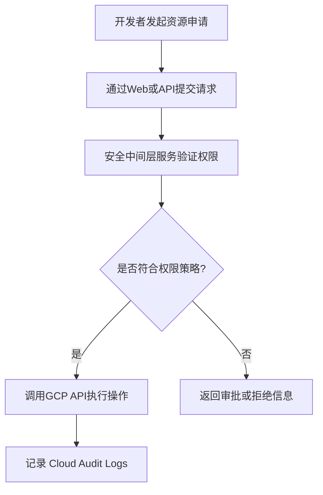
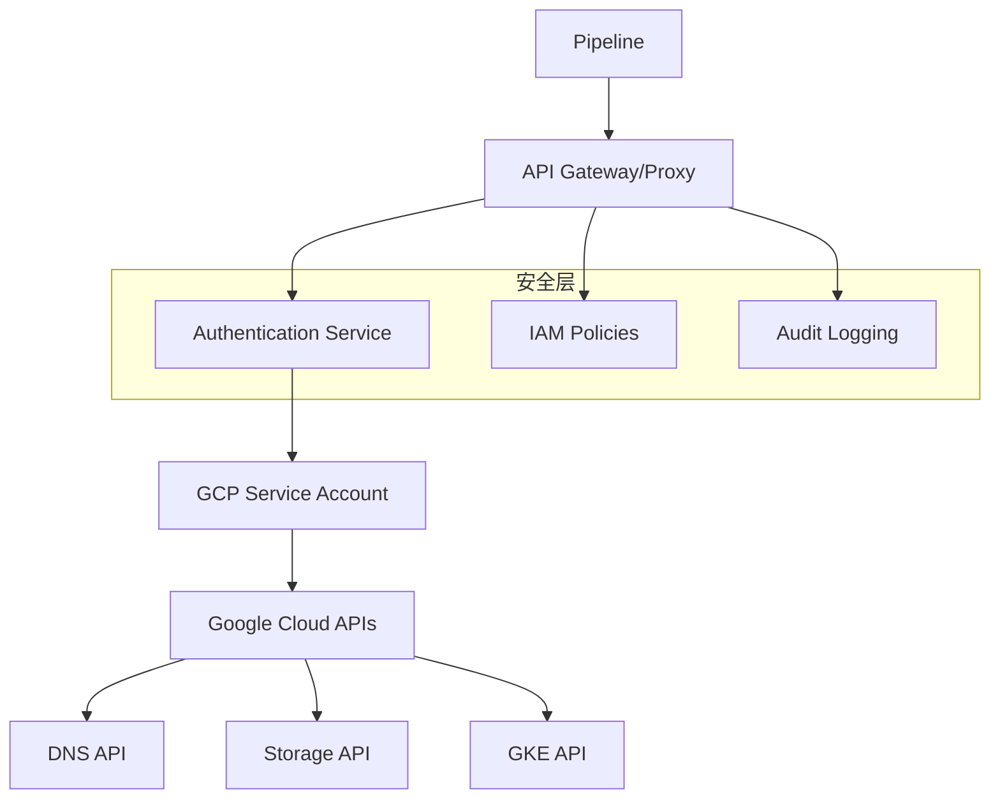
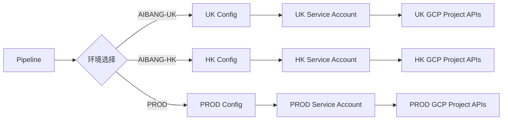
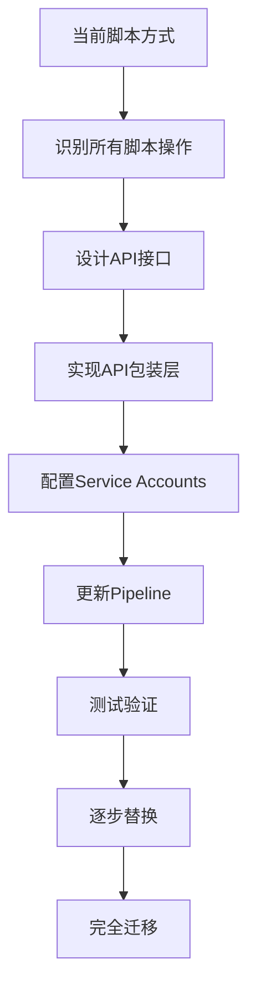

- [Q](#q)
- [Chatgpt](#chatgpt)
  - [**❗ 当前方式存在的问题（Pipeline + Script + gcloud/gsutil）**](#-当前方式存在的问题pipeline--script--gcloudgsutil)
  - [**✅ 推荐的改进方案（使用 Google Cloud 原生 API + 安全控制）**](#-推荐的改进方案使用-google-cloud-原生-api--安全控制)
    - [**1.** ](#1)
    - [**使用 Google Cloud 原生 REST API / Client Libraries 替代命令行工具**](#使用-google-cloud-原生-rest-api--client-libraries-替代命令行工具)
    - [**✅ 优点：**](#-优点)
  - [**🔒 安全最佳实践**](#-安全最佳实践)
    - [**1.** ](#1-1)
    - [**细分 Service Account 权限**](#细分-service-account-权限)
    - [**2.** ](#2)
    - [**集中封装 API 访问**](#集中封装-api-访问)
    - [**3.** ](#3)
    - [**统一授权和审批流程**](#统一授权和审批流程)
    - [**4.** ](#4)
    - [**基础设施即代码（IaC）工具**](#基础设施即代码iac工具)
  - [**🧭 总结 - 对于你的场景的推荐方案**](#-总结---对于你的场景的推荐方案)
  - [**📌 总结表**](#-总结表)
- [Grok](#grok)
    - [关键要点](#关键要点)
      - [为什么使用 Google Cloud API](#为什么使用-google-cloud-api)
      - [如何处理不同环境](#如何处理不同环境)
      - [GKE 部署的安全性](#gke-部署的安全性)
    - [详细报告](#详细报告)
      - [背景与问题分析](#背景与问题分析)
      - [解决方案：使用 Google Cloud API](#解决方案使用-google-cloud-api)
        - [API 使用示例](#api-使用示例)
      - [处理不同环境](#处理不同环境)
      - [GKE 部署的安全最佳实践](#gke-部署的安全最佳实践)
      - [CI/CD 管道集成](#cicd-管道集成)
      - [潜在挑战与注意事项](#潜在挑战与注意事项)
      - [结论](#结论)
      - [关键引文](#关键引文)
- [Claude4](#claude4)
  - [安全问题分析](#安全问题分析)
  - [推荐解决方案](#推荐解决方案)
    - [1. 使用 Google Cloud APIs + Service Account](#1-使用-google-cloud-apis--service-account)
    - [2. 实现方案对比](#2-实现方案对比)
    - [3. 具体实现示例](#3-具体实现示例)
      - [DNS 记录创建的 API 化改造](#dns-记录创建的-api-化改造)
    - [4. 多环境配置管理](#4-多环境配置管理)
    - [5. 推荐的技术栈](#5-推荐的技术栈)
    - [6. 安全加固建议](#6-安全加固建议)
    - [7. 迁移路径](#7-迁移路径)
- [Gemini](#gemini)
- [构建安全的、可扩展的GCP部署：超越脚本的最佳实践框架](#构建安全的可扩展的gcp部署超越脚本的最佳实践框架)
  - [第1章 在脚本驱动的CI/CD流水线中的安全态势分析](#第1章-在脚本驱动的cicd流水线中的安全态势分析)
    - [1.1 验证安全担忧：gcloud/gsutil的攻击面](#11-验证安全担忧gcloudgsutil的攻击面)
    - [1.2 关键漏洞：解构静态服务账号密钥的风险](#12-关键漏洞解构静态服务账号密钥的风险)
      - [凭证泄露与暴露途径](#凭证泄露与暴露途径)
      - [权限升级路径](#权限升级路径)
      - [不可否认性与审计挑战](#不可否认性与审计挑战)
    - [1.3 脚本模型中的软件供应链影响](#13-脚本模型中的软件供应链影响)
  - [第2章 基础安全支柱：通过工作负载身份联合实现无密钥认证](#第2章-基础安全支柱通过工作负载身份联合实现无密钥认证)
    - [2.1 工作负载身份联合（WIF）简介：现代认证标准](#21-工作负载身份联合wif简介现代认证标准)
    - [2.2 OIDC令牌交换流程：从CI/CD到GCP的详细解析](#22-oidc令牌交换流程从cicd到gcp的详细解析)
    - [2.3 架构蓝图：配置身份池、提供商和属性映射](#23-架构蓝图配置身份池提供商和属性映射)
    - [2.4 WIF如何直接缓解长生命周期凭证的风险](#24-wif如何直接缓解长生命周期凭证的风险)
  - [第3章 解决方案路径I：程序化抽象模型](#第3章-解决方案路径i程序化抽象模型)
    - [3.1 架构概述：通过客户端库管理GCP资源](#31-架构概述通过客户端库管理gcp资源)
    - [3.2 在代码中实现多环境逻辑（以Python为例）](#32-在代码中实现多环境逻辑以python为例)
    - [3.3 应用最小权限原则（PoLP）](#33-应用最小权限原则polp)
    - [3.4 实施深度解析：以编程方式管理Cloud DNS和存储桶](#34-实施深度解析以编程方式管理cloud-dns和存储桶)
      - [Cloud DNS记录管理示例](#cloud-dns记录管理示例)
      - [Cloud Storage存储桶创建示例](#cloud-storage存储桶创建示例)
    - [3.5 程序化抽象模型的优缺点及适用场景](#35-程序化抽象模型的优缺点及适用场景)
  - [第4章 解决方案路径II：Kubernetes原生声明式模型](#第4章-解决方案路径iikubernetes原生声明式模型)
    - [4.1 Google Cloud Config Connector (KCC) 简介](#41-google-cloud-config-connector-kcc-简介)
    - [4.2 多环境管理的架构蓝图：利用命名空间](#42-多环境管理的架构蓝图利用命名空间)
    - [4.3 演进的CI/CD流水线：从命令式脚本到声明式`kubectl apply`](#43-演进的cicd流水线从命令式脚本到声明式kubectl-apply)
    - [4.4 认证流程：通过Workload Identity将KCC绑定到GCP](#44-认证流程通过workload-identity将kcc绑定到gcp)
    - [4.5 实施深度解析：GKE、DNS和存储桶的声明式清单](#45-实施深度解析gkedns和存储桶的声明式清单)
      - [DNS区域和记录集示例](#dns区域和记录集示例)
      - [StorageBucket示例](#storagebucket示例)
    - [4.6 Kubernetes原生模型的优缺点及适用场景](#46-kubernetes原生模型的优缺点及适用场景)
  - [第5章 比较分析与战略建议](#第5章-比较分析与战略建议)
    - [5.1 决策框架：为您的组织选择正确的路径](#51-决策框架为您的组织选择正确的路径)
    - [5.2 推荐的最佳实践](#52-推荐的最佳实践)
      - [针对以GKE为中心的组织](#针对以gke为中心的组织)
      - [针对GKE无关或混合云环境的组织](#针对gke无关或混合云环境的组织)
      - [混合方法：两全其美](#混合方法两全其美)
  - [第6章 核心治理：审计、监控与持续验证](#第6章-核心治理审计监控与持续验证)
    - [6.1 利用Cloud Audit Logs实现完全的可追溯性](#61-利用cloud-audit-logs实现完全的可追溯性)
    - [6.2 集成Security Command Center进行主动威胁检测](#62-集成security-command-center进行主动威胁检测)
    - [6.3 IAM策略审查与分析的最佳实践](#63-iam策略审查与分析的最佳实践)
  - [第7章 结论：迈向安全成熟的部署框架](#第7章-结论迈向安全成熟的部署框架)
- [Dia](#dia)
- [参数校验](#参数校验)
- [调用脚本](#调用脚本)

# Q
我们在 GCP 平台给多用户提供服务.现在我们多数的服务都是部署都是通过比如 pipeline+Script 的方式来实现的.但是这个方式被认为是不够安全的,比如 pipeline 会调用 gsutil 命令来进行 Bucket 的一些操作.或者调用 gcloud 命令进行 DNS 的创建和配置.等等.如果认为此类方法都是不安全的.解决办法是通过 Google 的 API 来进行对应的操作么?一般对于类似问题最佳的时间方案是什么?

你的问题非常关键 —— 在 GCP 上为多用户提供服务时，**如何保证基础设施操作的安全性和可审计性** 是系统设计中的重点。以下是围绕你提到的“Pipeline + Script + gsutil/gcloud”方式可能存在的安全问题、改进方向以及最佳实践的总结。

---
# Chatgpt

## **❗ 当前方式存在的问题（Pipeline + Script + gcloud/gsutil）**

| **问题类别**   | **描述**                                                                                  |
| -------------- | ----------------------------------------------------------------------------------------- |
| 权限过大       | Pipeline 的 Service Account 一般拥有较大的权限，如 roles/editor，容易造成误操作或权限滥用 |
| 不够审计化     | 脚本中的操作往往是黑箱操作，难以通过 IAM Policy 或 Cloud Audit Logs 精细追踪              |
| 不易细粒度控制 | gsutil 和 gcloud 操作难以通过 IAM Condition 做精细授权控制                                |
| 可预测性差     | Shell 脚本逻辑复杂、依赖项多，难以重用和标准化管理                                        |
| 安全审计困难   | 操作日志往往是 Pipeline 平台自己维护，未完全与 Cloud Audit Logs 对接                      |

---

## **✅ 推荐的改进方案（使用 Google Cloud 原生 API + 安全控制）**

### **1.** 

### **使用 Google Cloud 原生 REST API / Client Libraries 替代命令行工具**

| **类型**   | **推荐用法**                                                          |
| ---------- | --------------------------------------------------------------------- |
| Storage    | 用 Google Cloud Storage JSON API / Python/Go/Java SDK 来替代 gsutil   |
| DNS        | 用 Cloud DNS API 来替代 gcloud dns 命令                               |
| IAM 管理   | 使用 IAM API（如 projects.serviceAccounts.\*）来细粒度管控权限        |
| 网络配置   | 如 Load Balancer、Firewall、Routes 使用 Compute Engine API 进行自动化 |
| 证书、MTLS | 使用 Certificate Manager API 自动创建 trust config 与证书绑定         |

### **✅ 优点：**

- **支持服务化封装**：更适合构建成内部安全服务或微服务架构。
- **具备更高的可审计性**：操作通过 API，可以记录到 Cloud Audit Logs。
- **细粒度权限控制**：结合 IAM 权限可以限定某类 API 操作，例如只允许创建特定前缀的 bucket。
- **可加统一审计/审批流**：便于接入 IAM Conditions、Cloud Audit Logs、Cloud Functions 进行审批自动化。

---

## **🔒 安全最佳实践**

### **1.** 

### **细分 Service Account 权限**

使用最小权限原则，给每一个 pipeline 分配一个只具备对应资源权限的 Service Account，例如：

```
# 只允许访问特定 bucket
roles/storage.objectAdmin + IAM Conditions
```

### **2.** 

### **集中封装 API 访问**

构建内部的 **安全中间层服务**，对外暴露简化接口，内部调用 GCP API。例如：

```
用户 -> 安全API服务 -> 调用 Cloud DNS API 创建 DNS 记录
```

这种方式便于集中审计和统一权限控制。

### **3.** 

### **统一授权和审批流程**

结合以下工具：

- **Cloud IAM Conditions**：对资源和动作进行细粒度控制
- **Cloud Audit Logs**：跟踪 API 调用历史
- **Cloud Functions / Workflows**：加入自动审批机制
- **Cloud Build + Approvals**：在关键操作前添加审批节点

### **4.** 

### **基础设施即代码（IaC）工具**

如果适用，推荐使用 **Terraform (Google Provider)** 来替代手动 gcloud / gsutil 脚本：

```
terraform apply # 由 CI/CD 系统调用，但权限控制在 Terraform 管理者手上
```

---

## **🧭 总结 - 对于你的场景的推荐方案**



---

## **📌 总结表**

| **项目**       | **当前脚本方式** | **改进方向**                   |
| -------------- | ---------------- | ------------------------------ |
| 操作工具       | gcloud / gsutil  | GCP 原生 API / SDK             |
| 安全控制       | pipeline + SA    | 细粒度 IAM + Conditions        |
| 审计能力       | 弱/依赖平台日志  | 使用 Cloud Audit Logs          |
| 自动化架构     | pipeline 脚本    | 封装成 API 服务 + 统一权限审查 |
| 权限最小化实践 | 难               | 拆分 SA 权限 + 条件绑定        |

---

如你需要，我可以帮你生成样例代码（如 Python 调用 GCP API 创建 DNS 或 Storage），或者协助构建 API 封装层的初步架构设计。是否需要？

# Grok

### 关键要点

- 研究表明，使用 Google Cloud API 比脚本更安全，可能减少凭据暴露风险。
- 证据倾向于通过参数化 API 调用支持不同环境（如 AIBANG-UK、AIBANG-HK）。
- 部署 API 时，建议结合 GKE 安全最佳实践，如使用私有集群和工作负载身份。

#### 为什么使用 Google Cloud API

目前您使用管道调用脚本（如 `a.sh` 创建 DNS 记录）的方式，公司安全部门认为不够安全。研究表明，使用 Google Cloud API 替代脚本可以更好地控制权限，减少凭据暴露风险。例如，Cloud DNS API 和 Cloud Storage API 允许通过服务账户进行身份验证，确保最小权限原则。

#### 如何处理不同环境

对于不同 GCP 环境（如 AIBANG-UK、AIBANG-HK），可以通过参数化 API 调用实现灵活部署。例如，在管道中设置环境变量（如项目 ID 或区域名称），使同一管道适用于多个环境。

#### GKE 部署的安全性

如果您在 GKE 上部署 API，建议启用私有集群、工作负载身份和网络策略等安全措施，以保护您的集群。

---

### 详细报告

以下是关于在 Google Cloud Platform (GCP) 上使用 GCE 和 GKE 部署 API 的详细分析，重点关注安全性和自动化部署的最佳实践，特别是在处理不同环境（如 AIBANG-UK、AIBANG-HK）时的解决方案。

#### 背景与问题分析

您当前使用管道调用脚本（如 `a.sh`）来自动化部署 API，例如创建 DNS 记录或使用 `gsutil` 管理存储桶。这种方法被公司安全部门认为不够安全，主要是因为脚本可能嵌入凭据或使用宽泛的权限，增加安全风险。此外，您提到有多个 GCP 环境（如 AIBANG-UK、AIBANG-HK），需要一种灵活的解决方案。

#### 解决方案：使用 Google Cloud API

研究表明，使用 Google Cloud API 替代脚本是更安全的选择。以下是详细原因和实施步骤：

- **安全性提升**：API 调用可以通过服务账户与 IAM 集成，确保最小权限原则。例如，Cloud DNS API 和 Cloud Storage API 允许您为服务账户分配特定权限（如只读或只写），减少凭据暴露风险。相比之下，脚本（如 `gcloud dns record-sets create`）可能需要更广泛的权限，增加安全隐患。
- **审计与日志**：API 调用会被自动记录在 GCP 的日志服务（如 Cloud Logging）中，提供清晰的审计跟踪，便于监控和调查。
- **稳定性与版本控制**：API 通常有明确的版本和文档支持（如 Cloud DNS API v1），相比脚本更稳定，减少因工具更新导致的部署中断。

##### API 使用示例

以下是使用 Python 调用 Cloud DNS API 和 Cloud Storage API 的示例，适合集成到 CI/CD 管道中：

- **创建 DNS 记录**：

    ```python
    import os
    from google.oauth2 import service_account
    from googleapiclient.discovery import build

    # 加载服务账户凭据
    creds = service_account.Credentials.from_service_account_file('path/to/service-account.json')

    # 创建 DNS 服务对象
    dns_service = build('dns', 'v1', credentials=creds)

    # 定义项目和托管区域（可通过环境变量参数化）
    project = os.environ['PROJECT_ID']  # e.g., 'AIBANG-UK-project'
    managed_zone = 'your-managed-zone'

    # 定义 DNS 记录
    change = {
        "additions": [
            {
                "name": "example.com.",
                "type": "A",
                "ttl": 300,
                "rrdatas": ["192.0.2.1"]
            }
        ]
    }

    # 创建 DNS 记录
    request = dns_service.changes().create(project=project, managedZone=managed_zone, body=change)
    response = request.execute()
    print(f"Change created with ID: {response['id']}")
    ```

- **创建存储桶**：

    ```python
    from google.cloud import storage

    # 创建客户端
    storage_client = storage.Client.from_service_account_json('path/to/service-account.json')

    # 创建存储桶（可通过环境变量参数化）
    bucket_name = f"{os.environ['ENVIRONMENT']}-bucket"  # e.g., 'AIBANG-UK-bucket'
    bucket = storage_client.create_bucket(bucket_name)
    print(f"Bucket {bucket.name} created.")
    ```

这些示例展示了如何通过 API 调用实现自动化部署，并通过环境变量（如 `PROJECT_ID` 或 `ENVIRONMENT`）支持不同环境。

#### 处理不同环境

您提到有多个 GCP 环境（如 AIBANG-UK、AIBANG-HK），这可以通过参数化 API 调用解决。以下是具体方法：

- **环境变量参数化**：在 CI/CD 管道中，定义环境变量（如 `ENVIRONMENT`、`PROJECT_ID`、`MANAGED_ZONE`），并在 API 调用中动态使用。例如，AIBANG-UK 可以对应 `AIBANG-UK-project`，AIBANG-HK 对应 `AIBANG-HK-project`。
- **配置管理**：使用工具如 Terraform 或 Cloud Deployment Manager 来管理环境配置，确保每个环境的资源（如 DNS 区域、存储桶）一致性。
- **多环境部署流程**：在管道中添加条件逻辑，根据环境变量选择不同的项目 ID 或区域。例如，使用 Jenkins 或 GitLab CI 的阶段（stage）来区分开发、测试和生产环境。

#### GKE 部署的安全最佳实践

鉴于您使用 GKE 部署 API，以下是针对 GKE 的安全最佳实践：

| **安全措施**   | **描述**                                                                                                                                                               |
| -------------- | ---------------------------------------------------------------------------------------------------------------------------------------------------------------------- |
| 私有集群       | 启用私有集群，限制控制平面访问，仅允许授权网络访问 ([Harden your cluster's security](https://cloud.google.com/kubernetes-engine/docs/how-to/hardening-your-cluster))。 |
| 工作负载身份   | 使用工作负载身份管理 GKE 工作负载的权限，替代服务账户密钥 ([GKE security overview](https://cloud.google.com/kubernetes-engine/docs/concepts/security-overview))。      |
| 网络策略       | 实现网络策略控制 Pod 之间的流量，防止未经授权的通信 ([Google Kubernetes Engine Best Practices: Security](https://www.cloudskillsboost.google/course_templates/732))。  |
| 二进制授权     | 启用二进制授权，确保只部署经过验证的容器镜像 ([GKE Security: Best Practices Guide](https://sysdig.com/learn-cloud-native/gke-security-best-practices-guide/))。        |
| 定期升级与补丁 | 定期升级 GKE 集群，应用最新的安全补丁，保护节点操作系统 ([GKE security overview](https://cloud.google.com/kubernetes-engine/docs/concepts/security-overview))。        |

这些措施可以显著增强 GKE 集群的安全性，特别是在多租户或生产环境中。

#### CI/CD 管道集成

将 Google Cloud API 集成到 CI/CD 管道是实现自动化部署的关键。以下是相关资源和工具：

- 使用 **Cloud Build** 构建管道，支持 API 调用并集成 GCP 服务 ([Implement CI/CD Pipelines on Google Cloud](https://www.cloudskillsboost.google/course_templates/691))。
- 确保管道中的每个步骤都有适当的权限，例如通过服务账户密钥或 ADC 进行身份验证。
- 监控和日志记录：使用 Cloud Logging 跟踪 API 调用，确保所有操作可审计。

#### 潜在挑战与注意事项

- **迁移成本**：从脚本迁移到 API 调用可能需要调整现有管道，建议逐步实施，先在开发环境测试。
- **权限管理**：确保服务账户的权限严格限制，避免过度授权。
- **环境隔离**：在多环境部署中，确保资源命名和配置避免冲突，例如存储桶名称必须在 GCP 中唯一。

#### 结论

综上所述，解决您当前安全问题的最佳方案是通过 Google Cloud API 替代脚本，结合 GKE 安全最佳实践和参数化部署支持不同环境（如 AIBANG-UK、AIBANG-HK）。这种方法不仅提升安全性，还增强了灵活性和可维护性，符合 Google Cloud 的推荐实践。

---

#### 关键引文

- [Harden your cluster's security on GKE](https://cloud.google.com/kubernetes-engine/docs/how-to/hardening-your-cluster)
- [GKE security overview and features](https://cloud.google.com/kubernetes-engine/docs/concepts/security-overview)
- [Google Kubernetes Engine Best Practices: Security](https://www.cloudskillsboost.google/course_templates/732)
- [GKE Security: Best Practices Guide by Sysdig](https://sysdig.com/learn-cloud-native/gke-security-best-practices-guide/)
- [Implement CI/CD Pipelines on Google Cloud](https://www.cloudskillsboost.google/course_templates/691)
- [Cloud DNS API documentation](https://cloud.google.com/dns/docs/apis)
- [Cloud Storage API documentation](https://cloud.google.com/storage/docs/json_api/v1)
- [Authentication for production environments](https://cloud.google.com/docs/authentication/production)

# Claude4

基于你描述的安全需求，确实直接在 pipeline 中调用 shell 脚本和命令行工具（如`gcloud`、`gsutil`）存在安全风险。以下是推荐的解决方案：

## 安全问题分析

当前方案的主要安全风险：

- **凭证暴露**：脚本中可能包含硬编码的密钥或配置
- **权限过大**：pipeline 可能需要过多的 GCP 权限
- **审计困难**：难以追踪具体的操作和权限使用
- **代码注入**：脚本参数可能被恶意利用

## 推荐解决方案

### 1. 使用 Google Cloud APIs + Service Account

```bash
# 替代直接的gcloud命令
# 旧方式：gcloud dns record-sets transaction start --zone=my-zone
# 新方式：通过API调用
```

**最佳实践架构：**



### 2. 实现方案对比

| 方案                 | 安全性 | 复杂度 | 推荐度 |
| -------------------- | ------ | ------ | ------ |
| 直接脚本调用         | 低     | 低     | ❌     |
| Google Cloud APIs    | 高     | 中     | ✅     |
| Cloud Functions 包装 | 高     | 中高   | ✅     |
| 第三方 API 网关      | 最高   | 高     | ✅     |

### 3. 具体实现示例

#### DNS 记录创建的 API 化改造

**原始脚本方式：**

```bash
#!/bin/bash
# a.sh
ZONE=$1
RECORD_NAME=$2
IP=$3
gcloud dns record-sets transaction start --zone=$ZONE
gcloud dns record-sets transaction add $IP --name=$RECORD_NAME --type=A --zone=$ZONE
gcloud dns record-sets transaction execute --zone=$ZONE
```

**API 化方式：**

```python
from google.cloud import dns
from google.oauth2 import service_account

def create_dns_record(zone_name, record_name, ip_address, env):
    # 根据环境选择不同的项目和凭证
    project_configs = {
        'AIBANG-UK': {'project_id': 'AIBANG-UK-project', 'credentials_path': '/secrets/AIBANG-UK-sa.json'},
        'AIBANG-HK': {'project_id': 'AIBANG-HK-project', 'credentials_path': '/secrets/AIBANG-HK-sa.json'}
    }

    config = project_configs.get(env)
    if not config:
        raise ValueError(f"Unknown environment: {env}")

    credentials = service_account.Credentials.from_service_account_file(
        config['credentials_path']
    )

    client = dns.Client(project=config['project_id'], credentials=credentials)
    zone = client.zone(zone_name)

    record_set = zone.resource_record_set(record_name, 'A', 300, [ip_address])
    changes = zone.changes()
    changes.add_record_set(record_set)
    changes.create()

    return changes.status
```

### 4. 多环境配置管理



### 5. 推荐的技术栈

**API 包装层选择：**

- **Cloud Functions**：轻量级，适合简单操作
- **Cloud Run**：容器化，更灵活
- **GKE Service**：复杂业务逻辑

**认证授权：**

- **Workload Identity**：GKE 中的最佳实践
- **Service Account Keys**：传统方式，需妥善管理
- **IAM Conditions**：细粒度权限控制

### 6. 安全加固建议

```yaml
# 示例：IAM策略配置
apiVersion: v1
kind: ConfigMap
metadata:
  name: gcp-permissions
data:
  dns-operator: |
    {
      "bindings": [
        {
          "role": "roles/dns.admin",
          "members": ["serviceAccount:dns-operator@project.iam.gserviceaccount.com"],
          "condition": {
            "title": "Environment Restriction",
            "description": "Only allow DNS operations in specific zones",
            "expression": "resource.name.startsWith('projects/dev-')"
          }
        }
      ]
    }
```

### 7. 迁移路径



**关键实施步骤：**

1. **审计现有脚本**：列出所有 GCP 操作
2. **设计 API 规范**：定义统一的接口标准
3. **实现认证层**：确保每个环境的隔离
4. **逐步迁移**：优先处理高风险操作
5. **监控和日志**：确保操作可追踪

这种方案不仅解决了安全问题，还提供了更好的可维护性和可扩展性。

# Gemini

# 构建安全的、可扩展的GCP部署：超越脚本的最佳实践框架

## 第1章 在脚本驱动的CI/CD流水线中的安全态势分析

本章旨在通过剖析当前方法中存在的具体、有形的风险，确立变革的关键必要性。其目标是将讨论从泛泛的“安全担忧”转变为对一系列有据可查、有现实先例的漏洞的明确界定。

### 1.1 验证安全担忧：gcloud/gsutil的攻击面

任何CI/CD（持续集成/持续部署）流水线都内含固有风险，包括构建平台被攻陷、恶意代码注入以及软件供应链攻击 1。如果安全措施不到位，直接使用脚本会加剧这些风险。问题的核心并非

`gcloud`工具本身，而是其在自动化环境中通常依赖的认证方式：长期有效的静态凭证 3。这些凭证一旦泄露，就为攻击者提供了直接的切入点。

一个典型的现实世界案例是Codecov的安全事件，攻击者利用泄露的凭证修改了存储在Google Cloud Storage（GCS）存储桶中的工件 1。这一事件直接反映了用户当前管理GCS存储桶等资源的场景中所面临的风险。这清晰地表明，依赖静态凭证的自动化流程是软件供应链中的一个薄弱环节，任何一个环节的失守都可能导致整个链条的崩溃。

### 1.2 关键漏洞：解构静态服务账号密钥的风险

本节将深入剖析由用户管理的服务账号密钥（Service Account Keys）所带来的威胁。这些密钥本质上是代表非人类用户（如应用程序或服务）的密码，其安全管理至关重要 3。

#### 凭证泄露与暴露途径

静态服务账号密钥面临着极高的泄露风险，因为它们需要以某种形式被存储和访问。泄露的途径多种多样，包括：

- **代码库提交**：开发者可能会无意中将密钥文件提交到源代码版本控制系统（如Git），即使是私有仓库也存在风险 3。
    
- **配置文件与环境变量**：将密钥硬编码在配置文件或CI/CD系统的环境变量中，如果这些系统的访问控制不当或日志记录过于详细，密钥就可能被暴露 7。
    
- **内部通讯与文档**：通过即时消息、电子邮件或内部维基（Wiki）等不安全的渠道传递密钥，会显著增加其暴露面 3。
    

Google Cloud的官方最佳实践明确警告，应避免将密钥直接嵌入代码、存储在源代码树中，甚至不要将其遗留在临时的下载文件夹中 5。研究表明，即使将密钥存储在CI/CD平台提供的变量中，如果平台不支持有效的屏蔽（masking）机制，或者构建日志无意中打印出变量内容，也可能导致泄露 7。

#### 权限升级路径

一旦服务账号密钥被泄露，攻击者便能冒充该服务账号的身份。如果该服务账号拥有过高的权限，攻击者就能借此升级其权限，访问本无权访问的资源。

- **过度授权的风险**：使用宽泛的原始角色（primitive roles）如“编辑者”（`Editor`）或“所有者”（`Owner`），而非遵循最小权限原则（Principle of Least Privilege, PoLP）的自定义角色，是导致权限升级的主要原因 2。一个拥有
    
    `Editor`角色的服务账号，其密钥被盗后，攻击者不仅能读写项目中的大部分资源，还可能利用这些权限进一步横向移动或巩固其存在。
    
- **`Editor`角色的特定危险**：`Editor`角色尤其危险，因为它包含了`iam.serviceAccountKeys.create`权限，允许其为项目中的_任何_服务账号创建新的密钥。这意味着，一个被攻陷的、拥有`Editor`角色的服务账号，可以成为攻击者获取更高级别（如拥有`Owner`角色）服务账号访问权限的跳板，从而实现完全的权限升级 5。
    
- **新兴攻击向量**：一种新颖的攻击技术利用了IAM条件（IAM Conditions）和资源标签（Tags）。攻击者即使只拥有看似低风险的角色（如`roles/resourcemanager.tagUser`），也可能通过为特定资源（如一个GCE虚拟机）附加一个预先定义好的标签，来满足某个IAM条件策略，从而获得对该资源的管理员权限 12。这警示我们，即使是看似无害的权限（如修改标签），也必须被视为潜在的敏感操作，需要严格管控。
    

#### 不可否认性与审计挑战

当使用服务账号密钥执行操作时，Google Cloud Audit Logs中的主体（principal）记录为该服务账号的电子邮件地址。这带来了严重的不可否认性（Non-repudiation）问题。

- **溯源困难**：由于审计日志只显示服务账号身份，因此很难将某项可疑活动精确追溯到具体的执行者——是某位开发者、某个特定的CI/CD流水线作业，还是已经渗透到系统中的攻击者 3。
    
- **责任归属模糊**：如果多个应用程序或多条流水线共享同一个服务账号及其密钥，那么审计的难度将呈指数级增长。一旦发生安全事件，将无法明确责任归属，也难以确定影响范围 5。
    

### 1.3 脚本模型中的软件供应链影响

在现代DevSecOps实践中，CI/CD流水线是软件供应链的核心环节。一个由脚本驱动的部署流程，其安全性直接关系到整个供应链的完整性。如果用于认证的密钥被泄露，攻击者便可以在流水线的关键节点（如构建或部署阶段）注入恶意代码或替换合法工件，导致恶意软件被部署到生产环境 1。整个供应链的安全性取决于其最薄弱的一环，而当前基于静态密钥的认证方法，无疑构成了这样一个已知的、必须被加固的薄弱环节。

综上所述，安全部门提出的担忧并非空穴来风，而是对一类有据可查且影响深远的漏洞的直接反应。风险的根源不在于`gcloud`或`gsutil`等工具本身，而在于它们在自动化场景下所鼓励使用的、基于静态密钥的认证模型。因此，寻找替代方案并非一项优化任务，而是一项关键的安全修复措施，旨在保护公司的核心数字资产和软件供应链。要解决的核心问题是彻底消除对静态、长生命周期凭证的依赖。

## 第2章 基础安全支柱：通过工作负载身份联合实现无密钥认证

本章将介绍支撑两种推荐解决方案的核心技术。它详细阐述了如何消除静态密钥，从而直接解决在第1章中识别出的各类风险。

### 2.1 工作负载身份联合（WIF）简介：现代认证标准

工作负载身份联合（Workload Identity Federation, WIF）是Google Cloud官方推荐的方法，用于授权外部工作负载（例如运行在GitLab、GitHub Actions或本地数据中心的CI/CD作业）访问GCP资源，而完全无需使用服务账号密钥 13。

WIF的出现标志着一种安全模型的范式转变：从传统的“持有秘密（possession of a secret）”模型，转变为现代的“可验证身份（verifiable identity）”模型。这种转变将凭证管理的负担——包括创建、分发、轮换和保护密钥——从用户手中移除，交由云平台本身以更安全、更自动化的方式处理，从而极大地降低了安全风险和运维复杂性 16。

### 2.2 OIDC令牌交换流程：从CI/CD到GCP的详细解析

为了揭开WIF的神秘面纱，以下将分步详解其基于OpenID Connect (OIDC)的认证握手流程。这个流程是实现无密钥认证的关键。

- 第1步：令牌颁发（Token Issuance）
    
    现代CI/CD平台（如GitLab、GitHub）可以扮演OIDC身份提供商（Identity Provider, IdP）的角色。当一个CI/CD作业启动时，平台会为其生成一个独特的、短生命周期的、经过签名的JSON Web Token (JWT)，也称为ID令牌（ID Token） 17。这个ID令牌是一个包含一系列“声明（claims）”的数据结构，描述了该作业的上下文信息，例如代码仓库路径（
    
    `project_path`）、分支名称（`ref`）、触发事件的用户名（`user_login`）等。这些声明是可验证的，构成了作业的数字身份。
    
- 第2步：令牌交换（Token Exchange）
    
    CI/CD作业获取到这个ID令牌后，会将其发送给Google Cloud的安全令牌服务（Security Token Service, STS）API的一个特定端点 20。这一步是向GCP表明身份的开始。
    
- 第3步：身份验证（Verification）
    
    GCP的STS API收到ID令牌后，会执行严格的验证过程。它首先会使用从IdP（例如，https://gitlab.com）的公开密钥端点获取的公钥来验证ID令牌的数字签名，确保令牌未经篡改且确实由可信的IdP颁发。接着，STS会检查令牌中的声明（特别是iss，即颁发者URL）是否与预先配置好的工作负载身份池提供商（Workload Identity Pool Provider）中的设置相匹配 14。
    
- 第4步：凭证生成（Credential Generation）
    
    一旦验证成功，STS API会返回一个短生命周期的GCP联合访问令牌（federated access token） 14。这个令牌代表GCP已经承认了该外部工作负载的身份。
    
- 第5步：服务账号模拟（Service Account Impersonation）
    
    仅有联合访问令牌还不足以访问具体资源。工作负载需要一个GCP内的身份角色。因此，下一步是使用这个联合访问令牌去调用IAM Credentials API，请求模拟（impersonate）一个预先指定的GCP服务账号。如果IAM策略允许这个外部身份（由ID令牌的声明定义）模拟该服务账号，API就会返回一个针对该服务账号的、生命周期更短（默认为1小时）的OAuth 2.0访问令牌 17。
    
- 第6步：API访问（API Access）
    
    最后，这个OAuth 2.0访问令牌将作为承载令牌（Bearer Token）用于所有后续对GCP API（如Cloud DNS API、Cloud Storage API）的认证调用 20。
    
    `gcloud`命令行工具和Google Cloud客户端库都经过专门设计，能够自动检测并使用通过此流程获取的令牌，开发者无需在代码中进行复杂的凭证管理 20。
    

### 2.3 架构蓝图：配置身份池、提供商和属性映射

成功实施WIF的关键在于正确配置其核心组件，以建立GCP与外部IdP之间的信任关系。

- **工作负载身份池（Workload Identity Pool）**：这是一个用于管理外部身份的逻辑容器。最佳实践是为每个外部IdP（例如，一个GitLab实例）在每个需要集成的GCP项目中创建一个专用的身份池 14。
    
- **工作负载身份池提供商（Workload Identity Pool Provider）**：它在身份池内部定义了与特定外部IdP（如`https://gitlab.com`）的具体连接。这里需要配置IdP的颁发者URL（Issuer URL）和允许的受众（Audience）。
    
- **属性映射与条件（Attribute Mapping and Conditions）**：这是WIF中最为关键的安全控制机制。
    
    - **属性映射**：您可以将来自外部ID令牌的声明（`assertion`）映射为Google可以理解的属性（`attribute`）。例如，将GitLab的`project_path`声明映射为Google的`attribute.project_path`属性。
        
    - **属性条件**：在配置提供商时，可以设置一个条件，只有满足该条件的ID令牌才会被接受。例如，可以设置一个条件，要求`assertion.project_path`必须以`my-company-group/`开头，从而确保只有公司内部仓库的作业才能进行认证。
        
    - **IAM策略绑定**：在为服务账号授予`roles/iam.workloadIdentityUser`角色（允许模拟）时，可以利用映射的属性来设置精细的IAM条件。例如，可以创建一个IAM策略绑定，规定只有当`attribute.project_path`等于`my-company-group/production-api`且`attribute.ref`等于`refs/heads/main`时，才允许模拟`production-deployer-sa`这个服务账号 14。
        

### 2.4 WIF如何直接缓解长生命周期凭证的风险

通过采用WIF，第1章中详述的风险得到了根本性的解决。

- **凭证泄露**：由于不存在需要存储和管理的长生命周期密钥文件，泄露的风险从源头上被消除。所有凭证都是为每个作业按需生成的、短生命周期的临时令牌，过期后自动失效 3。
    
- **权限升级**：访问权限被属性条件和IAM条件双重锁定。即使攻击者攻陷了一个CI/CD作业的运行时环境，他们也无法利用该作业的身份去访问其预定范围之外的任何资源。权限被严格限制在“该作业在特定条件下能做什么”的最小集合内。
    
- **不可否认性**：审计日志变得更加清晰。除了记录被模拟的服务账号外，日志中还会包含关于发起模拟的外部身份的信息（即ID令牌中的声明）。这使得安全团队能够将每一次操作精确地追溯到源头——是哪个代码仓库的哪个分支的哪个作业触发的，从而极大地增强了系统的可审计性和责任追溯能力。
    

WIF并非仅仅是另一种认证方式，它是云原生安全领域针对自动化场景的一次范式革命。它用一个动态的、基于身份的、零信任的模型，取代了静态的、脆弱的、基于秘密的模型。这一坚实的安全基础，为接下来将要讨论的两种具体实施方案铺平了道路。

## 第3章 解决方案路径I：程序化抽象模型

本节详细介绍第一种解决方案，该方案与用户提出的“封装接口”或“直接调用API”的想法高度契合。它侧重于在一个结构化的代码库中使用Google Cloud的原生客户端库来管理云资源。

### 3.1 架构概述：通过客户端库管理GCP资源

此模型的核心思想是编写应用程序代码（例如，使用Python、Go或Java），通过调用Google官方提供的客户端库来与GCP服务进行交互 23。这种方法将基础设施的管理从命令行脚本转变为软件工程实践。

例如，CI/CD流水线不再执行`gcloud dns record-sets create...`这样的shell命令，而是执行一个Python脚本，如`python manage_dns.py --environment AIBANG-UK --action create...`。这种方式提供了极高的灵活性，允许开发者对执行逻辑、错误处理、重试机制和日志记录进行完全的自定义控制。Google官方推荐在新项目中使用按服务划分的新版Cloud客户端库（例如`google-cloud-dns`），而不是旧版的、单一的`google-api-python-client`，因为新版库提供了更好的功能、性能和开发体验 23。

### 3.2 在代码中实现多环境逻辑（以Python为例）

有效管理多个环境（如`AIBANG-UK`和`AIBANG-HK`）的关键在于代码的参数化和配置管理。

- **环境隔离**：强烈建议使用Python的虚拟环境工具（如`venv`）为每个项目或部署工具创建隔离的依赖环境。这可以确保部署脚本本身所依赖的库版本是固定的，不会与其他项目或系统级的库产生冲突，从而保证了部署过程的稳定性和可复现性 25。
    
- **配置管理**：
    
    - 将特定于环境的配置信息（如GCP项目ID、区域、DNS区域名称、GCS存储桶名称等）存储在独立的配置文件中，例如`config.AIBANG-UK.yaml`和`config.AIBANG-HK.yaml`。
        
    - CI/CD流水线在运行时，通过环境变量（例如`DEPLOY_ENVIRONMENT=AIBANG-UK`）来指定目标环境。
        
    - Python脚本启动时，读取该环境变量，并加载相应的配置文件。这种方法将配置与代码逻辑分离，使得新增或修改环境变得非常简单，只需添加或修改一个配置文件即可，无需改动代码 27。
        
- **认证**：这是此模型最优雅的部分。得益于第2章中介绍的工作负载身份联合（WIF），客户端库会自动使用WIF提供的认证凭证。开发者无需在脚本中编写任何与凭证加载、刷新或存储相关的代码。客户端库遵循一个标准的凭证查找顺序，即应用默认凭证（Application Default Credentials, ADC），而WIF流程会确保有效的访问令牌被放置在ADC能够找到的位置。这是一种反模式的反面教材，即避免在代码中处理`GOOGLE_APPLICATION_CREDENTIALS`环境变量或密钥文件 4。
    

### 3.3 应用最小权限原则（PoLP）

程序化抽象模型为精确实践最小权限原则（PoLP）提供了理想的平台。

- **专用服务账号**：为每个不同的部署任务和环境组合创建唯一且专用的服务账号。例如，为管理英国开发环境的DNS，创建一个名为`dns-manager-AIBANG-UK@<project-id>.iam.gserviceaccount.com`的服务账号；为管理香港开发环境的存储桶，则创建`bucket-manager-AIBANG-HK@...`。这种精细的划分确保了权限的隔离 7。
    
- **自定义IAM角色**：坚决避免使用宽泛的原始角色（如`roles/editor`）。取而代之的是，为每个专用服务账号创建自定义IAM角色，该角色仅包含执行其特定任务所必需的权限。例如，一个只负责创建DNS记录的脚本，其对应的自定义角色应仅包含`dns.resourceRecordSets.create`这一个权限。这极大地限制了潜在的安全“爆炸半径”，即使某个流程被攻陷，其能造成的损害也被严格控制在最小范围内 11。
    
- **WIF与IAM条件的结合**：在配置工作负载身份联合时，将CI/CD作业的身份（通过OIDC令牌的声明来识别）与这些专用服务账号和自定义角色精确绑定。例如，可以设置IAM条件，只允许来自`AIBANG-UK`流水线的作业模拟`...-AIBANG-UK@...`系列的服务账号。
    

### 3.4 实施深度解析：以编程方式管理Cloud DNS和存储桶

本小节将提供具体的、可运行的Python代码示例，以阐明上述概念。

#### Cloud DNS记录管理示例

以下Python脚本演示了如何使用`google-cloud-dns`库为一个指定环境创建一条`A`记录。

Python

```
import os
import yaml
from google.cloud import dns

def load_config(environment):
    """Loads the configuration file for the specified environment."""
    config_path = f"config.{environment.lower()}.yaml"
    with open(config_path, 'r') as f:
        return yaml.safe_load(f)

def create_a_record(project_id, zone_name, record_name, ip_address, ttl):
    """Creates an A record in the specified Cloud DNS zone."""
    client = dns.Client(project=project_id)
    try:
        zone = client.zone(zone_name)
        
        # Construct the full DNS name
        full_dns_name = f"{record_name}.{zone.dns_name}"

        # Check if record already exists to avoid errors on re-run
        # A more robust implementation would handle updates.
        records = zone.list_resource_record_sets()
        for record in records:
            if record.name == full_dns_name and record.record_type == 'A':
                print(f"Record {full_dns_name} already exists. Skipping creation.")
                return

        # Create a new record set
        record_set = zone.resource_record_set(
            name=full_dns_name,
            record_type='A',
            ttl=ttl,
            rrdatas=[ip_address],
        )

        changes = zone.changes()
        changes.add_record_set(record_set)
        changes.create()

        print(f"Waiting for change to be applied for {full_dns_name}...")
        while changes.status!= 'done':
            import time
            time.sleep(10)
            changes.reload()
        
        print(f"Successfully created A record: {full_dns_name} -> {ip_address}")

    except Exception as e:
        print(f"An error occurred: {e}")
        raise

if __name__ == "__main__":
    # In a CI/CD pipeline, this would be set as an environment variable
    env = os.environ.get("DEPLOY_ENVIRONMENT", "AIBANG-UK") 
    
    config = load_config(env)
    dns_config = config['dns']
    
    create_a_record(
        project_id=config['gcp_project_id'],
        zone_name=dns_config['zone_name'],
        record_name="api", # Example record
        ip_address="192.0.2.10", # Example IP
        ttl=300
    )
```

此示例代码引用了30和31中描述的API交互逻辑。

#### Cloud Storage存储桶创建示例

以下Python脚本演示了如何为一个新环境创建一个配置了特定区域和统一访问策略的GCS存储桶。

Python

```
import os
import yaml
from google.cloud import storage
from google.api_core.exceptions import Conflict

def load_config(environment):
    """Loads the configuration file for the specified environment."""
    config_path = f"config.{environment.lower()}.yaml"
    with open(config_path, 'r') as f:
        return yaml.safe_load(f)

def create_gcs_bucket(project_id, bucket_name, location):
    """Creates a new GCS bucket with best-practice settings."""
    storage_client = storage.Client(project=project_id)

    try:
        bucket = storage_client.create_bucket(
            bucket_or_name=bucket_name,
            location=location,
        )
        
        # Enable Uniform Bucket-Level Access for simpler and more secure IAM
        bucket.iam_configuration.uniform_bucket_level_access_enabled = True
        bucket.patch()

        print(f"Bucket {bucket.name} created in {bucket.location} with Uniform Bucket-Level Access enabled.")
        return bucket
        
    except Conflict:
        print(f"Bucket {bucket_name} already exists. Skipping creation.")
    except Exception as e:
        print(f"An error occurred: {e}")
        raise

if __name__ == "__main__":
    env = os.environ.get("DEPLOY_ENVIRONMENT", "AIBANG-HK")
    
    config = load_config(env)
    storage_config = config['storage']

    create_gcs_bucket(
        project_id=config['gcp_project_id'],
        bucket_name=storage_config['bucket_name'],
        location=config['gcp_region']
    )
```

### 3.5 程序化抽象模型的优缺点及适用场景

为了帮助决策，下表总结了此解决方案路径的权衡之处。

|特性|优点 (Pros)|缺点 (Cons)|理想适用场景|
|---|---|---|---|
|**控制力与灵活性**|提供极致的灵活性和控制力。复杂的条件逻辑、自定义的预检/后检操作、与外部系统的集成等都可以通过代码轻松实现。|开发和维护成本较高。需要编写、测试和维护代码库，而不是简单的配置文件。|部署流程需要复杂的、非声明性的逻辑，例如在创建资源前需要调用第三方API进行验证，或在部署后需要执行复杂的数据迁移任务。|
|**开发模式**|与现有的软件开发生命周期（SDLC）无缝集成。部署脚本可以像应用程序代码一样进行单元测试、代码审查和版本控制。|状态管理是命令式的，而非声明式的。脚本负责执行“如何做”，但不天然地管理“应该是什么状态”。需要开发者自行编写幂等性逻辑。|团队拥有强大的软件工程（如Python、Go）背景，并希望将基础设施管理纳入其标准的编码和测试实践中。|
|**生态系统**|通用性强，不与特定的编排系统（如Kubernetes）绑定。适用于管理各种GCP资源，包括GCE、Cloud Functions等。|可能会导致“逻辑漂移”。如果多个脚本或团队独立开发，可能会出现不一致的实现方式和错误处理逻辑，需要强有力的代码规范和共享库来约束。|需要管理GKE之外的多种GCP资源，或者希望将GCP资源管理集成到一个更广泛的、非Kubernetes原生的自动化框架中。|
|**资源支持**|只要GCP发布了对应服务的客户端库，就可以立即进行管理，通常能最快地支持新功能。|开发者需要自行处理API调用之间的依赖关系和重试逻辑，这增加了代码的复杂性。|需要管理非常新或不常见的GCP资源，这些资源可能尚未被声明式工具支持。|

## 第4章 解决方案路径II：Kubernetes原生声明式模型

本节将详细介绍第二种解决方案。它提供了一种声明式的、“配置即数据”（Configuration-as-Data）的方法，明确排除了Terraform，非常适合深度投入Kubernetes生态系统的组织。

### 4.1 Google Cloud Config Connector (KCC) 简介

Google Cloud Config Connector（KCC）是一个Kubernetes插件，它允许用户使用标准的Kubernetes清单（manifests）和`kubectl`命令来声明、创建和管理GCP资源 32。它不是一个传统的IaC工具，而是Kubernetes控制平面的一个强大扩展。

KCC的核心思想是将基础设施管理的范式从**命令式**（Imperative）转变为**声明式**（Declarative）。用户不再执行`gcloud create...`这样的命令来告诉系统“做什么”，而是通过一个YAML文件来定义“最终应该是什么状态”，例如：`apiVersion: dns.cnrm.cloud.google.com/v1beta1, kind: DNSRecordSet,...`。KCC的控制器（controllers）会持续监控这些资源对象，并努力使GCP中的实际状态与YAML中定义的期望状态保持一致 34。

这种方法与GitOps原则完美契合。在GitOps工作流中，Git仓库成为应用程序和基础设施配置的唯一可信来源（Single Source of Truth）。任何对基础设施的变更都通过向Git仓库提交YAML文件来发起，后续的同步和应用过程则完全自动化 35。

### 4.2 多环境管理的架构蓝图：利用命名空间

KCC为管理多个隔离的环境提供了一种极其优雅且Kubernetes原生的解决方案。

- **命名空间到项目的映射**：KCC巧妙地利用了Kubernetes的命名空间（Namespace）作为环境隔离的边界。用户可以通过为Kubernetes命名空间添加一个特定的注解（annotation），来指定在该命名空间内创建的所有KCC资源应该归属于哪个GCP项目、文件夹或组织 36。
    
- 实施示例：
    
    假设需要管理AIBANG-UK和AIBANG-HK两个环境，它们分别对应不同的GCP项目。操作流程如下：
    
    1. 在GKE集群中创建两个独立的命名空间：
        
        Bash
        
        ```
        kubectl create namespace AIBANG-UK
        kubectl create namespace AIBANG-HK
        ```
        
    2. 为每个命名空间添加注解，将其与对应的GCP项目ID关联起来：
        
        Bash
        
        ```
        kubectl annotate namespace AIBANG-UK cnrm.cloud.google.com/project-id="gcp-project-id-for-uk-dev"
        kubectl annotate namespace AIBANG-HK cnrm.cloud.google.com/project-id="gcp-project-id-for-hk-dev"
        ```
        
    
    此后，任何在`AIBANG-UK`命名空间中创建的KCC资源（如`StorageBucket`或`DNSRecordSet`）都会被自动地在`gcp-project-id-for-uk-dev`这个GCP项目中创建。同样，`AIBANG-HK`命名空间中的资源会对应到`gcp-project-id-for-hk-dev`项目。这种架构在一个单一的管理集群中实现了清晰、可靠的环境隔离 37。
    

### 4.3 演进的CI/CD流水线：从命令式脚本到声明式`kubectl apply`

采用KCC后，CI/CD流水线的核心逻辑将得到极大的简化。部署步骤的核心从执行一系列复杂的gcloud脚本，转变为一个简单的命令：

kubectl apply -n <target-namespace> -f <path-to-yaml-manifests>

流水线的职责被简化为：

1. 根据触发条件（如分支或标签）确定目标环境，并选择正确的命名空间（`AIBANG-UK`或`AIBANG-HK`）。
    
2. 定位到存储该环境期望状态的YAML清单文件所在的目录。
    
3. 执行`kubectl apply`。
    

为了管理不同环境之间配置的微小差异（例如，`AIBANG-UK`的GKE集群节点数可能与`AIBANG-HK`不同），可以采用Kustomize或Helm等Kubernetes生态系统内的标准工具。这些工具允许用户定义一个基础的YAML模板，然后为每个环境应用不同的“补丁”（overlays/patches）或值（values），从而生成最终要应用的清单。

### 4.4 认证流程：通过Workload Identity将KCC绑定到GCP

KCC本身作为一组Pod在GKE集群的`cnrm-system`命名空间中运行。为了让KCC拥有管理GCP资源的权限，最佳实践是使用**GKE Workload Identity**。这是一种专为GKE优化的WIF实现，它能够将集群内的Kubernetes服务账号（KSA）与GCP中的IAM服务账号（GSA）进行绑定。

具体流程是：

1. 创建一个GCP服务账号（GSA），例如`kcc-controller-manager@...`。
    
2. 为这个GSA授予必要的IAM权限，使其能够管理所有目标项目中的资源（例如，在`gcp-project-id-for-uk-dev`和`gcp-project-id-for-hk-dev`两个项目中都授予`Editor`或更精细的自定义角色）。
    
3. 将KCC控制器所使用的KSA（通常是`cnrm-system/cnrm-controller-manager`）与上述创建的GSA进行绑定。
    

通过这种方式，KCC的Pod在与GCP API通信时，会无缝地获取到其绑定的GSA的身份和权限，整个过程无需在GKE集群中存储或挂载任何服务账号密钥文件，实现了与第2章中描述的相同的无密钥安全模型 32。

### 4.5 实施深度解析：GKE、DNS和存储桶的声明式清单

本小节将提供完整的、带注释的KCC YAML清单示例。

#### DNS区域和记录集示例

以下YAML文件演示了如何声明式地创建一个私有DNS区域（`DNSManagedZone`）以及在该区域内的一条`CNAME`记录（`DNSRecordSet`）。

YAML

```
# 01-dns-managed-zone.yaml
apiVersion: dns.cnrm.cloud.google.com/v1beta1
kind: DNSManagedZone
metadata:
  # The name of the Kubernetes resource.
  name: private-zone-for-dev-env
  # This resource will be created in the namespace annotated with the target GCP project ID.
  namespace: AIBANG-UK 
spec:
  # The user-friendly name of the DNS zone.
  description: "Private DNS zone for the UK development environment"
  # The DNS name suffix for the zone. Must end with a dot.
  dnsName: "internal.AIBANG-UK.example.com."
  # This makes the zone private and only visible within the specified network.
  visibility: private
  privateVisibilityConfig:
    networks:
      - networkRef:
          # Assumes a ComputeNetwork resource named 'vpc-AIBANG-UK' exists in the same namespace.
          name: vpc-AIBANG-UK
---
# 02-dns-record-set.yaml
apiVersion: dns.cnrm.cloud.google.com/v1beta1
kind: DNSRecordSet
metadata:
  name: api-gateway-cname
  namespace: AIBANG-UK
spec:
  # The full DNS name for the record. Must end with a dot.
  name: "api.internal.AIBANG-UK.example.com."
  # The type of the DNS record.
  type: "CNAME"
  # Time-to-live in seconds.
  ttl: 300
  # The managed zone where this record set will be created.
  managedZoneRef:
    name: private-zone-for-dev-env # References the DNSManagedZone created above.
  # The data for the CNAME record. Must be a fully-qualified domain name ending with a dot.
  rrdatas:
    - "internal-load-balancer.internal.AIBANG-UK.example.com."
```

此示例引用了39、40和41中定义的资源结构。

#### StorageBucket示例

以下YAML文件演示了如何声明一个带有特定标签和统一访问策略的GCS存储桶。

YAML

```
apiVersion: storage.cnrm.cloud.google.com/v1beta1
kind: StorageBucket
metadata:
  # Bucket names must be globally unique. A common practice is to include the project ID.
  # The `cnrm.cloud.google.com/project-id` annotation can be used to dynamically inject the project ID.
  annotations:
    cnrm.cloud.google.com/project-id: gcp-project-id-for-uk-dev
  name: my-app-assets-AIBANG-UK # The final name will be 'my-app-assets-AIBANG-UK'
  namespace: AIBANG-UK
  labels:
    environment: dev
    region: uk
spec:
  # The location for the bucket.
  location: "europe-west2" # London
  # Uniform bucket-level access is a security best practice.
  uniformBucketLevelAccess: true
  versioning:
    enabled: true
```

此示例代码参考了42中的

`StorageBucket`资源定义。

### 4.6 Kubernetes原生模型的优缺点及适用场景

下表对KCC方案进行了结构化的总结，以帮助进行战略决策。

|特性|优点 (Pros)|缺点 (Cons)|理想适用场景|
|---|---|---|---|
|**管理范式**|完全声明式，实现了“配置即数据”。Git成为基础设施的唯一可信来源，完美支持GitOps工作流。|存在“先有鸡还是先有蛋”的问题：使用KCC前，必须先有一个运行中的GKE集群。这个初始集群的部署可能需要其他工具（如脚本或手动操作） 33。|组织已经或计划深度采用Kubernetes和GKE作为其核心应用平台，并希望统一应用和基础设施的管理平面。|
|**CI/CD集成**|极大地简化了CI/CD流水线。核心部署步骤统一为`kubectl apply`，降低了流水线的复杂性和维护成本。|学习曲线。团队需要学习KCC支持的各种GCP资源的CRD（Custom Resource Definition）规范和YAML语法。|寻求简化和标准化CI/CD流程，减少对定制化部署脚本的依赖，并希望利用Kubernetes生态系统工具（如Kustomize, Helm）进行配置管理的团队。|
|**状态与一致性**|状态由Kubernetes控制平面和KCC控制器主动管理和协调。系统会自动检测并修复配置漂移，确保实际状态与期望状态一致。|某些资源的字段是不可变的（immutable）。如果需要修改这些字段，可能需要删除并重建资源，这在生产环境中可能存在风险 33。|对基础设施的最终一致性和自动化漂移修复有强烈的需求，希望有一个系统能持续保证配置的正确性。|
|**生态系统**|充分利用现有的Kubernetes知识和工具链。熟悉`kubectl`、命名空间、RBAC的团队可以快速上手。|与Kubernetes生态系统紧密绑定。对于不使用GKE或Kubernetes的场景，此方案不适用。|公司的技术栈以GKE为中心，团队成员普遍具备Kubernetes操作技能，希望最大化其在Kubernetes上的投资回报。|

## 第5章 比较分析与战略建议

本章将综合第三章和第四章的分析，提供一个清晰的决策框架，并最终给出一个细致的、有针对性的建议。

### 5.1 决策框架：为您的组织选择正确的路径

选择最合适的解决方案取决于组织的特定背景，包括技术栈、团队技能、运维模式和对控制力的要求。以下是对两种模型在关键维度上的并排比较：

- **控制与约定 (Control vs. Convention)**
    
    - **程序化抽象模型**：提供极致的控制力。开发者可以编写任意复杂的逻辑，精确控制资源创建的每一个步骤。这是一种“一切尽在掌握”的模式。
        
    - **Kubernetes原生模型 (KCC)**：遵循“约定优于配置”的原则。用户通过声明式的YAML来表达意图，具体的实现细节由KCC控制器处理。这种模式牺牲了一部分过程控制，换取了更高的自动化和一致性。
        
- **运维模式 (Operational Model)**
    
    - **程序化抽象模型**：本质上是**命令式**的。CI/CD流水线主动执行一系列命令（`run python script`）来改变基础设施状态。
        
    - **Kubernetes原生模型 (KCC)**：是**声明式**的，与**GitOps**高度契合。CI/CD流水线的角色是将被版本控制的期望状态（YAML文件）提交给Kubernetes API，由KCC控制器负责后续的协调（reconciliation）工作。
        
- **技能要求 (Skillset Requirement)**
    
    - **程序化抽象模型**：要求团队具备扎实的**软件工程**能力，精通Python、Go或Java等语言，并熟悉相关的GCP客户端库。
        
    - **Kubernetes原生模型 (KCC)**：要求团队具备深厚的**Kubernetes工程**能力，熟悉`kubectl`、YAML、CRD、控制器模式和GitOps工具（如ArgoCD或Flux）。
        
- **可扩展性与可维护性 (Scalability & Maintainability)**
    
    - **程序化抽象模型**：随着逻辑复杂度的增加，代码库的复杂性也随之增长。维护性取决于代码质量、模块化程度和文档。
        
    - **Kubernetes原生模型 (KCC)**：随着管理资源数量的增加，会产生大量的YAML清单文件。维护性取决于目录结构、Kustomize/Helm的使用策略以及对配置的模块化管理。
        
- **生态系统锁定 (Ecosystem Lock-in)**
    
    - **程序化抽象模型**：采用通用编程语言，具有较低的生态系统锁定。理论上，这些脚本可以被适配到任何CI/CD平台，管理任何云资源。
        
    - **Kubernetes原生模型 (KCC)**：与Kubernetes生态系统深度绑定。这是一个战略选择，意味着将Kubernetes作为统一的应用和基础设施管理平面。
        

### 5.2 推荐的最佳实践

基于以上分析，最终的建议并非一刀切，而是根据组织的具体情况而定。

#### 针对以GKE为中心的组织

对于其核心业务应用主要部署在Google Kubernetes Engine (GKE) 上的组织，强烈推荐采用路径II：Kubernetes原生声明式模型（Config Connector）。

其压倒性优势在于：

1. **统一的管理平面**：将GCP基础设施资源（如数据库、存储桶、DNS）与运行在GKE上的应用程序置于同一个Kubernetes控制平面下管理，实现了真正的“一切皆资源”。
    
2. **GitOps协同效应**：与GitOps工作流的无缝集成，使得基础设施的变更管理变得透明、可审计且高度自动化，这与现代云原生运维理念完全一致。
    
3. 简化的CI/CD：将复杂的部署脚本简化为标准的kubectl apply，降低了流水线的维护成本，并使流程更加标准化。
    
    对于已经大量投资于Kubernetes技能和生态的团队而言，KCC是最大化其投资回报、提升运维效率和安全性的自然选择。
    

#### 针对GKE无关或混合云环境的组织

对于那些需要管理大量非GKE资源（例如，重度使用GCE虚拟机、Cloud Functions、Cloud Run等）的组织，或者其部署流程中包含大量无法用声明式方式表达的复杂逻辑（例如，依赖外部系统状态的条件判断、动态数据迁移等）的场景，路径I：程序化抽象模型（客户端库）是更灵活、更合适的选择。

其优势在于：

1. **无与伦比的灵活性**：能够应对任何复杂的部署场景，不受声明式工具的能力限制。
    
2. **通用性**：不依赖于Kubernetes，可以轻松集成到任何自动化环境中。
    
3. **快速支持新服务**：通常，GCP发布新服务或功能时，会第一时间提供客户端库支持。
    

#### 混合方法：两全其美

在许多现实场景中，**混合使用两种模型可能是一种务实且高效的策略**。组织可以：

- 使用**Config Connector**来管理其80%的标准、可声明的基础设施资源（如VPC、子网、IAM策略、GKE集群、Cloud SQL实例等）。这部分构成了环境的稳定基座。
    
- 使用**程序化脚本**来处理那20%的、需要复杂逻辑或管理KCC尚不支持的边缘资源的特殊任务。例如，一个需要在创建数据库后立即执行复杂初始化和数据填充的脚本。
    

这种混合方法结合了KCC的声明式优势和程序化脚本的灵活性，使组织能够根据任务的最佳工具来选择实现方式。

## 第6章 核心治理：审计、监控与持续验证

选择并实施了新的技术方案后，必须将其置于一个强大的治理框架之内，以确保长期的安全与合规。一个安全的部署体系不仅要在设计上安全，更要在运行中可审计、可监控、可验证。

### 6.1 利用Cloud Audit Logs实现完全的可追溯性

无论是采用程序化模型还是KCC模型，只要其认证基础是工作负载身份联合（WIF），其审计能力都远超原始的基于静态密钥的脚本。

- **增强的审计日志**：当一个操作通过WIF认证的身份执行时，Google Cloud Audit Logs不仅会记录被模拟的服务账号（`principalEmail`），还会记录一个`principalSubject`字段。该字段包含了来自外部IdP（如GitLab）的身份断言，例如`principal://iam.googleapis.com/projects/<...>/locations/global/workloadIdentityPools/<pool-id>/subject/<subject-from-oidc-token>` 43。
    
- **精确溯源**：通过解析`principalSubject`，安全和运维团队可以将GCP中的每一次资源变更精确地追溯到其源头——例如，是哪个GitLab项目、哪个分支、由哪个用户触发的CI/CD作业。这彻底解决了基于共享密钥的不可否认性问题 5。
    
- **示例日志查询**：可以通过在日志浏览器中使用高级过滤器来追踪特定操作的来源。例如，要查找所有由特定GitLab项目（假设其路径被映射到`attribute.project_path`）发起的DNS记录创建活动，可以使用如下的查询：
    
    ```
    protoPayload.methodName="dns.resourceRecordSets.create"
    authenticationInfo.principalEmail:"<impersonated-service-account-email>"
    protoPayload.requestMetadata.callerSuppliedUserAgent:"ConfigConnector" OR "<custom-user-agent-in-script>"
    ```
    
    （注意：更精确的基于WIF身份的过滤需要检查`principalSubject`字段）。
    

### 6.2 集成Security Command Center进行主动威胁检测

Security Command Center (SCC) 是GCP的中央安全与风险管理平台，它能够为新部署模型提供一个持续的安全反馈回路。

- **持续监控**：SCC可以持续扫描由新部署流程创建或修改的GCP资源，检测是否存在安全隐患，如配置错误、漏洞或潜在威胁 45。
    
- **内置检测器**：SCC的内置服务，如Security Health Analytics，可以自动发现诸如过度宽松的IAM策略、向公网开放的存储桶、未加密的数据库等常见问题。当部署流程意外引入了不安全的配置时，SCC会生成发现项（finding），并可以触发告警 46。这使得安全团队能够从被动审计转向主动防御。
    

### 6.3 IAM策略审查与分析的最佳实践

最小权限原则的实施并非一劳永逸，而是一个需要持续优化的过程。

- **定期审计**：应定期使用IAM Policy Analyzer来分析“谁（who）可以对哪个资源（what resource）执行什么操作（what action）”。Policy Analyzer能够清晰地揭示出权限的继承关系和有效权限集，帮助识别潜在的权限过大的问题 48。
    
- **权限优化**：利用IAM Recommender（也称为Policy Intelligence）来识别和移除服务账号上长期未使用的权限。IAM Recommender会分析过去90天的使用数据，并为那些被授予但从未被使用的权限提供“缩减权限”的建议。采纳这些建议可以确保持续遵循最小权限原则，逐步收紧安全边界 29。
    

将安全的部署机制（WIF + KCC/客户端库）与强大的治理层（Cloud Audit Logs + SCC + IAM工具）相结合，可以构建一个不仅在部署时安全，而且在整个生命周期内都保持透明、可审计和可持续验证的系统。这不仅满足了技术需求，也完全响应了安全部门对风险管控和可见性的核心要求。

## 第7章 结论：迈向安全成熟的部署框架

本报告深入分析了当前在CI/CD流水线中直接调用`gcloud`/`gsutil`脚本所带来的严峻安全挑战。核心问题在于对静态、长生命周期服务账号密钥的依赖，这种认证方式已被证明是脆弱的，易于导致凭证泄露、权限升级和审计困难等重大风险。

为了从根本上解决这一问题，本报告确立了一个不可动摇的技术基石：**全面采用工作负载身份联合（Workload Identity Federation, WIF）**。WIF通过动态的、基于身份的OIDC令牌交换机制，彻底消除了对静态密钥的需求，将认证模型提升到了一个更安全、更现代的水平。

在此坚实的安全基础之上，报告提出了两条明确的、不依赖于传统IaC工具（如Terraform）的实施路径，以供组织根据自身的技术生态和团队能力进行战略选择：

1. **程序化抽象模型**：通过使用GCP官方客户端库（如Python库）编写部署脚本，将基础设施管理转化为软件工程实践。此路径提供了极致的灵活性和控制力，适用于需要复杂部署逻辑或管理多样化GCP资源的场景。
    
2. **Kubernetes原生声明式模型**：利用Google Cloud Config Connector (KCC) 将GCP资源管理无缝集成到Kubernetes控制平面中。此路径与GitOps理念完美契合，极大地简化了CI/CD流程，是深度使用GKE的组织的理想选择。
    

无论选择哪条路径，或是两者结合的混合模式，这次转型都将为组织带来显著的价值。它不仅直接回应并解决了安全部门的担忧，更是一次技术成熟度的跃升。通过拥抱这些现代云原生实践，组织将能够构建一个**更安全**（消除了静态密钥风险）、**更可审计**（实现了操作的精确溯源）、**更高效**（简化了CI/CD流水线）且**更具弹性**的云资源部署与管理框架。这标志着从临时的脚本化操作，向一个战略性的、可持续的、企业级的云治理模式的成功过渡。

# Dia

你的问题非常典型，很多公司在云平台自动化部署时都会遇到类似的安全合规挑战。下面我详细分析你的现状、问题、以及最佳实践方案。

**1.** **现状与问题**

- 你们目前用 pipeline + shell 脚本（如 a.sh）自动化部署，脚本里直接调用 gsutil、gcloud 等命令行工具，进行 GCP 资源（如 DNS、Bucket）操作。
- 安全部门认为这种方式不够安全，原因通常包括：

- 脚本中可能暴露敏感信息（如服务账号密钥、API Key）。
- 权限粒度难以控制，脚本一旦泄露或被滥用，风险较大。
- 审计和追踪困难，难以细致记录“谁在什么时间做了什么操作”。
- 脚本易被篡改，缺乏接口级的访问控制和输入校验。

**2.** **推荐的最佳实践**

**2.1** **用** **API** **封装自动化操作**

- **推荐用** **Google** **官方** **API\*\***（\***\*REST/Client Library\*\***）来替代直接调用命令行工具。\*\*

- 例如，使用 Google Cloud DNS API、Cloud Storage API 等。
- 通过 API，可以更好地集成身份认证（如 OAuth、Workload Identity）、权限控制（IAM）、审计日志等安全机制。

- **用自定义的微服务\*\***/\***\*中间层封装敏感操作。**

- 比如写一个内部的“部署服务”，暴露受控的 RESTful API，pipeline 只调用这个服务，而不是直接操作云资源。
- 这样可以统一做权限校验、参数校验、操作审计、异常处理等。

**2.2** **权限最小化与身份管理**

- **不要用全局管理员账号或高权限服务账号。**

- 为每个 pipeline/job 分配最小权限的服务账号（Service Account），只授予它所需的最小 IAM 权限。

- **推荐用** **Workload Identity Federation** **或** **Workload Identity\*\***（\***\*GKE\*\***）来避免明文密钥。\*\*

- 这样 pipeline/job 不需要保存服务账号密钥，安全性更高。

**2.3** **审计与合规**

- **开启** **Cloud Audit Logs\*\***，记录所有\*\* **API** **调用。**
- **对关键操作（如** **DNS** **变更、\*\***Bucket\*\* **操作）做细粒度的审计和告警。**

**2.4** **多环境支持**

- **用环境变量或配置文件区分不同** **GCP** **环境（如** **AIBANG-UK\*\***、\***\*AIBANG-HK\*\***）。\*\*
- **每个环境用独立的项目（\*\***Project\***\*）和服务账号，权限隔离。**

**3.** **典型方案架构**

1. **Pipeline** **触发部署请求** →
2. **调用内部部署服务（\*\***API Server\***\*）** →
3. **部署服务用** **Google** **官方** **SDK/API** **操作** **GCP** **资源**（用最小权限的服务账号）→
4. **所有操作都有审计日志，权限可控，参数可校验**

**4.** **代码\*\***/\***\*实现建议**

以 Python 为例，封装一个 DNS 记录创建的 API：# filename: deploy_service.py

from flask import Flask, request, jsonify

from google.cloud import dns

app = Flask(**name**)

@app.route('/create-dns', methods=['POST'])

def create_dns():

data = request.json

project_id = data['project_id']

zone_name = data['zone_name']

record_name = data['record_name']

record_type = data['record_type']

record_data = data['record_data']

ttl = data.get('ttl', 300)

client = dns.Client(project=project_id)

zone = client.zone(zone_name)

changes = zone.changes()

record_set = zone.resource_record_set(record_name, record_type, ttl, [record_data])

changes.add_record_set(record_set)

changes.create()

return jsonify({'status': 'success'})

if **name** == '**main**':

app.run(host='0.0.0.0', port=8080)

- 这样 pipeline 只需调用 HTTP API，不直接操作云资源。
- 服务账号权限只授予 DNS 管理权限。
- 可以加认证、参数校验、审计等。

**5.** **总结**

- **直接用脚本\*\***+\***\*命令行工具的方式不安全，建议用** **API** **封装。**
- **用最小权限的服务账号，避免明文密钥。**
- **所有操作都要有审计和权限控制。**
- **多环境用配置\*\***/\***\*变量区分，权限隔离。**

如需具体某个资源（如 Bucket、DNS、GKE）API 封装的代码示例，可以告诉我，我可以帮你写出详细实现。

如果你想**最小化改动**，又希望提升安全性和合规性，推荐的折中做法是：  
**用一个简单的** **API** **服务（比如** **Flask FastAPI** **或** **Node.js Express\*\***）来\***\*“\*\***包裹\***\*”\*\***你现有的\*\* **shell** **脚本**，让 pipeline 只通过 HTTP API 调用，不再直接执行脚本。这样可以：

- 保留现有脚本逻辑，无需大改
- 统一入口，便于权限控制、参数校验、审计
- 后续逐步替换脚本为 API/SDK 实现也更方便

**方案步骤**

1. **写一个轻量级的** **Web** **服务**（如 Flask），暴露 HTTP API
2. **API** **服务内部用** **subprocess** **调用你的** **shell** **脚本**，把参数传进去
3. **加上参数校验、认证（如** **token\*\***）、日志记录\*\*
4. **pipeline** **只调用** **API\*\***，不直接执行脚本\*\*

**示例代码（\*\***Python Flask\***\*）**

假设你有一个 a.sh 脚本，参数为 $1 $2 $3：# filename: script_api.py

import subprocess

from flask import Flask, request, jsonify

app = Flask(**name**)

@app.route('/run-script', methods=['POST'])

def run_script():

# 参数校验

param1 = request.json.get('param1')

param2 = request.json.get('param2')

param3 = request.json.get('param3')

if not all([param1, param2, param3]):

return jsonify({'error': 'Missing parameters'}), 400

# 调用脚本

try:

result = subprocess.run(

['./a.sh', param1, param2, param3],

capture_output=True, text=True, check=True

)

return jsonify({'stdout': result.stdout, 'stderr': result.stderr, 'returncode': result.returncode})

except subprocess.CalledProcessError as e:

return jsonify({'error': str(e), 'stdout': e.stdout, 'stderr': e.stderr}), 500

if **name** == '**main**':

app.run(host='0.0.0.0', port=8080)

**进一步建议**

- 可以加上简单的 token 校验，防止未授权访问
- 日志记录每次调用的参数、时间、结果，便于审计
- 后续可以逐步把脚本逻辑迁移到 API/SDK 实现

**这样做的优点**

- **最小化改动**：脚本不动，只是加一层 API
- **安全性提升**：统一入口、可加认证、可审计
- **易于后续演进**：未来可以逐步替换脚本为更安全的实现

如需 Node.js、Go 等其他语言的示例，或需要加认证、日志等功能，可以随时告诉我。
