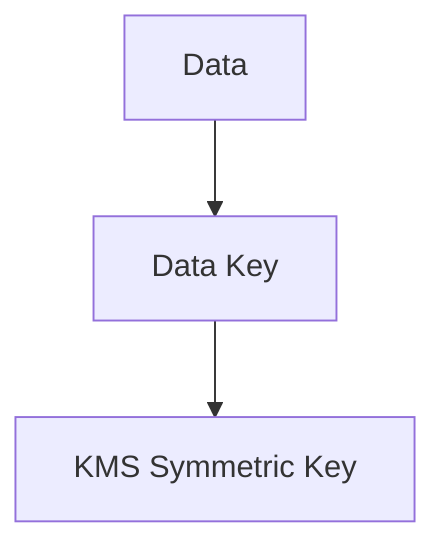
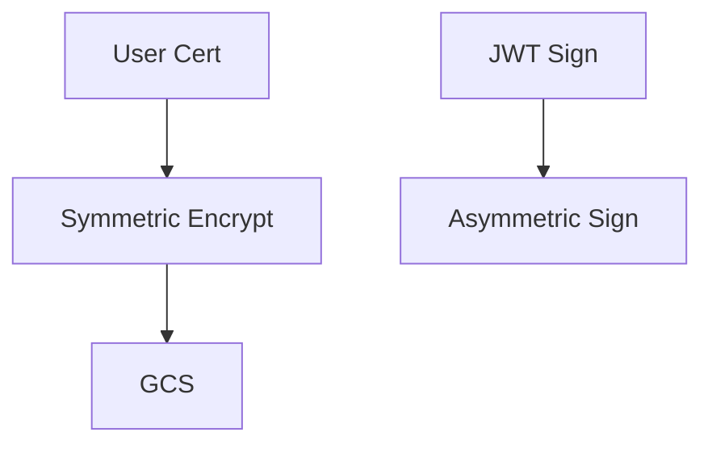
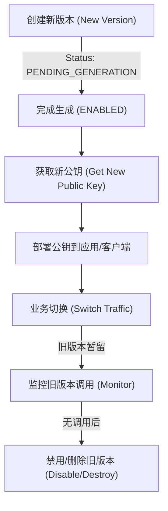

- [HSM](./key-keyring.md)
# **问题分析**

在 KMS（Key Management Service）里谈 **对称加密 vs 非对称加密**，本质不是“哪种更安全”，而是：

> **使用场景 + 性能 + 密钥管理方式的区别**

它们解决的是两类完全不同的问题。

---

# **核心区别总览**

| **维度**       | **对称加密 KMS**     | **非对称加密 KMS**    |
| ------------ | ---------------- | ---------------- |
| 密钥数量         | 1 把 Key          | 2 把 Key（公钥 + 私钥） |
| 加解密速度        | 非常快              | 较慢               |
| 适合数据量        | 大数据              | 小数据 / Key 交换     |
| 密钥分发         | 困难               | 容易（公钥可公开）        |
| 常见算法         | AES-256          | RSA / ECC        |
| 典型用途         | 文件加密 / Secret 加密 | 证书 / 签名 / 身份验证   |
| 成本           | 低                | 高                |
| KMS API 调用频率 | 高                | 低                |

---

# **对称加密（Symmetric KMS）**

## **特征**

- **同一把 Key 负责加密和解密**

- 性能极高

- 适合频繁调用

- 不能公开 Key

## **典型场景**

### **1. 加密配置文件**

```
DB 密码
API Token
Client Secret
```

### **2. 存储加密**

- GCS 文件

- 日志

- Metadata

### **3. Envelope Encryption（最常见）**



---

## **优点**

- 快

- 成本低

- API 调用效率高

- 非常适合自动化系统

## **缺点**

- Key 泄露 = 全部失守

- 不适合多方分发

---

# **非对称加密（Asymmetric KMS）**

## **特征**

- 两把 Key

  - **Public Key → 加密**

  - **Private Key → 解密**

- 私钥永远不离开 KMS

- 性能慢

---

## **典型场景**

### **1. 数字签名**

```
JWT 签名
API 签名
证书签名
```

### **2. mTLS / TLS**

- Client Cert

- Server Cert

### **3. Key Exchange**

---

## **优点**

- 公钥可公开

- 私钥极安全

- 非常适合身份验证

## **缺点**

- 慢

- 成本高

- 不适合大数据

---

# **在 mTLS 场景中的真实分工**

|**场景**|**推荐类型**|
|---|---|
|存用户证书文件|对称|
|存 Fingerprint|不需要|
|Client Cert 签名|非对称|
|JWT / API 签名|非对称|
|Secret / Token|对称|

---

# **实战最佳组合（生产常态）**

真实生产环境 **不是二选一，而是组合：**



---

# **决策一句话原则**

## **用对称加密当“保险箱”**

- 快

- 便宜

- 大量数据

## **用非对称加密当“身份证”**

- 身份

- 签名

- 信任链

---

# **结合你当前平台的建议**

## **必须有**

### **1. 对称 Key（1~2 把即可）**

用途：

- Client Cert 文件加密

- Secret

- Metadata

---

### **2. 非对称 Key（1 把即可）**

用途：

- JWT 签名

- API 签名

- 审计签名

---

# **不推荐的设计**

|**错误做法**|**原因**|
|---|---|
|每环境一堆 Key|运维灾难|
|非对称加密大文件|性能灾难|
|GitHub 存加密文件但无 KMS|无意义|

---

# **最终总结**

**对称加密 = 数据保护工具**

**非对称加密 = 身份与信任工具**

在你的 mTLS / Trust Config / Cert 生命周期体系中：

- **证书存储 → 对称**

- **签名 / 身份 → 非对称**

- **Fingerprint → 不加密**

这样你既不会性能浪费，也不会把 Key 管理复杂化。

---

# **HSM Asymmetric KMS 核心概念与 Rotation 实战**

## **核心概念 (Core Concepts)**

在使用云端 HSM（Hardware Security Module）管理非对称密钥时，通常涉及以下层级结构：

| **概念** | **描述** | **类比** |
| --- | --- | --- |
| **Location** | 密钥存储的物理区域（如 `asia-east1` 或 `global`）。 | 办公大楼的位置 |
| **KeyRing** | 用于组织密钥的逻辑组，不可直接删除。 | 办公室里的钥匙架 |
| **Key Name** | 具体的密钥资源（CryptoKey），定义其用途（如 `ASYMMETRIC_SIGN`）。 | 钥匙架上的某把锁的标签 |
| **Key Version** | 密钥的实际版本，同一个 Key Name 下可以有多个版本。 | 锁具内部的第 N 次换芯 |
| **HSM Level** | 保护级别。`HSM` 表示物理隔离，私钥永远无法被导出。 | 银行级的物理保险柜 |

## **核心痛点：非对称密钥的 Rotation**

### **为什么不能自动旋转？**
对于 **对称密钥**（AES），KMS 可以实现“透明旋转”，即老数据用老版本解，新数据用新版本加，API 调用者无感知。
但对于 **非对称密钥**（RSA/ECC）：
1. **公钥分发性**：公钥可能已经被分发到外部系统，自动旋转会导致兼容性断裂。
2. **逻辑唯一性**：解密/签名必须明确指定 `Version`。

> [!WARNING]
> **Cloud KMS 的 HSM 非对称密钥不支持“自动轮转时间表”。** 必须手动执行。

## **解决方案：手动轮转 (Manual Rotation) 流程**

当需要轮转非对称密钥（如 CSR 证书过期、机密性合规触发）时，推荐采用以下标准流程：



### **操作步骤示例**

1.  **创建新版本**：
    ```bash
    gcloud kms keys versions create --key "my-hsm-key" \
      --keyring "my-keyring" --location "asia-east1"
    ```

2.  **更新应用逻辑**：
    -   获取新版本的 `Resource ID` (形如 `projects/.../cryptoKeyVersions/2`)。
    -   在签名或解密代码中，将引用的 `Version` 更新为最新值。

3.  **灰度与观察**：
    -   保留 `Version 1` 一段时间，用于处理排队中的旧请求。
    -   通过 Cloud Logging 确认 `Version 1` 的 API 调用量归零。

4.  **最终退役**：
    -   禁用旧版本：`versions disable`。
    -   合规期满后：`versions destroy`。

---

# **总结：HSM 密钥管理金律**

1.  **分层管理**：一个 `KeyRing` 可以存放多个 `Key`（如 `jwt-key` 和 `api-key`）。
2.  **显式版本**：非对称加密的代码中，**永远推荐在配置中显式写入 Version ID**，而不是只写 Key Name，以确保结果的一致性。
3.  **灾备演练**：手动 Rotation 必须在 CI/CD 流程中有对应的逻辑，避免证书过期时手忙脚乱。

