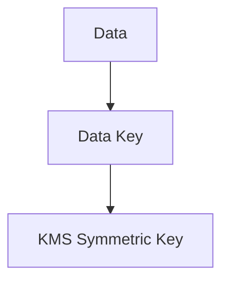
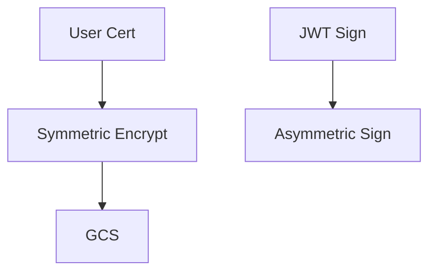

# **问题分析**

在 KMS（Key Management Service）里谈 **对称加密 vs 非对称加密**，本质不是“哪种更安全”，而是：

> **使用场景 + 性能 + 密钥管理方式的区别**

它们解决的是两类完全不同的问题。

---

# **核心区别总览**

|**维度**|**对称加密 KMS**|**非对称加密 KMS**|
|---|---|---|
|密钥数量|1 把 Key|2 把 Key（公钥 + 私钥）|
|加解密速度|非常快|较慢|
|适合数据量|大数据|小数据 / Key 交换|
|密钥分发|困难|容易（公钥可公开）|
|常见算法|AES-256|RSA / ECC|
|典型用途|文件加密 / Secret 加密|证书 / 签名 / 身份验证|
|成本|低|高|
|KMS API 调用频率|高|低|

---

# **对称加密（Symmetric KMS）**

## **特征**

- **同一把 Key 负责加密和解密**

- 性能极高

- 适合频繁调用

- 不能公开 Key

## **典型场景**

### **1. 加密配置文件**

```
DB 密码
API Token
Client Secret
```

### **2. 存储加密**

- GCS 文件

- 日志

- Metadata

### **3. Envelope Encryption（最常见）**



---

## **优点**

- 快

- 成本低

- API 调用效率高

- 非常适合自动化系统

## **缺点**

- Key 泄露 = 全部失守

- 不适合多方分发

---

# **非对称加密（Asymmetric KMS）**

## **特征**

- 两把 Key

  - **Public Key → 加密**

  - **Private Key → 解密**

- 私钥永远不离开 KMS

- 性能慢

---

## **典型场景**

### **1. 数字签名**

```
JWT 签名
API 签名
证书签名
```

### **2. mTLS / TLS**

- Client Cert

- Server Cert

### **3. Key Exchange**

---

## **优点**

- 公钥可公开

- 私钥极安全

- 非常适合身份验证

## **缺点**

- 慢

- 成本高

- 不适合大数据

---

# **在 mTLS 场景中的真实分工**

|**场景**|**推荐类型**|
|---|---|
|存用户证书文件|对称|
|存 Fingerprint|不需要|
|Client Cert 签名|非对称|
|JWT / API 签名|非对称|
|Secret / Token|对称|

---

# **实战最佳组合（生产常态）**

真实生产环境 **不是二选一，而是组合：**



---

# **决策一句话原则**

## **用对称加密当“保险箱”**

- 快

- 便宜

- 大量数据

## **用非对称加密当“身份证”**

- 身份

- 签名

- 信任链

---

# **结合你当前平台的建议**

## **必须有**

### **1. 对称 Key（1~2 把即可）**

用途：

- Client Cert 文件加密

- Secret

- Metadata

---

### **2. 非对称 Key（1 把即可）**

用途：

- JWT 签名

- API 签名

- 审计签名

---

# **不推荐的设计**

|**错误做法**|**原因**|
|---|---|
|每环境一堆 Key|运维灾难|
|非对称加密大文件|性能灾难|
|GitHub 存加密文件但无 KMS|无意义|

---

# **最终总结**

**对称加密 = 数据保护工具**

**非对称加密 = 身份与信任工具**

在你的 mTLS / Trust Config / Cert 生命周期体系中：

- **证书存储 → 对称**

- **签名 / 身份 → 非对称**

- **Fingerprint → 不加密**

这样你既不会性能浪费，也不会把 Key 管理复杂化。
