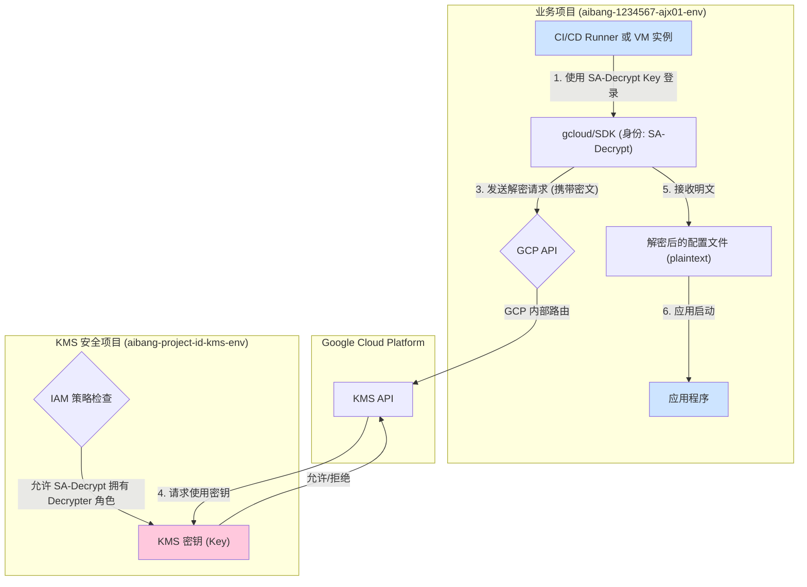

# 架构实践：GCP 中使用独立 KMS 项目进行跨项目加解密

本文档旨在分析和阐述一个安全最佳实践：如何将 Google Cloud KMS 密钥集中在专用的安全项目中，并授权给其他业务项目中的服务账号（Service Account）进行安全的跨项目加密和解密操作。

## 核心思想：职责分离

将 KMS 密钥与应用服务部署在不同的 GCP 项目中，是提升安全性的关键一环。

- **KMS 项目 (例如: `aibang-project-id-kms-env`)**:
    - **职责**: 专门用于创建、管理和存储加密密钥。
    - **安全策略**: 该项目应有极其严格的访问控制，只有少数管理员（Key Admin）有权管理密钥。应用开发者和普通运维人员不应有权访问此项目。

- **业务项目 (例如: `aibang-1234567-ajx01-env`)**:
    - **职责**: 部署应用程序、服务和对应的服务账号。
    - **安全策略**: 服务账号按需被授予访问其他项目中资源（如 KMS 密钥）的权限。

这种模式确保了即使业务项目被攻破，攻击者也无法直接管理或篡改密钥本身，只能在被授予的权限范围内使用密钥。

## 流程解析

下面我们通过一个具体的 IAM 策略和解密脚本来解析这个流程。

### 1. 权限分离：在 KMS 密钥上进行跨项目授权

首先，我们需要在 KMS 项目中的密钥上，为业务项目的服务账号授予角色。

你提供的 IAM 策略片段（经过格式化后）如下：

```yaml

gcloud kms keys get-iam-policy projects/aibang-project-id-kms-env/.../cryptoKeys/env01-uk-core-ajx
# IAM policy for key: projects/aibang-project-id-kms-env/.../cryptoKeys/env01-uk-core-ajx
bindings:
- members:
  - serviceAccount:ajx-env-uk-kbp-sa@aibang-1234567-ajx01-env.iam.gserviceaccount.com
  - serviceAccount:env01-uk-kdp-sa@aibang-1234567-ajx01-env.iam.gserviceaccount.com
  - serviceAccount:env01-uk-rt-sa@aibang-1234567-ajx01-env.iam.gserviceaccount.com
  role: roles/cloudkms.cryptoKeyDecrypter
- members:
  - serviceAccount:env01-uk-encrypt-sa@aibang-1234567-ajx01-env.iam.gserviceaccount.com
  role: roles/cloudkms.cryptoKeyEncrypter
etag: "BwX..."
version: 1
```

这段策略清晰地展示了：
- **解密权限 (`cryptoKeyDecrypter`)**: 授予了三个不同的服务账号，它们都位于 `aibang-1234567-ajx01-env` 项目中。这些账号只能使用密钥进行解密。
- **加密权限 (`cryptoKeyEncrypter`)**: 仅授予了 `env01-uk-encrypt-sa` 服务账号。该账号只能使用密钥进行加密。

这种精细化的权限划分是安全的核心。

### 2. 自动化脚本：在 CI/CD 或应用启动时执行解密

在业务项目的服务器或 CI/CD 环境中，我们需要在应用启动前解密一些敏感的配置文件（如证书、私钥）。

你提供的 `decrypt_cert` 函数展示了如何实现这一点：

```bash
# decrypt certificate and key files
function decrypt_cert() {
  echo "--- decrypt cert file ---"
  # 动态选择密钥和KMS项目
  local project_keyring=$project
  local key=${env}-${region}-core-cap
  [[ ${region} = hk ]] && local key=${env}-${region}-core-ahp
  [[ ${env} != "prd" && ${region} != "prod" ]] && local project_kms=aibang-project-id-kms-env || local project_kms=aibang-project-id-kms-prod

  # 执行解密命令，明确指向KMS项目
  gcloud kms decrypt --project ${project_kms} \
    --ciphertext-file=$1 \
    --plaintext-file=$2 \
    --key=$key \
    --keyring=${project_keyring} \
    --location=global

  # 检查解密是否成功
  if [[ $? == "1" ]]; then
    echo "decrypt cert $1 failed"
    echo "revoke kdp-sa service account and clear temp files"
    logout_gcp_sa
    clean_up_temp_certs
    exit 1
  else
    echo "decrypt cert $1 successfully"
  fi
}
```

**脚本逻辑**:
1.  **身份验证**: 在执行此脚本前，环境必须已经通过 `gcloud auth activate-service-account` 使用了具有解密权限的服务账号（如 `env01-uk-kdp-sa`）的密钥文件进行了身份验证。
2.  **动态配置**: 脚本根据环境变量（如 `$env`, `$region`）智能地确定要使用的 KMS 项目和密钥名称。
3.  **执行解密**: `gcloud kms decrypt` 命令的 `--project` 参数明确指向独立的 KMS 项目 (`aibang-project-id-kms-env` 或 `aibang-project-id-kms-prod`)，从而完成跨项目解密。

## 完整工作流图



## 标准命令示例

### 加密文件（由加密服务执行）

```bash
# 1. 确保你已认证为加密服务账号
gcloud auth activate-service-account env01-uk-encrypt-sa@aibang-1234567-ajx01-env.iam.gserviceaccount.com --key-file=/path/to/encrypt-sa.json

# 2. 执行加密
gcloud kms encrypt \
  --project="aibang-project-id-kms-env" \
  --location="global" \
  --keyring="aibang-1234567-ajx01-env" \
  --key="env01-uk-core-ajx" \
  --plaintext-file="database.conf" \
  --ciphertext-file="database.conf.enc"

echo "文件加密成功!"
```

### 解密文件（由应用启动脚本执行）

```bash
# 1. 确保你已认证为解密服务账号
gcloud auth activate-service-account env01-uk-kdp-sa@aibang-1234567-ajx01-env.iam.gserviceaccount.com --key-file=/path/to/decrypt-sa.json

# 2. 执行解密
gcloud kms decrypt \
  --project="aibang-project-id-kms-env" \
  --location="global" \
  --keyring="aibang-1234567-ajx01-env" \
  --key="env01-uk-core-ajx" \
  --ciphertext-file="database.conf.enc" \
  --plaintext-file="database.conf"

echo "文件解密成功, 应用可以启动."
```

## 总结与最佳实践
1.  **集中管理密钥**  ：始终将密钥存储在专用的、高度安全管制的 GCP 项目中。
2.  **最小权限原则**  ：为服务账号授予精准的 `cryptoKeyEncrypter` 或 `cryptoKeyDecrypter` 角色，而不是宽泛的 `cryptoKeyEncrypterDecrypter` 角色。
3.  **自动化与动态配置**  ：在 CI/CD 和部署脚本中使用动态配置，使其能够适应不同环境，减少硬编码。
4.  **审计与监控**  ：在 KMS 项目中启用审计日志，监控所有密钥的使用情况，以便及时发现异常访问。
