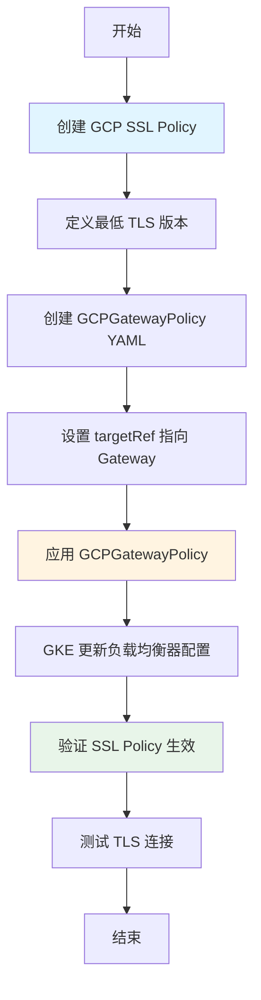
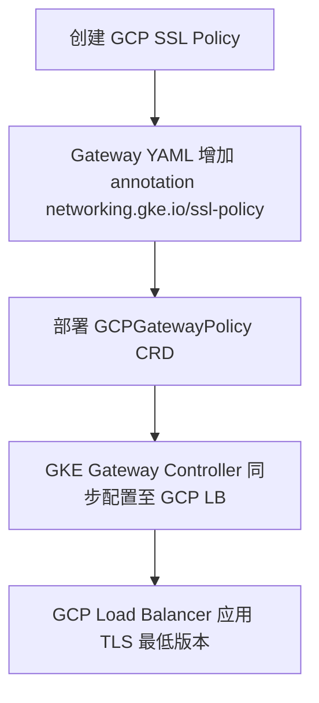
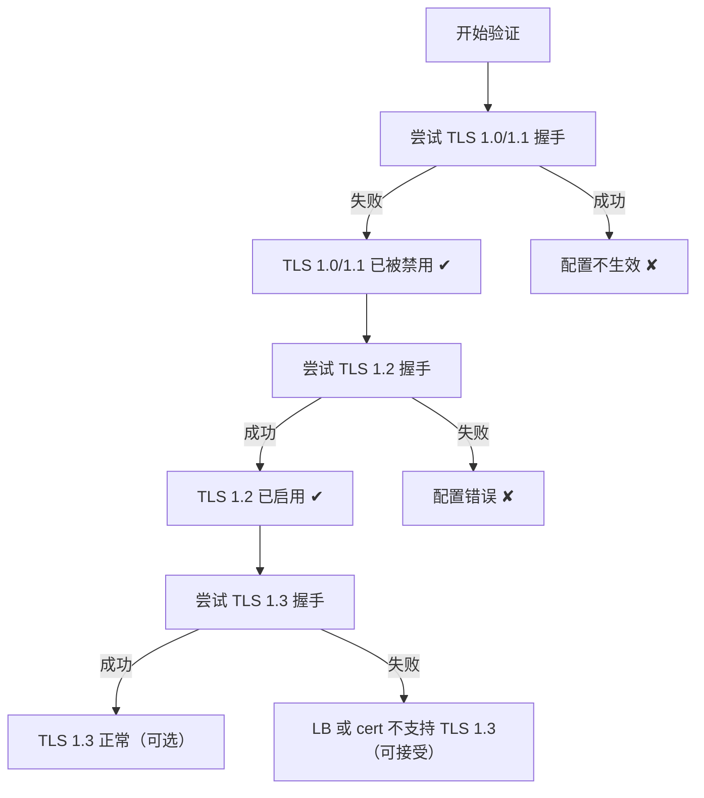
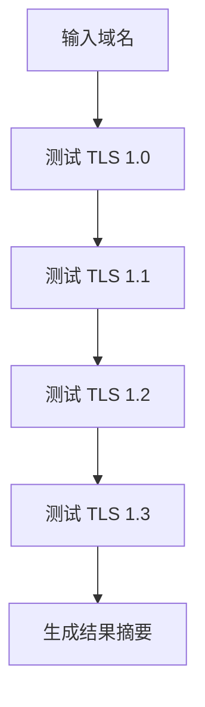

# GKE Gateway SSL Policy 配置指南

## 问题分析

您需要在 GKE Gateway 上配置 SSL Policy 以满足 TLS 最低版本要求（如 TLS 1.2），避免安全违规。这涉及两个关键步骤：

1. 在 GCP 中创建 SSL Policy
2. 通过 GCPGatewayPolicy 资源将其关联到 Gateway

## 解决方案

### 步骤 1：创建 GCP SSL Policy

首先在 GCP 中创建符合要求的 SSL Policy：

```bash
# 创建 SSL Policy（最低 TLS 1.2）
gcloud compute ssl-policies create kong-gateway-ssl-policy \
    --profile MODERN \
    --min-tls-version 1.2 \
    --project YOUR_PROJECT_ID

# 验证创建结果
gcloud compute ssl-policies describe kong-gateway-ssl-policy \
    --project YOUR_PROJECT_ID
```

**Profile 选项说明：**

- `MODERN`: TLS 1.2+，推荐用于生产环境
- `RESTRICTED`: TLS 1.2+，更严格的加密套件
- `COMPATIBLE`: TLS 1.0+，兼容性最好但安全性较低

### 步骤 2：创建 GCPGatewayPolicy 资源

创建 `gcp-gateway-policy.yaml` 文件：

```yaml
apiVersion: networking.gke.io/v1
kind: GCPGatewayPolicy
metadata:
  name: kong-gateway-policy
  namespace: kong  # 替换为您的 namespace
spec:
  default:
    sslPolicy: kong-gateway-ssl-policy  # 引用上面创建的 SSL Policy 名称
  targetRef:
    group: gateway.networking.k8s.io
    kind: Gateway
    name: kong-gateway-proxy  # 您的 Gateway 资源名称
```

### 步骤 3：应用配置

```bash
# 应用 GCPGatewayPolicy
kubectl apply -f gcp-gateway-policy.yaml

# 验证资源创建
kubectl get gcpgatewaypolicy -n kong
kubectl describe gcpgatewaypolicy kong-gateway-policy -n kong

# 检查 Gateway 状态
kubectl get gateway -n kong
kubectl describe gateway kong-gateway-proxy -n kong
```

### 步骤 4：验证 SSL Policy 生效

```bash
# 查看 Gateway 关联的负载均衡器
kubectl get gateway kong-gateway-proxy -n kong -o yaml | grep "loadBalancer"

# 在 GCP Console 验证
# 导航至: Network Services > Load balancing > 找到对应的负载均衡器
# 查看 Frontend configuration > SSL policy
```

## 配置流程图



## Helm Values 集成（可选）

如果使用 Helm 部署，可以在 `values.yaml` 中配置：

```yaml
gateway:
  ssl_policy: kong-gateway-ssl-policy
  annotations:
    networking.gke.io/ssl-policy: kong-gateway-ssl-policy
```

对应的 Helm 模板：

```yaml
{{- if .Values.gateway.ssl_policy }}
apiVersion: networking.gke.io/v1
kind: GCPGatewayPolicy
metadata:
  name: {{ template "kong.fullname" . }}-gateway-policy
  namespace: {{ template "kong.namespace" . }}
spec:
  default:
    sslPolicy: {{ .Values.gateway.ssl_policy }}
  targetRef:
    group: gateway.networking.k8s.io
    kind: Gateway
    name: {{ template "kong.fullname" . }}-gateway-proxy
{{- end }}
```

## 注意事项

### ⚠️ 重要提醒

1. **SSL Policy 必须预先存在**

    - GCPGatewayPolicy 引用的 SSL Policy 必须在 GCP 中已创建
    - 否则 Gateway 配置会失败

2. **最低 TLS 版本影响**

    - TLS 1.2: 排除旧版客户端（IE 10 及以下）
    - TLS 1.3: 仅支持最新客户端，但性能更好

3. **变更生效时间**

    - SSL Policy 更新可能需要 5-10 分钟生效
    - 期间可能出现短暂连接异常

4. **多 Gateway 场景**

    - 每个 Gateway 需要独立的 GCPGatewayPolicy
    - 可以共享同一个 GCP SSL Policy

5. **权限要求**

    ```bash
    # 确保 GKE 服务账号具有以下权限
    # - compute.sslPolicies.use
    # - compute.targetHttpsProxies.setUrlMap
    ```

## 测试验证

### 验证 TLS 版本

```bash
# 使用 openssl 测试 TLS 1.1（应该失败）
openssl s_client -connect YOUR_GATEWAY_IP:443 -tls1_1

# 使用 openssl 测试 TLS 1.2（应该成功）
openssl s_client -connect YOUR_GATEWAY_IP:443 -tls1_2

# 使用 curl 测试
curl -v --tlsv1.2 --tls-max 1.2 https://YOUR_GATEWAY_DOMAIN
```

### 检查加密套件

```bash
# 查看实际使用的加密套件
nmap --script ssl-enum-ciphers -p 443 YOUR_GATEWAY_IP
```

## 故障排除

| 问题                      | 可能原因          | 解决方案                     |
| ------------------------- | ----------------- | ---------------------------- |
| GCPGatewayPolicy 创建失败 | SSL Policy 不存在 | 先创建 GCP SSL Policy        |
| Gateway 状态为 Pending    | 配置未生效        | 等待 5-10 分钟或检查事件日志 |
| TLS 1.1 仍然可用          | SSL Policy 未关联 | 检查 targetRef 配置是否正确  |
| 负载均衡器未更新          | 权限不足          | 检查 GKE 服务账号权限        |

```bash
# 查看详细事件日志
kubectl describe gcpgatewaypolicy kong-gateway-policy -n kong
kubectl get events -n kong --sort-by='.lastTimestamp'
```

## 最佳实践

1. **使用 MODERN Profile**：平衡安全性和兼容性
2. **定期审查 SSL Policy**：随着安全标准更新及时调整
3. **监控 TLS 握手失败**：识别不兼容的客户端
4. **文档化版本要求**：明确告知客户端最低 TLS 版本

---

**总结**：您需要先在 GCP 创建 SSL Policy，然后通过 GCPGatewayPolicy 资源将其关联到 Gateway，整个过程涉及 GCP 和 K8S 两层配置。

# ChatGPT

# GKE Gateway 使用 GCP SSL Policy（强制 TLS 1.2）完整总结

## 1. 问题分析

你当前的目标是让 **GKE Gateway（GKE Gateway API 模式）使用指定的 GCP SSL Policy**，从而强制 TLS 版本（如 TLS 1.2），并确保不会触发 “SSL policy violation” 的告警。

为此需要满足两个条件：

1. **创建 GCP SSL Policy**（在 GCP 层定义 TLS 最低版本）。
2. **在 GKE Gateway 上引用该 Policy**，引用方式是透过
    - `GCPGatewayPolicy` 资源
    - Gateway 的 annotation：`networking.gke.io/ssl-policy`

## 2. 解决方案步骤

### 步骤 1：在 GCP 创建一个 SSL Policy

最低版本设为 TLS 1.2。

```bash
gcloud compute ssl-policies create my-tls12-policy \
    --min-tls-version=TLS_1_2 \
    --profile=MODERN
```

### **步骤 2：修改 Gateway YAML，加入 SSL Policy annotation**

在 Gateway 的 metadata 下加入：

```
metadata:
  annotations:
    networking.gke.io/ssl-policy: "my-tls12-policy"
```

### **步骤 3：创建 GCPGatewayPolicy Resource（由 GKE Gateway 控制器使用）**

此 CRD 会告诉 GKE Gateway Controller：

“请将这个 SSL Policy 应用到指定 Gateway 上。”

以下为可直接部署的模板结构：

```
apiVersion: networking.gke.io/v1
kind: GCPGatewayPolicy
metadata:
  name: kong-gateway-policy
  namespace: kong
spec:
  default:
    sslPolicy: "my-tls12-policy"
  targetRef:
    group: gateway.networking.k8s.io
    kind: Gateway
    name: kong-gateway-proxy
```

> **说明**

- > default.sslPolicy 即对应 GCP 里的 SSL Policy 名称
- > targetRef 应指向你的 Gateway 对象（group + kind + name）

### **步骤 4：确认 Gateway 已关联 SSL Policy**

```
kubectl get gateway -n kong kong-gateway-proxy -o yaml
```

检查 annotation 是否正确：

```
annotations:
  networking.gke.io/ssl-policy: "my-tls12-policy"
```

再确认 GCP 层 backend service 是否已更新（经由 GKE 控制器自动完成）：

```
gcloud compute backend-services list | grep gateway
```

## **3. 代码示例**

### **Gateway YAML（示例片段）**

```yaml
apiVersion: gateway.networking.k8s.io/v1
kind: Gateway
metadata:
  name: kong-gateway-proxy
  namespace: kong
  annotations:
    networking.gke.io/ssl-policy: "my-tls12-policy"
spec:
  gatewayClassName: gke-l7-global-external-managed
  listeners:
    - name: https
      port: 443
      protocol: HTTPS
      tls:
        mode: Terminate
        certificateRefs:
          - name: your-cert
```

### **GCPGatewayPolicy YAML**

```yaml
apiVersion: networking.gke.io/v1
kind: GCPGatewayPolicy
metadata:
  name: kong-gateway-policy
  namespace: kong
spec:
  default:
    sslPolicy: "my-tls12-policy"
  targetRef:
    group: gateway.networking.k8s.io
    kind: Gateway
    name: kong-gateway-proxy
```

## **4. 流程图（GCP SSL Policy 绑定 Gateway 流程）**



## **5. 注意事项**

| **项目**         | **说明**                                                           |
| ---------------- | ------------------------------------------------------------------ |
| SSL Policy 名称  | 必须与 GCP 中创建的名称一致                                        |
| Policy 生效时间  | 控制器同步到 Load Balancer 通常需要 1–3 分钟                       |
| CRD 版本         | GCPGatewayPolicy 的 API 版本会随 GKE 版本更新，请确保使用正确的 v1 |
| 多 Listener 场景 | Policy 是应用在 LB 层，不依赖单独 Listener                         |
| 权限             | 需要具备 compute.securityPolicies.\* 相关权限                      |

---

如果你需要，我也可以帮你生成 **完整可部署的 Helm 模板** 或 **验证 SSL Policy 是否正确生效的测试步骤（curl / openssl 分析）**。

# Verify

\*\*验证 SSL Policy 是否正确生效的测试步骤（curl / openssl 分析

# 验证 GCP SSL Policy（TLS 1.2）是否正确生效

以下步骤可直接用于验证你的 GKE Gateway 所挂载的 GCP Load Balancer 是否已强制启用最低 TLS 1.2。

---

## 1. 问题分析

你希望确认 GCP Load Balancer 是否按照 SSL Policy 要求拒绝低版本 TLS（例如 1.0/1.1），并正确接受 TLS 1.2/1.3。  
最有效的方式是使用 **curl** 与 **openssl s_client** 进行不同版本的 TLS 握手测试。

---

## 2. 解决方案步骤

### 步骤 1：测试是否拒绝 TLS 1.0/1.1（期望：失败）

```bash
curl -Iv --tlsv1.0 https://<your-domain>
curl -Iv --tlsv1.1 https://<your-domain>
```

**期望输出：**

- 握手失败（SSL_ERROR_SYSCALL、protocol version、handshake failure）
- 无法建立 HTTPS 连接

---

### **步骤 2：测试是否接受 TLS 1.2（期望：成功）**

```
curl -Iv --tlsv1.2 https://<your-domain>
```

**期望输出：**

- SSL connection using TLS1.2
- 200 OK 或 302/301（取决于服务逻辑）

---

### **步骤 3：测试是否接受 TLS 1.3（如果证书与 LB 支持 → 期望：成功）**

```
curl -Iv --tlsv1.3 https://<your-domain>
```

**期望输出：**

- SSL connection using TLS1.3

若 SSL Policy 最低版本是 1.2，则 TLS 1.3 仍会被接受。

---

### **步骤 4：使用 openssl 直接测试握手（更详细的协商信息）**

#### **测试 TLS 1.0（期望失败）**

```
openssl s_client -connect <your-domain>:443 -tls1
```

#### **测试 TLS 1.1（期望失败）**

```
openssl s_client -connect <your-domain>:443 -tls1_1
```

#### **测试 TLS 1.2（期望成功）**

```
openssl s_client -connect <your-domain>:443 -tls1_2
```

成功时你会看到：

```
SSL-Session:
    Protocol  : TLSv1.2
```

#### **测试 TLS 1.3（期望成功）**

```
openssl s_client -connect <your-domain>:443 -tls1_3
```

成功时你会看到：

```
Protocol  : TLSv1.3
```

---

## **3. 结果判断流程图**



---

## **4. 注意事项**

| **项目**                              | **说明**                                            |
| ------------------------------------- | --------------------------------------------------- |
| 必须使用外网域名测试                  | 因为验证的是 GCP External HTTPS LB                  |
| curl/openssl 版本                     | 过老版本可能不支持 --tlsv1.3                        |
| 配置生效时间                          | LB 配置同步通常需要 1–3 分钟                        |
| 若你使用自定义 cert & TLS termination | GCP LB 的 SSL Policy 会作用在 LB 层，而不是后端服务 |

---

如果你愿意，我也可以帮你写一个 **自动化 bash 脚本**，一次性测试 TLS 1.0/1.1/1.2/1.3 并输出结果表格。需要吗？

````
# 验证 GCP SSL Policy（TLS 1.2）是否正确生效
以下步骤可直接用于验证你的 GKE Gateway 所挂载的 GCP Load Balancer 是否已强制启用最低 TLS 1.2。

---

## 1. 问题分析
你希望确认 GCP Load Balancer 是否按照 SSL Policy 要求拒绝低版本 TLS（例如 1.0/1.1），并正确接受 TLS 1.2/1.3。
最有效的方式是使用 **curl** 与 **openssl s_client** 进行不同版本的 TLS 握手测试。

---

## 2. 解决方案步骤

### 步骤 1：测试是否拒绝 TLS 1.0/1.1（期望：失败）
```bash
curl -Iv --tlsv1.0 https://<your-domain>
curl -Iv --tlsv1.1 https://<your-domain>
````

**期望输出：**

- 握手失败（SSL_ERROR_SYSCALL、protocol version、handshake failure）
- 无法建立 HTTPS 连接

---

### **步骤 2：测试是否接受 TLS 1.2（期望：成功）**

```
curl -Iv --tlsv1.2 https://<your-domain>
```

**期望输出：**

- SSL connection using TLS1.2
- 200 OK 或 302/301（取决于服务逻辑）

---

### **步骤 3：测试是否接受 TLS 1.3（如果证书与 LB 支持 → 期望：成功）**

```
curl -Iv --tlsv1.3 https://<your-domain>
```

**期望输出：**

- SSL connection using TLS1.3

若 SSL Policy 最低版本是 1.2，则 TLS 1.3 仍会被接受。

---

### **步骤 4：使用 openssl 直接测试握手（更详细的协商信息）**

#### **测试 TLS 1.0（期望失败）**

```
openssl s_client -connect <your-domain>:443 -tls1
```

#### **测试 TLS 1.1（期望失败）**

```
openssl s_client -connect <your-domain>:443 -tls1_1
```

#### **测试 TLS 1.2（期望成功）**

```
openssl s_client -connect <your-domain>:443 -tls1_2
```

成功时你会看到：

```
SSL-Session:
    Protocol  : TLSv1.2
```

#### **测试 TLS 1.3（期望成功）**

```
openssl s_client -connect <your-domain>:443 -tls1_3
```

成功时你会看到：

```
Protocol  : TLSv1.3
```

---

## **3. 结果判断流程图**

```
graph TD
    A["开始验证"] --> B["尝试 TLS 1.0/1.1 握手"]
    B -->|失败| C["TLS 1.0/1.1 已被禁用 ✔"]
    B -->|成功| D["配置不生效 ✘"]

    C --> E["尝试 TLS 1.2 握手"]
    E -->|成功| F["TLS 1.2 已启用 ✔"]
    E -->|失败| G["配置错误 ✘"]

    F --> H["尝试 TLS 1.3 握手"]
    H -->|成功| I["TLS 1.3 正常（可选）"]
    H -->|失败| J["LB 或 cert 不支持 TLS 1.3（可接受）"]
```

---

## **4. 注意事项**

| **项目**                              | **说明**                                            |
| ------------------------------------- | --------------------------------------------------- |
| 必须使用外网域名测试                  | 因为验证的是 GCP External HTTPS LB                  |
| curl/openssl 版本                     | 过老版本可能不支持 --tlsv1.3                        |
| 配置生效时间                          | LB 配置同步通常需要 1–3 分钟                        |
| 若你使用自定义 cert & TLS termination | GCP LB 的 SSL Policy 会作用在 LB 层，而不是后端服务 |

---

如果你愿意，我也可以帮你写一个 **自动化 bash 脚本**，一次性测试 TLS 1.0/1.1/1.2/1.3 并输出结果表格。需要吗？

# 自动化 TLS 版本验证脚本（curl + openssl）

以下脚本会自动对 **TLS 1.0 / 1.1 / 1.2 / 1.3** 进行握手测试，并输出一份清晰的结果表格，适合验证 GCP SSL Policy 是否正确生效。

> **使用方式：**  
> 保存为 `check-tls.sh`，并执行：
>
> ```bash
> bash check-tls.sh https://your-domain.com
> ```

---

## 1. 脚本内容（可直接复制）

```bash
#!/usr/bin/env bash

DOMAIN="$1"

if [ -z "$DOMAIN" ]; then
  echo "Usage: $0 https://your-domain.com"
  exit 1
fi

echo "----------------------------------------"
echo " Checking TLS versions for: $DOMAIN"
echo "----------------------------------------"
echo ""

test_tls() {
  local version=$1
  local curl_opt=$2
  local openssl_opt=$3

  echo "## Testing TLS $version"
  echo "### curl:"
  curl -Isv $curl_opt "$DOMAIN" >/dev/null 2>&1
  if [ $? -eq 0 ]; then
    echo "curl: SUCCESS"
  else
    echo "curl: FAIL"
  fi

  echo "### openssl:"
  echo | openssl s_client -connect "${DOMAIN#https://}:443" $openssl_opt >/dev/null 2>&1
  if [ $? -eq 0 ]; then
    echo "openssl: SUCCESS"
  else
    echo "openssl: FAIL"
  fi

  echo ""
}

test_tls "1.0" "--tlsv1.0" "-tls1"
test_tls "1.1" "--tlsv1.1" "-tls1_1"
test_tls "1.2" "--tlsv1.2" "-tls1_2"
test_tls "1.3" "--tlsv1.3" "-tls1_3"

echo "----------------------------------------"
echo " Summary"
echo "----------------------------------------"
echo "

Expected:
- TLS 1.0 → FAIL
- TLS 1.1 → FAIL
- TLS 1.2 → SUCCESS
- TLS 1.3 → SUCCESS (optional)

"
```

---

## **2. 脚本执行示例输出**

```
----------------------------------------
 Checking TLS versions for: https://api.example.com
----------------------------------------

## Testing TLS 1.0
curl: FAIL
openssl: FAIL

## Testing TLS 1.1
curl: FAIL
openssl: FAIL

## Testing TLS 1.2
curl: SUCCESS
openssl: SUCCESS

## Testing TLS 1.3
curl: SUCCESS
openssl: SUCCESS

----------------------------------------
 Summary
----------------------------------------

Expected:
- TLS 1.0 → FAIL
- TLS 1.1 → FAIL
- TLS 1.2 → SUCCESS
- TLS 1.3 → SUCCESS (optional)
```

---

## **3. 流程图（脚本内部逻辑）**



---

## **4. 注意事项**

| **项目**                            | **说明**                               |
| ----------------------------------- | -------------------------------------- |
| DOMAIN 参数必须包含协议（https://） | curl 测试时可直接使用                  |
| openssl 使用 443 端口               | 如果你用其他端口请告知我，我可调整脚本 |
| 部分老系统不支持 --tlsv1.3          | 可自行注释该段                         |
| 必须测试外网真实流量                | 因为这是验证 GCP LB 层级               |

---

如果你愿意，我也可以帮你扩展脚本：

- 输出 Markdown 表格报告
- 输出 JSON 报告并上传到 GCS
- 自动检测 LB 的 SSL Policy
- 将测试集成到 CI/CD
