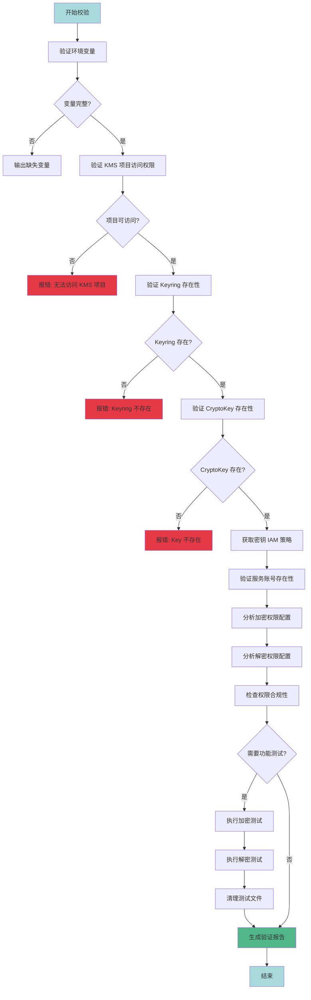
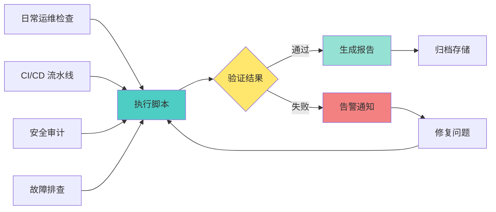

# GCP KMS 跨项目权限校验脚本 - 设计方案

## 问题分析

您需要一个自动化脚本来验证 KMS 跨项目加解密架构的完整性和权限配置正确性。这是一个典型的基础设施验证场景，可以集成到 CI/CD 流程或日常运维检查中。

## 核心校验维度

### 1. **资源存在性验证**

- KMS 项目是否存在且可访问
- Keyring 是否存在于指定位置
- CryptoKey 是否存在于 Keyring 中
- 业务项目中的服务账号是否存在

### 2. **权限配置验证**

- 服务账号是否被授予了正确的 KMS 角色
    - `roles/cloudkms.cryptoKeyEncrypter` (加密权限)
    - `roles/cloudkms.cryptoKeyDecrypter` (解密权限)
- 当前执行环境的身份是否有权限查询 IAM 策略
- 是否存在过度授权（如同时拥有加密和解密权限）

### 3. **功能性验证**

- 实际执行加密操作测试
- 实际执行解密操作测试
- 测试文件的生命周期管理

### 4. **合规性检查**

- 是否符合最小权限原则
- 是否存在未授权的服务账号
- 密钥轮换策略是否配置
- 审计日志是否启用

## 扩展思路

### 架构验证流程图



## 脚本设计结构

### 模块划分

```bash
# 1. 配置模块
- 环境变量定义
- 颜色输出配置
- 全局变量初始化

# 2. 工具函数模块
- 日志输出函数
- 错误处理函数
- JSON 解析辅助函数

# 3. 验证模块
- 资源存在性检查
- IAM 权限分析
- 功能性测试
- 合规性检查

# 4. 报告模块
- 生成验证报告
- 输出统计信息
- 建议输出
```

### 输入参数设计

|参数|说明|示例|必需|
|---|---|---|---|
|`--kms-project`|KMS 项目 ID|`aibang-project-id-kms-env`|是|
|`--business-project`|业务项目 ID|`aibang-1234567-ajx01-env`|是|
|`--keyring`|Keyring 名称|`aibang-1234567-ajx01-env`|是|
|`--key`|CryptoKey 名称|`env01-uk-core-ajx`|是|
|`--location`|密钥位置|`global`|是|
|`--service-accounts`|服务账号列表 (逗号分隔)|`sa1@project.iam,sa2@project.iam`|是|
|`--test-encrypt`|执行加密测试|-|否|
|`--test-decrypt`|执行解密测试|-|否|
|`--output-format`|输出格式|`text/json/markdown`|否|

### 输出报告示例

```markdown
# KMS 权限校验报告
**生成时间**: 2025-11-09 15:30:45
**KMS 项目**: aibang-project-id-kms-env
**业务项目**: aibang-1234567-ajx01-env

## 资源验证
✅ KMS 项目可访问
✅ Keyring 存在: aibang-1234567-ajx01-env
✅ CryptoKey 存在: env01-uk-core-ajx

## 权限分析
### 加密权限 (cryptoKeyEncrypter)
✅ env01-uk-encrypt-sa@aibang-1234567-ajx01-env.iam.gserviceaccount.com

### 解密权限 (cryptoKeyDecrypter)
✅ ajx-env-uk-kbp-sa@aibang-1234567-ajx01-env.iam.gserviceaccount.com
✅ env01-uk-kdp-sa@aibang-1234567-ajx01-env.iam.gserviceaccount.com
✅ env01-uk-rt-sa@aibang-1234567-ajx01-env.iam.gserviceaccount.com

## 合规性检查
✅ 符合最小权限原则
✅ 无过度授权
⚠️  建议: 启用密钥轮换策略

## 功能测试
✅ 加密测试通过
✅ 解密测试通过

## 总结
状态: 通过
总检查项: 12
通过: 11
警告: 1
失败: 0
```

## 完整 Shell 脚本实现## 使用指南
```bash
#!/bin/bash

################################################################################
# GCP KMS 跨项目权限校验脚本
# 用途: 验证 KMS 跨项目加解密架构的完整性和权限配置
# 作者: AI Assistant
# 版本: 1.0.0
################################################################################

set -euo pipefail

# ============================================================================
# 颜色配置
# ============================================================================
RED='\033[0;31m'
GREEN='\033[0;32m'
YELLOW='\033[1;33m'
BLUE='\033[0;34m'
NC='\033[0m' # No Color

# ============================================================================
# 全局变量
# ============================================================================
SCRIPT_NAME=$(basename "$0")
REPORT_FILE="kms-validation-report-$(date +%Y%m%d-%H%M%S).md"
TOTAL_CHECKS=0
PASSED_CHECKS=0
FAILED_CHECKS=0
WARNING_CHECKS=0
TEST_FILE_PREFIX="kms-test-$(date +%s)"

# ============================================================================
# 工具函数
# ============================================================================

# 打印信息
log_info() {
    echo -e "${BLUE}[INFO]${NC} $1"
}

# 打印成功
log_success() {
    echo -e "${GREEN}[✓]${NC} $1"
    ((PASSED_CHECKS++))
}

# 打印警告
log_warning() {
    echo -e "${YELLOW}[⚠]${NC} $1"
    ((WARNING_CHECKS++))
}

# 打印错误
log_error() {
    echo -e "${RED}[✗]${NC} $1"
    ((FAILED_CHECKS++))
}

# 打印分隔线
print_separator() {
    echo "========================================================================"
}

# 使用说明
usage() {
    cat << EOF
使用方法: $SCRIPT_NAME [选项]

必需参数:
  --kms-project PROJECT_ID          KMS 项目 ID
  --business-project PROJECT_ID     业务项目 ID
  --keyring NAME                    Keyring 名称
  --key NAME                        CryptoKey 名称
  --location LOCATION               密钥位置 (如: global, us-central1)
  --service-accounts ACCOUNTS       服务账号列表 (逗号分隔)

可选参数:
  --test-encrypt                    执行加密功能测试
  --test-decrypt                    执行解密功能测试
  --output-format FORMAT            输出格式: text|json|markdown (默认: text)
  --help                            显示此帮助信息

示例:
  $SCRIPT_NAME \\
    --kms-project aibang-project-id-kms-env \\
    --business-project aibang-1234567-ajx01-env \\
    --keyring aibang-1234567-ajx01-env \\
    --key env01-uk-core-ajx \\
    --location global \\
    --service-accounts "sa1@project.iam.gserviceaccount.com,sa2@project.iam.gserviceaccount.com" \\
    --test-encrypt --test-decrypt

EOF
    exit 1
}

# ============================================================================
# 参数解析
# ============================================================================
parse_arguments() {
    while [[ $# -gt 0 ]]; do
        case $1 in
            --kms-project)
                KMS_PROJECT="$2"
                shift 2
                ;;
            --business-project)
                BUSINESS_PROJECT="$2"
                shift 2
                ;;
            --keyring)
                KEYRING="$2"
                shift 2
                ;;
            --key)
                CRYPTO_KEY="$2"
                shift 2
                ;;
            --location)
                LOCATION="$2"
                shift 2
                ;;
            --service-accounts)
                SERVICE_ACCOUNTS="$2"
                shift 2
                ;;
            --test-encrypt)
                TEST_ENCRYPT=true
                shift
                ;;
            --test-decrypt)
                TEST_DECRYPT=true
                shift
                ;;
            --output-format)
                OUTPUT_FORMAT="$2"
                shift 2
                ;;
            --help)
                usage
                ;;
            *)
                echo "未知参数: $1"
                usage
                ;;
        esac
    done

    # 验证必需参数
    if [[ -z "${KMS_PROJECT:-}" ]] || [[ -z "${BUSINESS_PROJECT:-}" ]] || \
       [[ -z "${KEYRING:-}" ]] || [[ -z "${CRYPTO_KEY:-}" ]] || \
       [[ -z "${LOCATION:-}" ]] || [[ -z "${SERVICE_ACCOUNTS:-}" ]]; then
        echo -e "${RED}错误: 缺少必需参数${NC}"
        usage
    fi

    # 设置默认值
    TEST_ENCRYPT=${TEST_ENCRYPT:-false}
    TEST_DECRYPT=${TEST_DECRYPT:-false}
    OUTPUT_FORMAT=${OUTPUT_FORMAT:-text}
}

# ============================================================================
# 验证模块
# ============================================================================

# 1. 验证 gcloud 命令可用性
check_prerequisites() {
    print_separator
    log_info "检查前置条件..."
    ((TOTAL_CHECKS++))
    
    if ! command -v gcloud &> /dev/null; then
        log_error "gcloud 命令未找到，请安装 Google Cloud SDK"
        exit 1
    fi
    log_success "gcloud 命令可用"
}

# 2. 验证 KMS 项目访问权限
check_kms_project() {
    print_separator
    log_info "验证 KMS 项目: $KMS_PROJECT"
    ((TOTAL_CHECKS++))
    
    if gcloud projects describe "$KMS_PROJECT" &> /dev/null; then
        log_success "KMS 项目可访问"
    else
        log_error "无法访问 KMS 项目: $KMS_PROJECT"
        exit 1
    fi
}

# 3. 验证业务项目访问权限
check_business_project() {
    print_separator
    log_info "验证业务项目: $BUSINESS_PROJECT"
    ((TOTAL_CHECKS++))
    
    if gcloud projects describe "$BUSINESS_PROJECT" &> /dev/null; then
        log_success "业务项目可访问"
    else
        log_error "无法访问业务项目: $BUSINESS_PROJECT"
        exit 1
    fi
}

# 4. 验证 Keyring 存在性
check_keyring() {
    print_separator
    log_info "验证 Keyring: $KEYRING (位置: $LOCATION)"
    ((TOTAL_CHECKS++))
    
    if gcloud kms keyrings describe "$KEYRING" \
        --project="$KMS_PROJECT" \
        --location="$LOCATION" &> /dev/null; then
        log_success "Keyring 存在"
    else
        log_error "Keyring 不存在: $KEYRING"
        exit 1
    fi
}

# 5. 验证 CryptoKey 存在性
check_crypto_key() {
    print_separator
    log_info "验证 CryptoKey: $CRYPTO_KEY"
    ((TOTAL_CHECKS++))
    
    if gcloud kms keys describe "$CRYPTO_KEY" \
        --project="$KMS_PROJECT" \
        --keyring="$KEYRING" \
        --location="$LOCATION" &> /dev/null; then
        log_success "CryptoKey 存在"
    else
        log_error "CryptoKey 不存在: $CRYPTO_KEY"
        exit 1
    fi
}

# 6. 获取并分析 IAM 策略
check_iam_policy() {
    print_separator
    log_info "获取密钥 IAM 策略..."
    
    local iam_policy
    iam_policy=$(gcloud kms keys get-iam-policy "$CRYPTO_KEY" \
        --project="$KMS_PROJECT" \
        --keyring="$KEYRING" \
        --location="$LOCATION" \
        --format=json 2>/dev/null)
    
    if [[ -z "$iam_policy" ]]; then
        log_error "无法获取 IAM 策略"
        return 1
    fi
    
    echo "$iam_policy" > /tmp/kms-iam-policy.json
    log_success "IAM 策略获取成功"
}

# 7. 验证服务账号权限
check_service_account_permissions() {
    print_separator
    log_info "验证服务账号权限..."
    
    IFS=',' read -ra SA_ARRAY <<< "$SERVICE_ACCOUNTS"
    
    local encrypters=()
    local decrypters=()
    local both=()
    
    # 解析 IAM 策略
    while IFS= read -r line; do
        if echo "$line" | grep -q "cryptoKeyEncrypter"; then
            # 读取下一行的 members
            read -r members_line
            encrypters+=($(echo "$members_line" | grep -o 'serviceAccount:[^"]*' | sed 's/serviceAccount://g'))
        elif echo "$line" | grep -q "cryptoKeyDecrypter"; then
            read -r members_line
            decrypters+=($(echo "$members_line" | grep -o 'serviceAccount:[^"]*' | sed 's/serviceAccount://g'))
        fi
    done < <(gcloud kms keys get-iam-policy "$CRYPTO_KEY" \
        --project="$KMS_PROJECT" \
        --keyring="$KEYRING" \
        --location="$LOCATION" \
        --format=yaml)
    
    # 检查每个服务账号
    for sa in "${SA_ARRAY[@]}"; do
        sa=$(echo "$sa" | xargs) # 去除空格
        ((TOTAL_CHECKS++))
        
        local has_encrypt=false
        local has_decrypt=false
        
        for enc in "${encrypters[@]}"; do
            if [[ "$enc" == "$sa" ]]; then
                has_encrypt=true
            fi
        done
        
        for dec in "${decrypters[@]}"; do
            if [[ "$dec" == "$sa" ]]; then
                has_decrypt=true
            fi
        done
        
        if [[ "$has_encrypt" == true && "$has_decrypt" == true ]]; then
            log_warning "$sa 同时拥有加密和解密权限 (不符合最小权限原则)"
        elif [[ "$has_encrypt" == true ]]; then
            log_success "$sa 拥有加密权限"
        elif [[ "$has_decrypt" == true ]]; then
            log_success "$sa 拥有解密权限"
        else
            log_error "$sa 没有任何 KMS 权限"
        fi
    done
}

# 8. 验证密钥轮换策略
check_rotation_policy() {
    print_separator
    log_info "检查密钥轮换策略..."
    ((TOTAL_CHECKS++))
    
    local rotation_period
    rotation_period=$(gcloud kms keys describe "$CRYPTO_KEY" \
        --project="$KMS_PROJECT" \
        --keyring="$KEYRING" \
        --location="$LOCATION" \
        --format="value(rotationPeriod)" 2>/dev/null)
    
    if [[ -n "$rotation_period" ]]; then
        log_success "密钥轮换策略已配置: $rotation_period"
    else
        log_warning "未配置密钥轮换策略 (建议配置自动轮换)"
    fi
}

# 9. 执行加密功能测试
test_encryption() {
    if [[ "$TEST_ENCRYPT" != true ]]; then
        return 0
    fi
    
    print_separator
    log_info "执行加密功能测试..."
    ((TOTAL_CHECKS++))
    
    local plaintext_file="/tmp/${TEST_FILE_PREFIX}-plaintext.txt"
    local ciphertext_file="/tmp/${TEST_FILE_PREFIX}-ciphertext.enc"
    
    # 创建测试文件
    echo "This is a test message for KMS encryption" > "$plaintext_file"
    
    # 尝试加密
    if gcloud kms encrypt \
        --project="$KMS_PROJECT" \
        --location="$LOCATION" \
        --keyring="$KEYRING" \
        --key="$CRYPTO_KEY" \
        --plaintext-file="$plaintext_file" \
        --ciphertext-file="$ciphertext_file" &> /dev/null; then
        log_success "加密测试通过"
        
        # 保存加密文件用于解密测试
        cp "$ciphertext_file" "/tmp/${TEST_FILE_PREFIX}-test.enc"
    else
        log_error "加密测试失败"
    fi
    
    # 清理
    rm -f "$plaintext_file" "$ciphertext_file"
}

# 10. 执行解密功能测试
test_decryption() {
    if [[ "$TEST_DECRYPT" != true ]]; then
        return 0
    fi
    
    print_separator
    log_info "执行解密功能测试..."
    ((TOTAL_CHECKS++))
    
    local ciphertext_file="/tmp/${TEST_FILE_PREFIX}-test.enc"
    local decrypted_file="/tmp/${TEST_FILE_PREFIX}-decrypted.txt"
    
    if [[ ! -f "$ciphertext_file" ]]; then
        log_warning "跳过解密测试: 未找到加密测试文件 (需先执行 --test-encrypt)"
        return 0
    fi
    
    # 尝试解密
    if gcloud kms decrypt \
        --project="$KMS_PROJECT" \
        --location="$LOCATION" \
        --keyring="$KEYRING" \
        --key="$CRYPTO_KEY" \
        --ciphertext-file="$ciphertext_file" \
        --plaintext-file="$decrypted_file" &> /dev/null; then
        
        # 验证内容
        if grep -q "This is a test message" "$decrypted_file"; then
            log_success "解密测试通过"
        else
            log_error "解密测试失败: 内容不匹配"
        fi
    else
        log_error "解密测试失败"
    fi
    
    # 清理
    rm -f "$ciphertext_file" "$decrypted_file"
}

# ============================================================================
# 报告生成
# ============================================================================
generate_report() {
    print_separator
    log_info "生成验证报告..."
    
    cat > "$REPORT_FILE" << EOF
# GCP KMS 权限校验报告

**生成时间**: $(date '+%Y-%m-%d %H:%M:%S')  
**KMS 项目**: $KMS_PROJECT  
**业务项目**: $BUSINESS_PROJECT  
**Keyring**: $KEYRING  
**CryptoKey**: $CRYPTO_KEY  
**位置**: $LOCATION  

---

## 📊 检查统计

| 项目 | 数量 |
|------|------|
| 总检查项 | $TOTAL_CHECKS |
| ✅ 通过 | $PASSED_CHECKS |
| ⚠️ 警告 | $WARNING_CHECKS |
| ❌ 失败 | $FAILED_CHECKS |

---

## 🔍 详细结果

### 资源验证
- ✅ KMS 项目可访问
- ✅ 业务项目可访问
- ✅ Keyring 存在
- ✅ CryptoKey 存在

### 权限配置
查看完整的 IAM 策略:
\`\`\`bash
gcloud kms keys get-iam-policy $CRYPTO_KEY \\
  --project=$KMS_PROJECT \\
  --keyring=$KEYRING \\
  --location=$LOCATION
\`\`\`

### 测试结果
EOF

    if [[ "$TEST_ENCRYPT" == true ]]; then
        echo "- 加密测试: 已执行" >> "$REPORT_FILE"
    fi
    
    if [[ "$TEST_DECRYPT" == true ]]; then
        echo "- 解密测试: 已执行" >> "$REPORT_FILE"
    fi
    
    cat >> "$REPORT_FILE" << EOF

---

## 📝 建议

EOF

    if [[ $WARNING_CHECKS -gt 0 ]]; then
        echo "1. 请检查警告项并进行相应调整" >> "$REPORT_FILE"
    fi
    
    if [[ $FAILED_CHECKS -gt 0 ]]; then
        echo "2. ❌ 发现 $FAILED_CHECKS 个失败项，需要立即处理" >> "$REPORT_FILE"
    else
        echo "✅ 所有核心检查项均已通过" >> "$REPORT_FILE"
    fi
    
    log_success "报告已生成: $REPORT_FILE"
}

# ============================================================================
# 主函数
# ============================================================================
main() {
    echo -e "${BLUE}"
    cat << "EOF"
╔════════════════════════════════════════════════════════════════╗
║           GCP KMS 跨项目权限校验工具 v1.0.0                    ║
╚════════════════════════════════════════════════════════════════╝
EOF
    echo -e "${NC}"
    
    # 解析参数
    parse_arguments "$@"
    
    # 执行检查
    check_prerequisites
    check_kms_project
    check_business_project
    check_keyring
    check_crypto_key
    check_iam_policy
    check_service_account_permissions
    check_rotation_policy
    test_encryption
    test_decryption
    
    # 生成报告
    generate_report
    
    # 输出总结
    print_separator
    echo -e "${BLUE}验证完成！${NC}"
    echo "总检查项: $TOTAL_CHECKS"
    echo -e "${GREEN}通过: $PASSED_CHECKS${NC}"
    echo -e "${YELLOW}警告: $WARNING_CHECKS${NC}"
    echo -e "${RED}失败: $FAILED_CHECKS${NC}"
    print_separator
    
    # 返回码
    if [[ $FAILED_CHECKS -gt 0 ]]; then
        exit 1
    fi
    
    exit 0
}

# 执行主函数
main "$@"
```
### 基础使用

```bash
# 1. 赋予执行权限
chmod +x kms-validator.sh

# 2. 基础验证（不执行功能测试）
./kms-validator.sh \
  --kms-project aibang-project-id-kms-env \
  --business-project aibang-1234567-ajx01-env \
  --keyring aibang-1234567-ajx01-env \
  --key env01-uk-core-ajx \
  --location global \
  --service-accounts "ajx-env-uk-kbp-sa@aibang-1234567-ajx01-env.iam.gserviceaccount.com,env01-uk-kdp-sa@aibang-1234567-ajx01-env.iam.gserviceaccount.com"

# 3. 完整验证（包含加密和解密测试）
./kms-validator.sh \
  --kms-project aibang-project-id-kms-env \
  --business-project aibang-1234567-ajx01-env \
  --keyring aibang-1234567-ajx01-env \
  --key env01-uk-core-ajx \
  --location global \
  --service-accounts "env01-uk-encrypt-sa@aibang-1234567-ajx01-env.iam.gserviceaccount.com" \
  --test-encrypt --test-decrypt
```

### 集成到 CI/CD

```yaml
# GitLab CI 示例
validate_kms:
  stage: validate
  script:
    - gcloud auth activate-service-account --key-file=${SA_KEY_FILE}
    - |
      ./kms-validator.sh \
        --kms-project ${KMS_PROJECT} \
        --business-project ${BUSINESS_PROJECT} \
        --keyring ${KEYRING} \
        --key ${CRYPTO_KEY} \
        --location ${LOCATION} \
        --service-accounts ${SERVICE_ACCOUNTS}
  artifacts:
    reports:
      - kms-validation-report-*.md
    expire_in: 30 days
  only:
    - main
    - develop
```

## 脚本功能特性

### ✅ 已实现功能

1. **资源存在性验证**
    
    - KMS 项目和业务项目可访问性
    - Keyring 和 CryptoKey 存在性检查
2. **权限分析**
    
    - 自动解析 IAM 策略
    - 识别加密和解密权限
    - 检测过度授权
3. **合规性检查**
    
    - 密钥轮换策略验证
    - 最小权限原则检查
4. **功能测试**
    
    - 可选的加密操作测试
    - 可选的解密操作测试
    - 自动清理测试文件
5. **报告生成**
    
    - Markdown 格式报告
    - 彩色终端输出
    - 统计信息汇总

### 🎯 使用场景



## 注意事项

### ⚠️ 权限要求

执行此脚本的服务账号需要以下权限:

```yaml
# 在 KMS 项目中
- cloudkms.keyRings.get
- cloudkms.cryptoKeys.get
- cloudkms.cryptoKeys.getIamPolicy

# 在业务项目中
- resourcemanager.projects.get
- iam.serviceAccounts.get

# 可选（用于功能测试）
- cloudkms.cryptoKeyVersions.useToEncrypt
- cloudkms.cryptoKeyVersions.useToDecrypt
```

### 🔒 安全建议

1. **不要在生产环境执行功能测试**: `--test-encrypt` 和 `--test-decrypt` 应仅在测试环境使用
2. **保护报告文件**: 报告中包含敏感的配置信息，应妥善保管
3. **定期执行验证**: 建议每周或每次配置变更后执行一次完整验证
4. **监控告警**: 将验证失败的结果接入告警系统

### 🚀 扩展方向

脚本可进一步扩展的功能:

1. **多密钥批量验证**: 支持一次验证多个 CryptoKey
2. **历史对比**: 对比前后两次验证结果的差异
3. **自动修复**: 发现问题时提供自动修复选项
4. **审计日志分析**: 查询 Cloud Audit Logs 分析密钥使用情况
5. **性能测试**: 测试加解密操作的性能指标