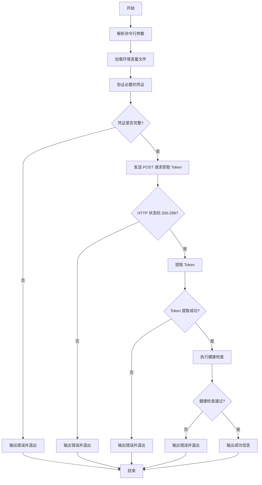

# Token 获取脚本使用说明

## 概述

这是一个用于获取 API Token 并执行健康检查的 Bash 脚本。支持参数化配置、完善的错误处理和友好的日志输出。

## 主要改进

与原始版本相比，优化后的脚本具有以下改进：

### 1. **参数化 URL**

- ✅ 健康检查 URL 可通过命令行参数传入
- ✅ Token URL 可通过参数或环境变量配置
- ✅ 支持自定义环境变量文件路径

### 2. **修复的问题**

- ✅ 修复拼写错误：`passwrod` → `password`
- ✅ 修复 curl 参数：`-x POST` → `-X POST`
- ✅ 完善 HTTP 状态码检查
- ✅ 改进 Token 提取逻辑

### 3. **增强的功能**

- ✅ 彩色日志输出 (INFO/WARN/ERROR)
- ✅ 完善的参数解析和帮助信息
- ✅ 更安全的环境变量加载
- ✅ 支持 jq 解析 JSON（自动降级到 awk）
- ✅ HTTP 状态码验证
- ✅ 更好的错误处理和提示

### 4. **安全性提升**

- ✅ 使用 `set -euo pipefail` 防止错误传播
- ✅ Token 仅显示前缀，避免完整泄露
- ✅ 环境变量验证
- ✅ 更安全的 source 方式加载 .env

## 配置

### 环境变量文件 (.env)

在脚本同目录下创建 `.env` 文件：

```bash
# API 凭证
API_USERNAME=your_username
API_PASSWORD=your_password

# Token 获取 URL (可选，也可通过命令行参数指定)
TOKEN_URL=https://api.example.com/auth/token
```

### .gitignore 配置

确保敏感信息不会被提交到 Git：

```gitignore
.env
*.env
.env.*
!.env.example
```

### 环境变量示例文件 (.env.example)

创建一个模板文件供参考：

```bash
# API 凭证
API_USERNAME=
API_PASSWORD=

# Token 获取 URL
TOKEN_URL=
```

## 使用方法

### 基本使用

```bash
# 使用默认配置
./curl-token.sh

# 指定健康检查 URL
./curl-token.sh -u https://api.example.com/health

# 指定 Token URL
./curl-token.sh -t https://auth.example.com/token

# 使用自定义环境变量文件
./curl-token.sh -e prod.env

# 组合使用
./curl-token.sh \
  -u https://api.example.com/health \
  -t https://auth.example.com/token \
  -e prod.env
```

### 查看帮助

```bash
./curl-token.sh --help
```

### 参数说明

| 参数          | 简写 | 说明             | 默认值                                       |
| ------------- | ---- | ---------------- | -------------------------------------------- |
| `--url`       | `-u` | 健康检查的 URL   | `https://www.example.com/.well-known/health` |
| `--env`       | `-e` | 环境变量配置文件 | `.env`                                       |
| `--token-url` | `-t` | Token 获取 URL   | 从环境变量读取                               |
| `--help`      | `-h` | 显示帮助信息     | -                                            |

## 执行流程



## 代码对比

### 原始版本问题

```bash
# 1. 拼写错误
"passwrod": "$API_PASSWORD"  # ❌ 错误

# 2. 硬编码 URL
curl ... https://www.example.com/.well-known/health  # ❌ 不灵活

# 3. curl 参数错误
curl -v -x POST  # ❌ 应该是 -X POST

# 4. 简单的错误处理
if [ $? -ne 0 ]; then
    echo "Failed to get token"
    exit 1
fi

# 5. 不安全的 token 提取
echo $response|awk -F: '{print $2}'|tr -d '}\"'  # ❌ 不可靠
```

### 优化版本解决方案

```bash
# 1. 修正拼写
"password": "$API_PASSWORD"  # ✅ 正确

# 2. 参数化 URL
HEALTH_URL="${1:-https://www.example.com/.well-known/health}"  # ✅ 灵活

# 3. 正确的 curl 参数
curl --request POST  # ✅ 正确且语义清晰

# 4. 完善的错误处理
response=$(curl --silent --show-error --write-out "\n%{http_code}" ...)
http_code=$(echo "$response" | tail -n1)
if [ "$http_code" -lt 200 ] || [ "$http_code" -ge 300 ]; then
    log_error "HTTP 请求失败，状态码: $http_code"
    exit 1
fi

# 5. 可靠的 token 提取
if command -v jq &> /dev/null; then
    token=$(echo "$response" | jq -r '.token // .access_token // .jwt // empty')
else
    token=$(echo "$response" | awk -F: '{print $2}' | tr -d '}\"' | tr -d '[:space:]')
fi
```

## 最佳实践

### 1. 环境隔离

为不同环境创建不同的配置文件：

```bash
# 开发环境
./curl-token.sh -e .env.dev -u https://dev-api.example.com/health

# 测试环境
./curl-token.sh -e .env.test -u https://test-api.example.com/health

# 生产环境
./curl-token.sh -e .env.prod -u https://api.example.com/health
```

### 2. 集成到 CI/CD

```yaml
# GitHub Actions 示例
steps:
  - name: Health Check
    env:
      API_USERNAME: ${{ secrets.API_USERNAME }}
      API_PASSWORD: ${{ secrets.API_PASSWORD }}
    run: |
      ./curl-token.sh \
        -u https://api.example.com/health \
        -t https://auth.example.com/token
```

### 3. 定时健康检查

```bash
# Crontab 示例 - 每5分钟执行一次
*/5 * * * * cd /path/to/script && ./curl-token.sh >> /var/log/health-check.log 2>&1
```

### 4. 日志记录

```bash
# 记录详细日志
./curl-token.sh 2>&1 | tee -a health-check.log

# 仅记录错误
./curl-token.sh 2>> error.log
```

## 依赖项

### 必需

- `bash` (4.0+)
- `curl`

### 可选

- `jq` - 用于可靠的 JSON 解析（推荐安装）

安装 jq：

```bash
# macOS
brew install jq

# Ubuntu/Debian
sudo apt-get install jq

# CentOS/RHEL
sudo yum install jq
```

## 故障排除

### 问题 1：找不到环境变量文件

```bash
[WARN] 环境变量文件不存在: .env
[ERROR] 缺少必要的环境变量: API_USERNAME API_PASSWORD
```

**解决方案**：创建 `.env` 文件并设置必要的变量。

### 问题 2：Token 提取失败

```bash
[ERROR] 无法从响应中提取 Token
```

**解决方案**：

1. 检查 API 响应格式是否正确
2. 安装 `jq` 以获得更可靠的 JSON 解析
3. 根据实际 API 响应调整 Token 提取逻辑

### 问题 3：健康检查失败

```bash
[ERROR] 健康检查失败 (HTTP 401)
```

**解决方案**：

1. 检查 Token 是否有效
2. 验证健康检查 URL 是否正确
3. 确认 `trust-Token` 头名称是否与 API 要求一致

## 安全建议

1. **绝对不要**将 `.env` 文件提交到版本控制系统
2. **务必**在 `.gitignore` 中添加 `.env` 相关模式
3. **建议**定期轮换 API 凭证
4. **推荐**在生产环境使用密钥管理服务（如 GCP Secret Manager）
5. **避免**在日志中输出完整的 Token

## 进一步优化建议

### 1. 支持配置文件

除了环境变量，还可以支持 YAML/JSON 配置文件：

```bash
# 使用配置文件
./curl-token.sh --config config.yaml
```

### 2. 添加重试机制

```bash
# 在获取 token 失败时自动重试
MAX_RETRIES=3
RETRY_DELAY=2
```

### 3. Token 缓存

```bash
# 缓存 Token 以减少 API 调用
TOKEN_CACHE_FILE="/tmp/api_token_cache"
TOKEN_CACHE_TTL=3600  # 1小时
```

### 4. 监控和告警

```bash
# 集成 Prometheus metrics
curl -X POST http://pushgateway:9091/metrics/job/health_check \
  --data-binary @metrics.txt
```

## 相关文档

- [curl 官方文档](https://curl.se/docs/)
- [jq 官方手册](https://stedolan.github.io/jq/manual/)
- [Bash 最佳实践](https://github.com/bahamas10/bash-style-guide)

## 许可证

MIT License
