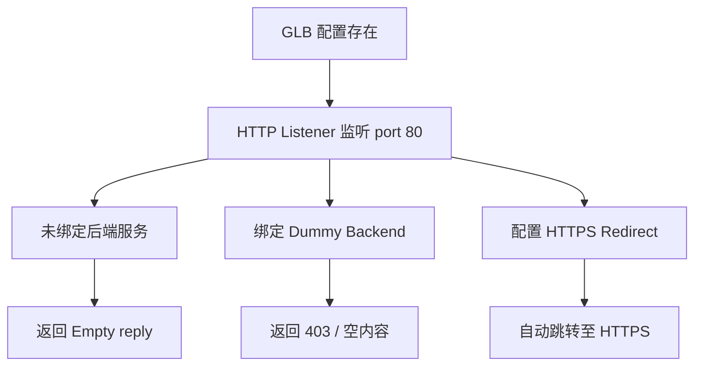
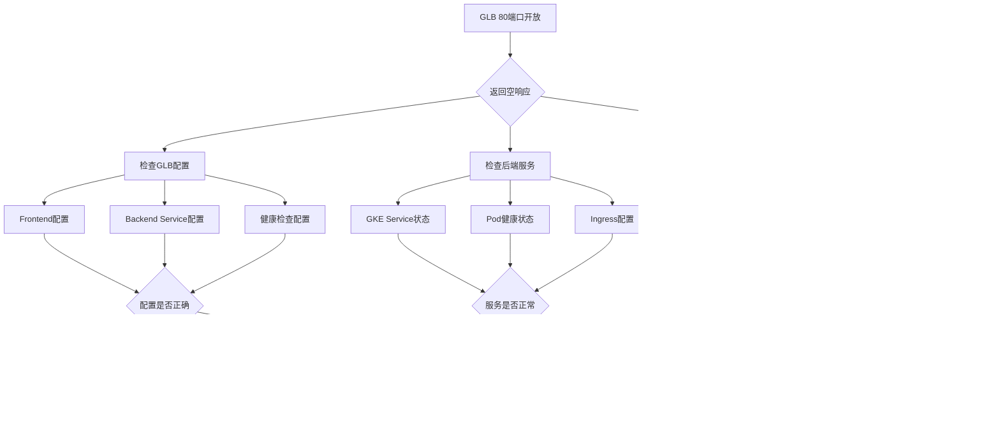

你发现 Google 的 Global Load Balancer（GLB）监听了 80 端口并且是 open 状态，这在很多场景下是 **正常现象**，以下是可能的原因分析：

---

## **🌐 1.** 

## **GCP GLB 默认监听 80/443 端口**

GCP 的 **HTTP(S) Load Balancer** 是全球代理式负载均衡器，**默认监听**：

- 80：用于 HTTP（可选，自动重定向到 HTTPS）
- 443：用于 HTTPS（大多数正式部署使用）

你配置了 HTTPS 的 frontend，但 **如果没有禁止 HTTP**，GLB **仍然会自动监听 80 端口**。即使你没有显式提供后端服务用于 HTTP，它也会响应 TCP 连接建立（三次握手），所以：

- nmap 扫描显示 80/tcp open ✅
- curl 请求 http://... 时出现 Empty reply from server，说明连接建立，但没有上层应用响应。

---

## **🔍 2.** 

## **可能配置了 HTTP Redirect 或 Empty Backend**

可能存在以下 GLB 配置：

| **现象**                                 | **解释**                                                                       |
| ---------------------------------------- | ------------------------------------------------------------------------------ |
| 80 端口打开但不返回内容                  | HTTP frontend 存在，但 backend 服务未配置或返回空响应                          |
| curl 看到 Empty reply                    | backend 未处理 HTTP 请求（可能为 HTTP -> HTTPS 重定向失败，或 backend 无响应） |
| backend service 设置为 empty 或 redirect | 例如使用 URL Map 的 default-backend 返回 404 / 空响应                          |

---

## **🔒 3.** 

## **未设置 HTTP → HTTPS redirect 或未关闭 HTTP**

GLB 支持设置 URL Map 的重定向规则：

```
defaultRouteAction:
  redirectAction:
    httpsRedirect: true
```

如果你未设置这个行为，则 80 是打开的，但无效。

> 若你**希望完全关闭 HTTP（port 80）访问**，需要在以下位置处理：

- **删除 HTTP frontend**
- 或在 URL Map 中配置拒绝（403）或 redirect
- 或为 80 设置 dummy backend，返回明确的错误或 redirect 响应

---

## **🔒 4.** 

## **Cloud Armor 或防火墙不影响 Layer4 连接建立**

注意：

- Cloud Armor 只能拦截 L7 HTTP 请求，不影响 TCP 层握手
- 即使你用 Cloud Armor 拦截所有请求，nmap 依旧可能看到 open
- 防火墙规则在 GCP GLB 层**不直接控制 frontend**

---

## **✅ 5.** 

## **你的 curl 返回 “Empty reply” 是标准现象**

```
curl -v http://mydomain.com
```

这是因为：

- TCP 成功建立连接
- 发送了 HTTP GET
- 但服务端（GLB 或后端）未返回 HTTP 报文，导致 curl 返回：

```
- Empty reply from server
```

这通常意味着 backend 返回了 TCP RST 或连接被丢弃，**非异常问题**。

---

## **✅ 建议操作（如果你要关闭或显式控制 80 端口）**

### **✅ 方式一：**

### **禁用 HTTP frontend**

```
gcloud compute forwarding-rules delete [HTTP_RULE_NAME] --global
```

### **✅ 方式二：**

### **配置 HTTP redirect 到 HTTPS**

```
defaultRouteAction:
  redirectAction:
    httpsRedirect: true
    stripQuery: false
```

### **✅ 方式三：**

### **自定义 403 返回或 Dummy Backend**

配置 default backend service 返回 403：

```
defaultService: projects/[PROJECT]/global/backendServices/dummy-service
```

---

### **Mermaid 流程图：HTTP 端口为何开启的可能流程**



---

如你需要我协助你确认是否某个 forwarding rule、url map、backend-service 实际上绑定了 HTTP，你可以提供：

- gcloud compute forwarding-rules list
- gcloud compute url-maps describe YOUR_URL_MAP
- gcloud compute target-http-proxies list

我可以帮你进一步分析实际暴露端口的原因。
telnet ip 80
Trying ip...
Connected to ip.bc.googleusercontent.com.
Escape character is '^]'.
quit
Connection closed by foreign host.


# Claude
基于扫描结果，这是一个Google Load Balancer (GLB)地址，80端口开放但返回空响应的原因可能有以下几种：

## 可能的原因分析

### 1. HTTP到HTTPS重定向配置问题

```bash
# 正常情况下应该返回301/302重定向
curl -v -L http://mydomain.com
```

### 2. GLB健康检查端口

- GLB可能将80端口用于健康检查
- 后端服务只在443端口提供实际服务
- 80端口配置为"drop connection"而非重定向

### 3. 防火墙或安全策略

```bash
# 检查是否有特定的User-Agent或Header要求
curl -v -H "User-Agent: Mozilla/5.0" http://mydomain.com
```

### 4. 后端服务配置

- 后端pod/service未正确监听80端口
- Ingress配置问题
- 服务网格(如Istio)配置异常

## 排查流程



## 具体检查方法

### 1. 检查GLB配置

```bash
# 获取GLB详细信息
gcloud compute url-maps list
gcloud compute backend-services list
gcloud compute forwarding-rules list --global
```

### 2. 测试不同请求方式

```bash
# 测试HTTPS
curl -v https://mydomain.com

# 测试带完整Headers
curl -v -H "Host: mydomain.com" \
     -H "User-Agent: Mozilla/5.0" \
     http://myip

# 测试TCP连接
telnet myip 80
```

### 3. 检查DNS和证书

```bash
# DNS解析
dig mydomain.com

# SSL证书检查
openssl s_client -connect mydomain.com:443 -servername mydomain.com
```

## 常见解决方案

|问题类型|解决方法|优先级|
|---|---|---|
|重定向未配置|在GLB中配置HTTP到HTTPS重定向|高|
|后端服务问题|检查GKE Service和Pod状态|高|
|安全策略阻断|调整Cloud Armor或防火墙规则|中|
|健康检查配置|配置正确的健康检查路径|中|
|Ingress问题|检查Kubernetes Ingress配置|低|

**建议优先检查HTTPS端口是否正常工作，然后确认GLB的重定向配置。**