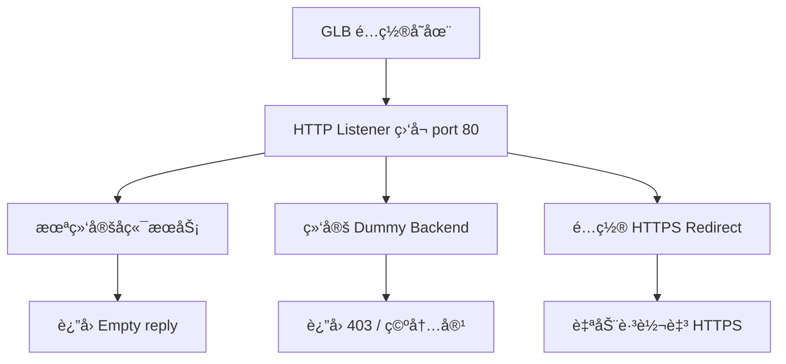
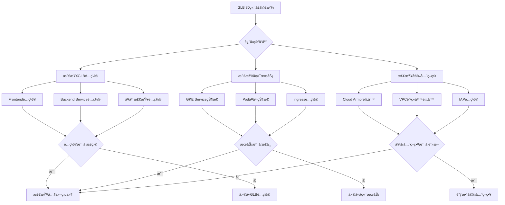

ä½ å‘ç° Google çš„ Global Load Balancer（GLB）监å¬äº† 80 端å£å¹¶ä¸”是 open 状æ€ï¼Œè¿™åœ¨å¾ˆå¤šåœºæ™¯ä¸‹æ˜¯ **正常ç°è±¡**，以下是å¯èƒ½çš„åŸå› åˆ†æ：

---

## **🌠1.** 

## **GCP GLB é»˜è®¤ç›‘å¬ 80/443 端å£**

GCP çš„ **HTTP(S) Load Balancer** 是全çƒä»£ç†å¼è´Ÿè½½å‡è¡¡å™¨ï¼Œ**默认监å¬**：

- 80ï¼šç”¨äº HTTP（å¯é€‰ï¼Œè‡ªåŠ¨é‡å®šå‘到 HTTPS）
- 443ï¼šç”¨äº HTTPS（大多数正å¼éƒ¨ç½²ä½¿ç”¨ï¼‰

ä½ é…置了 HTTPS çš„ frontend，但 **如æœæ²¡æœ‰ç¦æ­¢ HTTP**，GLB **ä»ç„¶ä¼šè‡ªåŠ¨ç›‘å¬ 80 端å£**。å³ä½¿ä½ æ²¡æœ‰æ˜¾å¼æä¾›å端æœåŠ¡ç”¨äº HTTP，它也会å“应 TCP è¿æ¥å»ºç«‹ï¼ˆä¸‰æ¬¡æ¡æ‰‹ï¼‰ï¼Œæ‰€ä»¥ï¼š

- nmap 扫æ显示 80/tcp open ✅
- curl 请求 http://... æ—¶å‡ºç° Empty reply from server，说æ˜è¿æ¥å»ºç«‹ï¼Œä½†æ²¡æœ‰ä¸Šå±‚应用å“应。

---

## **🔠2.** 

## **å¯èƒ½é…置了 HTTP Redirect 或 Empty Backend**

å¯èƒ½å­˜åœ¨ä»¥ä¸‹ GLB é…置：

| **ç°è±¡**                                 | **解释**                                                                       |
| ---------------------------------------- | ------------------------------------------------------------------------------ |
| 80 端å£æ‰“开但ä¸è¿”å›å†…容                  | HTTP frontend 存在，但 backend æœåŠ¡æœªé…置或返å›ç©ºå“应                          |
| curl 看到 Empty reply                    | backend æœªå¤„ç† HTTP 请求（å¯èƒ½ä¸º HTTP -> HTTPS é‡å®šå‘失败，或 backend æ— å“应） |
| backend service 设置为 empty 或 redirect | 例如使用 URL Map çš„ default-backend è¿”å› 404 / 空å“应                          |

---

## **🔒 3.** 

## **未设置 HTTP → HTTPS redirect 或未关闭 HTTP**

GLB 支æŒè®¾ç½® URL Map çš„é‡å®šå‘规则：

```
defaultRouteAction:
  redirectAction:
    httpsRedirect: true
```

如æœä½ æœªè®¾ç½®è¿™ä¸ªè¡Œä¸ºï¼Œåˆ™ 80 是打开的，但无效。

> 若你**希望完全关闭 HTTP（port 80）访问**，需è¦åœ¨ä»¥ä¸‹ä½ç½®å¤„ç†ï¼š

- **删除 HTTP frontend**
- 或在 URL Map 中é…置拒ç»ï¼ˆ403）或 redirect
- 或为 80 设置 dummy backend，返å›æ˜ç¡®çš„错误或 redirect å“应

---

## **🔒 4.** 

## **Cloud Armor 或防ç«å¢™ä¸å½±å“ Layer4 è¿æ¥å»ºç«‹**

注æ„：

- Cloud Armor åªèƒ½æ‹¦æˆª L7 HTTP 请求，ä¸å½±å“ TCP 层æ¡æ‰‹
- å³ä½¿ä½ ç”¨ Cloud Armor 拦截所有请求，nmap ä¾æ—§å¯èƒ½çœ‹åˆ° open
- 防ç«å¢™è§„则在 GCP GLB 层**ä¸ç›´æ¥æ§åˆ¶ frontend**

---

## **✅ 5.** 

## **ä½ çš„ curl è¿”å› â€œEmpty reply†是标准ç°è±¡**

```
curl -v http://mydomain.com
```

这是因为：

- TCP æˆåŠŸå»ºç«‹è¿æ¥
- å‘é€äº† HTTP GET
- 但æœåŠ¡ç«¯ï¼ˆGLB 或åç«¯ï¼‰æœªè¿”å› HTTP 报文，导致 curl è¿”å›ï¼š

```
- Empty reply from server
```

这通常æ„å‘³ç€ backend è¿”å›äº† TCP RST 或è¿æ¥è¢«ä¸¢å¼ƒï¼Œ**é异常问题**。

---

## **✅ 建议æ“作（如æœä½ è¦å…³é—­æˆ–显å¼æ§åˆ¶ 80 端å£ï¼‰**

### **✅ æ–¹å¼ä¸€ï¼š**

### **ç¦ç”¨ HTTP frontend**

```
gcloud compute forwarding-rules delete [HTTP_RULE_NAME] --global
```

### **✅ æ–¹å¼äºŒï¼š**

### **é…ç½® HTTP redirect 到 HTTPS**

```
defaultRouteAction:
  redirectAction:
    httpsRedirect: true
    stripQuery: false
```

### **✅ æ–¹å¼ä¸‰ï¼š**

### **自定义 403 è¿”å›æˆ– Dummy Backend**

é…ç½® default backend service è¿”å› 403：

```
defaultService: projects/[PROJECT]/global/backendServices/dummy-service
```

---

### **Mermaid æµç¨‹å›¾ï¼šHTTP 端å£ä¸ºä½•å¼€å¯çš„å¯èƒ½æµç¨‹**



---

如你需è¦æˆ‘å助你确认是å¦æŸä¸ª forwarding ruleã€url mapã€backend-service å®é™…上绑定了 HTTP，你å¯ä»¥æ供：

- gcloud compute forwarding-rules list
- gcloud compute url-maps describe YOUR_URL_MAP
- gcloud compute target-http-proxies list

我å¯ä»¥å¸®ä½ è¿›ä¸€æ­¥åˆ†æå®é™…暴露端å£çš„åŸå› ã€‚
telnet ip 80
Trying ip...
Connected to ip.bc.googleusercontent.com.
Escape character is '^]'.
quit
Connection closed by foreign host.


# Claude
基äºæ‰«æ结æœï¼Œè¿™æ˜¯ä¸€ä¸ªGoogle Load Balancer (GLB)地å€ï¼Œ80端å£å¼€æ”¾ä½†è¿”å›ç©ºå“应的åŸå› å¯èƒ½æœ‰ä»¥ä¸‹å‡ ç§ï¼š

## å¯èƒ½çš„åŸå› åˆ†æ

### 1. HTTP到HTTPSé‡å®šå‘é…置问题

```bash
# 正常情况下应该返å›301/302é‡å®šå‘
curl -v -L http://mydomain.com
```

### 2. GLBå¥åº·æ£€æŸ¥ç«¯å£

- GLBå¯èƒ½å°†80端å£ç”¨äºå¥åº·æ£€æŸ¥
- å端æœåŠ¡åªåœ¨443端å£æä¾›å®é™…æœåŠ¡
- 80端å£é…置为"drop connection"而éé‡å®šå‘

### 3. 防ç«å¢™æˆ–安全策略

```bash
# 检查是å¦æœ‰ç‰¹å®šçš„User-Agent或Headerè¦æ±‚
curl -v -H "User-Agent: Mozilla/5.0" http://mydomain.com
```

### 4. å端æœåŠ¡é…ç½®

- å端pod/service未正确监å¬80端å£
- Ingressé…置问题
- æœåŠ¡ç½‘æ ¼(如Istio)é…置异常

## æ’查æµç¨‹



## 具体检查方法

### 1. 检查GLBé…ç½®

```bash
# è·å–GLB详细信æ¯
gcloud compute url-maps list
gcloud compute backend-services list
gcloud compute forwarding-rules list --global
```

### 2. 测试ä¸åŒè¯·æ±‚æ–¹å¼

```bash
# 测试HTTPS
curl -v https://mydomain.com

# 测试带完整Headers
curl -v -H "Host: mydomain.com" \
     -H "User-Agent: Mozilla/5.0" \
     http://myip

# 测试TCPè¿æ¥
telnet myip 80
```

### 3. 检查DNSå’Œè¯ä¹¦

```bash
# DNS解æ
dig mydomain.com

# SSLè¯ä¹¦æ£€æŸ¥
openssl s_client -connect mydomain.com:443 -servername mydomain.com
```

## 常è§è§£å†³æ–¹æ¡ˆ

|问题类å‹|解决方法|优先级|
|---|---|---|
|é‡å®šå‘未é…ç½®|在GLB中é…ç½®HTTP到HTTPSé‡å®šå‘|高|
|å端æœåŠ¡é—®é¢˜|检查GKE Serviceå’ŒPod状æ€|高|
|安全策略阻断|调整Cloud Armor或防ç«å¢™è§„则|中|
|å¥åº·æ£€æŸ¥é…ç½®|é…置正确的å¥åº·æ£€æŸ¥è·¯å¾„|中|
|Ingress问题|检查Kubernetes Ingressé…ç½®|ä½|

**建议优先检查HTTPS端å£æ˜¯å¦æ­£å¸¸å·¥ä½œï¼Œç„¶å确认GLBçš„é‡å®šå‘é…置。**