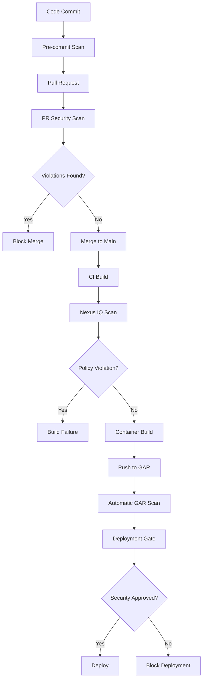

# Container Security Detection Tools

## 🔍 Tool Comparison Matrix

Based on your existing documentation, here's a comprehensive comparison of available detection tools:

| Tool | Type | FOSS/SCA | Container Scan | License Check | SBOM Generation | CI/CD Integration |
|------|------|----------|----------------|---------------|-----------------|-------------------|
| **Sonatype Nexus IQ** | Commercial SCA | ✅ Complete | ✅ Yes | ✅ Yes | ✅ CycloneDX/SPDX | ✅ Jenkins/Maven |
| **Google Artifact Registry** | Cloud Service | ✅ Container-focused | ✅ Automatic | ❌ No | ✅ Limited | ✅ GCP Native |
| **SonarQube** | Code Quality + SCA | ⚠️ Partial | ❌ No | ⚠️ Basic | ❌ No | ✅ Multiple |
| **Checkmarx** | SAST + SCA | ✅ With exploitable paths | ❌ No | ✅ Yes | ❌ No | ✅ Multiple |
| **Trivy** | Open Source | ✅ Yes | ✅ Yes | ⚠️ Partial | ✅ CycloneDX/SPDX | ✅ Multiple |
| **Syft + Grype** | Open Source | ✅ Yes | ✅ System packages | ✅ Yes | ✅ CycloneDX/SPDX | ✅ Multiple |

## 🎯 Tool Selection Strategy

### For Immediate Use (Already Available)
1. **Sonatype Nexus IQ** - Primary SCA tool with policy enforcement
2. **Google Artifact Registry** - Automatic container scanning on push
3. **SonarQube** - Code quality with basic dependency analysis
4. **Checkmarx** - SAST with exploitable path analysis

### For Enhancement (Recommended Additions)
1. **Trivy** - Lightweight, comprehensive scanning
2. **Syft** - SBOM generation
3. **Grype** - Vulnerability scanning of SBOMs

## 🔧 Tool-Specific Commands

### Sonatype Nexus IQ
```bash
# Maven integration
mvn clean package clm:evaluate

# CLI scanning
nexus-iq-cli -s http://nexus-iq-server:8070 -i my-app scan target/my-app.jar
```

### Google Artifact Registry
```bash
# List vulnerabilities
gcloud artifacts docker images list-vulnerabilities \
  --project=your-project-id \
  --location=LOCATION \
  --repository=REPO_NAME \
  --image=IMAGE_NAME

# Describe specific image
gcloud artifacts docker images describe \
  us-central1-docker.pkg.dev/your-project-id/your-repo/your-image@sha256:digest \
  --show-package-vulnerability \
  --format=json
```

### Trivy
```bash
# Scan container image
trivy image gcr.io/my-project/my-app:latest

# Scan filesystem
trivy fs --scanners vuln ./my-project

# Generate SBOM
trivy image --format cyclonedx --output sbom.json gcr.io/my-project/my-app:latest

# Scan configuration
trivy config ./k8s-manifests/
```

### Syft + Grype
```bash
# Generate SBOM with Syft
syft your-registry/your-app:latest -o cyclonedx-json > sbom.json

# Scan SBOM with Grype
grype sbom:sbom.json

# Direct image scan
grype your-registry/your-app:latest
```

## 🚀 Integration Points

### CI/CD Pipeline Integration
Based on your existing tools, here are the recommended integration points:

1. **Pre-commit hooks** - Trivy for quick local scans
2. **Pull Request gates** - SonarQube + Trivy
3. **Build stage** - Nexus IQ (primary gate)
4. **Container registry** - Google Artifact Registry (automatic)
5. **Deployment gate** - Binary Authorization with GAR results

### Kubernetes Integration
```yaml
# Example admission controller webhook
apiVersion: admissionregistration.k8s.io/v1
kind: ValidatingAdmissionWebhook
metadata:
  name: image-security-webhook
webhooks:
- name: validate-image-security
  clientConfig:
    service:
      name: security-validator
      namespace: security-system
      path: /validate
  rules:
  - operations: ["CREATE", "UPDATE"]
    apiGroups: [""]
    apiVersions: ["v1"]
    resources: ["pods"]
```

## 📊 Detection Workflow



## 🔄 Continuous Monitoring

### Scheduled Scanning
```bash
#!/bin/bash
# scheduled-scan.sh
# Run daily via cron

# Scan production images
PROD_IMAGES=$(kubectl get pods -A -o jsonpath='{.items[*].spec.containers[*].image}' | tr ' ' '\n' | sort -u)

for image in $PROD_IMAGES; do
    echo "Scanning production image: $image"
    trivy image --format json --output "prod-scan-$(date +%Y%m%d)-${image//\//_}.json" "$image"
done

# Generate summary report
python3 generate-security-report.py
```

### Alert Configuration
```yaml
# Example alerting configuration
alerts:
  - name: critical-vulnerability-found
    condition: severity == "CRITICAL"
    actions:
      - slack: "#security-alerts"
      - email: "security-team@company.com"
      - jira: "SEC"
  
  - name: high-vulnerability-count
    condition: count(severity == "HIGH") > 10
    actions:
      - slack: "#dev-team"
      - email: "dev-team@company.com"
```

## 📈 Metrics and Reporting

### Key Metrics to Track
1. **Vulnerability Density** - Vulnerabilities per image/KLOC
2. **Mean Time to Remediation** - Time from detection to fix
3. **Policy Compliance Rate** - % of builds passing security policies
4. **Coverage Rate** - % of images/components scanned
5. **False Positive Rate** - % of alerts that are false positives

### Reporting Dashboard
```python
# Example metrics collection
import json
from datetime import datetime

def collect_scan_metrics(scan_results):
    metrics = {
        'timestamp': datetime.now().isoformat(),
        'total_vulnerabilities': 0,
        'critical_count': 0,
        'high_count': 0,
        'medium_count': 0,
        'low_count': 0,
        'images_scanned': 0
    }
    
    for result in scan_results:
        metrics['images_scanned'] += 1
        for vuln in result.get('vulnerabilities', []):
            metrics['total_vulnerabilities'] += 1
            severity = vuln.get('severity', '').upper()
            if severity == 'CRITICAL':
                metrics['critical_count'] += 1
            elif severity == 'HIGH':
                metrics['high_count'] += 1
            elif severity == 'MEDIUM':
                metrics['medium_count'] += 1
            elif severity == 'LOW':
                metrics['low_count'] += 1
    
    return metrics
```