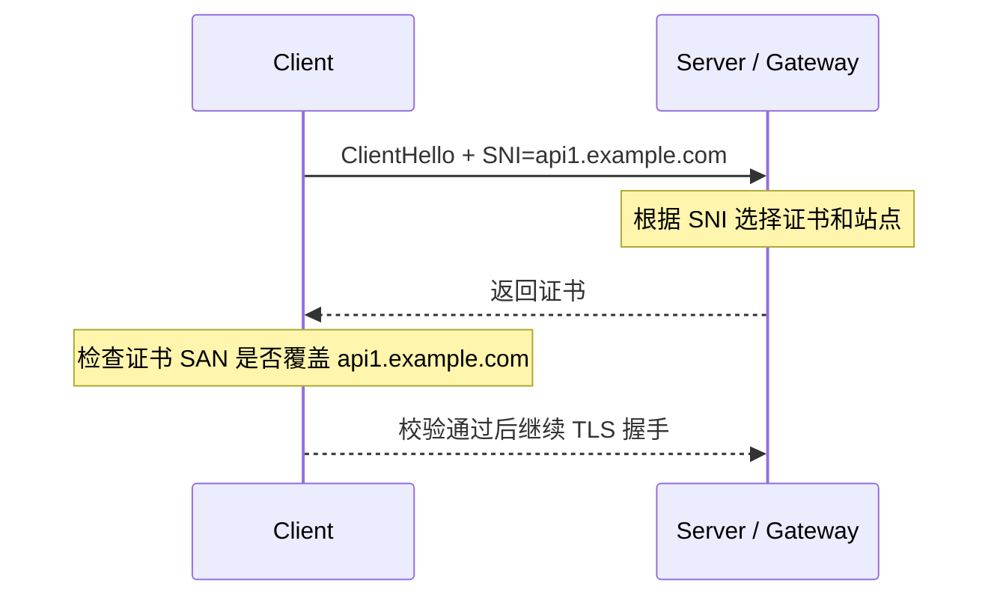

# SAN vs SNI：区别、使用场景与验证方法

> 本文基于 [why-san.md](/Users/lex/git/knowledge/ssl/why-san.md)、[verify-domain-ssl-enhance.sh](/Users/lex/git/knowledge/ssl/verify-domain-ssl-enhance.sh) 和 [nginx+simple+merge.md](/Users/lex/git/knowledge/nginx/docs/proxy-pass/nginx+simple+merge.md) 整理，目标不是解释 TLS 理论，而是从架构和落地角度回答：什么是 SAN，什么是 SNI，它们分别解决什么问题，什么时候该关注哪一个，以及如何验证你的服务是否真正支持 SNI。

---

## 1. Goal And Constraints

### 1.1 你真正关心的问题

从架构视角，SAN 和 SNI 经常被混在一起，但它们解决的是两个完全不同的问题：

- `SNI` 解决的是：客户端在 TLS 握手一开始，告诉服务端“我想访问哪个域名”
- `SAN` 解决的是：服务端返回证书之后，客户端校验“这张证书是否真的适用于这个域名”

所以最短结论是：

`SNI 决定你拿到哪张证书，SAN 决定这张证书能不能被接受。`

### 1.2 本文的使用范围

本文重点适用于这些场景：

- Nginx / Kong / Gateway 统一 TLS 入口
- GCLB / Ingress / Service Mesh TLS 终止
- 一个 IP 承载多个 HTTPS 域名
- 上游代理转发时需要保留 Host/SNI
- Pod / Service / Gateway 之间需要重新发起 TLS

---

## 2. Recommended Architecture (V1)

### 2.1 概念定位

| 概念 | 所在阶段 | 作用 | 你应该问的问题 |
| --- | --- | --- | --- |
| `SNI` | TLS ClientHello 阶段 | 告诉服务端要访问哪个域名 | 服务端会不会根据我请求的域名选证书/选虚拟主机？ |
| `SAN` | 证书校验阶段 | 证明证书覆盖哪些域名 | 服务端返回的证书是否覆盖我请求的域名？ |

### 2.2 一句话区别

可以把它们记成：

- `SNI` 是客户端发给服务端的“我要谁”
- `SAN` 是证书对客户端说的“我可以是谁”

### 2.3 一次完整 HTTPS 连接里，它们怎么配合



如果拆开看：

1. 没有 SNI，服务端可能不知道该返回哪张证书
2. 有 SNI，但证书 SAN 不包含该域名，主机名校验仍然会失败
3. 证书 SAN 正确，但前面 SNI 发错了，服务端可能返回了另一张证书，也一样会失败

---

## 3. Trade-Offs And Alternatives

### 3.1 SAN 和 SNI 不是二选一

这不是“什么时候用 SAN，什么时候用 SNI”的关系。

更准确的说法是：

- 只要你做 HTTPS 证书校验，就一定要关心 `SAN`
- 只要一个入口 IP/端口上承载多个 TLS 域名，你几乎一定要关心 `SNI`

### 3.2 什么时候主要看 SAN

以下问题，本质上都在看 SAN：

- 证书是否覆盖 `api.example.com`
- wildcard 是否能匹配根域
- 为什么 `www.example.com` 能过校验但 CN 不是它
- 多 SAN 证书是否合适
- 业务域名到底该放精确 SAN 还是 wildcard SAN

典型判断：

| 场景 | 更应该关注什么 |
| --- | --- |
| 证书设计 | SAN |
| 域名覆盖范围 | SAN |
| wildcard 影响面 | SAN |
| 证书爆炸半径 | SAN |

### 3.3 什么时候主要看 SNI

以下问题，本质上都在看 SNI：

- 一个 Nginx / LB / Gateway 怎么在同一个 443 上服务多个域名
- 为什么代理转发时要保留原始 Host/SNI
- 为什么 `openssl s_client` 需要加 `-servername`
- 为什么 Gateway 到后端要显式设置 `sni`
- 为什么 `PASSTHROUGH + tls + sniHosts` 只能按域名转发

典型判断：

| 场景 | 更应该关注什么 |
| --- | --- |
| 多域名共用入口 | SNI |
| TLS 路由 | SNI |
| 代理重新发起 TLS | SNI |
| 证书选择错误 | SNI |

### 3.4 容易混淆但必须分清的一点

很多人以为“证书里有 SAN，就说明服务支持 SNI”。

这是错的。

原因：

- `SAN` 是证书内容
- `SNI` 是握手时客户端发送的扩展信息

一个服务可以：

- 支持 SNI，但证书 SAN 配得不对
- 证书 SAN 很完整，但服务端没有正确基于 SNI 做证书选择

所以它们必须分开验证。

---

## 4. Implementation Steps

### 4.1 先用一个例子理解

假设有两个域名：

- `api1.team.appdev.aibang`
- `api2.team.appdev.aibang`

它们共用同一个 LB / Nginx / Gateway IP。

那么标准过程是：

1. 客户端连接同一个 IP:443
2. 在 ClientHello 里带上 `SNI=api1.team.appdev.aibang`
3. 入口层根据 SNI 选择 `api1` 对应证书或路由
4. 客户端收到证书后，再检查证书 SAN 是否覆盖 `api1.team.appdev.aibang`

这时：

- `SNI` 负责“选中 api1”
- `SAN` 负责“证明 api1 是合法的吗”

### 4.2 在你的 Nginx + Gateway + Pod 方案里，它们分别在哪里起作用

结合 [nginx+simple+merge.md](/Users/lex/git/knowledge/nginx/docs/proxy-pass/nginx+simple+merge.md)：

#### Client -> Nginx

- 客户端发出 `SNI=api1.abjx.appdev.aibang`
- Nginx 根据 SNI/Server Name 选中合适的证书
- 客户端校验证书 SAN 是否覆盖该域名

#### Nginx -> Gateway

这里最关键的是：

```nginx
proxy_ssl_server_name on;
proxy_ssl_name        $host;
```

这两行的含义不是 SAN，而是：

- Nginx 作为 TLS 客户端，重新连接 Gateway 时，把原始业务域名继续作为 `SNI` 发给上游

如果没有这一步，Gateway 可能拿不到正确 SNI，进而：

- 返回错误证书
- 进入默认虚拟主机
- 命中错误路由

#### Gateway -> Pod

在 `DestinationRule` 里：

```yaml
trafficPolicy:
  tls:
    mode: SIMPLE
    sni: api1.abjx.appdev.aibang
```

这里的 `sni` 也是同一个意思：

- Gateway 作为 TLS 客户端，向 Pod/后端发起 TLS 时，显式声明访问的业务域名

这一步保证：

- 后端能按业务域名选证书
- 返回的证书 SAN 能和 `api1.abjx.appdev.aibang` 对上

### 4.3 架构上什么时候要显式配置 SNI

以下场景建议显式配置或验证 SNI：

| 场景 | 为什么 |
| --- | --- |
| Nginx `proxy_pass https://...` 到上游 | 上游是多域名 TLS 入口时，不带 SNI 容易拿错证书 |
| Istio `DestinationRule.tls.sni` | Gateway 到 Pod/Service 重建 TLS 时，要维持业务域名语义 |
| `openssl s_client` 探测域名 | 不加 `-servername` 往往测到的是默认证书，不是真实目标 |
| `PASSTHROUGH + tls + sniHosts` | 路由本身就依赖 SNI |

### 4.4 架构上什么时候重点设计 SAN

以下场景应该重点设计 SAN，而不是只看 SNI：

| 场景 | 关注点 |
| --- | --- |
| 共享入口证书 | 是用大 SAN 证书还是 wildcard |
| Pod 终止 TLS | Pod 证书到底覆盖哪些业务域名 |
| east-west 用业务域名互调 | 内部访问域名必须被后端证书 SAN 覆盖 |
| 域名迁移期 | 新旧域名是否都要进入 SAN |

### 4.5 什么时候选多 SAN，什么时候选 wildcard

结合 [why-san.md](/Users/lex/git/knowledge/ssl/why-san.md) 的结论：

| 方案 | 适用场景 | 风险 |
| --- | --- | --- |
| 精确 SAN 列表 | 域名固定、边界清晰 | 维护成本更高 |
| wildcard SAN | 子域很多、结构稳定 | 私钥泄漏影响面更大 |
| 大 SAN 共享证书 | 共享入口层 | 证书影响面和治理成本更大 |

---

## 5. Validation And Rollback

### 5.1 如何验证“证书 SAN 是否正确”

最直接的验证是：

```bash
openssl x509 -in cert.pem -noout -ext subjectAltName
openssl x509 -in cert.pem -noout -checkhost api1.abjx.appdev.aibang
```

或者直接用现有脚本：

[verify-domain-ssl-enhance.sh](/Users/lex/git/knowledge/ssl/verify-domain-ssl-enhance.sh)

它现在已经做了两件和 SAN 强相关的事情：

1. 抓取服务器返回的证书链
2. 对叶子证书执行 `checkhost`

也就是说，这个脚本已经能回答：

- 服务端返回的证书链是什么
- 叶子证书 SAN 是否匹配输入域名

### 5.2 如何验证“服务是否支持 SNI”

这一步不能只看 SAN，必须做 A/B 对比。

最简单的方法：

#### 方法 A：带 SNI 连接

```bash
openssl s_client -connect api1.abjx.appdev.aibang:443 \
  -servername api1.abjx.appdev.aibang -showcerts
```

#### 方法 B：不带 SNI 连接

```bash
openssl s_client -connect api1.abjx.appdev.aibang:443 -showcerts
```

如果两次返回结果不同，通常说明：

- 服务端支持基于 SNI 的证书选择或虚拟主机选择

你重点对比：

- 叶子证书 Subject/SAN 是否变化
- 返回链是否变化
- 默认站点内容是否变化

### 5.3 更准确的 SNI 验证方法

建议做三组测试：

#### 测试 1：正确域名 + 正确 SNI

```bash
openssl s_client -connect <ip-or-domain>:443 \
  -servername api1.abjx.appdev.aibang
```

预期：

- 返回 `api1` 对应证书
- SAN 覆盖 `api1.abjx.appdev.aibang`

#### 测试 2：同一 IP + 另一个域名 SNI

```bash
openssl s_client -connect <same-ip-or-domain>:443 \
  -servername api2.abjx.appdev.aibang
```

预期：

- 返回 `api2` 对应证书，或至少返回另一条证书选择结果

#### 测试 3：不带 SNI

```bash
openssl s_client -connect <same-ip-or-domain>:443
```

预期：

- 返回默认证书，或者与测试 1 不同的证书

如果测试 1、2、3 完全无差异，不代表一定“不支持 SNI”，也可能是：

- 服务端本来就只有一张统一 wildcard 证书
- 多个域名本来就共用同一张大 SAN 证书

所以“验证 SNI 支持”本质上是在验证：

`服务端会不会根据 ClientHello 里的 server_name 做不同选择`

### 5.4 如何验证代理是否把 SNI 继续传给上游

这一步在代理架构里比“服务端支不支持 SNI”更重要。

以 Nginx 为例，验证思路是：

1. 配置 `proxy_ssl_server_name on;`
2. 配置 `proxy_ssl_name $host;`
3. 访问 `https://api1...`
4. 到上游抓证书或看日志，确认上游感知到的仍然是 `api1...`

如果这里没有显式传 SNI，常见现象是：

- 上游返回默认证书
- SAN 明明正确，但不是你想要的那张证书
- 路由命中默认 backend

### 5.5 现有脚本能做什么，不能做什么

[verify-domain-ssl-enhance.sh](/Users/lex/git/knowledge/ssl/verify-domain-ssl-enhance.sh) 当前已经做得不错，但它的核心定位是：

`验证某个域名在带 SNI 的情况下，返回的证书链和主机名校验结果。`

它当前默认使用：

```bash
-servername "$DOMAIN"
```

这意味着它更偏向“真实域名访问验证”，而不是“SNI 能力差异验证”。

它当前能回答：

- 指定域名访问时，证书链对不对
- SAN 匹配是否通过
- 链路和 CA 验证是否通过

它当前不能直接回答：

- 同一个入口在“带 SNI / 不带 SNI / 换另一个 SNI”时是否返回不同证书
- 代理层是否确实把原始 SNI 继续传给上游

### 5.6 是否需要单独的 SNI 验证脚本

建议：`需要`

原因：

- SAN 验证和 SNI 验证是两个不同维度
- 生产问题里，SNI 相关故障经常发生在代理转发层，而不是证书本身
- 只靠 `checkhost` 看不到“证书为什么拿错了”

建议脚本最少支持：

1. 指定 `connect host/ip`
2. 指定 `servername`
3. 支持“带 SNI / 不带 SNI”对比
4. 输出叶子证书 Subject / SAN
5. 输出是否命中默认证书

### 5.7 一个实用的 SNI 检查命令模板

```bash
TARGET_IP=1.2.3.4
for name in api1.abjx.appdev.aibang api2.abjx.appdev.aibang ""; do
  echo
  echo "==== servername: ${name:-<none>} ===="
  if [ -n "$name" ]; then
    openssl s_client -connect ${TARGET_IP}:443 -servername "$name" </dev/null 2>/dev/null \
      | openssl x509 -noout -subject -issuer -ext subjectAltName
  else
    openssl s_client -connect ${TARGET_IP}:443 </dev/null 2>/dev/null \
      | openssl x509 -noout -subject -issuer -ext subjectAltName
  fi
done
```

这个模板非常适合快速判断：

- 同一个 IP 是否因 SNI 不同而返回不同证书
- 默认证书是什么
- 不同业务域名是否真的由同一个共享证书承载

---

## 6. Reliability And Cost Optimizations

### 6.1 生产环境最常见的误区

#### 误区 1：证书 SAN 正确，就说明 SNI 没问题

不对。

可能只是：

- 你恰好拿到了默认证书
- 默认证书本身就是大 SAN / wildcard，表面看起来能过

#### 误区 2：服务支持 HTTPS，就等于支持 SNI

不对。

HTTPS 只是能做 TLS 握手，不代表：

- 多域名证书选择正确
- 多虚拟主机路由正确
- 上游代理会保留 SNI

#### 误区 3：只测域名，不测 IP

如果 DNS、CDN、LB 参与很多层，建议同时测：

- 域名访问
- 固定 IP + 指定 SNI

这样更容易定位问题出在：

- DNS
- 入口层证书选择
- 代理重建 TLS
- 后端证书设计

### 6.2 架构建议

#### 如果你设计证书

- 先设计 SAN 边界，再设计部署边界
- 能精确列域名就不要无脑放大 wildcard
- 共享入口层再考虑大 SAN 证书

#### 如果你设计代理链路

- 把 SNI 当成一等公民，而不是附属配置
- Nginx、Gateway、Mesh、LB 每一跳都确认“下一跳看到的 SNI 是什么”
- 任何 TLS re-origination 都要确认是否显式保留业务域名

### 6.3 在你的架构里最关键的判断

结合 [nginx+simple+merge.md](/Users/lex/git/knowledge/nginx/docs/proxy-pass/nginx+simple+merge.md)：

- `SAN` 决定 Pod / Gateway / Nginx 所用证书是否覆盖 `apiX.{team}.appdev.aibang`
- `SNI` 决定每一跳重新发起 TLS 时，上游是否还能拿到这个业务域名语义

所以真正要保的是：

`Host/SNI 不变 + 证书 SAN 覆盖该 Host`

这两件事缺一不可。

---

## 7. Handoff Checklist

### 7.1 判断 SAN 是否正确

- 证书 SAN 是否覆盖真实访问域名
- wildcard 是否真的匹配你的域名层级
- 根域和 wildcard 是否都需要
- Pod / Gateway / Nginx 各层证书是否都覆盖业务域名

### 7.2 判断 SNI 是否正确

- 客户端是否发送了正确的 `server_name`
- 代理是否把原始域名继续作为 SNI 传递给上游
- 上游是否基于 SNI 做了正确证书选择
- `带 SNI / 不带 SNI / 不同 SNI` 时，返回结果是否符合预期

### 7.3 最终结论

如果只记一句话：

`SAN 是证书的可用域名集合，SNI 是握手时请求的目标域名。`

如果再记一句更适合架构落地的话：

`SNI 负责把请求带到正确证书前，SAN 负责让这个证书能通过校验。`

这也是为什么在生产架构里：

- 设计证书时要先看 `SAN`
- 设计代理链路时要重点看 `SNI`
- 做排障时必须把两者拆开验证

