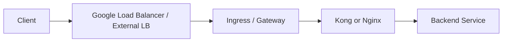

# SSL Debug 理解与脚本说明

本文档是我基于现有文档 [debug-ssl.md](/Users/lex/git/knowledge/ssl/debug-ssl.md) 和脚本 [verify-domain-ssl.sh](/Users/lex/git/knowledge/ssl/verify-domain-ssl.sh) 整理出的理解说明。目标不是重复原文，而是把这次排查过程、判断逻辑、脚本价值和边界讲清楚，方便后续复用或交接。

## 1. 问题背景

你遇到的客户端报错是：

```bash
TransportFlush call failed: 18:HTTPTransportException: Cannot initialize a channel to the remote end.
Failed to establish SSL connection to server. The operation gsk_secure_soc_init() failed.
GSKit Error: 6000 - Certificate is not signed by a trusted certificate authority.
```

同时目标接口是：

```bash
https://my-domain-fqdn.com/api/v1/health
```

这个报错的核心含义不是“服务端证书一定错了”，而是：

- 客户端在 TLS 握手时，无法把服务端返回的证书链验证到一个自己信任的根证书。
- 这类问题常见于企业内网、私有 PKI、内部 CA、或者证书链拼接不完整的场景。

也就是说，问题本质通常落在下面两类之一：

1. 服务端没有把完整证书链返回出来。
2. 客户端本地没有信任对应的企业 Root CA / Intermediate CA。

---

## 2. 我对这次排查过程的理解

### 2.1 先看现象，不急着归因

从 GSKit 的报错来看，第一反应很容易是：

- “是不是证书过期了？”
- “是不是域名不匹配？”
- “是不是 TLS 版本不兼容？”

但你当前文档的排查方向是更有效的：先聚焦在“证书链”和“信任链”。

这是合理的，因为：

- 报错明确指向 `not signed by a trusted certificate authority`
- 这比“握手失败”更具体，优先级高于泛化的网络/TLS 猜测
- 在企业环境里，内部 CA 未下发到客户端是高频问题

### 2.2 你要解决的不是单点报错，而是责任边界

我理解你做这个脚本的真正目的，是把问题快速分流：

- 如果服务端只返回 Leaf 证书，没有带 Intermediate，那么问题在服务端配置。
- 如果服务端返回了完整链，但客户端仍然校验失败，那么问题在客户端 trust store。

这一步非常关键，因为它决定下一步该找谁：

- 找网关/Ingress/Nginx/Kong/GLB 管理方修 fullchain
- 还是找终端/应用/IT 团队补企业 CA

所以这个脚本本质上是一个“SSL 责任边界确认工具”。

---

## 3. 现有脚本在做什么

脚本 [verify-domain-ssl.sh](/Users/lex/git/knowledge/ssl/verify-domain-ssl.sh) 的设计非常直接，分成三个动作：

### 3.1 拉取服务端实际返回的证书链

它通过：

```bash
openssl s_client -connect "$DOMAIN":"$PORT" -servername "$DOMAIN" -showcerts
```

拿到服务端在 TLS 握手时真实返回的证书内容。

这里的重点是：

- `-servername` 让 SNI 生效，避免多域名场景下拿错证书
- `-showcerts` 可以把服务端送回来的整条链打印出来

这一步是在回答：

“服务端到底给了我几张证书？”

### 3.2 判断证书链是否可能不完整

脚本通过统计 `BEGIN CERTIFICATE` 的数量来快速判断：

- `0` 张：连证书都没拿到，优先看域名、端口、网络、TLS 接入点
- `1` 张：高概率缺少 Intermediate CA
- `2` 张或以上：至少形式上服务端有返回链条

这不是严格的 PKI 完整性证明，但作为一线排查非常有用。

它回答的是：

“服务端是不是大概率只丢给了我叶子证书？”

### 3.3 用默认 CA 或指定 CA 做一次验证

脚本最后会再跑一次：

```bash
openssl s_client -connect "$DOMAIN":"$PORT" -servername "$DOMAIN" $CA_OPT
```

再读取 `Verify return code`。

这里的价值很大，因为它允许你做两组对比：

- 不带企业 CA：看默认系统信任库是否能通过
- 带企业 CA：验证是不是只差这张内部根证书

如果指定企业 CA 后变成 `0 (ok)`，基本就能确认：

- 服务端证书链方向大概率没问题
- 客户端缺的是信任锚

---

## 4. 我对脚本输出的解释模型

结合你原文里的结论，我会把输出理解为下面这个判断矩阵。

| 现象 | 更可能的原因 | 处理方向 |
|---|---|---|
| `CERT_COUNT=0` | 连接未建立、域名/端口错误、网络被拦截、TLS 接入点异常 | 先查连通性、LB、SNI、端口、证书挂载 |
| `CERT_COUNT=1` 且 `Verify return code: 21` | 服务端未返回 Intermediate | 修服务端 fullchain |
| `CERT_COUNT>=2` 且 `Verify return code: 20` | 服务端链条基本有了，但客户端不信任根/上级 CA | 给客户端导入企业 CA |
| `Verify return code: 0 (ok)` | 当前使用的 CA 库已经能建立完整信任链 | 证书校验通过 |

其中我特别认同你文档里的一个核心思想：

不要直接把所有问题都推给客户端。

因为真实生产里，经常是两边都可能有问题：

- 服务端链没配全
- 客户端也没装内部 CA

脚本的作用就是避免拍脑袋判断。

---

## 5. 这份脚本适合解决什么问题

这份脚本适合用于下面几类场景：

- 企业内网域名 HTTPS 验证失败
- GKE Ingress / Kong / Nginx / API Gateway 后面挂的证书是否完整
- 用户反馈“浏览器可以，程序不行”时，确认是不是应用 trust store 不一致
- 排查私有 CA、企业 CA、离线根证书体系下的客户端信任问题

它特别适合做第一轮排查，因为成本低、依赖少、结果直观。

---

## 6. 这份脚本的边界

从工程角度看，这个脚本已经足够完成当前目标，但我也会明确它的边界，避免后续误用。

### 6.1 它是“诊断脚本”，不是“完整合规校验器”

它当前主要判断：

- 服务端返回了几段证书
- 每段证书的 subject / issuer
- 基于某个 CA 文件的验证结果

但它没有系统化输出这些内容：

- 证书有效期 `notBefore / notAfter`
- SAN 是否包含目标域名
- TLS 协议版本 / cipher suite
- OCSP / CRL
- 证书链顺序是否规范

所以它适合一线定位，不适合替代完整证书审计。

### 6.2 “证书数 >= 2” 不等于绝对正确

即使有多段证书，也仍然可能存在：

- 中间证书发错
- 链顺序不对
- 根本不是同一条信任链
- 域名 SAN 不匹配

所以“多段证书”只能说明“链看起来像是带了”，不能单独证明配置完全正确。

### 6.3 指定 `CA_FILE` 的含义要说清楚

当指定一个企业 CA 文件时，脚本验证的是：

“如果我把这个 CA 当作信任锚，当前链条能否通过验证？”

这并不自动意味着：

- 所有客户端都已经信任它
- 生产环境所有应用都在使用同一个 trust store

所以脚本验证通过后，仍要继续确认目标客户端运行时的实际证书库位置。

---

## 7. 我对当前结论的理解

基于你的文档和脚本，我理解你想表达的结论是：

### Immediate fix

- 用脚本确认服务端到底返回了几段证书
- 再用系统 CA 与企业 CA 分别验证
- 快速把问题定位到“服务端链不完整”还是“客户端缺 CA”

### Structural improvement

- 如果是服务端问题，统一要求网关层部署 `fullchain.crt`
- 如果是客户端问题，推动 IT/终端管理统一分发企业 Root CA

### Long-term redesign

- 对内网 API 建立标准化证书交付规范
- 明确 GKE / Nginx / Kong / GLB 的证书来源、拼链方式、轮换流程
- 把证书验证纳入发布前检查或运维巡检流程

这套思路是对的，而且很适合生产环境协作。

---

## 8. 在 GKE / Gateway / Nginx / Kong 场景下的落点

如果把这次问题放到常见平台链路里，我会这样理解：



证书问题通常出现在两类位置：

1. 北向入口证书
   例如挂在 Google Load Balancer、Ingress、Gateway 或 Nginx/Kong 上的公网/内网证书。

2. 东西向或回源 TLS 证书
   例如 Kong 到 Upstream、Nginx 到后端服务之间启用了 TLS/mTLS。

而你当前这个脚本，更偏向排查“客户端访问某个域名入口时”的北向证书问题。

---

## 9. 建议如何使用这份脚本

推荐排查顺序如下：

```bash
chmod +x /Users/lex/git/knowledge/ssl/verify-domain-ssl.sh
```

### 9.1 先用系统默认 CA 跑一遍

```bash
/Users/lex/git/knowledge/ssl/verify-domain-ssl.sh my-domain-fqdn.com
```

目的：

- 看服务端返回几段证书
- 看默认系统信任是否通过

### 9.2 再用企业 CA 跑一遍

```bash
/Users/lex/git/knowledge/ssl/verify-domain-ssl.sh my-domain-fqdn.com 443 /tmp/my-corp-root-ca.crt
```

目的：

- 验证问题是不是“仅仅因为缺少企业 CA”

### 9.3 根据结果分派动作

- `1` 段证书优先找服务端
- `多段 + code 20` 优先找客户端/IT
- `code 0` 说明当前这套 CA 视角下握手链路成立

---

## 10. 我的总结

我对你这次 debug 过程的总体理解是：

- 你不是在泛泛地排查 SSL，而是在建立一个可复用的诊断方法。
- 这个方法的核心是把 TLS 失败拆成两个最常见、也最容易扯皮的方向：
  - 服务端证书链没发完整
  - 客户端没有信任企业 CA
- `verify-domain-ssl.sh` 的价值就在于：它用最少依赖，把这两个方向快速区分开。

如果要用一句话总结这份脚本，我会这样写：

> 这是一个面向生产排障的一线 SSL 诊断脚本，用于确认某个 HTTPS 域名的失败原因到底属于服务端证书链配置，还是客户端本地信任链缺失。

---

## 11. 参考文件

- 原始说明文档：[debug-ssl.md](/Users/lex/git/knowledge/ssl/debug-ssl.md)
- 验证脚本：[verify-domain-ssl.sh](/Users/lex/git/knowledge/ssl/verify-domain-ssl.sh)
