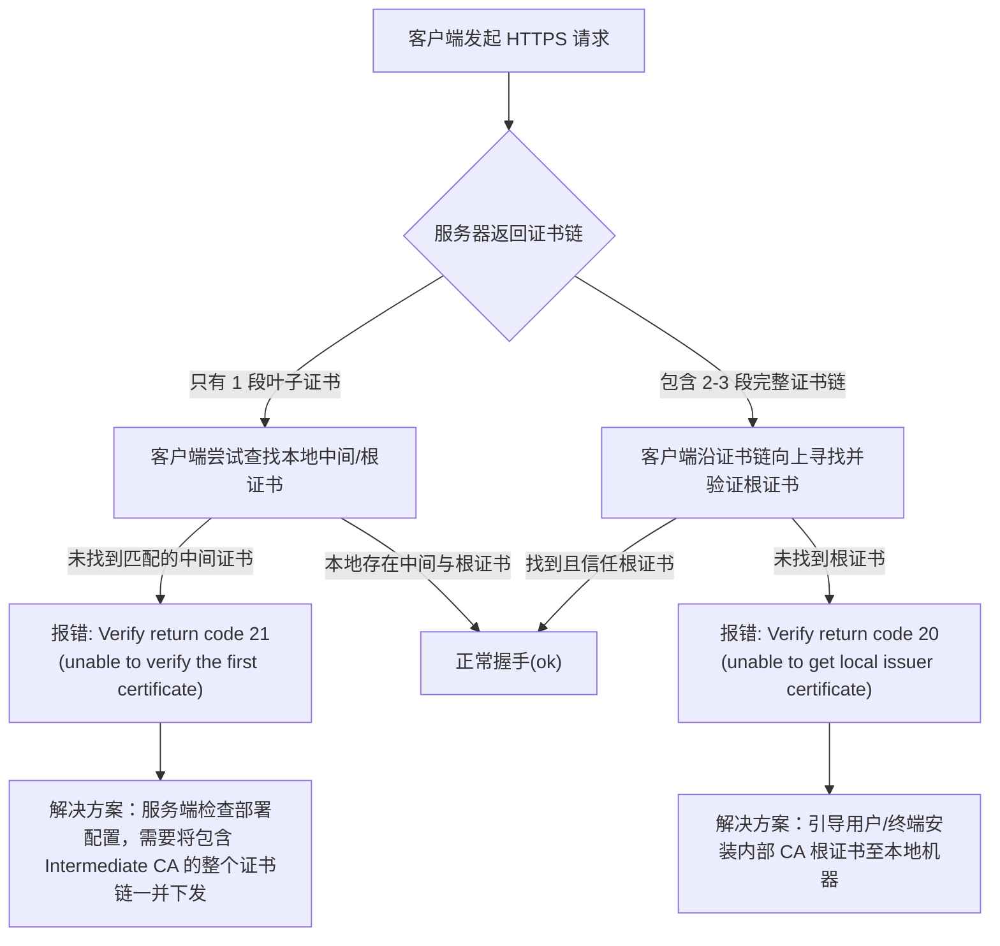

- the client the error
```bash
TransportFlush call failed: 18:HTTPTransportException: Cannot initialize a channel to the remote end.
Failed to establish SSL connection to server. The operation gsk_secure_soc_init() failed.
GSKit Error: 6000 - Certificate is not signed by a trusted certificate authority.
```

- curl my api 
- https://my-domain-fqdn.com/api/v1/heal    th

```bash
curl -v https://my-domain.com/api/v1/health
```

### 问题分析与用户沟通指南

#### 1. 现象分析
客户端报出的错误为 `GSKit Error: 6000 - Certificate is not signed by a trusted certificate authority.`。结合你在内部企业环境的背景，这通常意味着：
- 服务器出示的 SSL 证书是有效的，但是签发该证书的根证书机构（Root CA）或者中间证书机构（Intermediate CA）不受客户端信任。
- 因为这是企业内部的 API (例如 `my-domain-fqdn.com`)，证书大概率是由企业内部自建的私有 PKI 签发的，而不是公网受信任的机构（如 DigiCert、Let's Encrypt 等）。
- 客户端的系统/应用环境的 Trust Store 中缺少企业内部 CA 根证书，导致无法沿着“叶子证书 -> 中间证书 -> 根证书”这条链完成信任校验。

#### 2. 如何向用户/客户端开发解释
您可以复制以下话术向用户沟通：

> **“您在访问 `https://my-domain-fqdn.com/api/v1/health` 时遇到不受信任的报错，是因为该域名使用的是企业内部签发的 SSL 证书，而您的机器目前尚未信任公司内部相关的根证书（Root CA）。因此，客户端无法验证服务器证书的合法性，进而阻断了连接。
> 
> 解决方案：
> 请前往 IT 门户/内网获取最新的内部 CA 证书源文件（CA Bundle / Root CA），并导入到您系统的受信任根证书颁发机构库中（或在客户端代码中显式指定该 CA 文件）。导入更新后，即可安全、正常地发起请求。”**

#### 3. 证书链排查流程图



#### 4. 证书链的深度检测与验证脚本

虽然我们推理出是 CA 文件的问题，但为了保证服务端不背锅（即：服务端是否下发了完整的包含了 Intermediate 叶子和 Root 的证书链？），我们可以通过脚本 `verify-domain-ssl.sh` 进行深度探测。

我已经为您创建了一个叫作 `verify-domain-ssl.sh` 的验证脚本，位于此文件夹。它可以帮你验证：
1. 服务端下发了几个证书的链条（通常标准证书链包含 2~3 段：Leaf -> Intermediate -> Root，通常返回 Leaf + Intermediate）。
2. 解析并展示每个证书属于哪个机构（被颁发者 `Subject`，以及谁为其颁发的 `Issuer`）。
3. 返回 openssl 实时的连接及信任判断（如上述流程图出现的 Return code 20 / 21）。

注意事项
内部 CA 分发最佳实践：为了长远考虑，如果内部客户端较多，建议企业通过域控系统 (Active Directory / Jamf) 将内部 Root CA 统一下发到所有员工终机的 Keychain/受信任根证书区，避免单独遇到应用需手动下载安装。
证书链完整性构建：确保后端网关（如 Kong、Nginx 或 GLB）配置的 .crt 证书是由 Leaf + Intermediate 拼接合成的文件（通常按顺序 cat your_domain.crt intermediate.crt > fullchain.crt），这可以打消绝大部分“缺少中间证书”带来的偶发报错。

这样您在排查内部证书时，就可以：

先不带 CA 测一次 -> 查看是不是你的当前系统真缺证书导致返回 Return code: 20。
带上你找企业 IT 申请到的内部 CA 测试 -> 如果此时返回了 Return code: 0 (ok)，说明证书给的是对的。
最后，将测试通过的内部 CA 追加合并到 Ubuntu 的全局源中（通常是将证书放入 /usr/local/share/ca-certificates/ 然后执行 sudo update-ca-certificates），即可永久解决该机器的报错！

**脚本内容预览 (`verify-domain-ssl.sh`)：**

（已支持通过第 3 个参数手动传入指定的 CA 证书，以便脱离系统全局默认包、排查是否确为证书缺失导致）

```bash
#!/bin/bash

DOMAIN=$1
PORT=${2:-443}
CA_FILE=$3

if [ -z "$DOMAIN" ]; then
    echo "Usage: $0 <domain-fqdn> [port] [ca-file-path]"
    echo "Example (Ubuntu CA default): $0 my-domain-fqdn.com 443 /etc/ssl/certs/ca-certificates.crt"
    exit 1
fi

echo "=================================================="
echo "🔍 探测 SSL 证书链状态: $DOMAIN:$PORT"
if [ -n "$CA_FILE" ]; then
    if [ -f "$CA_FILE" ]; then
        echo "📁 使用指定的 CA 证书文件: $CA_FILE"
        CA_OPT="-CAfile $CA_FILE"
    else
        echo "❌ 错误: 指定的 CA 文件不存在或不可读 ($CA_FILE)"
        exit 1
    fi
else
    echo "📁 使用系统默认 CA 证书库"
    CA_OPT=""
fi
echo "=================================================="

echo "[1] 拉取服务器返回的证书..."
openssl s_client -connect "$DOMAIN":"$PORT" -servername "$DOMAIN" -showcerts </dev/null 2>/dev/null > "/tmp/ssl_probe_$$.txt"

CERT_COUNT=$(grep -c "BEGIN CERTIFICATE" "/tmp/ssl_probe_$$.txt")
echo ">> 服务器共返回了 $CERT_COUNT 段证书"

if [ "$CERT_COUNT" -eq 0 ]; then
    echo "❌ 错误: 未获取到任何证书，请检查域名和网络连通性。"
    rm -f "/tmp/ssl_probe_$$.txt"
    exit 1
elif [ "$CERT_COUNT" -eq 1 ]; then
    echo "⚠️ 警告: 仅捕获到 1 段证书。服务器缺少中间证书(Intermediate CA)，客户端可能无法自动建立信任链！"
else
    echo "✅ 正常: 捕获到多段证书，证书链似乎包含在内。"
fi

echo ""
echo "[2] 解析证书颁发关系 (Subject vs Issuer)..."
awk -v cmd="openssl x509 -noout -subject -issuer" '
    /BEGIN CERTIFICATE/{cert=""}
    {cert=cert $0 "\n"}
    /END CERTIFICATE/{
        printf "\n--- Certificate ---\n"
        print cert | cmd
        close(cmd)
    }
' "/tmp/ssl_probe_$$.txt"

echo ""
echo "[3] 环境的信任校验结果..."
openssl s_client -connect "$DOMAIN":"$PORT" -servername "$DOMAIN" $CA_OPT </dev/null 2>/dev/null | grep "Verify return code"

rm -f "/tmp/ssl_probe_$$.txt"

echo "=================================================="
echo "💡 排查指南:"
echo "- 证书数 == 1 且报错 '21 (unable to verify the first certificate)' -> 服务器自身配置缺陷，没有把中间证书捆绑返回。"
echo "- 证书数 >= 2 且报错 '20 (unable to get local issuer certificate)' -> 服务器链条完整，你正使用的 CA 证书库中缺失根证书(Root CA)。"
echo "- 状态显示 '0 (ok)' -> 证书链完好且所使用的 CA 库已正确信任根证书。"
echo "=================================================="
```

**如何使用脚本：**
你可以直接在本目录赋予权限并运行：
```bash
chmod +x verify-domain-ssl.sh

# 1. 使用系统默认 CA 测试
./verify-domain-ssl.sh my-domain-fqdn.com

# 2. 指定特定的 CA 证书测试（常用于验证获取到的企业级 CA 是否管用）
# 下载/拿到的内网 CA 文件为 /tmp/my-corp-root-ca.crt 时：
./verify-domain-ssl.sh my-domain-fqdn.com 443 /tmp/my-corp-root-ca.crt

# 附：在 Ubuntu 24.04 等 Debian 系系统中，系统默认加载的全局 CA Trust Store 路径为：
# /etc/ssl/certs/ca-certificates.crt
# 你可以直接用该文件作为对照组
./verify-domain-ssl.sh my-domain-fqdn.com 443 /etc/ssl/certs/ca-certificates.crt
```
