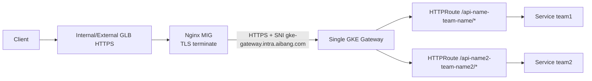

# 单一 GKE Gateway + Nginx 前置 TLS 终止实施方案（ssl-terminal-1-1）

## 1. Goal and Constraints

### 目标

- 对外 TLS 终止放在 Nginx（你现有模式）。
- Nginx 到 GKE Gateway 继续走 HTTPS（内网加密保留）。
- 长域名与短域名统一收敛到一个 Gateway：`gke-gateway.intra.aibang.com`。
- 后端减少 Gateway 数量与证书管理复杂度。

### 约束

- Nginx 统一上游 Host（`Host: www.aibang.com`）进行路由。
- 路由主维度从 Host 转为 Path（必要时加 Header 维度）。
- 生产环境要求可灰度、可回滚。

复杂度：`Moderate`

---

## 2. 结论（可否实施）

可以实施。

但“除了固定 Host 后可能出现重定向/CORS/Cookie 问题之外没有其他问题”这个判断不准确。还需要至少评估以下问题：

1. TLS/SNI 一致性：Nginx 到 Gateway 的 SNI 与证书校验名是否一致。
2. 路由冲突：多个 API 前缀是否唯一，是否存在前缀覆盖/误匹配。
3. URI 改写影响：`/api-name-team-name/` 前缀是否需要 strip/rewrite，避免后端 404。
4. 变更风险面：单 Gateway 发布错误会影响全部租户（blast radius 增大）。
5. 策略粒度：原先按 Host 的安全/限流/审计策略要改成 Path/Header 维度。
6. 观测模型：告警和报表不能只看 Host，需要补齐按 Path/Tenant 聚合。

---

## 3. Recommended Architecture (V1)



关键点：

- 证书：
  - 客户端 -> Nginx：短域名/长域名证书（你现有做法）。
  - Nginx -> Gateway：使用 Gateway 证书（短域名证书可行，但需与 SNI 校验名一致）。
- Header：
  - `Host` 可统一为 `www.aibang.com`。
  - 同时透传 `X-Forwarded-Host: $host` 保留原始域名上下文。

---

## 4. Implementation Steps

### Step 1: 统一 Nginx 上游配置（先在灰度实例）

参考配置（按你的目标模型，保留 HTTPS 到 Gateway）：

```nginx
# upstream 建议集中定义，便于回切
upstream gke_gateway_unified {
    server gke-gateway.intra.aibang.com:443;
    keepalive 128;
}

server {
    listen 443 ssl http2;
    server_name api-name-team-name.googleprojectid.aibang.com;

    ssl_certificate     /etc/pki/tls/certs/wildcard.cer;
    ssl_certificate_key /etc/pki/tls/private/wildcard.key;

    location / {
        # 前缀路由，按团队/API 唯一命名
        proxy_pass https://gke_gateway_unified/api-name-team-name/;

        # 统一 Host（你的目标）
        proxy_set_header Host www.aibang.com;

        # 保留原始上下文，降低兼容风险
        proxy_set_header X-Forwarded-Host  $host;
        proxy_set_header X-Forwarded-Proto https;
        proxy_set_header X-Forwarded-For   $proxy_add_x_forwarded_for;
        proxy_set_header X-Real-IP         $remote_addr;

        # Nginx -> Gateway TLS 校验（建议强制开启）
        proxy_ssl_server_name on;
        proxy_ssl_name gke-gateway.intra.aibang.com;
        proxy_ssl_verify on;
        proxy_ssl_trusted_certificate /etc/pki/tls/certs/ca-bundle.crt;

        proxy_connect_timeout 3s;
        proxy_send_timeout 60s;
        proxy_read_timeout 60s;
    }
}
```

说明：

- `proxy_ssl_name` 必须与 Gateway 证书 SAN/CN 对齐。
- 如果后端不接受前缀，需加 rewrite（见 Step 3）。

### Step 2: 建立单一 Gateway（或扩展现有短域名 Gateway）

> `gatewayClassName` 需按你实际环境替换（常见 internal class：`gke-l7-rilb`）。

```yaml
apiVersion: gateway.networking.k8s.io/v1
kind: Gateway
metadata:
  name: unified-internal-gw
  namespace: gateway-system
spec:
  gatewayClassName: gke-l7-rilb
  listeners:
  - name: https
    protocol: HTTPS
    port: 443
    hostname: www.aibang.com
    tls:
      mode: Terminate
      certificateRefs:
      - kind: Secret
        name: short-domain-tls
```

说明：

- 你已经在 Nginx 做了 TLS 终止；这里保留 HTTPS 是“内网二次加密”，不是必须但可行。
- 如果将来希望进一步简化，可评估 Nginx->Gateway 改 HTTP（仅在可信网络边界内）。

### Step 3: 为每个 API 增加 HTTPRoute（Path 路由）

```yaml
apiVersion: gateway.networking.k8s.io/v1
kind: HTTPRoute
metadata:
  name: route-api-name-team-name
  namespace: team-a
spec:
  parentRefs:
  - name: unified-internal-gw
    namespace: gateway-system
  hostnames:
  - "www.aibang.com"
  rules:
  - matches:
    - path:
        type: PathPrefix
        value: /api-name-team-name
    backendRefs:
    - name: api-name-team-name-svc
      port: 80
```

如后端不希望带前缀，可在 Nginx 增加：

```nginx
location / {
    rewrite ^/api-name-team-name/(.*)$ /$1 break;
    proxy_pass https://gke_gateway_unified/api-name-team-name/;
    ...
}
```

---

## 5. Validation and Rollback

### 验证项（必须）

1. TLS 链路验证

```bash
openssl s_client -connect gke-gateway.intra.aibang.com:443 -servername gke-gateway.intra.aibang.com -showcerts
```

2. 路由命中验证（从 Nginx 实例）

```bash
curl -vk https://gke-gateway.intra.aibang.com/api-name-team-name/health -H 'Host: www.aibang.com'
```

3. 应用兼容验证

- 登录态（Cookie Domain/SameSite）
- CORS（Origin/Allow-Credentials）
- 3xx 跳转 Location 是否正确
- OAuth 回调域名是否保留

4. 观测验证

- Nginx access log 包含：原始 Host、转发 Host、upstream status、route prefix。
- Gateway/后端日志可按 path 前缀拆分租户流量。

### 回滚策略

- 在 Nginx 保留旧上游块：
  - `gke-gateway-for-long-domain.intra.aibang.com`
- 回滚时仅切换 `proxy_pass` 目标并 reload Nginx。
- 路由灰度顺序：1 个 API -> 10% 域名流量 -> 全量。

---

## 6. Reliability and Cost Optimizations

1. 可靠性

- 单 Gateway 架构下，为关键 API 配置独立超时/重试策略，防止相互拖累。
- 对 Nginx MIG 和 Gateway 后端容量做“全量合并后”压测。
- 给核心服务补 PDB/HPA，避免发布期间容量抖动。

2. 成本

- 减少 Gateway 与证书数量，运维成本下降。
- 但统一网关后，单点故障影响范围变大，需要额外投入在变更保护与观测上。

---

## 7. Handoff Checklist

- [ ] 每个 API 前缀全局唯一并登记。
- [ ] Nginx 已启用 `proxy_ssl_verify on` 且证书链校验通过。
- [ ] 保留 `X-Forwarded-Host`，后端已验证兼容。
- [ ] HTTPRoute 已完成灰度和冲突检查。
- [ ] 回滚开关已演练（Nginx 一键切回旧 Gateway）。
- [ ] 告警从 Host 维度补齐到 Path/Tenant 维度。

---

## 8. 直接答复你当前问题

- 这个方案能实施吗？
  - 能实施。

- 你“除了 Host 兼容问题外基本没问题”的判断是否成立？
  - 不成立，至少还要处理 TLS/SNI、路由冲突、URI 改写、单网关发布风险与观测重构。

- 在你当前目标下的推荐做法是什么？
  - 维持 Nginx->Gateway HTTPS，统一单 Gateway，`Host` 固定为 `www.aibang.com`，同时透传 `X-Forwarded-Host`，按 PathPrefix 做路由并灰度迁移。
