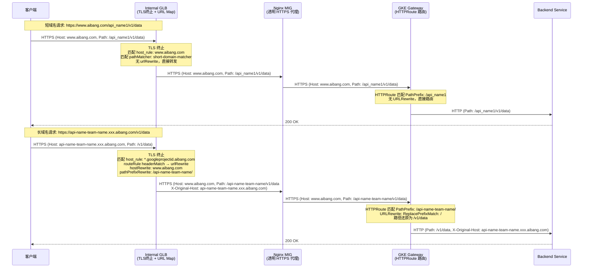

# PoC 操作手册：GLB URL Map 映射 + Nginx 透明代理 + GKE Gateway 路由

> **目标架构（方式 A）**：GLB URL Map 完成 Host 改写 + Path 前缀映射，Nginx 简化为透明 HTTPS 代理，GKE Gateway 负责 Path 路由 + 前缀剥离。
>
> **适用范围**：PoC 探索，全程使用 `gcloud` 命令，无 Terraform。

---

## 0. 环境变量与前提条件

### 0.1 设置全局变量（后续所有命令引用此处变量）

```bash
# ====== 基础环境 ======
export PROJECT_ID="your-gcp-project-id"
export REGION="asia-east1"              # 根据实际情况修改
export NETWORK="your-vpc-name"
export SUBNET="your-subnet-name"

# ====== 域名 ======
export SHORT_DOMAIN="www.aibang.com"
export LONG_DOMAIN_1="api-name-team-name.googleprojectid.aibang.com"
export LONG_DOMAIN_2="api-name2-team-name2.googleprojectid.aibang.com"

# ====== Nginx MIG（已存在）======
export NGINX_MIG_NAME="nginx-mig"
export NGINX_INSTANCE_GROUP="projects/${PROJECT_ID}/regions/${REGION}/instanceGroups/${NGINX_MIG_NAME}"

# ====== GKE Gateway 地址（已存在）======
export GKE_GATEWAY_FQDN="gke-gateway.intra.aibang.com"
export GKE_GATEWAY_PORT=443

# ====== 命名规划 ======
export HC_NAME="nginx-https-hc"
export BACKEND_NAME="nginx-backend-service"
export URL_MAP_NAME="unified-api-url-map"
export SSL_CERT_NAME="aibang-public-ssl-cert"
export TARGET_HTTPS_PROXY_NAME="unified-api-https-proxy"
export FORWARDING_RULE_NAME="unified-api-forwarding-rule"
export LB_IP_NAME="unified-api-lb-ip"
```

### 0.2 前提条件确认

```bash
# 确认 gcloud 已登录并设置项目
gcloud config set project ${PROJECT_ID}
gcloud config set compute/region ${REGION}

# 确认 Nginx MIG 存在
gcloud compute instance-groups managed list --region=${REGION} --filter="name=${NGINX_MIG_NAME}"

# 确认 Nginx MIG 的 Named Port 已包含 https:443
gcloud compute instance-groups managed describe ${NGINX_MIG_NAME} \
  --region=${REGION} \
  --format="yaml(namedPorts)"
```

**如果 Named Port 未配置，添加它：**

```bash
gcloud compute instance-groups managed set-named-ports ${NGINX_MIG_NAME} \
  --region=${REGION} \
  --named-ports=https:443
```

---

## 1. 第一步：创建 SSL 证书（GLB 公共证书）

> PoC 阶段可使用 Classic SSL 证书（手动上传），无需 Certificate Manager。

### 方式一：上传已有证书（推荐 PoC）

```bash
# 假设证书文件已在本地
# - public.crt  : 公共证书（含中间链）
# - private.key : 私钥

# 短域名证书
gcloud compute ssl-certificates create aibang-short-domain-cert \
  --certificate=./certs/short-domain.crt \
  --private-key=./certs/short-domain.key \
  --region=${REGION}

# 长域名泛域名证书
gcloud compute ssl-certificates create aibang-wildcard-cert \
  --certificate=./certs/wildcard.crt \
  --private-key=./certs/wildcard.key \
  --region=${REGION}

# 验证
gcloud compute ssl-certificates list --region=${REGION}
```

### 方式二：使用 Google 托管证书（需 DNS 验证，适合正式环境）

```bash
# 仅供参考，PoC 一般不用托管证书（DNS 验证较慢）
gcloud compute ssl-certificates create aibang-managed-cert \
  --domains="${SHORT_DOMAIN},${LONG_DOMAIN_1},${LONG_DOMAIN_2}" \
  --region=${REGION}
```

---

## 2. 第二步：创建 HTTPS Health Check

```bash
# 为 Nginx MIG 创建 HTTPS 健康检查（Nginx 已配置内部证书）
gcloud compute health-checks create https ${HC_NAME} \
  --region=${REGION} \
  --port=443 \
  --request-path="/healthz" \
  --check-interval=10s \
  --timeout=5s \
  --healthy-threshold=2 \
  --unhealthy-threshold=3

# 验证
gcloud compute health-checks describe ${HC_NAME} --region=${REGION}
```

> **注意**：如果 Nginx 没有 `/healthz` 路径，需要先在 Nginx 配置中添加（见第 5 步 Nginx 配置）。

---

## 3. 第三步：创建 Backend Service（指向 Nginx MIG）

```bash
# 创建 Backend Service，使用 HTTPS 协议（合规要求内部加密）
gcloud compute backend-services create ${BACKEND_NAME} \
  --region=${REGION} \
  --protocol=HTTPS \
  --port-name=https \
  --health-checks=${HC_NAME} \
  --health-checks-region=${REGION} \
  --load-balancing-scheme=INTERNAL_MANAGED \
  --connection-draining-timeout=30

# 将 Nginx MIG 添加为后端
gcloud compute backend-services add-backend ${BACKEND_NAME} \
  --region=${REGION} \
  --instance-group=${NGINX_MIG_NAME} \
  --instance-group-region=${REGION} \
  --balancing-mode=UTILIZATION \
  --max-utilization=0.8

# 验证
gcloud compute backend-services describe ${BACKEND_NAME} --region=${REGION}
```

---

## 4. 第四步：创建 URL Map（核心映射配置）

> **重要**：GLB URL Map 的高级路由（`routeRules` + `urlRewrite`）无法通过 gcloud 命令行参数直接设置，
> 必须使用 **YAML 文件 + `gcloud compute url-maps import`** 方式配置。

### 4.1 创建 URL Map 配置文件

```bash
cat > /tmp/unified-api-url-map.yaml << 'EOF'
kind: compute#urlMap
name: unified-api-url-map
description: "Unified API URL Map: GLB handles Host rewrite and Path prefix for long domains"

# 默认后端（未匹配任何规则时使用）
defaultService: projects/YOUR_PROJECT_ID/regions/YOUR_REGION/backendServices/nginx-backend-service

# ============================================================
# Host 规则：区分短域名和长域名
# ============================================================
hostRules:

# 短域名规则（直接路由，无需 urlRewrite）
- hosts:
  - "www.aibang.com"
  pathMatcher: short-domain-matcher

# 长域名泛域名规则（使用 urlRewrite 做 Host 和 Path 改写）
- hosts:
  - "*.googleprojectid.aibang.com"
  pathMatcher: long-domain-matcher

# ============================================================
# Path Matchers
# ============================================================
pathMatchers:

# ------ 短域名路由（原有逻辑，无需改写）------
- name: short-domain-matcher
  defaultService: projects/YOUR_PROJECT_ID/regions/YOUR_REGION/backendServices/nginx-backend-service
  routeRules:
  - priority: 1
    description: "短域名 api_name1 路由"
    matchRules:
    - prefixMatch: "/api_name1"
    routeAction:
      weightedBackendServices:
      - backendService: projects/YOUR_PROJECT_ID/regions/YOUR_REGION/backendServices/nginx-backend-service
        weight: 100

  - priority: 2
    description: "短域名 api_name2 路由"
    matchRules:
    - prefixMatch: "/api_name2"
    routeAction:
      weightedBackendServices:
      - backendService: projects/YOUR_PROJECT_ID/regions/YOUR_REGION/backendServices/nginx-backend-service
        weight: 100

# ------ 长域名路由（★ 核心：urlRewrite 做 Host 改写 + Path 前缀）------
- name: long-domain-matcher
  defaultService: projects/YOUR_PROJECT_ID/regions/YOUR_REGION/backendServices/nginx-backend-service
  routeRules:

  # 长域名 API 1：api-name-team-name
  - priority: 1
    description: "长域名 api-name-team-name 映射到短域名 Path 前缀"
    matchRules:
    - prefixMatch: "/"
      headerMatches:
      - headerName: "Host"
        exactMatch: "api-name-team-name.googleprojectid.aibang.com"
    routeAction:
      urlRewrite:
        hostRewrite: "www.aibang.com"             # ★ Host 改写为短域名
        pathPrefixRewrite: "/api-name-team-name/" # ★ 加路径前缀（替代 Nginx proxy_pass 路径）
      weightedBackendServices:
      - backendService: projects/YOUR_PROJECT_ID/regions/YOUR_REGION/backendServices/nginx-backend-service
        weight: 100
    # 透传原始域名信息（静态值，GLB 限制无法动态引用）
    headerAction:
      requestHeadersToAdd:
      - headerName: "X-Original-Host"
        headerValue: "api-name-team-name.googleprojectid.aibang.com"
        replace: false

  # 长域名 API 2：api-name2-team-name2
  - priority: 2
    description: "长域名 api-name2-team-name2 映射到短域名 Path 前缀"
    matchRules:
    - prefixMatch: "/"
      headerMatches:
      - headerName: "Host"
        exactMatch: "api-name2-team-name2.googleprojectid.aibang.com"
    routeAction:
      urlRewrite:
        hostRewrite: "www.aibang.com"
        pathPrefixRewrite: "/api-name2-team-name2/"
      weightedBackendServices:
      - backendService: projects/YOUR_PROJECT_ID/regions/YOUR_REGION/backendServices/nginx-backend-service
        weight: 100
    headerAction:
      requestHeadersToAdd:
      - headerName: "X-Original-Host"
        headerValue: "api-name2-team-name2.googleprojectid.aibang.com"
        replace: false

  # 其他长域名按同样模式继续添加（priority 递增）...
EOF
```

### 4.2 替换 YAML 中的变量

```bash
# 用实际 PROJECT_ID 和 REGION 替换 YAML 中的占位符
sed -i "s/YOUR_PROJECT_ID/${PROJECT_ID}/g" /tmp/unified-api-url-map.yaml
sed -i "s/YOUR_REGION/${REGION}/g" /tmp/unified-api-url-map.yaml

# 检查替换结果
cat /tmp/unified-api-url-map.yaml
```

### 4.3 导入 URL Map

```bash
# 创建 URL Map（首次）
gcloud compute url-maps import ${URL_MAP_NAME} \
  --source=/tmp/unified-api-url-map.yaml \
  --region=${REGION}

# 验证创建结果
gcloud compute url-maps describe ${URL_MAP_NAME} --region=${REGION}

# 验证规则是否正确（可以打印 JSON 格式便于阅读）
gcloud compute url-maps describe ${URL_MAP_NAME} \
  --region=${REGION} \
  --format=json | python3 -m json.tool
```

### 4.4 后续新增长域名（追加 routeRule）

```bash
# 当有新长域名需要加入时，导出当前 URL Map → 修改 → 重新导入
gcloud compute url-maps export ${URL_MAP_NAME} \
  --region=${REGION} \
  --destination=/tmp/unified-api-url-map-current.yaml

# 手动编辑 /tmp/unified-api-url-map-current.yaml，添加新的 routeRule，然后重新导入：
gcloud compute url-maps import ${URL_MAP_NAME} \
  --source=/tmp/unified-api-url-map-current.yaml \
  --region=${REGION}
```

---

## 5. 第五步：Nginx 配置（简化为透明 HTTPS 代理）

> 这是 Nginx 配置的**最终简化版本**：不再有 server_name 路由逻辑，只做透明 HTTPS 转发。

### 5.1 Nginx 配置文件

```bash
# 在 Nginx MIG 的实例模板中，将 /etc/nginx/conf.d/default.conf 替换为以下内容
# 或在 Nginx 实例上直接修改并 reload
```

**`/etc/nginx/conf.d/unified-proxy.conf` 内容：**

```nginx
# ============================================================
# 统一透明代理配置
# 说明：Host 改写和 Path 前缀已由上层 GLB URL Map 完成
#       Nginx 此处仅负责透明 HTTPS 转发到 GKE Gateway
# ============================================================

server {
    listen 443 ssl;
    server_name _;  # 接受所有域名（GLB 已完成路由决策）

    # 内部 CA 签发的证书（不再使用公共证书！）
    ssl_certificate     /etc/pki/tls/certs/internal.cer;
    ssl_certificate_key /etc/pki/tls/private/internal.key;

    # SSL 共享配置（加密套件等）
    include /etc/nginx/conf.d/pop/ssl_shared.conf;

    # 健康检查路径（供 GLB Health Check 使用）
    location /healthz {
        access_log off;
        return 200 "healthy\n";
        add_header Content-Type text/plain;
    }

    # 所有业务流量：透明转发到 GKE Gateway
    location / {
        # GKE Gateway 地址（内部 FQDN）
        proxy_pass https://gke-gateway.intra.aibang.com:443;

        # ★ 透传 GLB 已改写的 Host（www.aibang.com），不再自己改写
        proxy_set_header Host $http_host;

        # 透传客户端信息
        proxy_set_header X-Real-IP $remote_addr;
        proxy_set_header X-Forwarded-For $proxy_add_x_forwarded_for;

        # 透传 GLB 注入的协议标记（客户端使用 HTTPS）
        proxy_set_header X-Forwarded-Proto $http_x_forwarded_proto;

        # 透传 GLB 注入的原始域名（由 GLB headerAction 写入）
        proxy_set_header X-Original-Host $http_x_original_host;

        # ============================================================
        # 后端 SSL 配置（Nginx → GKE Gateway 的 HTTPS 连接）
        # 使用内部 CA 证书，合规要求内部链路加密
        # ============================================================
        proxy_ssl_certificate     /etc/pki/tls/certs/internal.cer;
        proxy_ssl_certificate_key /etc/pki/tls/private/internal.key;
        proxy_ssl_trusted_certificate /etc/pki/tls/certs/internal-ca.cer;
        proxy_ssl_verify       on;
        proxy_ssl_verify_depth 2;
        proxy_ssl_session_reuse on;

        # 超时配置
        proxy_connect_timeout 10s;
        proxy_read_timeout    60s;
        proxy_send_timeout    60s;

        # 缓冲配置
        proxy_buffering on;
        proxy_buffer_size 4k;
        proxy_buffers 8 4k;
    }
}

# HTTP → HTTPS 重定向（可选）
server {
    listen 80;
    server_name _;
    return 301 https://$host$request_uri;
}
```

### 5.2 轻量化验证：单机 Nginx 测试转发

```bash
# PoC 阶段可在单台 Nginx 实例上测试
# 1. 上传配置文件到 Nginx 实例
gcloud compute scp /tmp/unified-proxy.conf \
  nginx-instance-name:/etc/nginx/conf.d/unified-proxy.conf \
  --zone=YOUR_ZONE

# 2. 测试配置语法
gcloud compute ssh nginx-instance-name --zone=YOUR_ZONE \
  --command="sudo nginx -t"

# 3. 热重载 Nginx
gcloud compute ssh nginx-instance-name --zone=YOUR_ZONE \
  --command="sudo nginx -s reload"
```

---

## 6. 第六步：创建 Target HTTPS Proxy

```bash
# 创建 Target HTTPS Proxy，绑定 URL Map 和 SSL 证书
gcloud compute target-https-proxies create ${TARGET_HTTPS_PROXY_NAME} \
  --region=${REGION} \
  --url-map=${URL_MAP_NAME} \
  --url-map-region=${REGION} \
  --ssl-certificates=aibang-short-domain-cert,aibang-wildcard-cert \
  --ssl-certificates-region=${REGION}

# 验证
gcloud compute target-https-proxies describe ${TARGET_HTTPS_PROXY_NAME} --region=${REGION}
```

---

## 7. 第七步：创建 Forwarding Rule（LB 入口 IP）

```bash
# 创建内部 IP（Internal LB 入口）
gcloud compute addresses create ${LB_IP_NAME} \
  --region=${REGION} \
  --subnet=${SUBNET} \
  --purpose=SHARED_LOADBALANCER_VIP

# 获取分配的 IP 地址
export LB_IP=$(gcloud compute addresses describe ${LB_IP_NAME} \
  --region=${REGION} \
  --format="value(address)")
echo "LB IP: ${LB_IP}"

# 创建 Forwarding Rule（Internal HTTPS LB）
gcloud compute forwarding-rules create ${FORWARDING_RULE_NAME} \
  --region=${REGION} \
  --load-balancing-scheme=INTERNAL_MANAGED \
  --network=${NETWORK} \
  --subnet=${SUBNET} \
  --address=${LB_IP_NAME} \
  --ports=443 \
  --target-https-proxy=${TARGET_HTTPS_PROXY_NAME} \
  --target-https-proxy-region=${REGION}

# 验证
gcloud compute forwarding-rules describe ${FORWARDING_RULE_NAME} --region=${REGION}
```

---

## 8. 第八步：GKE Gateway + HTTPRoute 配置

> GKE Gateway 侧：负责按 Path 前缀路由到各个 Backend Service，并剥离 GLB 加的路径前缀。

### 8.1 GKE Gateway 对象（使用内部证书）

**文件：`/tmp/gke-gateway.yaml`**

```yaml
apiVersion: gateway.networking.k8s.io/v1
kind: Gateway
metadata:
  name: gke-gateway
  namespace: gateway-ns
  annotations:
    networking.gke.io/certmap: ""  # PoC 可以使用 TLS Secret 替代 certmap
spec:
  gatewayClassName: gke-l7-rilb      # Internal Regional Load Balancer
  listeners:
  - name: https-listener
    protocol: HTTPS
    port: 443
    tls:
      mode: Terminate
      certificateRefs:
      - kind: Secret
        name: gke-gateway-internal-tls
        namespace: gateway-ns
    allowedRoutes:
      namespaces:
        from: All
```

**创建内部证书 Secret：**

```bash
# 将内部 CA 签发的证书创建为 Kubernetes Secret
kubectl create secret tls gke-gateway-internal-tls \
  --cert=./certs/internal.cer \
  --key=./certs/internal.key \
  -n gateway-ns

# 部署 GKE Gateway
kubectl apply -f /tmp/gke-gateway.yaml

# 验证 Gateway 状态
kubectl get gateway gke-gateway -n gateway-ns
kubectl describe gateway gke-gateway -n gateway-ns
```

### 8.2 HTTPRoute（统一路由规则）

**文件：`/tmp/unified-httproute.yaml`**

```yaml
apiVersion: gateway.networking.k8s.io/v1
kind: HTTPRoute
metadata:
  name: unified-api-route
  namespace: gateway-ns
spec:
  parentRefs:
  - name: gke-gateway
    namespace: gateway-ns
  # ★ 所有请求到达时 Host 已被 GLB 改写为 www.aibang.com
  hostnames:
  - "www.aibang.com"
  rules:

  # ============================================================
  # 短域名路由（原有逻辑，无需 URLRewrite）
  # ============================================================
  - matches:
    - path:
        type: PathPrefix
        value: /api_name1
    backendRefs:
    - name: api-name1-service
      port: 8080

  - matches:
    - path:
        type: PathPrefix
        value: /api_name2
    backendRefs:
    - name: api-name2-service
      port: 8080

  # ============================================================
  # 长域名路由（GLB 已加 Path 前缀，这里剥离还原）
  # ============================================================

  # 长域名 API 1
  - matches:
    - path:
        type: PathPrefix
        value: /api-name-team-name/
    filters:
    - type: URLRewrite
      urlRewrite:
        path:
          type: ReplacePrefixMatch
          replacePrefixMatch: /    # ★ 剥离前缀：/api-name-team-name/v1/res → /v1/res
    backendRefs:
    - name: api-name-team-name-service
      port: 8080

  # 长域名 API 2
  - matches:
    - path:
        type: PathPrefix
        value: /api-name2-team-name2/
    filters:
    - type: URLRewrite
      urlRewrite:
        path:
          type: ReplacePrefixMatch
          replacePrefixMatch: /
    backendRefs:
    - name: api-name2-team-name2-service
      port: 8080
```

```bash
# 部署 HTTPRoute
kubectl apply -f /tmp/unified-httproute.yaml

# 验证 HTTPRoute 状态
kubectl get httproute unified-api-route -n gateway-ns
kubectl describe httproute unified-api-route -n gateway-ns
```

---

## 9. 验证与调试

### 9.1 请求流全链路验证

```bash
# ============================================================
# 场景 A：短域名请求验证
# ============================================================

# 在 VPC 内的测试机器上执行（需要内网访问）
curl -v -k \
  --resolve "www.aibang.com:443:${LB_IP}" \
  "https://www.aibang.com/api_name1/v1/test" \
  -H "Accept: application/json"

# 期望结果：
# - Host 头：www.aibang.com（未改变）
# - 请求路径：/api_name1/v1/test（未改变）
# - 后端收到路径：/api_name1/v1/test

# ============================================================
# 场景 B：长域名请求验证（★ 核心验证点）
# ============================================================

curl -v -k \
  --resolve "${LONG_DOMAIN_1}:443:${LB_IP}" \
  "https://${LONG_DOMAIN_1}/v1/test" \
  -H "Accept: application/json"

# 期望结果：
# - GLB 改写 Host 后：www.aibang.com
# - GLB 改写 Path 后：/api-name-team-name/v1/test
# - GKE Gateway URLRewrite 后：后端收到 /v1/test
# - 响应头中应有 X-Original-Host: api-name-team-name.googleprojectid.aibang.com
```

### 9.2 验证 URL Map 规则（不实际发送请求）

```bash
# 使用 gcloud 内置的 URL Map 测试工具验证路由规则
# 验证短域名路由
gcloud compute url-maps validate \
  --host="www.aibang.com" \
  --path="/api_name1/v1/test" \
  --url-map=${URL_MAP_NAME} \
  --region=${REGION}

# 验证长域名路由（★ 验证 urlRewrite 是否生效）
gcloud compute url-maps validate \
  --host="${LONG_DOMAIN_1}" \
  --path="/v1/test" \
  --url-map=${URL_MAP_NAME} \
  --region=${REGION}

# 期望输出中应包含：
# urlRewrite:
#   hostRewrite: www.aibang.com
#   pathPrefixRewrite: /api-name-team-name/
```

### 9.3 验证 Backend Service 健康状态

```bash
# 检查 Nginx MIG 后端健康状态
gcloud compute backend-services get-health ${BACKEND_NAME} \
  --region=${REGION}

# 期望所有实例状态为 HEALTHY
```

### 9.4 在 Nginx 实例上抓包验证

```bash
# SSH 到 Nginx 实例，查看 Nginx 日志确认收到的 Host 和 Path
gcloud compute ssh nginx-instance-name --zone=YOUR_ZONE

# 在实例上查看 Nginx 日志（需要在 nginx.conf 中配置 $host $request_uri 日志格式）
tail -f /var/log/nginx/access.log

# 期望长域名请求的日志条目：
# Host: www.aibang.com  Path: /api-name-team-name/v1/test  ← GLB 已改写
```

### 9.5 在 GKE 侧验证请求到达

```bash
# 查看 GKE HTTPRoute 的事件
kubectl get events -n gateway-ns --field-selector=reason=Synced

# 查看后端 Pod 日志确认收到的路径（应为剥离前缀后的 /v1/test）
kubectl logs -n your-namespace -l app=api-name-team-name --tail=20 -f
```

---

## 10. 常见问题排查

| 问题现象                   | 排查步骤                                    | 可能原因                                            |
| -------------------------- | ------------------------------------------- | --------------------------------------------------- |
| **长域名请求返回 404**     | `gcloud compute url-maps validate` 检查规则 | routeRule 优先级冲突或 prefixMatch 未匹配           |
| **长域名请求 Host 未改写** | 抓包检查 Nginx 收到的 Host 头               | URL Map 未正确导入或 urlRewrite 未生效              |
| **后端收到带前缀的路径**   | 检查 GKE HTTPRoute 的 URLRewrite filter     | `replacePrefixMatch: /` 未配置                      |
| **Backend 502**            | `backend-services get-health`               | Nginx HTTPS Health Check 失败（证书/路径问题）      |
| **Nginx 502 Bad Gateway**  | Nginx error.log                             | `proxy_ssl_verify` 失败，GKE Gateway 证书不在信任链 |
| **X-Original-Host 为空**   | 确认 routeRule 中有 headerAction            | GLB routeRule 未配置 headerAction                   |

### Nginx proxy_ssl 快速诊断

```bash
# 在 Nginx 实例上手动测试与 GKE Gateway 的 SSL 连接
openssl s_client \
  -connect ${GKE_GATEWAY_FQDN}:${GKE_GATEWAY_PORT} \
  -CAfile /etc/pki/tls/certs/internal-ca.cer \
  -cert /etc/pki/tls/certs/internal.cer \
  -key /etc/pki/tls/private/internal.key \
  -servername www.aibang.com

# 期望：Verify return code: 0 (ok)
```

---

## 11. 完整架构流图（最终状态）



---

## 12. PoC 清理命令

```bash
# 清理顺序：Forwarding Rule → Target Proxy → URL Map → Backend Service → Health Check → SSL Cert

gcloud compute forwarding-rules delete ${FORWARDING_RULE_NAME} --region=${REGION} -q
gcloud compute target-https-proxies delete ${TARGET_HTTPS_PROXY_NAME} --region=${REGION} -q
gcloud compute url-maps delete ${URL_MAP_NAME} --region=${REGION} -q
gcloud compute backend-services delete ${BACKEND_NAME} --region=${REGION} -q
gcloud compute health-checks delete ${HC_NAME} --region=${REGION} -q
gcloud compute ssl-certificates delete aibang-short-domain-cert --region=${REGION} -q
gcloud compute ssl-certificates delete aibang-wildcard-cert --region=${REGION} -q
gcloud compute addresses delete ${LB_IP_NAME} --region=${REGION} -q

# GKE 侧清理
kubectl delete httproute unified-api-route -n gateway-ns
kubectl delete gateway gke-gateway -n gateway-ns
kubectl delete secret gke-gateway-internal-tls -n gateway-ns
```
