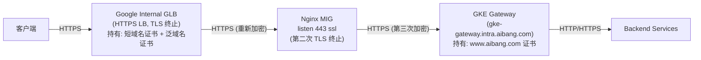
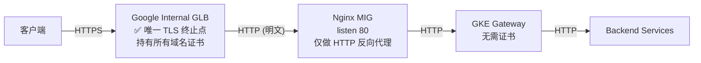
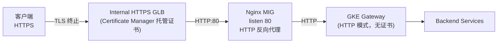
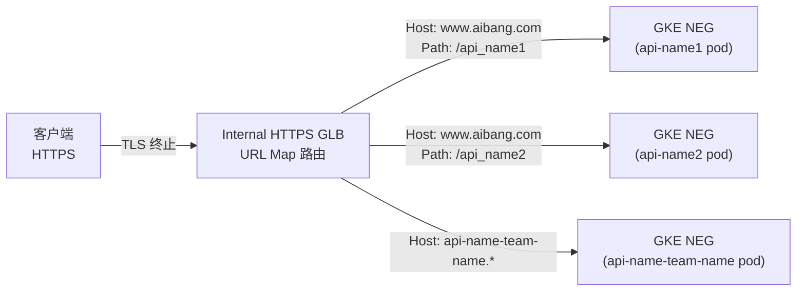
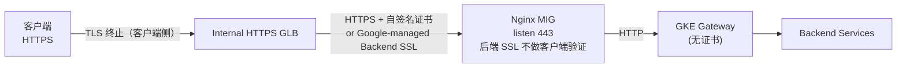
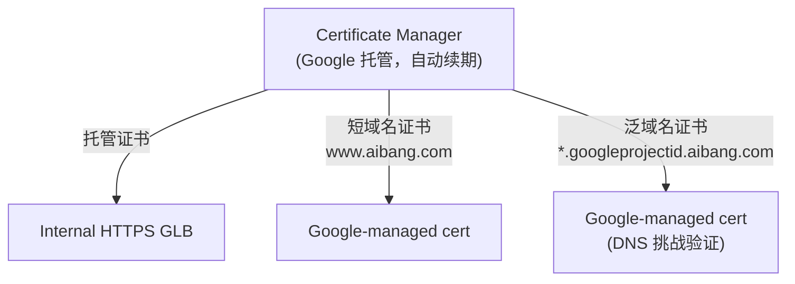
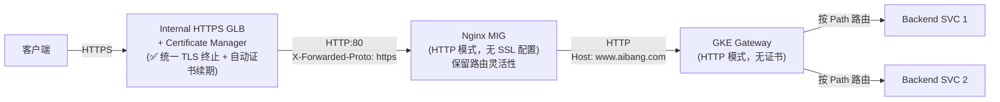
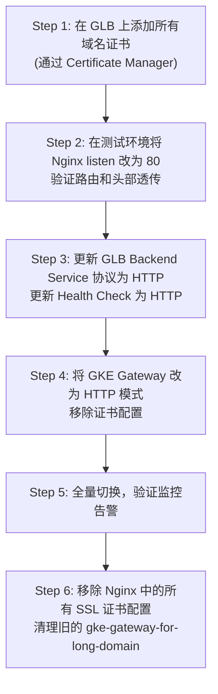
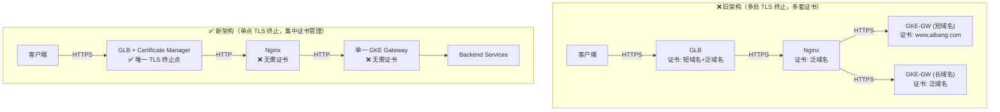

# TLS 终止前移至 GLB 层面的完整探索

> 在 `ssl-terminal-2.md` 基础上进一步演进：将 TLS 终止从 Nginx 层提前到 Google Internal Application Load Balancer（GLB）层，探索多种实现方式。

---

## 1. 现有链路回顾



**现状问题**：
- TLS 握手发生了 **多次**（Client→GLB, GLB→Nginx, Nginx→GKE Gateway）
- 证书需要在 **多个地方** 配置和维护（GLB、Nginx、GKE Gateway）
- 性能损耗：多次 TLS 握手增加了延迟

---

## 2. 目标架构：TLS 统一终止在 GLB



---

## 3. 可行性判断：**完全可以实现**

Google Internal Application Load Balancer（内部 HTTPS LB）原生支持：

| 能力                           | 支持情况                                     |
| ------------------------------ | -------------------------------------------- |
| TLS 终止（客户端侧）           | ✅ 原生支持                                   |
| 多域名证书（SNI）              | ✅ 支持，一个 GLB 可挂多个证书                |
| 泛域名证书                     | ✅ 支持（Certificate Manager 托管轮换）       |
| HTTP 转发到后端（不加密）      | ✅ 支持，Backend Service 配置 HTTP 协议       |
| URL Map（Host + Path 路由）    | ✅ 支持，可按 Host 和 Path 直接路由           |
| 直接对接 GKE NEG（跳过 Nginx） | ✅ 支持，通过 Container-native Load Balancing |

---

## 4. 多种实现方式探索

### 方式一：GLB 终止 TLS + Nginx 作 HTTP 反向代理（最小改动）

**架构图：**



**Nginx 配置变化（简化后）：**

```nginx
# 注意：不再需要 listen 443 ssl，改为 HTTP
server {
    listen 80;
    server_name api-name-team-name.googleprojectid.aibang.com
                www.aibang.com;

    # 不再需要 ssl_certificate / ssl_certificate_key 配置！

    location /api_name1 {
        proxy_pass http://gke-gateway.intra.aibang.com:80;   # 改为 HTTP
        proxy_set_header Host www.aibang.com;
        proxy_set_header X-Real-IP $remote_addr;
        proxy_set_header X-Forwarded-For $proxy_add_x_forwarded_for;
        proxy_set_header X-Forwarded-Proto https;  # 告知后端原始协议是 HTTPS
    }

    location / {
        proxy_pass http://gke-gateway.intra.aibang.com:80/api-name-team-name/;
        proxy_set_header Host www.aibang.com;
        proxy_set_header X-Real-IP $remote_addr;
        proxy_set_header X-Forwarded-For $proxy_add_x_forwarded_for;
        proxy_set_header X-Forwarded-Proto https;
        proxy_set_header X-Original-Host $host;
    }
}
```

**GLB Backend Service 配置：**

```yaml
# gcloud 示例：Backend Service 使用 HTTP 协议
gcloud compute backend-services create nginx-backend-service \
  --protocol=HTTP \
  --port-name=http \
  --health-checks=nginx-http-health-check \
  --global  # 或 --region=<region> 用于 Internal Regional LB
```

**优点**：
- 改动最小，保留 Nginx 的所有路由逻辑
- 证书完全交给 GLB 管理
- 整条链路内部全部 HTTP，性能最优

**缺点**：
- 内部流量明文传输（需评估安全合规要求）

---

### 方式二：GLB 终止 TLS + URL Map 直接路由到 GKE NEG（跳过 Nginx）

**架构图：**



**GLB URL Map 配置（Terraform 示例）：**

```hcl
resource "google_compute_url_map" "unified_url_map" {
  name = "unified-api-url-map"

  default_service = google_compute_backend_service.default.id

  host_rule {
    hosts        = ["www.aibang.com"]
    path_matcher = "short-domain-paths"
  }

  host_rule {
    hosts        = ["*.googleprojectid.aibang.com"]
    path_matcher = "long-domain-catch-all"
  }

  path_matcher {
    name            = "short-domain-paths"
    default_service = google_compute_backend_service.default.id

    path_rule {
      paths   = ["/api_name1", "/api_name1/*"]
      service = google_compute_backend_service.api_name1_neg.id
    }

    path_rule {
      paths   = ["/api_name2", "/api_name2/*"]
      service = google_compute_backend_service.api_name2_neg.id
    }
  }

  path_matcher {
    name            = "long-domain-catch-all"
    default_service = google_compute_backend_service.long_domain_neg.id
  }
}

# 注意：GLB URL Map 的 host_rule 不支持完整通配符匹配不同 host 到不同 backend
# 需要为每个长域名增加 host_rule（见注意事项）
```

> **⚠️ 重要限制**：GCP URL Map 的 `host_rule` 中的 `hosts` 字段仅支持 `*` 在最左侧作为通配符（如 `*.googleprojectid.aibang.com`），且通配符匹配会将所有长域名路由到同一个 `path_matcher`。若需要按不同长域名路由到不同 Backend，需要为每个长域名单独定义 `host_rule`。

**优点**：
- 完全消除 Nginx 中间层（大幅简化架构）
- 极致性能：GLB 直接对接 GKE Pod（Container-native LB）
- 流量可观测性直接在 GCP 层面

**缺点**：
- 失去 Nginx 提供的灵活路由能力（正则、Lua 脚本、限流等）
- 每个长域名需要配置一条 `host_rule`，数量多时管理复杂
- GKE Service 需要暴露为 NEG（需要开启 `cloud.google.com/neg` annotation）

**GKE Service 开启 NEG：**

```yaml
apiVersion: v1
kind: Service
metadata:
  name: api-name1-service
  annotations:
    cloud.google.com/neg: '{"ingress": true}'  # 启用 Container-native LB
spec:
  type: ClusterIP
  selector:
    app: api-name1
  ports:
  - port: 8080
    targetPort: 8080
```

---

### 方式三：GLB 终止 TLS + mTLS 到 Nginx（安全合规场景）

如果内部传输也要求加密（合规要求），可以：



**GLB Backend SSL 配置：**

```bash
# 创建 Backend Service 使用 HTTPS 协议
gcloud compute backend-services create nginx-backend-service \
  --protocol=HTTPS \
  --port-name=https \
  --health-checks=nginx-https-health-check \
  --region=<region>
```

> Nginx 仍然需要证书（但可以是自签名证书，GLB 不验证后端证书链，仅加密传输），这种模式仅保证传输加密，不减少证书数量，适用于合规要求内部流量也必须加密的场景。

---

### 方式四：GLB + Certificate Manager（最佳证书管理实践）

无论采用哪种方式，强烈建议将证书管理升级到 **Google Certificate Manager**：



**Certificate Manager 配置：**

```yaml
# 证书配置（托管证书，自动续期）
apiVersion: certificatemanager.cnrm.cloud.google.com/v1beta1
kind: CertificateManagerCertificate
metadata:
  name: aibang-wildcard-cert
spec:
  description: "Wildcard cert for *.googleprojectid.aibang.com"
  managed:
    domains:
      - "*.googleprojectid.aibang.com"
      - "www.aibang.com"
    dnsAuthorizations:
      - projects/YOUR_PROJECT/locations/global/dnsAuthorizations/aibang-dns-auth
---
# 证书映射（Certificate Map）绑定到 GLB
apiVersion: certificatemanager.cnrm.cloud.google.com/v1beta1
kind: CertificateManagerCertificateMap
metadata:
  name: aibang-cert-map
spec:
  description: "Certificate map for all API domains"
---
apiVersion: certificatemanager.cnrm.cloud.google.com/v1beta1
kind: CertificateManagerCertificateMapEntry
metadata:
  name: aibang-wildcard-entry
spec:
  certificateMapRef:
    name: aibang-cert-map
  certificates:
    - name: aibang-wildcard-cert
  hostname: "*.googleprojectid.aibang.com"
```

**优点**：
- 证书自动续期，不再需要人工干预
- 支持泛域名托管证书（SNI）
- 集中管理所有证书

---

## 5. 四种方式对比

| 维度                   | 方式一\n(GLB+Nginx HTTP) | 方式二\n(GLB 直通 NEG) | 方式三\n(GLB+Nginx HTTPS) | 方式四\n(+Certificate Manager) |
| ---------------------- | ------------------------ | ---------------------- | ------------------------- | ------------------------------ |
| **TLS 终止位置**       | GLB                      | GLB                    | GLB                       | GLB                            |
| **内部传输加密**       | ❌ 明文 HTTP              | ❌ 明文 HTTP            | ✅ HTTPS                   | 与其他方式叠加                 |
| **Nginx 仍需要**       | ✅ 需要（HTTP 模式）      | ❌ 不需要               | ✅ 需要（HTTPS 模式）      | 取决于其他方式                 |
| **GKE Gateway 仍需要** | ✅ 需要                   | ❌ 直连 NEG             | ✅ 需要                    | 取决于其他方式                 |
| **证书管理复杂度**     | 🟢 简单（仅 GLB）         | 🟢 简单（仅 GLB）       | 🟡 GLB + Nginx             | 🟢 最简单（CM托管）             |
| **架构改动量**         | 🟡 中（Nginx 改 HTTP）    | 🔴 大（需重构路由）     | 🟡 中（Nginx 改后端）      | 需叠加在其他方式上             |
| **路由灵活性**         | 🟢 高（Nginx 保留）       | 🟡 中（URL Map 限制）   | 🟢 高（Nginx 保留）        | 与其他方式相同                 |
| **适用场景**           | 快速落地，安全要求一般   | 追求极致简化           | 合规要求内部加密          | 推荐所有场景叠加               |

---

## 6. 关键注意事项

### 6.1 X-Forwarded-Proto 的重要性

GLB 终止 TLS 后，后端收到的是 HTTP 请求。若后端服务需要知道客户端原始使用的是 HTTPS，必须通过 `X-Forwarded-Proto` 头传递：

```nginx
# Nginx 转发时透传（GLB 会自动加此头，Nginx 只需透传）
proxy_set_header X-Forwarded-Proto $http_x_forwarded_proto;
# 或者强制声明
proxy_set_header X-Forwarded-Proto https;
```

> GCP GLB 默认会在请求中加入 `X-Forwarded-Proto: https`，Nginx 可直接透传给后端。

### 6.2 GLB URL Map 对通配符 Host 的限制

```
GLB host_rule hosts 字段：
✅ 支持：*.googleprojectid.aibang.com → 匹配所有长域名
❌ 不支持：将不同长域名路由到不同 Backend Service（需要为每个域名单独写 host_rule）
```

若长域名 API 数量多，**方式二（直通 NEG）** 的 URL Map 管理成本会线性增长。可以考虑：
- **配合 Nginx**（方式一）：在 Nginx 层做细粒度路由
- **Terraform/Pulumi 自动化**：通过 IaC 管理 URL Map 条目

### 6.3 Health Check 变化

由于 Nginx 从 HTTPS 变为 HTTP，需要同步更新 GLB 的 Health Check：

```bash
# 旧的 HTTPS Health Check → 新的 HTTP Health Check
gcloud compute health-checks create http nginx-http-health-check \
  --port=80 \
  --request-path=/health \
  --region=<region>
```

### 6.4 内部流量安全评估

| 场景                              | 建议                                           |
| --------------------------------- | ---------------------------------------------- |
| GCP VPC 内部通信                  | HTTP 通常可接受，VPC 内流量受 GCP 网络加密保护 |
| 跨 VPC 或 Shared VPC              | 建议使用 HTTPS（方式三）或 mTLS                |
| 合规要求（如 PCI-DSS、ISO 27001） | 必须使用 HTTPS（方式三）或引入 Istio/ASM mTLS  |

---

## 7. 推荐落地方案

根据您的场景（内部 GLB，已有 Nginx MIG，GKE Gateway 统一处理），推荐：

### 🏆 推荐：方式一 + 方式四（叠加使用）



**迁移步骤：**



---

## 8. 最终架构对比



---

## 9. 总结

| 问题                           | 结论                                                                              |
| ------------------------------ | --------------------------------------------------------------------------------- |
| **能否实现 GLB 层 TLS 终止？** | ✅ 完全支持，GCP Internal HTTPS LB 原生能力                                        |
| **Nginx 是否还需要？**         | 推荐保留（HTTP 模式），提供灵活路由；若路由简单可考虑方式二直通 NEG               |
| **GKE Gateway 是否还需要？**   | 保留（HTTP 模式），仍负责 Path 路由到具体 Backend Service                         |
| **最大收益**                   | 统一证书管理（Certificate Manager 托管续期）+ 消除多层 TLS 握手开销               |
| **最需要注意**                 | `X-Forwarded-Proto` 透传、Health Check 协议从 HTTPS 改 HTTP、内部流量明文安全评估 |
