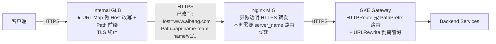
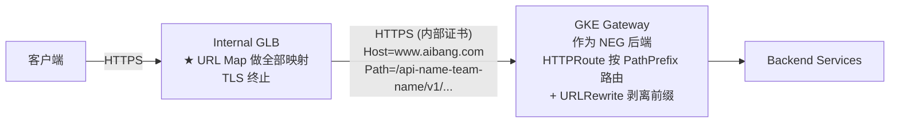
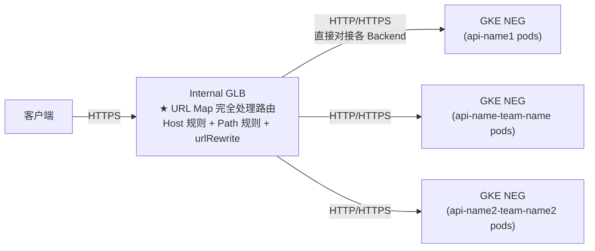
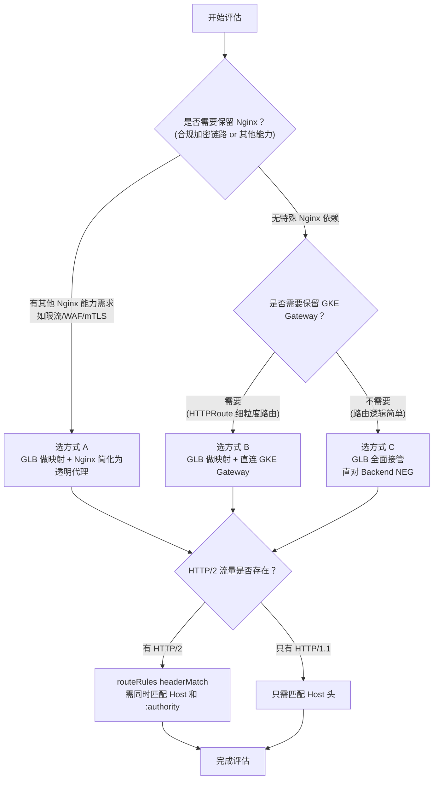
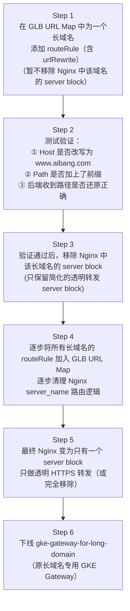

# GLB 原生处理映射关系：真正将逻辑从 Nginx 移走

> **两个核心问题的解答文档**
>
> Q1：`glb-terminal-https.md` 和 `ssl-terminal-2.md` 本质一样，核心映射逻辑必须在 Nginx 上吗？
>
> Q2：能否直接在 GLB 上完成 Host 改写 + Path 前缀映射，完全不依赖 Nginx 做这件事？

---

## 第一个问题的回答：是的，之前方案核心映射仍在 Nginx

### 为什么两份文档本质相同？

对比两份文档的核心映射层：

```
ssl-terminal-2.md（Nginx 做 TLS 终止）：
  Client → GLB → Nginx [★ 做 Host 改写 + Path 前缀] → GKE Gateway → Backend

glb-terminal-https.md（GLB 做外部 TLS 终止）：
  Client → GLB (TLS终止) → Nginx [★ 仍然做 Host 改写 + Path 前缀] → GKE Gateway → Backend
```

**两者的差异只是 TLS 终止位置不同，但 Host 改写和 Path 前缀映射的核心逻辑始终保留在 Nginx。**

GLB 在之前方案中只负责：
- ✅ 终止客户端 TLS
- ✅ 按后端服务转发流量

GLB 之前**没有**做：
- ❌ Host 头从长域名改写为 `www.aibang.com`
- ❌ Path 从 `/v1/resource` 改写为 `/api-name-team-name/v1/resource`

这就是用户观察到的"本质没区别"的根因。

---
GLB 完全可以原生做映射，靠这两个字段


| GLB URL Map 字段                                     | 等价的 Nginx 配置                             |
| ---------------------------------------------------- | --------------------------------------------- |
| urlRewrite.hostRewrite: "www.aibang.com"             | proxy_set_header Host www.aibang.com          |
| urlRewrite.pathPrefixRewrite: "/api-name-team-name/" | proxy_pass https://gw:443/api-name-team-name/ |

关键限制只有一个需要注意
GLB 的 headerAction.requestHeadersToAdd 中 headerValue 只支持静态字符串（不像 Nginx 有 $host 变量），所以 X-Original-Host 必须在每条 routeRule 里硬编码域名值。这是 GLB 相比 Nginx 的唯一功能差异，但不影响整体可行性。

## 第二个问题的回答：✅ GLB 可以原生完成映射，可以不依赖 Nginx 做这件事

### 关键技术：GCP URL Map 的高级路由能力

GCP Internal Application Load Balancer 的 URL Map 支持：

| 能力                 | API 字段                                            | 说明                                                                 |
| -------------------- | --------------------------------------------------- | -------------------------------------------------------------------- |
| **Host 改写**        | `urlRewrite.hostRewrite`                            | 将原始 Host 改写为指定值再转发给后端                                 |
| **Path 前缀改写**    | `urlRewrite.pathPrefixRewrite`                      | 将匹配的路径前缀替换为指定值（等效于 Nginx 的 proxy_pass path 前缀） |
| **Header 匹配路由**  | `routeRules[].matchRules[].headerMatches`           | 按请求 Header（含 Host）匹配，执行不同 routeAction                   |
| **泛域名 Host 规则** | `host_rule.hosts: ["*.googleprojectid.aibang.com"]` | 匹配所有长域名                                                       |

**这意味着：之前在 Nginx 里做的事，完全可以让 GLB URL Map 来做。**

---

## 架构演进：三种 GLB 原生处理方式

### 方式 A：GLB URL Map 处理映射 + 保留 Nginx（职责分离，最稳妥）



**Nginx 配置大幅简化（不再需要 server_name 区分长短域名）：**

```nginx
# 只需一个 server block，做透明 HTTPS 转发
server {
    listen 443 ssl;
    server_name _;  # 接受所有域名（GLB 已处理路由）

    ssl_certificate     /etc/pki/tls/certs/internal.cer;
    ssl_certificate_key /etc/pki/tls/private/internal.key;

    location / {
        # 直接透明转发，不再需要改写 Host 或 Path（GLB 已做）
        proxy_pass https://gke-gateway.intra.aibang.com:443;
        # Host 和 Path 已被 GLB URL Map 改写，Nginx 原样透传
        proxy_set_header Host $http_host;  # 透传 GLB 改写后的 Host
        proxy_set_header X-Real-IP $remote_addr;
        proxy_set_header X-Forwarded-For $proxy_add_x_forwarded_for;
        proxy_set_header X-Forwarded-Proto $http_x_forwarded_proto;

        proxy_ssl_certificate     /etc/pki/tls/certs/internal.cer;
        proxy_ssl_certificate_key /etc/pki/tls/private/internal.key;
        proxy_ssl_trusted_certificate /etc/pki/tls/certs/internal-ca.cer;
        proxy_ssl_verify on;
        proxy_ssl_session_reuse on;
    }
}
```

> Nginx 从"路由决策者"变成"透明加密代理"，极大简化配置维护成本。

---

### 方式 B：GLB URL Map 处理映射 → 直接对接 GKE Gateway（跳过 Nginx）



- Nginx **完全移除**
- GLB 直接对接 GKE Gateway（通过 NEG 或 Internal LB 地址）
- 参见 方式 B 配置章节

---

### 方式 C：GLB URL Map 全面接管（跳过 Nginx + GKE Gateway）



- Nginx 和 GKE Gateway **全部移除**
- GLB URL Map 直接路由到各 Backend Pod（Container-native LB via NEG）
- 最激进，架构最简，但运维复杂度转移到 URL Map 管理

---

## GLB URL Map 核心配置

### 配置方案一：每个长域名独立 host_rule（直观，适合域名数量少）

```yaml
# url-map.yaml（Terraform resource: google_compute_url_map）
kind: compute#urlMap
name: unified-api-urlmap

# =========== 短域名规则（原有逻辑不变）===========
hostRules:
- hosts:
  - "www.aibang.com"
  pathMatcher: short-domain-matcher

pathMatchers:
- name: short-domain-matcher
  defaultService: default-backend-service
  pathRules:
  - paths: ["/api_name1", "/api_name1/*"]
    service: api-name1-backend-service
    # 无需 urlRewrite：Host 和 Path 均不变
  - paths: ["/api_name2", "/api_name2/*"]
    service: api-name2-backend-service

# =========== 长域名规则（★ 关键：urlRewrite 做映射）===========
hostRules:
- hosts:
  - "api-name-team-name.googleprojectid.aibang.com"
  pathMatcher: api-name-team-name-matcher

- hosts:
  - "api-name2-team-name2.googleprojectid.aibang.com"
  pathMatcher: api-name2-team-name2-matcher

pathMatchers:
- name: api-name-team-name-matcher
  defaultService: gke-gateway-backend-service  # 所有未匹配路径的默认后端
  routeRules:
  - priority: 1
    matchRules:
    - prefixMatch: "/"        # 匹配所有路径
    routeAction:
      urlRewrite:
        hostRewrite: "www.aibang.com"           # ★ Host 改写（替代 Nginx proxy_set_header Host）
        pathPrefixRewrite: "/api-name-team-name/" # ★ Path 前缀（替代 Nginx proxy_pass /path/）
      weightedBackendServices:
      - backendService: gke-gateway-backend-service
        weight: 100

- name: api-name2-team-name2-matcher
  defaultService: gke-gateway-backend-service
  routeRules:
  - priority: 1
    matchRules:
    - prefixMatch: "/"
    routeAction:
      urlRewrite:
        hostRewrite: "www.aibang.com"
        pathPrefixRewrite: "/api-name2-team-name2/"
      weightedBackendServices:
      - backendService: gke-gateway-backend-service
        weight: 100
```

**`pathPrefixRewrite` 行为说明：**

```
请求:   GET https://api-name-team-name.googleprojectid.aibang.com/v1/resource
匹配:   prefixMatch: "/"
改写:   pathPrefixRewrite: "/api-name-team-name/"
结果:   Host: www.aibang.com
        Path: /api-name-team-name/v1/resource

→ GKE Gateway 收到的 Path 和 ssl-terminal-2.md 中 Nginx 改写后完全一致！
```

---

### 配置方案二：泛域名 host_rule + routeRules Header 匹配（推荐，适合长域名数量多）

```yaml
# 用泛域名匹配所有长域名，在 routeRules 中通过 Header 区分不同域名
hostRules:
- hosts:
  - "*.googleprojectid.aibang.com"     # 泛域名匹配所有长域名
  pathMatcher: long-domain-wildcard-matcher

pathMatchers:
- name: long-domain-wildcard-matcher
  defaultService: gke-gateway-backend-service
  routeRules:
  # 按优先级排列，先匹配更具体的
  - priority: 1
    matchRules:
    - headerMatches:
      - headerName: "Host"              # 匹配 Host 头（HTTP/1.1）
        exactMatch: "api-name-team-name.googleprojectid.aibang.com"
      prefixMatch: "/"
    routeAction:
      urlRewrite:
        hostRewrite: "www.aibang.com"
        pathPrefixRewrite: "/api-name-team-name/"
      weightedBackendServices:
      - backendService: gke-gateway-backend-service
        weight: 100

  - priority: 2
    matchRules:
    - headerMatches:
      - headerName: "Host"
        exactMatch: "api-name2-team-name2.googleprojectid.aibang.com"
      prefixMatch: "/"
    routeAction:
      urlRewrite:
        hostRewrite: "www.aibang.com"
        pathPrefixRewrite: "/api-name2-team-name2/"
      weightedBackendServices:
      - backendService: gke-gateway-backend-service
        weight: 100

  # 其他长域名继续按此模式增加 routeRule ...
```

> **方案一 vs 方案二 对比：**
>
> | 对比维度 | 方案一（独立 host_rule）| 方案二（泛域名 + headerMatch）|
> |----------|------------------------|-------------------------------|
> | 配置文件结构 | 每新增域名加一个 host_rule + path_matcher | 每新增域名只加一条 routeRule |
> | 可维护性 | 域名多时配置冗长 | 集中管理，更简洁 |
> | GCP URL Map 最大限制 | host_rule 上限 100 个 | routeRules 上限 200 个 |
> | 适用场景 | 长域名 ≤ 20 个 | 长域名较多（推荐）|

---

### Terraform 完整示例（推荐方式 B：GLB 直接对接 GKE Gateway）

```hcl
# 1. Certificate Manager（公共证书，自动续期）
resource "google_certificate_manager_certificate" "public_certs" {
  name     = "aibang-public-certs"
  location = var.region
  managed {
    domains = [
      "www.aibang.com",
      "*.googleprojectid.aibang.com"
    ]
    dns_authorizations = [google_certificate_manager_dns_authorization.aibang.id]
  }
}

# 2. URL Map（核心映射逻辑）
resource "google_compute_region_url_map" "unified_url_map" {
  name   = "unified-api-url-map"
  region = var.region

  default_service = google_compute_region_backend_service.gke_gateway.id

  # 短域名规则
  host_rule {
    hosts        = ["www.aibang.com"]
    path_matcher = "short-domain-matcher"
  }

  # 长域名泛域名规则（★ 核心：urlRewrite 完成 Nginx 的工作）
  host_rule {
    hosts        = ["*.googleprojectid.aibang.com"]
    path_matcher = "long-domain-matcher"
  }

  path_matcher {
    name            = "short-domain-matcher"
    default_service = google_compute_region_backend_service.gke_gateway.id

    route_rules {
      priority = 1
      match_rules {
        prefix_match = "/api_name1"
      }
      route_action {
        # 短域名不需要 urlRewrite，直接路由
        weighted_backend_services {
          backend_service = google_compute_region_backend_service.api_name1.id
          weight          = 100
        }
      }
    }

    route_rules {
      priority = 2
      match_rules {
        prefix_match = "/api_name2"
      }
      route_action {
        weighted_backend_services {
          backend_service = google_compute_region_backend_service.api_name2.id
          weight          = 100
        }
      }
    }
  }

  path_matcher {
    name            = "long-domain-matcher"
    default_service = google_compute_region_backend_service.gke_gateway.id

    # 长域名 API 1
    route_rules {
      priority = 1
      match_rules {
        header_matches {
          header_name  = "Host"
          exact_match  = "api-name-team-name.googleprojectid.aibang.com"
        }
        prefix_match = "/"
      }
      route_action {
        url_rewrite {
          host_rewrite        = "www.aibang.com"           # ★ Host 改写
          path_prefix_rewrite = "/api-name-team-name/"    # ★ Path 前缀
        }
        weighted_backend_services {
          backend_service = google_compute_region_backend_service.gke_gateway.id
          weight          = 100
        }
      }
    }

    # 长域名 API 2
    route_rules {
      priority = 2
      match_rules {
        header_matches {
          header_name = "Host"
          exact_match = "api-name2-team-name2.googleprojectid.aibang.com"
        }
        prefix_match = "/"
      }
      route_action {
        url_rewrite {
          host_rewrite        = "www.aibang.com"
          path_prefix_rewrite = "/api-name2-team-name2/"
        }
        weighted_backend_services {
          backend_service = google_compute_region_backend_service.gke_gateway.id
          weight          = 100
        }
      }
    }
  }
}

# 3. Backend Service（指向 GKE Gateway）
resource "google_compute_region_backend_service" "gke_gateway" {
  name                  = "gke-gateway-backend"
  region                = var.region
  protocol              = "HTTPS"       # 合规：内部 HTTPS
  port_name             = "https"
  load_balancing_scheme = "INTERNAL_MANAGED"

  backend {
    group           = google_compute_instance_group.gke_gateway_neg.id
    balancing_mode  = "UTILIZATION"
  }

  health_checks = [google_compute_region_health_check.gke_gateway_https.id]
}

# 4. HTTPS Health Check
resource "google_compute_region_health_check" "gke_gateway_https" {
  name   = "gke-gateway-https-hc"
  region = var.region

  https_health_check {
    port         = 443
    request_path = "/healthz"
  }
}
```

---

## GKE Gateway 侧配置（不变，仍负责 Path 路由 + URLRewrite 剥离前缀）

```yaml
apiVersion: gateway.networking.k8s.io/v1
kind: HTTPRoute
metadata:
  name: unified-route
  namespace: gateway-ns
spec:
  parentRefs:
  - name: gke-gateway
    namespace: gateway-ns
  hostnames:
  - "www.aibang.com"   # GLB 已将所有请求的 Host 改写为此值
  rules:
  # 短域名路由（不变）
  - matches:
    - path:
        type: PathPrefix
        value: /api_name1
    backendRefs:
    - name: api-name1-service
      port: 8080

  - matches:
    - path:
        type: PathPrefix
        value: /api_name2
    backendRefs:
    - name: api-name2-service
      port: 8080

  # 长域名路由（GLB 加的前缀在这里剥离）
  - matches:
    - path:
        type: PathPrefix
        value: /api-name-team-name/
    filters:
    - type: URLRewrite
      urlRewrite:
        path:
          type: ReplacePrefixMatch
          replacePrefixMatch: /   # 剥离前缀，还原为原始路径
    backendRefs:
    - name: api-name-team-name-service
      port: 8080

  - matches:
    - path:
        type: PathPrefix
        value: /api-name2-team-name2/
    filters:
    - type: URLRewrite
      urlRewrite:
        path:
          type: ReplacePrefixMatch
          replacePrefixMatch: /
    backendRefs:
    - name: api-name2-team-name2-service
      port: 8080
```

---

## 三种方式的核心对比

| 维度                     | 方式 A\n(GLB映射+保留Nginx)       | 方式 B\n(GLB映射+跳过Nginx) | 方式 C\n(GLB全面接管)         |
| ------------------------ | --------------------------------- | --------------------------- | ----------------------------- |
| **映射逻辑在哪**         | GLB URL Map                       | GLB URL Map                 | GLB URL Map                   |
| **Nginx 是否保留**       | ✅ 保留（简化为透明代理）          | ❌ 移除                      | ❌ 移除                        |
| **GKE Gateway 是否保留** | ✅ 保留（Path 路由）               | ✅ 保留（Path 路由）         | ❌ 移除                        |
| **架构改动量**           | 🟡 中（Nginx 简化）                | 🔴 大（移除 Nginx）          | 🔴 极大                        |
| **Nginx 的剩余价值**     | 合规 HTTPS 加密传输               | 无                          | 无                            |
| **GLB URL Map 复杂度**   | 🟡 中等                            | 🟡 中等                      | 🔴 高                          |
| **最适合场景**           | 有合规要求且有其他 Nginx 能力需求 | 追求简化，无特殊 Nginx 依赖 | 极致简化，强依赖 GCP 原生能力 |

---

## 重要限制与注意事项

### ⚠️ GLB URL Map 的已知限制

| 限制项                                                          | 说明                                    | 应对方案                                                            |
| --------------------------------------------------------------- | --------------------------------------- | ------------------------------------------------------------------- |
| **`pathPrefixRewrite` 不支持正则**                              | 只能替换前缀，不支持正则变换            | 通过前缀规则完全覆盖（已足够）                                      |
| **`host_rule.hosts` 通配符只支持最左侧 `*`**                    | 如 `*.googleprojectid.aibang.com`       | 用方案二（routeRules + headerMatch）解决                            |
| **`routeRules` 数量上限 200 条**                                | 每个 path_matcher 最多 200 条 routeRule | 超出时拆分多个 path_matcher                                         |
| **`headerMatches` 匹配 `Host` 头在 HTTP/2 下需用 `:authority`** | HTTP/2 伪头名称不同                     | 同时配置两条 matchRule 覆盖 HTTP/1.1 和 HTTP/2                      |
| **GLB 不保留原始 Host 给后端（改写后）**                        | `hostRewrite` 会覆盖整个 Host 头        | 在 GLB 的 `headerAction.requestHeadersToAdd` 中加 `X-Original-Host` |

### ⚠️ 补充：GLB 如何透传原始 Host（重要！）

```yaml
# 在 routeRule 的 headerAction 中添加
routeRules:
- priority: 1
  matchRules:
  - headerMatches:
    - headerName: "Host"
      exactMatch: "api-name-team-name.googleprojectid.aibang.com"
  routeAction:
    urlRewrite:
      hostRewrite: "www.aibang.com"
      pathPrefixRewrite: "/api-name-team-name/"
    weightedBackendServices:
    - backendService: gke-gateway-backend-service
      weight: 100
  # ★ 关键：GLB 改写 Host 前先保存原始 Host 到 X-Original-Host
  headerAction:
    requestHeadersToAdd:
    - headerName: "X-Original-Host"
      headerValue: "api-name-team-name.googleprojectid.aibang.com"
      # 注意：此处写死域名值，无法动态引用原始 Host 变量
      # 这是 GLB URL Map 的一个限制，与 Nginx 的 $host 变量有区别
      replace: false
```

> **⚠️ GLB 的重要限制**：GLB URL Map 的 `headerAction.requestHeadersToAdd` 中的 `headerValue` 只能写**静态字符串**，不支持类似 Nginx `$host` 的变量引用。这意味着：
> - 使用**方案一（routeRules headerMatch）**时：每条 routeRule 需要硬编码对应的域名值
> - 使用**方案二（独立 host_rule）**时：同样需要为每个 path_matcher 单独配置
>
> 这是 GLB URL Map 相比 Nginx 的一个功能差异，但并不影响功能实现。

---

## 需要评估的清单



| 评估项                               | 优先级 | 说明                                                              |
| ------------------------------------ | ------ | ----------------------------------------------------------------- |
| **确认是否需要 Nginx 其他能力**      | 🔴 必须 | 限流、WAF、mTLS、自定义 Lua 等在 GLB 上不可用                     |
| **确认 routeRules headerMatch 支持** | 🔴 必须 | 确认使用的 GCP 区域和 LB 类型支持高级路由                         |
| **X-Original-Host 静态值写死**       | 🔴 必须 | 每条 routeRule 的 headerAction 需硬编码域名，无法动态引用         |
| **HTTP/2 :authority 头兼容**         | 🟡 重要 | 若后端支持 HTTP/2，需同时配置 `:authority` 的 headerMatch         |
| **pathPrefixRewrite 路径测试**       | 🔴 必须 | 在测试环境验证 `/v1/resource` → `/api-name-team-name/v1/resource` |
| **routeRules 优先级规划**            | 🟡 重要 | 多条 routeRule 需正确设置 priority，避免规则冲突                  |
| **GLB Backend Service 健康检查**     | 🔴 必须 | HTTPS 健康检查配置正确，避免后端被标记 Unhealthy                  |
| **IaC 模板化（长域名 routeRule）**   | 🟢 建议 | 用 Terraform for_each 生成 routeRules，避免手工维护               |

---

## 迁移步骤（推荐方式 A 稳步过渡）



---

## 总结

| 问题                                   | 结论                                                                                            |
| -------------------------------------- | ----------------------------------------------------------------------------------------------- |
| **Q1：之前方案核心映射必须在 Nginx？** | ✅ 是的，`ssl-terminal-2.md` 和 `glb-terminal-https.md` 都把 Host 改写和 Path 前缀映射放在 Nginx |
| **Q2：GLB 能否原生做映射？**           | ✅ 完全可以，使用 URL Map 的 `urlRewrite.hostRewrite` + `urlRewrite.pathPrefixRewrite`           |
| **推荐方案**                           | 方式 A（GLB 做映射 + Nginx 简化为透明代理）稳步过渡，最终可考虑方式 B 完全去掉 Nginx            |
| **GLB 的关键限制**                     | `X-Original-Host` 只能静态写死（无法动态引用变量），HTTP/2 需额外处理 `:authority` 头           |
| **Nginx 能否完全去除？**               | 方式 B/C 可以去除，但要考虑是否还依赖 Nginx 的限流、WAF、mTLS 等其他能力                        |
