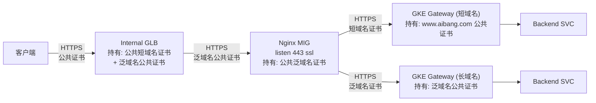
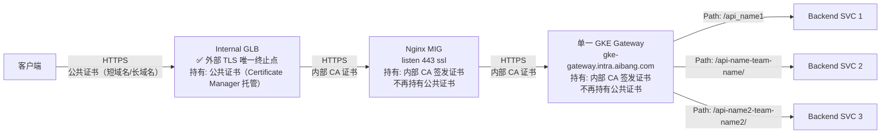
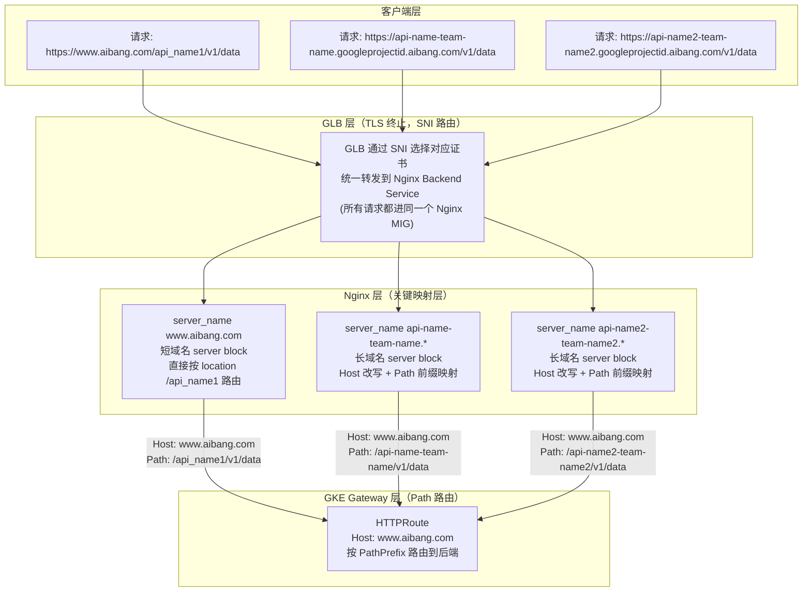
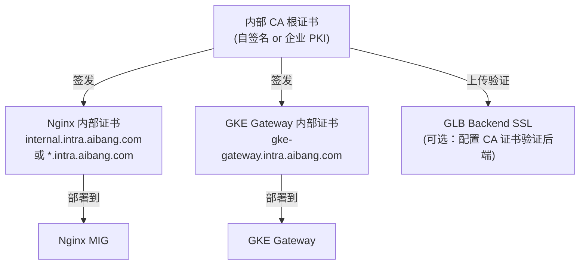
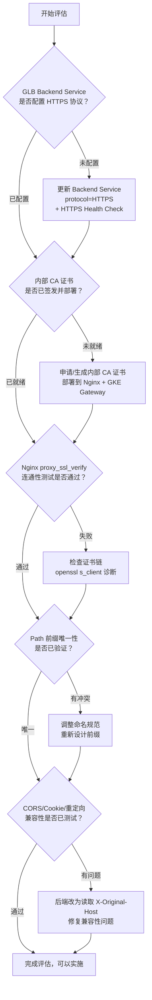
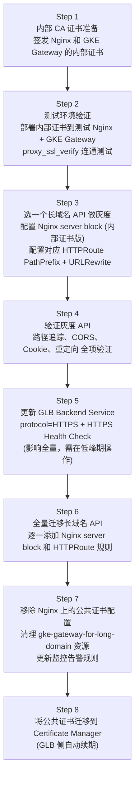

# GLB 终止客户端 TLS + 后端保持 HTTPS 的合规架构

> **适用场景**：合规要求内部流量也必须加密（如 PCI-DSS、ISO 27001 等），同时需要兼容短域名（`www.aibang.com`）和长域名（`api-name-team-name.googleprojectid.aibang.com`）并存的场景。
>
> 参考文档：`ssl-terminal-2.md`（单一 GKE Gateway 架构）、`glb-terminal-2.md`（GLB TLS 终止多方案探索）

---

## 1. 问题分析

### 1.1 场景背景

- **合规要求**：内部链路（GLB → Nginx → GKE Gateway）必须使用 HTTPS 加密传输，不允许明文 HTTP
- **证书策略**：内部链路使用**内部 CA 签发的证书**（与面向客户端的公共证书隔离）
- **域名并存**：短域名（`www.aibang.com`）和多个长域名（`*.googleprojectid.aibang.com`）同时存在，需要统一处理

### 1.2 旧架构回顾（多套证书，多处 TLS 终止）



**存在的问题：**
- 公共证书散落在 GLB、Nginx、两个 GKE Gateway **四处**
- 每到证书轮换周期，需要逐一更新，容易遗漏
- 公共证书（含私钥）存储在 Nginx MIG 的磁盘上，增加密钥泄露面

---

### 1.3 目标架构（合规场景：GLB 终止外部 TLS + 内部 HTTPS）



**核心变化：**

| 层级             | 旧证书                           | 新证书                                         |
| ---------------- | -------------------------------- | ---------------------------------------------- |
| **GLB**          | 公共证书（短域名 + 泛域名）      | 公共证书（Certificate Manager 托管，自动续期） |
| **Nginx**        | 公共泛域名证书（私钥暴露于磁盘） | **内部 CA 证书**（私钥仅内部使用）             |
| **GKE Gateway**  | 公共证书（两套）                 | **内部 CA 证书**（一套，统一管理）             |
| **后端 Service** | 无 TLS（HTTP）                   | 无变化（HTTP）                                 |

---

## 2. 可行性判断：**可以实现**

### 2.1 核心理由

| 维度                                | 分析                                                                                              |
| ----------------------------------- | ------------------------------------------------------------------------------------------------- |
| **GLB 后端 SSL 支持**               | GCP Internal HTTPS LB 支持配置 Backend Service 使用 HTTPS 协议，可对后端发起 HTTPS 连接           |
| **GLB 不验证后端证书链（默认）**    | 默认情况下 GLB 对后端证书不做 CA 验证，只加密传输；如需验证，可上传内部 CA 证书到 Backend Service |
| **Nginx 接受 GLB 的 HTTPS 连接**    | Nginx 监听 443 并配置内部 CA 证书，正常接收 GLB 的 HTTPS 连接                                     |
| **Nginx 向 GKE Gateway 发起 HTTPS** | `proxy_pass https://...` + `proxy_ssl_*` 指令，使用内部 CA 证书加密转发                           |
| **短域名与长域名并存**              | Nginx 通过 `server_name` 匹配不同域名，分别处理路由逻辑，兼容并存                                 |
| **Host 改写 + Path 前缀映射**       | 这是解决长域名→短域名统一路由的关键，在 Nginx 层完成映射                                          |

---

## 3. 请求映射逻辑：在哪里处理？

### 3.1 映射关系全景图



> **核心结论：映射逻辑集中在 Nginx 层处理。**

### 3.2 映射关系表（长域名 → Path 前缀）

| 原始请求域名                                      | 原始路径             | Nginx 改写后 Host        | Nginx 改写后 Path                         | GKE Gateway 路由到             |
| ------------------------------------------------- | -------------------- | ------------------------ | ----------------------------------------- | ------------------------------ |
| `www.aibang.com`                                  | `/api_name1/v1/data` | `www.aibang.com`（不变） | `/api_name1/v1/data`（不变）              | `api-name1-service`            |
| `www.aibang.com`                                  | `/api_name2/v1/data` | `www.aibang.com`（不变） | `/api_name2/v1/data`（不变）              | `api-name2-service`            |
| `api-name-team-name.googleprojectid.aibang.com`   | `/v1/data`           | `www.aibang.com`（改写） | `/api-name-team-name/v1/data`（加前缀）   | `api-name-team-name-service`   |
| `api-name2-team-name2.googleprojectid.aibang.com` | `/v1/data`           | `www.aibang.com`（改写） | `/api-name2-team-name2/v1/data`（加前缀） | `api-name2-team-name2-service` |

---

## 4. 关键配置示意

### 4.1 内部证书体系设计



> **证书隔离原则**：
> - **公共证书**（带私钥）只存在于 GLB，不再下发到 Nginx 或 GKE
> - **内部证书**（带私钥）只在 VPC 内部流转，用于 GLB→Nginx→GKE Gateway 的加密通道

### 4.2 GLB 配置

**Backend Service 使用 HTTPS 协议：**

```bash
# 创建支持 HTTPS 的 Backend Service（转发到 Nginx MIG）
gcloud compute backend-services create nginx-backend-service \
  --protocol=HTTPS \
  --port-name=https \
  --health-checks=nginx-https-health-check \
  --region=<your-region>

# （可选）配置 GLB 验证后端证书（强合规场景）
# 上传内部 CA 证书
gcloud compute ssl-certificates create internal-ca-cert \
  --certificate=internal-ca.crt \
  --private-key=internal-ca.key \
  --region=<your-region>

# 关联到 Backend Service（开启后端证书验证）
gcloud compute backend-services update nginx-backend-service \
  --ssl-certificates=internal-ca-cert \
  --region=<your-region>
```

**HTTPS Health Check（对应 Nginx 内部证书）：**

```bash
gcloud compute health-checks create https nginx-https-health-check \
  --port=443 \
  --request-path=/healthz \
  --region=<your-region>
```

**Certificate Manager 托管公共证书（GLB 外部 TLS 用）：**

```yaml
# 托管证书（自动续期，无需人工干预）
apiVersion: certificatemanager.cnrm.cloud.google.com/v1beta1
kind: CertificateManagerCertificate
metadata:
  name: aibang-public-certs
spec:
  managed:
    domains:
      - "www.aibang.com"
      - "*.googleprojectid.aibang.com"
    dnsAuthorizations:
      - projects/YOUR_PROJECT/locations/global/dnsAuthorizations/aibang-dns-auth
```

### 4.3 Nginx 配置（合规版：内部证书 + 保持 HTTPS 转发）

```nginx
# ============================================================
# 短域名 server block（Host 不变，直接路由）
# ============================================================
server {
    listen 443 ssl;
    server_name www.aibang.com;

    # ✅ 改为内部 CA 签发的证书，不再使用公共证书
    ssl_certificate     /etc/pki/tls/certs/internal.cer;
    ssl_certificate_key /etc/pki/tls/private/internal.key;

    include /etc/nginx/conf.d/pop/ssl_shared.conf;

    # 必须透传：告知后端原始协议是 HTTPS（GLB 注入此头）
    proxy_set_header X-Forwarded-Proto $http_x_forwarded_proto;

    location /api_name1 {
        # 维持 HTTPS 转发（合规要求内部加密）
        proxy_pass https://gke-gateway.intra.aibang.com:443;
        proxy_set_header Host www.aibang.com;
        proxy_set_header X-Real-IP $remote_addr;
        proxy_set_header X-Forwarded-For $proxy_add_x_forwarded_for;
        proxy_set_header X-Original-Host $host;

        # proxy_ssl：使用内部证书与 GKE Gateway 建立 HTTPS
        proxy_ssl_certificate     /etc/pki/tls/certs/internal.cer;
        proxy_ssl_certificate_key /etc/pki/tls/private/internal.key;
        proxy_ssl_trusted_certificate /etc/pki/tls/certs/internal-ca.cer;
        proxy_ssl_verify       on;
        proxy_ssl_verify_depth 2;
        proxy_ssl_session_reuse on;
    }

    location /api_name2 {
        proxy_pass https://gke-gateway.intra.aibang.com:443;
        proxy_set_header Host www.aibang.com;
        proxy_set_header X-Real-IP $remote_addr;
        proxy_set_header X-Forwarded-For $proxy_add_x_forwarded_for;
        proxy_set_header X-Original-Host $host;

        proxy_ssl_certificate     /etc/pki/tls/certs/internal.cer;
        proxy_ssl_certificate_key /etc/pki/tls/private/internal.key;
        proxy_ssl_trusted_certificate /etc/pki/tls/certs/internal-ca.cer;
        proxy_ssl_verify       on;
        proxy_ssl_verify_depth 2;
        proxy_ssl_session_reuse on;
    }
}

# ============================================================
# 长域名 server block（每个长域名一个，Host 改写 + Path 前缀）
# ============================================================
server {
    listen 443 ssl;
    server_name api-name-team-name.googleprojectid.aibang.com;

    # ✅ 改为内部 CA 签发的泛域名证书
    ssl_certificate     /etc/pki/tls/certs/internal.cer;
    ssl_certificate_key /etc/pki/tls/private/internal.key;

    include /etc/nginx/conf.d/pop/ssl_shared.conf;

    proxy_set_header X-Forwarded-Proto $http_x_forwarded_proto;

    location / {
        # 关键：加 /api-name-team-name/ 前缀，让 GKE Gateway 能基于 Path 区分
        proxy_pass https://gke-gateway.intra.aibang.com:443/api-name-team-name/;
        # 关键：Host 改写为短域名，匹配 GKE Gateway HTTPRoute 规则
        proxy_set_header Host www.aibang.com;
        proxy_set_header X-Real-IP $remote_addr;
        proxy_set_header X-Forwarded-For $proxy_add_x_forwarded_for;
        # 保留原始域名，便于后端审计
        proxy_set_header X-Original-Host $host;

        # proxy_ssl：HTTPS 转发到 GKE Gateway（合规）
        proxy_ssl_certificate     /etc/pki/tls/certs/internal.cer;
        proxy_ssl_certificate_key /etc/pki/tls/private/internal.key;
        proxy_ssl_trusted_certificate /etc/pki/tls/certs/internal-ca.cer;
        proxy_ssl_verify       on;
        proxy_ssl_verify_depth 2;
        proxy_ssl_session_reuse on;
    }
}

# 其他长域名（同样模式，server_name 和 proxy_pass path 前缀不同）
server {
    listen 443 ssl;
    server_name api-name2-team-name2.googleprojectid.aibang.com;

    ssl_certificate     /etc/pki/tls/certs/internal.cer;
    ssl_certificate_key /etc/pki/tls/private/internal.key;

    include /etc/nginx/conf.d/pop/ssl_shared.conf;

    proxy_set_header X-Forwarded-Proto $http_x_forwarded_proto;

    location / {
        proxy_pass https://gke-gateway.intra.aibang.com:443/api-name2-team-name2/;
        proxy_set_header Host www.aibang.com;
        proxy_set_header X-Real-IP $remote_addr;
        proxy_set_header X-Forwarded-For $proxy_add_x_forwarded_for;
        proxy_set_header X-Original-Host $host;

        proxy_ssl_certificate     /etc/pki/tls/certs/internal.cer;
        proxy_ssl_certificate_key /etc/pki/tls/private/internal.key;
        proxy_ssl_trusted_certificate /etc/pki/tls/certs/internal-ca.cer;
        proxy_ssl_verify       on;
        proxy_ssl_verify_depth 2;
        proxy_ssl_session_reuse on;
    }
}
```

> **提取公共 proxy_ssl 配置（减少重复）：**
> 建议将 `proxy_ssl_*` 配置提取到 `/etc/nginx/conf.d/pop/proxy_ssl_shared.conf`，在每个 `location` 中 `include` 即可。

```nginx
# /etc/nginx/conf.d/pop/proxy_ssl_shared.conf
proxy_ssl_certificate     /etc/pki/tls/certs/internal.cer;
proxy_ssl_certificate_key /etc/pki/tls/private/internal.key;
proxy_ssl_trusted_certificate /etc/pki/tls/certs/internal-ca.cer;
proxy_ssl_verify       on;
proxy_ssl_verify_depth 2;
proxy_ssl_session_reuse on;
```

### 4.4 GKE Gateway 配置（内部证书 + HTTPRoute）

**Gateway 对象（使用内部证书）：**

```yaml
apiVersion: gateway.networking.k8s.io/v1
kind: Gateway
metadata:
  name: gke-gateway
  namespace: gateway-ns
spec:
  gatewayClassName: gke-l7-rilb         # Internal Regional LB
  listeners:
  - name: https
    protocol: HTTPS
    port: 443
    tls:
      mode: Terminate
      certificateRefs:
      - name: gke-gateway-internal-tls  # 内部 CA 签发的证书 Secret
        namespace: gateway-ns
    allowedRoutes:
      namespaces:
        from: All
---
# 内部证书 Secret（由内部 CA 签发）
apiVersion: v1
kind: Secret
metadata:
  name: gke-gateway-internal-tls
  namespace: gateway-ns
type: kubernetes.io/tls
data:
  tls.crt: <base64-encoded-internal-cert>
  tls.key: <base64-encoded-internal-key>
```

**HTTPRoute（短域名 + 长域名映射后统一路由）：**

```yaml
apiVersion: gateway.networking.k8s.io/v1
kind: HTTPRoute
metadata:
  name: short-domain-routes
  namespace: gateway-ns
spec:
  parentRefs:
  - name: gke-gateway
    namespace: gateway-ns
  hostnames:
  - "www.aibang.com"    # 所有请求到达时 Host 都是这个（Nginx 已改写）
  rules:
  # ---- 短域名原有路由（无变化）----
  - matches:
    - path:
        type: PathPrefix
        value: /api_name1
    backendRefs:
    - name: api-name1-service
      port: 8080

  - matches:
    - path:
        type: PathPrefix
        value: /api_name2
    backendRefs:
    - name: api-name2-service
      port: 8080

  # ---- 长域名映射后的路由（新增，通过 Path 前缀区分）----
  - matches:
    - path:
        type: PathPrefix
        value: /api-name-team-name/
    filters:
    # URLRewrite：剥离前缀，还原后端看到的原始路径
    - type: URLRewrite
      urlRewrite:
        path:
          type: ReplacePrefixMatch
          replacePrefixMatch: /
    backendRefs:
    - name: api-name-team-name-service
      port: 8080

  - matches:
    - path:
        type: PathPrefix
        value: /api-name2-team-name2/
    filters:
    - type: URLRewrite
      urlRewrite:
        path:
          type: ReplacePrefixMatch
          replacePrefixMatch: /
    backendRefs:
    - name: api-name2-team-name2-service
      port: 8080
```

---

## 5. 短域名与长域名并存的处理逻辑

### 5.1 并存场景下的完整请求流追踪

**场景 A：短域名请求**

```
1. 客户端发起: GET https://www.aibang.com/api_name1/v1/resource
2. GLB 收到:
   - SNI: www.aibang.com → 使用对应公共证书握手
   - TLS 终止，解密请求
   - 注入 X-Forwarded-Proto: https
   - 转发到 Nginx（HTTPS，内部证书）
3. Nginx 收到（server_name: www.aibang.com 匹配）:
   - 匹配 location /api_name1
   - Host 头: www.aibang.com（不改写）
   - proxy_pass: https://gke-gateway.intra.aibang.com:443
   - 透传 X-Forwarded-Proto, X-Real-IP
4. GKE Gateway 收到:
   - Host: www.aibang.com
   - Path: /api_name1/v1/resource
   - HTTPRoute 匹配 PathPrefix: /api_name1 → api-name1-service:8080
5. Backend Service 收到:
   - HTTP 请求
   - Path: /api_name1/v1/resource（或经 URLRewrite 还原为 /v1/resource）
   - X-Forwarded-Proto: https
   - X-Original-Host: www.aibang.com
```

**场景 B：长域名请求（映射处理）**

```
1. 客户端发起: GET https://api-name-team-name.googleprojectid.aibang.com/v1/resource
2. GLB 收到:
   - SNI: api-name-team-name.googleprojectid.aibang.com → 泛域名证书握手
   - TLS 终止，解密请求
   - 注入 X-Forwarded-Proto: https
   - Host 头保持: api-name-team-name.googleprojectid.aibang.com
   - 转发到同一个 Nginx Backend Service（HTTPS）
3. Nginx 收到（server_name: api-name-team-name.googleprojectid.aibang.com 匹配）:
   - 匹配 location /
   - ★ Host 头改写: www.aibang.com
   - ★ Path 前缀映射: /v1/resource → /api-name-team-name/v1/resource
   - proxy_pass: https://gke-gateway.intra.aibang.com:443/api-name-team-name/
   - 添加 X-Original-Host: api-name-team-name.googleprojectid.aibang.com
4. GKE Gateway 收到:
   - Host: www.aibang.com
   - Path: /api-name-team-name/v1/resource
   - HTTPRoute 匹配 PathPrefix: /api-name-team-name/ → api-name-team-name-service:8080
   - URLRewrite 过滤器剥离前缀 → 实际转发路径: /v1/resource
5. Backend Service 收到:
   - HTTP 请求
   - Path: /v1/resource（已还原）
   - X-Forwarded-Proto: https
   - X-Original-Host: api-name-team-name.googleprojectid.aibang.com（可用于审计）
```

### 5.2 Path 前缀唯一性检查（关键冲突规避）

```
规则：长域名映射的 Path 前缀不能与短域名的 location 路径前缀相同或有包含关系。

✅ 安全：
  短域名路径: /api_name1, /api_name2
  长域名前缀: /api-name-team-name/, /api-name2-team-name2/
  → 无重叠，安全

❌ 危险：
  短域名路径: /api-name-team    (location /api-name-team)
  长域名前缀: /api-name-team-name/
  → PathPrefix /api-name-team 会匹配 /api-name-team-name/ 开头的请求!
  → 需要调整顺序：将更具体的（更长的）前缀放在前面

💡 建议命名规范: 短域名使用下划线 (api_name)，长域名前缀使用连字符 (api-name-team-name)
   → 从命名层面避免前缀冲突
```

---

## 6. 潜在影响与风险评估

### 6.1 🔴 高风险影响

#### 6.1.1 应用兼容性：CORS / Cookie / 重定向

原长域名请求经 Nginx 后，`Host` 头变为 `www.aibang.com`：

```
原始 Host: api-name-team-name.googleprojectid.aibang.com
改写后 Host: www.aibang.com
```

可能触发以下问题：

| 问题类型             | 触发场景                                                  | 解决方案                                        |
| -------------------- | --------------------------------------------------------- | ----------------------------------------------- |
| **CORS 错误**        | 后端按 `Host` 或 `Origin` 验证跨域来源                    | 后端改为读取 `X-Original-Host` 验证             |
| **Cookie 域不匹配**  | 后端设置 `Set-Cookie: domain=.googleprojectid.aibang.com` | 后端按 `X-Original-Host` 动态设置 Cookie domain |
| **重定向 Host 错误** | 后端 301/302 跳转使用 `Host` 头拼接 URL                   | 后端改为读取 `X-Original-Host` 拼接跳转 URL     |
| **HSTS 头范围**      | `Strict-Transport-Security` 覆盖范围                      | 由 GLB 统一注入 HSTS，后端不单独设置            |

#### 6.1.2 GLB 不转发原始 Host 头

> **⚠️ 重要**：GCP Internal HTTPS LB 默认会**保留客户端请求中的 Host 头**转发给后端（不修改）。  
> 因此 Nginx 的 `$host` 变量收到的是原始域名，`server_name` 匹配正常工作。

但需要确认：GLB 是否配置了 `host` 头重写。如有 URL Map 的 `headerAction`，需检查是否影响 Host 透传。

#### 6.1.3 内部证书过期管理

内部 CA 证书不像 Certificate Manager 可以自动续期，需要：
- 建立内部证书生命周期管理流程
- 配置证书告警（提前 30 天告警过期）
- 考虑使用 **cert-manager**（GKE 内）自动轮换 GKE Gateway 证书

### 6.2 🟡 中风险影响

#### 6.2.1 Nginx proxy_ssl_verify 失败

若 GKE Gateway 的内部证书不在 Nginx 信任链中，`proxy_ssl_verify on` 会导致 502 错误：

```
2024/xx/xx nginx: [error] SSL_CTX_load_verify_locations() failed
```

**验证命令：**

```bash
# 在 Nginx MIG 上测试 SSL 连接
openssl s_client -connect gke-gateway.intra.aibang.com:443 \
  -CAfile /etc/pki/tls/certs/internal-ca.cer \
  -cert /etc/pki/tls/certs/internal.cer \
  -key /etc/pki/tls/private/internal.key

# 检查证书链是否完整
echo | openssl s_client -connect gke-gateway.intra.aibang.com:443 2>/dev/null | \
  openssl x509 -noout -issuer -subject -dates
```

#### 6.2.2 proxy_ssl_session_reuse 对性能的影响

启用 `proxy_ssl_session_reuse on` 可以复用 TLS Session，减少握手开销，但需要 GKE Gateway 支持 Session Ticket。建议在生产前压测验证。

### 6.3 🟢 正面影响

| 收益                             | 说明                                                           |
| -------------------------------- | -------------------------------------------------------------- |
| **公共证书私钥不再下发到 Nginx** | 安全性提升，符合"最小权限"原则                                 |
| **证书管理层次清晰**             | 公共证书 → Certificate Manager（GLB）；内部证书 → 内部 CA 管理 |
| **减少 GKE Gateway 数量**        | 从 2 个减少到 1 个，运维复杂度降低                             |
| **内部 CA 证书轮换成本低**       | 内部证书不需要 DNS 验证，轮换更快                              |

---

## 7. 需要评估的清单



### 评估清单

| 评估项                              | 优先级 | 说明                                                   |
| ----------------------------------- | ------ | ------------------------------------------------------ |
| **GLB Backend Protocol 改为 HTTPS** | 🔴 必须 | 否则 GLB 仍以 HTTP 转发，合规要求落空                  |
| **HTTPS Health Check 更新**         | 🔴 必须 | 防止 Health Check 因协议不匹配导致后端被标记 Unhealthy |
| **内部 CA 证书签发并部署**          | 🔴 必须 | Nginx 和 GKE Gateway 均需部署                          |
| **proxy_ssl_verify 连通测试**       | 🔴 必须 | 在测试环境用 openssl 验证证书链                        |
| **Path 前缀唯一性验证**             | 🔴 必须 | 确保长域名前缀与短域名 location 无冲突                 |
| **CORS / Cookie 兼容性测试**        | 🔴 必须 | 逐 API 验证，Host 改写对应用层的影响                   |
| **URLRewrite 路径还原验证**         | 🔴 必须 | 后端收到路径是否为 `/v1/resource`（而非带前缀版本）    |
| **X-Original-Host 透传**            | 🟡 重要 | 后端审计、日志、CORS 验证依赖此头                      |
| **X-Forwarded-Proto 透传**          | 🟡 重要 | 后端 HTTPS 重定向逻辑依赖此头                          |
| **内部证书过期告警配置**            | 🟡 重要 | 建议 cert-manager 自动轮换 GKE Gateway 证书            |
| **proxy_ssl_shared.conf 提取**      | 🟢 建议 | 减少 Nginx 配置重复，提高可维护性                      |
| **Nginx 配置模板化（长域名）**      | 🟢 建议 | 用模板生成每个长域名的 server block，便于规模化        |
| **单一 Gateway 高可用评估**         | 🟡 重要 | 副本数、资源配额、自动扩缩                             |

---

## 8. 迁移步骤（推荐滚动迁移）



> **Step 5 注意**：GLB Backend Service 协议从 HTTP 改为 HTTPS 是**全量变更**，会影响短域名和长域名所有流量。建议：
> - 在非业务高峰期操作
> - 准备好快速回滚方案（将 Backend Protocol 改回 HTTP）
> - 提前在测试环境完整验证所有 server block 均已配置内部证书

---

## 9. 总结

**可以实现，推荐路径：**

1. **GLB** → 公共证书（Certificate Manager 托管，自动续期）→ TLS 终止
2. **GLB → Nginx** → 使用内部 CA 证书加密（HTTPS），GLB Backend Service 配置 `protocol=HTTPS`
3. **Nginx** → 核心映射层：
   - 短域名 server block：Host 不变，按 location 路由
   - 长域名 server block：**Host 改写为 `www.aibang.com`，Path 加前缀**
4. **Nginx → GKE Gateway** → 使用内部 CA 证书加密（HTTPS），`proxy_ssl_verify on`
5. **GKE Gateway** → 内部 CA 证书，HTTPRoute 按 PathPrefix 路由 + URLRewrite 剥离前缀

**最关键的 3 个操作：**

| #   | 操作                                                      | 原因                                    |
| --- | --------------------------------------------------------- | --------------------------------------- |
| 1   | Nginx `proxy_set_header X-Original-Host $host`            | 保留原始域名，解决 CORS/Cookie/审计问题 |
| 2   | GKE HTTPRoute 配置 `URLRewrite: ReplacePrefixMatch: /`    | 剥离路径前缀，后端收到正确路径          |
| 3   | GLB Backend Service `protocol=HTTPS` + HTTPS Health Check | 确保合规要求的内部链路加密落地          |
