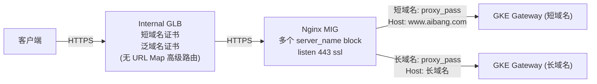
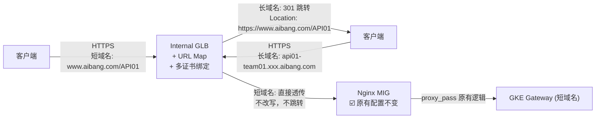
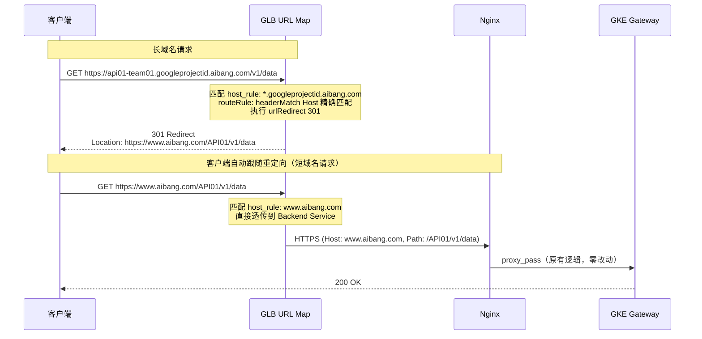
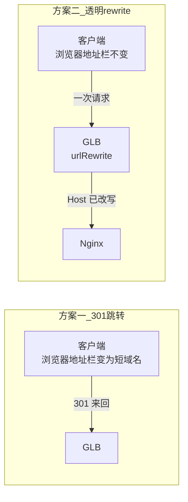
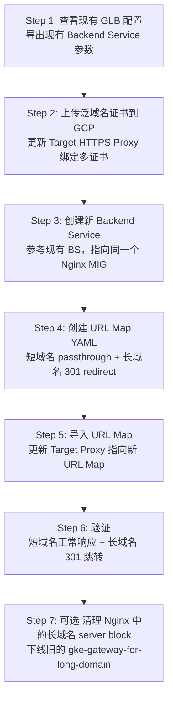
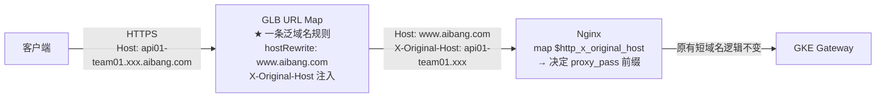

# GLB URL Map 实施方案：长域名跳转 + 短域名透传 + Nginx 零改动

> **核心目的**：
> 1. 保持 Nginx 现有短域名配置不变（`www.aibang.com/API01`、`/API02` 的 proxy_pass 完全不动）
> 2. 长域名（`*.googleprojectid.aibang.com`）进入 GLB 后，在 URL Map 层面做 **301 重定向**跳转到短域名
> 3. 所有长域名管理逻辑不进 Nginx，全部在 GLB 边缘完成
>
> **同时探索**：如果不用跳转，而是全部在 URL Map 做透明 rewrite（用户无感知），需要如何配置

---

## 0. 当前架构与目标梳理

### 0.1 当前状态



**现状 Nginx 配置（需要保留不变的部分）：**

```nginx
# 短域名 server block ☑️ 保持不变
server {
    listen 443 ssl;
    server_name www.aibang.com;
    ssl_certificate /etc/pki/tls/certs/wildcard.cer;
    ssl_certificate_key /etc/pki/tls/private/wildcard.key;
    include /etc/nginx/conf.d/pop/ssl_shared.conf;

    location /API01 {
        proxy_pass https://gke-gateway.intra.aibang.com:443;
        proxy_set_header Host www.aibang.com;
        proxy_set_header X-Real-IP $remote_addr;
        proxy_set_header X-Forwarded-For $proxy_add_x_forwarded_for;
    }

    location /API02 {
        proxy_pass https://gke-gateway.intra.aibang.com:443;
        proxy_set_header Host www.aibang.com;
        proxy_set_header X-Real-IP $remote_addr;
        proxy_set_header X-Forwarded-For $proxy_add_x_forwarded_for;
    }
}
```

### 0.2 目标



---

## 1. 第一步：查看现有 GLB 配置（获取参考信息）

### 1.1 查看现有 Target HTTPS Proxy

```bash
# 设置变量
export PROJECT_ID="your-project-id"
export REGION="asia-east1"

# 列出所有 Target HTTPS Proxy（找到现有的）
gcloud compute target-https-proxies list \
  --project=${PROJECT_ID} \
  --filter="region:${REGION}" \
  --format="table(name, sslCertificates, urlMap)"

# 查看具体某个 Proxy 的详细信息
export EXISTING_PROXY_NAME="your-existing-proxy-name"
gcloud compute target-https-proxies describe ${EXISTING_PROXY_NAME} \
  --region=${REGION} \
  --project=${PROJECT_ID}
```

### 1.2 查看现有 Backend Service（作为新建参考）

```bash
# 列出所有 Backend Service
gcloud compute backend-services list \
  --project=${PROJECT_ID} \
  --filter="region:${REGION}" \
  --format="table(name, protocol, portName, backends[].group)"

# 找到当前 Nginx 使用的 Backend Service，记录其完整配置
export EXISTING_BS_NAME="your-existing-nginx-backend-service"

# ★ 关键：导出现有 Backend Service 的完整配置来参考
gcloud compute backend-services describe ${EXISTING_BS_NAME} \
  --region=${REGION} \
  --project=${PROJECT_ID} \
  --format=yaml > /tmp/existing-bs-config.yaml

# 查看导出的配置
cat /tmp/existing-bs-config.yaml
```

**预期输出示例（以此为参考模板创建新的 BS）：**

```yaml
# /tmp/existing-bs-config.yaml 的典型输出
backends:
- balancingMode: UTILIZATION
  group: projects/your-project/regions/asia-east1/instanceGroups/nginx-mig
  maxUtilization: 0.8
connectionDraining:
  drainingTimeoutSec: 300
healthChecks:
- projects/your-project/regions/asia-east1/healthChecks/nginx-https-hc
loadBalancingScheme: INTERNAL_MANAGED
name: your-existing-nginx-backend-service
portName: https
protocol: HTTPS
timeoutSec: 30
```

### 1.3 查看现有 URL Map（如果有的话）

```bash
# 如果以前有 URL Map
export EXISTING_URL_MAP_NAME="your-existing-url-map"
gcloud compute url-maps describe ${EXISTING_URL_MAP_NAME} \
  --region=${REGION} \
  --project=${PROJECT_ID} \
  --format=yaml

# 如果没有使用过 URL Map，可以通过 Target Proxy 找到它指向的 URL Map
gcloud compute target-https-proxies describe ${EXISTING_PROXY_NAME} \
  --region=${REGION} \
  --format="value(urlMap)"
```

> **注意**：即使以前没有做过高级路由，GLB 创建时也一定有一个 URL Map（默认是简单的全匹配到一个 Backend Service）。

---

## 2. 第二步：GLB 绑定多个证书

### 2.1 上传泛域名证书（如果还没有上传）

```bash
# 上传短域名证书（如果已存在则跳过）
gcloud compute ssl-certificates create aibang-short-domain-cert \
  --certificate=./certs/short-domain.crt \
  --private-key=./certs/short-domain.key \
  --region=${REGION} \
  --project=${PROJECT_ID}

# 上传长域名泛域名证书
gcloud compute ssl-certificates create aibang-wildcard-cert \
  --certificate=./certs/wildcard-googleprojectid.crt \
  --private-key=./certs/wildcard-googleprojectid.key \
  --region=${REGION} \
  --project=${PROJECT_ID}

# 验证证书列表
gcloud compute ssl-certificates list \
  --region=${REGION} \
  --project=${PROJECT_ID} \
  --format="table(name, type, subjectAlternativeNames, expireTime)"
```

### 2.2 将多个证书绑定到 Target HTTPS Proxy

```bash
# ★ 关键命令：update 现有 Proxy，绑定多个证书
# GLB 会通过 SNI（Server Name Indication）自动为不同域名匹配对应证书

gcloud compute target-https-proxies update ${EXISTING_PROXY_NAME} \
  --region=${REGION} \
  --ssl-certificates=aibang-short-domain-cert,aibang-wildcard-cert \
  --project=${PROJECT_ID}

# 验证绑定结果
gcloud compute target-https-proxies describe ${EXISTING_PROXY_NAME} \
  --region=${REGION} \
  --project=${PROJECT_ID} \
  --format="yaml(sslCertificates)"
```

**预期输出：**

```yaml
sslCertificates:
- projects/your-project/regions/asia-east1/sslCertificates/aibang-short-domain-cert
- projects/your-project/regions/asia-east1/sslCertificates/aibang-wildcard-cert
```

> **GLB 多证书工作原理**：
> - 客户端 TLS 握手时发送 SNI（即请求的域名）
> - GLB 根据 SNI 自动选择匹配的证书
> - `www.aibang.com` → 使用短域名证书
> - `api01-team01.googleprojectid.aibang.com` → 使用泛域名证书
> - 无需手动配置 SNI 映射，GLB 自动处理

---

## 3. 第三步：创建新的 Backend Service（参考现有配置）

### 3.1 参考现有 BS 创建新的 BS

```bash
# 从第 1 步导出的配置中提取关键参数
# 假设现有 BS 的参数如下（根据实际 describe 输出调整）：

export NEW_BS_NAME="nginx-backend-unified"    # 新 BS 名称
export EXISTING_HC_NAME="nginx-https-hc"      # 复用现有 Health Check
export NGINX_MIG_NAME="nginx-mig"             # 复用现有 Nginx MIG

# ★ 创建新 Backend Service（参考现有配置参数）
gcloud compute backend-services create ${NEW_BS_NAME} \
  --region=${REGION} \
  --protocol=HTTPS \
  --port-name=https \
  --health-checks=${EXISTING_HC_NAME} \
  --health-checks-region=${REGION} \
  --load-balancing-scheme=INTERNAL_MANAGED \
  --connection-draining-timeout=300 \
  --timeout=30 \
  --enable-logging \
  --logging-sample-rate=1.0 \
  --project=${PROJECT_ID}
```

### 3.2 将 Nginx MIG 添加为后端

```bash
# 将同一个 Nginx MIG 添加到新 BS（和原来的 BS 指向同一个 MIG，完全安全）
gcloud compute backend-services add-backend ${NEW_BS_NAME} \
  --region=${REGION} \
  --instance-group=${NGINX_MIG_NAME} \
  --instance-group-region=${REGION} \
  --balancing-mode=UTILIZATION \
  --max-utilization=0.8 \
  --project=${PROJECT_ID}

# 验证
gcloud compute backend-services describe ${NEW_BS_NAME} \
  --region=${REGION} \
  --project=${PROJECT_ID} \
  --format="yaml(backends, protocol, portName, healthChecks)"
```

> **为什么可以让两个 BS 指向同一个 MIG？**
> - URL Map 只关心 Backend Service 名称
> - Backend Service 只关心后端（MIG）在哪
> - MIG 完全无感知上层有几个 BS 指向自己
> - 参考文档 `url-map.md` 中第 5.2 节的说明

---

## 4. 第四步：创建 URL Map（核心配置）

### 方案一：长域名在 GLB 做 301 跳转（推荐，Nginx 零改动）

> 客户端访问长域名 → GLB URL Map 返回 301 重定向到短域名 → 客户端用短域名重新请求 → 正常走 Nginx 短域名逻辑



### 4.1 生成 URL Map YAML 配置

```bash
cat > /tmp/unified-url-map.yaml << 'ENDOFFILE'
kind: compute#urlMap
name: unified-api-url-map
description: "GLB URL Map: short domain passthrough + long domain 301 redirect"

# ============================================================
# 默认后端（兜底：未匹配任何规则时指向此处）
# 安全最佳实践：可指向一个空 BS 配合 Cloud Armor deny-all
# ============================================================
defaultService: projects/YOUR_PROJECT_ID/regions/YOUR_REGION/backendServices/nginx-backend-unified

# ============================================================
# Host Rules
# ============================================================
hostRules:

# 短域名规则（直接透传到 Nginx，不做任何改写）
- hosts:
  - "www.aibang.com"
  pathMatcher: short-domain-passthrough

# 长域名泛域名规则（做 301 跳转到短域名）
- hosts:
  - "*.googleprojectid.aibang.com"
  pathMatcher: long-domain-redirect

# ============================================================
# Path Matchers
# ============================================================
pathMatchers:

# ------------------------------------------------------------------
# ★ 短域名 Path Matcher
# 说明：直接透传到 Nginx Backend Service，Nginx 现有配置不改
# ------------------------------------------------------------------
- name: short-domain-passthrough
  defaultService: projects/YOUR_PROJECT_ID/regions/YOUR_REGION/backendServices/nginx-backend-unified

  # 如果需要按 API 粒度分开（可选，不需要也行，因为 Nginx 会处理）
  # 这里列出只是为了 GLB 层可见性和日志审计
  routeRules:
  - priority: 1
    description: "短域名 API01 路由"
    matchRules:
    - prefixMatch: "/API01"
    routeAction:
      weightedBackendServices:
      - backendService: projects/YOUR_PROJECT_ID/regions/YOUR_REGION/backendServices/nginx-backend-unified
        weight: 100

  - priority: 2
    description: "短域名 API02 路由"
    matchRules:
    - prefixMatch: "/API02"
    routeAction:
      weightedBackendServices:
      - backendService: projects/YOUR_PROJECT_ID/regions/YOUR_REGION/backendServices/nginx-backend-unified
        weight: 100

# ------------------------------------------------------------------
# ★ 长域名 Path Matcher（301 跳转到短域名）
# 说明：不转发到后端，直接在 GLB 层返回 301 重定向
# 每个长域名 → 对应一条 routeRule → 跳转到对应的短域名 API 路径
# ------------------------------------------------------------------
- name: long-domain-redirect
  # 默认后端（长域名中未匹配的请求，可指向 deny-all 或统一后端）
  defaultService: projects/YOUR_PROJECT_ID/regions/YOUR_REGION/backendServices/nginx-backend-unified
  routeRules:

  # ★ 长域名 API01：api01-team01.googleprojectid.aibang.com → www.aibang.com/API01
  - priority: 1
    description: "长域名 api01-team01 跳转到短域名 /API01"
    matchRules:
    - prefixMatch: "/"
      headerMatches:
      - headerName: "Host"
        exactMatch: "api01-team01.googleprojectid.aibang.com"
    urlRedirect:
      hostRedirect: "www.aibang.com"
      pathRedirect: "/API01"           # 精确跳转到 /API01
      prefixRedirect: "/API01"         # 或使用 prefixRedirect 保留后续路径
      httpsRedirect: true              # 强制 HTTPS
      redirectResponseCode: MOVED_PERMANENTLY_DEFAULT  # 301
      stripQuery: false                # 保留 query string

  # ★ 长域名 API02：api02-team02.googleprojectid.aibang.com → www.aibang.com/API02
  - priority: 2
    description: "长域名 api02-team02 跳转到短域名 /API02"
    matchRules:
    - prefixMatch: "/"
      headerMatches:
      - headerName: "Host"
        exactMatch: "api02-team02.googleprojectid.aibang.com"
    urlRedirect:
      hostRedirect: "www.aibang.com"
      prefixRedirect: "/API02"
      httpsRedirect: true
      redirectResponseCode: MOVED_PERMANENTLY_DEFAULT
      stripQuery: false

  # 可继续添加更多长域名跳转规则（priority 递增）...

ENDOFFILE
```

> **⚠️ 关于 `pathRedirect` vs `prefixRedirect` 的区别**：
>
> | 字段 | 行为 | 示例 |
> |------|------|------|
> | `pathRedirect: "/API01"` | 替换整个路径（丢弃原始路径） | `/v1/data` → `/API01` |
> | `prefixRedirect: "/API01"` | 替换匹配的前缀（保留后续路径） | `/v1/data` → `/API01/v1/data` |
>
> **推荐使用 `prefixRedirect`**，这样原始请求路径会被保留：
> ```
> 原始：https://api01-team01.googleprojectid.aibang.com/v1/data
> 跳转：https://www.aibang.com/API01/v1/data
> ```

### 4.2 修正 YAML（只用 prefixRedirect）

> **GCP URL Map 的 `urlRedirect` 中 `pathRedirect` 和 `prefixRedirect` 不能同时使用**，只能选其一。

```bash
# 生成修正后的配置（只用 prefixRedirect）
cat > /tmp/unified-url-map.yaml << 'ENDOFFILE'
kind: compute#urlMap
name: unified-api-url-map
description: "GLB URL Map: short domain passthrough + long domain 301 redirect"

defaultService: projects/YOUR_PROJECT_ID/regions/YOUR_REGION/backendServices/nginx-backend-unified

hostRules:
- hosts:
  - "www.aibang.com"
  pathMatcher: short-domain-passthrough

- hosts:
  - "*.googleprojectid.aibang.com"
  pathMatcher: long-domain-redirect

pathMatchers:

# 短域名：全部直接透传到 Nginx（Nginx 原有 location 逻辑处理）
- name: short-domain-passthrough
  defaultService: projects/YOUR_PROJECT_ID/regions/YOUR_REGION/backendServices/nginx-backend-unified

# 长域名：每个长域名对应一条 301 跳转规则
- name: long-domain-redirect
  defaultService: projects/YOUR_PROJECT_ID/regions/YOUR_REGION/backendServices/nginx-backend-unified
  routeRules:

  # 长域名 1: api01-team01.xxx.aibang.com → 301 → www.aibang.com/API01/...
  - priority: 1
    description: "Redirect api01-team01 to short domain /API01"
    matchRules:
    - prefixMatch: "/"
      headerMatches:
      - headerName: "Host"
        exactMatch: "api01-team01.googleprojectid.aibang.com"
    urlRedirect:
      hostRedirect: "www.aibang.com"
      prefixRedirect: "/API01"
      httpsRedirect: true
      redirectResponseCode: MOVED_PERMANENTLY_DEFAULT
      stripQuery: false

  # 长域名 2: api02-team02.xxx.aibang.com → 301 → www.aibang.com/API02/...
  - priority: 2
    description: "Redirect api02-team02 to short domain /API02"
    matchRules:
    - prefixMatch: "/"
      headerMatches:
      - headerName: "Host"
        exactMatch: "api02-team02.googleprojectid.aibang.com"
    urlRedirect:
      hostRedirect: "www.aibang.com"
      prefixRedirect: "/API02"
      httpsRedirect: true
      redirectResponseCode: MOVED_PERMANENTLY_DEFAULT
      stripQuery: false

ENDOFFILE
```

### 4.3 替换变量并导入

```bash
# 替换占位符
sed -i '' "s/YOUR_PROJECT_ID/${PROJECT_ID}/g" /tmp/unified-url-map.yaml
sed -i '' "s/YOUR_REGION/${REGION}/g" /tmp/unified-url-map.yaml

# 验证替换结果
cat /tmp/unified-url-map.yaml

# ★ 导入 URL Map
# 如果是首次创建
gcloud compute url-maps import unified-api-url-map \
  --source=/tmp/unified-url-map.yaml \
  --region=${REGION} \
  --project=${PROJECT_ID}

# 如果是更新现有 URL Map（同名覆盖）
gcloud compute url-maps import unified-api-url-map \
  --source=/tmp/unified-url-map.yaml \
  --region=${REGION} \
  --project=${PROJECT_ID} \
  --quiet
```

### 4.4 将 URL Map 绑定到 Target HTTPS Proxy

```bash
# 如果 URL Map 名称变了，需要 update Proxy 指向新的 URL Map
gcloud compute target-https-proxies update ${EXISTING_PROXY_NAME} \
  --url-map=unified-api-url-map \
  --url-map-region=${REGION} \
  --region=${REGION} \
  --project=${PROJECT_ID}

# 验证
gcloud compute target-https-proxies describe ${EXISTING_PROXY_NAME} \
  --region=${REGION} \
  --format="yaml(urlMap, sslCertificates)"
```

> **重要说明**（参考 `create-backendservice.md`）：
> GCP 的机制是：只要 URL Map 的名字没变，Target Proxy 会自动感知到其内部规则（Host/Path）的变化，无需再次执行 `target-https-proxies update`。
> 只有 URL Map 名称变更时才需要 update Proxy。

---

## 5. 第五步：跳转行为验证

### 5.1 重定向行为详解

```
长域名请求：
  请求: GET https://api01-team01.googleprojectid.aibang.com/v1/users?page=1
  
  GLB 处理：
    1. TLS 终止（使用泛域名证书）
    2. 匹配 host_rule: *.googleprojectid.aibang.com
    3. 匹配 routeRule: headerMatch Host == api01-team01.googleprojectid.aibang.com
    4. 执行 urlRedirect:
       - hostRedirect: www.aibang.com
       - prefixRedirect: /API01（prefixMatch "/" → 替换为 "/API01"）
       - httpsRedirect: true
       - stripQuery: false

  GLB 返回给客户端：
    HTTP/1.1 301 Moved Permanently
    Location: https://www.aibang.com/API01/v1/users?page=1
                                     ^^^^^ ^^^^^^^^^^ ^^^^^^^
                                     前缀   原路径保留   query保留

短域名请求（重定向后）：
  请求: GET https://www.aibang.com/API01/v1/users?page=1
  
  GLB 处理：
    1. TLS 终止（使用短域名证书）
    2. 匹配 host_rule: www.aibang.com
    3. 匹配 short-domain-passthrough（直接透传）
    4. 转发到 Nginx Backend Service

  Nginx 处理：
    1. server_name www.aibang.com 匹配 ☑️
    2. location /API01 匹配 ☑️
    3. proxy_pass https://gke-gateway.intra.aibang.com:443 ☑️
    → 完全走原有逻辑，零改动
```

### 5.2 验证命令

```bash
# 获取 LB 的 IP
export LB_IP=$(gcloud compute forwarding-rules describe your-forwarding-rule \
  --region=${REGION} \
  --format="value(IPAddress)")

# ============================================================
# 测试 1：短域名请求（应直接透传到 Nginx，返回正常响应）
# ============================================================
curl -v -k \
  --resolve "www.aibang.com:443:${LB_IP}" \
  "https://www.aibang.com/API01/v1/test"

# 期望：正常 200 响应（Nginx 处理）

# ============================================================
# 测试 2：长域名请求（应返回 301 跳转）
# ============================================================
curl -v -k -L0 \
  --resolve "api01-team01.googleprojectid.aibang.com:443:${LB_IP}" \
  "https://api01-team01.googleprojectid.aibang.com/v1/test"

# 期望输出包含：
# < HTTP/1.1 301 Moved Permanently
# < Location: https://www.aibang.com/API01/v1/test

# -L0：不自动跟随重定向，只看 301 响应

# ============================================================
# 测试 3：长域名请求并跟随重定向（完整流程）
# ============================================================
curl -v -k -L \
  --resolve "api01-team01.googleprojectid.aibang.com:443:${LB_IP}" \
  --resolve "www.aibang.com:443:${LB_IP}" \
  "https://api01-team01.googleprojectid.aibang.com/v1/test"

# 期望：先 301 跳转，然后 200 响应
```

---

## 6. Nginx 配置：需要做什么调整？

### 6.1 核心结论：Nginx 短域名配置完全不动

在方案一（301 跳转）下，Nginx 配置 **零改动**。原因：

1. 长域名请求在 GLB 层直接 301 跳转，**根本不会到达 Nginx**
2. 跳转后的请求以短域名形式进入，走 Nginx 原有的 `server_name www.aibang.com` + `location /API01` 逻辑
3. Nginx 看到的永远只是 `www.aibang.com` 开头的请求

### 6.2 可选优化：清理长域名 server block（如果有）

如果 Nginx 之前为长域名配置了 server block（参见 `ssl-terminal.md` 旧配置），**现在可以安全移除**：

```nginx
# ❌ 可以移除的（长域名 server block，不再需要）
# server {
#     listen 443 ssl;
#     server_name api01-team01.googleprojectid.aibang.com;
#     ssl_certificate /etc/pki/tls/certs/wildcard.cer;
#     ssl_certificate_key /etc/pki/tls/private/wildcard.key;
#     include /etc/nginx/conf.d/pop/ssl_shared.conf;
#     location / {
#         proxy_pass https://gke-gateway-for-long-domain.intra.aibang.com:443;
#         proxy_set_header Host api01-team01.googleprojectid.aibang.com;
#     }
# }

# ☑️ 保留的（短域名 server block，完全不动）
server {
    listen 443 ssl;
    server_name www.aibang.com;
    ssl_certificate /etc/pki/tls/certs/wildcard.cer;
    ssl_certificate_key /etc/pki/tls/private/wildcard.key;
    include /etc/nginx/conf.d/pop/ssl_shared.conf;

    location /API01 {
        proxy_pass https://gke-gateway.intra.aibang.com:443;
        proxy_set_header Host www.aibang.com;
        proxy_set_header X-Real-IP $remote_addr;
        proxy_set_header X-Forwarded-For $proxy_add_x_forwarded_for;
    }

    location /API02 {
        proxy_pass https://gke-gateway.intra.aibang.com:443;
        proxy_set_header Host www.aibang.com;
        proxy_set_header X-Real-IP $remote_addr;
        proxy_set_header X-Forwarded-For $proxy_add_x_forwarded_for;
    }
}
```

---

## 7. 方案二探索：全部在 URL Map 做透明 rewrite（用户无感知）

> 如果不想让客户端看到 301 跳转（即浏览器地址栏不变），可以在 GLB 层做 **urlRewrite**（透明改写），让 Nginx 收到的就是短域名请求。

### 7.1 架构差异



### 7.2 方案二 URL Map 配置

```yaml
# 仅展示长域名 pathMatcher 部分的差异
- name: long-domain-rewrite
  defaultService: projects/YOUR_PROJECT_ID/regions/YOUR_REGION/backendServices/nginx-backend-unified
  routeRules:

  # 长域名 API01: 透明改写 Host 和 Path，然后转发到 Nginx
  - priority: 1
    matchRules:
    - prefixMatch: "/"
      headerMatches:
      - headerName: "Host"
        exactMatch: "api01-team01.googleprojectid.aibang.com"
    routeAction:
      urlRewrite:
        hostRewrite: "www.aibang.com"      # ★ Host 改写为短域名
        pathPrefixRewrite: "/API01/"       # ★ Path 加前缀
      weightedBackendServices:
      - backendService: projects/YOUR_PROJECT_ID/regions/YOUR_REGION/backendServices/nginx-backend-unified
        weight: 100
    headerAction:
      requestHeadersToAdd:
      - headerName: "X-Original-Host"
        headerValue: "api01-team01.googleprojectid.aibang.com"
        replace: false

  # 长域名 API02: 同样逻辑
  - priority: 2
    matchRules:
    - prefixMatch: "/"
      headerMatches:
      - headerName: "Host"
        exactMatch: "api02-team02.googleprojectid.aibang.com"
    routeAction:
      urlRewrite:
        hostRewrite: "www.aibang.com"
        pathPrefixRewrite: "/API02/"
      weightedBackendServices:
      - backendService: projects/YOUR_PROJECT_ID/regions/YOUR_REGION/backendServices/nginx-backend-unified
        weight: 100
    headerAction:
      requestHeadersToAdd:
      - headerName: "X-Original-Host"
        headerValue: "api02-team02.googleprojectid.aibang.com"
        replace: false
```

### 7.3 方案一 vs 方案二 对比

| 维度                    | 方案一：301 跳转                     | 方案二：透明 rewrite                                                   |
| ----------------------- | ------------------------------------ | ---------------------------------------------------------------------- |
| **客户端感知**          | 浏览器地址栏变为短域名               | 浏览器地址栏不变                                                       |
| **请求次数**            | 2 次（301 + 实际请求）               | 1 次                                                                   |
| **Nginx 改动**          | ☑️ **零改动**                         | ☑️ **零改动**（Nginx 收到的 Host 已被 GLB 改写为短域名）                |
| **适合场景**            | API 调用、浏览器访问                 | 纯后端 API 调用（客户端不关心 URL 变化）                               |
| **对 API 客户端的影响** | 客户端需支持跟随 301 重定向          | 客户端无感知                                                           |
| **CORS/Cookie**         | 重定向后域名变为短域名，无 CORS 问题 | 客户端视角域名未变，后端返回 `Host: www.aibang.com` 可能导致 CORS 问题 |
| **推荐度**              | 🏆 **推荐**（更安全、更简单）         | 适合特定场景                                                           |

---

## 8. 后续新增长域名的操作流程

### 8.1 新增一个长域名跳转规则

```bash
# 1. 导出当前 URL Map
gcloud compute url-maps export unified-api-url-map \
  --region=${REGION} \
  --destination=/tmp/current-url-map.yaml \
  --project=${PROJECT_ID}

# 2. 编辑 YAML，在 long-domain-redirect 的 routeRules 中新增一条
# 例如：新增 api03-team03.googleprojectid.aibang.com → /API03
```

在 YAML 的 `long-domain-redirect` 的 `routeRules` 中添加：

```yaml
  - priority: 3    # ★ 递增 priority
    description: "Redirect api03-team03 to short domain /API03"
    matchRules:
    - prefixMatch: "/"
      headerMatches:
      - headerName: "Host"
        exactMatch: "api03-team03.googleprojectid.aibang.com"
    urlRedirect:
      hostRedirect: "www.aibang.com"
      prefixRedirect: "/API03"
      httpsRedirect: true
      redirectResponseCode: MOVED_PERMANENTLY_DEFAULT
      stripQuery: false
```

```bash
# 3. 重新导入（In-Place Update，不影响现有规则）
gcloud compute url-maps import unified-api-url-map \
  --source=/tmp/current-url-map.yaml \
  --region=${REGION} \
  --project=${PROJECT_ID} \
  --quiet

# 4. 验证
gcloud compute url-maps describe unified-api-url-map \
  --region=${REGION} \
  --format=json | python3 -m json.tool | grep -A5 "api03-team03"
```

### 8.2 域名-API 映射规划表

| 长域名 FQDN                               | 跳转目标短域名路径     | URL Map Priority | 状态     |
| ----------------------------------------- | ---------------------- | ---------------- | -------- |
| `api01-team01.googleprojectid.aibang.com` | `www.aibang.com/API01` | 1                | ✅ 已配置 |
| `api02-team02.googleprojectid.aibang.com` | `www.aibang.com/API02` | 2                | ✅ 已配置 |
| `api03-team03.googleprojectid.aibang.com` | `www.aibang.com/API03` | 3                | 待新增   |
| ...                                       | ...                    | ...              | ...      |

> **建议**：将此映射表纳入 GitOps 管理（参考 `how-to-manage-url-map.md`），每次变更通过 PR Review + CI 自动 validate + import。

---

## 9. 完整操作清单



---

## 10. 安全注意事项

### 10.1 是否有可能模拟 Host 头访问别人的 API？

> 这是 `ssl-terminal-effect.md` 中提到的安全问题。

**方案一（301 跳转）下的安全性：**

| 攻击场景                                   | 风险                 | 防护                                                     |
| ------------------------------------------ | -------------------- | -------------------------------------------------------- |
| 伪造 `Host: api01-team01.xxx.aibang.com`   | 🟢 低                 | GLB 会返回 301 到 `/API01`，客户端仍需正常认证           |
| 伪造 `Host: unknown-api.xxx.aibang.com`    | 🟢 低                 | 不匹配任何 routeRule，走 defaultService（可配 deny-all） |
| 伪造短域名 `Host: www.aibang.com` 直接访问 | 该怎么认证还怎么认证 | API 层面的认证鉴权                                       |

**安全建议：**

```bash
# 为长域名的 defaultService 配置 Cloud Armor deny-all 策略
# 防止未注册的长域名请求穿透到后端

gcloud compute security-policies create deny-all-policy \
  --project=${PROJECT_ID}

gcloud compute security-policies rules create 1000 \
  --security-policy=deny-all-policy \
  --action=deny-403 \
  --src-ip-ranges="*" \
  --project=${PROJECT_ID}

# 创建一个空的 deny-all backend service（不挂载任何实例）
gcloud compute backend-services create bs-deny-all \
  --region=${REGION} \
  --protocol=HTTPS \
  --load-balancing-scheme=INTERNAL_MANAGED \
  --project=${PROJECT_ID}

# 绑定 Cloud Armor
gcloud compute backend-services update bs-deny-all \
  --security-policy=deny-all-policy \
  --region=${REGION} \
  --project=${PROJECT_ID}
```

然后将 `long-domain-redirect` 的 `defaultService` 指向 `bs-deny-all`：

```yaml
- name: long-domain-redirect
  # ★ 未匹配的长域名请求被 Cloud Armor 拦截
  defaultService: projects/YOUR_PROJECT_ID/regions/YOUR_REGION/backendServices/bs-deny-all
```

---

## 11. 总结

| 问题                         | 回答                                                                                 |
| ---------------------------- | ------------------------------------------------------------------------------------ |
| **如何绑定多个证书？**       | `target-https-proxies update --ssl-certificates=cert1,cert2`                         |
| **如何创建新 BS 参考旧的？** | `describe --format=yaml` 导出旧配置 → 以此参数创建新 BS → `add-backend` 指向同一 MIG |
| **如何创建 URL Map？**       | 写 YAML → `url-maps import` 导入（高级路由必须用 YAML）                              |
| **长域名如何跳转？**         | `urlRedirect` + `prefixRedirect` 在 GLB 层直接返回 301                               |
| **Nginx 需要改什么？**       | ☑️ **什么都不改**（301 跳转方案下长域名请求不到达 Nginx）                             |
| **能否全部在 GLB 控制？**    | ✅ 可以，方案二用 `urlRewrite` 做透明改写，Nginx 也无需改动                           |

---

## 12. 进阶探索：能否用规则/模式匹配减少 URL Map 维护量？

### 12.1 问题本质

目前的方案（无论 301 还是 urlRewrite）都需要 **每个长域名写一条 routeRule**：

```yaml
# 域名 1 → 一条规则
- matchRules: [headerMatches: Host == api01-team01.xxx.aibang.com]
  urlRedirect: { prefixRedirect: "/API01" }

# 域名 2 → 又一条规则
- matchRules: [headerMatches: Host == api02-team02.xxx.aibang.com]
  urlRedirect: { prefixRedirect: "/API02" }

# 域名 N → 第 N 条规则...
```

用户的长域名有统一 pattern：`{api-name}-{team-name}.googleprojectid.aibang.com`

**能否只写一条规则适配所有长域名？**

### 12.2 GLB URL Map 的限制（直接结论）

> **❌ GCP URL Map 原生无法做"动态提取 Host 前缀 → 拼成 redirect/rewrite path"**

| 你想要的能力                                        | GLB URL Map 是否支持         |
| --------------------------------------------------- | ---------------------------- |
| 从 `Host: api01-team01.xxx.aibang.com` 提取 `api01` | ❌ 不支持（无变量/正则捕获）  |
| `prefixRedirect: "/$1"` 类似 Nginx 的 `$1` 变量     | ❌ 不支持（只接受静态字符串） |
| `hostRewrite` / `pathPrefixRewrite` 中引用原始 Host | ❌ 不支持                     |
| `headerAction.headerValue` 中引用请求变量           | ❌ 不支持（只能硬编码静态值） |

**根本原因**：GCP URL Map 是一个**静态路由匹配表**，不是表达式引擎。参考 `gcloud-compute-url-maps.md` 中的结论：

> "pathPrefixRewrite 是一个'前缀匹配 → 静态替换'，没有正则、没有变量、没有条件判断。"

---

### 12.3 但是！有三个可行的替代方案

#### 方案 A：GLB 只做 hostRewrite，Nginx 用 `map` 指令做 Path 映射（推荐）

**核心思路**：
1. GLB URL Map：只用 **一条泛域名规则**，将所有长域名的 Host 改写为 `www.aibang.com`，同时将原始域名注入到自定义头 `X-Original-Host`
2. Nginx：增加 **一个 `map` 指令**（只需写一次），根据 `X-Original-Host` 头决定加什么 Path 前缀
3. Nginx 现有短域名 location 完全不动

**架构图：**



**GLB URL Map 配置（极简：只一条 routeRule）：**

```yaml
hostRules:
# 短域名：直接透传
- hosts:
  - "www.aibang.com"
  pathMatcher: short-domain-passthrough

# 长域名：泛域名匹配，一条规则搞定所有长域名
- hosts:
  - "*.googleprojectid.aibang.com"
  pathMatcher: long-domain-host-rewrite

pathMatchers:
# 短域名不动
- name: short-domain-passthrough
  defaultService: projects/PROJECT/regions/REGION/backendServices/nginx-backend-unified

# ★ 长域名：只做 hostRewrite，不做 pathPrefixRewrite
# Path 映射交给 Nginx 的 map 指令
- name: long-domain-host-rewrite
  defaultService: projects/PROJECT/regions/REGION/backendServices/nginx-backend-unified
  routeRules:
  - priority: 1
    description: "All long domains: rewrite Host to short domain, inject X-Original-Host"
    matchRules:
    - prefixMatch: "/"
    routeAction:
      urlRewrite:
        hostRewrite: "www.aibang.com"   # ★ 只改 Host，不改 Path
      weightedBackendServices:
      - backendService: projects/PROJECT/regions/REGION/backendServices/nginx-backend-unified
        weight: 100
    headerAction:
      requestHeadersToAdd:
      # ★ 问题：这里 headerValue 也是静态的，无法动态注入原始 Host
      # 但 GLB 在 hostRewrite 之前会保留原始 Host 在请求中
      # 需要验证：Nginx 收到的 $http_host 是改写后的还是改写前的
      - headerName: "X-Forwarded-Host"
        headerValue: "dynamic-not-supported"
        replace: false
```

> **⚠️ 关键问题**：GLB 的 `headerAction.requestHeadersToAdd` 的 `headerValue` 也是**静态字符串**，无法动态注入原始 Host 值。
>
> **但是**：GLB 在执行 `hostRewrite` 后，会自动将**原始 Host** 写入 `X-Forwarded-Host` 头（GCP 默认行为）。Nginx 可以通过 `$http_x_forwarded_host` 读取到原始长域名。
>
> **需要 PoC 验证**：在测试环境确认 GLB hostRewrite 后，Nginx 收到的 `X-Forwarded-Host` 是否为原始长域名。

**Nginx 配置（新增一个 `map` + 一个 `server` block，现有配置不动）：**

```nginx
# ============================================================
# ★ 新增：长域名到短域名 Path 前缀的 map 映射表
# 这是唯一需要维护的映射表（每新增一个长域名加一行）
# ============================================================
map $http_x_forwarded_host $long_to_short_prefix {
    default                                             "";     # 不匹配时不加前缀
    "api01-team01.googleprojectid.aibang.com"           "/API01";
    "api02-team02.googleprojectid.aibang.com"           "/API02";
    # 新增长域名只需加一行
    # "api03-team03.googleprojectid.aibang.com"         "/API03";
}

# ============================================================
# ☑️ 保留：短域名 server block 完全不动
# ============================================================
server {
    listen 443 ssl;
    server_name www.aibang.com;
    ssl_certificate /etc/pki/tls/certs/wildcard.cer;
    ssl_certificate_key /etc/pki/tls/private/wildcard.key;
    include /etc/nginx/conf.d/pop/ssl_shared.conf;

    # ============================================================
    # ★ 新增：处理 GLB 转发过来的长域名请求（Host 已被改写为 www.aibang.com）
    # 通过 X-Forwarded-Host 判断是否为长域名请求
    # ============================================================
    # 如果 map 命中了长域名映射，做内部重定向到对应的 location
    if ($long_to_short_prefix != "") {
        rewrite ^(.*)$ $long_to_short_prefix$1 last;
    }

    # 原有的 location 配置完全不动
    location /API01 {
        proxy_pass https://gke-gateway.intra.aibang.com:443;
        proxy_set_header Host www.aibang.com;
        proxy_set_header X-Real-IP $remote_addr;
        proxy_set_header X-Forwarded-For $proxy_add_x_forwarded_for;
    }

    location /API02 {
        proxy_pass https://gke-gateway.intra.aibang.com:443;
        proxy_set_header Host www.aibang.com;
        proxy_set_header X-Real-IP $remote_addr;
        proxy_set_header X-Forwarded-For $proxy_add_x_forwarded_for;
    }
}
```

> **方案 A 的优势**：
> - GLB URL Map 只需 **一条** 泛域名 routeRule（永远不需要维护）
> - Nginx 新增一个 `map` + 一个 `if` 判断（侵入极小）
> - 现有短域名 location 完全不动
> - 新增长域名只需在 `map` 块加一行
>
> **方案 A 的风险**：
> - Nginx `if` 与 `rewrite` 在某些复杂上下文中有 [eval order 陷阱](https://www.nginx.com/resources/wiki/start/topics/depth/ifisevil/)
> - 需要验证 GLB `hostRewrite` 后 `X-Forwarded-Host` 是否保留原始域名

---

#### 方案 B：脚本自动生成 URL Map routeRules（纯 GLB，不改 Nginx）

**核心思路**：既然每个长域名需要一条静态 routeRule，那用脚本从映射表自动生成 YAML。

```bash
#!/bin/bash
# generate-url-map-rules.sh
# 输入：映射表 CSV（长域名,短域名Path）
# 输出：URL Map YAML 的 routeRules 片段

MAPPING_FILE="domain-mapping.csv"
OUTPUT_FILE="/tmp/long-domain-rules.yaml"

# 映射表格式（CSV）：
# api01-team01.googleprojectid.aibang.com,/API01
# api02-team02.googleprojectid.aibang.com,/API02
# api03-team03.googleprojectid.aibang.com,/API03

cat > ${MAPPING_FILE} << 'EOF'
api01-team01.googleprojectid.aibang.com,/API01
api02-team02.googleprojectid.aibang.com,/API02
EOF

# 生成 routeRules
priority=1
echo "  routeRules:" > ${OUTPUT_FILE}

while IFS=',' read -r long_domain short_path; do
  cat >> ${OUTPUT_FILE} << RULE
  - priority: ${priority}
    description: "Rewrite ${long_domain} to ${short_path}"
    matchRules:
    - prefixMatch: "/"
      headerMatches:
      - headerName: "Host"
        exactMatch: "${long_domain}"
    routeAction:
      urlRewrite:
        hostRewrite: "www.aibang.com"
        pathPrefixRewrite: "${short_path}/"
      weightedBackendServices:
      - backendService: projects/${PROJECT_ID}/regions/${REGION}/backendServices/nginx-backend-unified
        weight: 100
    headerAction:
      requestHeadersToAdd:
      - headerName: "X-Original-Host"
        headerValue: "${long_domain}"
        replace: false
RULE
  ((priority++))
done < ${MAPPING_FILE}

echo "Generated ${priority-1} routeRules → ${OUTPUT_FILE}"
cat ${OUTPUT_FILE}
```

**用法**：
```bash
# 1. 维护映射表（CSV 格式）
echo "api03-team03.googleprojectid.aibang.com,/API03" >> domain-mapping.csv

# 2. 执行脚本生成 routeRules
bash generate-url-map-rules.sh

# 3. 将生成的 routeRules 合并到完整 URL Map YAML 中
# 4. gcloud compute url-maps import 导入
```

> **方案 B 的优势**：
> - Nginx 完全零改动（连 `map` 也不需要）
> - 所有逻辑在 GLB URL Map（纯边缘节点控制）
> - 映射关系维护在一个 CSV 文件中，Git 版本控制
> - 可集成到 CI/CD pipeline 自动生成 + 验证 + 导入
>
> **方案 B 的劣势**：
> - 每新增一个长域名仍需重新生成并导入 URL Map（但自动化后不是问题）
> - routeRules 有上限（每个 pathMatcher 最多 200 条）

---

#### 方案 C：GLB 做 hostRewrite + Nginx `map` 做 proxy_pass 路由（最灵活，推荐）

> 这是方案 A 的改进版，避免了 `if` + `rewrite` 的陷阱。

**核心思路**：
1. GLB 只做 hostRewrite（一条泛域名规则）
2. Nginx 用 `map` 指令根据 `X-Forwarded-Host`（或 `X-Original-Host`）决定 `proxy_pass` 的目标
3. **不用 `if` + `rewrite`**，而是用单独的 `location /` 处理长域名请求

```nginx
# ============================================================
# 映射表：长域名 → proxy_pass 目标 GKE Gateway 地址（或path）
# ============================================================
map $http_x_forwarded_host $long_domain_proxy_target {
    default                                             "";
    "api01-team01.googleprojectid.aibang.com"           "https://gke-gateway.intra.aibang.com:443/API01";
    "api02-team02.googleprojectid.aibang.com"           "https://gke-gateway.intra.aibang.com:443/API02";
    # 新增长域名只需加一行
}

# ☑️ 保留：原有短域名 server block 完全不动
server {
    listen 443 ssl;
    server_name www.aibang.com;
    ssl_certificate /etc/pki/tls/certs/wildcard.cer;
    ssl_certificate_key /etc/pki/tls/private/wildcard.key;
    include /etc/nginx/conf.d/pop/ssl_shared.conf;

    # 原有的短域名 location 完全不动
    location /API01 {
        proxy_pass https://gke-gateway.intra.aibang.com:443;
        proxy_set_header Host www.aibang.com;
        proxy_set_header X-Real-IP $remote_addr;
        proxy_set_header X-Forwarded-For $proxy_add_x_forwarded_for;
    }

    location /API02 {
        proxy_pass https://gke-gateway.intra.aibang.com:443;
        proxy_set_header Host www.aibang.com;
        proxy_set_header X-Real-IP $remote_addr;
        proxy_set_header X-Forwarded-For $proxy_add_x_forwarded_for;
    }

    # ★ 新增：长域名请求的 catch-all location
    # 只有当 map 命中时（即 X-Forwarded-Host 匹配长域名）才走这里
    location @long_domain_proxy {
        proxy_pass $long_domain_proxy_target;
        proxy_set_header Host www.aibang.com;
        proxy_set_header X-Real-IP $remote_addr;
        proxy_set_header X-Forwarded-For $proxy_add_x_forwarded_for;
        proxy_set_header X-Original-Host $http_x_forwarded_host;
    }
}
```

> **注意**：方案 C 中 Nginx 的 `proxy_pass` 使用变量（`$long_domain_proxy_target`）时，需要配置 `resolver`指令，或者改用静态的`proxy_pass` 配合 `rewrite`。实际实施时需要根据 Nginx 版本和配置习惯选择最佳方式。

---

### 12.4 三种方案对比

| 维度                   | 方案 A\n(GLB hostRewrite + Nginx map/rewrite) | 方案 B\n(脚本生成 URL Map routeRules) | 方案 C\n(GLB hostRewrite + Nginx map/proxy_pass) |
| ---------------------- | --------------------------------------------- | ------------------------------------- | ------------------------------------------------ |
| **GLB URL Map 维护量** | 🟢 一条规则（永远不变）                        | 🟡 N 条规则（脚本自动生成）            | 🟢 一条规则（永远不变）                           |
| **Nginx 改动**         | 🟡 新增 map + if/rewrite                       | 🟢 零改动                              | 🟡 新增 map + location                            |
| **新增长域名操作**     | Nginx map 加一行                              | CSV 加一行 → 脚本生成 → import        | Nginx map 加一行                                 |
| **客户端感知**         | 无感知（透明 rewrite）                        | 无感知（透明 rewrite）                | 无感知（透明 rewrite）                           |
| **Nginx `if` 风险**    | ⚠️ 有（if is evil）                            | 无                                    | 🟢 无（用 named location）                        |
| **适合场景**           | 长域名 < 50 个                                | 长域名多且变更频繁                    | 长域名 < 50 个                                   |
| **全程 GLB 控制**      | ❌ 部分在 Nginx                                | ✅ 全部在 GLB                          | ❌ 部分在 Nginx                                   |

---

### 12.5 最终推荐

| 你的场景                                  | 推荐方案                                                |
| ----------------------------------------- | ------------------------------------------------------- |
| 想要 Nginx **完全零改动**，所有逻辑在 GLB | **方案 B**：脚本生成 URL Map routeRules                 |
| 想要 GLB URL Map **最少维护**（一条规则） | **方案 A/C**：GLB 只做 hostRewrite，Nginx 用 map 做映射 |
| 上下游不希望域名变化（API 标准迁移）      | **方案 B 或 C**（透明 rewrite，客户端无感知）           |
| 301 跳转可以接受                          | 前文方案一（最简单，Nginx 零改动）                      |

### 12.6 关键的 PoC 验证点

在选择最终方案前，需要在测试环境验证以下关键点：

```bash
# PoC 验证 1：GLB hostRewrite 后，Nginx 收到的 headers 是什么？
# 在 Nginx 上添加临时日志格式
log_format debug_headers '$remote_addr - $request - '
                         'Host: $http_host - '
                         'X-Forwarded-Host: $http_x_forwarded_host - '
                         'X-Original-Host: $http_x_original_host';

# PoC 验证 2：pathPrefixRewrite "/" → "/API01/" 的精确行为
# 请求 /v1/data → 是变为 /API01/v1/data 还是 /API01//v1/data？
# 需要确认是否有双斜杠问题

# PoC 验证 3：routeRules headerMatch 与泛域名 host_rule 的配合
# 确认 *.googleprojectid.aibang.com 的 host_rule
# 能否与 routeRules 中 headerMatch Host 精确匹配协同工作
```
