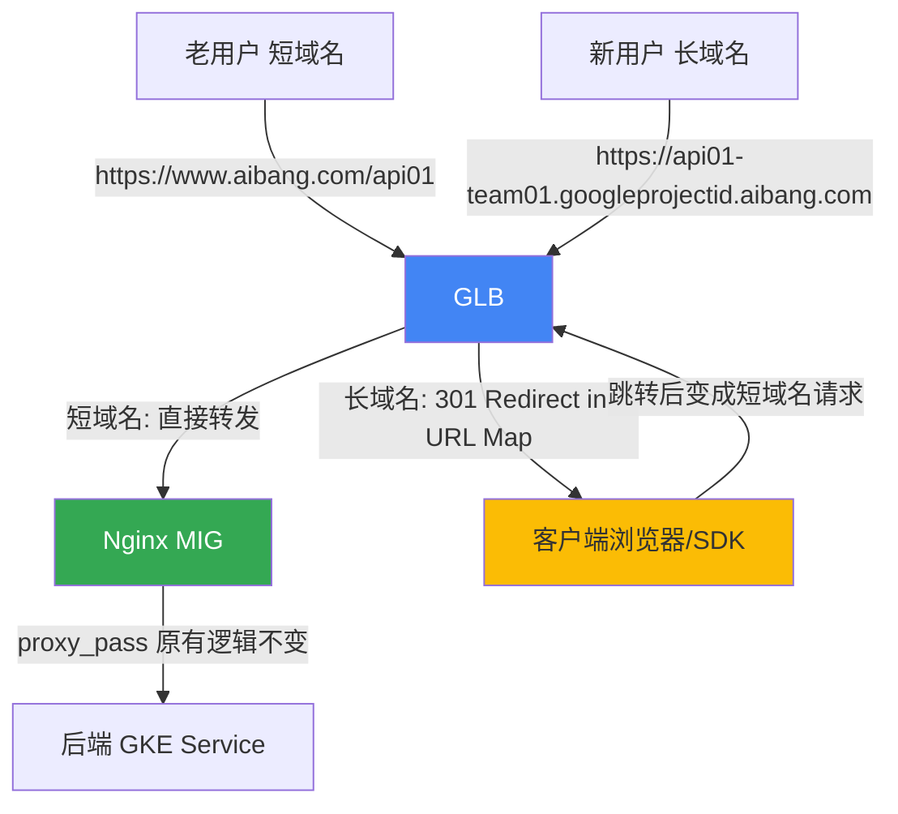
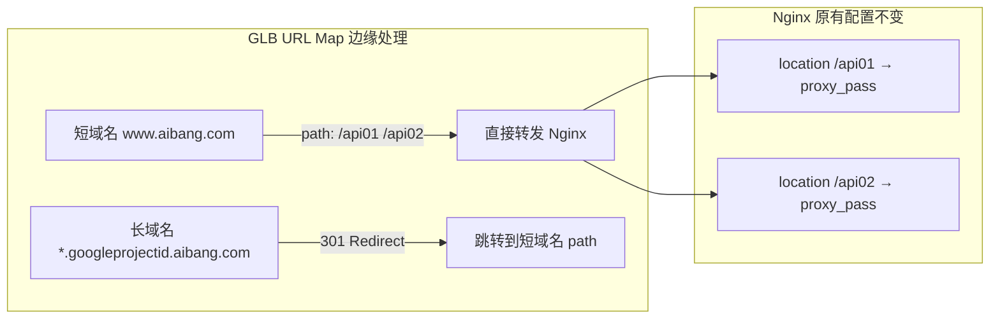
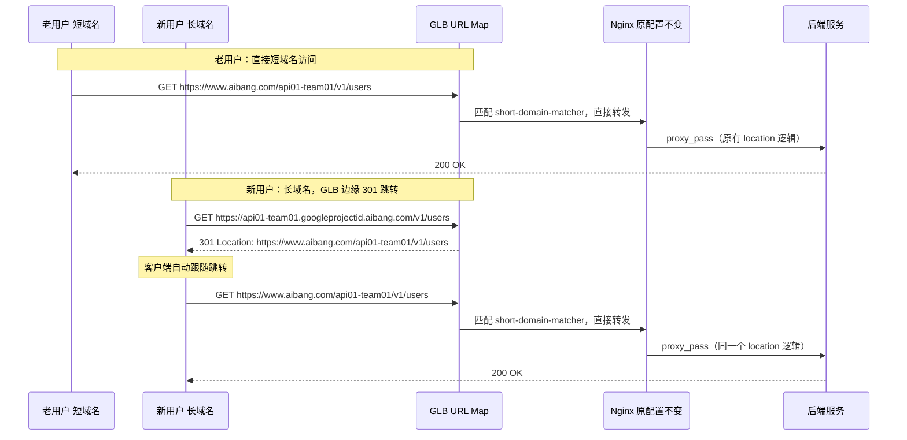
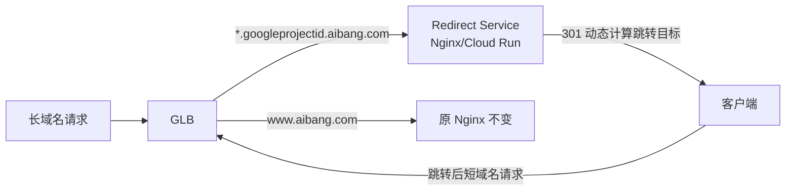
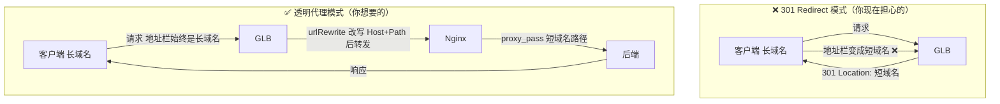
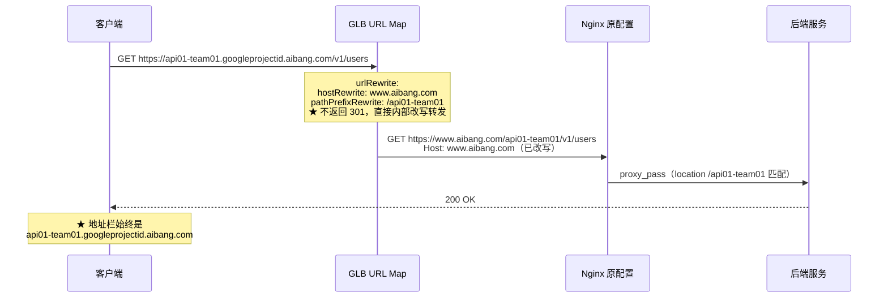
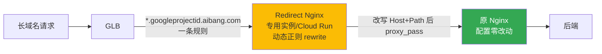
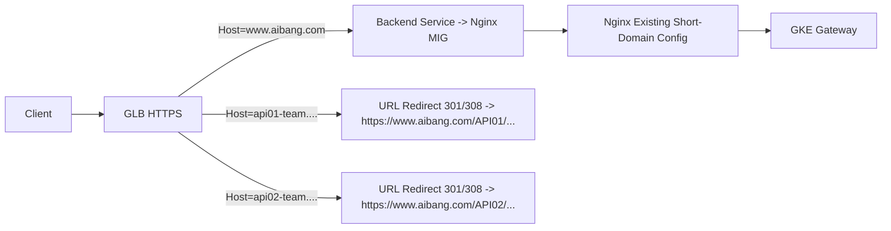

# No 301

好的，需求简化后，核心就是：

**长域名进来 → 透明代理 → 客户端地址栏不变 → 后端走短域名 path 逻辑**

让我重新梳理最简架构。

---

## 重新理解你的核心需求

```
用户请求：  https://api01-team01.googleprojectid.aibang.com/v1/users
后端收到：  Host: www.aibang.com  Path: /api01-team01/v1/users
用户感知：  地址栏始终是长域名，透明无感
```

**映射规律**：

```
{prefix}.googleprojectid.aibang.com/{任意path}
    ↓ 透明代理
www.aibang.com/{prefix}/{任意path}
```

---

## 最简架构：GLB urlRewrite（纯边缘，无额外组件）


不需要 301，不需要额外组件，**GLB 直接在内部改写 Host 和 Path 后转发给 Nginx**，客户端完全感知不到。

---

## URL Map 配置（透明代理版）

### 与 301 版本的唯一区别

```yaml
# ❌ 301 版本用的是：
urlRedirect:
  hostRedirect: "www.aibang.com"
  pathPrefixRewrite: "/api01-team01"
  redirectResponseCode: MOVED_PERMANENTLY   # 会让客户端地址栏变化

# ✅ 透明代理用的是：
routeAction:
  urlRewrite:
    hostRewrite: "www.aibang.com"           # GLB 内部改写，客户端无感知
    pathPrefixRewrite: "/api01-team01"
  weightedBackendServices:
  - backendService: ...nginx-backend-service
    weight: 100
```

### 完整 URL Map YAML

```yaml
kind: compute#urlMap
name: unified-api-url-map
defaultService: projects/YOUR_PROJECT_ID/regions/YOUR_REGION/backendServices/nginx-backend-service

hostRules:

- hosts:
  - "www.aibang.com"
  pathMatcher: short-domain-matcher

- hosts:
  - "*.googleprojectid.aibang.com"
  pathMatcher: long-domain-transparent-matcher

pathMatchers:

# 短域名：原有逻辑，直接转发，零改动
- name: short-domain-matcher
  defaultService: projects/YOUR_PROJECT_ID/regions/YOUR_REGION/backendServices/nginx-backend-service

# 长域名：透明代理，GLB 内部改写后转发
- name: long-domain-transparent-matcher
  defaultService: projects/YOUR_PROJECT_ID/regions/YOUR_REGION/backendServices/nginx-backend-service
  routeRules:

  - priority: 1
    description: "api01-team01 透明代理"
    matchRules:
    - prefixMatch: "/"
      headerMatches:
      - headerName: "Host"
        exactMatch: "api01-team01.googleprojectid.aibang.com"
    routeAction:
      urlRewrite:
        hostRewrite: "www.aibang.com"
        pathPrefixRewrite: "/api01-team01"
      weightedBackendServices:
      - backendService: projects/YOUR_PROJECT_ID/regions/YOUR_REGION/backendServices/nginx-backend-service
        weight: 100

  - priority: 2
    description: "api02-team02 透明代理"
    matchRules:
    - prefixMatch: "/"
      headerMatches:
      - headerName: "Host"
        exactMatch: "api02-team02.googleprojectid.aibang.com"
    routeAction:
      urlRewrite:
        hostRewrite: "www.aibang.com"
        pathPrefixRewrite: "/api02-team02"
      weightedBackendServices:
      - backendService: projects/YOUR_PROJECT_ID/regions/YOUR_REGION/backendServices/nginx-backend-service
        weight: 100
```

---

## Nginx：零改动确认

```nginx
# 原有配置完全不变，Nginx 根本不知道有长域名存在
# 它收到的永远是 Host: www.aibang.com

server {
    listen 443 ssl;
    server_name www.aibang.com;

    location /api01-team01 {
        proxy_pass https://backend-01.intra.aibang.com;  # 不变
    }

    location /api02-team02 {
        proxy_pass https://backend-02.intra.aibang.com;  # 不变
    }
}
```

---

## 完整请求流验证

```
# 老用户（短域名）
GET https://www.aibang.com/api01-team01/v1/users
  → GLB: 匹配 short-domain-matcher，直接转发
  → Nginx: location /api01-team01 命中
  → 后端: 正常响应
  → 客户端: 地址栏 www.aibang.com ✅

# 新用户（长域名）
GET https://api01-team01.googleprojectid.aibang.com/v1/users
  → GLB: urlRewrite → Host改为www.aibang.com, Path改为/api01-team01/v1/users
  → Nginx: location /api01-team01 命中（与老用户走同一个location）
  → 后端: 正常响应
  → 客户端: 地址栏仍是 api01-team01.googleprojectid.aibang.com ✅
```

---

## 新增长域名：只需在 URL Map 加一条 routeRule

```bash
# 导出 → 追加 → 导入，三步操作
gcloud compute url-maps export unified-api-url-map \
  --region=${REGION} \
  --destination=/tmp/url-map-current.yaml

# 在 long-domain-transparent-matcher 的 routeRules 末尾追加：
# - priority: 3
#   matchRules:
#   - prefixMatch: "/"
#     headerMatches:
#     - headerName: "Host"
#       exactMatch: "api03-team03.googleprojectid.aibang.com"
#   routeAction:
#     urlRewrite:
#       hostRewrite: "www.aibang.com"
#       pathPrefixRewrite: "/api03-team03"
#     weightedBackendServices:
#     - backendService: ...nginx-backend-service
#       weight: 100

gcloud compute url-maps import unified-api-url-map \
  --source=/tmp/url-map-current.yaml \
  --region=${REGION} --quiet
```

---

## 总结

|关注点|结论|
|---|---|
|客户端地址栏|✅ 长域名全程不变|
|CORS|✅ Origin 不变，无跨域问题|
|Nginx 改动|✅ 零改动|
|额外组件|✅ 无，纯 GLB 边缘实现|
|新增 API|在 URL Map 加一条 routeRule + Nginx 已有 location|
|能否一条规则搞定所有长域名|❌ GLB 不支持动态变量提取，每个长域名仍需一条规则，但可脚本自动生成|

这个方案是**最简、最稳**的实现路径，完全满足你的核心需求。


# GLB 长域名跳转 + 保留 Nginx 短域名配置 — 完整实施方案

## 核心架构设计



> **核心策略**：长域名在 GLB URL Map 边缘节点做 301/302 Redirect 跳转到短域名，Nginx 完全不感知长域名，原有配置零改动。

---

## 问题一：GLB 上更新域名并绑定多个证书

### 1.1 查看当前 Target HTTPS Proxy 状态

```bash
# 先查看现有 proxy 名称
gcloud compute target-https-proxies list --region=${REGION}

# 查看当前绑定的证书
gcloud compute target-https-proxies describe ${TARGET_HTTPS_PROXY_NAME} \
  --region=${REGION} \
  --format="yaml(sslCertificates)"
```

### 1.2 创建新的 SSL 证书（如果尚未创建）

```bash
# 短域名证书（已有可跳过）
gcloud compute ssl-certificates create aibang-short-domain-cert \
  --certificate=./certs/short-domain.crt \
  --private-key=./certs/short-domain.key \
  --region=${REGION}

# 长域名泛域名证书 *.googleprojectid.aibang.com
gcloud compute ssl-certificates create aibang-wildcard-cert \
  --certificate=./certs/wildcard.crt \
  --private-key=./certs/wildcard.key \
  --region=${REGION}

# 验证两个证书都存在
gcloud compute ssl-certificates list --region=${REGION}
```

### 1.3 更新 Target HTTPS Proxy 绑定多个证书

```bash
# ★ 关键命令：update 会替换原有的证书列表，必须把所有证书都列出来
gcloud compute target-https-proxies update ${TARGET_HTTPS_PROXY_NAME} \
  --region=${REGION} \
  --ssl-certificates=aibang-short-domain-cert,aibang-wildcard-cert \
  --ssl-certificates-region=${REGION}

# 验证更新结果，确认两个证书都挂载成功
gcloud compute target-https-proxies describe ${TARGET_HTTPS_PROXY_NAME} \
  --region=${REGION} \
  --format="yaml(sslCertificates)"
```

> **注意**：GLB 会根据客户端 SNI（TLS 握手中的域名）自动选择匹配的证书。短域名用户收到 `aibang-short-domain-cert`，长域名用户收到 `aibang-wildcard-cert`，无需手动干预。

---

## 问题二：创建新的 Backend Service（参考原有 Nginx 配置）

### 2.1 查看原有 Backend Service 配置（作为参考）

```bash
# 查看原有 backend service 的完整配置
gcloud compute backend-services describe ${BACKEND_NAME} \
  --region=${REGION} \
  --format=yaml

# 查看原有 backend 挂载的实例组
gcloud compute backend-services describe ${BACKEND_NAME} \
  --region=${REGION} \
  --format="yaml(backends)"

# 查看原有 Health Check
gcloud compute backend-services describe ${BACKEND_NAME} \
  --region=${REGION} \
  --format="yaml(healthChecks)"
```

### 2.2 创建新的 Backend Service（完全参考原有配置）

> **场景**：你现在需要新建一个 backend service，指向同一个 Nginx MIG，参数与原有的保持一致。

```bash
# 新 backend service 名称
export NEW_BACKEND_NAME="nginx-backend-service-v2"

# 创建新 backend service（参数与原有保持一致）
gcloud compute backend-services create ${NEW_BACKEND_NAME} \
  --region=${REGION} \
  --protocol=HTTPS \
  --port-name=https \
  --health-checks=${HC_NAME} \
  --health-checks-region=${REGION} \
  --load-balancing-scheme=INTERNAL_MANAGED \
  --connection-draining-timeout=30

# 将同一个 Nginx MIG 添加为后端（与原有 backend service 相同）
gcloud compute backend-services add-backend ${NEW_BACKEND_NAME} \
  --region=${REGION} \
  --instance-group=${NGINX_MIG_NAME} \
  --instance-group-region=${REGION} \
  --balancing-mode=UTILIZATION \
  --max-utilization=0.8

# 验证
gcloud compute backend-services describe ${NEW_BACKEND_NAME} --region=${REGION}
gcloud compute backend-services get-health ${NEW_BACKEND_NAME} --region=${REGION}
```

> **说明**：同一个 Nginx MIG 可以被多个 backend service 引用。两个 backend service 在 URL Map 里可以分别路由不同的 host/path 规则，但实际流量都打到同一批 Nginx 实例。

---

## 问题三：创建 URL Map（核心：长域名 301 跳转到短域名）

### 架构说明



### 3.1 域名映射关系规划

| 长域名（新用户入口）                      | 跳转目标（短域名）                    | Nginx location           |
| ----------------------------------------- | ------------------------------------- | ------------------------ |
| `api01-team01.googleprojectid.aibang.com` | `https://www.aibang.com/api01-team01` | `location /api01-team01` |
| `api02-team02.googleprojectid.aibang.com` | `https://www.aibang.com/api02-team02` | `location /api02-team02` |

### 3.2 创建 URL Map YAML（含 301 跳转规则）

```bash
cat > /tmp/unified-api-url-map.yaml << 'EOF'
kind: compute#urlMap
name: unified-api-url-map
description: "短域名直接转发 + 长域名 301 Redirect 跳转到短域名"

# 默认后端：未匹配任何规则时转发到 Nginx
defaultService: projects/YOUR_PROJECT_ID/regions/YOUR_REGION/backendServices/nginx-backend-service

# ============================================================
# Host 规则
# ============================================================
hostRules:

# 规则1：短域名 → 直接转发到 Nginx（原有逻辑）
- hosts:
  - "www.aibang.com"
  pathMatcher: short-domain-matcher

# 规则2：长域名泛解析 → 301 跳转
- hosts:
  - "*.googleprojectid.aibang.com"
  pathMatcher: long-domain-redirect-matcher

# ============================================================
# Path Matchers
# ============================================================
pathMatchers:

# -------------------------------------------------------
# 短域名 Matcher：原有逻辑，直接转发 Nginx，不做任何改写
# -------------------------------------------------------
- name: short-domain-matcher
  defaultService: projects/YOUR_PROJECT_ID/regions/YOUR_REGION/backendServices/nginx-backend-service
  routeRules:
  - priority: 1
    description: "短域名 /api01-team01 → Nginx"
    matchRules:
    - prefixMatch: "/api01-team01"
    routeAction:
      weightedBackendServices:
      - backendService: projects/YOUR_PROJECT_ID/regions/YOUR_REGION/backendServices/nginx-backend-service
        weight: 100

  - priority: 2
    description: "短域名 /api02-team02 → Nginx"
    matchRules:
    - prefixMatch: "/api02-team02"
    routeAction:
      weightedBackendServices:
      - backendService: projects/YOUR_PROJECT_ID/regions/YOUR_REGION/backendServices/nginx-backend-service
        weight: 100

# -------------------------------------------------------
# 长域名 Matcher：★ 核心，全部做 301 Redirect，不进 Nginx
# -------------------------------------------------------
- name: long-domain-redirect-matcher
  # 默认兜底：未识别的长域名也跳到短域名首页
  defaultUrlRedirect:
    hostRedirect: "www.aibang.com"
    httpsRedirect: true
    redirectResponseCode: MOVED_PERMANENTLY

  routeRules:

  # ★ 长域名 API01：api01-team01.googleprojectid.aibang.com
  # 跳转规则：任何 path 都跳转到 www.aibang.com/api01-team01{原path}
  - priority: 1
    description: "长域名 api01-team01 → 301 redirect 到短域名 /api01-team01"
    matchRules:
    - prefixMatch: "/"
      headerMatches:
      - headerName: "Host"
        exactMatch: "api01-team01.googleprojectid.aibang.com"
    urlRedirect:
      hostRedirect: "www.aibang.com"
      pathPrefixRewrite: "/api01-team01"
      httpsRedirect: true
      redirectResponseCode: MOVED_PERMANENTLY   # 301，SEO 友好；如需临时用 FOUND(302)

  # ★ 长域名 API02：api02-team02.googleprojectid.aibang.com
  - priority: 2
    description: "长域名 api02-team02 → 301 redirect 到短域名 /api02-team02"
    matchRules:
    - prefixMatch: "/"
      headerMatches:
      - headerName: "Host"
        exactMatch: "api02-team02.googleprojectid.aibang.com"
    urlRedirect:
      hostRedirect: "www.aibang.com"
      pathPrefixRewrite: "/api02-team02"
      httpsRedirect: true
      redirectResponseCode: MOVED_PERMANENTLY

  # 继续按同样模式添加更多长域名（priority 递增）...
EOF
```

### 3.3 替换变量并导入 URL Map

```bash
# 替换占位符
sed -i "s/YOUR_PROJECT_ID/${PROJECT_ID}/g" /tmp/unified-api-url-map.yaml
sed -i "s/YOUR_REGION/${REGION}/g" /tmp/unified-api-url-map.yaml

# 确认替换结果
grep "backendServices\|projects" /tmp/unified-api-url-map.yaml

# ★ 如果是全新创建（之前没有 URL Map）
gcloud compute url-maps import unified-api-url-map \
  --source=/tmp/unified-api-url-map.yaml \
  --region=${REGION}

# ★ 如果已有 URL Map 需要更新
gcloud compute url-maps import unified-api-url-map \
  --source=/tmp/unified-api-url-map.yaml \
  --region=${REGION} \
  --quiet   # 跳过确认提示

# 验证
gcloud compute url-maps describe unified-api-url-map --region=${REGION} --format=json | python3 -m json.tool
```

### 3.4 验证跳转规则（不发真实请求）

```bash
# 验证短域名路由（应转发到 Nginx，不跳转）
gcloud compute url-maps validate \
  --host="www.aibang.com" \
  --path="/api01-team01/v1/users" \
  --url-map=unified-api-url-map \
  --region=${REGION}

# 验证长域名跳转（应返回 301 redirect 信息）
gcloud compute url-maps validate \
  --host="api01-team01.googleprojectid.aibang.com" \
  --path="/v1/users" \
  --url-map=unified-api-url-map \
  --region=${REGION}

# 期望输出包含：
# urlRedirect:
#   hostRedirect: www.aibang.com
#   pathPrefixRewrite: /api01-team01
#   redirectResponseCode: MOVED_PERMANENTLY
```

---

## 关于 URL Map 中 pathPrefixRewrite 的路径拼接行为

> 这是最容易踩坑的地方，需要特别说明：

```
请求：GET https://api01-team01.googleprojectid.aibang.com/v1/users?page=1

matchRule: prefixMatch: "/"
urlRedirect:
  hostRedirect: "www.aibang.com"
  pathPrefixRewrite: "/api01-team01"

结果：301 → https://www.aibang.com/api01-team01/v1/users?page=1
                                    ^^^^^^^^^^^^^^ ^^^^^^^^
                                    新前缀          原path中"/"后的部分被保留
```

`pathPrefixRewrite` 会把匹配到的前缀 `/` 替换成 `/api01-team01`，原路径 `/v1/users` 中 `/` 之后的 `v1/users` 被保留追加。Query string `?page=1` 自动保留。这正是我们想要的效果。

---

## 问题四：Nginx 配置对应调整

### 核心结论：Nginx 配置零改动

由于长域名已在 GLB 做了 301 跳转，Nginx 永远只会收到短域名请求（`www.aibang.com`），因此 **Nginx 现有配置完全不需要改动**。

### 为了严谨，以下是 Nginx 现有配置应有的形态（确认不需改的部分）：

**示例 1：标准 API proxy_pass 配置（确认保持不变）**

```nginx
# /etc/nginx/conf.d/api.conf
server {
    listen 443 ssl;
    server_name www.aibang.com;

    ssl_certificate     /etc/pki/tls/certs/public.cer;
    ssl_certificate_key /etc/pki/tls/private/public.key;

    # ★ 这里的 location 配置完全不变
    # 老用户直接访问短域名，新用户 301 跳转后再访问短域名
    # 两类用户最终都走这里

    location /api01-team01 {
        proxy_pass https://backend-service-01.intra.aibang.com;
        proxy_set_header Host $host;
        proxy_set_header X-Real-IP $remote_addr;
        proxy_set_header X-Forwarded-For $proxy_add_x_forwarded_for;
        proxy_set_header X-Forwarded-Proto $scheme;
    }

    location /api02-team02 {
        proxy_pass https://backend-service-02.intra.aibang.com;
        proxy_set_header Host $host;
        proxy_set_header X-Real-IP $remote_addr;
        proxy_set_header X-Forwarded-For $proxy_add_x_forwarded_for;
        proxy_set_header X-Forwarded-Proto $scheme;
    }

    # 健康检查（GLB Health Check 需要）
    location /healthz {
        access_log off;
        return 200 "OK";
        add_header Content-Type text/plain;
    }
}
```

**示例 2：如果你的 Nginx 已有多个 server block（也不需要改）**

```nginx
# 已有的长域名 server block（如果有的话，可以保留也可以删除）
# 因为长域名流量永远不会到达 Nginx（GLB 已经在边缘 redirect 掉了）
# 所以保留或删除对功能无影响

server {
    listen 443 ssl;
    server_name _;   # 兜底，接受其他所有域名（实际不会被触发）

    ssl_certificate     /etc/pki/tls/certs/public.cer;
    ssl_certificate_key /etc/pki/tls/private/public.key;

    return 444;  # 静默拒绝（不会被触发，只是保险）
}
```

---

## 完整请求流对比



---

## 后续新增长域名的操作流程

每次新增一个长域名映射，只需 3 步：

```bash
# Step 1：导出当前 URL Map
gcloud compute url-maps export unified-api-url-map \
  --region=${REGION} \
  --destination=/tmp/url-map-current.yaml

# Step 2：在 long-domain-redirect-matcher 的 routeRules 里追加新规则
# 编辑 /tmp/url-map-current.yaml，在最后一条 routeRule 后追加：
#
#   - priority: 3   # priority 递增
#     description: "长域名 api03-team03 → 301 redirect"
#     matchRules:
#     - prefixMatch: "/"
#       headerMatches:
#       - headerName: "Host"
#         exactMatch: "api03-team03.googleprojectid.aibang.com"
#     urlRedirect:
#       hostRedirect: "www.aibang.com"
#       pathPrefixRewrite: "/api03-team03"
#       httpsRedirect: true
#       redirectResponseCode: MOVED_PERMANENTLY

# Step 3：重新导入（热更新，无中断）
gcloud compute url-maps import unified-api-url-map \
  --source=/tmp/url-map-current.yaml \
  --region=${REGION} \
  --quiet
```

---

## 实施检查清单

| 步骤  | 操作                                 | 验证命令                                                                         |
| ----- | ------------------------------------ | -------------------------------------------------------------------------------- |
| 1     | 创建两个 SSL 证书                    | `gcloud compute ssl-certificates list --region=${REGION}`                        |
| 2     | 更新 Target HTTPS Proxy 绑定两个证书 | `describe target-https-proxies` 确认 sslCertificates 有两条                      |
| 3     | 创建/更新 URL Map（含 301 跳转规则） | `gcloud compute url-maps validate --host="api01-team01..."`                      |
| 4     | 验证短域名不受影响                   | `curl -v https://www.aibang.com/api01-team01/v1/test`                            |
| 5     | 验证长域名收到 301                   | `curl -v https://api01-team01.googleprojectid.aibang.com/v1/test` 看 Location 头 |
| 6     | 验证跳转后可正常访问                 | `curl -L https://api01-team01.googleprojectid.aibang.com/v1/test`                |
| Nginx | 配置零改动                           | `nginx -t` 语法检查通过，无需修改                                                |

其实你可以看到，我的整个过程中的长域名到短域名的跳转是有一定规则的。 那我能不能直接配一个对应的 redirect 规则来直接实现呢？这样可能 URL map 的维护程度会减少。 我只要确保这个长域名api01-team01.googleprojectid.aibang.com我已经配置了对应的短域名下的location path 或者说，如果我明确知道这种对应的映射关系，那么我是不是可以直接写对应的 Rewrite 规则来实现？ 而且我的长域名肯定的 pattern 都是一样的，就比如说都会有这样一段：.googleprojectid.aibang.com 那么基于这个思路，帮我探索一下有没有可能去实现？

这是个非常好的思路！长域名的 pattern 完全一致，理论上可以用**一条通配规则**搞定所有跳转。让我来分析 GLB URL Map 的能力边界。

## 核心问题分析

你的映射规则本质是：

```
api01-team01.googleprojectid.aibang.com  →  www.aibang.com/api01-team01
api02-team02.googleprojectid.aibang.com  →  www.aibang.com/api02-team02

规律：把子域名前缀（api01-team01）直接变成短域名的 path 前缀
```

这个转换需要**动态提取 Host 中的子域名前缀**作为 path，这涉及到正则捕获组的能力。

---

## GLB URL Map 的能力边界

| 能力                                                    | GLB URL Map 支持？     |
| ------------------------------------------------------- | ---------------------- |
| 通配符 Host 匹配 `*.googleprojectid.aibang.com`         | ✅ 支持                 |
| 正则 path 匹配                                          | ✅ 支持（`regexMatch`） |
| **正则捕获组反向引用**（提取 Host 子域名用于 redirect） | ❌ **不支持**           |
| 静态 `pathPrefixRewrite`                                | ✅ 支持                 |
| 静态 `hostRedirect`                                     | ✅ 支持                 |

**结论**：GLB URL Map 原生**无法**做到"动态提取 Host 前缀 → 拼成 redirect path"这种变量替换。它的 redirect/rewrite 只支持静态字符串。

---

## 但是！有两种方案可以接近你的目标

---

### 方案 A：GLB + 一个轻量 Redirect 中间层（推荐）

用一个极轻量的服务（Nginx 或 Cloud Run）专门做这个动态正则跳转，GLB 把所有长域名流量打到它，它计算跳转目标后返回 301。



**Redirect Nginx 配置**（核心只需这几行）：

```nginx
server {
    listen 443 ssl;
    server_name ~^(?P<prefix>.+)\.googleprojectid\.aibang\.com$;

    # 动态提取子域名前缀，拼成短域名 path
    # api01-team01.googleprojectid.aibang.com/v1/users
    #   → 301 https://www.aibang.com/api01-team01/v1/users

    location / {
        return 301 https://www.aibang.com/$prefix$request_uri;
    }
}
```

这个方案**Nginx 原有配置零改动**，只是多加一台专用 redirect 实例（甚至可以是最小规格）。

---

### 方案 B：纯 GLB URL Map 通配 + 接受"每个域名一条规则"的现实

如果你坚持**纯 GLB 边缘**，没有中间层，那只能接受每个长域名写一条 `urlRedirect` 规则，但可以用**脚本自动生成**，维护成本大幅降低：

```bash
# 用脚本自动生成 URL Map routeRules，只需维护一个映射列表
cat > /tmp/generate-url-map.py << 'EOF'
import yaml, sys

PROJECT_ID = "your-project-id"
REGION = "your-region"
BACKEND = f"projects/{PROJECT_ID}/regions/{REGION}/backendServices/nginx-backend-service"

# ★ 只需维护这个列表，其他自动生成
API_MAPPINGS = [
    "api01-team01",
    "api02-team02",
    "api03-team03",
    # 新增只需在这里加一行...
]

route_rules = []
for i, prefix in enumerate(API_MAPPINGS):
    rule = {
        "priority": i + 1,
        "description": f"长域名 {prefix} → 301 redirect",
        "matchRules": [{
            "prefixMatch": "/",
            "headerMatches": [{
                "headerName": "Host",
                "exactMatch": f"{prefix}.googleprojectid.aibang.com"
            }]
        }],
        "urlRedirect": {
            "hostRedirect": "www.aibang.com",
            "pathPrefixRewrite": f"/{prefix}",
            "httpsRedirect": True,
            "redirectResponseCode": "MOVED_PERMANENTLY"
        }
    }
    route_rules.append(rule)

url_map = {
    "kind": "compute#urlMap",
    "name": "unified-api-url-map",
    "defaultService": BACKEND,
    "hostRules": [
        {"hosts": ["www.aibang.com"], "pathMatcher": "short-domain-matcher"},
        {"hosts": ["*.googleprojectid.aibang.com"], "pathMatcher": "long-domain-redirect-matcher"}
    ],
    "pathMatchers": [
        {
            "name": "short-domain-matcher",
            "defaultService": BACKEND
        },
        {
            "name": "long-domain-redirect-matcher",
            "defaultUrlRedirect": {
                "hostRedirect": "www.aibang.com",
                "httpsRedirect": True,
                "redirectResponseCode": "MOVED_PERMANENTLY"
            },
            "routeRules": route_rules
        }
    ]
}

with open("/tmp/unified-api-url-map.yaml", "w") as f:
    yaml.dump(url_map, f, allow_unicode=True, default_flow_style=False)

print(f"Generated {len(API_MAPPINGS)} rules → /tmp/unified-api-url-map.yaml")
EOF

python3 /tmp/generate-url-map.py

# 生成后一键部署
gcloud compute url-maps import unified-api-url-map \
  --source=/tmp/unified-api-url-map.yaml \
  --region=${REGION} --quiet
```

---

## 方案对比与推荐

| 维度         | 方案 A：Redirect 中间层 | 方案 B：纯 GLB 脚本生成           |
| ------------ | ----------------------- | --------------------------------- |
| URL Map 维护 | ✅ 零维护，一条规则搞定  | 🟡 脚本管理，每新增 API 跑一次脚本 |
| 架构复杂度   | 🟡 多一个 redirect 服务  | ✅ 纯 GLB，无额外组件              |
| Nginx 原配置 | ✅ 零改动                | ✅ 零改动                          |
| 动态规则     | ✅ 完全动态，无需更新    | ❌ 每次新增需重新生成导入          |
| 故障点       | 🟡 redirect 服务需高可用 | ✅ GLB 原生高可用                  |
| **适用场景** | API 数量多且频繁新增    | API 数量相对稳定                  |

**我的建议**：如果你的 API 数量会持续增长（比如每周都有新 API），选**方案 A**；如果 API 相对固定，选**方案 B**，脚本维护成本极低。

你倾向哪个方向？我可以给出对应的完整实施细节。

# About 301
这是个非常关键的问题！301 重定向后域名变化，对 API 平台用户体验确实是个问题。让我重新分析。

## 问题本质

```
301 Redirect：  客户端地址栏变化  ❌ 用户看到短域名
反向代理透传：  客户端地址栏不变  ✅ 用户始终看到长域名
```

你的需求是**透明代理**，不是跳转。这是两种完全不同的模式。

---

## 重新审视架构选择好的，基于你的需求——**透明代理，长域名全程不变，后端感知短域名路径**，我来给出完整分析。

---

## 核心架构对比



---

## 透明代理模式：GLB urlRewrite 方案

这正是原文档 **方式 A** 的核心能力。关键区别：

| 301 Redirect | urlRewrite 透明代理 |              |
| ------------ | --------------- | ------------ |
| 客户端地址栏       | ❌ 变为短域名         | ✅ 始终是长域名     |
| CORS 问题      | ❌ 跨域 Origin 变化  | ✅ Origin 不变  |
| 后端收到的 Host   | 短域名             | 短域名（GLB 改写）  |
| 后端收到的 Path   | 短域名 path        | 短域名 path     |
| Nginx 配置改动   | 零改动             | **零改动**（关键！） |
| URL Map 维护   | 每个域名一条规则        | 每个域名一条规则     |

---

## 透明代理的完整请求流



---

## 关键问题：通配动态提取的能力边界

你之前问的"能不能用一条规则"，在**透明代理模式**下答案和 redirect 一样：

> GLB urlRewrite 同样**不支持**动态提取 Host 前缀作为 pathPrefixRewrite 的变量。

但有一个重要区别——**透明代理模式下，有办法在 GLB 层用通配实现**，通过 `headerMatches` 配合 `regexMatch`：

```yaml
# 能做到：匹配所有长域名（通配）→ 转发到同一个后端
# 不能做到：动态把 Host 前缀变成 path（仍需每个域名单独写 pathPrefixRewrite）
matchRules:
- regexMatch: "/"
  headerMatches:
  - headerName: "Host"
    regexMatch: "^(.+)\.googleprojectid\.aibang\.com$"
```

---

## 真正实现"一条规则 + 动态 path"的方案

如果你既要**透明代理**（地址栏不变），又要**一条规则搞定所有长域名**，需要引入一个能做动态计算的层：

### 方案：GLB → Redirect Nginx（专用，仅做动态 rewrite）→ 原 Nginx



**Redirect Nginx 核心配置（动态正则提取）：**

```nginx
server {
    listen 443 ssl;
    # 匹配所有长域名，捕获前缀
    server_name ~^(?P<api_prefix>.+)\.googleprojectid\.aibang\.com$;

    ssl_certificate     /etc/pki/tls/certs/wildcard.cer;
    ssl_certificate_key /etc/pki/tls/private/wildcard.key;

    location / {
        # ★ 动态拼接：把长域名前缀变成短域名 path 前缀
        # api01-team01.googleprojectid.aibang.com/v1/users
        #   → proxy_pass 到 www.aibang.com/api01-team01/v1/users
        # 客户端完全感知不到，地址栏不变

        proxy_pass         https://www.aibang.com/$api_prefix$request_uri;
        proxy_set_header   Host www.aibang.com;
        proxy_set_header   X-Real-IP $remote_addr;
        proxy_set_header   X-Forwarded-For $proxy_add_x_forwarded_for;
        proxy_set_header   X-Original-Host $host;  # 透传原始长域名给后端

        proxy_ssl_verify   off;  # 内网可关闭，或配置内部 CA
        proxy_connect_timeout 10s;
        proxy_read_timeout    60s;
    }
}
```

这一个 `server` block，**自动处理所有**现有和未来新增的长域名，不需要每次改配置。

---

## 三种方案最终对比

|方案|地址栏|URL Map 维护|Nginx 改动|新增 API 操作|
|---|---|---|---|---|
|**A. 301 Redirect（之前讨论）**|❌ 变短域名|每个域名一条规则|零|加一条规则|
|**B. GLB urlRewrite 透明代理**|✅ 长域名不变|每个域名一条规则|零|加一条规则|
|**C. GLB → 专用 Redirect Nginx → 原 Nginx**|✅ 长域名不变|✅ **一条通配规则，永不改**|零|✅ **零操作**|

---

## 我的推荐

- 如果用户是**浏览器/前端**调用，CORS 和地址栏都重要 → 选**方案 C**
- 如果用户是**SDK/服务端**调用，地址栏不可见，只要功能通 → 选**方案 B**（更简单）
- 方案 C 的"专用 Redirect Nginx"极轻量，一个最小规格实例即可，配置只有上面十几行，新增任何长域名**完全不需要改任何配置**

你更倾向哪个方向？


# PoC: 用 GLB URL Map 承接长域名跳转（保持短域名 Nginx 配置不变）

## 1. Goal and Constraints

### 目标

- 保持你当前短域名 Nginx 配置不变（`www.aibang.com + /APIxx -> proxy_pass` 逻辑不改）。
- 长域名请求在 GLB 边缘直接跳转到短域名（301/308）。
- 通过 URL map 管理规则，不在 Nginx 做长域名管理。

### 约束

- 你已有 GLB + Nginx MIG 在线流量。
- 你要支持多个证书（短域名证书 + 长域名泛域名证书）。
- 你希望新增一个 backend service（参考原 Nginx backend 的配置）。

复杂度：`Moderate`

---

## 2. Recommended Architecture (V1)



关键结论：

1. 你的目标可以实现。
2. 长域名跳转在 GLB 完成后，Nginx 不需要维护长域名 server block。
3. 对旧客户端要评估：是否正确跟随 301/308 跳转。

---

## 3. 前置盘点（先做）

> 先确认你当前是 Global 还是 Regional（Internal Managed）资源，后续命令按同一 scope 执行。

```bash
export PROJECT_ID="your-project"
export REGION="asia-east1"   # Regional 场景才用

gcloud config set project ${PROJECT_ID}

# 看现有 HTTPS Proxy（global）
gcloud compute target-https-proxies list --global

# 看现有 HTTPS Proxy（regional）
gcloud compute target-https-proxies list --regions=${REGION}
```

记录这些现网对象（示例变量）：

```bash
export HTTPS_PROXY="prod-https-proxy"
export OLD_URL_MAP="prod-url-map"
export OLD_BACKEND="nginx-backend-service"
export NEW_BACKEND="nginx-backend-service-v2"
export NGINX_MIG="nginx-mig"
export HC_NAME="nginx-health-check"
```

---

## 4. 实施步骤

## Step 1: GLB 绑定多个证书（短域名 + 泛域名）

### 1.1 创建/导入证书

Global 示例：

```bash
gcloud compute ssl-certificates create cert-short-www \
  --certificate=./certs/www.aibang.com.crt \
  --private-key=./certs/www.aibang.com.key \
  --global

gcloud compute ssl-certificates create cert-wildcard-long \
  --certificate=./certs/wildcard.googleprojectid.aibang.com.crt \
  --private-key=./certs/wildcard.googleprojectid.aibang.com.key \
  --global
```

Regional 示例（Internal/Regional ALB）：

```bash
gcloud compute ssl-certificates create cert-short-www \
  --certificate=./certs/www.aibang.com.crt \
  --private-key=./certs/www.aibang.com.key \
  --region=${REGION}

gcloud compute ssl-certificates create cert-wildcard-long \
  --certificate=./certs/wildcard.googleprojectid.aibang.com.crt \
  --private-key=./certs/wildcard.googleprojectid.aibang.com.key \
  --region=${REGION}
```

### 1.2 更新 HTTPS Proxy 绑定多个证书

Global：

```bash
gcloud compute target-https-proxies update ${HTTPS_PROXY} \
  --ssl-certificates=cert-short-www,cert-wildcard-long \
  --global
```

Regional：

```bash
gcloud compute target-https-proxies update ${HTTPS_PROXY} \
  --ssl-certificates=cert-short-www,cert-wildcard-long \
  --region=${REGION}
```

验证：

```bash
# 按你的 scope 选其一
gcloud compute target-https-proxies describe ${HTTPS_PROXY} --global --format="yaml(sslCertificates,urlMap)"
gcloud compute target-https-proxies describe ${HTTPS_PROXY} --region=${REGION} --format="yaml(sslCertificates,urlMap)"
```

---

## Step 2: 新建 backend service（参考原 Nginx backend）

你的诉求是“参考原来的 backend 创建新的 backend 并绑定 Nginx MIG”。推荐做法：复制关键参数，不直接改旧对象。

### 2.1 导出旧 backend 配置（用于比对）

```bash
# 按 scope 选其一
gcloud compute backend-services describe ${OLD_BACKEND} --global > /tmp/${OLD_BACKEND}.yaml
# 或
gcloud compute backend-services describe ${OLD_BACKEND} --region=${REGION} > /tmp/${OLD_BACKEND}.yaml
```

### 2.2 创建新 backend（示例）

Global：

```bash
gcloud compute backend-services create ${NEW_BACKEND} \
  --global \
  --protocol=HTTPS \
  --port-name=https \
  --health-checks=${HC_NAME} \
  --timeout=60s \
  --connection-draining-timeout=300s \
  --enable-logging \
  --logging-sample-rate=1.0
```

Regional：

```bash
gcloud compute backend-services create ${NEW_BACKEND} \
  --region=${REGION} \
  --protocol=HTTPS \
  --port-name=https \
  --health-checks=${HC_NAME} \
  --health-checks-region=${REGION} \
  --timeout=60s \
  --connection-draining-timeout=300s \
  --load-balancing-scheme=INTERNAL_MANAGED \
  --enable-logging \
  --logging-sample-rate=1.0
```

### 2.3 把 Nginx MIG 挂到新 backend

```bash
# Global
gcloud compute backend-services add-backend ${NEW_BACKEND} \
  --global \
  --instance-group=${NGINX_MIG} \
  --instance-group-zone=YOUR_ZONE \
  --balancing-mode=UTILIZATION \
  --max-utilization=0.8

# Regional
gcloud compute backend-services add-backend ${NEW_BACKEND} \
  --region=${REGION} \
  --instance-group=${NGINX_MIG} \
  --instance-group-region=${REGION} \
  --balancing-mode=UTILIZATION \
  --max-utilization=0.8
```

> 如果你的 MIG 是 zonal（常见），Global backend 用 `--instance-group-zone`；Regional backend 用 `--instance-group-region`（实例组需与 backend 模型匹配）。

健康检查验证：

```bash
# Global
gcloud compute backend-services get-health ${NEW_BACKEND} --global
# Regional
gcloud compute backend-services get-health ${NEW_BACKEND} --region=${REGION}
```

---

## Step 3: 从“几乎无 URL map 规则”到“可管理 URL map”

你即使“以前没用 URL map 管规则”，实际上 HTTPS Proxy 也必然挂着一个 URL map（至少 defaultService）。

推荐生产方式：`url-map-v2` 蓝绿切换（不原地改）。

### 3.1 备份旧 URL map

```bash
# Global
gcloud compute url-maps export ${OLD_URL_MAP} --global --destination=/tmp/${OLD_URL_MAP}-backup.yaml
# Regional
gcloud compute url-maps export ${OLD_URL_MAP} --region=${REGION} --destination=/tmp/${OLD_URL_MAP}-backup.yaml
```

### 3.2 新建 URL map 配置（示例：短域名 API01/API02 + 长域名跳转）

文件：`/tmp/url-map-v2.yaml`

```yaml
kind: compute#urlMap
name: prod-url-map-v2

defaultService: projects/PROJECT_ID/global/backendServices/nginx-backend-service-v2

hostRules:
- hosts:
  - "www.aibang.com"
  pathMatcher: short-matcher

- hosts:
  - "api01-team.googleprojectid.aibang.com"
  pathMatcher: redirect-api01

- hosts:
  - "api02-team.googleprojectid.aibang.com"
  pathMatcher: redirect-api02

# 可选：泛域名兜底（把未知长域名导向一个固定入口）
- hosts:
  - "*.googleprojectid.aibang.com"
  pathMatcher: redirect-unknown-long

pathMatchers:
- name: short-matcher
  defaultService: projects/PROJECT_ID/global/backendServices/nginx-backend-service-v2
  pathRules:
  - paths: ["/API01", "/API01/*"]
    service: projects/PROJECT_ID/global/backendServices/nginx-backend-service-v2
  - paths: ["/API02", "/API02/*"]
    service: projects/PROJECT_ID/global/backendServices/nginx-backend-service-v2

- name: redirect-api01
  defaultUrlRedirect:
    httpsRedirect: true
    hostRedirect: "www.aibang.com"
    prefixRedirect: "/API01"
    stripQuery: false
    redirectResponseCode: MOVED_PERMANENTLY_DEFAULT

- name: redirect-api02
  defaultUrlRedirect:
    httpsRedirect: true
    hostRedirect: "www.aibang.com"
    prefixRedirect: "/API02"
    stripQuery: false
    redirectResponseCode: MOVED_PERMANENTLY_DEFAULT

- name: redirect-unknown-long
  defaultUrlRedirect:
    httpsRedirect: true
    hostRedirect: "www.aibang.com"
    pathRedirect: "/"
    stripQuery: false
    redirectResponseCode: MOVED_PERMANENTLY_DEFAULT
```

注意：

1. 如果是 Regional URL map，把 `defaultService/service` 的资源路径改成 regional backend 自链接。
2. URL map 不能自动把“任意子域名变量”动态拼成目标路径；需要显式列出 host -> redirect 规则。
3. `prefixRedirect` 与 `pathRedirect` 不能同用。

### 3.3 校验并创建 v2

```bash
# Global
gcloud compute url-maps validate --source=/tmp/url-map-v2.yaml --global
gcloud compute url-maps import prod-url-map-v2 --source=/tmp/url-map-v2.yaml --global

# Regional
gcloud compute url-maps validate --source=/tmp/url-map-v2.yaml --region=${REGION}
gcloud compute url-maps import prod-url-map-v2 --source=/tmp/url-map-v2.yaml --region=${REGION}
```

### 3.4 原子切换 HTTPS Proxy 到 v2（零停机）

```bash
# Global
gcloud compute target-https-proxies update ${HTTPS_PROXY} \
  --url-map=prod-url-map-v2 \
  --global

# Regional
gcloud compute target-https-proxies update ${HTTPS_PROXY} \
  --url-map=prod-url-map-v2 \
  --region=${REGION}
```

### 3.5 回滚

```bash
# Global
gcloud compute target-https-proxies update ${HTTPS_PROXY} --url-map=${OLD_URL_MAP} --global
# Regional
gcloud compute target-https-proxies update ${HTTPS_PROXY} --url-map=${OLD_URL_MAP} --region=${REGION}
```

---

## 5. 跳转规则示例（你要的两类）

## 示例 A：长域名 API01

- 入口：`https://api01-team.googleprojectid.aibang.com/foo?id=1`
- GLB 返回：`301/308 -> https://www.aibang.com/API01/foo?id=1`
- Nginx 命中已有短域名 API01 逻辑（不改）

## 示例 B：长域名 API02

- 入口：`https://api02-team.googleprojectid.aibang.com/v2/ping`
- GLB 返回：`301/308 -> https://www.aibang.com/API02/v2/ping`
- Nginx 命中已有短域名 API02 逻辑（不改）

---

## 6. Nginx 需要做的调整（给两个例子）

你核心要求是“短域名原逻辑不变”，所以最小方案是**不改业务 location**。下面仅给可选增强。

## 例 1（推荐）：业务路由完全不动，仅确认短域名 server 块持续可用

```nginx
server {
  listen 443 ssl;
  server_name www.aibang.com;

  location /API01 {
    proxy_pass https://gke-gateway.intra.aibang.com:443;
    proxy_set_header Host www.aibang.com;
  }

  location /API02 {
    proxy_pass https://gke-gateway.intra.aibang.com:443;
    proxy_set_header Host www.aibang.com;
  }
}
```

## 例 2（可选增强）：拒绝非短域名 Host（防止误接入）

```nginx
server {
  listen 443 ssl;
  server_name www.aibang.com;

  if ($host != "www.aibang.com") { return 421; }

  location /API01 { proxy_pass https://gke-gateway.intra.aibang.com:443; }
  location /API02 { proxy_pass https://gke-gateway.intra.aibang.com:443; }
}
```

---

## 7. 验证脚本（上线后）

```bash
# 1) 长域名应返回 301/308，Location 指向短域名
curl -Ik https://api01-team.googleprojectid.aibang.com/foo?id=1
curl -Ik https://api02-team.googleprojectid.aibang.com/v2/ping

# 2) 短域名 API 正常
curl -Ik https://www.aibang.com/API01/health
curl -Ik https://www.aibang.com/API02/health

# 3) 验证证书链（SNI）
openssl s_client -connect LB_IP_OR_FQDN:443 -servername www.aibang.com </dev/null
openssl s_client -connect LB_IP_OR_FQDN:443 -servername api01-team.googleprojectid.aibang.com </dev/null
```

验收标准：

- 长域名请求都被 GLB 重定向到短域名。
- 短域名 API 命中率与现网一致。
- Nginx 不再管理长域名 server_name。

---

## 8. 风险与边界

1. 依赖客户端能跟随 301/308；非浏览器/老 SDK 需单独验证。
2. URL map 无法“自动把任意泛域名子串映射为路径变量”；大规模域名需规则生成（GitOps）。
3. 若你要“无感跳转（客户端 URL 不变）”，应改为 URL rewrite + 后端转发，而不是 redirect。

---

## 9. Handoff Checklist

- [ ] HTTPS Proxy 已绑定短域名和长域名证书。
- [ ] 新 backend service 已通过健康检查。
- [ ] `url-map-v2` 已 validate 且导入成功。
- [ ] Proxy 已切换到 `url-map-v2`。
- [ ] 长域名跳转用例（API01/API02）验证通过。
- [ ] 回滚命令已演练。

---

## 10. 参考（官方）

- URL map 概念与匹配/重定向：<https://cloud.google.com/load-balancing/docs/url-map-concepts>
- URL maps API 字段（`urlRedirect`、`hostRedirect`、`prefixRedirect`）：<https://cloud.google.com/compute/docs/reference/rest/v1/urlMaps>
- `gcloud compute url-maps` 参考：<https://cloud.google.com/sdk/gcloud/reference/compute/url-maps>
- `gcloud compute target-https-proxies` 参考：<https://cloud.google.com/sdk/gcloud/reference/compute/target-https-proxies>
