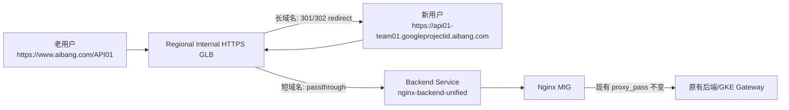
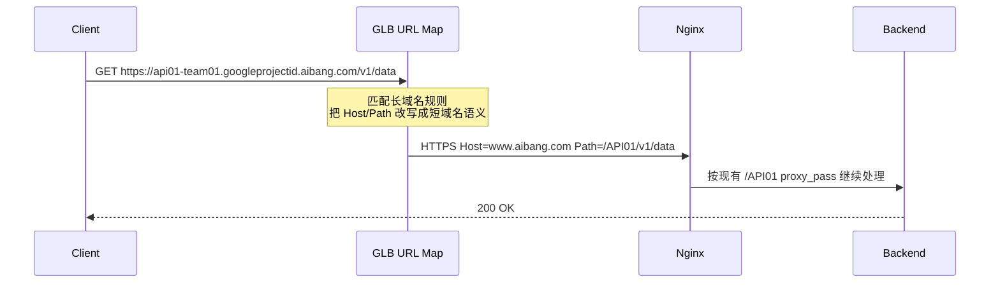

# GLB URL Map 合并实施方案：长域名重定向到短域名，Nginx 短域名配置保持不变

## 1. Goal and Constraints

### 核心目标

1. 保持 Nginx 现有短域名配置不变，例如：
   - `https://www.aibang.com/API01`
   - `https://www.aibang.com/API02`
2. 新增长域名入口，例如：
   - `https://api01-team01.googleprojectid.aibang.com`
   - `https://api02-team02.googleprojectid.aibang.com`
3. 所有长域名逻辑放在 GLB URL map 边缘层处理，不把长域名管理逻辑下沉到 Nginx。
4. 长域名访问后，优先在 GLB 层返回 `301/302 redirect` 到短域名。

### 结论先说

- 你的主方案可以成立，而且是最稳的 V1。
- Nginx 可以保持现有短域名 `location + proxy_pass` 逻辑不变。
- GLB 可以绑定多个证书。
- 可以新建一个 backend service 继续指向同一个 Nginx MIG。
- 如果“以前没显式管理 URL map”，也不是问题，因为 Target HTTPS Proxy 背后一定已经有一个 URL map，只是可能只有默认转发规则。
- 但有一个重要边界：GLB URL map 不能“动态提取 Host 前缀，再自动拼成 redirect path”。也就是说，不能靠一条纯动态规则把 `api01-team01.googleprojectid.aibang.com` 自动变成 `/API01` 或 `/api01-team01`。这部分仍然需要一份静态映射表，或者用脚本生成规则。

复杂度：`Moderate`

---

## 2. Recommended Architecture (V1)



### V1 设计原则

- 短域名流量：继续走原 Nginx。
- 长域名流量：在 GLB URL map 返回 redirect，不进入 Nginx。
- Backend service：可以新建一个 `nginx-backend-unified`，但仍然指向原来那组 Nginx 实例。
- URL map：一个短域名 matcher，一个长域名 matcher。
- 维护方式：维护一份 `长域名 FQDN -> 短域名 path` 映射表，然后生成 routeRules。

---

## 3. 直接回答你的三个问题

### 3.1 如何 update GLB 域名并绑定多个证书

结论：

- 在同一个 `target-https-proxy` 上绑定多个证书即可。
- GLB 会根据客户端 SNI 自动选证书。
- `update` 时要把“所有仍需保留的证书”一次性都带上，因为这个命令会覆盖原列表。

示例：

```bash
export PROJECT_ID="your-project-id"
export REGION="asia-east1"
export HTTPS_PROXY="prod-ilb-https-proxy"

gcloud compute ssl-certificates list \
  --project=${PROJECT_ID} \
  --region=${REGION}

gcloud compute target-https-proxies describe ${HTTPS_PROXY} \
  --project=${PROJECT_ID} \
  --region=${REGION} \
  --format="yaml(sslCertificates,urlMap)"

gcloud compute target-https-proxies update ${HTTPS_PROXY} \
  --project=${PROJECT_ID} \
  --region=${REGION} \
  --ssl-certificates=short-domain-cert,long-domain-wildcard-cert \
  --ssl-certificates-region=${REGION}
```

适用关系示例：

- `www.aibang.com` -> `short-domain-cert`
- `*.googleprojectid.aibang.com` -> `long-domain-wildcard-cert`

说明：

- 如果你是 Regional Internal HTTPS GLB，证书要用 regional SSL certificates。
- 如果要替换旧证书，先挂新证书，再移除旧证书，避免抖动。

### 3.2 如何创建新的 backend server 绑定到 Nginx，并参考原来运行中的那个

这里建议你理解成：创建一个新的 `backend service`，继续绑定原来的 Nginx MIG，而不是复制一套新 Nginx。

推荐原因：

- 最小变更。
- 不改 Nginx。
- URL map 可以逐步切换到新的 backend service。
- 回滚简单。

先看原配置：

```bash
export EXISTING_BS="prod-nginx-backend"

gcloud compute backend-services describe ${EXISTING_BS} \
  --project=${PROJECT_ID} \
  --region=${REGION} \
  --format=yaml
```

按原配置创建新的 backend service：

```bash
export NEW_BS="nginx-backend-unified"
export NGINX_MIG="nginx-mig"
export HC_NAME="nginx-https-hc"

gcloud compute backend-services create ${NEW_BS} \
  --project=${PROJECT_ID} \
  --region=${REGION} \
  --protocol=HTTPS \
  --port-name=https \
  --health-checks=${HC_NAME} \
  --health-checks-region=${REGION} \
  --load-balancing-scheme=INTERNAL_MANAGED \
  --timeout=30 \
  --connection-draining-timeout=300 \
  --enable-logging \
  --logging-sample-rate=1.0

gcloud compute backend-services add-backend ${NEW_BS} \
  --project=${PROJECT_ID} \
  --region=${REGION} \
  --instance-group=${NGINX_MIG} \
  --instance-group-region=${REGION} \
  --balancing-mode=UTILIZATION \
  --max-utilization=0.8

gcloud compute backend-services get-health ${NEW_BS} \
  --project=${PROJECT_ID} \
  --region=${REGION}
```

### 3.3 如果以前没通过 URL map 管理规则，现在怎么创建

关键点：

- 不是“从零开始”，而是“导出当前 URL map，再升级成高级规则版”。
- Target HTTPS Proxy 一定已经引用了某个 URL map。

先找到它：

```bash
gcloud compute target-https-proxies describe ${HTTPS_PROXY} \
  --project=${PROJECT_ID} \
  --region=${REGION} \
  --format="value(urlMap)"
```

导出当前 URL map：

```bash
export OLD_URL_MAP="prod-url-map"

gcloud compute url-maps export ${OLD_URL_MAP} \
  --project=${PROJECT_ID} \
  --region=${REGION} \
  --destination=/tmp/${OLD_URL_MAP}.yaml
```

生产建议：

- 不要直接原地改老 URL map。
- 新建一个 `url-map-v2`，验证通过后再切到 proxy。

---

## 4. URL Map 规则设计

## 4.1 映射模型

建议先固化一份映射表：

| 长域名 FQDN | 短域名目标 | 说明 |
| --- | --- | --- |
| `api01-team01.googleprojectid.aibang.com` | `https://www.aibang.com/API01` | 长域名 API01 |
| `api02-team02.googleprojectid.aibang.com` | `https://www.aibang.com/API02` | 长域名 API02 |

如果你后面想用“长域名 host 前缀 == 短域名 path”的模式，也可以：

| 长域名 FQDN | 短域名目标 |
| --- | --- |
| `api01-team01.googleprojectid.aibang.com` | `https://www.aibang.com/api01-team01` |
| `api02-team02.googleprojectid.aibang.com` | `https://www.aibang.com/api02-team02` |

这两种都支持。你只需要保证：

- 短域名 path 在 Nginx 上已经存在。
- 每个 path 的 `proxy_pass` 目标是唯一且明确的。

## 4.2 推荐的 URL map 形态

- `hostRules`
  - `www.aibang.com` -> `short-domain-matcher`
  - `*.googleprojectid.aibang.com` -> `long-domain-matcher`
- `pathMatchers`
  - `short-domain-matcher`: 默认直接到 `nginx-backend-unified`
  - `long-domain-matcher`: 用 `routeRules + headerMatches[Host]` 做长域名精确匹配并返回 redirect

原因：

- `hostRules` 的 wildcard 只能把一批 host 送到同一个 path matcher。
- 真正区分 `api01-team01` 和 `api02-team02`，要在 `routeRules` 里按 `Host` 头继续匹配。

---

## 5. 可直接使用的 URL Map YAML 示例

下面是适合你当前目标的 V1：短域名透传，长域名在 GLB 层 302/301 跳转。

说明：

- 对 HTTPS target proxy，不要在这个 redirect 里设置 `httpsRedirect: true`。
- 因为官方限制是：`httpsRedirect` 只能用于 `TargetHttpProxy`，不能用于 `TargetHttpsProxy`。
- 你的长域名本身就是 HTTPS 入口，所以这里直接改 `hostRedirect` 和 `prefixRedirect/pathRedirect` 就够了。

```yaml
kind: compute#urlMap
name: prod-url-map-v2
description: "short domain passthrough + long domain redirect to short domain"
defaultService: projects/YOUR_PROJECT_ID/regions/YOUR_REGION/backendServices/nginx-backend-unified

hostRules:
- hosts:
  - "www.aibang.com"
  pathMatcher: short-domain-matcher

- hosts:
  - "*.googleprojectid.aibang.com"
  pathMatcher: long-domain-matcher

pathMatchers:
- name: short-domain-matcher
  defaultService: projects/YOUR_PROJECT_ID/regions/YOUR_REGION/backendServices/nginx-backend-unified

- name: long-domain-matcher
  defaultUrlRedirect:
    hostRedirect: "www.aibang.com"
    pathRedirect: "/"
    redirectResponseCode: FOUND
    stripQuery: false
  routeRules:
  - priority: 10
    description: "api01-team01 root redirect"
    matchRules:
    - fullPathMatch: "/"
      headerMatches:
      - headerName: "Host"
        exactMatch: "api01-team01.googleprojectid.aibang.com"
    urlRedirect:
      hostRedirect: "www.aibang.com"
      pathRedirect: "/API01"
      redirectResponseCode: FOUND
      stripQuery: false

  - priority: 11
    description: "api01-team01 path redirect"
    matchRules:
    - prefixMatch: "/"
      headerMatches:
      - headerName: "Host"
        exactMatch: "api01-team01.googleprojectid.aibang.com"
    urlRedirect:
      hostRedirect: "www.aibang.com"
      prefixRedirect: "/API01/"
      redirectResponseCode: FOUND
      stripQuery: false

  - priority: 20
    description: "api02-team02 root redirect"
    matchRules:
    - fullPathMatch: "/"
      headerMatches:
      - headerName: "Host"
        exactMatch: "api02-team02.googleprojectid.aibang.com"
    urlRedirect:
      hostRedirect: "www.aibang.com"
      pathRedirect: "/API02"
      redirectResponseCode: FOUND
      stripQuery: false

  - priority: 21
    description: "api02-team02 path redirect"
    matchRules:
    - prefixMatch: "/"
      headerMatches:
      - headerName: "Host"
        exactMatch: "api02-team02.googleprojectid.aibang.com"
    urlRedirect:
      hostRedirect: "www.aibang.com"
      prefixRedirect: "/API02/"
      redirectResponseCode: FOUND
      stripQuery: false
```

### 为什么这里先建议 `302`

建议上线初期先用：

- `FOUND` = 302

原因：

- 便于验证。
- 出问题客户端缓存影响更小。
- 确认稳定后再改成 `MOVED_PERMANENTLY_DEFAULT` = 301，或者 `PERMANENT_REDIRECT` = 308。

---

## 6. 如果你要改成“长域名 host 前缀 -> 同名短路径”

比如：

- `api01-team01.googleprojectid.aibang.com` -> `https://www.aibang.com/api01-team01`
- `api02-team02.googleprojectid.aibang.com` -> `https://www.aibang.com/api02-team02`

YAML 只需把 path 改掉：

```yaml
  - priority: 10
    description: "api01-team01 root redirect"
    matchRules:
    - fullPathMatch: "/"
      headerMatches:
      - headerName: "Host"
        exactMatch: "api01-team01.googleprojectid.aibang.com"
    urlRedirect:
      hostRedirect: "www.aibang.com"
      pathRedirect: "/api01-team01"
      redirectResponseCode: FOUND
      stripQuery: false

  - priority: 11
    description: "api01-team01 path redirect"
    matchRules:
    - prefixMatch: "/"
      headerMatches:
      - headerName: "Host"
        exactMatch: "api01-team01.googleprojectid.aibang.com"
    urlRedirect:
      hostRedirect: "www.aibang.com"
      prefixRedirect: "/api01-team01/"
      redirectResponseCode: FOUND
      stripQuery: false
```

这正好符合你的“长域名有统一 pattern，短域名 path 有固定 location path”的思路。

---

## 7. 能不能只写一条通配规则，让 GLB 自动把 Host 转成 Path

短答案：`不能完全动态。`

你期待的是这种能力：

- 输入：`api01-team01.googleprojectid.aibang.com`
- 自动提取：`api01-team01`
- 自动拼接：`https://www.aibang.com/api01-team01`

GLB URL map 原生不支持这一点，原因是：

- `hostRules` 只能做 host 匹配，不提供 host 变量提取后再拼接到 redirect path。
- `pathTemplateMatch/pathTemplateRewrite` 的变量能力只针对 path，不针对 host。
- `urlRedirect` 和 `urlRewrite` 里的目标值本质上是静态配置，不是表达式引擎。

所以纯 GLB 模式下，现实可落地的方式是：

1. 一条 wildcard hostRule 承接所有长域名。
2. 每个长域名单独一条 routeRule。
3. 用脚本根据映射表生成 YAML，避免手工维护。

这已经是最接近“边缘全托管”的实现了。

---

## 8. 推荐的自动化生成方式

维护一个映射文件，例如：

```yaml
mappings:
  - host: api01-team01.googleprojectid.aibang.com
    short_path: /API01
  - host: api02-team02.googleprojectid.aibang.com
    short_path: /API02
```

然后生成 `routeRules`。下面给一个极简 Python 示例：

```python
#!/usr/bin/env python3
import yaml

mappings = [
    {"host": "api01-team01.googleprojectid.aibang.com", "short_path": "/API01"},
    {"host": "api02-team02.googleprojectid.aibang.com", "short_path": "/API02"},
]

rules = []
priority = 10

for item in mappings:
    host = item["host"]
    short_path = item["short_path"]

    rules.append({
        "priority": priority,
        "description": f"{host} root redirect",
        "matchRules": [{
            "fullPathMatch": "/",
            "headerMatches": [{
                "headerName": "Host",
                "exactMatch": host,
            }],
        }],
        "urlRedirect": {
            "hostRedirect": "www.aibang.com",
            "pathRedirect": short_path,
            "redirectResponseCode": "FOUND",
            "stripQuery": False,
        },
    })

    rules.append({
        "priority": priority + 1,
        "description": f"{host} path redirect",
        "matchRules": [{
            "prefixMatch": "/",
            "headerMatches": [{
                "headerName": "Host",
                "exactMatch": host,
            }],
        }],
        "urlRedirect": {
            "hostRedirect": "www.aibang.com",
            "prefixRedirect": f"{short_path}/",
            "redirectResponseCode": "FOUND",
            "stripQuery": False,
        },
    })

    priority += 10

print(yaml.safe_dump(rules, sort_keys=False))
```

生产建议：

- 把映射文件放 Git。
- PR 审核映射。
- CI 自动生成 URL map YAML。
- 先 `validate` 再 `import`。

---

## 9. 导入、切换、验证、回滚

## 9.1 导入新 URL map

```bash
export URL_MAP_V2="prod-url-map-v2"

gcloud compute url-maps import ${URL_MAP_V2} \
  --project=${PROJECT_ID} \
  --region=${REGION} \
  --source=/tmp/prod-url-map-v2.yaml
```

## 9.2 切换 Target HTTPS Proxy 到新 URL map

```bash
gcloud compute target-https-proxies update ${HTTPS_PROXY} \
  --project=${PROJECT_ID} \
  --region=${REGION} \
  --url-map=${URL_MAP_V2} \
  --url-map-region=${REGION}
```

## 9.3 验证

先做控制面验证：

```bash
gcloud compute url-maps validate \
  --project=${PROJECT_ID} \
  --region=${REGION} \
  --source=/tmp/prod-url-map-v2.yaml
```

再做数据面验证：

```bash
curl -k -I --resolve api01-team01.googleprojectid.aibang.com:443:ILB_IP \
  https://api01-team01.googleprojectid.aibang.com/

curl -k -I --resolve api01-team01.googleprojectid.aibang.com:443:ILB_IP \
  "https://api01-team01.googleprojectid.aibang.com/v1/health?x=1"
```

预期：

- 第一条返回 `302` 或 `301`
- `Location: https://www.aibang.com/API01`
- 第二条返回 `Location: https://www.aibang.com/API01/v1/health?x=1`

再验证短域名原链路：

```bash
curl -k -I --resolve www.aibang.com:443:ILB_IP \
  https://www.aibang.com/API01
```

预期：

- 短域名仍正常命中原 Nginx proxy_pass

## 9.4 回滚

```bash
gcloud compute target-https-proxies update ${HTTPS_PROXY} \
  --project=${PROJECT_ID} \
  --region=${REGION} \
  --url-map=${OLD_URL_MAP} \
  --url-map-region=${REGION}
```

回滚设计要点：

- 先保留旧 URL map。
- 不删旧 backend service。
- 先用 `302`，稳定后再升 `301/308`。

---

## 10. Nginx 需要做什么调整

## 10.1 你的主方案下：基本不需要调整

如果你采用“长域名只在 GLB redirect，短域名继续走原链路”，那么：

- 不需要在 Nginx 增加长域名 `server_name`
- 不需要在 Nginx 增加长域名 `location`
- 不需要修改已有 `proxy_pass`

你只需要确认：

1. 短域名 path 已存在。
2. 这些 path 的后端逻辑可正常工作。
3. Health check 不受影响。

### 例子 1：保留原有 API01

```nginx
server {
    listen 443 ssl;
    server_name www.aibang.com;

    location /API01 {
        proxy_pass https://gke-gateway.intra.aibang.com:443;
        proxy_set_header Host www.aibang.com;
        proxy_set_header X-Real-IP $remote_addr;
        proxy_set_header X-Forwarded-For $proxy_add_x_forwarded_for;
    }
}
```

长域名 `api01-team01.googleprojectid.aibang.com` 不需要在 Nginx 出现。

### 例子 2：保留原有 API02

```nginx
server {
    listen 443 ssl;
    server_name www.aibang.com;

    location /API02 {
        proxy_pass https://gke-gateway.intra.aibang.com:443;
        proxy_set_header Host www.aibang.com;
        proxy_set_header X-Real-IP $remote_addr;
        proxy_set_header X-Forwarded-For $proxy_add_x_forwarded_for;
    }
}
```

## 10.2 如果你后面想把“所有控制都放在 URL map”

这是另一个方向，不再是 redirect，而是 transparent rewrite：

- GLB 把 Host 改写成 `www.aibang.com`
- GLB 把 path 改写成 `/API01/...`
- 客户端浏览器地址栏不变
- 请求继续发给 Nginx 或直接给后端

这个方案能做，但不再是“用户看到跳转”，而是“用户无感知”。

风险点：

- 后端如果返回绝对跳转、绝对 URL、CORS 头、Set-Cookie Domain，可能暴露短域名语义。
- 排障复杂度高于 redirect 方案。

所以对你当前目标，我不建议把 transparent rewrite 作为 V1。

---

## 11. Trade-offs and Alternatives

### 推荐方案：GLB redirect，Nginx 不动

优点：

- 最符合你的核心目标。
- Nginx 零改动。
- 风险最低。
- 回滚最简单。

缺点：

- 每个长域名仍需一条映射规则。
- 如果长域名很多，需要自动化生成 URL map。

### 备选方案：GLB transparent rewrite

优点：

- 用户地址栏不变。
- 仍可把长域名逻辑放在 GLB。

缺点：

- 行为比 redirect 更隐蔽，排障更难。
- 对后端返回头和应用行为有额外要求。

### 不推荐方案：让 Nginx 处理长域名映射

原因：

- 违背你的核心约束。
- 长域名规则会回流到 Nginx，维护边界变差。

---

## 12. Handoff Checklist

- [ ] 确认当前 `target-https-proxy` 名称、URL map 名称、backend service 名称。
- [ ] 确认短域名证书和长域名泛证书都已上传到同一区域。
- [ ] 用新 backend service `nginx-backend-unified` 指向原 Nginx MIG。
- [ ] 准备长域名到短域名 path 的映射表。
- [ ] 生成 `prod-url-map-v2.yaml`。
- [ ] `url-maps validate` 通过。
- [ ] Proxy 先切到 `302` 版本验证。
- [ ] curl 验证 `Location`、query string、路径拼接。
- [ ] 确认老短域名链路无回归。
- [ ] 稳定后将 `FOUND` 改成 `MOVED_PERMANENTLY_DEFAULT` 或 `PERMANENT_REDIRECT`。

---

## 13. 官方能力边界摘要

基于 Google Cloud 官方文档，可确认以下几点：

- 同一个 target HTTPS proxy 可以挂多个 SSL 证书。
- `--ssl-certificates` 更新时会覆盖原列表，因此必须把旧证书和新证书一起写上。
- URL map 的 `urlRedirect` 支持 `hostRedirect`、`pathRedirect`、`prefixRedirect`。
- `pathRedirect` 和 `prefixRedirect` 不能同时使用。
- `httpsRedirect` 只能用于 `TargetHttpProxy`，不能用于 `TargetHttpsProxy`。
- URL map 的变量重写能力主要针对 path，不支持从 host 中捕获变量再拼接 redirect path。

官方参考：

- [URL maps overview](https://docs.cloud.google.com/load-balancing/docs/url-map-concepts)
- [Use self-managed SSL certificates](https://docs.cloud.google.com/load-balancing/docs/ssl-certificates/self-managed-certs)
- [gcloud compute target-https-proxies update](https://cloud.google.com/sdk/gcloud/reference/compute/target-https-proxies/update)
- [urlMaps REST reference](https://docs.cloud.google.com/compute/docs/reference/rest/v1/urlMaps)

---

## 14. 追加探索：如果用户希望浏览器地址栏保持长域名，当前方案能否实现

你补充的这个点很关键。

### 先给直接结论

- 如果采用前面文档里的 `301/302/307/308 redirect` 方案，浏览器地址栏一定会变成短域名。
- 也就是说：
  - `https://api01-team01.googleprojectid.aibang.com/...`
  - 一旦被 GLB 返回 redirect
  - 浏览器后续访问的就是 `https://www.aibang.com/...`
  - 地址栏不可能继续保持长域名
- 所以，“重定向后仍保持长域名显示”这个需求，`redirect` 方案本身做不到。

### 为什么做不到

因为 redirect 的语义就是：

- 服务端返回 `Location: https://www.aibang.com/API01/...`
- 浏览器收到后，发起一个新的请求到短域名
- 浏览器地址栏自然更新为新的目标 URL

所以：

- `redirect` = 客户端可见跳转
- `rewrite/proxy` = 客户端不可见，地址栏保持原 URL

这两者不能混用概念。

---

## 15. 如果必须保持长域名不变，正确方向是什么

如果你的 API 平台用户更期待：

- 入口是长域名
- 地址栏始终是长域名
- 但后端仍复用原来的短域名 path 逻辑

那么应该用的不是 `redirect`，而是：

- `GLB URL map transparent rewrite`
- 或更准确地说：`Host/Path rewrite + backend proxy`

流量模型会变成：



这个模式下：

- 用户浏览器里看到的仍然是长域名
- Nginx 看到的可以是短域名 + 短路径语义
- 原有 Nginx 的 `location /API01`、`location /API02` 可以继续复用

---

## 16. 这会不会有 CORS 问题

要分两层看。

### 16.1 对“纯浏览器地址栏访问”场景

如果用户是直接访问：

- `https://api01-team01.googleprojectid.aibang.com/...`

并且 GLB 在边缘把请求反向代理到后端，而不是返回 redirect，那么：

- 浏览器视角的 origin 仍然是长域名
- 这不是跨域跳转
- 单纯因为“后端内部复用了短域名语义”并不会自动触发 CORS

也就是说：

- `redirect` 方案：地址栏变短域名，通常不会有 CORS 问题
- `transparent rewrite` 方案：地址栏保持长域名，也不一定天然有 CORS 问题

### 16.2 真正要小心的是这些问题

如果你保持长域名不变，风险点主要不在 GLB，而在后端响应行为：

1. 后端返回绝对跳转
   - 例如返回 `Location: https://www.aibang.com/login`
   - 浏览器会被带去短域名

2. 后端返回绝对 URL
   - 例如 HTML、JS、OpenAPI 文档里写死 `https://www.aibang.com/...`
   - 用户会感知到短域名

3. Cookie Domain 写死短域名
   - 例如 `Set-Cookie: Domain=www.aibang.com`
   - 长域名请求下可能不符合预期

4. CORS 白名单只允许短域名
   - 如果浏览器页面 origin 是长域名，而 JS 再请求别的 API
   - 后端若只允许 `https://www.aibang.com`
   - 就会出现真正的 CORS 拒绝

所以结论是：

- “保持长域名不变”不是不能做
- 但你要验证的不只是 URL map
- 还要验证应用返回头、重定向头、Cookie、OpenAPI/Swagger、前端资源引用

---

## 17. 基于你当前目标，哪种方案更匹配

### 方案 A：301/302 redirect 到短域名

特点：

- 最稳
- Nginx 零改动
- 用户最终看到短域名
- 基本没有“长域名保持不变”的能力

适合：

- 你只关心接入成功
- 不在意地址栏是否变成短域名
- 想把风险压到最低

### 方案 B：GLB transparent rewrite，浏览器保持长域名

特点：

- 用户地址栏保持长域名
- 仍可尽量复用 Nginx 原有短域名 path 逻辑
- 比 redirect 方案更符合 API 平台统一域名入口的体验
- 但验证面更大

适合：

- 你明确希望“用户看到的永远是长域名”
- 可以接受做一轮响应头/Cookie/绝对 URL/CORS 校验

---

## 18. 在你的现有约束下，这个需求能不能实现

答案是：`可以，但不能靠 redirect；要改成 rewrite/proxy 模式。`

更具体一点：

### 18.1 如果坚持“所有长域名逻辑都在 GLB”

这是可以探索的。

实现思路：

1. 长域名命中 GLB 的 `*.googleprojectid.aibang.com`
2. 在 `routeRules` 中按不同 Host 匹配
3. 对每个 Host 做：
   - `urlRewrite.hostRewrite: www.aibang.com`
   - `urlRewrite.pathPrefixRewrite: /API01` 或 `/api01-team01`
4. 然后继续转发到原来的 Nginx backend service

这样：

- 客户端 URL 不变
- Nginx 仍然收到它熟悉的短域名语义

### 18.2 但仍有一个现实限制

即使是 rewrite 方案，GLB 也不能只靠一条动态规则自动从 Host 提取变量拼到 path。

所以你仍然需要：

- 每个长域名一条 routeRule
- 或者一份映射表自动生成 routeRules

换句话说：

- “保持长域名不变”可以实现
- “用一条纯动态 GLB 规则处理所有长域名”仍然做不到

---

## 19. 如果后面要走“长域名保持不变”，推荐的实施顺序

建议顺序：

1. 先用 `302 redirect` 跑通一两个 API，验证域名映射关系和证书、URL map、backend service 都正确。
2. 再选一个 API 做 `transparent rewrite` PoC。
3. 验证以下项目：
   - 返回状态码是否正常
   - 响应头里是否出现短域名
   - 是否有 `Location` 绝对跳转
   - 是否有 `Set-Cookie Domain=www.aibang.com`
   - OpenAPI/Swagger 页面是否暴露短域名
   - 浏览器 fetch/XHR 是否触发 CORS
4. 通过后，再批量把长域名从 redirect 迁到 rewrite。

这个顺序的原因是：

- redirect 方案是最稳的基线
- rewrite 方案是体验更好但验证更重的进阶版

---

## 20. 本段结论

针对你新增的问题，可以归纳成一句话：

- 如果你要“浏览器地址栏保持长域名”，那就不能使用 301/302 redirect。
- 你需要的是 GLB 上的 transparent rewrite/proxy，而不是 redirect。
- 在你的架构里，这个需求是有机会实现的，而且仍然可以尽量保持 Nginx 现有短域名 path 逻辑不变。
- 但 GLB 仍然无法把任意长域名通过一条动态规则自动映射成短路径，所以最终还是要维护一份 `长域名 -> 短路径` 映射表，最好用脚本自动生成 URL map。
