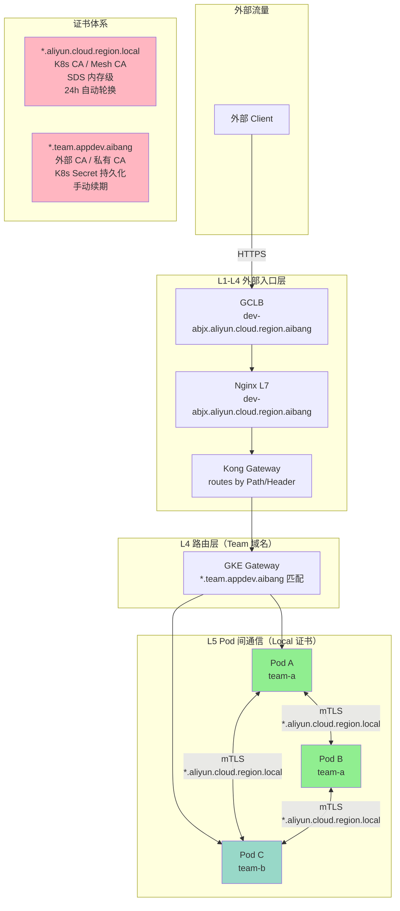

# Pod 间 Local 证书替代方案评估报告

> **评估目标**：是否将 Pod 间通信使用的 `*.aliyun.cloud.region.local` 证书替换为 Team 级别证书 `*.team.appdev.aibang`
> **存放路径**：`safe/ssl/docs/claude/` 目录

---

## 1. 当前架构梳理

### 1.1 流量层级与证书对应关系

| 层级 | 组件 | 侦听域名 / SNI | 证书类型 | 证书主体 |
|------|------|---------------|----------|----------|
| **L1** | GCLB（外部入口） | `dev-abjx.aliyun.cloud.region.aibang` | GLB 层证书 | 统一入口域名 |
| **L2** | Nginx（统一入口） | `dev-abjx.aliyun.cloud.region.aibang` | 同上，统一证书 | 统一入口域名 |
| **L3** | Kong Gateway | 基于 Path / Header 路由 | — | — |
| **L4** | GKE Gateway / Kong Routes | 各 Team 的 `*.team.appdev.aibang` | — | — |
| **L5** | Pod 间通信 | `*.aliyun.cloud.region.local` | **Local 证书** | Kubernetes 内部域名 |
| **L6** | Kong DP / Runtime Pod | 接收来自上层的流量 | — | — |

### 1.2 当前 Pod 间 mTLS 使用的证书

```
CN / SAN: *.aliyun.cloud.region.local
用途: Pod 之间的双向 TLS 加密
特点: Kubernetes 内部自签名 CA 签发，Cluster 内全局生效
```

### 1.3 Team 级别证书（待评估替换目标）

```
CN / SAN: *.team.appdev.aibang
用途: 外部客户端访问各 Team 服务的域名
特点: 可能是公共 CA 或私有 CA 签发，与团队域名对应
```

---

## 2. 核心问题建模

### 2.1 两套证书体系各自的职责

**Local 证书体系（当前）**：
- 覆盖：`*.aliyun.cloud.region.local`
- 签发者：Kubernetes 内部 CA（e.g., Kubernetes CA / Istio Mesh CA）
- 生命周期：通常短（24h，自动轮换）
- 使用场景：**所有 Pod 间通信，不区分 Team**

**Team 域名证书体系（外部入口）**：
- 覆盖：`*.team.appdev.aibang`
- 签发者：可能是公共 CA 或私有 CA
- 生命周期：通常长（90d - 1y，手动续期）
- 使用场景：**L4 以上的路由匹配（外部 → 网关 → Team 服务）**

### 2.2 关键差异点

| 维度 | Local 证书 `*.local` | Team 证书 `*.team.*` |
|------|---------------------|---------------------|
| **域名层级** | `*.aliyun.cloud.region.local` | `*.team.appdev.aibang` |
| **签发 CA** | K8s 内部 CA | 公共 CA 或私有 CA |
| **作用范围** | Pod ↔ Pod（集群内部） | 外部入口 → Team 服务 |
| **自动化程度** | 高（SDS/API 自动签发） | 低（通常手动管理） |
| **轮换周期** | 短（24h，自动） | 长（季度/年，手动） |
| **可辨识性** | 低（只有 `.local` 后缀） | 高（包含 Team 名字） |
| **SNI 匹配** | Pod DNS 名称 | 外部客户访问域名 |
| **安全要求** | 公司内部强制要求 | 公司内部强制要求 |

---

## 3. 替代方案的评估维度

### 3.1 安全性维度

#### 替代（使用 Team 证书）

| 风险点 | 分析 | 评级 |
|--------|------|------|
| **私钥管理** | Team 证书的私钥需要存在于每个 Pod 中。如果 Pod 被入侵，私钥暴露影响面是跨 Team 的（所有使用同一证书的 Pod）。 | ⚠️ 中高风险 |
| **证书影响范围** | `*.team.appdev.aibang` 如果泄漏，影响所有 Team 的 Pod 间通信，比 `.local` 的爆炸半径更大（因为 `.local` 仅限集群内部）。 | ⚠️ 高风险 |
| **CA 信任链** | Team 证书如果是公共 CA 签发，外部 CA 的私钥完全不在平台控制内，Pod 无法自动轮换，私钥泄漏无法撤销。 | ⚠️ 高风险 |
| **私钥存储** | Local 证书通常通过 SDS 在内存中传递，不落盘。Team 证书如果要持久化到 Secret（K8s Secret 存储），则落盘存在 etcd 中，风险更高。 | ⚠️ 高风险 |

#### 不替代（保持 Local 证书）

| 风险点 | 分析 | 评级 |
|--------|------|------|
| **内部威胁** | `.local` 证书虽然是内部 CA，但如果攻击者进入集群，仍然可以横向移动。 | ✅ 可接受 |
| **自动化安全** | SDS 动态签发，私钥不落盘，轮换自动化，泄漏窗口小。 | ✅ 低风险 |

**结论**：从安全角度，**Local 证书体系更优**，因为它实现了自动化、短生命周期、内存级私钥管理，不替代更能维持安全水位。

---

### 3.2 运维复杂度维度

#### 替代方案带来的运维负担

1. **证书生命周期管理**
   - Local 证书：Kubernetes CA 自动签发、自动轮换（约 24h）、无需人工干预。
   - Team 证书：需要手动续期（季度/年），每次续期需要重新部署到 Pod。

2. **跨 Team 密钥分发**
   - 如果用同一张 `*.team.appdev.aibang` 证书，需要将私钥注入到所有 Team 的 Pod 中。
   - K8s Secret 虽然加密存储在 etcd，但 Secret 数量增长、跨 Namespace 分发的操作复杂度上升。

3. **证书吊销**
   - Local 证书：CA 可即时吊销，Envoy 通过 SDS 推送更新。
   - Team 证书：如果是公共 CA 签发，吊销流程复杂且不一定实时生效。

4. **多证书管理**
   - 每个 Team 一张证书？还是共用一张大证书？
   - 如果每个 Team 独立证书，证书数量 = Team 数量，运维复杂度线性增长。

**结论**：从运维角度，**Local 证书体系更优**，不替代减少大量人工操作和手工续期风险。

---

### 3.3 可观测性维度

#### 替代可能带来的可观测性收益

| 收益项 | 说明 | 实际价值 |
|--------|------|----------|
| **Pod 身份可读性** | 使用 Team 证书时，Pod 间 TLS 握手的 SAN 中会包含 Team 信息（例如 `api-team-a-xxx.team.appdev.aibang`）。如果 Local 证书用的是 Pod IP 或内部 hash，则 Team 证书可让抓包分析更容易。 | ⚠️ 有限（抓包调试本身是低频操作） |
| **调试便利性** | 如果证书 CN 中包含 Team 名称，排查问题时可以更快定位到具体 Team。 | ⚠️ 有限（现有日志 + Mesh 可追踪性更有效） |

**结论**：可观测性收益有限，不是一个强替代理由。

---

### 3.4 架构一致性维度

#### 用户的架构考量

用户可能希望通过统一使用 `*.team.appdev.aibang` 证书，实现：

```
外部访问: *.team.appdev.aibang  (客户可见)
Pod 间通信: *.team.appdev.aibang  (内部也用同一套域名)
```

**这个思路的优点**：
- 证书体系统一，减少维护两套证书的认知负担。
- Pod 间通信的 SNI 和外部访问的 SNI 一致，调试体验一致。

**这个思路的问题**：

1. **Pod 间通信无法使用外部可达的 Team 域名**
   - Pod 的 DNS 名称通常是 `<service>.<namespace>.svc.cluster.local`
   - 不是 `*.team.appdev.aibang`（这是外部可解析的域名）
   - 如果 Pod 用 `*.team.appdev.aibang` 作为 SNI，Kubernetes DNS 无法解析。
   - 必须额外配置 DNS 负反向解析（Split-horizon DNS）才能工作，**引入额外的运维复杂度**。

2. **证书与 Pod 身份绑定问题**
   - `*.team.appdev.aibang` 是"Team 级别"的，不是"Pod 级别"的。
   - Pod 的身份应该是 `pod-xxx.team-a.appdev.aibang`，而不是 `*.team.appdev.aibang`。
   - 这意味着需要一个"包含所有 Pod 域名"的大 SAN 列表，和 Local 证书体系一样面临管理问题。

3. **跨集群场景**
   - 如果有多套环境（dev/staging/prod），不同集群的 Pod 可能有不同的内部域名。
   - 统一使用 Team 证书会增加跨集群证书管理的复杂度。

**结论**：从架构一致性角度，**统一域名看起来美好，但实际落地会遇到 DNS 解析、证书 SAN 范围界定、跨集群管理三重障碍**。不替代更务实地避免了这些问题。

---

### 3.5 合规与公司要求维度

用户提到"公司要求内部 Pod 之间也需要加密"。这意味着：

| 要求 | Local 证书满足？ | Team 证书满足？ |
|------|----------------|----------------|
| Pod 间强制 HTTPS | ✅ 满足（mTLS 自动开启） | ✅ 满足（需要手动配置） |
| 证书由公司内部 CA 管理 | ✅ 满足（K8s CA / Mesh CA） | ❌ 通常是外部 CA 或手工私有 CA |
| 自动轮换 | ✅ 满足（SDS 自动） | ❌ 通常需要手动续期 |
| 私钥不落盘 | ✅ 满足（SDS 内存） | ❌ 如果用 K8s Secret 则落盘 |

**结论**：Local 证书体系天然满足公司内部安全要求，Team 证书体系反而可能不满足"内部 CA 管理"和"自动轮换"的要求。

---

### 3.6 域名建模与 Egress 映射维度

#### 3.6.1 如果 Pod 间使用 `*.team.appdev.aibang`，DNS 怎么设计？

如果 Pod 间通信强制使用 Team 证书，Pod 和 Service 需要有一个与证书 SAN 匹配的 DNS 名称。以下是三种可能的命名方案对比：

##### 方案 A：直接映射 K8s Service 名称（推荐度：⚠️ 低）

```
K8s Service:  api-svc.team-a.svc.cluster.local
期望 SNI:    api-svc.team-a.appdev.aibang
```

**问题**：K8s 内部 DNS（CoreDNS）只认 `svc.cluster.local`，不认 `appdev.aibang`。要让它解析 `api-svc.team-a.appdev.aibang`，必须配置 **Split-horizon DNS**：

- Cloud DNS 层：给 `appdev.aibang` 配置一个"内部视图"，只供集群内解析
- 集群内部：CoreDNS 转发 `*.team.appdev.aibang` 到 Cloud DNS 内部端点
- 集群外部：同一个域名解析到 GCLB 公网 IP

**这引入了额外的 DNS 运维复杂度**，且 DNS 解析和 TLS 证书校验必须严格对齐，否则 TLS 握手失败。

##### 方案 B：Pod 级别直接用 Team 域名作为 hostname

```yaml
# Pod spec
hostname: api-svc-team-a
subdomain: team-a
# FQDN: api-svc-team-a.team-a.svc.cluster.local
# 但证书需要: api-svc-team-a.team-a.appdev.aibang
```

这和方案 A 面临同样的 DNS 解析问题。K8s 的 `hostname + subdomain` 组合生成的是 `<hostname>.<subdomain>.svc.cluster.local`，和外部 Team 域名不在同一个命名空间。需要通过 StatefulSet 的 `hostname` 字段配合 Headless Service，但这仍然是 `cluster.local` 下的一个子域名。

##### 方案 C：通过 Istio ServiceEntry 显式声明（推荐度：⚠️ 中）

在 Istio/ASM 环境中，可以通过 `ServiceEntry` 将外部 Team 域名注册到服务注册表：

```yaml
apiVersion: networking.istio.io/v1
kind: ServiceEntry
metadata:
  name: team-a-api-svc
  namespace: team-a
spec:
  hosts:
    - api-svc.team-a.appdev.aibang
  ports:
    - number: 443
      name: https
      protocol: HTTPS
  location: MESH_INTERNAL
  resolution: DNS
```

**优点**：Istio 可以管理内部服务到外部 Team 域名的映射，无需改动 K8s DNS。
**缺点**：
- 每个 Service 都要写 ServiceEntry，N 个 Pod = N 个 ServiceEntry，运维量大
- ServiceEntry 的 `hosts` 字段必须和证书 SAN 完全对齐，漏配则 TLS 失败
- 本质上只是"绕过 DNS"的 workaround，并没有解决证书和 DNS 的语义对齐问题

##### 核心问题：证书下沉与 DNS 语义的语义冲突

| 层级 | K8s 原生 DNS 名称 | Team 证书期望的 SNI |
|------|------------------|-------------------|
| ClusterService | `api-svc.ns.svc.cluster.local` | ❌ 不匹配 |
| Pod FQDN | `pod-xxx.ns.pod.cluster.local` | ❌ 不匹配 |
| Istio ServiceEntry | 手动注册任意名称 | ✅ 可匹配，但需手动维护 |

**结论**：如果 Pod 间使用 Team 证书，必须同时引入 Split-horizon DNS 或 Istio ServiceEntry 来维护一张"域名映射表"，将 `*.team.appdev.aibang` 映射到集群内部的 K8s Service。这张映射表本身就是运维负担，和 Local 证书体系的"零配置"相比是倒退。

---

#### 3.6.2 Egress 流量：外部地址与内部地址的映射关系

当 Pod 需要对外（Egress）发起请求时，会遇到一个关键问题：**内部域名 vs 外部域名的 TLS 证书校验不一致**。

**场景描述**：

```
Pod A (team-a) 想要调用 Pod B (team-b) 的 API

内部视角（Pod → Pod）：
  SNI 发送: api-svc.team-b.svc.cluster.local
  证书期望: api-svc.team-b.appdev.aibang  ❌ SAN 不匹配

外部视角（如果用 Team 域名）：
  SNI 发送: api-svc.team-b.appdev.aibang
  DNS 解析: 集群内部无法解析  ❌ DNS 找不到
```

**这形成了"双向不匹配"问题**：
- 发内部 K8s DNS（SNI = `*.svc.cluster.local`）：外部证书 `*.team.appdev.aibang` 不匹配
- 发外部 Team 域名（SNI = `*.team.appdev.aibang`）：内部 DNS 解析不了

**解决方案：DNS 映射 + 证书 SAN 双重对齐**

需要在 DNS 层面建立映射：

```
内部解析（集群内）:
  api-svc.team-b.appdev.aibang → 集群内部 Pod IP
  (通过 Cloud DNS 内部视图 或 CoreDNS 转发实现)

外部解析（集群外）:
  api-svc.team-b.appdev.aibang → GCLB 公网 IP 或内部 LB IP
```

同时证书的 SAN 列表必须包含这个域名：

```
SAN: api-svc.team-b.appdev.aibang
```

**运维代价**：
1. 每增加一个 Service，需要同时更新：
   - DNS 记录（内部视图）
   - 证书 SAN 列表（或新增 Certificate Map Entry）
   - 可能还需要 ServiceEntry（如果用 Istio）
2. 证书续期时，SAN 列表必须同步更新，否则某个 Service 会 TLS 失败
3. DNS 传播延迟可能导致新 Service 上线时短暂 TLS 失败

**Local 证书体系的天然优势**：
- Pod 间通信的 SNI = K8s 原生 DNS 名称
- DNS 解析由 K8s 自动管理，无需手动配置
- 证书由 K8s CA 自动签发，SNI 自动匹配 Pod DNS
- **零额外 DNS 配置，零额外证书管理**

---

### 3.7 证书下沉与 Header 控制能力维度

#### 用户的核心洞察（关键评估点）

> **证书越下沉到最终的 Pod 层，对 Header 的转写和控制就越难做，必须在 Gateway 层强制完成一次 Header 转写。**

这是一个非常重要的架构观察，可以用以下模型理解：

#### 3.7.1 流量平面与控制平面的分离

```
证书层级越低（靠近 Pod）
    ↓
Pod 对 TLS 握手的控制权越大
    ↓
Header（Host / Authorization / X-Forwarded-* 等）的修改必须在 Pod 层完成
    ↓
Gateway 对 Header 的感知能力下降
    ↓
平台在 Gateway 层做统一策略（限流、鉴权、日志）的难度增加
```

#### 3.7.2 Local 证书体系下的 Header 控制

```
Client
  ↓ (Host: api.team-a.appdev.aibang)
GCLB / Nginx (统一入口)
  ↓ (Header 已转写：X-Team: team-a, X-User: xxx)
Kong Gateway (插件执行)
  ↓ (Header 已固化：Authorization, team-id)
GKE Gateway (路由)
  ↓ (已带完整上下文)
Pod (mTLS 终止)
  ↓ (Pod 收到的是已处理的 Header，Pod 本身不需要改写)
  ↓ (Local 证书 *.aliyun.cloud.region.local 仅用于加密，不涉及 Header)
```

**关键点**：在 Local 证书体系下，Pod 只需要关心"数据加解密"，Header 的生成、转发、注入全部在 Gateway 层完成。Pod 的职责单一，Gateway 的控制能力强。

#### 3.7.3 Team 证书体系下的 Header 控制（问题）

```
Client
  ↓ (Host: api.team-a.appdev.aibang)
GCLB / Nginx
  ↓ (Header 转写)
Kong Gateway
  ↓ (这里 Pod 需要 TLS 终止，但证书是 *.team.appdev.aibang)
  ↓ (Pod 收到 TLS 流量后，需要自行处理 SNI → Host 的映射)
  ↓ (如果 Pod 直接透传 TLS，Host 头可能被客户端直接控制)
  ↓ (平台无法在 Gateway 层统一控制 Header，因为 TLS 已在 Pod 层终止)
Pod (Team 证书终止)
  ↓ (Pod 需要自己解析：收到的 SNI = api.team-a.appdev.aibang)
  ↓ (Pod 需要自行判断：这个请求属于哪个 Team，如何设置 X-Team)
  ↓ (Pod 职责膨胀：不仅要处理业务，还要做 Header 语义关联)
```

**问题分析**：

1. **TLS 终止后 Header 控制权丢失**
   - Team 证书在 Pod 层终止 TLS，意味着 Pod 拿到了解密后的明文 HTTP
   - 如果 Pod 只是透传（proxy_pass），那 Header 控制还在 Gateway
   - 但如果 Pod 需要"基于 SNI 做路由"（例如同一个 Port 上跑多个 Team 的服务），则 Pod 必须解析 Host 头
   - 这时候 Pod 的职责从"业务处理"膨胀到"流量治理"

2. **Gateway 无法感知 Team 上下文**
   - Gateway 发出的请求带 `X-Team: team-a`，但 TLS 终止在 Pod
   - Pod 复用了 Team 证书，意味着同一个 Gateway 可能代理了多个 Team 的 Pod
   - 如果 Pod 被入侵，攻击者可以直接操作已解密的 Header，绕过 Gateway 策略

3. **统一策略执行的失效**
   - 平台在 Gateway 层做了统一的限流、鉴权、审计
   - Team 证书下沉到 Pod 后，如果 Pod 没有正确传递（或者故意忽略）某个 Header，平台策略就会失效
   - 这时候"平台治理能力"完全依赖 Pod 侧的正确实现，没有纵深防御

#### 3.7.4 证书下沉的"控制能力衰减"模型

```
证书层级（从 Gateway → Pod）
    │
    │   Header 控制能力
    ▼
Gateway 层（统一证书）    ████████████████████  100%  （统一控制）
    │
Istio Sidecar 层          ████████████░░░░░░░░   70%  （通过 Envoy filter 可以改写 Header，但有限制）
    │
Kong DP / Runtime Pod     ████████░░░░░░░░░░░░░   50%  （业务 Pod 直接处理 TLS，需要自己维护 Header 语义）
    │
最终 Pod（Team 证书）      ████░░░░░░░░░░░░░░░░░   30%  （Pod 必须自己知道"我是哪个 Team"，职责膨胀）
```

**核心结论**：证书越靠近 Pod，平台在 Gateway 层做统一 Header 控制的能力越弱。Local 证书体系因为 TLS 终止点固定在 Istio Sidecar（Envoy），平台仍然可以通过 Envoy filter 控制 Header，实现统一的治理策略。

---

### 3.8 DNS Housekeeping 与 Zone 管理维度

#### 3.8.1 当前架构下的 DNS 管理现状

在你们的环境中，每个 SVC 都有一个独立的 DNS 记录，可能还按 Team 划分了独立的 DNS Zone：

```
Cloud DNS 托管区域（Zone 划分示例）:
  - team-a.appdev.aibang （Team A 的 Zone）
  - team-b.appdev.aibang （Team B 的 Zone）
  - ...每个 Team 一个 Zone

每个 Zone 下管理的记录：
  api-svc.team-a.appdev.aibang   → A 记录 → K8s SVC ClusterIP
  user-svc.team-a.appdev.aibang → A 记录 → K8s SVC ClusterIP
  payment-svc.team-a.appdev.aibang → A 记录 → K8s SVC ClusterIP
```

**这是你们的现状**：Nginx / Kong / GKE Gateway 层通过这些 FQDN 做路由分发。

#### 3.8.2 如果 Pod 间也使用 `*.team.appdev.aibang`，会发生什么

Pod 间通信使用 Team 域名后，每个 Pod 之间的调用也要通过 Team 的 DNS 来解析：

```
Pod A (team-a) 调用 Pod B (team-b) 的 API
  期望 SNI:    api-svc.team-b.appdev.aibang
  期望 DNS 解析: api-svc.team-b.appdev.aibang → Pod B 的真实 IP

DNS Zone team-b.appdev.aibang 需要维护：
  - 每增加一个 SVC，DNS 记录需要手动添加
  - 每删除一个 SVC，DNS 记录需要手动删除
  - Pod IP 变更（Pod 重建），DNS A 记录需要更新
```

**问题在于**：K8s 中 Pod IP 是**临时的**（Pod 重启后 IP 变化），而 DNS A 记录是**静态的**。这意味着：

| K8s 事件 | DNS 需要做什么 | Local 证书体系下 |
|----------|---------------|----------------|
| Pod 重建，IP 变更 | 更新对应 A 记录 | K8s DNS 自动感知，CA 重新签发 |
| 新 SVC 上线 | 在 Zone 中添加 A 记录 | K8s DNS 自动注册，CA 自动签发 |
| Pod 删除 | 删除对应 A 记录 | K8s DNS 自动删除，CA 吊销 |
| 证书到期 | 续期 + 重新签发 | CA 自动续期，SDS 热更新 |

**运维差距**：
- Team 证书体系下，DNS Housekeeping 是**纯手工操作**，且必须和证书 SAN 列表保持同步
- Local 证书体系下，K8s DNS + K8s CA 的联动是**自动的**，无需手工维护

#### 3.8.3 Zone 管理的膨胀问题

假设有 50 个 Team，每个 Team 20 个 SVC：

```
DNS Zone 数量: 50 个
DNS 记录总数:  50 × 20 = 1000 条 A 记录

如果改用 Team 证书体系，还需要额外维护：
  - 证书的 SAN 列表（1000 个条目，或对应的 Certificate Map Entries）
  - Split-horizon DNS 内部视图配置
  - Istio ServiceEntry（如果使用）
  - 证书续期时的 SAN 同步
```

**Local 证书体系下**：0 条额外的 DNS 记录需要手工管理。K8s DNS 自动处理，CA 自动签发。

---

### 3.9 Egress 流量语义混淆：Ingress 路径 vs Local 路径

#### 3.9.1 问题的本质

用户的核心洞察：

> 如果 Pod 的 Egress 请求也使用同样的 `*.team.appdev.aibang` 域名，在做流量管理时就不知道这条请求究竟应该走 Ingress 入口（外部流量），还是走本地内部路由（Pod ↔ Pod）。

这形成了**流量语义混淆**：

```
同一个域名: api-svc.team-b.appdev.aibang

语义歧义：
  语义 A（外部流量）: 外部 Client → GCLB → Nginx → Kong → GKE Gateway → Pod B
  语义 B（本地流量）: Pod A → 直接 DNS 解析 → Pod B

两个语义都使用完全相同的域名，但期望的路由路径完全不同。
```

#### 3.9.2 为什么 Local 证书体系没有这个问题

```
Local 证书体系下（无歧义）：

外部 Client 请求：
  Host: api-svc.team-b.appdev.aibang
  → 路由到 GCLB / Nginx 统一入口
  → Gateway 层处理后转发到 Pod

Pod A 本地请求：
  DNS 解析: api-svc.team-b.svc.cluster.local → Pod B ClusterIP
  SNI 发送: api-svc.team-b.svc.cluster.local
  证书匹配: *.aliyun.cloud.region.local ✅

两个不同的 SNI，两个不同的路由路径，零歧义。
```

**关键区别**：Local 证书体系下，K8s 原生 DNS 名称（`*.svc.cluster.local`）**天然只在内部解析**，永远不会被外部 Client 用来发起请求。因此**不存在语义混淆**。

#### 3.9.3 Team 证书体系下的歧义场景

**场景 1：Pod A 不知道自己的请求是 Egress 还是 Local**

```
Pod A 代码：
  http.get("api-svc.team-b.appdev.aibang/api/v1/users")

问题：这个请求应该：
  A）通过 Nginx/Kong 的统一入口（走外部域名路由）？
  B）直接 DNS 解析到 Pod B（走内部 mTLS）？

代码无法区分，取决于运行时 DNS 解析结果。
```

**场景 2：DNS 解析结果不确定**

```
Split-horizon DNS 配置错误 / 传播延迟：
  api-svc.team-b.appdev.aibang 
    → 在某些边缘节点解析到 GCLB 公网 IP（走了 Ingress）
    → 在某些节点解析到 Pod B 内部 IP（走了 Local）

同一域名，两个解析结果，流量走向不确定。
```

**场景 3：安全审计的困惑**

```
安全团队审计日志时：
  日志显示：Pod A 访问了 api-svc.team-b.appdev.aibang
  问题：这是通过 Ingress 入口走的（外部流量）？
        还是 Pod 间直接通信（内部流量）？
        
无法从日志中区分，因为两种流量使用了同一个域名。
```

#### 3.9.4 解决方案的代价

要消除这个歧义，需要引入额外的**路由语义标记**（例如通过 Header 或 Path 前缀区分）：

```yaml
# 方案：在 Gateway 层通过 Header 区分
# 外部流量带特殊 Header
X-Route-Path: ingress

# Pod 本地流量带另一个 Header
X-Route-Path: local
```

但这意味着：
1. Pod 侧代码需要**主动判断**自己应该发哪种流量，并设置对应的 Header
2. Gateway 层需要**根据 Header 做路由分发**
3. 平台需要维护一套**流量语义约定**，所有团队必须遵守

**这本质上是引入了"端到端域名约定"来弥补证书 / DNS 语义不清的问题**，增加了耦合度和复杂度。

**Local 证书体系的天然语义清晰**：
- `*.svc.cluster.local` = 内部 Pod 间通信（K8s DNS，天然只在内部解析）
- `*.team.appdev.aibang` = 外部 Client 访问

两套域名体系天然分离，**零歧义，零约定依赖**。

---

### 3.10 Kong Upstream 寻址行为：域名解析的"出口"问题

#### 3.10.1 用户的核心洞察（关键评估点）

> Kong 往后端寻址时，如果用 `*.team.appdev.aibang` 这个域名，它会先走 DNS 解析——问题是 Kong 的 DNS 解析**会走出集群**，而不是优先解析到集群内部的 Pod IP。

这是一个极其重要的架构观察。Kong 的 upstream 健康检查和路由行为与这个 DNS 解析行为强绑定。

#### 3.10.2 Kong 的 DNS 解析机制

Kong 在处理 upstream 请求时，会对域名进行 DNS 解析。Kong 支持两种解析行为（通过 `dnsResolve` 配置）：

```
dnsResolve = on    (default)：Kong 会持续解析域名，根据 TTL 刷新
dnsResolve = off   ：仅在启动时解析一次，之后缓存直到重启
```

**在没有 Split-horizon DNS 的情况下**：

```
Kong upstream hostname: api-svc.team-b.appdev.aibang

Kong DNS 解析路径：
  1. Kong Pod 的 /etc/resolv.conf → 指向 CoreDNS（集群内 DNS）
  2. CoreDNS 查询：api-svc.team-b.appdev.aibang → ???
  3. 结果：Cluster 内部没有这个域名的记录 → NXDOMAIN（不存在）

Kong 拿到 NXDOMAIN 或解析失败 → upstream 不可用 → 请求失败
```

**这就是你们当前的问题**：Kong 要路由到 `*.team.appdev.aibang`，集群内的 CoreDNS 不认识这个域名。

#### 3.10.3 如果配置了 Split-horizon DNS

在 Cloud DNS 内部视图 + CoreDNS 转发的 Split-horizon DNS 场景下：

```
Cloud DNS 内部视图配置：
  api-svc.team-b.appdev.aibang → GCLB 公网 IP（或其他 egress IP）

Kong DNS 解析路径：
  1. Kong Pod → CoreDNS
  2. CoreDNS 转发 *.team.appdev.aibang → Cloud DNS 内部端点
  3. Cloud DNS 返回: api-svc.team-b.appdev.aibang → GCLB 公网 IP
  4. Kong 认为: "upstream 的 IP 是 GCLB 公网 IP"
  5. Kong 建立连接: Kong Pod → GCLB 公网 IP → 流量"绕出"集群

结果：Pod A 调用 Pod B，本应走集群内部 mTLS
      实际走向：Kong → GCLB 公网 IP → 外部网络 → 回到 GCLB → Pod B

流量不仅多了一跳，还"绕出集群"，外部网络路径不确定。
```

**这就是用户观察到的核心问题**：

```
Kong upstream hostname = *.team.appdev.aibang
    ↓
Kong DNS 解析（走 Split-horizon）
    ↓
解析到 GCLB 公网 IP（或其他外部 IP）
    ↓
Kong 认为 upstream 在集群外部
    ↓
请求"绕出"集群，走公网路径
    ↓
本应走内部 mTLS 的 Pod 间流量，被迫走了 Ingress 路径
```

#### 3.10.4 Local 证书体系下的 Kong 寻址（无此问题）

```
Kong upstream hostname: api-svc.team-b.svc.cluster.local

Kong DNS 解析路径：
  1. Kong Pod → CoreDNS
  2. CoreDNS 查询: api-svc.team-b.svc.cluster.local
  3. K8s DNS 返回: ClusterIP 或 Pod IP（集群内部）
  4. Kong 认为: "upstream 在集群内部"
  5. Kong 直接连接: Kong Pod → Pod B（内部 mTLS）

结果：Pod 间流量走集群内部网络，mTLS 加密，无外部绕行。
```

#### 3.10.5 问题的深层影响

| 影响维度 | Team 证书体系 | Local 证书体系 |
|----------|--------------|---------------|
| **Kong upstream 解析目标** | GCLB 公网 IP（外部） | ClusterIP / Pod IP（内部） |
| **流量路径** | Kong → 公网 → GCLB → Pod（绕行） | Kong → Pod（直连） |
| **网络延迟** | 增加额外的公网跳转延迟 | P99 < 1ms（集群内部） |
| **可用性** | 受公网质量和 GCLB 可用性影响 | 仅受集群内部网络影响 |
| **mTLS 覆盖** | 外部段无法保证 mTLS | 全程 mTLS（Pod ↔ Pod） |
| **费用** | GCLB 外部流量计费 | 无外部流量费用 |

**核心结论**：Kong 使用 `*.team.appdev.aibang` 寻址时，Split-horizon DNS 会导致 Kong 认为 upstream 在集群外部，从而让本应是内部 Pod 间调用的流量"绕出集群"。这是架构层面的设计缺陷，不是配置问题。

#### 3.10.6 可能的 workaround 及其代价

如果要解决 Kong 使用 Team 域名时的"出口问题"，可能的 workaround：

**方案：Kong 强制使用 Service name 而不是 FQDN**

```yaml
# Kong upstream 不使用 hostname，而是用 K8s Service 的 cluster internal name
upstreams:
  - name: team-b-api
    targets:
      - peer: team-b-api-svc.team-b.svc.cluster.local:8443
```

但这意味着 Kong 配置和 Kubernetes Service 名称紧耦合，且和 Team 域名的设计意图相悖。

**方案：配置 Kong 的 `preserve_host` 和自定义 DNS**

```yaml
# 在 Kong DP 的 config.yaml 中配置 DNS 策略
dns_order: A,AAAA,SRV
dns_stale_ttl: 300
```

但这仍然不能解决"Split-horizon DNS 返回了外部 IP"的问题。

**方案：使用 Kong DNS-based service discovery**

```lua
-- 通过 Kong 的balancer 来强制使用内部的 srv 记录
local balancer = require("balancer.round_robin")
-- 配置 balancer 使用 K8s internal DNS
```

这个方案需要在 Kong 中维护额外的服务发现配置，本质上是"对抗平台设计"的做法。

**结论**：Kong upstream 使用 `*.team.appdev.aibang` 会导致 DNS 解析走到外部（Split-horizon DNS 返回 GCLB IP），让本应内部 Pod 间调用的流量绕行公网。这个问题是 DNS 配置和 Kong upstream 寻址机制共同造成的，不是简单的"配置问题"，而是架构设计层面的冲突。**Local 证书体系 + K8s 原生 DNS 完全避免了这个问题**。

---

## 5. 评估总结矩阵

| 评估维度 | 替代（用 Team 证书） | 不替代（保持 Local 证书） | 胜出 |
|----------|---------------------|--------------------------|------|
| **私钥安全性** | ⚠️ 私钥需分发到 Pod，有泄漏风险 | ✅ SDS 内存级，无泄漏风险 | **不替代** |
| **证书自动化** | ⚠️ 需手动续期 / 吊销 | ✅ 自动签发、自动轮换 | **不替代** |
| **运维复杂度** | ⚠️ 多证书管理、跨 Team 分发 | ✅ 单一 CA、统一管理 | **不替代** |
| **DNS 解析依赖** | ⚠️ 需要 Split-horizon DNS 才能工作 | ✅ K8s DNS 原生支持 | **不替代** |
| **公司合规要求** | ⚠️ 可能不满足内部 CA + 自动轮换 | ✅ 满足内部 CA + 自动轮换 | **不替代** |
| **Pod 间身份可读性** | ✅ SNI 中含 Team 信息 | ⚠️ 仅为内部 hash | 平局 |
| **架构一致性** | ⚠️ 看似统一，实际落地复杂 | ✅ 架构清晰，职责分明 | **不替代** |
| **跨集群扩展性** | ⚠️ 多集群证书管理复杂度高 | ✅ 集群内自动管理 | **不替代** |
| **域名建模与 Egress 映射** | ⚠️ 需要 DNS 映射 + 证书 SAN 双重对齐，运维负担大 | ✅ K8s DNS 原生 + CA 自动签发，零额外配置 | **不替代** |
| **证书下沉后 Header 控制** | ⚠️ 证书越靠近 Pod，Gateway 层 Header 控制能力越弱（30%） | ✅ TLS 终止在 Istio Sidecar，Gateway 保持 100% Header 控制 | **不替代** |
| **DNS Housekeeping 与 Zone 管理** | ⚠️ Pod IP 临时性 + 静态 DNS A 记录需要手工同步，50 Teams × 20 SVC = 1000 条手工记录 | ✅ K8s DNS + CA 联动自动化，Pod 生命周期内自动注册/注销 | **不替代** |
| **Egress 流量语义混淆** | ⚠️ 同一 `*.team.appdev.aibang` 域名在 Ingress 入口和 Local Pod 间通信中语义不清，无法区分请求走了哪条路径 | ✅ `*.svc.cluster.local`（内部）和 `*.team.appdev.aibang`（外部）天然分离，流量语义自解释，零歧义 | **不替代** |
| **Kong Upstream 寻址"出口"问题** | ⚠️ Split-horizon DNS 解析到 GCLB 公网 IP → Kong 认为 upstream 在集群外部 → 流量绕行公网 → 多一跳 + 外部段无 mTLS + 额外费用 | ✅ K8s 原生 DNS 解析到 ClusterIP / Pod IP → Kong 直连集群内部 → 全程 mTLS + P99 < 1ms + 零额外费用 | **不替代** |

---

## 5. 最终建议

### 5.1 不推荐替代

**核心原因**：
1. `*.aliyun.cloud.region.local` Local 证书体系在安全性（SDS 内存级私钥、自动轮换）和运维复杂度（自动化管理）上具有系统性优势。
2. Team 证书体系的设计初衷是服务"外部可解析的域名路由"，与 Pod 间通信的内部 DNS 解析机制天然不兼容，需要额外的复杂配置才能工作。
3. 公司内部合规要求（内部 CA + 自动轮换）更契合 Local 证书体系。

### 5.2 如果仍然希望增加 Pod 间身份可读性

在不改变证书体系的前提下，可以考虑以下方案：

#### 方案 A：增强式 Local 证书（推荐）

在 Istio / ASM 环境中，Pod 的 SPIFFE 证书已经包含了 Namespace 和 ServiceAccount 信息：

```
SPIFFE: spiffe://cluster.local/ns/team-a/sa/api-service
```

这个身份已经足够唯一标识 Pod，不需要改变证书。如果需要调试时快速识别 Team，可以通过：

- **Prometheus labels** 或 **metric relabeling** 添加 Team 信息。
- **Envoy access log** 中包含 upstream cluster 名称（已包含 Team 信息）。
- **Istio telemetry** 自动记录的 `destination.labels["team"]`。

#### 方案 B：双证书模式（仅限特殊场景）

如果某些 Pod 确实需要对外暴露"Team 域名"作为 SNI（例如跨集群通信需要 DNS 解析），可以考虑双证书模式：

1. Pod 持有两张证书：
   - **Local 证书**（主用）：用于 Pod 间 mTLS（由 K8s CA / Mesh CA 签发）。
   - **Team 证书**（备用）：用于特定的跨集群或外部可达通信。

2. 通过 Istio `DestinationRule` 或 Envoy 配置选择使用哪张证书。

**适用场景**：只有跨集群通信的 Pod 才需要 Team 证书，大多数 Pod 只需要 Local 证书。

---

## 6. 参考架构图（不替代方案）



---

## 7. 附录：关键判断依据

| 参考文档 | 路径 | 关键内容 |
|----------|------|----------|
| ASM mTLS 深度探索 | `gcp/asm/asm-mtls-explorer.md` | Pod 间 mTLS 实现机制，SPIFFE + SDS 内存级证书 |
| GLB 证书管理方案 | `safe/ssl/gcp-glb-ssl-certificate-update.md` | Legacy vs Certificate Manager 模式的限制对比 |
| GCLB 证书管理 | `webservice/nginx/docs/GCLB-Certificate-Management.md` | Target HTTPS Proxy 证书配额（15 / 100 / Certificate Map） |
| Why SAN | `safe/ssl/why-san.md` | 多 SAN 证书设计原则、安全边界与运维边界 |
| URL Map Quota | `safe/ssl/docs/claude/routeaction/url-map-quota.md` | 证书池限制与三种挂载方式对比 |

---

*报告生成时间：2026-05-28*
*评估人：Hermes Architecture Profile*