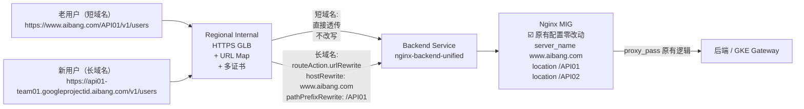
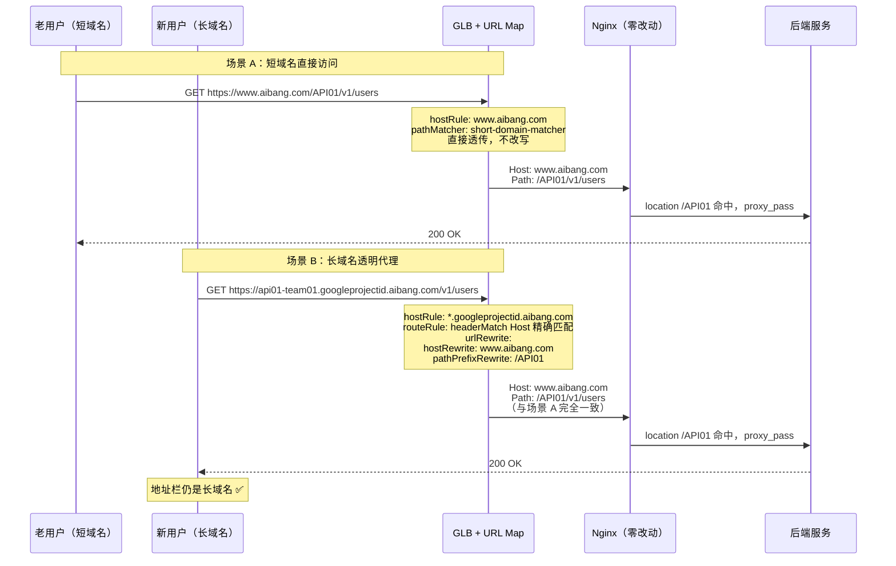

from [url-map-routeaction.md](./url-map-routeaction.md)
# GLB 透明代理生产实施手册：长短域名并存，地址栏不变，Nginx 零改动

> **核心需求（一句话）**：长域名进来 → GLB 边缘透明改写 Host+Path → Nginx 复用原有短域名 location → 客户端地址栏始终是长域名 → Nginx 配置零改动。
>
> **本文定位**：面向生产实施的完整操作手册，收敛此前所有探索文档的结论，给出可直接执行的 gcloud 命令和配置。

---

## 0. 架构全景图



### 请求效果对比

```
老用户（短域名）：
  请求:   https://www.aibang.com/API01/v1/users
  GLB:    不改写，直接透传
  Nginx:  Host=www.aibang.com  Path=/API01/v1/users  → 命中 location /API01 ✅
  用户:   地址栏 www.aibang.com ✅

新用户（长域名）：
  请求:   https://api01-team01.googleprojectid.aibang.com/v1/users
  GLB:    hostRewrite=www.aibang.com  pathPrefixRewrite=/API01
  Nginx:  Host=www.aibang.com  Path=/API01/v1/users  → 命中 location /API01 ✅
  用户:   地址栏仍是 api01-team01.googleprojectid.aibang.com ✅（透明代理，不跳转）
```

---

## 1. 环境变量（后续所有命令引用）

```bash
export PROJECT_ID="your-project-id"
export REGION="asia-east1"

# 现有资源名称（先查后填）
export HTTPS_PROXY="prod-ilb-https-proxy"       # 现有 Target HTTPS Proxy
export EXISTING_BS="prod-nginx-backend"          # 现有 Backend Service
export NGINX_MIG="nginx-mig"                     # 现有 Nginx MIG
export HC_NAME="nginx-https-hc"                  # 现有 Health Check

# 新建资源名称
export NEW_BS="nginx-backend-unified"
export URL_MAP_V2="prod-url-map-v2"
```

---

## 2. Step 1：查看现有 GLB 配置

> 先摸清家底，确认现有资源名称和参数。

```bash
# 2.1 查看所有 Target HTTPS Proxy
gcloud compute target-https-proxies list \
  --project=${PROJECT_ID} \
  --filter="region:${REGION}" \
  --format="table(name, sslCertificates, urlMap)"

# 2.2 查看现有 Proxy 详情（证书 + URL Map）
gcloud compute target-https-proxies describe ${HTTPS_PROXY} \
  --project=${PROJECT_ID} \
  --region=${REGION} \
  --format="yaml(urlMap, sslCertificates)"

# 2.3 查看现有 Backend Service 完整配置（作为新建参考）
gcloud compute backend-services describe ${EXISTING_BS} \
  --project=${PROJECT_ID} \
  --region=${REGION} \
  --format=yaml > /tmp/existing-bs-config.yaml

cat /tmp/existing-bs-config.yaml
# 重点关注: protocol, portName, healthChecks, timeoutSec, connectionDraining, backends

# 2.4 查看现有 URL Map（找到当前 Proxy 指向的 URL Map）
export OLD_URL_MAP=$(gcloud compute target-https-proxies describe ${HTTPS_PROXY} \
  --project=${PROJECT_ID} \
  --region=${REGION} \
  --format="value(urlMap)" | awk -F'/' '{print $NF}')

echo "当前 URL Map: ${OLD_URL_MAP}"

# 导出现有 URL Map 备份
gcloud compute url-maps export ${OLD_URL_MAP} \
  --project=${PROJECT_ID} \
  --region=${REGION} \
  --destination=/tmp/${OLD_URL_MAP}-backup.yaml
```

---

## 3. Step 2：GLB 绑定多个证书

### 3.1 创建证书

```bash
# 短域名证书（如果已存在则跳过）
gcloud compute ssl-certificates create short-domain-cert \
  --project=${PROJECT_ID} \
  --region=${REGION} \
  --certificate=./certs/www.aibang.com.crt \
  --private-key=./certs/www.aibang.com.key

# 长域名泛域名证书
gcloud compute ssl-certificates create long-wildcard-cert \
  --project=${PROJECT_ID} \
  --region=${REGION} \
  --certificate=./certs/wildcard.googleprojectid.aibang.com.crt \
  --private-key=./certs/wildcard.googleprojectid.aibang.com.key

# 验证
gcloud compute ssl-certificates list \
  --project=${PROJECT_ID} \
  --region=${REGION} \
  --format="table(name, type, subjectAlternativeNames, expireTime)"
```

### 3.2 更新 Proxy 绑定多证书

```bash
# ⚠️ --ssl-certificates 会覆盖原列表，必须把所有证书都写上
gcloud compute target-https-proxies update ${HTTPS_PROXY} \
  --project=${PROJECT_ID} \
  --region=${REGION} \
  --ssl-certificates=short-domain-cert,long-wildcard-cert \
  --ssl-certificates-region=${REGION}

# 验证
gcloud compute target-https-proxies describe ${HTTPS_PROXY} \
  --project=${PROJECT_ID} \
  --region=${REGION} \
  --format="yaml(sslCertificates)"
```

**GLB 多证书原理**：客户端 TLS 握手时发送 SNI → GLB 自动匹配证书 → 无需手动配置映射。

---

## 4. Step 3：创建新 Backend Service（参考现有配置）

```bash
# 4.1 创建新 Backend Service（参数参考 /tmp/existing-bs-config.yaml）
gcloud compute backend-services create ${NEW_BS} \
  --project=${PROJECT_ID} \
  --region=${REGION} \
  --protocol=HTTPS \
  --port-name=https \
  --health-checks=${HC_NAME} \
  --health-checks-region=${REGION} \
  --load-balancing-scheme=INTERNAL_MANAGED \
  --timeout=30 \
  --connection-draining-timeout=300 \
  --enable-logging \
  --logging-sample-rate=1.0

# 4.2 将同一个 Nginx MIG 添加为后端
gcloud compute backend-services add-backend ${NEW_BS} \
  --project=${PROJECT_ID} \
  --region=${REGION} \
  --instance-group=${NGINX_MIG} \
  --instance-group-region=${REGION} \
  --balancing-mode=UTILIZATION \
  --max-utilization=0.8

# 4.3 验证健康状态
gcloud compute backend-services get-health ${NEW_BS} \
  --project=${PROJECT_ID} \
  --region=${REGION}
```

> **为什么新建 BS 而不是复用旧的？**
> - 旧 URL Map + 旧 BS 继续服务，不受影响
> - 新 URL Map v2 + 新 BS 可以独立验证
> - 回滚时只需把 Proxy 切回旧 URL Map
> - 同一个 MIG 可以被多个 BS 引用，完全安全

---

## 5. Step 4：创建 URL Map（★ 核心配置）

### 5.1 映射关系规划

先固化映射表，后续维护只需更新这张表：

| 长域名 FQDN                               | GLB pathPrefixRewrite | Nginx 命中的 location | Priority |
| ----------------------------------------- | --------------------- | --------------------- | -------- |
| `api01-team01.googleprojectid.aibang.com` | `/API01`              | `location /API01`     | 10       |
| `api02-team02.googleprojectid.aibang.com` | `/API02`              | `location /API02`     | 20       |

### 5.2 生成完整 URL Map YAML

```bash
cat > /tmp/prod-url-map-v2.yaml << 'ENDOFFILE'
kind: compute#urlMap
name: prod-url-map-v2
description: "short domain passthrough + long domain transparent proxy via routeAction.urlRewrite"
defaultService: projects/YOUR_PROJECT_ID/regions/YOUR_REGION/backendServices/nginx-backend-unified

hostRules:
# 短域名：直接透传到 Nginx
- hosts:
  - "www.aibang.com"
  pathMatcher: short-domain-matcher

# 长域名泛域名：透明代理（urlRewrite）
- hosts:
  - "*.googleprojectid.aibang.com"
  pathMatcher: long-domain-transparent-matcher

pathMatchers:

# ============================================================
# 短域名 Matcher：直接转发到 Nginx，不做任何改写
# Nginx 原有 location /API01, /API02 等继续正常工作
# ============================================================
- name: short-domain-matcher
  defaultService: projects/YOUR_PROJECT_ID/regions/YOUR_REGION/backendServices/nginx-backend-unified

# ============================================================
# 长域名 Matcher：透明代理（★ 核心）
# 每个长域名一条 routeRule，做 Host + Path 改写后转发到 Nginx
# Nginx 收到的请求与短域名用户完全一致
# ============================================================
- name: long-domain-transparent-matcher
  defaultService: projects/YOUR_PROJECT_ID/regions/YOUR_REGION/backendServices/nginx-backend-unified
  routeRules:

  # ---- 长域名 API01 ----
  - priority: 10
    description: "api01-team01 transparent proxy to /API01"
    matchRules:
    - prefixMatch: "/"
      headerMatches:
      - headerName: "Host"
        exactMatch: "api01-team01.googleprojectid.aibang.com"
    routeAction:
      urlRewrite:
        hostRewrite: "www.aibang.com"
        pathPrefixRewrite: "/API01"
      weightedBackendServices:
      - backendService: projects/YOUR_PROJECT_ID/regions/YOUR_REGION/backendServices/nginx-backend-unified
        weight: 100

  # ---- 长域名 API02 ----
  - priority: 20
    description: "api02-team02 transparent proxy to /API02"
    matchRules:
    - prefixMatch: "/"
      headerMatches:
      - headerName: "Host"
        exactMatch: "api02-team02.googleprojectid.aibang.com"
    routeAction:
      urlRewrite:
        hostRewrite: "www.aibang.com"
        pathPrefixRewrite: "/API02"
      weightedBackendServices:
      - backendService: projects/YOUR_PROJECT_ID/regions/YOUR_REGION/backendServices/nginx-backend-unified
        weight: 100

  # 后续新增长域名，按 priority +10 递增...
ENDOFFILE
```

### 5.3 pathPrefixRewrite 路径拼接行为详解

```
matchRule:  prefixMatch: "/"
请求路径:   /v1/users?page=1

pathPrefixRewrite: "/API01"
替换逻辑:  "/" 被替换为 "/API01"
最终路径:  /API01/v1/users?page=1
                 ^^^^^^^^ ^^^^^^^^
                 新前缀    原 "/" 后的内容保留

pathPrefixRewrite: "/API01/"（带尾斜杠）
最终路径:  /API01//v1/users?page=1    ← ⚠️ 双斜杠！
```

> **⚠️ 建议**：`pathPrefixRewrite` 不要带尾斜杠，写 `/API01` 而不是 `/API01/`，避免双斜杠问题。PoC 阶段务必验证实际拼接行为。

### 5.4 替换变量 + 导入

```bash
# 替换占位符
sed -i '' "s/YOUR_PROJECT_ID/${PROJECT_ID}/g" /tmp/prod-url-map-v2.yaml
sed -i '' "s/YOUR_REGION/${REGION}/g" /tmp/prod-url-map-v2.yaml

# 检查替换结果
grep "backendServices\|projects" /tmp/prod-url-map-v2.yaml

# validate（不实际部署，只检查语法）
gcloud compute url-maps validate \
  --project=${PROJECT_ID} \
  --region=${REGION} \
  --source=/tmp/prod-url-map-v2.yaml

# 导入新 URL Map
gcloud compute url-maps import ${URL_MAP_V2} \
  --project=${PROJECT_ID} \
  --region=${REGION} \
  --source=/tmp/prod-url-map-v2.yaml

# 验证
gcloud compute url-maps describe ${URL_MAP_V2} \
  --project=${PROJECT_ID} \
  --region=${REGION} \
  --format=json | python3 -m json.tool
```

---

## 6. Step 5：切换 Proxy 指向新 URL Map

```bash
# 切换（原子操作）
gcloud compute target-https-proxies update ${HTTPS_PROXY} \
  --project=${PROJECT_ID} \
  --region=${REGION} \
  --url-map=${URL_MAP_V2} \
  --url-map-region=${REGION}

# 验证切换结果
gcloud compute target-https-proxies describe ${HTTPS_PROXY} \
  --project=${PROJECT_ID} \
  --region=${REGION} \
  --format="yaml(urlMap, sslCertificates)"
```

> **说明**：后续如果只是更新 URL Map 内部规则（增减 routeRules），直接 `url-maps import` 同名覆盖即可，不需要再次 update Proxy。Proxy 会自动感知 URL Map 内部变化。

---

## 7. Step 6：验证

### 7.1 获取 LB IP

```bash
export LB_IP=$(gcloud compute forwarding-rules list \
  --project=${PROJECT_ID} \
  --filter="region:${REGION}" \
  --format="value(IPAddress)" | head -1)
echo "LB IP: ${LB_IP}"
```

### 7.2 短域名验证（确认不受影响）

```bash
curl -k -v \
  --resolve "www.aibang.com:443:${LB_IP}" \
  "https://www.aibang.com/API01/v1/users"

# 期望：200 OK（或正常的后端响应）
# 不应有 301/302 redirect
```

### 7.3 长域名透明代理验证（★ 核心验证点）

```bash
# 不跟随跳转，查看 GLB 返回什么
curl -k -v \
  --resolve "api01-team01.googleprojectid.aibang.com:443:${LB_IP}" \
  "https://api01-team01.googleprojectid.aibang.com/v1/users"

# ✅ 期望结果：
# - 不是 301/302（透明代理，非跳转）
# - 返回正常后端响应（200/401/403 等）
# - 响应头中不应有 Location: https://www.aibang.com/...

# ❌ 如果看到 301/302 → 说明配置错误，用了 urlRedirect 而不是 urlRewrite
```

### 7.4 长域名 API02 验证

```bash
curl -k -v \
  --resolve "api02-team02.googleprojectid.aibang.com:443:${LB_IP}" \
  "https://api02-team02.googleprojectid.aibang.com/v2/orders"

# 期望：后端收到 Host=www.aibang.com, Path=/API02/v2/orders
```

### 7.5 在 Nginx 上验证收到的请求

```bash
# SSH 到 Nginx 实例，查看日志确认 GLB 改写后的 Host 和 Path
# 需要在 nginx.conf 中配置日志格式包含 $host $request_uri
tail -f /var/log/nginx/access.log

# 期望日志条目：
# 长域名请求: Host=www.aibang.com  Path=/API01/v1/users  ← GLB 已改写
# 短域名请求: Host=www.aibang.com  Path=/API01/v1/users  ← 原样透传
# 两者完全一致 ✅
```

---

## 8. Nginx 配置：确认零改动

### 8.1 核心结论

**Nginx 不需要任何改动**。原因：

1. GLB 已将长域名的 Host 改写为 `www.aibang.com`
2. GLB 已将路径加上短域名前缀 `/API01/...`
3. Nginx 收到的请求与老用户短域名请求**完全一致**
4. 原有 `location /API01`、`location /API02` 照常命中

### 8.2 Nginx 现有配置确认（保持不变）

**示例 1：API01**

```nginx
server {
    listen 443 ssl;
    server_name www.aibang.com;

    ssl_certificate     /etc/pki/tls/certs/public.cer;
    ssl_certificate_key /etc/pki/tls/private/public.key;

    location /API01 {
        proxy_pass https://gke-gateway.intra.aibang.com:443;
        proxy_set_header Host www.aibang.com;
        proxy_set_header X-Real-IP $remote_addr;
        proxy_set_header X-Forwarded-For $proxy_add_x_forwarded_for;
    }

    location /API02 {
        proxy_pass https://gke-gateway.intra.aibang.com:443;
        proxy_set_header Host www.aibang.com;
        proxy_set_header X-Real-IP $remote_addr;
        proxy_set_header X-Forwarded-For $proxy_add_x_forwarded_for;
    }

    location /healthz {
        access_log off;
        return 200 "OK";
        add_header Content-Type text/plain;
    }
}
```

> **不需要新增**：不需要长域名 server_name，不需要长域名 location，不需要 rewrite 规则。

### 8.3 如果 Nginx 之前有长域名 server block？

如果 Nginx 之前为长域名配置过独立的 server block，**现在可以安全移除**，因为长域名流量已经在 GLB 被改写为短域名语义，不会触发长域名 server_name 匹配。

---

## 9. 后续新增长域名的操作流程

每次新增只需 **3 步**，Nginx 不用动：

```bash
# Step 1：导出当前 URL Map
gcloud compute url-maps export ${URL_MAP_V2} \
  --project=${PROJECT_ID} \
  --region=${REGION} \
  --destination=/tmp/url-map-current.yaml

# Step 2：在 long-domain-transparent-matcher 的 routeRules 末尾追加
# 例如新增 api03-team03：
cat >> /tmp/url-map-append.yaml << 'EOF'
  - priority: 30
    description: "api03-team03 transparent proxy to /API03"
    matchRules:
    - prefixMatch: "/"
      headerMatches:
      - headerName: "Host"
        exactMatch: "api03-team03.googleprojectid.aibang.com"
    routeAction:
      urlRewrite:
        hostRewrite: "www.aibang.com"
        pathPrefixRewrite: "/API03"
      weightedBackendServices:
      - backendService: projects/YOUR_PROJECT_ID/regions/YOUR_REGION/backendServices/nginx-backend-unified
        weight: 100
EOF

# 手动将上述内容插入 /tmp/url-map-current.yaml 的 routeRules 列表末尾
# 然后替换变量

# Step 3：重新导入（热更新，无中断，不需要 update Proxy）
gcloud compute url-maps import ${URL_MAP_V2} \
  --project=${PROJECT_ID} \
  --region=${REGION} \
  --source=/tmp/url-map-current.yaml \
  --quiet
```

### 自动化生成（推荐生产使用）

维护一份映射表 CSV：

```csv
api01-team01.googleprojectid.aibang.com,/API01
api02-team02.googleprojectid.aibang.com,/API02
api03-team03.googleprojectid.aibang.com,/API03
```

用脚本生成 routeRules（参见 `poc-urlmap.md` 中的 Python 脚本），纳入 GitOps + CI/CD。

---

## 10. 回滚方案

```bash
# 一键回滚：把 Proxy 切回旧 URL Map
gcloud compute target-https-proxies update ${HTTPS_PROXY} \
  --project=${PROJECT_ID} \
  --region=${REGION} \
  --url-map=${OLD_URL_MAP} \
  --url-map-region=${REGION}

# 验证回滚成功
gcloud compute target-https-proxies describe ${HTTPS_PROXY} \
  --project=${PROJECT_ID} \
  --region=${REGION} \
  --format="value(urlMap)"
```

**回滚要点**：
- 不删除旧 URL Map（切换前始终保留）
- 不删除旧 Backend Service
- 回滚后长域名请求会走旧的默认行为（可能 502 或走 default backend）
- 短域名请求完全不受影响

---

## 11. 风险评估与 PoC 验证清单

### 11.1 已确认可行

| 项目                           | 状态                                   |
| ------------------------------ | -------------------------------------- |
| GLB 绑定多个证书               | ✅ 支持，SNI 自动匹配                   |
| 同一个 MIG 被多个 BS 引用      | ✅ 安全                                 |
| URL Map routeAction.urlRewrite | ✅ 支持 hostRewrite + pathPrefixRewrite |
| 短域名流量不受影响             | ✅ short-domain-matcher 直接透传        |
| Nginx 零改动                   | ✅ GLB 已改写 Host 和 Path              |
| 客户端地址栏不变               | ✅ urlRewrite 是内部改写，非 redirect   |

### 11.2 需要 PoC 验证

| 验证项                                                        | 验证方法                             | 风险 |
| ------------------------------------------------------------- | ------------------------------------ | ---- |
| `pathPrefixRewrite "/API01"` 是否产生双斜杠                   | `curl -v` 检查 Nginx 收到的 Path     | 中   |
| headerMatches Host 与 wildcard hostRule 配合                  | 发送长域名请求确认命中正确 routeRule | 低   |
| Nginx `server_name www.aibang.com` 是否接受 GLB 改写后的 Host | Nginx access.log 确认                | 低   |
| 后端应用是否依赖原始长域名 Host                               | 检查应用日志、CORS 配置              | 中   |
| 后端返回的绝对 URL 是否暴露短域名                             | 检查 Location、OpenAPI、HTML 链接    | 中   |

### 11.3 已确认的限制

| 限制                           | 说明                                                |
| ------------------------------ | --------------------------------------------------- |
| GLB 不支持动态变量提取         | 不能从 Host 自动拼 Path，每个长域名需一条 routeRule |
| routeRules 上限                | 每个 pathMatcher 最多 200 条（足够大多数场景）      |
| pathPrefixRewrite 只支持静态值 | 没有 `$1` 变量，没有正则捕获                        |

---

## 12. 完整请求流时序图



---

## 13. 实施检查清单

```
Phase 1: 准备
  [ ] 确认现有 HTTPS Proxy 名称、URL Map 名称、Backend Service 名称
  [ ] 确认 Nginx 现有 location path 列表（/API01, /API02 等）
  [ ] 准备短域名证书 + 长域名泛域名证书文件
  [ ] 确定长域名→短路径映射表

Phase 2: 部署
  [ ] 上传两个 SSL 证书到 GCP
  [ ] 更新 HTTPS Proxy 绑定两个证书
  [ ] 创建新 Backend Service + add-backend 指向原 MIG
  [ ] get-health 确认新 BS 健康
  [ ] 生成 URL Map YAML
  [ ] url-maps validate 通过
  [ ] url-maps import 导入
  [ ] target-https-proxies update 切换到新 URL Map

Phase 3: 验证
  [ ] curl 短域名 → 正常 200（不受影响）
  [ ] curl 长域名 → 正常 200（不是 301/302）
  [ ] Nginx access.log 确认收到 Host=www.aibang.com + 正确 Path
  [ ] 检查后端应用响应头无绝对短域名 URL 泄露
  [ ] 检查 CORS、Cookie、OpenAPI 页面兼容性

Phase 4: 生产就绪
  [ ] 建立映射表 Git 仓库
  [ ] 编写自动生成脚本（CSV → YAML）
  [ ] 配置 CI/CD pipeline（validate + import）
  [ ] 文档化回滚流程
```

---

## 14. FAQ

**Q: 为什么不用 301 redirect？**
A: 301 会让客户端地址栏变为短域名。对标准 API 来说，上下游域名不变是最佳实践。透明代理（urlRewrite）实现域名不变。

**Q: GLB 能不能一条规则搞定所有长域名？**
A: 不能。GLB urlRewrite 的 pathPrefixRewrite 只接受静态字符串，不能从 Host 中动态提取变量。每个长域名需要一条 routeRule，但可以用脚本自动生成。

**Q: 如果后续新增长域名，Nginx 需要改什么？**
A: Nginx 不需要改。前提是：新长域名要映射到的短域名 path 在 Nginx 上已经存在。只需在 URL Map 中加一条 routeRule。

**Q: routeRules 有上限吗？**
A: 每个 pathMatcher 最多 200 条 routeRules。通常足够。如果超过，可以拆分为多个 pathMatcher 或多个 Load Balancer。

**Q: 后续 URL Map 内部规则变了，需要 update Proxy 吗？**
A: 不需要。只要 URL Map 名称不变，`url-maps import` 覆盖即可，Proxy 自动感知内部规则变化。
