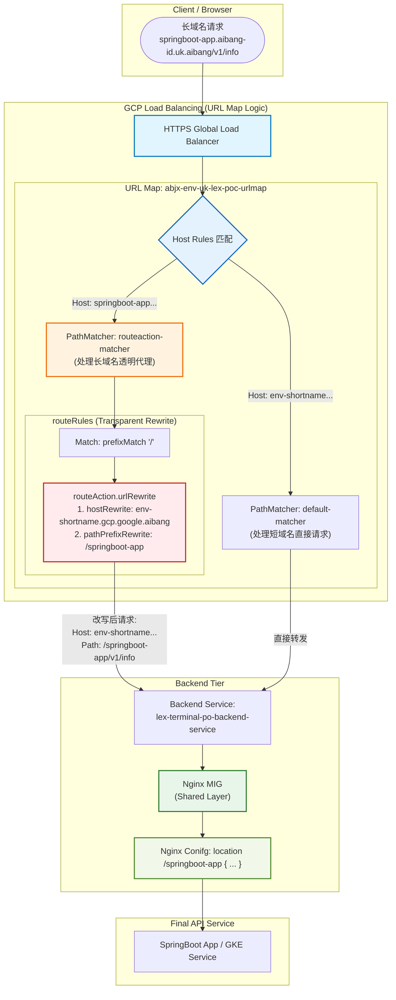

# GLB URL Map 长域名透明代理流量编排与逻辑流图

> **核心背景**：基于 GCP GLB URL Map 的 `routeAction.urlRewrite` 能力，实现长域名请求在不改变浏览器地址栏（非重定向）的情况下，在 LB 边缘透明改写为短域名 + 特定 Path 路径，并转发至后端 Nginx，从而实现 Nginx 配置的零改动与流量统一收敛。

---

## 1. 业务逻辑流程图 (Flow Diagram)

参考 Cloud Armor 隔离方案的风格，下图展示了长域名请求进入 GLB 后，如何经过 URL Map 的层级匹配与改写，最终到达后端。

---

## 2. 请求处理生命周期 (Request Lifecycle)

### 阶段 1：客户端发起 (Client Side)
*   **输入**：用户在浏览器输入 `https://springboot-app.aibang-id.uk.aibang/actuator/health`。
*   **状态**：浏览器地址栏保持此 URL。

### 阶段 2：GLB 边缘匹配 (URL Map Step)
1.  **Host 识别**：URL Map 识别到 Host 为 `springboot-app.aibang-id.uk.aibang`，命中对应的 Host Rule。
2.  **Matcher 转发**：流量进入 `routeaction-matcher` 处理块。
3.  **规则匹配**：命中 `priority: 10` 的规则（匹配 `/` 路径）。
4.  **透明改写 (Rewrite Action)**：
    *   **Host 替换**：将 HTTP 请求头中的 `Host` 从 `springboot-app...` 替换为 `env-shortname.gcp.google.aibang`。
    *   **Path 注入**：在原始路径前追加 `/springboot-app` 路径前缀。

### 阶段 3：后端转发 (Backend Forwarding)
*   **GLB 输出**：GLB 将改写后的请求（`Host: env-shortname...`, `Path: /springboot-app/actuator/health`）转发给 Backend Service。
*   **Nginx 接收**：Nginx 接收到的请求已具备短域名语义，直接命中原有的 `location /springboot-app` 配置块。

### 阶段 4：响应返回 (Response Loop)
*   **后端返回**：后端服务返回响应。
*   **浏览器接收**：客户端接收到数据，**地址栏域名依然是长域名**，实现了完全的透明性。

---

## 3. 核心优势总结

| 优势维度         | 说明                                                                                               |
| :--------------- | :------------------------------------------------------------------------------------------------- |
| **透明性**       | 客户端无需进行 301/302 重定向，避免了浏览器跳转带来的体验中断和 CORS 风险。                        |
| **Nginx 零改动** | Nginx 不需要维护成百上千个长域名的 `server_name` 或对应的 Rewrite 规则。                           |
| **集中管理**     | 所有的域名映射关系（Mapping）收敛在 GLB URL Map 中，通过 API 或脚本统一管理。                      |
| **多环境复用**   | 同一个 Nginx MIG 可以承载来自不同长域名的透明代理流量，只需在 GLB 层区分 Backend Service 或 Path。 |

---

## 4. 实施对照表 (Mapping Example)

| 原始长域名 (Browser)        | 改写后 Host (Internal) | 改写后 Path Prefix | Nginx 命中 Location         |
| :-------------------------- | :--------------------- | :----------------- | :-------------------------- |
| `springboot-app.aibang...`  | `env-shortname...`     | `/springboot-app`  | `location /springboot-app`  |
| `springboot-app2.aibang...` | `env-shortname...`     | `/springboot-app2` | `location /springboot-app2` |
| `api-team-a.aibang...`      | `env-shortname...`     | `/api-team-a`      | `location /api-team-a`      |

---

## 5. 运维注意事项
*   **证书绑定**：GLB 的 Target HTTPS Proxy 必须同时绑定所有长域名的泛解析证书或单域名证书。
*   **后端权重**：在 `routeAction` 中建议明确 `weightedBackendServices` 的权重为 100，以确保流量 100% 转发到目标 BS。
*   **双斜杠风险**：配置 `pathPrefixRewrite` 时，如果前缀为 `/springboot-app`，确保原始请求路径前缀 `/` 的处理逻辑不会产生 `//` 双斜杠。
